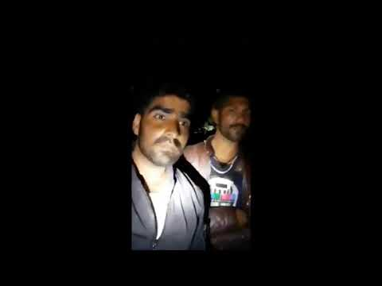
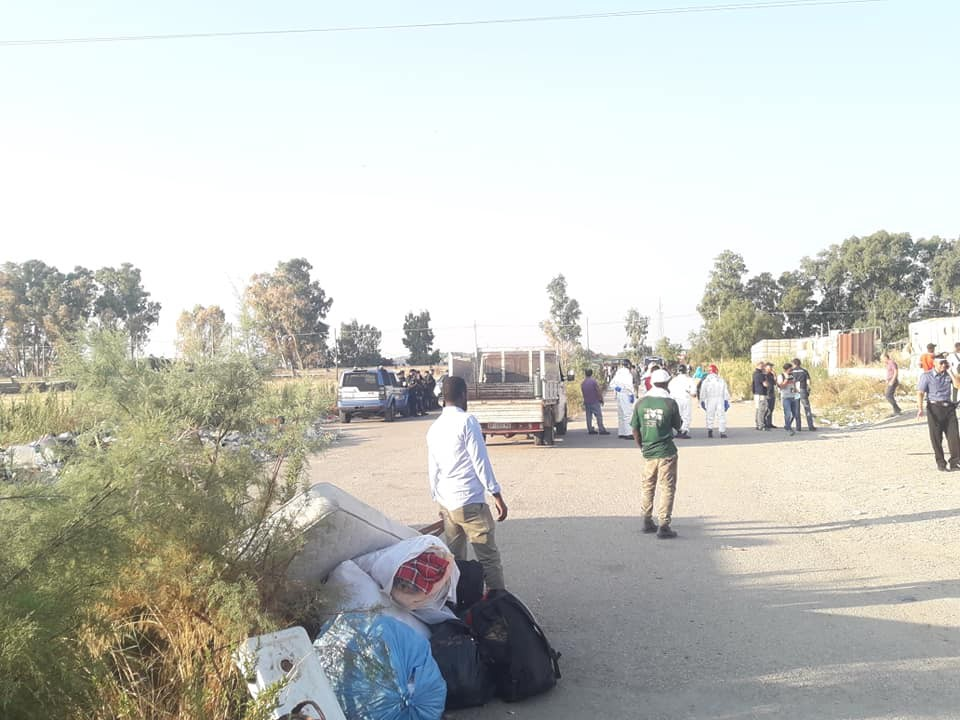
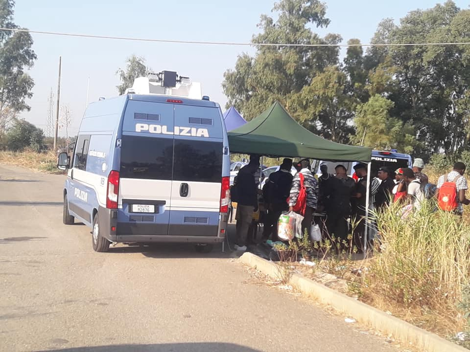

### AYS Daily Digest 28/8/19: “Pushback business” on the rise, perpetrators portrayed as heroes
#### Documented incidents of police shooting at people during illegal collective expulsions from Croatia to Bosnia and Herzegovina / Italy: 500 people evacuated without alternative solutions / France: The International Day of the Disappeared conference and public gathering / Ireland: Fighting for public transport for school children

 \)](assets/129ccf28feb9/1*1CzDbgPzEQgFWq9v58MXew.jpeg)

Lesvos, Greece — “They say a picture is worth a thousand words\. Here are newly arrived people who didn’t fit into Moria camp, sleeping on the ground along one of the camp alleys” \(Photo by Aref, via [Refocus Media Labs](https://www.facebook.com/refocusmedialabs/?tn-str=k%2AF&hc_location=group_dialog) \)
#### FEATURED

Croatia — After years of anti\-immigrant propaganda from the highest instances such as the President and the Minister of Interior, mainstream media outlets in Croatia have turned from investigating potential human rights violations to writing lifestyle articles about border vigilantes and those who are profiting from pushbacks\. Today, the well\-known newspaper, Jutarnji list, has published a [story about the local businessman](https://bit.ly/2ztYezg) who is renting out vacation houses to border police officers, naming him “the most dexterous local caterer who has turned to police tourism”\. In the article, he boasts that he houses up to 200 officers at once and “gets paid well per capita”\. His facilities are in Grabovac \(14 bungalows with an average capacity for housing 8 people\) and Korenica \(2 houses for 60 people\) \. Next week he plans to expand his accommodation capacities to well over 200 beds: 14 new houses with 112 beds for police officers will be introduced in Vranovača near Korenica\.

**At this moment, no one is even hiding that the officers are staying in these private accommodations in Lika county in order to patrol and expel migrants\. Most of the other media outlets have uncritically shared this story, praising his business skills and portraying him as a witty character\.**

A few days before this, a [big reportage](https://bit.ly/2NC8w8Q) from the border was published in the other major Croatian newspaper, Večernji list\. Their journalist, well known for **spreading anti\-migrant propaganda** and publishing an interview with Bashar al\-Assad whom he openly admires, has spent a day with “migrant chasers” from Slovenia\. The title “The hunt for migrants: my wife, kids and I are overseeing the border because police are not doing their job well” was also **uncritically published** on the front page of the newspaper and shared widely\. Such ignorant attitudes in the Croatian media is no novelty\. In 2017, they made a national icon of a stray dog, Candy, who was turned into a “migrant sniffer” by Croatian border police and deployed at the Bajakovo border crossing\. She was even awarded a medal at the central celebration of Police Day, which was live streamed on most of the local TV channels\. However, the increase in cruelty has been on the rise in a big way recently and can be connected to public opinion that migration is something “to be dealt with”\. Encouraged by such articles, small groups of citizens have started forming online groups in which they discuss organising vigilante “migrant hunting” groups themselves\. They mostly **see police officers who are beating up and expelling people with no due procedure as heroes** \.

> In this context, it will be extremely hard to report such groups\. To whom? To the police? 

At this moment, people on the move have reason not only to be afraid of police officers, but also of some local Croats\. And this leads to new tragedies such as the recent drowning of a mother whose kids were sitting in our integration center in Zagreb today\. Being very young, they are still not able to completely understand that their mother has been lost for good in a smuggler van that sunk in the Kupa River after a police pursuit\. There were no reports of the family tragedy in the Croatian media\.

> As opposed to the emotional discourse when they’re reporting about “migrant chasers”, in this case most of the journalists have completely dehumanised the victim, mentioning only “one dead illegal migrant in the group of 11”\. 

#### SEARCH AND RESCUE

[MSF](https://twitter.com/MSF_Sea/status/1166652005441515520?fbclid=IwAR2so7T7bxWX5TljcMnJelSub-HnyN5AD49fCM7pohFpaaTXV57FHQS7TQw) reports: _“UPDATE: OceanViking has docked in Marseille yesterday for a change of crew & resupply\.”_

Yet the [Mission Lifeline](https://twitter.com/SEENOTRETTUNG/status/1166651161593679872) ship “Eleanor” is still not allowed to disembark on Malta, while the did [receive food supplies](https://twitter.com/datt_thomas) earlier on Wednesday\. The rescue mission released a statement today:

> We recognize the valuable contribution of Malta in providing sanctuary for people fleeing war in Libya\. However, we are not in a position to manage a prolonged stand\-off and, in order not to unduly burden you, we ask for urgent diplomatic intervention to disembark our guests\. As a German organisation we are in contact with our flag\-state to encourage a swift and humane solution for the 101 people on board, based on EU solidarity and responsibility\-sharing\. Our overwhelming priority is their well being, along with an effective, humanitarian outcome\. 

[MSF](https://twitter.com/MSF_Sea/status/1166645732822126592?fbclid=IwAR1nANMw2gSkg1TpfUzobSgB0Dv_9-WH1vE1k0tFUv6saaeZTL1hXG2R4Fo) reported from Khoms today about treating the 22 survivors of yesterday’s awful shipwreck\. For some, they treated burns from being in the the saltwater and fuel mixture, for others, they could only provide body bags\.

■■■■■■■■■■■■■■ 
> **[Alarm Phone](https://twitter.com/alarm_phone) @ Twitter Says:** 

> > Yesterday a migrant group called us in distress at sea and dozens died. We will probably never find out how many lives were lost or what their names, stories, and dreams were. Many families &amp; friends will never know for certain where their loved ones are. [aljazeera.com/news/2019/08/f…](https://www.aljazeera.com/news/2019/08/forty-people-feared-dead-boat-capsizes-libya-190827135249274.html) 

> **Tweeted at [2019-08-28 09:55:47](https://twitter.com/alarm_phone/status/1166650576085684224).** 

■■■■■■■■■■■■■■ 

Good news? Lots of rescues also happened on Wednesday:

→ [More than 200](https://twitter.com/ACNURspain) people were rescued today and and 135 were brought to the port of Málaga with the help of Salvamento Maritimo\. [Two](https://twitter.com/luciamunozluc) of the boats carried 65 people and 67 people, respectively\.

→ [The ES Spica](https://twitter.com/CGTsalvamento) \(Almeria\) crew also rescued 77 people\.

→ The [ship MareJonio](https://twitter.com/RescueMed/status/1166617662685896704) from Meditereanea Saving Humans rescued 100 people, including eight pregnant women
#### GREECE

The number of people on Lesvos is unprecedented\. [Benedicte Giæver](https://reliefweb.int/report/greece/urgent-action-needed-greece-save-lives-winter-sets?fbclid=IwAR0FSWR8OGx9zRgYlR4N4YMKjI9riBmQgoQp-bUQ92N4W289qqS37zxJ4HM) , Executive Director of NORCAP, is cautioning against the imminent winter:

> “Our experts are comparing the current camp conditions to the one at the beginning of the crisis in 2015\. There is a huge lack of accommodation, health facilities, even proper food\. The frustration among the asylum seekers is at the **tipping point** \. People are crammed into huge tents, afraid for their safety, not knowing the person sleeping next to them at night\. Despite the EU having provided funding to the Greek government for support in this crisis, it is not enough with the huge number of arrivals we have now,” Giæver says\. 

■■■■■■■■■■■■■■ 
> **[RSA](https://twitter.com/rspaegean) @ Twitter Says:** 

> > Nearly 10000 refugees and migrants live currently inside and outside the overcrowded Moria camp on Lesvos #opentheislands #stopthetoxicdeal #refugeesGr https://t.co/vmkzFynvtW 

> **Tweeted at [2019-08-28 13:39:12](https://twitter.com/rspaegean/status/1166706801666142209).** 

■■■■■■■■■■■■■■ 

[After the death](https://www.icj.org/death-of-a-15-year-old-boy-in-greek-reception-centre-after-failure-to-implement-protection-measures/?fbclid=IwAR240d5xpfrn7CuUfafzbGlWZmQU0KpSlXuaRS9ypL3nGa8nmRdwuLtE-LM) of a 15\-year\-old boy in Moria, the International Commission of Jurists is calling on the Greek government to recognize the need to _“implement the measures of protection prescribed to Greece this May by the European Committee on Social Rights\.”_ The boy died after a fight broke out in the camp, where two other boys were injured\. ICJ Legal Adviser, Karolína Babická said:

> “It is unacceptable that the decision on interim measures has not yet been implemented by the Greek government and now we have to witness such tragic events as the death of a child in the camp” 

The World Organization Against Torture \(OMCT\), Refugee Rights Europe \(RRE\) and the Greek Helsinki Monitor \(GHM\) also released a joint statement on the killing, and urge the Greek government to undertake an impartial investigation\. You can find the statement [here](https://greekhelsinki.wordpress.com/2019/08/27/2-81/?fbclid=IwAR240d5xpfrn7CuUfafzbGlWZmQU0KpSlXuaRS9ypL3nGa8nmRdwuLtE-LM) \.

The EU is standing by their view that the conditions at the camps are Greece’s doing, considering they’ve been given €2 billion of EU aid\. An EU Commission spokesperson said that migration operations are supported financially by the EU, but the management is controlled by Greece\. See more [here](https://euobserver.com/migration/145757?fbclid=IwAR3oDaGQMTbHYntKS1teiSJYFQ1UwnxkMN9Kqcr7Gjd65DPq5lqRRMpdpP8) \.
### Missing official information on the Aegean islands

At the same time [Aegean Boat Report](https://www.facebook.com/AegeanBoatReport/photos/a.285312485325196/638328086690299/?type=3&theater) is telling us the Greek Government has stopped reporting on the number of arrivals, transfers and total population data for the Greek Aegean Islands\.

> “What we do know is that arrivals are rapidly increasing, population on the islands is higher than ever, and transfers to mainland are historically low\. Is it the intention to hide these facts?” 

Aegean Boat Report also released their last two Weekly Reports, but warn that with the lack of reporting from the Greek government, ABR’s reporting could become less accurate\. UNHCR is also somewhat secretive with their numbers, which unfortunately means that accurate reporting on the Aegean Islands will suffer\. You can find the reports [here](https://www.facebook.com/AegeanBoatReport/posts/638566353333139?hc_location=ufi) \.
### Athens

[In an update](https://www.facebook.com/nobordersnetwork/photos/a.660787423989153/2445010245566853/?type=3&theater) on the people evicted on Monday from Exarchia, the 134 people are said to be sent to the camps in of Eleonas, Skaramangas, Thiva, Lavrio, Koutsochero and some in northern Greece, which have not been identified\. People were ripped from their homes, in which they were trying to make do, only to be sent back to refugee camps in the name of “cleaning the streets” \(see Monday’s digest\) \.

![“ This morning at 8 am they woke us up and they took us to Sakaramagas camp\. We had to pick up our bags once again, for the third time since we got evicted\. When we arrived to the camp they informed us that we had to wait for another bus to move us to several different camps around Greece\. Most of us had to move to places around Thessaloniki, over 400 km from here\. We don’t want to do that\. They are playing with us\.
They have evicted us from our house and they have destroyed it, but they will not also take away the life we have managed to create here in Athens\. **Our children are going to the school in Exarcheia and we refuse to make them leave it and have to adapt to a new place once again\.** We want to stay here\. We answered them that we will not go anywhere against our will\.
We keep strong\.” Photo by [Spirou Trikoupi 17](https://www.facebook.com/spiroutrikoupi17/posts/712610879185715?hc_location=ufi)](assets/129ccf28feb9/1*aWEvi2uIvPgcswp81lfbsQ.jpeg)

“ This morning at 8 am they woke us up and they took us to Sakaramagas camp\. We had to pick up our bags once again, for the third time since we got evicted\. When we arrived to the camp they informed us that we had to wait for another bus to move us to several different camps around Greece\. Most of us had to move to places around Thessaloniki, over 400 km from here\. We don’t want to do that\. They are playing with us\.
They have evicted us from our house and they have destroyed it, but they will not also take away the life we have managed to create here in Athens\. **Our children are going to the school in Exarcheia and we refuse to make them leave it and have to adapt to a new place once again\.** We want to stay here\. We answered them that we will not go anywhere against our will\.
We keep strong\.” Photo by [Spirou Trikoupi 17](https://www.facebook.com/spiroutrikoupi17/posts/712610879185715?hc_location=ufi)
#### BOSNIA AND HERZEGOVINA
### “I’ll shoot you\!”

On 6 August, an incident was documented at the border close to Velika Kladuša, where the residents living nearby filmed a van from the Croatian police leaving the scene where they reportedly drove, left, threatened and shot in the air to scare people who were trying to enter the country\. The border police officers threatened one of the people who was standing on the edge of a canal, about ten meters deep, by a forest in the Velika Kladuša area\. Moments later, other people were brought from the police van and ordered to be placed on the edge of the canal\. According to the witnesses, a Croatian police officer picked up a gun and fired several shots into the air\. The people involved then jumped into the canal, at the foot of which is the border with Bosnia and Herzegovina\.

The [media](https://zurnal.info/novost/22357/hrvatski-policajci-pod-prijetnjom-oruzjem-guraju-migrante-u-jarugu) who published this also collected documents that connect and prove that the same people who had earlier on been transferred from Slovenia to Croatia via readmission were later on pushed back to Bosnia and Herzegovina from Croatia through an illegal practice of collective expulsion, a constant practice of the Croatian border police who acts with support and funds of the EU\.
#### ITALY
### Evacuation at ex Felandina left 500 people evacuated without alternative solutions

As we [reported](ays-daily-digest-23-08-2019-swiss-court-suspends-dublin-deportation-to-croatia-2752c189e7c3) earlier, the treating of a permanent condition as an emergency underlines the incapacity of the local authorities to solve the situation and their unwillingness to treat migrant workers according to the law, which would mean recognising their rights\.

](assets/129ccf28feb9/1*rYhqyY26fw6rNOxMx6Nn5A.jpeg)

Photos: [Yvan Sagnet](https://www.facebook.com/sagneyvan?__tn__=%2Cd%2AF%2AF-R&eid=ARBGEB0ey0z1-ZkI5TRJg8x-8IbLwvFA8Q2WLdOXLILcAek8yiFxwAPn8efP8A1bEGLVlYiZpyW_61m3&tn-str=%2AF&hc_location=group_dialog)
#### FRANCE

Together with other organisations, on the occasion of the The International Day of the Disappeared, [AMDH Paris IDF Association Marocaine des Droits Humains — Section Paris/IDF](https://www.facebook.com/AmdhParis/?__xts__%5B0%5D=68.ARCyA2J9rmkh1PmOmIYVJnJjlhmlz6MnK8IEYCJKr9eiYnUBI2feqWYaouOn7OKcH7esx6ZixTiK3dxGehYVUzswGmQ1EHUMKvN9_cQN12wuJ_rZxX1XIDD3GqdGicTkRd_TXWf8WN6-XBXGZhgjzdecJow1N4GZegru6EWnCHqji0aVWRFiuKPS7oIoXJGrCSJC0JtesHJLYDFLQ6JsvOUw2fpcZGC28TjyE4wzmy7d4oNTBqZ2LWkeYjSvKhdQj-49cy9pfUYIRhYnTQ6a6_jg1gJ2SfIPXp_pFFJSlPIPOcFAj5jPjvDM0OU0aBhHhFVjIjhD6BjPBZFxCXddk_21rw&__tn__=k%2AF&tn-str=k%2AF) is organising a debate conference this Friday, 30 August, from 6:30 to 10 pm, at the Amnesty International France \(address: 72–76 Boulevard de la Villette, 75019\) \. See their event link for more info\. 
They are also organising a gathering in support of the disappeared people, on Saturday, the 31st, at the place de la République, from midday onwards\.

#### IRELAND

After one of the reception centres in Dublin was closed, one of the families who had been moved 12 kilometers away from the city is struggling to keep their child in their old school, Irish [media](https://www.rte.ie/news/education/2019/0828/1071304-school-bus/?fbclid=IwAR13fSceBomVO4Vpb4rxJn9TQ_h67lO01pP5yLdsqx7Sp_K_p-HBzfI4PJM) have reported\. As some of the parents are afraid to speak out publicly because as asylum seekers they feel too vulnerable, one mother agreed to speak out, on the record\.

> “You know that you are saying the truth but you feel that you have to be submissive”, she says\. 

> “The only thing that the kids can hold on to is their school\.” The families say the current arrangements are impossible for their children\. 

After having promised the children would be provided bus transport to school, the department spokesperson is now hesitant to confirm this will actually happen\. The children are to start school on Thursday\.

**We strive to echo correct news from the ground through collaboration and fairness\. Every effort has been made to credit organisations and individuals with regard to the supply of information, video, and photo material \(in cases where the source wanted to be accredited\) \. Please notify us regarding corrections\.**

**Apart from daily news in English, we also publish weekly summaries in Arabic and Persian\. Find specials in both languages on our [medium site](https://medium.com/are-you-syrious/ays-weekly-in-arabic-and-persian/home?source=post_page---------------------------) \.**

**If there’s anything you want to share or comment, contact us through Facebook, Twitter or write to: areyousyrious@gmail\.com\.**

_Converted [Medium Post](https://medium.com/are-you-syrious/ays-daily-digest-28-8-19-pushback-business-on-the-rise-perpetrators-portrayed-as-heroes-129ccf28feb9) by [ZMediumToMarkdown](https://github.com/ZhgChgLi/ZMediumToMarkdown)._
