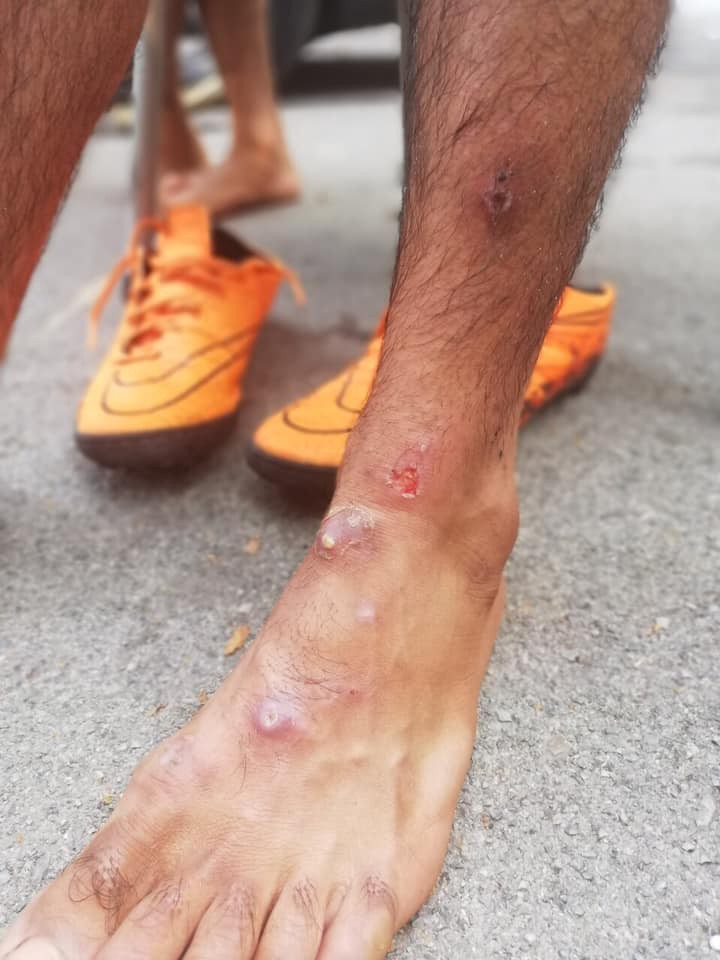
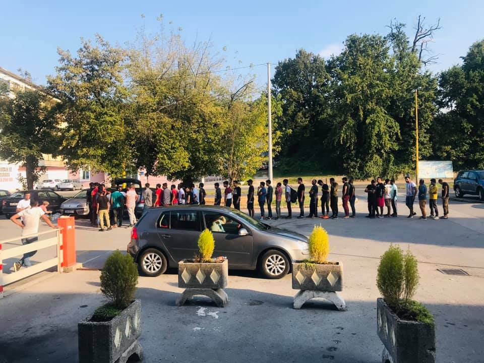
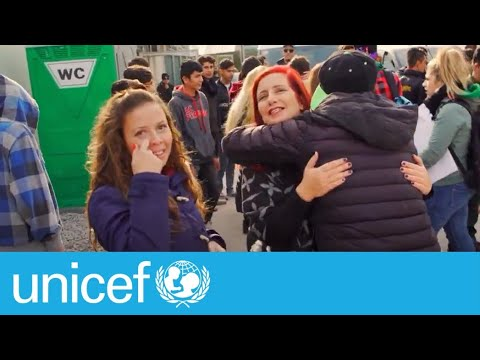

### AYS Daily Digest 29/8/19: Tuzla is 16 months without major help
#### More and more unaccompanied minors in Greece / Open Arms released / Desperate appeal from Libya

](assets/e3516cf1fd13/1*4-FZPWCC1KULa_lnFpq0kg.jpeg)

Photos by: [Senad Cupo](https://www.facebook.com/profile.php?id=1032645245&fref=gs&__tn__=%2Cd%2AF%2AF-R&eid=ARAW28Pu6wxQmySwk11Gp9_bYPXae8UoXao2XrjfQh3FH35EbsQ590TJQHVNRUb0BNMy9xPOsCO2xLzd&tn-str=%2AF&dti=144469886266984&hc_location=group_dialog)
#### FEATURED
### Tuzla: 16 months Without Help of the Authorities and International Organizations

It’s been 16 months that a group of citizens has been supporting people in tranzit through Tuzla, while no consistant or organized \(or any\) assistance has been provided by the authorities, international, or national organizations\. It is evident the people must stop in Tuzla in order to obtain a document that allows them to stay in Bosnia and Herzegovina for 14 days, during which they usually try to reach one of the reception centers/camps in the west part of the country\. The same continues to happen with a surge of arrivals during the summer months\. Many young people, including children and unaccompanied minors, are stranded in different difficult situations across the country and Tuzla is the place they come to first\.

There is still no accommodation \(nor facilities that would be used as a welcome place for people to have some rest\) \. A potential health risk emerges as people wait around the Foreigners’ Office without toilets or showers provided to them\. With each issue that arises, the local authorities respond by ignoring them or by repeating the same negative rhetoric that goes against any systematic approach to the problem\. Unfortunately, as the Federal government hasn’t shown any initiative to bring about concrete solutions and provide a humane reception system for the people on the move\. According to the volunteers’ accounts, each effort to leave relevant information for people in Arabic, Urdu, Pashto, English or other languages ends up being taken off of the info boards and walls\.

Since June this year, the local Red Cross has been distributing lunch packages to newly arrived people, and afterwards, the Imaret food organization distributes a meal\. During the workdays volunteers distribute food at the bus station Tuzla\. Often they lack food because of the rising number of people\. About 200 meals daily are distributed by the volunteers, who also prepare food during the weekend at their homes\. Daily distribution of clothes, sleeping bags and other needed items is also done by them alone, with constant need for sport shoes and sleeping bags, among other things\.

Medical care is provided by the few medical professionals among the volunteers, while more serious injuries are treated at the ER or hospital in Gradina\. You can support them here:

The people who invest their time and money in order to help people on the move also spend a lot of time with them, talking, listening to their stories, sharing in order to restore a bit of dignity to these people\.

Media coverage nationally is mostly negative towards people on the move, fueling the largely negative and hate speech; similar rhetoric also targets the self\-organized groups of locals systematically helping people in transit\. In spite of the image this type of public speech and media coverage imparts, the general attitude of people from Tuzla is positive, with understanding towards people on the move and interest to help them within their limited means\. The occasional offers for help from foreign activists or visits from groups have so far been taking up a lot of energy and time from those already engaged in direct helping\.

For the sake of efficient fieldwork, our recommendation is to familiarize with the current situation on the ground and make an assessment as to which kind of help would be most necessary\. For example, while somewhere \(in an organized system of volunteering NGOs etc\. \) a pair of hand would be helpful, somewhere else it is better to collect funds or help in kind in order to support the existing systems which might not be able to accomodate and care for additional volunteers and to introduce someone to the complex situation in order for the person to volunteer for a few days\. Also, in order to foster relationship with the locals, while at the same time providing maximized services for those who need them, if you plan to send aid, please first explore all possible means of purchasing things in Bosnia and Herzegovina as that is surely the most efficient, easy, and ultimately cheapest way to get most for what you invest, at the same time supporting the local economy\. They do need help, but taking up two days of the volunteers’ time in order to leave a bit of aid \(that will be gone in an afternoon\) is probably not worth the while\. In that case it’s better to consider donating for the medical needs or exploring ways to contribute where you live, and to put pressure on your politicians and demand responsibility also from your representatives to BiH\.

With the coming months, winter will only, once again, exacerbate the severe situation people on the move in Bosnia and Herzegovina are in, and a change is desperately needed\.

](assets/e3516cf1fd13/1*4-FZPWCC1KULa_lnFpq0kg.jpeg)

Photos by: [Senad Cupo](https://www.facebook.com/profile.php?id=1032645245&fref=gs&__tn__=%2Cd%2AF%2AF-R&eid=ARAW28Pu6wxQmySwk11Gp9_bYPXae8UoXao2XrjfQh3FH35EbsQ590TJQHVNRUb0BNMy9xPOsCO2xLzd&tn-str=%2AF&dti=144469886266984&hc_location=group_dialog)
### **Greece: More and More Unaccompanied Minors in Greece**

Unicef [addresses](https://www.unicef.org/press-releases/more-1100-unaccompanied-refugee-and-migrant-children-greece-need-urgent-shelter-and) an alarming development in Greek camps\. According to the UN’s body for child protection, the number of unaccompanied and seperated minors has exceeded 1100\. It is the largest number since the beginning of 2016\.

Following a violent incident with one dead child and two injured in Moria last weekend, Unicef Regional Director for Europe and Central Asia and Special Coordinator for the Refugee and Migrant Response in Europe, Ms\. Afshan Khan [stated](https://www.unicef.org/press-releases/more-1100-unaccompanied-refugee-and-migrant-children-greece-need-urgent-shelter-and) , “that the situation in Reception Centres in Greece is at a breaking\-point\.” She urges the Greek government to transfer children to mainland and provide adequate accomodation\. She added:

> “It is vital that European Governments increase pledges to relocate unaccompanied and separated refugee and migrant children, and fast\-track family reunifications for those who already have relatives in Europe\.” 

While Moria is only designed for maximum 3000 people, currently some 8700 are forced to stay in the camp — 3000 children alone\. “ ‘Section B,’ including the adjacent area, has room for 160 unaccompanied children, but now has more than 520,” Unicef explains\. Of the more than 32000 children in Greece, 4000 are unaccompanied or seperated from their families\.

Meanwhile, Aegean Boat Report today [counted](https://www.facebook.com/AegeanBoatReport/posts/639192283270546?hc_location=ufi) 13 boats with more than 500 people landing at Skala Sykamineas within 30 minutes: “\[The\] last time this happened was in 2015\.” MoChara guided the boats to a safe landing spot, where Lighthouse volunteers welcomed them\. A total of 650 people arrived today\.

Activist Arash Hampay [reports](https://twitter.com/AHampay/status/1167015614269054976?fbclid=IwAR091z2rrKT7w_NPJ7iwt1ZnI4BvXcpi9XJETgI2B7Z73nHpbBcZpC4A4h0) that several people were kicked out of the train from Larissa station in Athens to Malakasa, because they did not have a ticket\. “Before they could travel for free,” he said\.
#### Sea: Open Arms Released

The Open Arms of the Spanish NGO ProActiva has been released today\. According to [adnkronos,](https://www.adnkronos.com/fatti/cronaca/2019/08/29/migranti-sbarco-open-arms-fermati-due-presunti-scafisti-siriani_Z4GkeitzOMO5UyQnAZy5QL.html?fbclid=IwAR1VdM4gvTXSTEGPzeBk_OpQNjrSAughjlYOsUkRdhuGFFbsT63ZQMUO2sM) the prosecutor’s office said it was Italy’s obligation to find a safe harbor under the Dublin agreement\. At the same time, two people were arrested, accused of aiding illegal migration\. Allegedly, they were the drivers of the boat, which was rescued by the Open Arms\.

On the other hand, Mare Jonio did not receive permission to enter Italian waters, even though they have 100 people on board \(40 children\) and waves are up to two meters tall, [writes](https://video.repubblica.it/dossier/migranti-2019/la-mare-jonio-chiede-riparo-a-lampedusa-la-capitaneria-non-siete-autorizzati/342492/343082?ref=fbpr&videorepmobile=1&fbclid=IwAR12VwZugFUUBRw2dSqT888G59-8ZZTxC8y1aSz1WblthzU9HDNSbmpmMPw) Re Pubblica\. Only women, children and sick people were allowed to disembark, meaning 34 people [are left](https://mediterranearescue.org/en/news-en/eventually-all-children-pregnant-women-and-the-weakest-rescued-people-were-let-disembark-now-34-people-are-remaining-on-board-tossed-by-high-waves-let-us-all-disembark/?fbclid=IwAR0ghDG4wRQQo3aCPIp0srtSc8T9LAzDd89RsvCeqxGR4WZ2Y7FFNZ_3P4U) behind\. What the Capitaneria di Porto told the captain to do is to go 13 miles north of Lampedusa — not in Italian waters — and find shelter there, stating again that the vessel has no permission to enter Italian waters\. While Interior Minister Matteo Salvini is not in power anymore, his decree is still valid, until a new minister withdraws it\. Also people on board of the Eleonore are still waiting to disembark with less than 1m² space per person\.

At the same time, Pilotes Volontaires is [challenging](https://www.facebook.com/pilotesvolontaires/photos/a.196634897620529/429919087625441/?type=3&theater) a ban of their Hummingbird airplane\. Until a descision is made, their air observing mission needs to be suspended\.

In Malaga, 132 people were [disembarked](https://twitter.com/asnerp/status/1166974097210916864) by Salvamento Maritimo\.
#### Libya: Desperate Appeal

**We strive to echo correct news from the ground through collaboration and fairness\. Every effort has been made to credit organisations and individuals with regard to the supply of information, video, and photo material \(in cases where the source wanted to be accredited\) \. Please notify us regarding corrections\.**

**Apart from daily news in English, we also publish weekly summaries in Arabic and Persian\. Find specials in both languages on our [medium site](https://medium.com/are-you-syrious/ays-weekly-in-arabic-and-persian/home?source=post_page---------------------------) \.**

**If there’s anything you want to share or comment, contact us through Facebook, Twitter or write to: areyousyrious@gmail\.com\.**

_Converted [Medium Post](https://medium.com/are-you-syrious/ays-daily-digest-29-8-19-tuzla-is-16-months-without-major-help-e3516cf1fd13) by [ZMediumToMarkdown](https://github.com/ZhgChgLi/ZMediumToMarkdown)._
