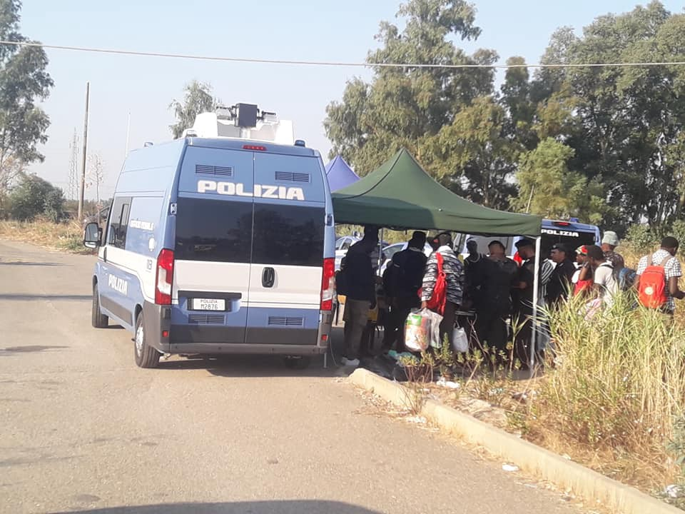
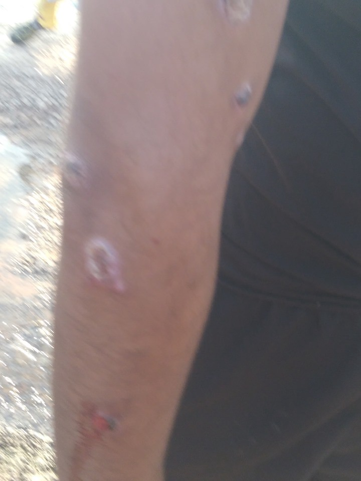

### AYS Daily Digest 30/08/19: “Abandonment” in Camps, Symptomatic or Intentional?

_Reflections on the situation across camps // Syria cease\-fire? // Medical emergencies on Kos // Syrians no longer granted automatic asylum in Sweden // More…_

Police clear an informal settlement in Italy\. Credit: Yvan Sagnet
#### FEATURE

Legal Centre Lesbos [posted a powerful analytical piece](http://legalcentrelesvos.org/2019/08/30/a-new-concentration-camp-model-moria-lesvos-europe/) on the situation in Moria camp\. In light of another minor losing their lives to stabbing, the horrific situation inside the camp was again brought to light\.

> “The Greek government and the European Union qualify refugees who arrive here as crazy and as criminals\. This is far from the reality, but the conditions of the camp have made people lose their minds, without structure, without the possibility of advancing or being able to regain control of their lives\. It is the strategy of the powerful to strip them of their humanity\. 

> Dear European citizens: these people don’t want to die, they don’t want to kill or hurt each other\. They have escaped war, death, and violence\. They are asking for asylum to live, not to die \! \! \! \! 

> They do not know that they are experiencing a new concentration camp model\. 

> Once they arrive here they find extreme conditions, 12 hours of queue to get a plate of food, one tent to share between 3–4 families, stacked one above the other, sleeping in extreme weather conditions\. 

> They do not know what the future that awaits them holds and there is no one to listen to them and recognize their dignity as humans\. 

> We really don’t know how we can help them, when the police refuse to take any action \(and make it almost impossible to file a complaint, considering them scum\); UNHCR’s doors and meetings are closed to the refugees themselves; NGOs are silenced by the threat of being accused of human trafficking; without a medical team prepared with sufficient doctors, psychologists, psychiatrists, educators or social workers\. Constant calls for help from refugees to all entities… walking in circles, like a fish that bites its own tail, without anyone really getting them out of this hell\.” 

It should be known that although LCL calls this a “new” model for a concentration camp, it is actually quite a longterm strategy\. In Razack’s “Casting out: the eviction of Muslims from Western Law and Politics” she defines a camp as a zone where [“normal rules do not apply”](https://www.youtube.com/watch?v=yyzd_a6vLWY&t) \. Even citizens travelling outside their own country can expect to be treated in similar ways in theory, but once one is located inside a camp, the lip service \(if any was paid anyway\) goes out the window\.

These are areas where abuse is considered normal, and the authorities flagrantly turn a blind eye to the suffering of people\. A minor\-seeming yet still important aspect of this entire situation is that humans are put into this camp pre\-emptively, out of “risk management” and with the expectation that they will do something wrong\. As discussed before, there is a phenomenon where the securitization of borders results in a dramatic increase in reliance upon more violent smuggling networks, which then results in the “need” to further securitize the border\.

The same goes for the “pragmatic” \(rather ideological\) “need” to place someone in a camp before giving them asylum \(we can’t just let anyone in, there could be criminals\), allowing and encouraging conditions to deteriorate \(we don’t have the funding to make this any better, what are they expecting, a Hilton?\), further feeding this twilight zone eerie parallel camp universe \(sorry, desperate times call for desperate measures\), and then being surprised when there are outbreaks of violence or internal power hierarchies codify into mafias\. This last step is the one hyperfixated upon and thereby used to justify the need for a camp in the first place\. And so the cycle continues\.

This situation is designed to be degrading and dehumanizing\. And this has always been the purpose of concentration camps\. Individuals who have no decision in the matter are deemed to be “threatening enough” according to an abstract and discriminatory security apparatus, are stripped of their rights and required to stay within a particular location until their fate is determined\. In the meantime, they bear the stigma of the violence being enacted upon them\.

This is nothing new\. However, the power of the state and private security apparatus is stronger than ever, potentially\. This feature may seem bleak, but consider it a call for us to focus on new and creative avenues for solidarity\. Our previous approaches will not work\.
#### SYRIA

Syrian civilians are continuing to rally on and off at the border with Turkey, requesting asylum as the situation in Idlib continues to get ever more horrific\. After months of bombing and several failed cease\-fires in the area, Russia has declared a unilateral cease fire in the region\. For more information, go [here](https://www.aljazeera.com/news/2019/08/russia-announces-ceasefire-syria-idlib-saturday-190830090649837.html) \.
#### GREECE

**_Kos_**

Medical emergency on the island\!

> A WOMAN SUFFERS FROM BREAST CANCER WITHOUT ANY ACCESS TO TREATMENT, AN 8 MONTH PREGNANT WOMAN IS SLEEPING ON THE GROUND FULL OF SCORPIONS OUTSIDE THE CAMP WITH HER TWO CHILDREN, ANOTHER IS BLEEDING FROM 12 DAYS RESTING ON THE CEMENT, TWO PEOPLE ARE DEAD\. IMMEDIATE MEDICAL HELP IS NEEDED\. ABSOLUTE EMERGENCY : WATER, DOCTOR, MEDICINE IS IMMEDIATELY NEEDED 

](assets/747b598b21aa/1*2AGKhLSYiRzZ7HVDYAObhg.jpeg)

Credit: [Evangelia Lazaridou](https://www.facebook.com/evangelia.lazaridou?fref=gs&__tn__=%2CdlC-R-R&eid=ARBOB1DMhU8OXFs_mGNA1Lle97IRGzQvZ77bYqN4fCOp5dFMA-qd3-Bc1jwh1m-Tbt5yvcDX-DH7NcbJ&hc_ref=ARR6gmw-KrqFWewkN4ja2-j3aKlqCZKuF-MwpcJiVz1yekSheVSl-8WXx9qR4iBgxdQ&dti=289026728095066&hc_location=group)

If you have the chance to help or know how to proceed to get **immediate help** for those stuck on the island, please get in touch with the person who published the post, [**here**](https://www.facebook.com/groups/greecevolinfopoint/permalink/974442539553478/?hc_location=ufi) \.

**_Athens_**

Videos have been published concerning the violent evacuations happening in Exarchia since a few days ago, with the use of tear gas in closed buildings, an illegal practice, resulting in intoxications and a person taken to hospital due to a wound on his head\.

Clearly, the police forces are targeting squats, K\*VOX in the case of these videos, turning a blind eye to the illegal businesses happening around the corners in the area\.

As published by [Keep Talking Greece](https://www.keeptalkinggreece.com/2019/08/30/eaxrchia-police-vox-cafe) :

> According to [reports,](https://www.efsyn.gr/ellada/koinonia/208882_exarheia-katastoli-kai-epideixi-dynamis-apo-tin-astynomia) police forces broke the door and threw chemicals into the crowded cafe where an event against drug trafficking was taking place\. 

> Reports on social media about injuries are not confirmed by the Greek police, so far\. 

> The raid of K\*VOX occurred in the early morning hours of Friday, following clashes between anarchists and riot police in streets nearby\. 

> Groups of people had attacked riot police with Molotov cocktail bombs and other objects\. \[…\] 

> PS: PM Mitsotakis had promised to clean Exarchia from illegality and drugs trafficking\. So far, the police has gone against refugees and anarchists\. We’re waiting to see where the whole will end… 

See original link [here](https://www.zougla.gr/greece/article/epixirisi-vox-tis-elas-sta-eksarxia) \.

Calls for demonstrations are happening by different realities around Exarchia\.

Very [high risk of fires](https://www.keeptalkinggreece.com/2019/08/30/fires-attica-warning-very-high-risk-aug31/) is reported for Saturday 31st, as three wildfires broke out in Attica this afternoon\.

The areas which could be affected the most are: Attica, Viotia, Evia, Lesvos, Chios, Samos, Ikaria, Kythera, Lakonia, Argolida, Corinth\.

New **_jobs opportunities_** are listed on Social Policy\.org\. Please, see this [link](http://socialpolicy.gr/tag/μκο-θέσεις?fbclid=IwAR37AsffR8zEM60kjL_bLHbSwQ2zm2REL0okwccwpuqJRKxywFgcE5F4Qms) for specific information\.
#### ITALY

A few updates from Ventimiglia were published by Progetto20K\.

In particular:
- The number of arrivals is stable, mainly coming from the Balkan route or from the south of the country; the majority of the people has been denied protection or has been victim of the first Decreto Sicurezza, which cancelled humanitarian protection, leaving people with no possibilities but to sleep on the streets;
- Two deportations took place in August, towards the hotspot of Taranto, with the main aim of identifying those people who are present in the territory, but who have not presented a formal asylum request\. The first group included 10 people and the other at least 15\. Rumours of deportations happening from within the Camp Roja, managed by the Red Cross, are spreading, even though not confirmed\. The camp represents the only reception centre still operative in the area\. Between 200 and 250 people are now hosted inside;
- Pushbacks from France are happening with an average of 30–40 per day, with peaks up to 70 people\. Violences and abuses are common both in trains and in the containers where people are held for a minimum of 6 hours before being pushed back to Italy\. Physical and psychological violence are being denounced, together with the lack of medical assistance\.

Find more \(in Italian\) [here](https://www.facebook.com/progetto20k/videos/vb.261449857548269/937049346643003/?type=2&theater) \.
#### DENMARK

New figures shows that 22 Syrian refugees from May this year have made the choice of returning to Syria from Denmark\.

An agreement made by the previous centre\-right government in Denmark and the far\-right populist DPP opened the option for refugees with a temporary residence permit to return to their country of origin and, in doing so, receive a sum of money equalling 140,000 DKR \(app\. 18,000 €\) per adult and 22,000 DKR \(app\. 3,000 €\) to repatriate\.

At the moment, approximately 40 Syrian refugees have lodged applications to follow the same path as the 22 who decided to go back to Syria; while, around 20,000 Syrian refugees, including reunited family members, are staying in Denmark\.

The agreement has been highly contested by several political parties in Denmark, and academics as well as organisations in the field warn that it is not safe to return people to Syria\.

Original source [here](https://www.dr.dk/nyheder/indland/trods-krig-og-bombardementer-22-syrere-er-frivilligt-rejst-hjem?fbclid=IwAR2b_R_aPfHCI87VlIMgx5B5_imBQ7O7tcCU42BFrEYDm__-hcI9AnsOMgY) \.

A 48\-hour strike has been announced by Close Ellebæk on the weekend\.

> This time we will increase our effort and stay at Ellebæk for 48 hours to show that we are unwavering in our demands\. We stand firm on our demands for improved conditions and ultimately the closing of Ellebæk\. For 48 hours we will stand in the way of the daily operation of the prison, and we will sing and shout louder than last time\. We want to be heard by politicians, the media, the Ellebæk staff and most importantly — we want to be heard by the imprisoned, we want them to know that we are fighting with them\. Leading up to the weekend, we will make our resistance as visible as possible through a series of happenings\. 

Find more information about the programme and the goal of the event [here](https://www.facebook.com/events/474188143388166/) and [here](https://www.facebook.com/closeellebaekprison/photos/a.2310991155804909/2411719222398768/?type=1&theater) \.
#### SWEDEN

The Swedish Migration Agency declared that [it will no longer be possible for Syrian refugees to be automatically granted asylum and permanent residency](https://en.zamanalwsl.net/news/article/47054/?fbclid=IwAR3neT-VPtOxRzccTV8VXJZY1fLhCgbQBKKhx2LFww6wlLRXLCY_0aYBZYA) , only due to the fact that they come from a war\-torn country, de facto ending a policy that has granted security for more than 100,000 people over the last six years\.

The new policy will apply only to newly arrived asylum seekers, not affecting those whose applications are under scrutinity\.

Moreover, the decision will still not be automatic, but every case will be assessed individually\.

> In its new legal assessment, the agency said it now judged that people living in the Syrian capital of Damascus, and in the nearby southern provinces of Rif Dimashq, Dara’a, Suwayda, and Quneitra could no longer be considered at risk simply because of where they lived\. 

> The same went for people living in Hassakah in the country’s far northeastern corner, which is part of the de facto Autonomous Administration of North and East Syria, or Rojava\. Those living in and around the port city of Latakia were also not deemed eligible for asylum\. 

It is important to mention, though, that not everyone has gotten permanent residence permits up until now\. Everyone has been granted temporary protection \(up until three years at a time\) during the past years, with the possibility of prolonging the permit before it expired — after an evaluation of the person’s situation\.

**We strive to echo correct news from the ground through collaboration and fairness\. Every effort has been made to credit organisations and individuals with regard to the supply of information, video, and photo material \(in cases where the source wanted to be accredited\) \. Please notify us regarding corrections\.**

**Apart from daily news in English, we also publish weekly summaries in Arabic and Persian\. Find specials in both languages on our [medium site](https://medium.com/are-you-syrious/ays-weekly-in-arabic-and-persian/home?source=post_page---------------------------) \.**

**If there’s anything you want to share or comment, contact us through Facebook, Twitter or write to: areyousyrious@gmail\.com\.**

_Converted [Medium Post](https://medium.com/are-you-syrious/ays-daily-digest-30-08-19-abandonment-in-camps-symptomatic-or-intentional-747b598b21aa) by [ZMediumToMarkdown](https://github.com/ZhgChgLi/ZMediumToMarkdown)._
