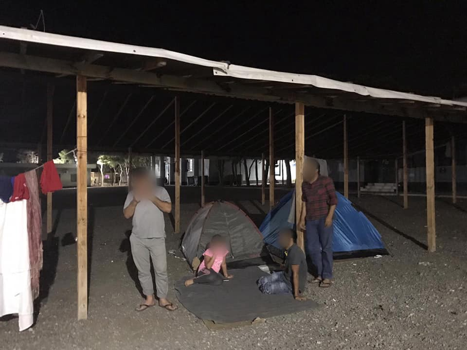
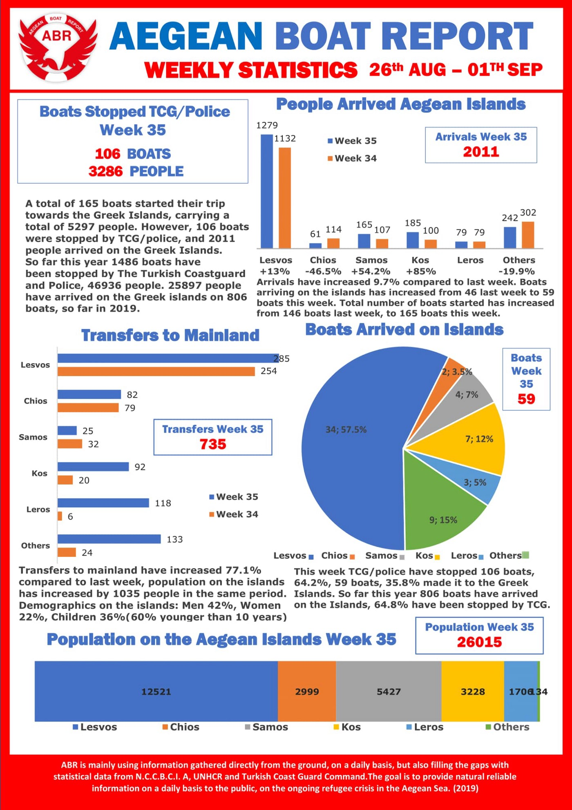
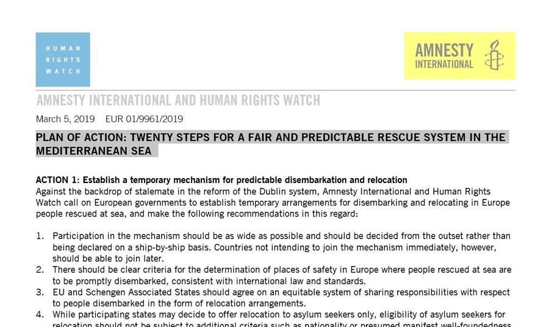
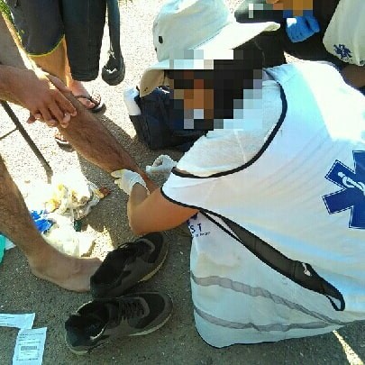

### AYS Daily Digest 2/9/19: Relocations and Evacuations to Poor Conditions in Camps Across Greece
#### “We are sick and tired from the situation, but we are still resisting”, evacuated from Athens say / 1,500 people to be transferred to camps across Greece, heading to poorly equipped and managed mainland camp / Detailed medical report from the infamous Vučjak camp in the Bosnian border area with Croatia / In Germany, organizations demand the immediate implementation of the recent judicial order, issuing a joint press statement / & more news

](assets/a09d4458e39/1*L7TiCDyTFvHO5YibFlK3xw.jpeg)

by [Spirou Trikoupi 17](https://www.facebook.com/spiroutrikoupi17/?__tn__=%2CdkCH-R-R&eid=ARCJ23FxDKJXdivUyGChcUWEz0FMWoTFABZKTTIeCvQoeOS4-FvuP3WI_VSMp1blHnto9jpP3IIVklit&hc_ref=ARSkBba5FLVwHlUfzvOeK82ouXyQLoGatTbFcB2LAX3N4u0CeQuBtujF_yqn_YcWrLI&fref=nf&hc_location=group)
#### FEATURED

Greece’s reception system remains inadequate and faces tremendous challenges and gaps in the protection of individuals\. 
The [Spirou Trikoupi 17](https://www.facebook.com/spiroutrikoupi17/?__tn__=%2CdkCH-R-R&eid=ARCJ23FxDKJXdivUyGChcUWEz0FMWoTFABZKTTIeCvQoeOS4-FvuP3WI_VSMp1blHnto9jpP3IIVklit&hc_ref=ARSkBba5FLVwHlUfzvOeK82ouXyQLoGatTbFcB2LAX3N4u0CeQuBtujF_yqn_YcWrLI&fref=nf&hc_location=group) group reports that some of the people have remained in **Schisto** camp after the recent evictions, without another decent place to stay\. They were moved there reportedly after an attempt to make them go to a camp near Thessaloniki, which these people refused\. Here is their account:

> For 6 days we are sleeping outside, demanding for a place in Athens to stay since all our life is here for 2 years, our kids are attending school here and some of us are working here\. Now they have told us we don’t have a place anymore in the camp in Thessaloniki, but anyway they want us out and they have threatened us that if we don’t move from here they will call the police to make us leave by force one more time\. We are sick and tired from the situation, but we are still resisting\. 

In **Eleonas** camp it’s not much better: “We have been given half a container for 8 people, where we are piled up like animals on a farm\. Also, some of us have a fragile health condition that requires continuous medical attention, and that is not happening since they moved us here\.”
Those in **Skaramagas** camp have enough place but no freedom of movement: “At first, they didn’t let us out and after they have let us go just for a while, under time restrictions\. We feel like being trapped and imprisoned\.”
Those who “accepted” to go to the camp in the north are still waiting for it in a hostel in **Thessaloniki** : “We are isolated and far away from everyone that we know, and to make it worse, they have informed us that our cases will remain in Athens and from now on we will have to go there for every interview and legal procedure by our means and expenses\.”
The people who decided to leave the camps and return to their neighborhood have found a place in other squats and self\-organized places, where they have been shown active solidarity\.

> However, after what happened a week ago, we fear that we are going to be evicted once again\. We are scared about our lives and our freedom, and some of us have chosen to stay on the streets to avoid being chased and arrested one more time\. 

> They destroyed our home, but the family that we have created in Trikoupi’s community remains united\. 

> Against their repression, solidarity is our weapon and our answer\! 

There are 24,000 people stranded on the Aegean islands, most of them in severely overcrowded hotspots such as Moria\.

> There are more than 600 unaccompanied minors among the asylum seekers, some just 10 or 11 years old\. They have been forced to stay with strangers, adult men and women, increasing their vulnerability to trafficking, harassment and abuse, NRC says\. 

1500 people from Moria were to be transported to Kilkis \(in northern mainland Greece\) in an action that began today, Monday morning, on Lesvos\. This is inevitable, yet given the circumstances \(three times more people than the official capacities currently provide\), it is a weak answer to the ongoing problematic and dangerous situation facing the many people stranded there, on their way to safety\.

According to the available information, about a thousand will be accommodated in the **Nea Kavala** camp, near Polikastro, while the other 500 will be provided lodging elsewhere in the same area\. People were hesitant to leave, given that previous relocations were not always providing a much better perspective, and not much information was given to the people who will be transferred, most of them families\.

](assets/a09d4458e39/1*q7BmXv9jtL9JFdTdvZPh8g.jpeg)

[Nea kavala Camp](https://www.facebook.com/neakavalacamp/?__xts__%5B0%5D=68.ARCs22s5vShkFVIWe2NVV-JwEfbABVepeVAqul_Fd0JPVI9Du0xUsvRWByadglfHsquli9nOEoKyK_oR6HYp3mMCZkHGj55l3V_ByOzuJ8t5VFNhxlYNZZ3JeZOlv4u3jMfViEI4fa6-9vVUlf7Cgv2ld_iJPAhPdexJrm8kJyDnwsIz295K-JtmbAbFhzjfpUBD2c0IMe3CkdO6RoYVv0vaJ1-2DK4MNBS_lGZWPIeiBSED79QoMOHTgZV1yUWMYt8gi28yc5Lu1tsE46LXWaoZdNwVXG0Dpy9PLsrwW034Qu2KpzTEJXn7NjfRRxLQFo8Z-_oH6b7I1Vjn0gLH_rcBKctr&__tn__=k%2AF&tn-str=k%2AF)

In Nea Kavala there are already 924 refugees living in containers, even though officially 700 people from 25 different nationalities are accommodated in containers and 450 in tents, media [reported](https://www.keeptalkinggreece.com/2019/09/02/migrants-refugees-relocation-moria-kilkis) \. However, that will allegedly only be a temporary solution for a few weeks as “the whole site is powered by two generators running from 2016 and not in the best condition, one of which had been damaged two months ago, so the entire structure was powered for just a couple of hours”\.
#### LIBYA

■■■■■■■■■■■■■■ 
> **[Sally Hayden](https://twitter.com/sallyhayd) @ Twitter Says:** 

> > New statement from UNHCR on their plans for hundreds of survivors of the Tajoura detention centre bombing. Still not clear what will happen to those who refuse to leave the UNHCR centre they've been sheltering in for the past seven weeks. https://t.co/hpsewhBsIT 

> **Tweeted at [2019-09-02 15:45:08](https://twitter.com/sallyhayd/status/1168550434115637248).** 

■■■■■■■■■■■■■■ 

#### GREECE

### Athens

Police are investigating a possible racist motive after shots were fired against an Afghan migrant outside the Athens University of Economics and Business earlier tonight\.

The incident that occurred on Antoniadou Street, resulted in the minor injury of the victim that was transferred to the Nikaia Hospital\.

Two unknown perpetrators on a scooter passed in front of him and shot at him with what was possible an air rifle, injuring him slightly in the hand and face\.
#### BOSNIA AND HERZEGOVINA
### Health issues in Vučjak camp

Vučjak, near Bihać — A medical team from Slovenia has drafted a list of needs and detailed the current situation in their [Short draft of needs assessment for refugee emergencies \(NARA\)](https://zdravniki4azilante.blogspot.com/2019/09/short-draft-of-needs-assessment-for.html?fbclid=IwAR1XpeYfzAWQuzDns37iEvYd-J1E1GkeiC8IovNimNESG5w_J_-m0U6Wic0) \. Here are the most important issues regarding the question of health:

“The local health system is severely underfunded and underequipped to handle their own patients, with the migrant situation putting additional stress on the system, adding to the discontent of the local medical workers and the locals with the migrants\.

The camp is currently housing between 600 and 1200 people, depending on the flow of migration and police raids\. The average number of people in the camp is around 800 at any given time\. The camp spans on 0\.1 km², far to small for the number of people being held there\. The tents built by the local red cross are mostly 10 person cotton tents with the polyester floor, but there are not nearly enough and most refugees sleep outside or in the big tents meant for food distribution\. While the floor is currently dry, **any rain turns the camp into a mud field** , with the previous purpose \(landfill/dump yard\) of the land still showing and toxins in the ground still active\. There are **no permanent objects** with the exception of one ruin of a house which is at the centre of the social life in the camp\. While day and night temperature difference in the tents is high, it is not critical yet, however, with the coming of the autumn and winter, the shelters provided will offer little to no protection from the elements\. Vector control does not exist\. \( **Lyme borreliosis is endemic to the area** \) \. The local red cross is replacing small tents with big tenets and has stockpiled 10 heating cannons for the tents, but they are not in use yet\.

> There is no electricity or running water\. 

While 4 German red cross sanitation containers are installed there, the quantity and quality do not meet Sphere standards for humanitarian situations\. **The water is brought to the camps 3 times a day** with a small truck cistern and frequently runs out\. While the quality of water is not in question where the cistern is filled, the quality of water in the camp is questionable due to old/inappropriate water containers being used\.

For the current number \(around 800\) people, there should be 40 toilets provided, however, only 8 are there, filling just 20% of the standard\. **None of the toilets have adequate lighting** or are within 50 meters of the living quarters, failing the other major requirements and only providing safety, but not privacy\. This is one of the reasons why the refugees choose to do their business in the surrounding Forrest, the other being **horrendous sanitary conditions** at the provided facilities\.

The number of showers is 20, 10 of those outside and 10 in the sanitation containers, however the ones inside are mostly not functional and therefore not usable\. Most people choose to shower outside or directly from the tap\.

Healthcare is provided only by volunteers with various medical experience, so the **quality of care varies** \. Since there is no electricity, diagnostic equipment is limited, and **most work is done with improvised means** \. All medical supplies are paid for from private donations collected by Dirk Planert and **there is no local medical support** \. Red cross provides no medical help at all, other than allowing the volunteers to work undisturbed\. They do, however, distribute 2 meals every day for the majority of the camp\. The clinic is also not housed in a permanent structure, but in a tent, meaning all medical supplies have to be removed from the camp when the clinic closes as the people use it to sleep in it at night\. **There is no running water and washing hands is impossible for medical workers** \. Instead, wet wipes and hand disinfection are used\. The local emergency room declines to send ambulances to the camp so all emergencies have to be driven with volunteers private vehicles, but the medical capabilities of the clinic are at least equal or greater to those of the emergency room, so very few migrants are driven there, except for getting a referral to hospital\. Daily, around 12–15% of the camp seeks medical attention, along with the red cross and police personnel occasionally\. Due to the workload and operational pace, medical records are hard to maintain/manage, and **only the most severe examples are logged** , however, this is done in an improvised manner potentially incompliant with patient privacy and informational security needed for such evidence\. The private nature of funding enables the health workers to provide care above the local standard, but very few have the knowledge, as most volunteers are either students, ambulance workers or nurses, making the **operation heavily dependent on the individuals** , rather than establishing a system anyone can take over/work in\.”

**Read our AYS Special: Outsiders’ perspective — The Bosnian Frontier:**

Late during the night, 38 people who reportedly came via Bosnia and Herzegovina, arrived at the Reception centre, Porin, in Croatia’s capital\.
#### SEARCH AND RESCUE AT SEA

■■■■■■■■■■■■■■ 
> **[Seegezwitscher](https://twitter.com/seacoverage) @ Twitter Says:** 

> > Trotz Verbot: #Eleonore ist aktuell in italienischem Hoheitsgewässer &amp; nimmt Kurs auf den Hafen von #Pozzallo. Kapitän @[ClausReisch](https://twitter.com/ClausReisch) hat nach 8 Tagen auf See mit über 100 geretteten Menschen heute früh nach einem schweren Gewitter den Notstand ausgerufen. Das Deck war überflutet. https://t.co/UHNhu31wwq 

> **Tweeted at [2019-09-02 06:57:48](https://twitter.com/seacoverage/status/1168417724462227456).** 

■■■■■■■■■■■■■■ 

This [media report](https://t.co/N9F4m4Qrds?amp=1) concerns the state of emergency at the vessel, while others remind of a clear plan of action proposed in March of this year:

The boat from Libya with 29 people on board that went missing last Wednesday was rescued yesterday by the Italian navy’s Cassiopea vessel\. As their relatives confirm, the 5 families, including 19 minors \( \! \), are now in Pozzallo in Italy, [Watch The Med — Alarmphone](https://www.facebook.com/watchthemed.alarmphone/?__tn__=%2CdkCH-R-R&eid=ARCZ5SBWr0_7wQ1RbbiDX1zZCniBzONCuY1mn1gcYCvyO8PRqdqKZ-UBKjjC-jSKybz6KbYDi4Qebdcp&hc_ref=ARQZn98gqybFXHblsAEECmCgvAcB7WTHgM8N-8rSUd4BbnX-FiSUtS10JYtXigGeUwU&fref=nf&hc_location=group) reported\. The captain is reportedly negotiating with the Italian authorities the modalities of whether and when the vessel may enter the port\.

■■■■■■■■■■■■■■ 
> **[SOS MEDITERRANEE ITA](https://twitter.com/SOSMedItalia) @ Twitter Says:** 

> > [UPDATE] La #OceanViking è appena partita da Marsiglia per la sua seconda missione SAR. Dopo una tappa carburante, la nave si dirigerà verso il #Mediterraneo centrale, dove le persone che fuggono #Libia in cerca di salvezza continuano a naufragare #BackAtSea https://t.co/PpI1swYpHK 

> **Tweeted at [2019-09-02 20:20:11](https://twitter.com/sosmeditalia/status/1168619653645635586).** 

■■■■■■■■■■■■■■ 

During the night, a ferry company Corsica Linea rescued 18 migrants adrift in the Mediterranean, a very rare rescue for a ship carrying cargo\.

■■■■■■■■■■■■■■ 
> **[Iasonas Apostolopoulos](https://twitter.com/Iasonas_Apost) @ Twitter Says:** 

> > Victory! After 6 days stranded at sea, blocked by Italian military vessels, the authorities finally decided to evacuate the last 31 rescued ppl from our ship. The turning point was the decision of 2 ppl to start hunger strike today plus the health condition of the rest.#MareJonio https://t.co/mGtiGp4Rll 

> **Tweeted at [2019-09-02 14:20:18](https://twitter.com/iasonas_apost/status/1168529082935578627).** 

■■■■■■■■■■■■■■ 

#### ITALY
### Lampedusa

71 person were moved to Porto Empedocle\. 15 of them are children, as well as a number of newborns, who had been rescued at sea\. 18 unaccompanied minors arrived and three pregnant women\. All had been embarked this morning after leaving the Lampedusa hotspot\.

A group of 48 was transferred to the “Villa Sikania” reception centre in Siculiana, while the others were relocated to other facilities\.

[](https://l.facebook.com/l.php?u=https%3A%2F%2Fwww.borderlinesicilia.org%2Feuropa-frontiera-sud-unaltra-estate-di-morti-in-mare-e-diritti-calpestati%2F%3Ffbclid%3DIwAR2Z4lRk6JdB88ehDrEe8BX2eVfWj7-mZcBZ6pT_RkOfH4o4CGgl8gZYwtU&h=AT0R1QAE0KM7oaWXQ2sAzaVQI3uZL0DLc5V-GV2SAURJefN5KCmtaFY5dPW89nkQ7634q2YG2SHDg4j_OozBkyrvPqb4xET6oZXrPCDSLV56T7LnJKbC9UmatgpnS4u7tGmVPnIzBMhYfXBv_meeljKjyScNvo0tyUecAB_dhwKlz1OU-OnK8mBdXls8WSjbmTdsN0XK_eG2GxQ768wm2DTWCLOmsrfqPeOMtveD-xjgbQvcDt5Z1vfUFlmc7LfFimTfXLl6dwS8YMC9Udetm_Xp-j439BDzMUo4L720gngWzVc_Pu5aXziHJJsWTJBB0lig8wJ4nocwc_gLyNwDmYs4Cr3vl-5eyb5sPFknOYItIgP2KR9ahX_wkXWU6KXnsuBCmYjRRTZdkvckzC9PJ-tE75G1C2uUyVu4BSF6qfLqNQgOCzK9mNGdAgP1Sv07EIPQMuZnOdFLggmz0RbHAl6rJ6LTKtPjcFRj6jw0SBTtECf6tQEhQdfslaUj4DEf0o1Yqsp7mlEPAJvmWcZinuKpvPN-_CTL2ZVbdOJ9ZHgZHgohnZ_KGR_RBKRY3-Jli7shZFR9ZpiEyaQ4htKVn5Ly3XQyuYCJBlendtPC3ACwEEYIbIMmpoL2WFI-iYZlVBWCrg)

#### FRANCE
### Calais

> “It was too itchy and in hospital I had to wait 4 hours and they didn’t give me good medicine\. I took a cigarette and burnt the animals out of my skin\.” 

We see this on a daily basis in Calais\. Scabies, bed bugs, mosquito bites and similar issues that are easy to treat when you possess a European Health Insurance Card — but without it — plus “living” in these inhumanly unhygienic conditions — they cause severe infections by literally “burning the problem”, the FAST team reports\.

Help FAST to make a difference by coming out to Calais, or by donating so that they can purchase the most needed supplies on the ground\. To find out more about how to get involved, and how to donate please see their website: [https://www\.f\-a\-s\-t\.eu/](https://l.facebook.com/l.php?u=https%3A%2F%2Fwww.f-a-s-t.eu%2F%3Ffbclid%3DIwAR0G3yosv7GYfzul16XdO64aOG4mXBESCV4DHCwYVhI0POU05yW4D4ChVV0&h=AT1GAvjhSvhb8BBiKaFcQs0rdVFP1WWVwcvTT6vK9nxshhVMNhO-xi0iyKnrB-pjUYxsAsfgQUN7OfvqHwsiLEcoZgg6pUOntqe_HSDYI4O_CJpQJcjnw0-auBxTThHJbRNSeZh2j3rGf1YAovnYGOGHt0AChSJXTw) or message them on Facebook\.
#### SPAIN
### More arrivals in 2019

According to data from [@interiorgob](https://twitter.com/interiorgob?fbclid=IwAR3QuKu34sHf6beKCBmfKhnav5reGMDQEoJGlZG0UA0OUFrh2bTV-___Vek) , 1,949 people arrived on boats to the peninsula in August this year, while during 2018 in the same month they were 6,268\.

The Canary islands have seen arrival of 613 people in the first 8 months this year, which is 117 more than in the same period last year, making it 23,6% more than in 2018, the Spanish Ministry of interior said\. Also, the number of boats rescued or arrived to the islands is 51, as opposed to the 19 that arrived last year in the same period\.
#### GERMANY
### **Organisations Demand the Immediate Implementation of the Judicial Order**

The Administrative Court of Munich ordered in a [landmark judgment](https://www.proasyl.de/wp-content/uploads/Eilbeschluss-VG-M%C3%BCnchen_8.8.2019-2.pdf) in a summary proceeding, the return of a deported Afghan refugee to Germany and questioned the lawfulness of a controversial Administrative Arrangement \( [so\-called “Seehofer deal”](https://rsaegean.org/en/the-administrative-arrangement-between-greece-and-germany/) \) concluded between Greece and Germany, and now, several organisations demand the immediate implementation of the judicial order, Refugee Support Aegean \(RSA\) [reports](https://rsaegean.org/en/still-no-return-ordered-three-weeks-after-court-decision/?fbclid=IwAR1FLJmIckCb2CALzv9-ve3MKL7dLLX1g7WcKnCQ7z3VaULE0MWtQLShbX8) \. The date of the implementation of the juridical order remains open\.

> The binding EU Dublin Regulation lays down the procedure and criteria for whether and how an asylum applicant can be transferred from one Member State to another — after sufficient examination and with effective access to legal protection\. These elementary rights have been repeatedly emphasized by the European Court of Justice, too\. 

As the ruling allegedly concerns the individual case only, the German Federal Ministry of the Interior states that they are going to continue implementing the controversial “Seehofer Deal”\. However, the deal makes legal protection almost impossible and, as the court ruling says that the procedure is illegal, this procedure will apply for every upcoming person concerned\. That makes the court order general, not individual, they claim\.

> The policy of refused entry at the German\-Austrian border and deportations to Greece are illegal\. It is a violation of European Law\. We call on the German government to end this unlawful deal policy and return to the rule of law\. And bring back the victim of this cynical deal policy immediately\. — _Karl Kopp of RSA/ PRO ASYL_ 

#### NORWAY

The Norwegian Prime Minister Erna Solberg today denounces the statement during the weekend from the former immigration minister, now minister for senior citizens affairs, Sylvi Listhaug\.

Listhaug from the Progess Pary \(Fremskrittspartiet\) claimed that Norway should not accept boat refugees from the Mediterranean\. The Prime Minister today states that this is not government policy and that the Norwegian government is working together with the UN to find a durable solution regarding the boat refugees, and that Norway will continue to accept its quota of refugees\.
#### UK
### Join the protest\!

**We strive to echo correct news from the ground through collaboration and fairness\. Every effort has been made to credit organisations and individuals with regard to the supply of information, video, and photo material \(in cases where the source wanted to be accredited\) \. Please notify us regarding corrections\.**

**Apart from daily news in English, we also publish weekly summaries in Arabic and Persian\. Find specials in both languages on our [medium site](https://medium.com/are-you-syrious/ays-weekly-in-arabic-and-persian/home?source=post_page---------------------------) \.**

_Converted [Medium Post](https://medium.com/are-you-syrious/ays-daily-digest-2-9-19-relocations-and-evacuations-to-poor-conditions-in-camps-across-greece-a09d4458e39) by [ZMediumToMarkdown](https://github.com/ZhgChgLi/ZMediumToMarkdown)._
