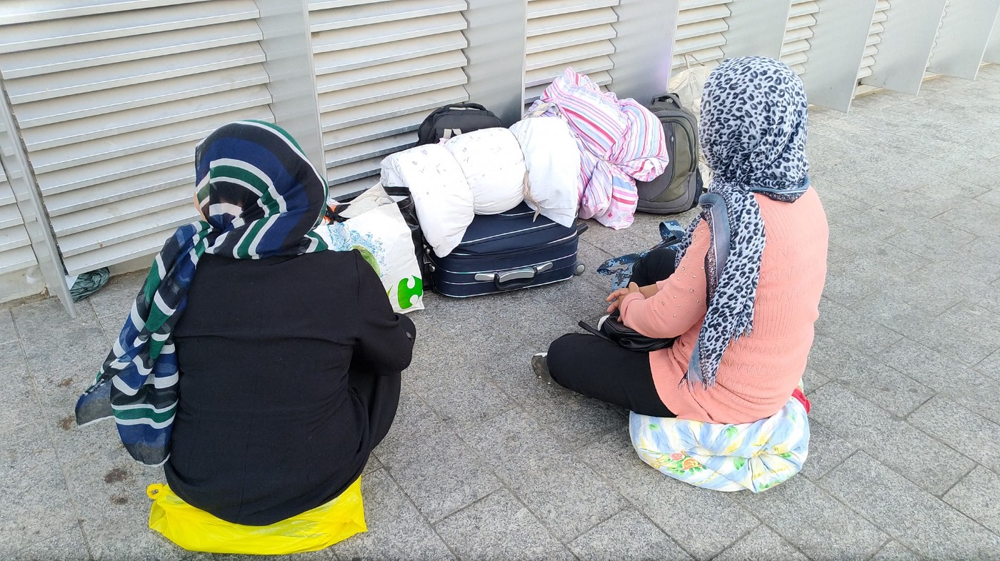
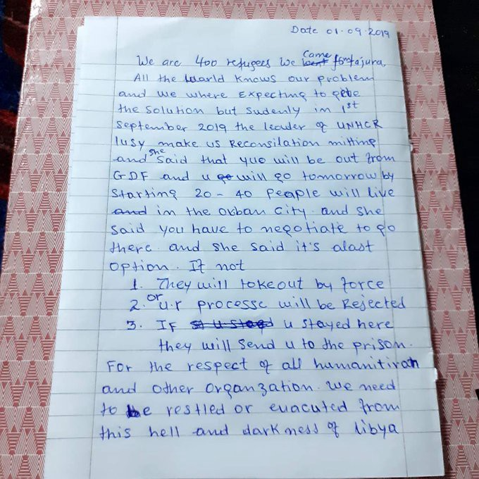
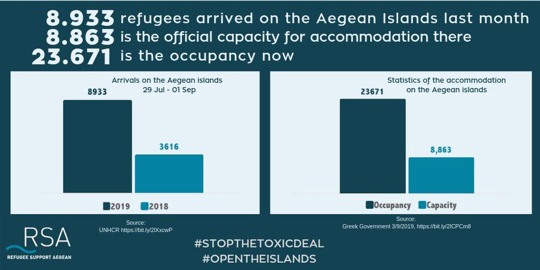
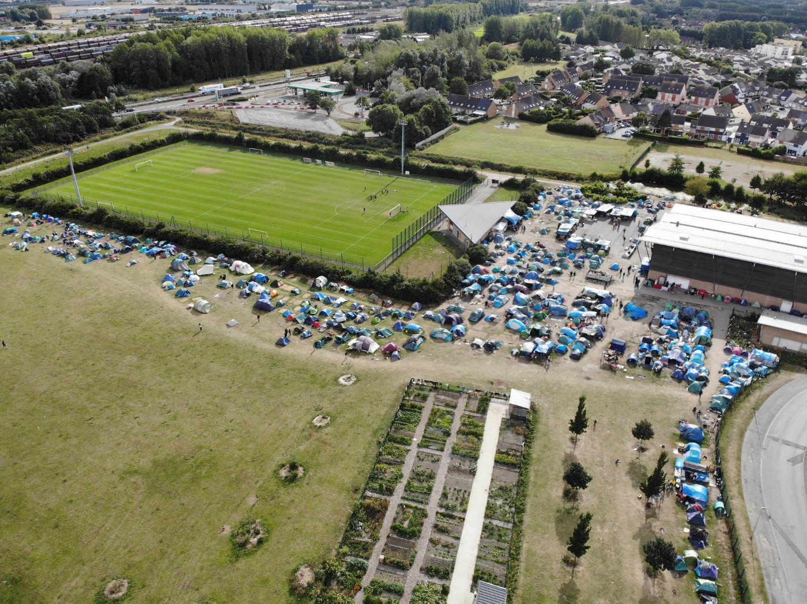
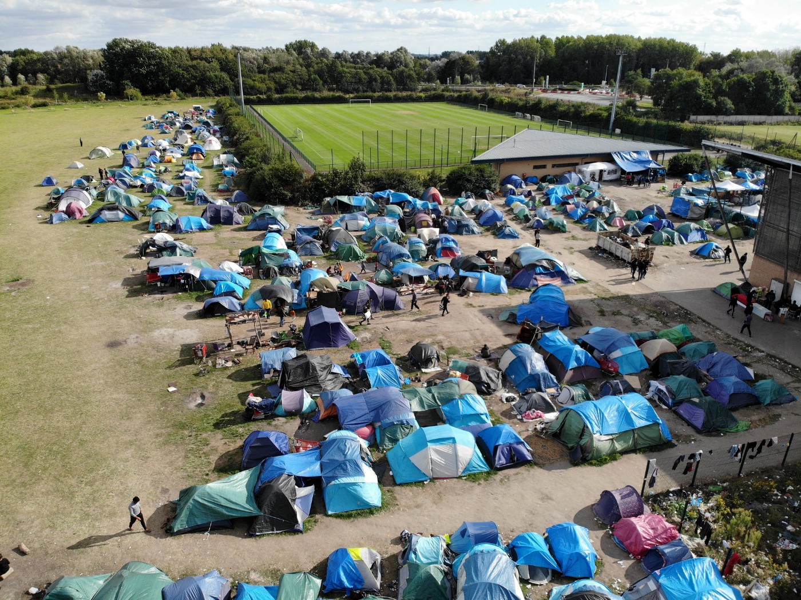
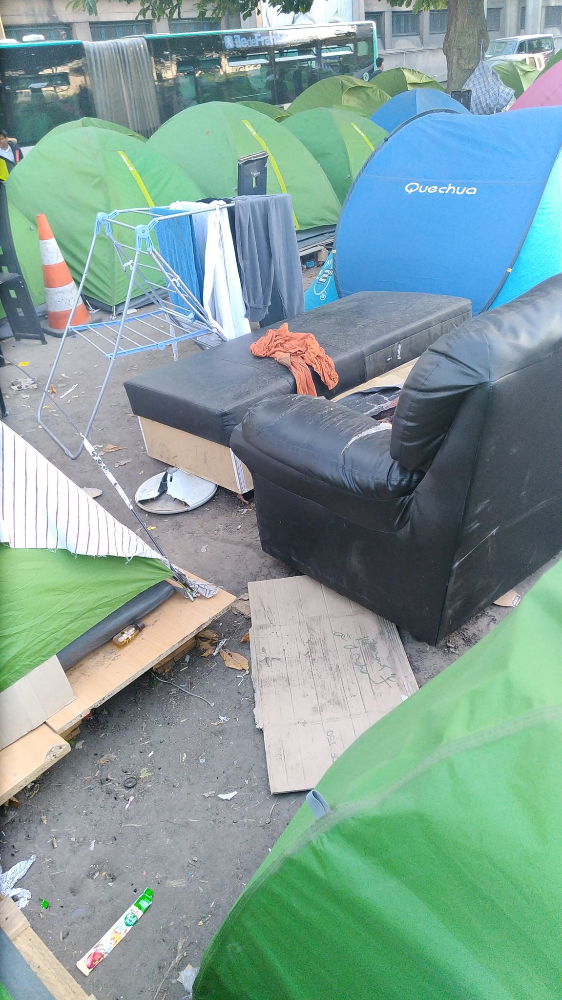
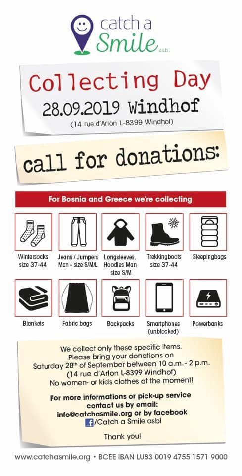

### AYS Daily Digest: 5/9/19: Political rhetoric killing solidarity
#### The situation worsens in Greece, international solidarity needed / Mental health crisis in Moria / In Serbia, unaccompanied minors are sleeping in the open in the parks without shelter, food, or health services / Police repression in Ventimiglia / Calls for help, volunteers, and donations & more news

Paris, photo: Danika Jurisic
#### FEATURED
### “…A bit in ruins”

A statement by the new Danish Social Democratic Integration minister Mattias Tesfaye from an interview with the national public service has sparked a public debate\.

In connection to the issue formerly described in [our previous News Digest editions](ays-daily-digest-30-08-19-abandonment-in-camps-symptomatic-or-intentional-747b598b21aa) on voluntary return from Denmark to Syria, [in the interview](https://www.dr.dk/…/22-syriske-flygtninge-er-frivilligt-rej…) the minister claimed to understand well that some of the Syrian refugees would have a wish to return to their home country with the following words:

> “If they believe that the peace has returned and that they do not risk persecution, then I can understand that they would like to return home and rebuild the land that in some places is a bit in ruins\.” 

The statement and the wording “some places a bit in ruins” has been attacked by among others the Danish\-Syrian doctor Haifaa Awad, who, illustrated by a series of photos from Ghouta in Syria before and after the war writes:

> All of our homeland, memories and lives are very much in ruins\. 

He expounds further:

“As a Danish\-Syrian doctor who has worked in Syria and whose former working places are now insanely VERY in ruins, along with colleagues that have been killed, I am quite upset by the minister’s choice of words\!

> I am upset that the biggest humanitarian disaster of recent times is being referred to by our minister as Syria ‘\(…\) is in some places a bit in ruins\.’ 

**This is the disaster that taught me how to tie the ribbon on body bags as a doctor, and how to tell parents that their children have died of chlorine gas or cardiac arrest, the disaster that on a DAILY basis still inflicts genocide on civilians** and where we see international humanitarian law being violated by the Russians and Assad regime in their CONSCIOUS bombings of hospitals, health facilities, and doctors\. It is the disaster that has killed countless journalists, activists and human rights defenders\. It’s the carnage that doesn’t stop\!

…I would like to ask the Minister to familiarize himself with Syria’s horrific situation and use his words wisely\. “A bit in ruins,” does not describe the death of almost 1 million people, the complete collapse of a country or the countless war crimes, that we do not react to in Denmark and as a world community\.”

Also reacting is the well\-known Danish author and pundit Carsten Jensen, who on his Facebook page states:

“In an interview with Denmark’s Radio \(TV DR\), he calls Syria a country that is ‘in a bit of ruins\.’”

> …But he did not say that here are only a few ruins in Syria\. Because then the lie would become too obvious, as we have all seen the images of Aleppo and Raqqua that appear completely bombarded from the air\. 

Jensen alleges that Tesfayes aims with the choice of the word “a bit” for a psychological effect, just as when you say to children that a vaccination sting in the arm will only hurt “a little bit\.” He trivializes the devastation in Syria, and he does so with a language like we were children\. The meaning is not, as it was for \(the former right\-wing Integration minister\) Inger Støjberg to enrage us when it comes to those damned refugees\.

> We just have to fail to empathize with them so that we can respond to their suffering with a shrug\. 

This kind of rhetoric has unfortunately become a common place in every day communication, both public and private, in all of our towns, cities, and communities across the continent\. We all must react, whether it comes from a person in a place of power or someone we know, whether it concerns people on the move or those helping them, or someone is simply undermining our common human tragedy and responsibility, as is the case with the Danish politician\.

In solidarity\!
#### LIBYA

Today Tajoura bombing survivors in Tripoli’s UNHCR centre say there was a big meeting where UNHCR staff reiterated they must leave and have no other options right now\. The Ministry of Interior was also present\. Multiple sources say this meeting was much more controlled\.

From a Tajoura detention centre bombing survivor who has been staying in the UNHCR centre in Tripoli, but now is being told to leave\.
#### SEARCH AND RESCUE AT SEA

A very important contribution to the question of responsibility for bashing the SAR teams at sea:

■■■■■■■■■■■■■■ 
> **[MSF Sea](https://twitter.com/MSF_Sea) @ Twitter Says:** 

> > Independent journalists on humanitarian search &amp; rescue vessels testify #NGO's do NOT collude with people smugglers &amp; traffickers.

@[AFP](https://twitter.com/AFP) @[el_pais](https://twitter.com/el_pais) @[EnPortada_TVE](https://twitter.com/EnPortada_TVE) @[TheObjective_es](https://twitter.com/TheObjective_es)

[theobjective.com/further/las-on…](https://theobjective.com/further/las-ong-no-colaboran-con-las-mafias-asi-lo-desmienten-los-periodistas-que-cubren-los-rescates/?_tcode=cmdtY2g0) 

> **Tweeted at [2019-09-05 13:50:18](https://twitter.com/msf_sea/status/1169608696042856448).** 

■■■■■■■■■■■■■■ 

#### TURKEY

The Turkish president said that Turkey plans to,“resettle 1 million refugees in northern Syria and may reopen the route for migrants into Europe if it does not receive adequate international support for the plan\.”

> This either happens or otherwise we will have to open the gates, _he said\._ 

Here is the [first media report](https://uk.reuters.com/article/uk-security-syria-turkey/turkey-may-open-gates-for-migrants-to-europe-unless-receives-support-erdogan-idUKKCN1VQ13A?fbclid=IwAR1lWuGcWxfby3Ua7so_lmxSj7P1l8FtkGjt3yi65bXiDOA7tSl5tpQfYjs) on the situation\.
#### GREECE
### Islands

There has been a substantial increase in numbers of refugees leaving for the Greek islands in August this year\. Compared to last year’s 5,483 departures in August only, there’s been an increase of 299% within the same month; this year’s total reaches 21,870 hopeful people who set out from Turkey on their dangerous journeys crossing the Aegean Sea seeking a safer and better life, Aegean Boat Report [states](https://l.facebook.com/l.php?u=https%3A%2F%2Faegeanboatreport.com%2F2019%2F09%2F04%2Fimportant-news-nowhere-to-be-found-in-media-why%2F%3Ffbclid%3DIwAR3q33QnGbcl5e21bPLT4n2QVNYR_Rj-02WI94MbgHdjznH5yXk0Fxixk6k&h=AT3n2jGU0QqosWrroa1oCjC0Yfh-41GTuovq2wV79W9fXeT1DPrgpYR4oRb1Tu2hP0WkLuVMlrxdR-CzxUs3whS5OyHkyOILahs4_vndLZGifhRXgMmepysLEY28cRVwDYXyOzKn4RR8Cg) , drawing on the available Turkish figures\.

The media seem to be focusing only on the increase of the lucky few arrivals — leaving out the even higher numbers of the unlucky ones that didn’t make it to Europe?

Even though the increase of successful arrivals is 152% higher than that of August last year — which is, in fact, quite significant — the numbers of non\-successful attempts of crossing the Aegean Sea to escape hell are even higher\.

The number of boats stopped — and in **many cases arrested — by the Turkish coastguard** before reaching the Greek islands has **increased by a staggering 496%** compared to August last year\.

How can media and big organizations forget to mention that?

RSA report the current situation regarding statistics of the islands:

A quick update regarding refugees in **Symi** and how you can help — [Symi Volunteers](https://www.facebook.com/symivolunteers/?__tn__=%2CdkCH-R-R&eid=ARDSr9JFx9GI7-0yV9RsqtjyFzeDTa6C4qeUh6Ls8iORzO98ujQOwz9wnjyU6vi_9nG3ofJhDAvm9fn9&hc_ref=ARQu53SCSiQqrLgqSrUt-OcV_8PEcgae-9scBi7hOMWWMG-eZK5glAr4fjQr7kLrs-Q&fref=nf&hc_location=group) :

> **_Food and drink:_** 
 

> _\-Donate money at Taxas supermarket for the refugee account to help provide breakfast items and water_ 
 

> _\-Donate money online via Next Stop Symi, link below_ 
 

> _\-We are looking for 2 volunteers who are based in Symi to coordinate delivery and ordering each morning\. Please call Andrew 6957302565_ 
 

> _if you can help\._ 

> **_Hygiene:_** 
 

> _We have arranged to fund use of private toilets and showers in Gialos for refugees to use, 2 male, 2 female, toilets and showers, initially for refugees at port police\._ 
 

> _We will be looking for volunteers to help extend opening hours and help wash towels\. A further post will be made about this in the next few days\._ 
 

> _Donations towards cost of showers and toilets can be made via Next Stop Symi\._ 
 

> _Symi Dimos will supply water for this without charge\._ 
 

> _Donations of towels and shower gels can be left at Mediterraneo cafe in Gialos\._ 

> _Port police have requested blankets, hygiene kits etc from UNHCR and will store these in old post office and manage supply\._ 

On Lesvos, the situation worsens and problems continue even with the recent relocation of some 1,500 people from the island\.

300 unaccompanied minors joined a recent protest at the overcrowded Moria camp, demanding to be transferred as well\. They set fire to rubbish bins before being dispersed by teargas by the Greek police\. These kinds of incidents only add fuel to the burning issue of security, health, and especially mental health, as MSF reports:

■■■■■■■■■■■■■■ 
> **[MSF Sea](https://twitter.com/MSF_Sea) @ Twitter Says:** 

> > Another summer, another mental health crisis on the Greek islands. @[MSF](https://twitter.com/MSF) calls on Greek and EU authorities to urgently respond to the health and humanitarian needs of those seeking safety, freedom and a future on European shores.

[msf.org/deliberate-neg…](https://www.msf.org/deliberate-neglect-greek-and-eu-authorities-towards-those-trapped-islands) 

> **Tweeted at [2019-09-05 15:24:38](https://twitter.com/msf_sea/status/1169632439406387201).** 

■■■■■■■■■■■■■■ 

The situation can only be improved if enough people are moved to the mainland with decent reception facilities, unlike the ones that awaited the first 1,000 moved to Nea Kavala close to Polykastro in northern Greece\. Reactions still arrive to the decision of placing people there:

■■■■■■■■■■■■■■ 
> **[Vassilis Tsarnas](https://twitter.com/VassilisTsarnas) @ Twitter Says:** 

> > "I cried when I heard that the.. government.. is going to send 1000 #RefugeesGr from #Moria.. to #NeaKavala.. (this) camp is one of hell’s chosen spots in #Greece.. to think that (they) see it as a suitable place for vulnerable refugees shows to me how much (they) must hate us." 

> **Tweeted at [2019-09-05 19:43:25](https://twitter.com/vassilistsarnas/status/1169697564259770368).** 

■■■■■■■■■■■■■■ 

### Worsening of the Overall Situation

“Frontex’s even greater presence and NATO’s involvement in the pretext of tackling increased flows as well as the repressive tensions against the fundamental rights of refugees and immigrants, with the unprecedented abolition of the right of the second instance, prove in practice the failure of a plan for Europe\-fortress, together with the total failure of the EU\-Turkey agreement,” Greek media [reiterated](https://l.facebook.com/l.php?u=https%3A%2F%2Fthepressproject.gr%2Fsynentefxi-gavriil-sakellaridi-sto-tpp-katakravgi-ke-katadiki-apo-to-edad-an-i-ellada-katargisi-ton-deftero-vathmo-gia-to-asylo%2F%3Ffbclid%3DIwAR0h2RG5zIIa-uE7Cl0pQyMnpwrUmxA3qzsTWSVbO6V3h3YV7jIzkXiaM54&h=AT0aRWPM6LRRAoh9FXQZHO2PYYKrrEfQD32ig3Y6nrUcOeguzIdaAq_6JRUZdPqJvTFs8JCdt1NQAayaXIkCXEI2-EoAGWgVFQQ956vRQ3fVTqwfXBaXsyj7F5eNGZH6bW8HDIBjKKjGeg) \.

Nearly 67,000 applications for asylum/international protection were pending at the end of July, while the Appeals Authority which examines the second instance, has still about 15,000 appeals pending\.

IOM continues to promote assisted voluntary returns programme, reporting that, “16,954 third country nationals chose to return voluntarily from Greece to their country of origin over a three\-year period from June 2016 through 28 August 2019\.” Most came from Pakistan \(4,292\), Iraq \(4,187\), Georgia \(1,972\), Algeria \(1,308\) and Afghanistan \(1,295\) \.
### Athens

■■■■■■■■■■■■■■ 
> **[Exiled Arizona 🎃](https://twitter.com/exiledarizona) @ Twitter Says:** 

> > Another police raid on plateia today, 5 arrests and 20 detentions. Apparently one of the arrested is being processed for expulsion. 

#antireport 

> **Tweeted at [2019-09-05 17:34:05](https://twitter.com/exiledarizona/status/1169665013566574593).** 

■■■■■■■■■■■■■■ 

#### SERBIA

The number of new people arriving to Belgrade is increasing in the last couple of months due to the increasing number of refugees entering Serbia from Macedonia, [Centar za zaštitu i pomoć tražiocima azila](https://www.facebook.com/AzilUSrbiji/?__tn__=%2CdkCH-R-R&eid=ARC0j21rPSF2NG7CiSmvMrPBr9rAXQDxm4Qk7krt_WJbhHG5-r5PSgoxS-ZUXgo3onmkNy6-MYc93IVm&hc_ref=ARRtBaALpvzw7dxJTZ_LPhjoYj5vOP5H0I6EvTHcW02B6Prz6dVSqH4gotW_0BXXNMw&fref=nf&hc_location=group) reports\. 
Daily, there are around 100–150 people staying in the parks around the main bus station in Belgrade\. Among the newly arrived they are many **unaccompanied minors, sleeping in the open in the parks without shelter, food and health services** \. They are suffering from stress and anxiety and from the harsh trip to reach Serbia\.
#### ITALY

The situation in Ventimiglia is getting worse\. The people there have to face police repression and we get more and more reports of police violence\. New people arrive to Italy every day and make their way to Ventimiglia, to try to cross to France, UK or somewhere in Fortress Europe, [Mobile Refugee Support](https://www.facebook.com/MobileRefugeeSupport/?__tn__=%2CdkCH-R-R&eid=ARCOQcioa3XtHJzUNbr-dGYBcbW7_yv2rs1-AdHDjMcbWzCseIkMSwtVOY95QKziO7_d2UqO0iXosdoA&hc_ref=ARS3VmWhFJgZlEggguADBJPHuZ-NGbDDtOq0IJfh3-qpGxwPJoXT6H7m8x6cxZkjlgY&fref=nf&hc_location=group) reports\.
#### FRANCE

Eviction of the people living in the Grande Synthe area, an estimate is about 800 people, [will take place soon](https://l.facebook.com/l.php?u=https%3A%2F%2Ffrance3-regions.francetvinfo.fr%2Fhauts-de-france%2Fnord-0%2Fgrande-synthe%2Fgrande-synthe-justice-ordonne-evacuation-du-camp-millier-migrants-1717993.html%3Ffbclid%3DIwAR390sfCSG_CfWjfeo7BN9f526Hg0o4bFostD3HkeGbpB-HrqEabrlBizZs&h=AT2yh7moENyHi4Y5rOgiNxfLLUlneSyOcVhFayQcStHliFCqIuUWRR_ARXtBGb45lSgdkoY8Ts7lwxPBrd7qsY9gPH2r_cW5kbup-RA7emeYN9iQjp4V72DCcjdywiAXWcY-yy5wI-x6PQ) \. After a court hearing in Lille, the eviction that will remove the camp surrounding the emergency shelter has been ordered without delay, activists report\.

Following recent such evictions, many people were taken to detention centres, while others were driven around in buses only to be taken back to Grande\-Synthe the very same day, [Mobile Refugee Support](https://www.facebook.com/MobileRefugeeSupport/?__tn__=%2CdkCH-R-R&eid=ARCOQcioa3XtHJzUNbr-dGYBcbW7_yv2rs1-AdHDjMcbWzCseIkMSwtVOY95QKziO7_d2UqO0iXosdoA&hc_ref=ARS3VmWhFJgZlEggguADBJPHuZ-NGbDDtOq0IJfh3-qpGxwPJoXT6H7m8x6cxZkjlgY&fref=nf&hc_location=group) writes\.

> Our team will be present all day during the upcoming eviction and will do everything in our power to ensure that those who return to the removed settlement will at least have the necessary supplies replaced to manage the cold nights ahead\. 

If you would like to get involved or volunteer with them, contact the group directly: [www\.mobilerefugeesupport\.org/volunteer](https://l.facebook.com/l.php?u=http%3A%2F%2Fwww.mobilerefugeesupport.org%2Fvolunteer%3Ffbclid%3DIwAR0LdsxNlCi2Z-8nJLZbxecCftkFh3ehuO8EVFMwPTgikOv4eKMzQx9glH4&h=AT1I4lCoHjOdpa8CbiUQzk2o8kfGOAIn9-upZU-QLm5XrgPxkRHIEch3wcClVCCOsOr-ajUoU9HZnxKRtCp7vcjjpZphD7tFBqjdOzzoE2vvZhe85gQQQoUgJ4Vd4jMCPb-3wbLnhKlmV8PCapt1L9ptosmTFJKZoA)
### Calls for Help and Donations from People in France, Belgium and Luxembourg

Diapers, toiletries, underwear, clothes, tents, shoes, strollers, and countless other items are badly needed around the provisional camps across the parks around Porte d’Aubervilliers, where people are waiting to receive answers, appointments, and any information, with a hope that the next day they will wake up to a more permanent lodging solution\. In the meantime, they are visited by volunteers, citizens, and some organizations who help with direct donations, aid, organizing places for minors to spend the night, and who are always in need of help and aid\.

If you want to support some of the volunteer efforts in direct help to the people, please consider donating: [https://www\.gofundme\.com/f/refugees\-in\-paris\-winter\-2019…](https://www.gofundme.com/f/refugees-in-paris-winter-2019?utm_source=customer&utm_medium=copy_link&utm_campaign=p_cp+share-sheet&fbclid=IwAR1DvUGpMVRMKm1bTSNDngmXL8hzNkkyixWDKZX1K_K4Ms1Mg9X12S_tnoU)

Until now a lot of different groups were distributing food, mostly cold food and nearly always in scant supply\. There is definitely a need for more food, [Kesha Niya](https://www.facebook.com/KeshaNiyaProject/?__tn__=%2CdkCH-R-R&eid=ARBNQurOoRGINtzu7zz3kFeoxFQJ0MhWYUQuehAHXROfWHwShnoOvvr8_tXxxJ02RC4YCO8X3tz0bk0Z&hc_ref=ARRxdmBqM4VTn6jg2O7dD3NgIBci6MdOYIn4gTooawt5yCOAE-lCZeA3gcMT2gU-w-I&fref=nf&hc_location=group) reports\.

> “The only group distributing regularly is Refugee Comunity Kitchen \(RCK\) who comes once a week a three hours drive from Calais to bring 850 warm meals\.” 

The group is looking for a place to stay and cook to support the people in **Brussels:** “We are in contact with people in a squat close by who have different social projects going on and if we can start there, we will start soon to renovate the kitchen\.”

If you want to go to Brussels to help, please write to: Molly\_on\_tour@posteo\.org
“If you want to support us with money, you can send it to our bank account or directly to the bank account of the people in Brussels”:

Name: Arne Hanno Link 
IBAN: DE15 4306 0967 4131 0478 00
BIC: GENODEM1GLS
GLS Bank

In **Luxembourg,** volunteers are collecting donations for their upcoming trip to Greece:

**We strive to echo correct news from the ground through collaboration and fairness\. Every effort has been made to credit organisations and individuals with regard to the supply of information, video, and photo material \(in cases where the source wanted to be accredited\) \. Please notify us regarding corrections\.**

**Apart from daily news in English, we also publish weekly summaries in Arabic and Persian\. Find specials in both languages on our [medium site](https://medium.com/are-you-syrious/ays-weekly-in-arabic-and-persian/home?source=post_page---------------------------) \.**

**If there’s anything you want to share or comment, contact us through Facebook, Twitter or write to: areyousyrious@gmail\.com\.**

_Converted [Medium Post](https://medium.com/are-you-syrious/ays-daily-digest-5-9-19-political-rhetoric-killing-solidarity-f719a1326036) by [ZMediumToMarkdown](https://github.com/ZhgChgLi/ZMediumToMarkdown)._
