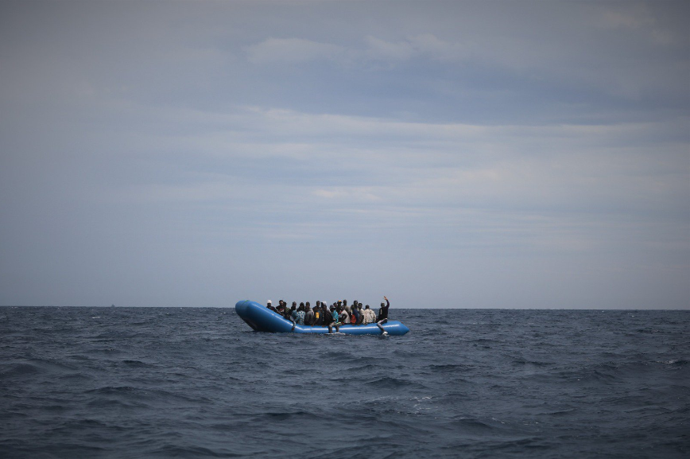

### AYS Daily Digest 7 \- 8/9/19: violence and unbearable conditions in Turkey, Greece, and the sea in between

Erdogan once again threatening to open the borders // Violent attack by Turkish coast guards // Inhuman ideas from Greek MP // Situation on the Greek islands // Many organizations need support // One man dies after violent attack by military in Morocco // People drowned and people rescued in the Mediterranean // Announcements of new evictions in Dunkirk and Calais

copyright: MSF Sea
### FEATURE

On Saturday Turkey’s president Recep Tayyip Erdoğan once again threatened to withdraw from the EU\-Turkey deal by threatening to stop the border controls on the Turkish shore\. As the fighting in the province of Idlib in Syria continues, a higher number of people are again trying to flee to Turkey\. Erdoğan demands for more financial support from the EU, otherwise he wants to open the border to Greece\. The European Commission reacted to similar threats earlier this week by referring to the payments already made and others that will be due soon\. While for a long time Turkey treated Syrians with relative friendliness, but the mood has changed dramatically in the last months\. People have been arrested, forced to sign papers stating their consent and were then deported to Syria\.

Various sources, like the journalist Patrick Kingsley, are wondering now whether or not the Turkish state was complicit in the simultaneous and successful passage of 13 boats at the end of August to the island of Lesvos\. As it is unlikely that this embarkation could have happened without the coast guard taking any notice of it, it may have been a warning signal from Erdoğan\.

■■■■■■■■■■■■■■ 
> **[Patrick Kingsley](https://twitter.com/PatrickKingsley) @ Twitter Says:** 

> > I’ve just left Lesvos, the main gateway to Europe from Turkey — my 1st visit in a year. Some observations (a thread!): 

1) Arrival numbers are at their highest since the EU-Turkey deal. But they are still tiny compared to the 2015/6 crisis, &amp; no one should get carried away. https://t.co/SRblaYGDQx 

> **Tweeted at [2019-09-07 07:58:09](https://twitter.com/patrickkingsley/status/1170244851645997056).** 

■■■■■■■■■■■■■■ 

Meanwhile a video appeared showing severe violence by the Turkish coast guards against a boat with refugees heading towards Greek\. The guards hit the people on the boat with sticks and ropes used as whips\. People and children scream desperately\.

And in Greece? Beside the horrendous conditions in the completely overcrowded camps on the islands and the evictions in Athens \(see the digests of the last week\) the new government’s attitude is becoming clearer every day\. Giorgos Kyrtsos, Member of the Greek Parliament and of the ruling party Nea Dimokratia, demanded on Twitter that Greece should apply “Australian methods” and send refugees to remote uninhabited islands\. This measure, he concludes, will stop people from coming to Greece\.

Article in Greek:

### GREECE

According to a Greek news article, in July and August **73 children were transferred to MSF** on Lesvos alone\. Three of them had attempted suicide, 17 showed self\-injuring behaviour, 10 were under 6 years and one was only two years old\. As a result of the overcrowding in the camps the numbers of children transferred to MSF with psychological disorders was double that of the months before\.

> “More and more of these kids stop playing, see nightmares, are afraid to get out of their tent and start retiring from life,” says Kathryn Bruback, a mental health officer in Lesvos\. “Some of them just stop talking\. With overcrowding, violence and lack of security in the camp increasing, the situation for children is getting worse day by day\. In order to prevent permanent damage, these children must leave the Moria camp immediately\. “ 

> \(Translated from the Greek article by Google Translate\) 

Find the complete article in Greek here:

MSF also reports that in **Vathy camp on Samos** , originally meant to host about 650 people, there is only one full time doctor for the 5000 people stuck there\.

■■■■■■■■■■■■■■ 
> **[MSF International](https://twitter.com/MSF) @ Twitter Says:** 

> > #Greece | With only one doctor for about 5,000 people, access to healthcare in Vathy camp, Samos, is almost impossible. 

When will this end? https://t.co/2GZAyT9q2j 

> **Tweeted at [2019-09-06 19:50:00](https://twitter.com/msf/status/1170061606107009025).** 

■■■■■■■■■■■■■■ 

The small island of **Symi** in the south Aegean is also overstrained with the high numbers of new arrivals\. As Symi Volunteers reports, there are families sleeping on the stone steps in front of the port police building for almost two weeks\. They are waiting to be fully processed and move on to the reception center camps, but they are equally overcrowded\.

Off the island of **Samos** , the Greek coast guard fired warning shots and ultimately arrested a young man for smuggling\. As Keep Talking Greece reported, the 18 year old did not stop the boat on instructions of the Greek coast guards until after the warning shots were let off\. 
Find the original article here:

**Aegean Boat Report** speaks about at least 14 boats arriving on Saturday carrying 536 people \(6x Lesvos, 3x Chios, 1x Leros, 1xSamos\) and another 4 boats at Sunday with 51 people in total \(2x Chios, 2x Lesvos\) \.
#### From organisations on the ground

**Medical Volunteers International e\.V\.** opened a new location in Thessaloniki, called FILIA \(meaning Friendship\) \. Whilst the group was offering medical treatment before in a dusty car park, they now have a room with running water, electricity and heating in winter\. The new location is shared with Mobile Info Team, Philoxenia — food and kindness in action and cuisine sans frontières\. They do need support to pay the rent:

**ChooseHumanity** is in urgent need for a French speaking volunteer to join the Asylum Seekers Information Services Team in Chios island, starting ASAP:

**The Hope Project** asks for donations of men’s clothing\. Men’s clothes are always rare as not so many people donate them; but there are many men desperately in need of trousers, shoes, t\-shirts, jackets, underwear and socks\.

Also **Stichting Bootvluchteling** is in need of financial support to keep up its work in Moria on Lesvos\. They report about endless queues of people waiting for hours in the hot sun to be processed, single women sleeping outside as there is no place to put up tents anymore, highly traumatized people with way too limited capacities to treat them\.

### BOSNIA

As local activists from Tuzla report, many people arrived again on the weekend, amongst them a family with a young baby\. Many people showed severe wounds on legs and feet and needed medical support\.

This video shows the solidarity and action of Bosnian people on the ground:

In Bihać meanwhile a first impression of what winter will be like can be found as heavy rains started some days ago\. An article in Bosnian can be found here:

### TUNISIA

Also in Zitan detention center conditions are desperate\. Due to overcrowding, many people have to sleep without a roof over their heads while it is raining heavily\. A video shows people desperately trying to build dry places with blankets and mattresses, but as the floor is already flooded, this seems to be a Sisyphean task\.
### MOROCCO

In the forest of Nador, one man from Guinea died after he had been hit on the head by an authority representative, the NGO Association Marocaine des Droits Humains Nador reports\. Photos show the dead body lying on the filthy ground with the head resting on cardboard\. According to AMDH Nador, the man’s body is still in the forest\. The attack apparently happened during a larger attack by Moroccan military at night\. Instead of opening immediate investigations on the killing, the authorities seemingly arrested the people who showed their solidarity with and anger over the dead\. 
AMDH Nador demands their release and the immediate opening of proper investigations to hold the responsible persons accountable\.

### SEA

SOS Mediterranee with its ship the **Ocean Viking** rescued 50 people from a dinghy on Sunday\. The boat was in international waters off the coast of Libya\. Since the Ocean Viking arrived in the rescue zone, the crew is actively looking out for boats in distress\.

Meanwhile on the **Alan Kurdi** \(Sea\-Eye\), at least two minors tried to jump into water in an attempt to swim to the shore\. Although the rescue of the people on board the Alan Kurdi took place in Maltese SAR zone, Malta does not take any responsibility but instead points to Germany\. The situation on board is getting more and more desperate\.

**Alarm Phone** reports that there has been a shipwreck with about 15 people drowned earlier last week between Algeria and Spain\. Only two people survived and were rescued by the Spanish Salvamento Marítimo\. People who drowned as a result of the unwillingness of others to save them should not just be numbers\. Our thoughts are with their families and beloved ones\.
### ITALY

A boat arrived independently on Lampedusa on Sunday evening, carrying 35 people\. They are said to have been on sea for about three days\. Another boat carrying 36 people was rescued by the Italian coast guard and the people were brought to Lampedusa\.
### SPAIN

To Lanzarote and Gran Canaria, various boats arrived autonomously or were spotted by the coast guard\. Between Thursday and Saturday last week, at least 85 people arrived in total\.
### FRANCE

Care4Calais reports that the Gym in **Dunkirk** that hosted 600 people for the last eight months will be closed soon and people will be brought once again to reception centers all over the country\. They also speak of a major clearance that should take place around Calais in the coming days\. From the statement:

> “This strategy of continual forced evictions has been followed for many years now — certainly enough to clearly demonstrate it is a pointless exercise\. Evictions have no effect on the underlying issues that cause people to risk their lives on dangerous journeys to the UK; even the major destruction of the Calais Jungle in October 2016 did not change this\. 
 

> What WILL happen is that some of the most vulnerable people in society — people who are already severely traumatised, who don’t have the protection of the law, people who have done nothing wrong but are desperate to protect their families and have the audacity to ask for our help — will be further abused and sacrificed so that a bureaucrat can say they have done their job\. 
 

> As the authorities often confiscate or destroy belongings of people the need for sleeping bags and tents it expected to be high again after the evictions\. “ 

In **Rennes** , for the second time protests were held on Saturday in order to demand accommodation and regularization for up to 400 people who have been camping in parc des gayeulles for some weeks now\. Around 150 people took part in the demonstrations and also asked pedestrians for donations like mattresses, tents and blankets\.

A go fund me campaign was released by Danica Jurisic to provide kids with school material in **Paris** \. Donations of materials like folders, colour pencils, geometry stuff and all other kinds of school materials are welcome, as are monetary donations to:

**We strive to echo correct news from the ground through collaboration and fairness\. Every effort has been made to credit organisations and individuals with regard to the supply of information, video, and photo material \(in cases where the source wanted to be accredited\) \. Please notify us regarding corrections\.**

**Apart from daily news in English, we also publish weekly summaries in Arabic and Persian\. Find specials in both languages on our [medium site](https://medium.com/are-you-syrious/ays-weekly-in-arabic-and-persian/home?source=post_page---------------------------) \.**

**If there’s anything you want to share or comment, contact us through Facebook, Twitter or write to: areyousyrious@gmail\.com\.**

_Converted [Medium Post](https://medium.com/are-you-syrious/ays-daily-digest-7-and-8-9-19-violence-and-unbearable-conditions-in-turkey-greece-and-the-sea-add9d89043de) by [ZMediumToMarkdown](https://github.com/ZhgChgLi/ZMediumToMarkdown)._
