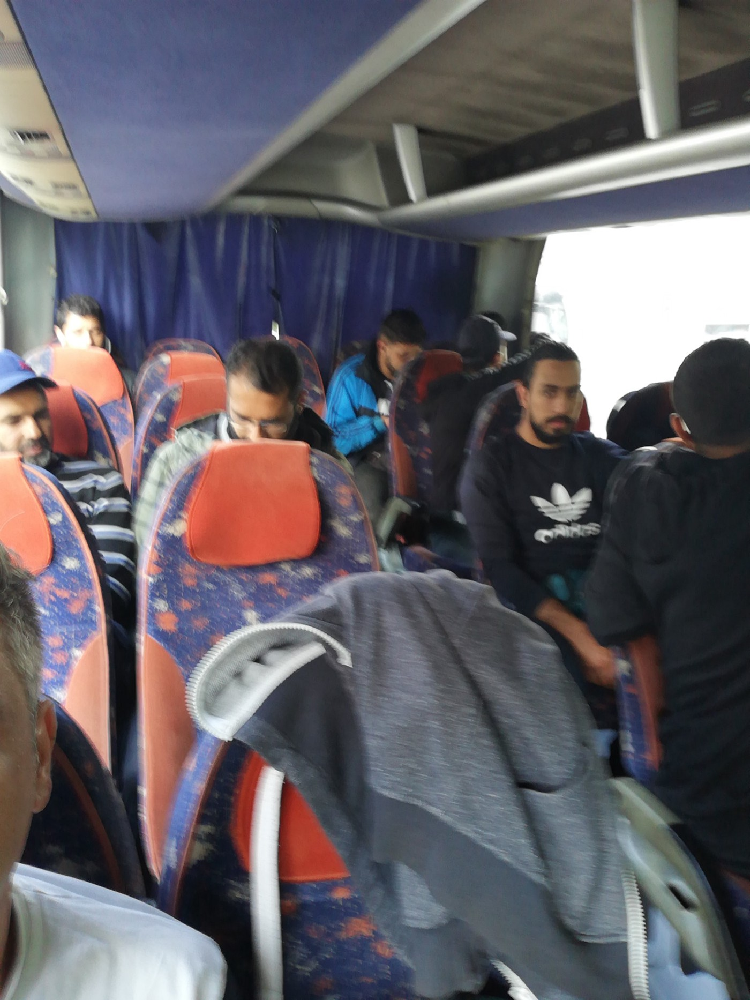

### AYS Daily Digest 10/09/2019: What is “Our European Way of Life”

_Also new “transit” centers in mainland Greece // AlarmPhone’s 8 week report // Malta allowing Alan Jurdi to disembark // segregated buses in Bosnia // and more…_

 by Gianfranco Uber from 2016, yet still articulates the everyday human cost of “protecting our European way of life\.”](assets/ad7af981711a/1*vR5roHcQ8l4sY6hn8B9YvA.jpeg)

[Cartoon](https://voxeurop.eu/en/content/press-review/5090942-unprecedented-failure-eu-and-its-member-states) by Gianfranco Uber from 2016, yet still articulates the everyday human cost of “protecting our European way of life\.”
### Feature

Today, the new head of the European Commission announced the portfolios for the upcoming term\. Essentially the portfolios announce the focii for the European commission and essentially assign at smaller commission for each theme\. The portfolios have yet to be approved by vote, so these may not come to pass, however a disturbing development was the announcement of a [special commission named “Protecting Our European Way of Life\.”](https://www.independent.co.uk/news/uk/politics/brexit-news-latest-commissioner-for-protecting-our-european-way-of-life-ursula-von-der-leyen-a9098991.html)

Pardon?

This seems like a macabre title for any official position\. Well perhaps we are being too hasty\. Perhaps this commission is simply an awkwardly phrased commission dedicated to protecting European cultural heritage institutions? Think again\. It mostly revolves around…Migration\. Well hmm\.

Let’s see the letter sent to the new proposed commissioner, Marrgaritis Schinas:

■■■■■■■■■■■■■■ 
> **[Sophie in 't Veld](https://twitter.com/SophieintVeld) @ Twitter Says:** 

> > Creating a portfolio “Protection of the European way of life” in response to “legitimate fears and concerns about the impact of irregular migration” is totally misguided and reprehensible. #VDL should withdraw it before the confidence vote in @[Europarl_EN](https://twitter.com/Europarl_EN) @[RenewEurope](https://twitter.com/RenewEurope) https://t.co/oiahvaoLt9 

> **Tweeted at [2019-09-10 16:42:06](https://twitter.com/sophieintveld/status/1171463872596721666).** 

■■■■■■■■■■■■■■ 

Okay, new skills, digital and basic skills, this seems okay, although perhaps a bit redundant as other portfolios include “Jobs” “Economy,” “Economy that works for the people”, and “Europe fit for the digital age\.” So the truth comes out here, “it \*also\* highlights the need for well\-managed legal migration, a strong focus on integration, and ensuring our communities are cohesive and tight\-knit\.”

And who better for this job than a member of the… New Democracy party in Greece \(Margaritis Schinas\), which riding on the tails of its latest victory, has been strongly encouraging integration and cohesion through restricting healthcare, social care, and educational access to refugees and migrants in Greece\.

Now what about this: “The European way of life is built around solidarity, peace of mind and security\.” Funny as this doesn’t seem to really be a cornerstone of the [Lisbon Treaty:](https://eur-lex.europa.eu/legal-content/EN/TXT/HTML/?uri=CELEX%3A12016M%2FTXT&from=EN)

> “The Union is founded on the values of respect for human dignity, freedom, democracy, equality, the rule of law and respect for human rights, including the rights of persons belonging to minorities\. These values are common to the Member States in a society in which pluralism, non\-discrimination, tolerance, justice, solidarity and equality between women and men prevail\.” 

Perhaps this is a misreading, but it doesn’t seem that this letter from the commission to Schinas focuses much at all on these facets of “Our European Values\.”

[In the full letter here](https://www.in.gr/wp-content/uploads/2019/09/mission-letter-margaritis-schinas-2019_en.pdf) , one can see that additional attention is paid to the task of “Finding common ground on migration”, suggesting taking up the issue of redistribution and internal quotas\. It has been long stated by EU authorities that the redistribution, Dublin convention, quota system are top discussions for the next mandate\. Surely we would admit that the current system is not working and is only seemingly heightening the tension between people on the move and their new host communities\. Yet if there is any trend to be followed in Europe, it seems to be that of securitization\. More borders, more walls, more Frontex\. More “encouragement” of voluntary return\. More deportations\. Indeed further in the letter it discusses “internal and external security\.”

Indeed von der Leyen has been outspoken about the “need” to increase the amountt of Frontex guards calling for a fast\-track of the “reform” \(and expansion\) [of the agency to be brought to 2024](https://www.infomigrants.net/en/post/19415/frontex-a-harder-border-sooner) \.

Indeed many can rightly argue that this ever growing creep of securitization, the pushing out of vulnerable people, their abuse, the ignoring of the calls against their violence, and intimidation of individuals who speak out perhaps are indeed the real European Way of Life and that Commissioneer von der Leyen is just being painfully, brutally honest\. So perhaps, rather than being shocked, we should just consider ourselves warned\. The pieces are set to further antagonize those who provide support to stateless and vulnerable people as “non\-European\.” After all, if the European Way of Life is “fostering cohesion” through erasing difference and fixating on building walls and fences, hiring border guards — practices which we know only further catalyze and strengthen dangerous and violent smuggling networks, I guess many of us are not for it\.

How this will all play out, we have yet to see\.
### Sea

■■■■■■■■■■■■■■ 
> **[SOS MEDITERRANEE](https://twitter.com/SOSMedIntl) @ Twitter Says:** 

> > UPDATE The Libyan maritime authorities have assigned #Libya to disembark the 84 rescued men, women and children onboard #OceanViking. #Libya is not a Place of Safety. 
We have requested an alternative that meets the requirements of international law. https://t.co/x61dxtYPF6 

> **Tweeted at [2019-09-10 17:47:01](https://twitter.com/sosmedintl/status/1171480206789361670).** 

■■■■■■■■■■■■■■ 

Also in regards to the Ocean Viking, people on a 14m sailboat were rescued by Josefa and transferred onto the Ocean Viking on Tuesday\. The sea was very rough and [“against all odds”](https://twitter.com/RenataBritoAP/status/1171335846341074944?fbclid=IwAR3Qp7I2eN-Ach00Tt0arACrYTBtfQ51zfhCPZnnDJgXt_e5PUnbaD-uANk) the rescue was a success\.

Alarm Phone released their 8 week report from July 8th to September 1st during which they were in contact with 2,450 people in 62 distress situations\. Approximately 1,350 people were unable to reach Europe and the fate of dozens of people is still unknown\. 24 situations out of the 62 were classified as emergencies\. Read more from the report [here](https://alarmphone.org/en/2019/09/10/alarm-phone-8-week-report/?fbclid=IwAR0TRCb9NSu936B_OeJsVbMYktMXKE78MD7YoV-gniyPjYz65i6_BE4dGog) \.
### Central Mediterranean

Malta, after a long and arduous debate, has finally allowed the final remaining souls aboard the Alan Kurd to disembark\.

As a reminder, [these last five were part of a group of 13, who initially were rescued at the end of August](https://uk.reuters.com/article/uk-europe-migrants-malta/malta-agrees-to-let-last-migrants-stranded-on-ngo-boat-disembark-idUKKCN1VV1TZ) \. So their horror had lasted at least 10 days\. The others were gradually left off as there were overt signs of their mental healtth deteiorating, and several attempted suicide\.

Sea Eye points out the needlessly degrading and shady origins of the final deal, which should just be basic practice

■■■■■■■■■■■■■■ 
> **[sea-eye](https://twitter.com/seaeyeorg) @ Twitter Says:** 

> > The remaining five guests finally left the #AlanKurdi off to Malta.

We will never get tired of repeating:

The bargaining with human lives has to end. 
It is not our job to conduct rescue at sea, but it is the EU’s responsibility.

📸: @[NickJaussi](https://twitter.com/NickJaussi) https://t.co/d5VmRH2x4I 

> **Tweeted at [2019-09-10 18:58:01](https://twitter.com/seaeyeorg/status/1171498075837235201).** 

■■■■■■■■■■■■■■ 

■■■■■■■■■■■■■■ 
> **[sea-eye](https://twitter.com/seaeyeorg) @ Twitter Says:** 

> > The disembarkation was only possible due to a horse deal with the Maltese authorities. Malta was afraid of the truth and therefore forced us to withdraw our legal appeal. This blackmailing behaviour is unworthy for a constitutional state.
#AlanKurdi 

> **Tweeted at [2019-09-10 18:58:02](https://twitter.com/seaeyeorg/status/1171498082359377921).** 

■■■■■■■■■■■■■■ 

Although we are very happy the deal with through, resulting in the disembarkation, this is not enough\! This is complete absurdity\.
### Greece

[The Greek Government](http://www.ekathimerini.com/244393/article/ekathimerini/news/two-new-transit-migrant-camps-to-be-created-on-mainland?fbclid=IwAR0mxWh2t_L4Rl3qAtwdh2mnNd1fYRhuA6wvLfqRyssJAmTJRKuvVM5Xa2o) is building two new “transit migrant camps” to accommodate people transferred from the overcrowded islands to the mainland\. They are not meant to be permanent solutions, but rather holding areas before they are transferred again to “better facilities\.” The first facility will operate in a discontinued military base in Karavomylos and the second will be added onto the pre\-depature facility in Corinth\.

The government is hoping to help house 900 people in large tents, holding up to 50 people at a time\. Their priority will concern accommodating families who have lived on the islands for a year or more\. They are not expecting to hold these families in the new transit camps for more than a month\.

According to [Aegean Boat Report](https://www.facebook.com/AegeanBoatReport/posts/646830922506682?hc_location=ufi) six boats arrived on the Greek Aegean Islands on Tuesday with 264 people\.

First boat → Lesvos, 48 people, no breakdown available\.

Second boat → Lesvos, 44 people, no breakdown available\.

Third boat → Lesvos, 57 people \(28 children,10 women,19 men\)

Fourth boat → Chios, 38 people \(7 children, 15 women, 16 men\)

Fifth boat → Chios, 38 people \(9 children, 14 women, 15 men\)

Sixth boat → Chios, 39 people \(3 children, 4 women, 32 men\)

_“Also 70 people were transferred from Simi to Leros this morning\. No further information available\.”_

In a continued response to the Greek Government’s fascist removal of people living in squats in [Exarcheia](https://www.facebook.com/spiroutrikoupi17/photos/a.176183506161791/720775371702599/?type=1&theater) two weeks ago, there is a protest scheduled for Thursday 12/9, in Exarcheia square, 18:00\. Come out and support if you can\! You can also find video on the movement [here](https://www.youtube.com/watch?v=aUyyJgPijWc&feature=youtu.be&fbclid=IwAR3ocy3uLr9OhnhQ-2YZ1LNTAW4b4nysyhfK776VxlIUpL5qPIOg263wpPg) \.
### Italy

Two far right political parties platforms on Facebook and Instagram were deleted on Monday after a “debate on trust in the Conte government\.” Several leaders’ profiles in connection to these two political parties were also deleted based on their inciting of hatred and violence\. As Facebook explained:

> “People and organizations that spread hatred or attack others based on who they are cannot find a place on Facebook and Instagram\. Candidates and political parties, as well as all individuals and organizations on Facebook and Instagram, they must respect these rules, regardless of their ideology\.” According to a spokesman, “the accounts we removed today violate this policy and can no longer be present on Facebook or Instagram\.” 

Now if only Twitter could do the same for Donald Trump…\(it’s important to note that the Twitter handles for these parties remain active\) \.
### Bosnia

Horrible news from Bosnia where photos and testimony has emerged of Bus operators segregating people on the move, and putting them at the back of the bus\. All of these individuals were paying customers\.

> “When asked why, the driver replies that if they sit forward, they mix with “passengers,” even though people paid neatly, along with women and babies\. To the additional insistence the conductor replies that “a professor who has worked for 8 hours should come in now, and should she sit with them?” 

Quote [here](https://www.facebook.com/photo.php?fbid=10157321004214799&set=a.10151223220654799&type=3&theater) \.

Photo and testimony, Emir Alagic

**We strive to echo correct news from the ground through collaboration and fairness\. Every effort has been made to credit organisations and individuals with regard to the supply of information, video, and photo material \(in cases where the source wanted to be accredited\) \. Please notify us regarding corrections\.**

**Apart from daily news in English, we also publish weekly summaries in Arabic and Persian\. Find specials in both languages on our [medium site](https://medium.com/are-you-syrious/ays-weekly-in-arabic-and-persian/home?source=post_page---------------------------) \.**

**If there’s anything you want to share or comment, contact us through Facebook, Twitter or write to: areyousyrious@gmail\.com\.**

_Converted [Medium Post](https://medium.com/are-you-syrious/ays-daily-digest-10-09-2019-what-is-our-european-way-of-life-ad7af981711a) by [ZMediumToMarkdown](https://github.com/ZhgChgLi/ZMediumToMarkdown)._
