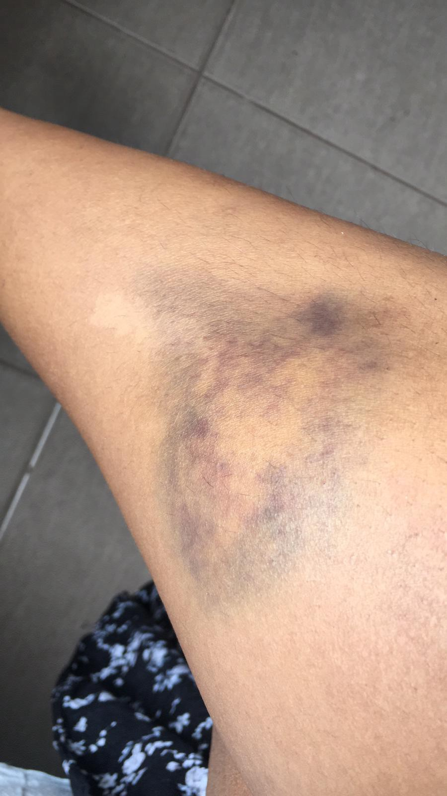
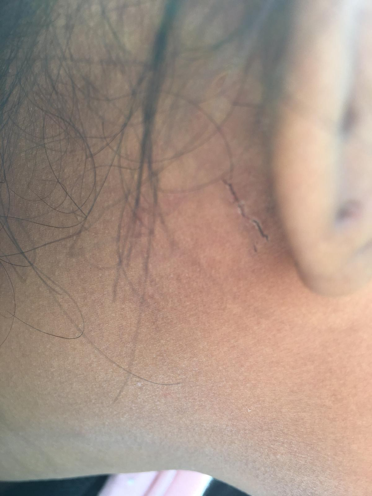
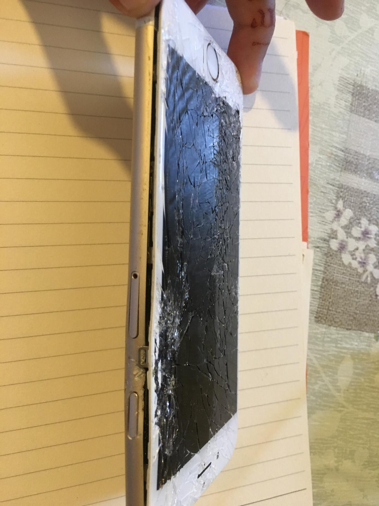
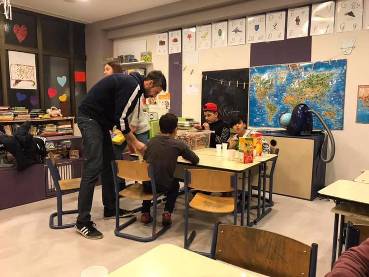

### AYS Daily Digest 11/09/19: Young women and men beaten up and pushed back by the Romanian border police
#### New reports of violent pushbacks and police violence // More people fleeing from Syria towards Turkey // Resignation of ‘the head’ of Moria // Demonstrations in Malta // Statewatch analysis of Returns Directive // & more news

consequences of a collective expulsion from Romania, all photos by activists who took the testimonies
#### FEATURED

On 1 September a group made up of three women, and six men experienced a violent group expulsion by the Romanian border police, volunteers active in Serbia have reported\.

The group left Serbia on 30 August, walked several hours to cross the border in an unknown location and then spent two days and two nights walking through a Romanian forest without water or food\. At around 12 am, they were walking on the side of a road, as a police car approached them\. One police car with two policemen\. The group was asked to sit on the side of the road\.

Ten minutes later, a bigger police car arrived with three men and a woman on board\. Both cars belonged to the police and the police officers were wearing the uniform of the Romanian Border Police \(one of the men was wearing a different uniform, and another one had three stars on the shoulder\) \. They moved the people into the forest and one of the policemen reportedly spat on them\. A bit later a coach arrived and they were all made to get on board\. After fifteen minutes of drive, they arrived at the Serbian border, but remained on Romanian soil\.

The police searched the group for mobile phones, and started hitting them\. They found one man’s phone and, reading through the chats, noticed the name of a girl\. They asked him who the girl was, and when he replied that she was his girlfriend, the policemen did not believe him because they thought she was a woman responsible for helping the group reach Romania\.

They beat the man\.

> The policemen asked who in the group spoke English, and then proceeded to beat up each of the English speakers\. One of the girls tried to move, but they beat her with their boots and batons\. She fainted briefly and did not regain consciousness for five minutes\. Then she helped her friend and was beaten again as punishment\. 

The policemen then made the group members take off their clothes and found the remaining mobile phones\. They beat the men again\. Then, they searched through the group’s personal belongings and beat everyone up again — men and women\.

**The group was then told never to come back to Romania, and the police made everyone acknowledge and repeat that they were on Romanian soil\.**

They put their clothes back on\. They walked ten minutes with the police up to the Serbian border and then they crossed the border into Serbia alone\.

All of this happened in the span of two hours\. At the border, the Serbian police told them to go to the station and get on a bus\. Ten phones were broken and later given back\.

### SYRIA/TURKEY

More and more people are fleeing from Syria towards Turkey following the latest regime attacks in the north\-western province of Idlib\. The latest numbers speak of about 500,000 people on their way towards the border\. The Atmeh refugee camp close to the Turkish border in Syria with a capacity of 600,000 is at at the moment holding 1 million people\. 
This article gives a good overview of the situation of civilians on the ground in Syria:

### GREECE

On Wednesday afternoon, Ioannis Balbakakis, head of the hotspot Moria resigned from his position\. As was reported by keeptalkingGreece he handed in his resignation to the Ministry for Citizen Protection\.

> “I leave with my head up at doing what I needed to do in difficult situations\. I am neither leaving as a thief nor leaving as a protesting politician\. I’m leaving because I have to leave\. I’m tired … ” 

Find an article from keeptalkingGreece here:

Here is a photo series by Deutsche Welle about Moria:

The resignation comes at a time of complete overcrowding and excessive demands on all the Greek reception centers, with 21,000 people currently waiting for their asylum procedure to be processed on the Greek islands\. 
This article gives a good overview of the current situation:

According to **Aegean Boat Report** , 320 people arrived in the Greek islands on Wednesday, with six boats coming to Lesvos, one to Chios and two to Samos\.

Health\-Point Foundation Dental/Medical Relief is **urgently looking for dentist and dentist\-assistant volunteers** to support their team in Moria\.

Meanwhile in Exarchia, raids and arrests by O\.P\.K\.E\. of migrants still appear frequently\. In many cases these arrests are violent\.
### MALTA

For the second time in a week, people detained at the Malta migration center protested and demanded their release\. After disembarking on Malta from NGO boats, people are held in detention until they have undergone a health check, the official reason given by authorities\. As former detainees report, the conditions in this center are grave and people are not told how long they have to stay there\. 
Find an article about the situation here:

#### CROATIA
### AYS volunteer teachers team back in Porin

Our classroom in the Porin reception center in Zagreb, Croatia, has been empty for too long\. It took us almost nine months of struggle to renew our contract with the Ministry of the Interior, a contract that allows us to volunteer with children and support them in their schooling and integration\. This is work we do for free, every day, because no one else is doing it\. Dozens of schools and other institutions expressed their concern after the decision of the MOI to end our volunteering in Porin\. After a recent meeting with the State Secretary, where we concluded that while we don’t agree on many points, and will continue actively to advocate for the respect of each life, human rights and the right for safe passage, we cannot let a whole generation of children suffer the consequences of policies and repressive measures against activists\. Our dedicated and professionally well\-prepared volunteer teachers will now continue working individually and in groups with the children who are stuck in a reception centre and deprived of many things\. Let’s not allow education to be one of them\. The common care for one of the essential elements in the life of a child overcame the opposing side’s differences in this particular case\.

copyright: AYS
### ITALY

In the city of Udine near the Slovenian border, seven Kurdish people from Iraq and Iran have been found wandering around in the industrial area, as L’altra Voce reports\. Apparently they were left there by a truck or a van\. Amongst them was a family with one minor\. They were brought to the police station and are being checked with the immigration office\. 
Original article in Italian:

### FRANCE

The First Aid Support Team \(FAST\) is in need of donations to continue their help for displaced people in northern France\.

### EU

Statewatch published an analysis of the revised version of the EU Returns Directive; it will be discussed at the EU Parliament in the coming weeks\. The Directive initially came into law in 2008, aiming at providing general regulations for the deportation of people without legal status\. It was highly contested amongst human rights defendants\. But while it did open up more possibilities for legal detention of migrants in order to enforce returns, it was apparently followed more leniently than expected\. In the recent years however, judicial interpretation became stricter\. In September 2018 a revised version was submitted that should turn the measures into law\.

> “The entire aim of the Commission’s proposal is to lower fundamental rights standards in order to increase the number of deportations from the EU, yet there is no evidence that this would make the EU’s expulsion system any more effective\. Even if this were the case, it would be difficult to argue that such harmful and destructive means — such as the massively expanded use of detention — could justify the ends\. It appears that the Commission and Council favour a recast version of the Returns Directive that would both degrade fundamental rights standards and be ineffective, ignoring potential alternatives and discarding the progress made by member states in implementing such alternatives in the framework of the existing rules\.” 

Find the complete analysis here:

**We strive to echo correct news from the ground through collaboration and fairness\. Every effort has been made to credit organisations and individuals with regard to the supply of information, video, and photo material \(in cases where the source wanted to be accredited\) \. Please notify us regarding corrections\.**

**Apart from daily news in English, we also publish weekly summaries in Arabic and Persian\. Find specials in both languages on our [medium site](https://medium.com/are-you-syrious/ays-weekly-in-arabic-and-persian/home?source=post_page---------------------------) \.**

**If there’s anything you want to share or comment, contact us through Facebook, Twitter or write to: areyousyrious@gmail\.com\.**

_Converted [Medium Post](https://medium.com/are-you-syrious/ays-daily-digest-11-09-19-young-women-and-men-beaten-up-and-pushed-back-by-the-romanian-border-44517d87735c) by [ZMediumToMarkdown](https://github.com/ZhgChgLi/ZMediumToMarkdown)._
