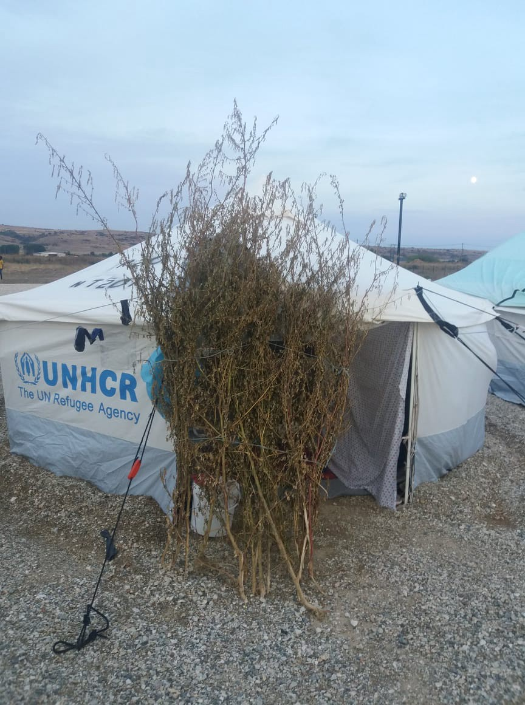
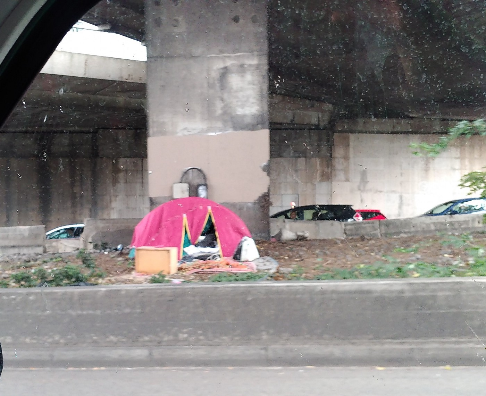
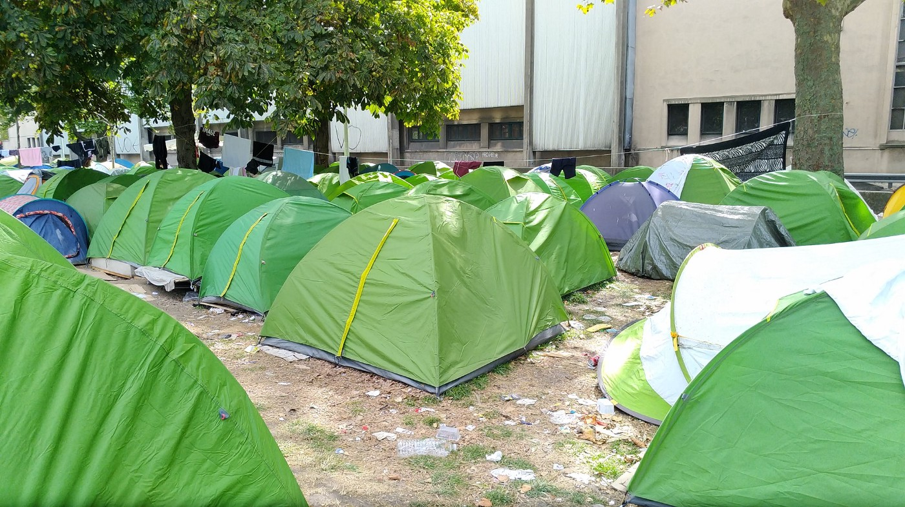

### AYS News Digest 14–15/9/19: Unbearable on the Aegean islands, transfer to Larissa denied
#### People left in crowded camps and horrible conditions on the islands / Transfers slowed as the planned expansion of the reception camp facilities in Larissa was denied / Solidarity demonstrations in Athens / Melilla out of capacities to host people / Reports on expulsions from Croatia’s police stations of people who wanted to express the intent to seek asylum / Testimony: beating of a 16\-year old genocide survivor in the UK

](assets/322bd03bca89/0*zLpsMoa0VbqMtMPe)

Photo: [@Afshinismaeli85](https://twitter.com/Afshinismaeli85)
#### FEATURED

On the Greek islands, more than ever before, an unbearable situation is unraveling with an estimated 20,000 people staying on the Greek islands under unbearable conditions\.

On **Chios** , with a capacity of 1,100 people, the Vial camp is now hosting over 3,000 people\. 12,703 people are on **Lesvos** , of which 10,400 in Moria\!
That means that over 5,000 people are living in an olive grove under horrific conditions\.

The suffocating living conditions at the **Kos** hot spot in combination with the downpour on Saturday caused problems for those staying in shelters, sparking clashes with security guards\. [Reportedly](https://l.facebook.com/l.php?u=https%3A%2F%2Ftwitter.com%2F_Wiesenthal_S_%2Fstatus%2F1173331849432784899%3Ffbclid%3DIwAR1Yp8xENe6LmOQ26qWFriZYHcHRuJP5zLlvheR3jPv2HYNKBKKuduo89kE&h=AT2NNMa6pP-c68QdfJpmSe6iZz5jgbrWU-pxFIFWz6dSP4f3cF2faHJ48WrYX3s-W2EJeUoYSNMD6dOqgUU7Mc3iheiBO-NRpgbPbgwvV1l32YDSMo8xTmkpL1P10USj8WhDJk4nK4JGNZ2HHntPgNOc) , five refugees in hospital, seven arrested\.

In Nea Kavala, those who were transferred there face hardships in their daily lives, in a field ‘in the middle of nowhere’, struggling with basic needs and activities\.

](assets/322bd03bca89/1*5sNHNgcOHaaW3vU98aMIWg.jpeg)

photos: [Maritta Gudrun](https://www.facebook.com/maritta.gudrun?__tn__=%2Cd%2AF%2AF-R&eid=ARA13ufQiOctz_7r89Jj__IVlqFsMYNtY3gsmwjJ7sxqOetJ2WU7wmkQXMeP1i0zA52zjVKb9tQo3g7K&tn-str=%2AF)

In the meantime, transfer of the people from the islands to the mainland has been paused for different issues\.

At a town hall meeting at the municipality of Larissa, a statement was agreed upon, claiming that a planned expansion of the reception camp facilities for refugees transferred from the islands was not acceptable\. As with the European Union, the cities and towns across the country claim that “the new structures should be established in areas of the territory which have not taken responsibility so far for the treatment of refugees\.”
The local mayor [reportedly](https://www.efsyn.gr/ellada/koinonia/210767_den-theloyn-alloys-prosfyges-sti-larisa?fbclid=IwAR16aaQfsnlEq2pDeLmhqG0y5wkx9BfJ_X3VSmNcI19DGCJwSY-VtyOh724) said that the strengths of the local community have been exhausted\.

Due to a lack of political will, Greece is still in need of solidarity from the other EU member states and needs to push for a faster asylum system, tangible programs, especially the transfer of unaccompanied minors from Greece to other EU countries, as reported and demanded many times, and advised again r [ecently](https://www.infomigrants.net/en/post/19449/situation-in-greece-for-migrants-insupportable) \.
#### MOROCCO

The Bamboula\. Peeople in camps in Nador are reportedly experiencing attacks night and day, [Association Marocaine des Droits Humains — Section Nador](https://www.facebook.com/AmdhNador/?__tn__=%2CdkCH-R-R&eid=ARDsHyVnC8JaJgkNTX4emZt5iVB1pNJnVoEzjngP3EOCqpW0i65jbp0YYQzl-3hMki00I88WT_-y8-_R&hc_ref=ARTSD0PuN2oVwXVmlrXARcb_vtVWrAfU5an5dwJEUOetEb4rVPaxk6jytM3pz27aVJg&fref=nf&hc_location=group) reported\.

#### GREECE
### Athens

In Athens, demonstrations were held in solidarity with the squats and against police repression\. More than 6,000 people reportedly marched in solidarity with the evicted squats and against state repression\.

Photos by Spiros Chalikias Kontarinis

Some of the ex\-residents who’d been evicted from the buildings, as well as residents of other squats that are constantly under threat, all walked together\.

](assets/322bd03bca89/1*CvpoKmEocq_5piGvFDSowg.jpeg)

Photo: [Spirou Trikoupi 17](https://www.facebook.com/spiroutrikoupi17/?tn-str=k%2AF&hc_location=group_dialog)
#### CROATIA

The previous issues when it comes to expressing the intent to seek asylum arise again in Croatia\. We are contacted by people who directed those wishing to ask for international protection in Croatia to the police stations, all of whom claim that the people later reported being expelled from Croatia \(the capital\) back to Serbia or Bosnia and Herzegovina\. AYS was also contacted by some people and, as we cannot help in providing legal aid or a chance to petition for asylum, we gather people’s information and refer them to the police station where they can ask for asylum, thus documenting that they were in Zagreb\. However, the few people who reported back claim they were not given the opportunity to continue the procedure as asylum seekers but were ‘pushed back’ to Serbia or Bosnia and Herzegovina\. We are open to hearing from legal experts on this issue as we are unable to provide any help at the moment apart from reporting on the problem that seems to have reappeared again…
#### FRANCE
### Paris

Only a few portable toilets are placed around the provisional camps, and that is not nearly enough for all of the people who are currently staying there, a long term Paris volunteer writes:

> Camps are getting overcrowded and more violent\. Many are moving to more isolated and more dangerous spots around peripheries, close to the highway, to find some space and some “peace”, even as with all the passing cars, noise, and pollution, that is barely possible\. “Peace” is such a relative term\.
 

> I have seen camps like this , I have been seeing the same thing over and over for years now in Paris\. And things are not getting better, if anything, it seems they are getting worse\. 

> The only consistent, constant thing is the lack of care and action from authorities\. 

> Within a month we will have — again — the horror on our streets, refugees, families, children sleeping in mud and cold, without basic help, without tents or anything to shelter them\. 

](assets/322bd03bca89/1*tClMFa-DPFVK5aKrE-JOlw.jpeg)

Photos: [Danika Jurisic](https://www.facebook.com/profile.php?id=100009499466124&__tn__=%2Cd%2AF%2AF-R&eid=ARBzDpV8q7_DW71OA8jUW7CLWXpv0868WwzZ2dXSjRUiNXu3Hw19DxHMiqXb0-2qbq9u5gd1EQjzPeiA&tn-str=%2AF&hc_location=group_dialog)

Donations and volunteer help is very much welcome, and if you want to send your support another way, here’s t [he link to a crowdfunding campaign](https://l.facebook.com/l.php?u=https%3A%2F%2Fwww.gofundme.com%2Ff%2Frefugees-in-paris-winter-2019%3Futm_source%3Dcustomer%26utm_medium%3Dcopy_link%26utm_campaign%3Dp_cp%2Bshare-sheet%26fbclid%3DIwAR0pxokmVWKQDPbJzcLcciRSX51EoVXcQgtSrNyzPMERmGDzBXg5jE8FUrA&h=AT3B5kF1IrU7LdwjnnckgztBccwrPqW7yS3qSLbdgDvTcxWAcU7k8YwyP114ddGUpujT9Z7n2yD8cEsEZS-71aHBPjhraZQjhBP3IJcsYy1aobh899_NSiVIdIdrtRKGuqcWK7j1F3cVUhWIk7rXYC2crsRSbDr4114c2Ued0PMovA) \.
#### Free French courses every Thursday

From October on, [Inflechir](https://www.facebook.com/inflechir/) will hold a two\-hour French class every week at the Maison des Initiatives\.

Every **Tuesday, from 7\.30 pm to 9\.30** pm in the council room of the MIE \(2nd floor\)
50 rue des Tournelles
75003 Paris
Metro : Bastille \(lines 1, 5, 8\) or Chemin Vert \(line 8\)

Selection criteria for the available 15 places will be the following:

to have at least a B2 level
basic knowledge of English is helpful
those interested should be available on those days, all year

How to sign up ?

To get the application form, send them a message via our Facebook page or by email to this address: inflechir@gmail\.com

**The application deadline is 27 September 2019\.**
#### SPAIN

Melilla’s CETI is beyond its capacity to host\. Moroccan, Algerian, Tunisian and Saharan migrants and asylum seekers are experiencing difficult conditions\. There are not enough beds and places to sleep and some are forced to sleep outside\.

■■■■■■■■■■■■■■ 
> **[FRONTERAS_SIN FILTRO](https://twitter.com/FronterasFiltro) @ Twitter Says:** 

> > Según prensa local, un joven de origen marroquí habría fallecido el pasado jueves en el #Estrecho tras ser interceptada por #GuardiaCivil la #patera en la que viajaba.

#FronteraSur 

[nadorcity.com/%D8%A8%D8%B9%D…](https://www.nadorcity.com/%D8%A8%D8%B9%D8%AF-%D9%85%D8%B7%D8%A7%D8%B1%D8%AF%D8%AA%D9%87%D9%85-%D9%85%D9%86-%D8%B7%D8%B1%D9%81-%D8%A7%D9%84%D8%AD%D8%B1%D8%B3-%D8%A7%D9%84%D8%A5%D8%B3%D8%A8%D8%A7%D9%86%D9%8A-%D9%85%D8%B5%D8%B1%D8%B9-%D8%B4%D8%A7%D8%A8-%D9%85%D8%BA%D8%B1%D8%A8%D9%8A-%D8%A3%D8%AB%D9%86%D8%A7%D8%A1-%D9%85%D8%AD%D8%A7%D9%88%D9%84%D8%A9_a79708.html) 

> **Tweeted at [2019-09-15 17:36:05](https://twitter.com/fronterasfiltro/status/1173289395971133440).** 

■■■■■■■■■■■■■■ 

#### UK

A painful reminder of the realities people on the move have to face even upon arrival at their final destination where they hope to live a safe life, rooted in the widely acclaimed freedoms of the West\. A testimony from England reads:

> One year anniversary of arriving to the UK after fleeing genocide in Sudan, my youngest foster brother Bego was attacked\. 

> He was walking to KFC to get some dinner following an afternoon of playing cards with some friends\. CCTV shows him being approached by a man who, completely unprovoked, punched him in the face, knocking him unconscious\.
 

> After a night in hospital, Bego is back home, concussed but recovering…and most of all, very confused\. He doesn’t remember anything and keeps asking why? 

> I’m asking the same question… Why would a fully grown man ever feel compelled to assault a 16\-year\-old boy? A boy who he knows nothing about\. I hate to assume, but I can’t help but fear that it’s based on the only thing he could form a judgment on in that moment…what Bego looks like\. 

> Bego is awaiting his asylum after making a crazy journey across the world on his own\. His mother was killed when he was very young and he has lived in a refugee camp for most of his life\. He is gentle, loving and searching only for peace\. Somewhere he can be free to go to school by day and go to sleep at night without fear\. 

> I’m sharing this story to highlight how important it is to create this environment for people like Bego…and for everyone around us\. Never should we feel judged or discriminated against based on what we look or sound like, or any of those surface level things that might divide us\. Whether that’s the ethnic cleansing of African tribes in Sudan, or unprovoked attacks in Kent, **this bullshit needs to stop\.** Inside each of us is a complex, unique and beautiful story that has brought us to this very moment\. We all have our own pain, that I understand, but never do we have the right to inflict that upon anyone else\. Spending time with Bego has taught me this\. 

](assets/322bd03bca89/1*2EvB6Wsy7e5ueVdja6yozA.jpeg)

Photo: [The Worldwide Tribe](https://www.facebook.com/theworldwidetribe/?tn-str=k%2AF&hc_location=group_dialog)

**We strive to echo correct news from the ground through collaboration and fairness\. Every effort has been made to credit organisations and individuals with regard to the supply of information, video, and photo material \(in cases where the source wanted to be accredited\) \. Please notify us regarding corrections\.**

**Apart from daily news in English, we also publish weekly summaries in Arabic and Persian\. Find specials in both languages on our [medium site](https://medium.com/are-you-syrious/ays-weekly-in-arabic-and-persian/home?source=post_page---------------------------) \.**

**If there’s anything you want to share or comment, contact us through Facebook, Twitter or write to: areyousyrious@gmail\.com\.**

_Converted [Medium Post](https://medium.com/are-you-syrious/ays-news-digest-14-15-9-19-unbearable-at-the-aegean-islands-transfer-to-larissa-denied-322bd03bca89) by [ZMediumToMarkdown](https://github.com/ZhgChgLi/ZMediumToMarkdown)._
