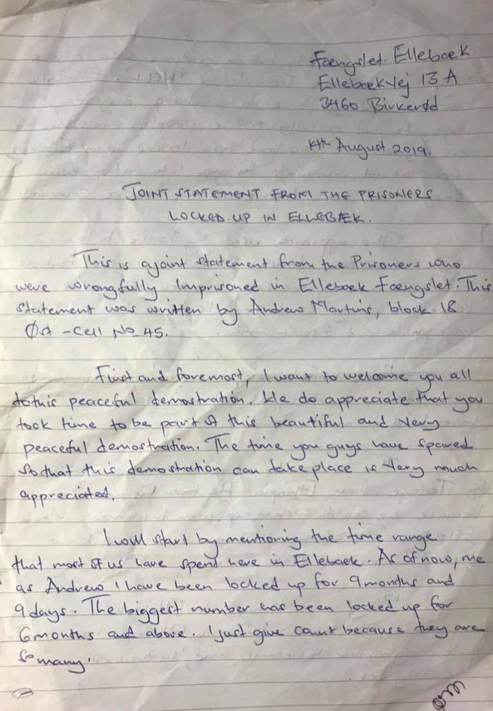
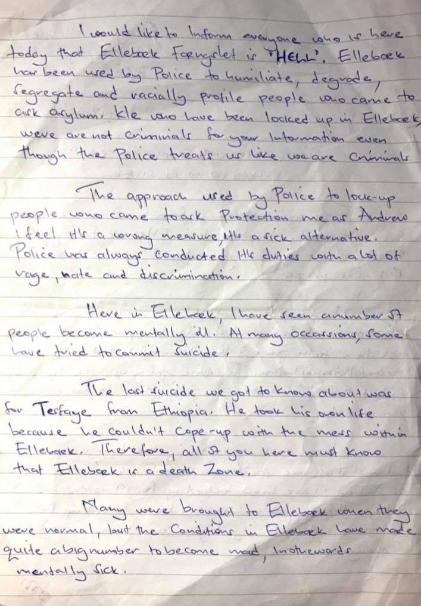
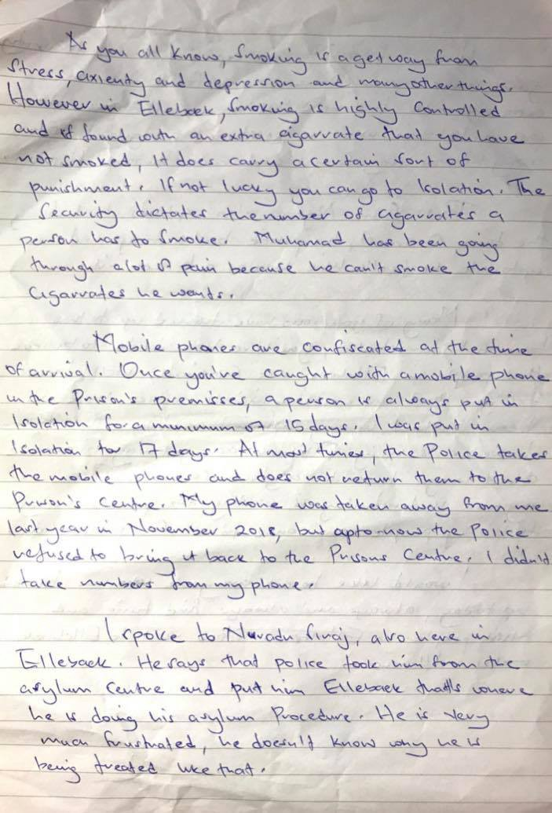
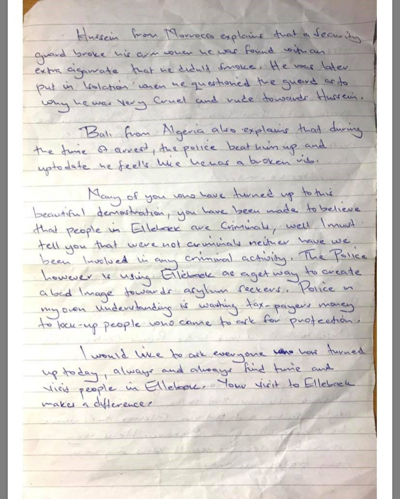
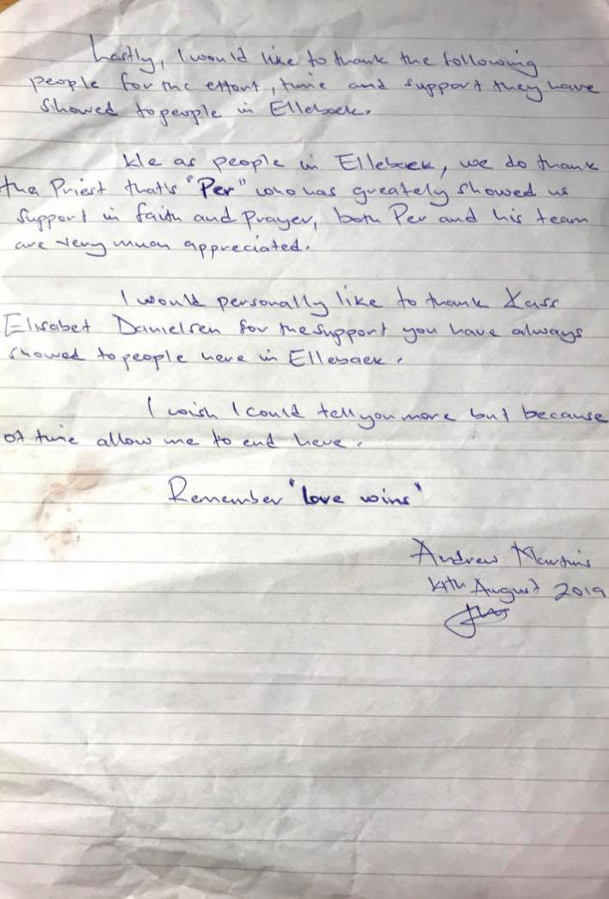

### AYS Daily Digest 16/9/19 Prisoners of Ellebæk, the Danish deportation camp, release joint statement

_90 people saved from drowning // Update from OceanViking // New arrivals in Greece // Donations needed for Lesvos // Top Italian officials will stand trial // more…_
### Feature

The state of Denmark has put rejected asylum seekers in a place considered by many as worse than Danish prisons\. These people have done nothing illegal, besides crossing borders\.

The following pictures are a joint statement from the prisoners of Ellebæk camp\.

The statement was gathered by inmate Andrew Martins, block 18 east, cell number 45\.
It was read out loud to the activists outside Ellebaek prison doing a [48 hour protest](https://l.facebook.com/l.php?u=https%3A%2F%2Fvimeo.com%2F357617553%3Ffbclid%3DIwAR2mbwWxUwvJVZ6N_k9s_zniFkU9pAouT5W3Y7ZRqSq0cETMa8MJ9frbXyU&h=AT2xNaubAwiQD9AbLufTyg2YdhfMaMYSGuLTGGrK25eFidRMG-yDWLrdMuOG0f-BWfGhD5Ln58_us61WdCWrNwhT1b4tNfXL9BtyfDMpTFTctQMJ1eStzeVyA-pg372yorJtQrob8G6vaoOh) from 30th of August to the 1st of September\. He gave the statement to his visitor, an activist who herself has been a visitor to Ellebæk for the last 4 months\.

The statement is important, these are human beings behind the fence, the inmates, have fled from their country of origin to Denmark\. They have been denied safety and basic human rights by the government of Denmark\.

Joint Statement photos provided to AYS

You can learn more about camp Ellebæk from AYS’s special found [here](ays-special-from-elleb%C3%A6k-deportation-camp-denmarks-forgotten-closed-prison-bc7b5aa587f8) \.
### Morocco

In an update from Nador:

> “Dozens of Syrian refugees among them many children blocked in Nador, organized this morning for a demonstration in front of the border post of blessed ensar, to request to allow them to access the asylum office in melilla\. Without Legal cause, the Nador authorities refused for refugees to be recognized as such by UNHCR so they can submit their asylum application in Melilla\.” 

### Sea

After many hours of reporting on a distress call of 90 people about to capsize, AlarmPhone is happy to report that:

■■■■■■■■■■■■■■ 
> **[Alarm Phone](https://twitter.com/alarm_phone) @ Twitter Says:** 

> > The boat with approx. 90 people on board has been rescued! After we relayed their distress messages to authorities in #Malta and #Italy, it was Italy in the end that sent out two rescue vessels. A successful rescue operation was confirmed to us at 4.44am. Welcome to #Europe! 

> **Tweeted at [2019-09-17 03:42:14](https://twitter.com/alarm_phone/status/1173804328886394881).** 

■■■■■■■■■■■■■■ 

Updates on OceanViking, from Lampedusa to continuing operations in the Libyan search and rescue zone:

■■■■■■■■■■■■■■ 
> **[Renata Brito](https://twitter.com/RenataBritoAP) @ Twitter Says:** 

> > Lampedusa port authorities inspected the #OceanViking for over 9 hours on Sunday. Eventually ship was cleared. While the port control took place we saw at least one small migrant wooden boat arriving autonomously to the island. A daily occurence. 

> **Tweeted at [2019-09-16 06:29:38](https://twitter.com/renatabritoap/status/1173484067188350976).** 

■■■■■■■■■■■■■■ 

■■■■■■■■■■■■■■ 
> **[SOS MEDITERRANEE](https://twitter.com/SOSMedIntl) @ Twitter Says:** 

> > UPDATE: Shortly after entering the Libyan search and rescue region this evening, the #OceanViking spotted a blue rubber boat adrift and partially deflated. Without an engine and with nobody onboard, it's likely the people on this boat fleeing #Libya were intercepted and returned. https://t.co/BWNH5hzW10 

> **Tweeted at [2019-09-16 20:08:01](https://twitter.com/sosmedintl/status/1173690018042433536).** 

■■■■■■■■■■■■■■ 

### Greece

According to [Aegean Boat Report](https://www.facebook.com/AegeanBoatReport/posts/651024315420676?hc_location=ufi) , on Monday five boats arrived on Lesvos with a total of 181 people\.

First boat → 49 people \(28 children, 11 women, 10 men\)

Second boat → 41 people

Third boat → 44 people \(27 children, 7 women, 10 men\)

Fourth boat → 7 people \(2 children, 2 women, 3 men\)

Fifth boat → 40 people

Also to find ABR’s Week 37 report, look [here](https://www.facebook.com/AegeanBoatReport/posts/650923215430786?hc_location=ufi) \.

New reporting on Lesvos in numbers:

■■■■■■■■■■■■■■ 
> **[RSA](https://twitter.com/rspaegean) @ Twitter Says:** 

> > Total population in #Lesbos island: approximately 12703 refugees. Since the 1st of September till the 12th Turkish Coast Guard stopped 112 boats trying to cross to greek islands carrying 3949 refugees. All were returned to #Turkey. 

> **Tweeted at [2019-09-16 19:09:16](https://twitter.com/rspaegean/status/1173675235205402634).** 

■■■■■■■■■■■■■■ 

■■■■■■■■■■■■■■ 
> **[RSA](https://twitter.com/rspaegean) @ Twitter Says:** 

> > 26 boats arrived since last Monday Sep 9 to Sunday Sep 15 in #Lesbos carrying 914 refugees. Transfer to mainland: 
255 #Moria total number is 10480+Approximately 4000 of them in the Olive grove.
UAMs 800+ Pre removal center ( prison inside moria) 44. #RefugeesGr #opentheislands 

> **Tweeted at [2019-09-16 19:04:55](https://twitter.com/rspaegean/status/1173674139200163847).** 

■■■■■■■■■■■■■■ 

[Refugee 4 Refugees](https://www.facebook.com/donate/1346008758882725/) has started a new fundraiser, to try to help the over 12,700 people living on Lesvos to get access to basic necessities\. Please consider donating what you can\. They provide a breakdown of what your contributions will go towards here:

> “Your donation could provide an individual with:
 

> 2 blankets — 10 €
 

> 1 sleeping bag\- 10 €
 

> 1 sleeping mat\- 10 €
 

> 1 tent for 6 people — 40 €
 

> Basic hygiene pack \(family of 4\) — 20 € 

> 175€ would provide all the essentials for 1 family of 4\. Additional needed items also include warm winter clothes and waterproof shoes\.” 

](assets/fbe96d48a09d/1*oksv_Bd7Mj-k-2wGqYpiAQ.jpeg)

Attika Human Support issued an emergency request for volunteers and supplies for their warehouses on Lesvos, Samos, and Chios\. Find out how you help\. Photo provided by [Attika](https://www.facebook.com/AttikaHumanSupport/photos/a.506310123057981/959057237783265/?type=1&theater)

Some encouraging political news from Greece \( \! \! \! \) The Neo\-Nazi Golden Dawn Party, following their electoral losses in July, have cleared the offices and seem to be no longer be financial able to function as a party\. Most of its old prominent members have left the party\. Learn more [here](https://greece.greekreporter.com/2019/09/16/neo-nazi-golden-dawn-party-clears-out-athens-headquarters/?fbclid=IwAR3srFzz8fHnH9Cnhi9HqfgMH-rrW7vzyP2kZCH7zXDPswpES_Yo6MA9blA) \.
### Italy

[Two top officials](https://au.news.yahoo.com/two-italian-officers-stand-trial-over-deadly-2013-130747332--spt.html?guccounter=1&guce_referrer=aHR0cHM6Ly90LmNvLzBaekt5VlBkdmE&guce_referrer_sig=AQAAAFl-L5OuAeY0oW1WMPv66xzvvhlrpfEYUcFNa1QY-20pKnUt_KzROZ3zkEemk_Qr2uH9GhX1k17v5xZuxUPK5mJXbMzGCA6SgCKAeQWOSO3jnZ2IEFHzz9k1aqXKqSQecFS5NDpz1yMICe4J4x671-jCMU5fQIQ1PHLa-tmfQCEt) will stand trial for manslaughter, for their failure to respond to distress calls in 2013, which resulted in 260 people drowning to death\. Leopoldo Manna, head of the Italian Coast Guard operations room, and Luca Licciardi’s, head of the operations room for the Italian Navy, trial will begin on December 3rd\. 6 years ago, this event sent shock waves through Italy and must not be forgotten\.

3 men were arrested in a migration centre in Sicily for serious allegations brought forth against them by several of the women in the centre\. They recognized the men as being their captors back in Libya\. These men systematically raped and tortured them, report the women\. Find out more [here](https://www.theguardian.com/world/2019/sep/16/italy-police-arrest-three-over-and-torture-of-migrants-in-libya?fbclid=IwAR1VoBX-bdMDMafS6Q1q8zfxPwb45jc4-3DqDZe2LcoG3KvRROk6qQHfl74) \.
### Bosnia

There is a urgent fundraiser going on which aims to send a medical team to Tuzla\. With over a 100–150 new arrivals every day coming from the long and arduous eastern route, people are desperately in need of care\. Find out how you can help [here](https://www.facebook.com/donate/512909012794636/2422595654495195/) \.
### France

The Refugee Women’s Centre _“are looking for volunteers who can commit to a minimum of TWO months to join our team from OCTOBER onwards\!”_ Find out more [here](https://www.facebook.com/refugeewomenscentre/photos/a.178973875861584/705299993228967/?type=3&theater) \.
### Denmark

Meanwhile, the Danish police are not commenting on the effect of the growing number of Iranian nationals, who now have deportation status\. Journalists have questioned if the government’s measures of detenting these people has had the “desired effect”, which is to get them to leave the country\. Read more [here](https://l.facebook.com/l.php?u=https%3A%2F%2Fwww.information.dk%2Findland%2F2019%2F09%2Fafviste-asylansoegere-frihedsberoeves-faa-udrejse-ingen-ved-nytter%3Ffbclid%3DIwAR1hXRvj8KhLx6KC1YESlctjjjQbRUsga8pmhrJPP9lizz1WmNrRiQF9ppo&h=AT1oNZ5NpfcUHVNdLZ7SoSObJCb46FE9JyTSAQu3-mUgJm4Cpx8ltwi2UK2B-B5ZC9tJd-dhQSBGTMMKxTWl6ZQuv9wprKIcusCGgCDB5AQEO0vulU9Pacqgn85fSSUDV10xCJE9gMSDPco9) \.

For more of a feature look into the deportation centers, read [this piece](https://l.facebook.com/l.php?u=https%3A%2F%2Fpov.international%2Fjeg-onsker-ikke-at-do-som-hjemlos-flygtning%3Ffbclid%3DIwAR27uSK_o0JkSKsm1aTajR1n3PvYzBRq1NBrp0-UZEeaOxArsiLF8dKgCWQ&h=AT1CaoMbDU_RwoafyZQ1Bj8LAiORfA7LGX2zo_xMDhQHAcO8ca-4x4ZsbDkOyAwN_F4be-O2JO4pk1x3B1x0GU5AAYXT98T5YO_puKTluC14v87vjjHAZd_4o9SIjI-yWG0UzvLeOhOqzA8H) from Danish journalist Chili Djurhuus who visited the Deportation Center Sjælsmark and interviewed Hawar Azizi, from inside\.
### EU

While August saw a rise of people crossing into Europe, [EU Commission](https://twitter.com/Avramopoulos/status/1173578416328720384?fbclid=IwAR3UzoZ2uKJb15Ghp5512aRgjkYs7Lp0YMUDWFzrsP7KzlPqauT4ftJLOog) officials note that “the total on all European migratory routes for 2019 remains 26% lower than a year ago\.” New Frontex numbers are also out for August, you can find them [here](https://frontex.europa.eu/media-centre/news-release/migratory-situation-in-august-slight-increase-on-main-migratory-routes-2Xmzlk?fbclid=IwAR28NvkCNLp9CgER4bXA3GkZCohVBBR-OF82O_x1O60Wt5mn80ReVzvuMGY) \.

■■■■■■■■■■■■■■ 
> **[DTM IOM](https://twitter.com/DTM_IOM) @ Twitter Says:** 

> > An est. 51,982 #migrants, including asylum seekers, arrived in #Europe via different sea &amp; land routes between Jan &amp; July 2019. 58% of arrivals are registered in Cyprus, Bulgaria &amp; Greece using the Eastern Mediterranean Sea route. Read on [bit.ly/FlowsToEurope_…](http://bit.ly/FlowsToEurope_July2019) https://t.co/qzBCLEJipI 

> **Tweeted at [2019-09-16 20:56:08](https://twitter.com/dtm_iom/status/1173702126834343936).** 

■■■■■■■■■■■■■■ 

**We strive to echo correct news from the ground through collaboration and fairness\. Every effort has been made to credit organisations and individuals with regard to the supply of information, video, and photo material \(in cases where the source wanted to be accredited\) \. Please notify us regarding corrections\.**

**Apart from daily news in English, we also publish weekly summaries in Arabic and Persian\. Find specials in both languages on our [medium site](https://medium.com/are-you-syrious/ays-weekly-in-arabic-and-persian/home?source=post_page---------------------------) \.**

**If there’s anything you want to share or comment, contact us through Facebook, Twitter or write to: areyousyrious@gmail\.com\.**

_Converted [Medium Post](https://medium.com/are-you-syrious/ays-daily-digest-16-9-19-prisoners-of-elleb%C3%A6k-the-danish-deportation-camp-release-joint-statement-fbe96d48a09d) by [ZMediumToMarkdown](https://github.com/ZhgChgLi/ZMediumToMarkdown)._
