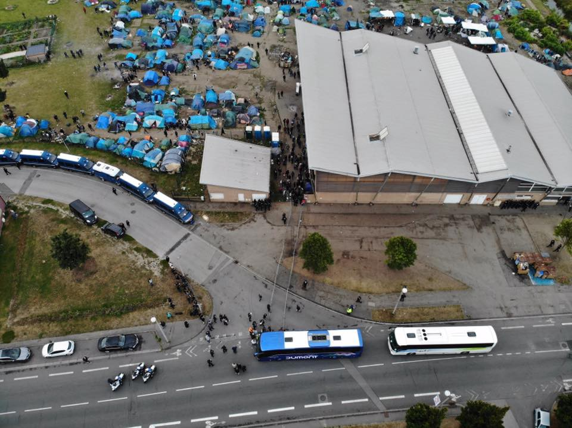
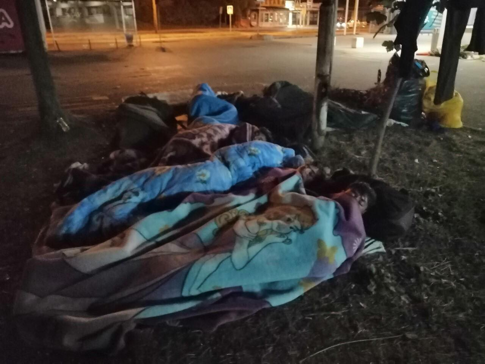
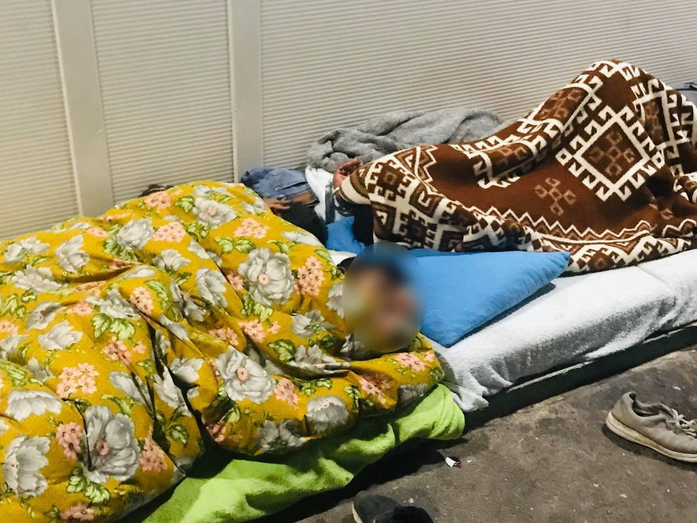
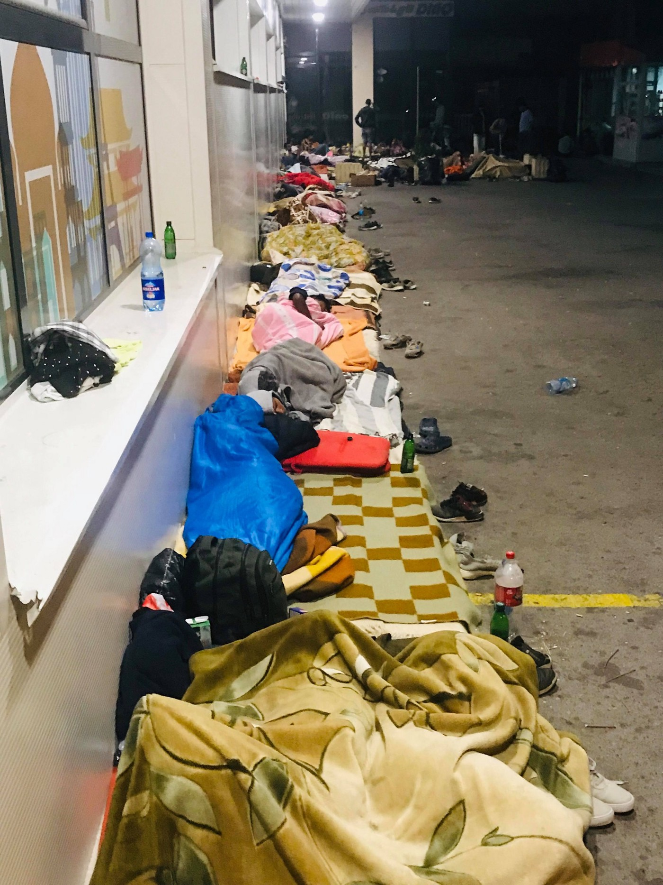

### AYS Daily Digest 17/9/19: Eviction in Dunkirk — once again, no long term solution in sight
#### Eviction of emergency center in Dunkirk // many arrivals on Greek islands // Border Violence Report released // ahead of winter in Bosnia, no permanent lodging or consistent help // More people drowned, some rescued in the Mediterranean

copyright: Mobile Refugee Support
#### **FEATURED**

As announced and feared for a while now the emergency center in Dunkirk and the surrounding camp were evicted on Tuesday morning by French police\. People were lead to waiting buses to be brought to accommodation centers across France\. The center that was located in a gym was installed in January last year as an emergency center for the last winter and hosted until yesterday about 1000 persons, amongst them about 50 unaccompanied minors\. 
According to officials, the people will be brought to proper accomondation centers with separate rooms and access to sanitary infrastructure\. The people are also supposed to receive support in their administrative process\. However, as can be learned from previous evictions, this cannot be regarded as a long lasting solution\. The people want to go to UK and will sooner or later gather again around Dunkirk in order to find a way to cross the channel\. But as their poor shelters and support facilities will be destroyed or removed, they will be off much worse than before\. 
Find a French article here:

First Aid Support Team \(FAST\), Help Refugees\. Calais4Calais and Mobile Refugee Support are on the ground and support the remaining persons and the once that are expected to return soon\.

#### GREECE

Since Monday morning, According to **Aegean Boat Rescue** at least 22 boats arrived to the Greek islands, carrying a total of 777 persons\. 12 boats arrived to Lesbos, and another 5 each to Chios and Samos\.

An article in The Guardian gives a good overview over the situation on the islands\.

> “Children being bitten by scorpions, rats and snakes; hundreds being forced to use a single shower; the stench of human excrement never far away; and food shortages becoming the norm\. \[…\. \]
 

> I struggle to find the right words because none can convey the sheer misery and inhumanity of a situation that in Europe is frankly unbelievable\.” 

Refugees 4 Refugees is looking for Volunteers on Lesvos or Samos:

#### BALKANS

The **Border Violence Report** for August was released by No Name Kitchen, with the support of the Border Violence Monitoring Network\. The report includes testimonies and observations of push\-backs and police violence from borders at the Balkan route and analysis the role of Frontex and other agents\. 
The report speaks of a new form of violence that must be regarded as torture and goes far beyond what appallingly must be seen as “normal” acts of violence during push\-backs in these days\.

> “Extreme cases of targeted violence such as these do not match the same operative framework as other forms of violence, such as the destruction of mobile phones or baton strikes to the legs and torso, which have become ubiquitous during push\-backs from Croatia\. Prolonged assaults, repeated administration of electric shocks, and the forced immersion into extremely cold waterways \-are not the mere byproduct of “regular” push\-back procedures, but a recurrent motif within the unregulated policing of Croatia’s border regime To this end, in certain cases, it is necessary to approach these incidents simultaneously as hate crimes, and not only constituent acts of violent border externalisation, but bearing their own weight as targeted individual abuse\.” 

The report gives a good overview of the current situations at the borders and is worth reading\. Find the full report here:

#### BOSNIA AND HERZEGOVINA
### Tuzla

More than a hundred people were queueing for a meal at the bus station in Tuzla\. The local volunteers provide it once a day in the afternoon\. 
The medical team had 24 interventions, mostly light wounds and bruises as a consequence of walking\. Another boy had stomack problems\.
A bit before midnight a new group of people arrived to Tuzla, among them 3 unaccompanied minors\. The total number of people who stay at the station is about 120\.
Apart from the bus station, some slept in a nearby park in front of a school\.

Also, one of the local mosques is a shelter to many people in the evening\. From time to time the police asks them to leave, but they come back very soon\. During the night, newly arrived people are gathering in front of the Foreigners’ office\. It has become very difficult to count them all because they are dispersed in different locations, the Tuzla volunteer group says\.

They say that the police has been present on a daily basis in the past three weeks at the bus station, and no problems arise\. The policemen there are doing a demanding job, while treating everyone in a decent and humane way\.

It has been 17 months that the authorities have been ignoring this problem\. All levels of official government, from the federal governmeent, through the cantonal, to the city officials\.

After crossing the border from Serbia to Bosnia and Herzegovina, it takes 3 to 4 days of walking for people to arrive to Tuzla\. They arrive exhausted, hungry and tired\. They usually stay a couple of days to rest\.

The volunteers report a big number of those who returned from Bihać, people who tried to cross into Croatia/the EU multiple times\. Most of them return without anything as they belongings get confiscated during the attempt to cross\. There are more and more reports of violent treatment and thefts by the Croatian police, but also the police in Bihać and Velika Kladuša\. They also warn of a staggering number of hate speech accounts all across the Una\-Sana canton, claiming they are not allowed to enter many of the public places like bars, cafes, restaurants etc\.

Among people in Tuzla, most of the people originate from Pakistan, Bangladesh, Algeria, Iraq, Marocco, Eritrea, Somalia, etc\., so the language barrier remains a problem when assessing health issues and other needs of the people\.

Photos: Senad Cupo

As winter is coming, needs for proper shoes, clothing, blankets, and sleeping bags are growing, also in other parts of the country\. No Name Kitchen and Firefly \* hope project are in need of donations and support\. Find their calls here:

### CROATIA

At the International conference for homeland security, while saying that in 2015 the government acted very irresponsibly, the Croatian president Kolinda Grabar Kitarović said that “if a new migration wave happens, this time we will act as a country that protects its borders and the longest land border of the EU”\. 
 In 2015 the Croatian Minister of Interior decided to push for an open, quick and secure route of the people, providing a free train transport in collaboration with other MoI in Europe, and in coordination especially with Austria and Germany\. 
The president also highlighted that she understands security as a method to minimize the **rist** and the basic condition for Croatia’s development, noting also that informing the citizens on the security challenges guarantees their active involvement, a statement that could mean many things, given the circumstances and context in the area\. “In the times of disinformation and fake news, we mustn’t allow that the lack of information shapes public opinion”, she said, adding: “Don’t allow the hybrid news from the neighboring countries or even some of the western countries penetrate the Croatian media”\.
### SEA

**One Boat sank** off the coast of Sfax governorate, Tunesia\. Only nine people survived\. So far eight bodies were found, but Tunisian media speak of 14 to 25 missing people in total\. Again, so many people lost their precious lives\.

Apparently one **rescue operation** was carried out by **Italian coast guards** in the Maltese SAR zone, after Malta requested support from Italy\. After the rescue Malta refused to send boats to transfer the 90 people to Malta\. Maltese authorities claim that the rescue did not actually happen in the Maltese SAR zone and support the position that rescued persons should be borught to the nearest port — which in this case apparently would be Lampedusa\. The Italian ships are heading toward Malta nethertheless, claiming that the rescue took place in the Maltese SAR zone\.

Find an article in Italian here:

10 people autonomously landed on Lampedusa\.

In two different rescue operations both conducted off the coast of Libya, a total of **109 survivors were taken on board of the Ocean Viking** \(MSF\-Sea and SOS Mediterranee\) \. Amongst them are very young children and a new\-born baby\. The boat from the second operation was before detected by the Sea Watch Italy plane Moonbird\.

**Another boat** with an already deflated tubular tire, which was detected by the Moonbird, was later **intercepted by the Libyan Coastguard** and brought back to Libya\. AYS has repeatedly reported about the disastrous conditions for refugees in Libya\. Libya’s ports are no safe ports\.
### **GERMANY**

On Saturday night, a wheelchair user was attacked violently and racist insulted\. The suspect was later arrested by the police close to the scene\. Apparently he is known to the police for previous racist offences\. The victim — a 31 year old man from Libya — is paralysed and bound to the wheelchair due to injuries from the Libyan civil war\. The attack took place in Chemnitz, a city in the east of Germany that became ingloriously famous in August 2018 when a mob of far right people hunted people with assumed migrant background\.

Find an article in German here:

**If you wish to contribute, either by writing a report or a story, or by joining the info gathering team, please let us know\.**

**We strive to echo correct news from the ground through collaboration and fairness\. Every effort has been made to credit organisations and individuals with regard to the supply of information, video, and photo material \(in cases where the source wanted to be accredited\) \. Please notify us regarding corrections\.**

**Apart from daily news in English, we also publish weekly summaries in Arabic and Persian\. Find specials in both languages on our [medium site](https://medium.com/are-you-syrious/ays-weekly-in-arabic-and-persian/home?source=post_page---------------------------) \.**

**If there’s anything you want to share or comment, contact us through Facebook, Twitter or write to: areyousyrious@gmail\.com\.**

_Converted [Medium Post](https://medium.com/are-you-syrious/ays-daily-digest-17-9-19-eviction-in-dunkirk-once-again-no-long-term-solution-in-sight-f709d030b7f4) by [ZMediumToMarkdown](https://github.com/ZhgChgLi/ZMediumToMarkdown)._
