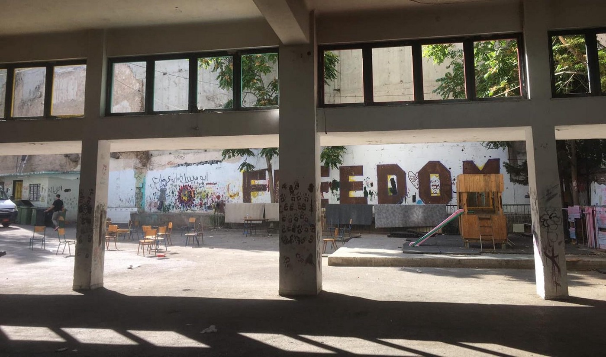

### AYS Daily Digest 19/9/19: Families evicted from squats in Athens
#### 269 people have been evicted from Acharnes 22 and Jasmine School squats, including 46 families and 98 minors / Evicted refugees have been transferred to the new Corinthos camp which is not equipped to host human beings / Big influx of new arrivals to Greek islands: more than 500 people in the last 24 hours / Refugees sleeping rough in Bosnian city of Tuzla, local authorities ignoring the approaching winter / Families manage to ask for asylum in Croatia, but no one can guarantee that new arrivals won’t be pushed back / Sudanese man killed by guards after forcible return to Libyan coast / Volunteers needed in Italy, where numbers of new arrivals are rising / Far\-right groups patrolling the Dover coast to intercept migrant boats

There were 30 babies and small children among evicted refugees / Photo: Nasim Lomani
#### Feature story:

Solidarity groups have shared their outrage following two coordinated police raids of squats in downtown Athens\. The first raid started around 6AM, targeting the squat on 22 Acharnon street\. A total of 90 refugees were kicked out, including 21 men, 33 women and 36 minors\. The five\-story apartment block on 22 Acharnon street belongs to a private citizen who has repeatedly asked for the building to be cleared out of its refugee residents\. Following the return of City Plaza and several other privately\-owned buildings to their legal owners, there has been increased pressure from other private owners to evict squatters and to return the buildings to their possession\.

> In total, 269 people have been evicted from two squats in Athens, including 46 families and 98 minors, 30 of them being small children and babies\. 

Soon afterwards, 67 men, 50 women and 62 minors were evicted from the Jasmine School squat, at the nearby junction of Sourmeli, Acharnon and Mayer street\. The Jasmine School squat has been one of the beating hearts of solidarity in Athens\. Refugees have been living in it since 2016, when volunteers and future residents transformed a worn\-out, abandoned school into a place of solidarity and dignity\. Unlike the squat on 22 Acharnon street, Jasmine School is a public property with no plan for other use in the near future, which makes the eviction even more unnecessary\.

No children’s laughter anymore: empty Jasmine School squat in Athens\.

Long\-term volunteer and AYS member Leslie Meral Schick found the best words to describe the importance of these squats to people who have been offered no better alternative from the authorities:

> The Athens squats are communities\. People living in them are forced to do so because of a dire lack of housing in Athens\. No one wants to live in a tiny space partitioned by curtains, or to share a toilet with 250 people, or to live off of donated food\. But they make do because there is no other choice, and they maintain a degree of autonomy and dignity by doing so\. Most importantly, they constitute a functional community\. 

> I spent quite a bit of time at the Jasmine Squat and thanks to donations, was able to deliver a lot of food and supplies there for a while\. In May of 2016 we spent days trying to find housing for a single mother, her four teenagers and two grandsons, one of them newborn\. The 2nd School Squat was in the process of opening just then, and the family were thoughtfully given the smallest room in the building so that with a newborn, they wouldn’t have to share it with others\. 

> Early this morning, police descended on this squat too, and evicted its occupants\. The meagre possessions people have managed to collect are routinely dumped\. Previous such evictions have shown that there is no concrete and humane plan as to where they will now go\. 

Workers sealing the doors with concrete blocks to prevent return of the people\.

Meanwhile, municipal crews have started throwing people’s belongings out of the buildings and sealing the doors and windows with concrete blocks in order to prevent return of their residents\.
### Evicted Refugees Transferred to Large Tents in Dusty Terrain Near Corinth, Lacking Basic Facilities and Privacy

After the raid, most of the evicted refugees have been transferred by buses to the police’s aliens directorate, which promised to find “viable solution” for their accomodation\. But camp evictees have been moved to the new Corinthos camp in the Corinth area, an hour of drive from Athens\.

> They are expected to live in 16 huge non\-winterized white tents with no privacy, in the middle of the dusty terrain which will soon turn to mud, far from the urban area and necessary facilities\. 

According to volunteers present on site, cooking areas and decent showers are missing from the camp, comparable to the notorious Malakasa camp\. With winter approaching, this is far from the acceptable solution for any human being, let alone the most vulnerable ones\.

](assets/4fbfc4144a79/1*cGgSVRR7p8Up6XL6wm01Qg.jpeg)

Removed from the urban area and transferred to the middle of nowhere\. Photo: [Patricia Colón](https://www.facebook.com/patricia.colon)

Following today’s eviction, residents of other squats in Athens fear they might be next targets of police raids\. Most of the families evicted today were refugees from Syria, Afghanistan and Iraq\. Many of them have already tried to return to Athens, saying they would rather sleep in the park than stay in the middle of nowhere, in a camp which is not equipped to host people and provides no assurance of dignified or even safe stay\.
### Following Influx of New Arrivals, Greek Islands Now Host 28,176 People

According to the [Aegean Boat Report](https://www.facebook.com/AegeanBoatReport/posts/652934448562996?hc_location=ufi) , at least 13 new boats have arrived on the Greek Aegean Islands in the past 24 hours, carrying 510 people\. Currently available figures show that most of the new arrivals are children, followed by women\. Contrary to popular belief, male refugees are the smallest proportion of the new arrivals\.

According to the latest official figures, a total of 28,176 refugees are being hosted on Greek islands, roughly 26,600 of them on Lesvos, Chios and Samos\.

Six new boats arriving to Lesvos today brought mostly children and women\. Photo: ABR

Moria camp on Lesvos is equipped to host 3,000 people, but at this moment it has three times more residents, making the situation unbearable for everyone\.

This month alone, Lesvos has already received around 2,500 refugees, despite managing to previously transfer 1,400 people to the mainland to be housed in alternative facilities\. Around another 3,100 are currently staying in camps on Chios, while there are almost 5,000 housed in facilities on Samos\.
#### Bosnia
### Refugees Sleeping Rough in the Streets of Tuzla, No Official Indoor Accommodation Plans as Winter Approaches

In the Bosnian city of Tuzla, accommodation remains the biggest problem for refugees who are arriving in great numbers\. At the moment, more than a hundred refugees are sleeping rough at the Tuzla Bus Station\. It is becoming increasingly certain that both autumn and winter will be welcomed outdoors\. The situation was the same last year\. Tuzla volunteers have pointed to this problem before, but at the state level nothing has been solved so far, and there is no indication that anyone will really address this issue more seriously\.

> ‘Last winter, people came to Tuzla every day, but not in this number\. It was then easier to provide temporary accommodation and basic assistance\. It’s different now\. It’s a general disaster\. People hate each other, we can provide one meal a day with the help of Merhamet, and with support of the citizens of Tuzla\. We don’t really know what to do anymore,’ volunteers told us\. 

At the bus station alone, at least 150 refugees sleep rough every night\. Photo: Senad Cupo

The police have been present at the station every day for the past month and are concerned with the safety of both citizens and migrants\.

> ‘In this whole story, only police \[are\] actually doing their job\. It’s not easy for them either\. Imagine daily communication with people who speak different languages\. We witness the humane actions of our police officers on a daily basis\. There is no cause for concern for citizens, everyone who shows up at this site knows this,’ volunteers have added\. 

During the day, the only restroom that refugees can use is at a nearby restaurant\. When office hours are over and that toilet is locked, there’s no decent place where physiological needs can be met\. Bathing seems like a distant dream for people who sleep on concrete floor\.

Local solidarity groups are making a huge difference for refugees in Tuzla\. Photo: Senad Cupo

Despite all the above, on a cool Tuzla night, Muhammad from Bangladesh welcomes volunteers with a smile\.

> ‘The people here are good\. There is always someone to help us\. In addition to food and blankets, we are grateful to the volunteers who spend time with us on regular shifts\. Sometimes a nice word means a lot\. We joke with them, they learn our languages ​​and surprise us every time\. We also got some board games yesterday to shorten our daily routine\. It may seem like a small gesture, but it actually means a lot,’ Muhammad says\. 

In Tuzla, a volunteer medical team provides dozens of different medical interventions every day, but the general atmosphere still reflects mutual understanding and solidarity, something that seems to be missing in other Bosnian cities that were welcoming to refugees until recently\. Long\-term international volunteers are welcomed by local solidarity groups\.
#### Croatia
### More Families Accessing Asylum Procedures, but Constant Pushbacks Leave No Room for Hope

AYS volunteers have noticed a small, but relevant increase of people who were allowed to ask for asylum in Croatia\. In the first part of the year, there were almost no new arrivals to the camps, and those who would manage to reach Zagreb would later share their testimonies of violent push\-backs to Bosnia or Serbia\. It seemed that even very public cases of people being intercepted by police officers on Croatian soil would result in push\-backs, leaving no room for hope that human rights of undocumented refugees would be sytematically protected in this EU country\. In the past weeks, however, we have noticed a influx of new people coming to our free shop, sometimes up to 50 new people per day, most of them being families coming from Bosnia\.

With the recently renewed access to Porin camp in Croatia, where we have been the only volunteer\-run NGO systematically working with children and minors since early 2016, we’re also noticing many new children who have obviously spent some time in the Balkans, because they know basics of Bosnian/Serbian language and they seem to have been involved in some educational activities in their previous locations\.

New kids have arrived to AYS classroom in Porin camp, many of them from Bosnia\. Photo: AYS
#### **NGOs Can’t Guarantee Access to Asylum Procedure**

This is still far from enough to be optimistic about the possibility to access asylum procedures in Croatia: individuals and groups united in the the [Border Violence Monitoring Network](https://www.borderviolence.eu) , which includes NGOs such as No Name Kitchen, Rigardu and AYS, are still registering hundreds of push\-backs from Croatia to surrounding countries every month\. It seems that refugees who want to ask for asylum in Croatia have the misconception that NGOs can grant them access to the legal procedure\. This is unfortunately not true as only police officers can accept their claim for asylum\. And it still seems to be a painful lottery, since many people are being pushed back from police stations where they go to ask for asylum\. At the moment, anyone who leads people to believe that an NGO or individual can guarantee access to ayslum procedure is probably doing this for the sake of his own profit\. [Local NGOs are already being criminalised](ays-special-when-governments-turn-against-volunteers-the-case-of-ays-81fcfe0e80e7) for supporting refugees in completely legal ways, and they currently have no means of ensuring fair police treatment of refugees or even volunteers who intend to help them in obtaining their legal rights\.
#### Sea
### Sudanese Man Killed by a Guard Shortly After Being Returned to Libyan Shore

A Sudanese migrant died from a bullet wound today, hours after being returned to shore by the Libyan Coast Guard, according to the International Organization for Migration \(IOM\), whose staff [witnessed the tragedy](https://www.iom.int/news/iom-deplores-death-migrant-killed-thursday-upon-disembarkation-tripoli) \.

The horrible event occurred at Abusitta Disembarkation point in Tripoli as many of the 103 migrants returned to shore were resisting being sent back to detention centers\. IOM staff who were on the scene report that armed men began shooting in the air when several migrants tried to run away from their guards\. The migrant was struck by a bullet in the stomach\. Despite immediately receiving medical aid by an IOM doctor and then being transferred to a nearby clinic, he died two hours after admission\.

This tragedy comes two months after 53 migrants, among them six minors, were killed in an airstrike on the Tajoura detention centre\. That facility remains operational to this day, despite persistent calls to end the arbitrary detention of migrants\. Some 5,000 migrant women, children, and men remain detained in inhumane conditions in Libya\. Over 3,000 are detained in areas of active conflict where they are at heightened risk\.
#### Italy
### 1,200 New Arrivals in September

The Italian Ministry of the Interior has published [new statistical data](http://www.interno.gov.it/it/sala-stampa/dati-e-statistiche/sbarchi-e-accoglienza-dei-migranti-tutti-i-dati) showing that a total of 1,200 migrants had arrived by sea in September to date, most of them arriving on the islands of Lampedusa and Sardinia\. The majority of the migrants who arrived in Italy in September have come from Tunisia \(1,665\) followed by Pakistan \(862\) and then the Ivory Coast \(676\) \.

_The disembarkation of 10 Tunisian migrants at the port of Lampedusa \| Photo: ANSA_

This is the first time in 2019 that the number of migrants arriving by sea in one month has surpassed that of 2018\. However, only around 6,300 migrants have arrived in Italy since the beginning of 2019 so far, a 70% decline for the same period compared to last year, when around 20,800 people had arrived as of mid\-September 2018\.
### Volunteers Needed in Ventimiglia and Trieste

With many new people who have just recently arrived in Italy by sea or land, medical volunteers are urgently needed in Ventimiglia\. Lot of people walked there this week and suffer from extremely infected wounds/bites etc\. that need to be seen by a doctor and treated in order to prevent further complications\. If you are of medical background and can help, please contact [Jay Green on Facebook](https://www.facebook.com/jay.b.green.3?hc_location=ufi) \. Volunteers are also needed in Trieste, so feel free to contact [Lorena Fornasir](https://www.facebook.com/fornasirlorena/) if you’d like to know more about this posting\.
### Pull Factor Debunked as Nonsense in 3 graphs

Right\-wing governments and populists have been claiming for a long time that SAR missions act as the “pull\-factor” for the new arrivals of refugees to European shores\. This has been debunked as nonsense too many times, but they seem pretty resilient to common sense arguments\. Therefore we encourage any spreading of the hard data which provides counter\-arguments for the toxic narratives that harm both refugees and SAR missions\.

Twitter user [Matteo Villa](https://twitter.com/emmevilla) has shared a series of graphs showing the number of new arrivals from Lybia to Italy has not been affected by the presence of rescue ships\. However, the number of new arrivals has correlated significally with weather conditions that allow travel by the sea\. In the first 18 days of September alone, there were 75 new boat departures from Libya to Italy with no SAR vessels present in the area, while 44 boats have departed while SAR vessels were present on their route towards Italy\.

#### Denmark
### Minister of Integration: Foreign Criminals are Not Welcome Here, They Have to Go Home

The Minister for Foreign Affairs and Integration Mattias Tesfaye is finally putting an end to the plans for an exit center for criminal foreign nationals on the desolate island of Lindholm, but the proposed alternative is also blood chilling\. This is the message from the Ministry of Immigration and Integration in an email earlier today:

> ‘It is quite expensive to sail criminal foreigners in shuttles between Lindholm and the mainland\. An overnight stay on the island costs the same as an overnight stay at a luxury hotel\. But does it make more people go home? Barely\. It’s money out the window\. Now we are working on finding a cheaper solution\. Criminals are not welcome in Denmark\. They have to go home\.’ 

Obviously not a decision taken from reasons of humanity, but solely from a vantage point of economic and ideological cost/benefit\.
#### Britain
### Far\-right Groups Patrolling the Dover Coast to Intercept Potential Migrant Arrivals

A Britain First member on beach patrol in Dover / Photo: Britain First

In Dover, far\-right groups are following examples from Bulgaria, Hungary, Slovenia and other sad parts of European Union\. According to [Kent online](https://www.kentonline.co.uk/dover/news/far-right-group-patrols-beaches-for-migrants-212472/?fbclid=IwAR24T8BSYlhk4rdOVH2GXZEWv_Zee7inl_2UFmI4Hm1CiKXQBw8wFh1wxVg) , extremists have started beach patrols in the area on the lookout for migrants, and hardline Britain First says it will intensify them in the coming weeks as part of a campaign called Operation White Cliffs\.

> A statement from the group said: ‘This particular beach has been the main landing ground for multiple illegal migrant crossings\. Equipped with torches, binoculars and hi\-vis jackets, our activists patrolled the beach keeping a close eye out for migrant crossings\. This new operation has been dubbed Operation White Cliffs and will be escalated over the next few weeks\.’ 

Brexit might be near, but it seems that British and European assholes still share a lot of good old Anglo\-Saxon hypocrisy while targeting immigrants from the countries their governments have been meddling with for ages\.

**If you wish to contribute, either by writing a report or a story, or by joining the info gathering team, please let us know\.**

**We strive to echo correct news from the ground through collaboration and fairness\. Every effort has been made to credit organisations and individuals with regard to the supply of information, video, and photo material \(in cases where the source wanted to be accredited\) \. Please notify us regarding corrections\.**

**Apart from daily news in English, we also publish weekly summaries in Arabic and Persian\. Find specials in both languages on our [medium site](https://medium.com/are-you-syrious/ays-weekly-in-arabic-and-persian/home?source=post_page---------------------------) \.**

**If there’s anything you want to share or comment, contact us through Facebook, Twitter or write to: areyousyrious@gmail\.com\.**

_Converted [Medium Post](https://medium.com/are-you-syrious/ays-daily-digest-19-9-19-families-evicted-from-squats-in-athens-4fbfc4144a79) by [ZMediumToMarkdown](https://github.com/ZhgChgLi/ZMediumToMarkdown)._
