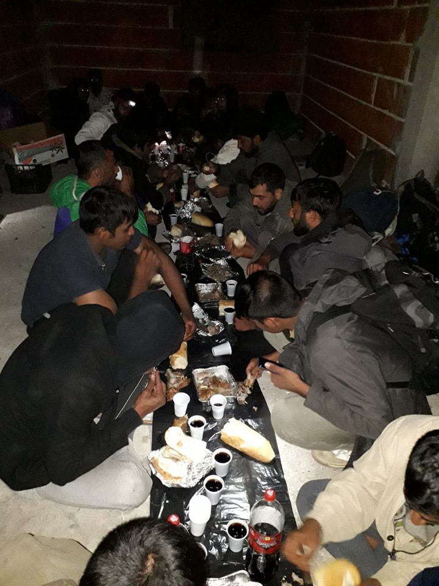

### AYS Daily Digest 20/09/2019 — Rescues and delays in the Central Med

[Are You Syrious?](@AreYouSyrious?source=post_page-----ac14cfa7f38b----------------------)

[Sep 21](ays-daily-digest-20-09-2019-rescues-and-delays-in-the-central-med-ac14cfa7f38b?source=post_page-----ac14cfa7f38b----------------------) · 8 min read

More on the man killed while resisting detention in Libya /// Another busy day in the central med /// A baby dies off the coast of Turkey /// Protests inside Italian CPRs /// Danish refugee board overrule Asylum service assessment

The situation right now in the central Mediterranean is beyond mad and chaotic\. Libyan coast guard takes as many people back to Libya\. Alarm Phone has never received so many distress calls\. EU coast guards systematically delay their rescue operation, risking the lives of those at sea\. \(Photo published by [Maurice Stierl](https://www.facebook.com/maurice.stierl?__tn__=%2Cd%2AF%2AF-R&eid=ARA2v9XGwMfRT8ct0GJHFdXlInBrZr3ds3ulgR8oQPyuplZEsgwkc8PTnzCSwKjENs4Sr7eeiQE_Tt21&tn-str=%2AF) \)
### FEATURE: RESCUES AND DELAYS IN THE CENTRAL MEDITERRANEAN

AlarmPhone — Watch the Med was [contacted](https://twitter.com/alarm_phone/status/1174992310276415489?fbclid=IwAR1ui6Czx0LudwLQUp-yrorA1yAPZ9Sy25BkUFU_fV0AHsIuHFQqHOar3Ec) by people in distress in a rubber boat in the Maltese SAR zone\. The boat was also spotted by the civil aircraft Moonbird\. The engine was not running and no one on board was wearing life vests\. They immediately alerted the Maltese coast guard, which decided to send a rescue boat only thirteen hours later\. Ninety people have been transferred to a Maltese Army ship and are being transported to the European island\.

In the meanwhile, Ocean Viking [rescued](https://twitter.com/MSF_Sea/status/1174793516935000064) 35 people from a wooden boat in international waters\. Adding to the 182 people rescued in three previous operations during the week, now 217 people are on the vessel run by MSF and SOS Mediterraneé\.

In a sad, but all too common move, Libyan authorities [requested](https://twitter.com/SOSMedIntl/status/1174963352415522816) that these people be transferred to a “safe port” in the northern African country\. Obviously Ocean Viking refused, insisting that a safe port had to be given by Italy or Malta\. Malta only [agreed](https://twitter.com/SOSMedIntl/status/1175084190158741504) to take the 35 people rescued last\. At the moment of writing, the other 182 people [are still on board](https://twitter.com/MSF_Sea/status/1175081388640542721) waiting for European politicians to play their usual games\.

LIBYA
### Sudanese man killed while resisting detention on return to Libya

As we reported yesterday, a man has been shot at the Abusitta disembarkation point in Tripoli, having been returned to shore by the Libyan coast guard along with 102 other people\. The incident was witnessed by [IOM](https://www.iom.int/news/iom-deplores-death-migrant-killed-thursday-upon-disembarkation-tripoli) staff and other international agencies have also spoken out about this ‘deplorable act’ including [UNHCR](https://twitter.com/yaxle/status/1174967143583977472?fbclid=IwAR1gyNM5s7nY0aDdUjqPvoljTEtBSjQMzKEk95rkfFyhQwdLGAGeUpiDcdU) \.

Although most official sources state that the murder was committed by ‘armed men’ after they fired into the air, [other groups](https://twitter.com/RescueMed/status/1174971331709825024?fbclid=IwAR2CwOWxTPRP7Seq-cMQezFtOxSS-ogW3bdcO17Plyyd99Gn-4BE2phOWOY) have clearly named the Libyan Coast Guard themselves as the perpetrators\.

There are currently believed to be [5,000 people in detention in Libya](https://www.infomigrants.net/en/post/19647/sudanese-migrant-dies-in-shooting-after-being-returned-to-libya?fbclid=IwAR2q8cwjM61Ry1vnfdd3S0MtMKOg2RhRekU8Qr-coTDiXLDzLeWqjemtO1w) , 3,000 of them in active war zones\. And the war of words also continues, with phrases such as migrants fleeing war \(the definition of a refugee…\) \. We have long called for an end to detention in Libya and safe passage for people on the move\. It is unfortunately not a shocking development that live rounds would be used in a war zone against unarmed civilians, nor is it the first time the Libyan Coast Guard has been implicated in a violent act against those it is supposed to protect\. The only thing that could shock us now is if the EU and UN decided to do something about it, which as we saw above with the situation in the Mediterranean is unlikely to happen\.

MOROCCO

[AMDH Nador report](https://web.facebook.com/AmdhNador/photos/a.1693125780899690/2418348375044090/?type=3&theater) that the 70 people arrested at sea by the Navy on 17th September are being held in a prison in Arekmane\. Ten people from the Comoros islands are thought to be included in this number and are being actively searched for by their families\.

TURKEY
### Baby dies at sea

\(Photo Credit: [Aegean Boat Report](https://web.facebook.com/AegeanBoatReport/posts/653440635179044) \)

[Aegean Boat report](https://web.facebook.com/AegeanBoatReport/posts/653440635179044) state that a boat carrying 16 people has capsized off Bodrum, Turkey\. Although 15 people were rescued, one baby is still missing, presumed drowned\.

> _Turkish Coastguard located people in the water 07\.00, from a boat heading towards Kos\._ 
 

> _Several boats and a helicopter participated in the rescue operation, but the baby was not found, another pointless death\._ 

A total of [953 people](https://missingmigrants.iom.int/region/mediterranean) are known to have died in the Mediterranean so far this year\. We no longer ask when is it enough, because as we knew all along, even one death in the struggle for freedom is too many\.
### Attacks in Adana

Tensions between communities continue as local [media report](https://www.middleeasteye.net/news/angry-crowds-attack-syrian-businesses-adana-over-sexual-abuse-allegation?fbclid=IwAR2ITHXldp0syH8J6nsJxgoDtkKOXCDJiNIm3yRamCHzhQa8JIvXTX2GfYw) that attacks have been taking place on Syrian\-owned businesses in Adana after false news was spread that a Syrian man had been involved in a case of sexual abuse\. It has been confirmed that the suspect is in fact Turkish\.

GREECE
### Arrivals

[17 boats arrived](https://web.facebook.com/AegeanBoatReport/photos/a.285312485325196/653499208506520/?type=3&theater) on the Greek Aegean Islands in just one day, carrying 666 people, 9 of the boats arrived on Lesvos\.

As [Lighthouse Relief inform](https://twitter.com/LighthouseRR/status/1175130124112580609?fbclid=IwAR1nUPHJUGQhzL9c02M_gTsh_qqtn8F-pUYVARS8vIaM-Lms_nOAvdlNl18) us, 45% of those arrived today are minors\.
### Lesvos

Today, the population of the Moria hotspot has reached 12,000 \(data [confirmed](https://twitter.com/rspaegean/status/1174947023679713284?fbclid=IwAR09BZQR3Q9AI_QWwMg6Tux5jdZpbSUDTkMXDYIv571JMsVR3GBhS2PFXRQ) by the hotspot deputy director\) \. This is four times the official capacity of the camp\. **We echo RSA who demand the lifting of any geographical restriction for refugees on the islands a directive which remains in direct contravention of the 1951 Refugee Convention\.**

Athens

**Protests against evictions**

Last night a solidarity dinner was organised for the 3rd birthday of [Spirou Trikoupi 17](https://web.facebook.com/spiroutrikoupi17/posts/727545427692260?hc_location=ufi) \. They housed thousands of people over the last three years up until their recent eviction\.

> _You can’t evict our dreams… You can’t evict a movement\!_ 
 

> _Our community will never die\. Trikoupi is still alive\!_ 
 

> _Solidarity will win…_ 

**Solidarity and Volunteer calls**

Drop in the Ocean are in need of field workers in Athens, Northern Greece, on Samos and on Lesvos\. More info [here](https://www.drapenihavet.no/en/volunteer-in-field/?fbclid=IwAR2noO5RoNpvkyLYK7wJ_o_iRZEFZ-n8OAwJvT0QMTjjA9X35g1yaNyIIoY) \.

Boat Refugee Foundation are looking for teachers, psychologists, pedagogues and social workers to work with people on Lesvos\. More info [here](https://web.facebook.com/groups/informationpointforlesvosvolunteers/permalink/1208068462733932/?hc_location=ufi) \.

ITALY

In the last 48 hours at least three boats arrived on Lampedusa\. The last was intercepted by the Italian Coast Guard 14 miles from the coast of the island, while it was starting to take in water\. Around 70 people were on board and have now been taken to the island’s hotspot\.

Protests inside Italian CPR \(detention centres\) happen often, but rarely do these manage to make the headlines or even to reach beyond the walls of such centres\. On Friday the detainees in the men’s wing of the CPR in Ponte Galeria, in Rome, [started a protest](https://www.facebook.com/1117797201582419/photos/a.1119136308115175/2973098232718964/?type=3&theater) to resist the deportation of some of their number\. Mattresses from four of the six areas were set on fire to prevent officers from coming in\.

It seems that some of those who started the protest were [transferred](https://www.facebook.com/permalink.php?story_fbid=2973325062696281&id=1117797201582419) to the women’s area of the CPR\.

Even one of the Italian police unions expressed concern regarding the conditions in the detention centres, especially regarding the one in San Gervasio, near Potenza\.

As the group [Freedom, Hurriya, Libertà\. Nessuna galera, nessuna frontiera](https://www.facebook.com/permalink.php?story_fbid=2973541619341292&id=1117797201582419) report, in a statement regarding the working conditions of the police agents in the centre, the union also reveal details about the situation detainees have to suffer: the entire structure is open\-air, and exposed to all weather conditions, detainees are divided in groups by fences and they have to spend most of their time on the roofs of the structures to try and get some reception for their phones\. Often, and especially in recent weeks, many people have fled the centre, or have tried to do so\. The last episode seems to have happened on September 18, with an attempt by a large number of people to break out of the centre\. The attempt was repressed by riot police\.

BOSNIA

As we reported in our digest yesterday, the situations in both the Velika Kladusa area and the town of Tuzla are worsening, with no plan in sight to provide dignified accommodation and to prepare for the incoming winter\.

Photo by [Udruzenje Solidarnost Bosnia](https://www.facebook.com/solidarnostbosnia/photos/a.1862322253778951/2951768011501031/?type=3&theater&ifg=1)

Different local and grass\-roots groups are doing what they can to support people on the move, while [police](https://www.facebook.com/groups/144469886266984/permalink/413527646027872/?hc_location=ufi) keep harassing people because of the colour of their skin and preventing them from moving freely around the country\.

Different calls for donations and financial support have been published to try to keep up with the needs of those on the move:

Udruzenje Solidarnost Bosnia is asking for [food deliveries](https://www.facebook.com/solidarnostbosnia/photos/a.1862322253778951/2951768011501031/?type=3&theater&ifg=1) \. Local solidarian Amira Jasarevic is collecting [food, first aid items and clothing](https://www.facebook.com/amira.ja.71271/posts/391941121748969?hc_location=ufi) \. Please support them\.

BELGIUM

Volunteer call out by [FAST](https://web.facebook.com/FASTFirstAidSupportTeam/posts/768491676919524) who need people who can provide first aid in Brussels over the winter\.

> _Yesterday a team of 3 FAST volunteers treated 126 patients over the course of an afternoon\._ 

For more info, visit their website — [https://www\.f\-a\-s\-t\.eu/](https://l.facebook.com/l.php?u=https%3A%2F%2Fwww.f-a-s-t.eu%2F%3Ffbclid%3DIwAR1qiU2RY5mneBtAIECVNPEXOSOiKAKxII2CGzJKoLhmjkWMPkXj_gFkjQA&h=AT1XuSw3LyDxcdvCMl5Hex5J4AyenH5e-ZWdVn5seIKndOVB44btcfarIDvBgoOGNgm_KB-m-dODJbZP4HNG1XAgbQZVb_021oYAXI4BCdxOg_quLayYR0ti-kwDGpxa5Rp8o-CiF0e3MxrTrJ-K9IT3UbCsCGsv1b7FE_k2-YIcSiGCKujsXm3KL5ybvoy0kIWxfr2otq-xT_bs4Y-eu2_OjnPR2Xf7hiHeuBEc3Qe-V9koKJhS7_ihIbX7ZEvMGrfbbOk0ZuGKxaHhzhZD_zhY5skcN3agf4xJO8NHe0CXz-0BzH_tdE7wBokPdG6hofqc8vkaCQXiqJmEFU1n6MJnraA8rdJbcmCm8DtbPd66wPuu3O7pvRblGGvJh5R1Al33dy54Rv2STFYUqKbQId6maYCQ_YoEcUDZoIYQuLqkCbpYO95WY4TbuEElfWJerBSfN2sLSIHgSIi0ENHfZmLK8gzMyigusOyJQbXWLXEMz4G1Ql-BFhxcWZ1FtIs-9EePbgVMumkNcw01D7jlRTkzsBDPCYZeYgIeR3PmfbO65w57G_w7zYKxHP7fxYzo5iBak-gvOvEM01zMqsvo_LjHCHEXVh794-l0YD5TOBBhXn5AaXGDbxys8vb72sY) \.

FRANCE

The FAST Team need medical supplies in Northern France\. More info [here\.](https://web.facebook.com/FASTFirstAidSupportTeam/posts/769159360186089)

[A week of debates](https://web.facebook.com/events/764564887331018/) , screenings, demonstrations, football, and parties against racism will be held in Paris and starts today\.

DENMARK
### [Danish Refugee Board overrules Immigration Service’s assessments](http://refugees.dk/aktuelt/2019/september/flygtningenaevnet-underkender-udlaendingestyrelsens-vurderinger/?fbclid=IwAR07T778fF0khJ4UUlcy4q05bO_yAKvZ4ooPtjLwlctwUhEKAeE6jZJtqho)

Since 2015, under Helle Thorning\-Schmidt’s Social Democratic government, the withdrawal of a refugee’s residence permit was legalized, regardless of the situation in their home country\. The introduction of the Finance Act Agreement in January 2019 continued to shift the focus from integration and permanent residence to temporary residence permits and the return of people to their home countries\.

The effect of these changes in legislation has been that a large number of Somali refugees have lost their residence permits, most of them after 4–5 years in Denmark\. Subsequently, however, the Board has reversed and returned to the Immigration Service more than half of the total 1,350 withdrawals \(see tables from the Danish Immigration Service\) \.

The Board has so far dealt with 458 of a total of 1,350 cases, and the outcome has been: 
Confirmation: 212 
Reversal: 91 \(of which 41 was due to the person’s connection to Denmark\) Return \(back to the Board\): 155 
The Board has thus disagreed with more than half of the Immigration Services’s assessments\. In other types of cases, it was only 17% as mentioned in 2018\.

These changes have also affected Syrians and in six trial cases the Refugee Board overturned all six cases and granted them an individual asylum status under §7\.2 or 7\.1\. In the six cases, the Board did not consider whether the general situation in Damascus has become more secure, but found that protection should be granted for the following reasons:

\*Close family members of people with a special risk profile, including people who have evaded say military service or similar, or otherwise perceived to be in opposition to the Syrian authorities 
\*Persons coming from or having resided in areas previously controlled by the opposition 
\*Public servants who have left their positions without prior permission 
\*Persons who have been otherwise exposed as opponents of the Syrian regime \(for example by media exposure in the country of residence\) \.

A clear case of a fully functioning and fair asylum process… which cannot even agree with itself\.

**If you wish to contribute, either by writing a report or a story, or by joining the info gathering team, please let us know\.**

**We strive to echo correct news from the ground through collaboration and fairness\. Every effort has been made to credit organisations and individuals with regard to the supply of information, video, and photo material \(in cases where the source wanted to be accredited\) \. Please notify us regarding corrections\.**

**Apart from daily news in English, we also publish weekly summaries in Arabic and Persian\. Find specials in both languages on our [medium site](https://medium.com/are-you-syrious/ays-weekly-in-arabic-and-persian/home?source=post_page---------------------------) \.**

**If there’s anything you want to share or comment, contact us through Facebook, Twitter or write to: areyousyrious@gmail\.com\.**
### [Are You Syrious?](/are-you-syrious?source=post_sidebar--------------------------post_sidebar-)
#### Daily news digests from the field, mainly for volunteers and refugees on the route, but also for journalists and other parties\.

Following

_Converted [Medium Post](https://medium.com/are-you-syrious/ays-daily-digest-20-09-2019-rescues-and-delays-in-the-central-med-8a540d45dba9) by [ZMediumToMarkdown](https://github.com/ZhgChgLi/ZMediumToMarkdown)._
