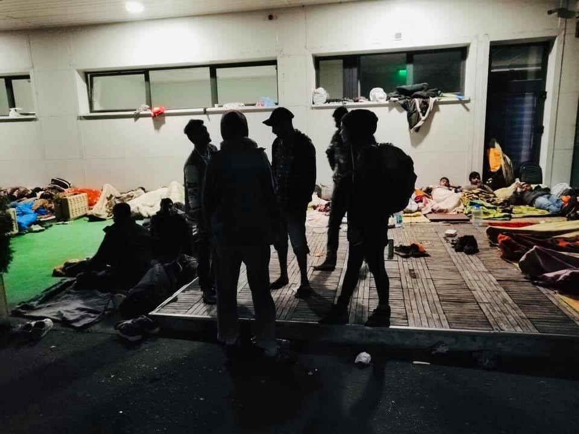
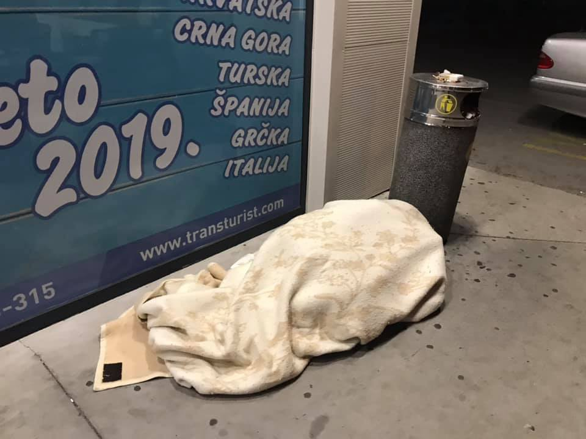

### AYS News Digest 21–22/9/19: From one bad thing to another, the transfer strategy
#### First winds destroyed tents in Nea Kavala / The number of new arrivals at the French border is increasing / Bosnia and Herzegovina discussed by the EASO for more structural support, in the meantime struggle continues / Half of the evacuated people in the Calais area return / Volunteer calls & more news

 sea\. For the 182 vulnerable people onboard [\#OceanViking](https://twitter.com/hashtag/OceanViking?src=hashtag_click) , conditions are cramped as they seek shelter from the driving rain, condemned to uncertainty as [\#EU](https://twitter.com/hashtag/EU?src=hashtag_click) member states appear ambivalent to their fate\.” — Photo: MSF](assets/81293bb64963/1*B-Z1lO6Hb8Lhr7-ypWnF-Q.jpeg)

MSF reported on Sunday — “It is a stormy morning on the central [\#Mediterranean](https://twitter.com/hashtag/Mediterranean?src=hashtag_click) sea\. For the 182 vulnerable people onboard [\#OceanViking](https://twitter.com/hashtag/OceanViking?src=hashtag_click) , conditions are cramped as they seek shelter from the driving rain, condemned to uncertainty as [\#EU](https://twitter.com/hashtag/EU?src=hashtag_click) member states appear ambivalent to their fate\.” — Photo: MSF

2292 people crossed from Turkey to the Greek islands since last Monday\. [M](https://www.facebook.com/hashtag/moria?hc_location=ufi) oria now has admitted and hosts over 12,000 people\. Greek media report that an interim administrator informed the prosecutor that new arrivals won’t be formally admitted to the hot\-spot anymore\.
At the same time, 218,301 asylum claims have been accepted by Greece since 2016, while 69,387 are currently pending\.
Also, the most vulnerable are once again the ones paying for poor judgement, but also for poor political decisions\. At the moment, 4,200 unaccompanied children and minors are finding themselves in different situations and legal positions across Greece\. With reportedly about 1,169 available spots in long\-term accommodation structures, the current number of those outside official protection is the highest since 2016\.

> More than a thousand unaccompanied children are homeless\. 

Most of the people who were transferred from the islands to the mainland recently were placed in the tents of the Nea Kavala, a move which was reported as a temporary one, but with the first winds \(which tend to be very strong in that area\! \), a lot of tents are destroyed\. The recent idea of the officials seems to be that more people from the islands will be transferred to the mainland in the same way, putting up more tents in the middle of nowhere is not a sustainable solution \(or any solution at all\) or alternative for the crammed camps on the islands\.

As winter seems to come every year, the lack of care ad strategy by both the governmental and the IGO sector is really difficult to defend or understand\.

### Libya

According to Sara Creta, some Sudanese people, including pregnant women and newborn babies in Tripoli have been living for several months in an abandoned warehouse, as humanitarian organisations failed to find proper housing for them\.

■■■■■■■■■■■■■■ 
> **[Sara Creta](https://twitter.com/saracreta) @ Twitter Says:** 

> > #Libya #Tripoli Sudanese refugees, including newborn babies &amp; pregnant women, have been living for several months in an abandoned warehouse, after @[UNHCRLibya](https://twitter.com/UNHCRLibya) &amp; other humanitarian organisations failed to find them proper housing. 
[middleeasteye.net/gallery/pictur…](https://www.middleeasteye.net/gallery/pictures-refugees-left-no-haven-abandoned-warehouse-libya) https://t.co/w2cXERupdz 

> **Tweeted at [2019-09-22 12:44:13](https://twitter.com/saracreta/status/1175752662207422466).** 

■■■■■■■■■■■■■■ 

After a Sudanese man was shot, State Watch published an internal EU document praising the EU\-funded Libyan Coast Guard for “effectively operating”\. “The death is a stark reminder of the grim conditions faced by migrants picked up by the Coast Guard after paying smugglers to take them to Europe, only to find themselves put into detention centers, whose conditions have been condemned by IOM and the UN”, IOM [writes](https://reliefweb.int/report/world/eu-praise-libyan-coast-guard-out-touch-reality?utm_medium=social&utm_campaign=shared&utm_source=facebook.com&fbclid=IwAR0hHX-Ch3GolMCgF19WvmOhg5uqx9UW4Zy7Aq9raAxaR-2fofO6mnQxIHE) \.

As of 20 September, over 6,650 people were intercepted at sea by the Libyan Coast Guard \(LCG\) and were disembarked in Libya, according to [UNHCR](https://reliefweb.int/report/libya/unhcr-update-libya-20-september-2019-enar?utm_medium=social&utm_campaign=shared&utm_source=facebook.com&fbclid=IwAR3BIbhbMnecEMGg6RvqgRbz5FA1pRSKChePIz-YyuxmMroU8HGzMZWFgIA) \. In September, they recorded 730 pull\-backs, 5,300 people are being held in detention centres, 3,900 of them of concern to UNHCR, 48,000 people are registered with UNHCR in Libya with the biggest group being Syrians \(39%\) \.
#### MOROCCO

[Association Marocaine des Droits Humains — Section Nador](https://www.facebook.com/AmdhNador/?__tn__=%2CdkCH-R-R&eid=ARBTQ1Mmn7i1fiCdQd-tSFQ1fPklJvXsUK-1rqTIOKiMwFP6GwGnJn-FBvdeZV0r_tV1sNQTmKeP_rZO&hc_ref=ARQCq0HHszP66ydVZeLY6r8iUzo4jweOoPRpAjzkJesGbPjjllMH3SONscoUgC2OF48&fref=nf&hc_location=group) collected two testimonies of people arrested in Nador and Tangier who have been turned back at the Algerian border\.
On Sunday, 15 September 2019, a boat was halted at sea in Tangier\. A group of 12 people has been rejected in an area that is more than 700 km away from Oujda\. Having arrived there during the night, placed in the military barracks, the people were forcibly and violently expelled to the Algerian border\.
The group identified the area of refoulement located on the southeast of Oujda\. This area is located between the villages of Touissit and Tiouli, very close to the Algerian border\.

](assets/81293bb64963/1*PUMsY3gQ2sesO9Aa-QrAYA.jpeg)

by [Association Marocaine des Droits Humains — Section Nador](https://www.facebook.com/AmdhNador/?tn-str=k%2AF&hc_location=group_dialog)
#### SEARCH AND RESCUE AT SEA

Proactiva’s rescue ship Open Arms and the sailboat continues their operations in the Central and Eastern Mediterranean\.

■■■■■■■■■■■■■■ 
> **[Oscar Camps](https://twitter.com/campsoscar) @ Twitter Says:** 

> > El barco #OpenArms y el velero #Astral parten de Italia para iniciar sus misiones en el Mediterraneo Central y Oriental. Seguimos 
#X1vidatodovalelapena https://t.co/L6xeTUbw1h 

> **Tweeted at [2019-09-21 10:59:44](https://twitter.com/campsoscar/status/1175363978454863872).** 

■■■■■■■■■■■■■■ 

Meanwhile SOS Mediterranee’s Ocean Viking was allowed to disembark 182 rescued people at the port of Messina\.

■■■■■■■■■■■■■■ 
> **[MSF Sea](https://twitter.com/MSF_Sea) @ Twitter Says:** 

> > BREAKING: Italian maritime authorities have assigned #Messina as place of safety for the 182 survivors onboard #OceanViking.

That on the eve before #EU leaders meet in #Valletta, #Italy opens a port to people rescued at sea, is a sign of hope that deadly policies can be reverted https://t.co/mZAZPjy1qD 

> **Tweeted at [2019-09-22 21:01:53](https://twitter.com/msf_sea/status/1175877904925937664).** 

■■■■■■■■■■■■■■ 

Maltese Coast Guard rescued 270 people in 10 search and rescue cases, according to journalist [Sergio Scandura](https://twitter.com/scandura/status/1175303988008427523?fbclid=IwAR3mFALsgsmAM1vvGTjCenhX0T15Z6_eRcPPc8l6L-4hhxdiy76_zUBuZoA) \. In just five days, Sea\-Watch’s air monitoring mission [discovered](https://sea-watch.org/en/17-distress-cases-in-5-days/amp/?__twitter_impression=true) at least 17 emergencies with more than 750 people in distress\. In three cases they documented a pull\-back by Libyan authorities\. This is backed\-up by Alarmphone, between 16th and 20th September they received ten emergency calls with some 720 people in distress\. They recorded five interceptions by Libyan authorities\.

■■■■■■■■■■■■■■ 
> **[Alarm Phone](https://twitter.com/alarm_phone) @ Twitter Says:** 

> > Of these 10 boats, 5 were intercepted by the Libyan authorities, meaning that about 431 people were returned to inhumane conditions in #Libya. 5 boats with about 289 individuals on board were rescued to #Europe. 4 were rescued to #Malta (1 via the #OceanViking) and 1 to #Italy. 

> **Tweeted at [2019-09-21 13:33:12](https://twitter.com/alarm_phone/status/1175402599719284743).** 

■■■■■■■■■■■■■■ 

#### MALTA

As the EU member states are negotiating a reform of the Dublin agreement in Malta on Monday, Mission Lifeline urges them to guarantee a safe passage, the [Times of Malta](https://timesofmalta.com/articles/view/rescue-ngo-calls-on-european-ministers-to-guarantee-safe-passage-to.736796?fbclid=IwAR01KdF_0QYvfX-y9fGFiZ-tmomVWhMj4Ra1O2yfSenCExqOXA_1tEG-ygk#.XYYxKUV40P0.twitter) reports\. Further, the organisation called to stop the collaboration with the so\-called Libyan Coast Guard, which unlawfully pulls back people onto Libyan territory: “ **Such disregard for international law is irresponsible and dangerous\.”**
#### GREECE

> Since yesterday the weather has been quite rough, heavy winds and 1–1\.5 meter waves\. Even in these conditions, Smugglers are sending out boats, risking the lives of children, women and men\. — [Aegean Boat Report](https://www.facebook.com/AegeanBoatReport/?__tn__=%2CdkCH-R-R&eid=ARAd7-HTQXfUXJxObIv_0VU2sDNymOCqaaQpm7q0KGIgSlpmzrn6qc8RjXGDmsA3Ped29SmH7kO5qeVf&hc_ref=ARSVZ97gcfyUwcjxBn1IK5S2RpWABOI3uEZECQYGWN9ln1KqByXFZpgKJZXUNYYPgZs&fref=nf&hc_location=group) 

Their team is looking for two new volunteer translators for daily translation of posts on Facebook\. One, an English\-Arabic translator, two, an English\-Farsi translator\.

Boat Refugee Foundation is also urgently looking for extra volunteers\!
From 26 September until at least the end of October, BRF is urgently looking for volunteers who can come and strengthen their psychosocial team in Moria\.

August saw the largest number of new arrivals since 2015\. Most of these people are arriving with just the clothes on their backs, the camps are over capacity with many people living in the surrounding areas without even a tent\. That’s why there is a rising number of ground teams looking for support\. These are some of them \(please, inform yourself on where and how people work in order to make a good decision\):

#### BOSNIA AND HERZEGOVINA

EASO’s further involvement in the situation in BH awaits for an agreement by the Bosnian authorities and the EU Delegation following their recent [assessment visit](https://www.easo.europa.eu/easo-assessment-potential-support-bosnia-herzegovina) to the country\. 
Further official statements say that “in August, UN agencies conducted technical specifications of six properties \(with potential to be utilized as reception centres\) and presented the findings to the EU delegation in Sarajevo and forwarded the same proposal to the operational level of the Ministry of Security \(MoS\) in BH\. It is hoped that the proposed locations will be recognized so that preparations of the sites can begin ahead of winter\.”

With 21 persons being granted subsidiary protection, _Vaša Prava_ and UNHCR are focusing on identifying and supporting those who plan to stay in Bosnia and Herzegovina, “and have solid asylum claims\.”
### Tuzla

> More than 150 people sleeping tonight at the bus station Tuzla\. There are also 30 in the front of the building for foreigners…There are five families, we put them in houses\. There are also people sleeping in the front of two mosques\. 

This is one of the usual posts you can see from the local volunteers in Tuzla\. Also, this is the daily reality for hundreds of people and for the few who don’t give up on helping in a very concrete way, accepting help and assistance from everyone who extends their hand to offer it\. If you wish to support their efforts, let us know and we will put you in contact with the people so you don’t improvise but manage to do the right thing and help with what’s really needed\.

Photos: Senad Cupo
#### ITALY

It seems like a new route across the Mediterranean has emerged\. According to [The Local Italy](https://www.thelocal.it/20190921/spike-in-phantom-boat-arrivals-as-new-route-into-italy-makes-migrants-go-undetected?fbclid=IwAR3BSdZznQsGxT_5yoLfN98q_2LfVUJdK-kivrjNzAh8c3KqCl4RZyY38A4) , a prosecutor warned about boats arriving in Italy from Tunisia\. “We are starting to see not just Tunisians but also sub\-Saharans on the boats that arrive autonomously,” Agrigento prosecutor Salvatore Vella said in an interview in the Stampa daily\. This route is said to be easier and shorter, smugglers seem to use fast boats which makes it possible to cross the sea in up to 16 hours\. Reporters also say, that people are moved from Libyan to Tunisian territory at the moment to start their journey from there\. The boats coming from there to Italy are called phantom boats\. Some make it to the mainland and therefore avoid the hotspots on Lampedusa\.

■■■■■■■■■■■■■■ 
> **[Tg2](https://twitter.com/tg2rai) @ Twitter Says:** 

> > #Migranti, ancora sbarchi in Italia. 58 pakistani arrivati a #Crotone. E' il quinto sbarco in un mese sulle coste della città calabrese. Ancora al largo la #OceanViking con 182 persone a bordo fra cui una neonata. Al #Tg2Rai ore 13,00 https://t.co/tmatdUP2LB 

> **Tweeted at [2019-09-22 10:43:34](https://twitter.com/tg2rai/status/1175722298571153408).** 

■■■■■■■■■■■■■■ 

### France

The number of new arrivals at the French border is increasing, says Kesha Niya: “Over the last two weeks we have seen 877 people, with an average of 60 people per day\.” This also means rising costs for them to provide assistance, currently €300–350 per week\. Hence they are requesting more donations\.

Following the major eviction in Grande Synthe this week, already half of the people returned to the makeshift camp\. L’Auberge des Migrants distributed 400 meals on Sunday and estimated some 500 people on site\.

**If you wish to contribute, either by writing a report or a story, or by joining the info gathering team, please let us know\.**

**We strive to echo correct news from the ground through collaboration and fairness\. Every effort has been made to credit organisations and individuals with regard to the supply of information, video, and photo material \(in cases where the source wanted to be accredited\) \. Please notify us regarding corrections\.**

**Apart from daily news in English, we also publish weekly summaries in Arabic and Persian\. Find specials in both languages on our [medium site](https://medium.com/are-you-syrious/ays-weekly-in-arabic-and-persian/home?source=post_page---------------------------) \.**

**If there’s anything you want to share or comment, contact us through Facebook, Twitter or write to: areyousyrious@gmail\.com\.**

_Converted [Medium Post](https://medium.com/are-you-syrious/ays-news-digest-21-22-9-19-from-one-bad-thing-to-another-the-transfer-strategy-81293bb64963) by [ZMediumToMarkdown](https://github.com/ZhgChgLi/ZMediumToMarkdown)._
