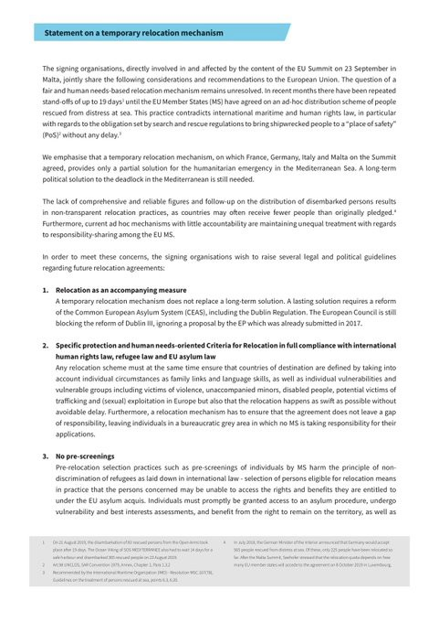
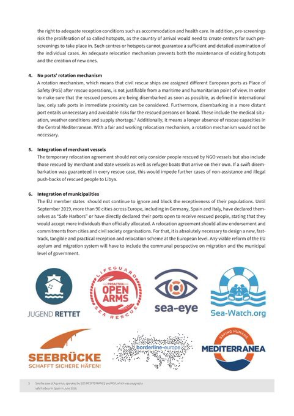
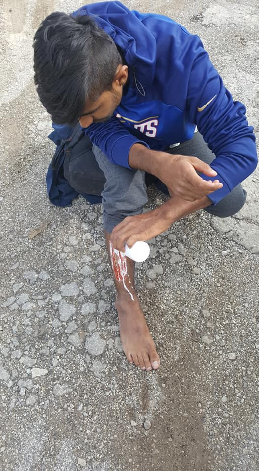

### AYS Daily Digest 25/09/19: A rise in deportations from Sweden
#### Dreadful living conditions in camps made worse after rains hit Aegean islands // Increase in violence at the hands of Serbian police against people who have been pushed back to Macedonia // People violently returned from Croatia’s capital to Bosnia and Herzegovina, and with no paper trace or mention of international protection // Somalia a safe country — a single case in Denmark calls into question the entire basis of the former government’s return policy // & more news

 \)](assets/c88cc8e20d08/1*zy55xqSh6NQPst-1ca_n_w.jpeg)

Moria, Lesvos \(Photo: [Ihab Abassi](https://www.facebook.com/ysalaam?__tn__=%2Cd%2AF%2AF-R&eid=ARD7bqSQ0eaXZOtAYHAAZcozHXp4QODV-bKNHUYEtgVVVjSnnjHvRdg9GScRwest3S3m_ScS5TPPJojU&tn-str=%2AF) \)
#### FEATURED

**Up until August this year, 2600 people had been deported by plane from Sweden\. It is almost as many as the total number of deportations during 2015, the daily paper Dagens Nyheter reports\.**

The number of deportations are on the rise — as well as the number of deportations where escort from police or Kriminalvården \(The Swedish Prison and Probation Service\) is required\. The big influx of refugees in 2015, who now have had their final rejection, as well as better cooperation with the countries of origin are among the likely reasons\. In 2015 a total of 2810 people were deported, and in 2018 the figure was 3370\.

The Migration Agency reports rejected asylum seekers to the police if they think there is a chance that someone will “disappear” or refuse the deportation\. Last year the Migration Agency handed over 7800 new errands, in other words: people who had disappeared before their scheduled deportation, to the police\. The prognosis says that the number of new cases will increase to 11,000 yearly\. Up until July 2019, the police had 17,223 open errands about deportations, of whom 11,375 were fugitives\.

Last year the average cost for every deported individual was 60,000 SEK \(about 5620 euro\) \. It is paid for by NTE, which is the Swedish Prison and Probation Service \(Kriminalvården\) transportation department\. The goal of the police and Kriminalvården is that fewer deportations need to be escorted and the idea is to not charter planes\. During one of ten deportations the staff needs to use force, such as hand cuffs\. Read more [here](https://www.dn.se/nyheter/sverige/allt-fler-utvisningsarenden-lamnas-till-polisen/) \.

Earlier in September 50 men above the age of 18 were deported to Kabul, Afghanistan\. This was the single biggest deportation from Sweden so far and sets a new record \(of cruelty…\) \. Frontex assisted during the mass\-deportation, and also helped finance it\. According to the police all of the men were accepted back by the Afghan authorities upon arrival in Kabul\. Both police officers and staff from Kriminalvården were onboard the plane, together with Frontex\-staff, a translator and a healthcare worker\. Read more [here](https://www.svt.se/nyheter/50-personer-utvisades-till-afghanistan-under-tisdagen) \.

_“All the police work is based on a humane, compassionate and legal approach\. The person’s fundamental rights must be respected and special attention should be paid to, for example, age or physical and mental health conditions”,_ said Patrik Engström, head of the National Border Police section of the Police National Operations Department \(NOA\), in a press\-release following the deportation\. Read more [here](https://www.dn.se/sthlm/rekordmanga-utvisades-till-afghanistan/) \.
#### SEARCH AND RESCUE AT SEA

A temporary relocation mechanism can only be the first step towards a long\-term political solution to the deadlock in the Mediterranean\. For it to be fair and based on actual human needs, the [E](https://twitter.com/hashtag/EU?src=hashtag_click) U has to follow these legal and political guidelines, SAR organisations claim, as a reaction to the Malta conference:

#### GREECE
### Islands

People are sending their photos and videos of the terrible consequences a single night’s rain has left in Moria on **Lesvos** \. Everything is flooded and people’s belongings and the little protection they found in small tents are all soaked\. The camp hosts about 13,000 people currently, and in spite the recent transfers, as the winter is approaching, fears of what it might mean for the people stuck on the islands grows\.
In the meantime, hundreds of people continue to arrive to the island…

The over 5,600 people on **Samos** who are currently in and outside Vathy camp \(which only has space for 650 people\), are all completely drenched, the Movement on the Ground team reported\. The small tents often leak, resulting in soaked mattresses and people without any dry clothes or blankets\. Urgent reaction is needed\. In the meantime, they are collecting much\-needed things for people to sleep on:

In an [open letter,](https://l.facebook.com/l.php?u=https%3A%2F%2Fwww.lesvosnews.net%2Farticles%2Fnews-categories%2Fkoinonia%2Fsta-oria-tis-katarreysis-astynomiko-prosopiko-tis-lesboy-mi%3Ffbclid%3DIwAR2lbJsJwrGwAlH1oc4ZBxHxCantLP9csVKepcH2C7V3ghIn7Hotq5REQ-o&h=AT2ir9av8jqI7XtRO9QDIShzkLvGP5FPWA8P0nW1jkj2wVhNZMGSzEne5xQkVCumI8zeYCRF4PfTLeOHX0nRHAuu0g_H29-SpAomClpandgS6Q_ded0fyLj_RY5p7F8to4G6bOw74kcczkPeRFwyUysABDHwiV_faAKKku77ZD9luYT5n31PUfh5am5XzCePhyORxFDeVTiiy77sqy_GMxLATQDxOJr8ruFZMlbKDk1bI_jDGIkZYpBXsfYr0iVOsVB6BFVWT9rJZRMGpsrgQh-KXgUG9thWtUZ_Uf57giSF6c4yqtkLhkglZBN4MZl917-ImUIVOo020Y5Yv1IEkRSmLjZTyxpkL7p6IE1stweIXtIJGBAGR0mEF8oJqAaDDyI-yBGf6LGgAmnh8tlQF4LgQ3r8gZU-AumnAiIgcWHIGKrjAxWQud5eqbV0LNZOpD1lxxWU72WapL9BV8i_0fOqXH3x7Ay8kBLJwCE0OZT3e3VbzxrDgnhezwQxzgZR_qAq8HDALEPQCjb4TOKMtSDZL6Xf8QRP6KN0qpo3zi4ITpDpGXzzwcsby-lxeQO3EQZYBf0OuR5-G5PsJ4_wuRQ7fgLqBfX2R0uCOD6I1fNkXo4QAlzLVsGlzkNkDQ) the head of police on Lesvos has addressed the government in order to push them into to letting the police “know what you have done so far, or what you intend to do to strengthen the Police Directorate of Lesvos so that it can respond to the difficult task of ensuring the safety”\.
#### WESTERN BALKAN ROUTE

In **Serbia** the Asylum Protection Centre have reported that there is an increase in violence at the hands of Serbian police against people who have been pushed back to Macedonia\. These people eventually made it to Serbia\.

■■■■■■■■■■■■■■ 
> **[Azil u Srbiji Asylum Protection in Serbia](https://twitter.com/APC_CZA) @ Twitter Says:** 

> > Migrants report increasingly aggressive behavior of Serbian police after coming from Macedonia. They claim police to use batons and pepper spray. One group complained on released dogs. Hamidulla(26) showed us signs of violence - back injuries and traces of dog bites. https://t.co/FBYM3gYk9F 

> **Tweeted at [2019-09-25 12:56:14](https://twitter.com/apc_cza/status/1176842848202874883).** 

■■■■■■■■■■■■■■ 

They also report that at least 100 people are passing from Macedonia into Serbia every day, and that many end up at the reception centre in Bujanovac, resting for a few days before going on\. The majority of them have been pushed back to Macedonia from Serbia at least once\. Read more [here](https://twitter.com/APC_CZA/status/1176841282829914113) \.
### Violence against young people in search of a better place continues

As the winter draws closer not much has changed in the border area of Bosnia and Herzegovina with Croatia — the longest land border of the EU\. Activists in BiH reported having encountered a teenager who was exhausted, crossing the street barefoot, walking towards Cazin \(Una Sana canton\) \. He was caught by the police in the area close to Zagreb and later held in a container without food or water\. Delivered to another masked team, he was beaten, abused, robbed of his cell phone and the little money he had\. Finally, the push back also includes taking away the shoes, a symbolic act deprived of humanity, that surely has nothing to do with security or with the respect of human rights\. 
**The boy is 19 years old\.** 
**This happens every day\.**

](assets/c88cc8e20d08/1*XA8KaqUho5yldwUwb_XrIw.jpeg)

Photos: [Lorena Fornasir](https://www.facebook.com/lorena.fornasir?__tn__=%2Cd%2AF%2AF-R&eid=ARD8p504DWW1s60sjYemEsVgDIaVBiPZ2Hsrr0hiRkjuGrdlWByYR9vdGw2Lqrqv4MRoJ-mygEyunaHo&tn-str=%2AF&hc_location=group_dialog)
#### NORTHERN EUROPE
#### UK

In addition to the good news of people resisting the fascists patrolling Kent’s beaches for refugees, some other solidarity is being shown\. Within the Labour Party there has been inconsistent support for freedom of movement, with many following the lead exemplified on the left in Denmark and other countries which view migration as a threat to local workers’ rights\. We have addressed this before, but we are happy to see the work of Labour for Free Movement making significant inroads in the Labour platform\.

■■■■■■■■■■■■■■ 
> **[Labour for Free Movement](https://twitter.com/labfreemvmt) @ Twitter Says:** 

> > 🌹💥WE DID IT! 💥🌹

Labour national conference has voted UNANIMOUSLY to back our motion.

Today we made history. Let it be the moment the labour movement launched its fight back against xenophobia - and came out fighting tooth and nail for migrants' rights. #Lab19 https://t.co/jnPevjjews 

> **Tweeted at [2019-09-25 10:41:48](https://twitter.com/labfreemvmt/status/1176809015893995520).** 

■■■■■■■■■■■■■■ 

#### DENMARK

Serious developments in Denmark as **Somalia is being reconsidered as a safe destination for some\.**

_“A new decision by the Danish Refugee Board can significantly change the conditions for the policy of returns of refugees from Denmark,”_ experts in the field states\. _“This could mean that a number of cases have to be reversed,”_ says the immigration lawyer who has led the case of the withdrawal of a 27\-year\-old Somali’s residence permit\.

A single case can now have a “decisive” impact on the Danish returns of Somalis\.

According to experts, the case calls into question the entire basis of the former government’s return policy and has the potential to pull the rug underneath an important cornerstone of Prime Minister Mette Frederiksen’s policy on foreigners, which after the so\-called “paradigm shift” aims to ensure that refugees are only granted a temporary residence in Denmark\.

_“This could mean that a number of cases must be reversed and that refugees from large parts of Somalia cannot be returned\. Potentially, it may even mean that we have to retrieve some that have already been expelled,”_ says immigration lawyer Tobias Grotkjær Elmstrøm, who has led the case before the Refugee Board\.

The case is about a new assessment by the Refugee Board, which is the authority that ultimately decides whether refugees should be returned to their home country\.

Since 2017, Denmark has reviewed around 1,100 residence permits of Somalis in a process that, according to the immigration authorities, can be extended to about 27 other nationalities\.

In the process, 212 Somalis have had their residence permit permanently revoked, while approximately 28 have been returned to Somalia\.

This has happened, among other things, in the light of decisions from the European Court of Human Rights, which has determined that returning to their home country is no longer a risk for Somalis\. Similarly, the Immigration Service and the Danish Refugee Council in 2015 concluded that the situation in Somalia is serious, but does not necessarily make a basis for asylum\. In part because the militant Islamic group al\-Shabaab primarily attacks government officials and high\-profile Somalis and does not target civilians\.”

Translated from [here](https://www.berlingske.dk/politik/nye-oplysninger-om-somalia-kan-faa-afgoerende-konsekvenser-for-hjoernesten) \.

> This comes on the heels however of a new UN statement issued on the 21st warning of an increase specifically in Somalian refugees as a result of ongoing violence, crop failures, and other threats to life\. 

Many of these people are going to nearby Ethiopia and many reception centres are overfull\. Read more [here](https://allafrica.com/stories/201909240270.html) \.

Additionally researchers show that asylum camps are breaking people down, and when conditions continue into the integration phase, the damaging effects follow\.

> “The new government has announced a renewed focus on integration, while continuing a restrictive immigration policy\. Mattias Tesfaye will no longer keep a tally of revisions tightening immigration law on the ministry’s home page, and it is gratifying that changes to the law should no longer be a goal in itself\. But the spreading of camp conditions from the asylum to the refugee phase cannot be ignored\. 

> If integration is to be strengthened and we want to avoid negative human and economic consequences of the foreign policy, we must go another way — for example, by strengthening refugees’ security that they can stay here through residence permits, by providing high enough benefits to pay the rent for suitable housing, and by stopping the acceleration of restrictive immigration laws, so that refugees here in Denmark have a better opportunity to plan a future and become active and prosperous citizens\. Refugees must be let out of the camps\.” 

[Source](http://refugees.dk/en/focus/2019/september/many-refugees-never-leave-the-camps-damaging-to-both-individuals-and-our-economy) \.

**If you wish to contribute, either by writing a report or a story, or by joining the info gathering team, please let us know\.**

**We strive to echo correct news from the ground through collaboration and fairness\. Every effort has been made to credit organisations and individuals with regard to the supply of information, video, and photo material \(in cases where the source wanted to be accredited\) \. Please notify us regarding corrections\.**

**Apart from daily news in English, we also publish weekly summaries in Arabic and Persian\. Find specials in both languages on our [medium site](https://medium.com/are-you-syrious/ays-weekly-in-arabic-and-persian/home?source=post_page---------------------------) \.**

**If there’s anything you want to share or comment, contact us through Facebook, Twitter or write to: areyousyrious@gmail\.com\.**

_Converted [Medium Post](https://medium.com/are-you-syrious/ays-daily-digest-25-09-19-a-rise-in-deportations-from-sweden-c88cc8e20d08) by [ZMediumToMarkdown](https://github.com/ZhgChgLi/ZMediumToMarkdown)._
