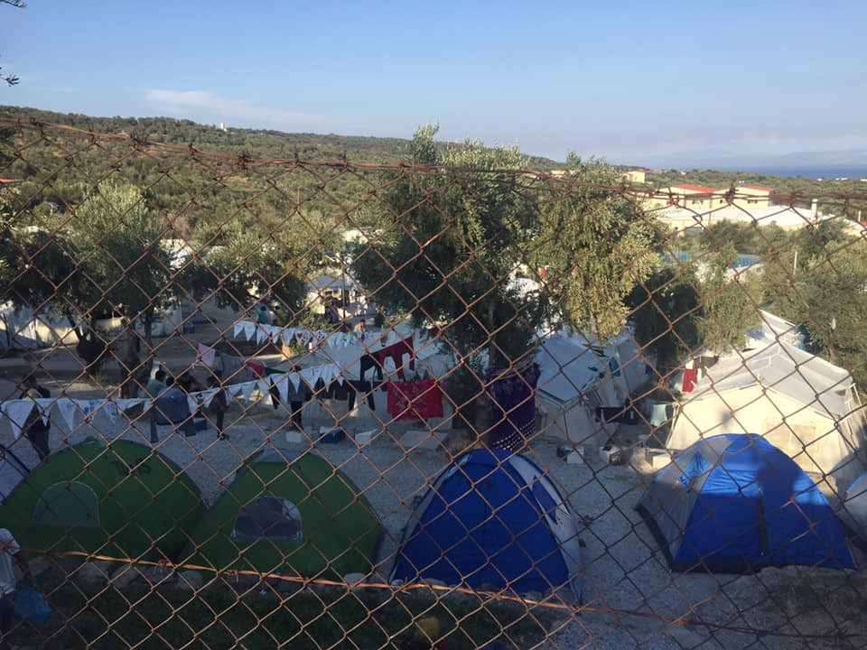
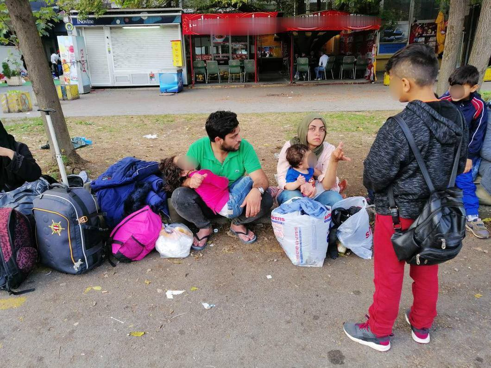
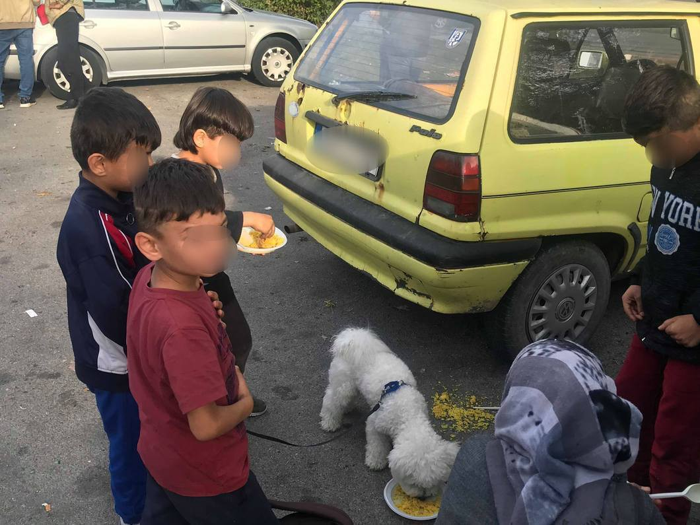
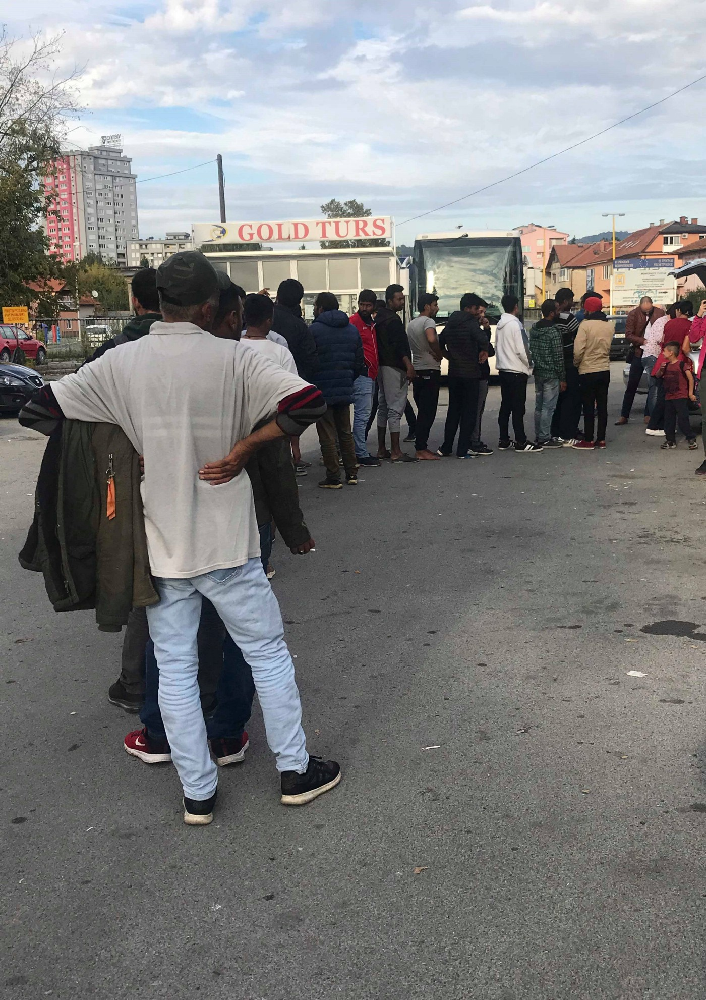

### AYS Daily Digest 26/9/19: Lebanese authorities call \(again\) for the return of Syrian displaced people

Hunger striker in Italy obtains political asylum /// Updates from Greek camps /// Greek government stop issuing social security numbers to third nationals /// Updates from Tuzla, BiH /// New border controls between Austria and Germany

 \)](assets/5acd4407ae75/1*c1jx0dY7EV7AP6XQPUU6xg.jpeg)

Moria, Lesvos, 26/9/2019 \(Photo by [NoBorders](https://www.facebook.com/657905327610696/posts/2497018837032660?sfns=mo) \)
#### FEATURED

> “ **Syrian** displacement poses ‘serious threat’ to **Lebanon’s** development goals” 

At the recent UN General Assembly, the Lebanese President called for the international community to share the responsibility for the exiles and displaced people from Syria who are currently in Lebanon, insisting that “the security situation in most of Syria has become stable, with military confrontations confined to the Idlib region”\.

> “We have many question marks about the positions of some active States and concerned international organizations, trying to hinder this return, the allegations that the security situation in Syria is dangerous, and sowing fear among the displaced…as if the displaced have become hostages in an international game to be swapped when settlements and solutions are imposed\!” 

Lebanon, a country of four million people, currently hosts an estimated 1\.5 to two million refugees who have fled Syria since 2011\.

So as not to encourage Syrians to settle permanently, authorities allow only informal [camps for refugees](ays-special-lebanon-dreams-bigger-than-shatila-281df6272cbe) , in [precarious conditions](ays-special-precarious-living-conditions-for-millions-of-refugees-in-lebanon-81f8845b6a9a) , some almost becoming [towns for themselves](ays-special-pieces-of-the-everyday-life-in-beqaa-valley-2bad528e8522) , but often having the informal settlements torn down for dubious reasons\.

After Lebanon was committed to the principle of non\-refoulement by refraining from [forcibly](http://legal-agenda.com/en/article.php?id=675&folder=articles&lang=en) deporting people to Syria since 2012, two new decisions issued by the Lebanese authorities had earlier this year allowed for the forcible deportation of Syrians who entered the country through unofficial border crossings\. 8 organizations were standing up against [that](https://www.legal-agenda.com/en/article.php?id=5684&fbclid=IwAR2WWqsEJMBjPAOPIdckSyft3qLQXnkdAHVH-4vY3NRWA7HBmtARxy4cMrk) \. In August, Amnesty International accused the country of “forcibly deporting” nearly 2,500 Syrians refugees back to their war\-torn homeland\.

Last week, a four\-year\-old Syrian child was removed from the Assouns town cemetery in north Lebanon, as the district’s mayor, Roula al\-Baya, had reportedly demanded\.

On the other side, Rouba Mhaissen, 31, the founder and director an organisation that has since 2011 helped Syrians displaced by the war in their country and living as refugees in Lebanon, has been awarded Norway’s Rafto Prize for her work defending the rights of refugees\.

> “Rouba Mhaissen has contributed locally to improving the lives of people living as refugees in Lebanon in ways that protect their dignity and right to self\-determination,” the Rafto Foundation said in a statement\. 

GREECE

**Arrivals**

Aegean Boat Report [inform](https://www.facebook.com/AegeanBoatReport/posts/657691278087313?hc_location=ufi) that on Thursday at least 13 boats have arrived on the Greek Aegean Islands, carrying 596 people\.

According to the [data](https://infocrisis.gov.gr/6212/national-situational-picture-regarding-the-islands-at-eastern-aegean-sea-25-9-2019/?lang=en) of the Ministry of Citizens Protection there are more than 29,000 people living on the islands\. 14,526 are on Lesvos alone\.

**Situation in Moria**

The Legal Centre Lesvos [report](https://www.facebook.com/LesvosLegal/photos/a.1152003994838312/2645522888819741/?type=1&theater) that “two nights ago, with the first heavy rains of the season, approximately 200 people were left in the rain without tents or any shelter inside Moria Camp, as the camp is now approximately four times over its capacity\. The covered concrete area used as a food line was their only shelter throughout the night\. It is difficult to describe the level of inhumanity people are enduring here”\.

 \)](assets/5acd4407ae75/1*--beB3uY9UGGIEyDzbmTdQ.jpeg)

Moria, Lesvos 26/9/2019 \(Photos by [NoBorders](https://www.facebook.com/657905327610696/posts/2497018837032660?sfns=mo) \)

> The vast majority of individuals arriving in Lesvos for the past year are Afghan nationals, thousands of whom have arrived in Lesvos after leaving Iran, often after having spent their entire lives there: collateral victims of this years’ new US sanctions against Iran\. Thousands more have left Afghanistan, now deemed “the most dangerous country in the world,” where US\-Taliban peace talks \(and their collapse\) disregarded the lives of Afghan civilians\. Despite the widespread violence in Afghanistan, many European countries deem Afghanistan a ‘safe country of origin\.’ The European Asylum Support Office \(EASO\) — charged with interviewing applicants for asylum in Lesvos — has identified ‘safe areas’ within Afghanistan — and is using their own reports to recommend denying asylum to Afghans and their deportation from Greece\. 

To face this new situation, the Legal Centre Lesvos need your support\. Since they opened over three years ago, they have refused funds from States, businesses, and other entities complicit in human rights violations and environmental abuses, and from entities that would compromise our principles of non\-discrimination and independence\.

Please show your solidarity with migrants on Lesvos and consider sharing our reports, sharing our call for funds, and donating to our emergency fundraiser, so that we can continue our work defending migrants’ rights: [https://www\.justgiving\.com/legalcentrelesbos](https://www.justgiving.com/legalcentrelesbos?fbclid=IwAR1SzoRi987q6MpSlgXnyawrKiK29XwGYf_Dedb5qe69TaMGOb3WBvoRvLk)
#### Transfers to Mainland\. From one hell to another

■■■■■■■■■■■■■■ 
> **[Bruno Tersago](https://twitter.com/BrunoTersago) @ Twitter Says:** 

> > 703 asylum seekers will be brought from Lesvos to the Greek mainland. 108 were already moved yesterday, 348 will leave tomorrow, 247 will be brought to Piraeus next Monday [lesvosnews.net/articles/news-…](https://www.lesvosnews.net/articles/news-categories/astynomiko-reportaz/anahoroyn-apo-mytilini-pros-peiraia-703-prosfyges) 

> **Tweeted at [2019-09-26 16:08:42](https://twitter.com/brunotersago/status/1177253673757478912).** 

■■■■■■■■■■■■■■ 

According to [Greek media outlets](https://www.keeptalkinggreece.com/2019/09/26/moria-decongration-asylum-seekers-mainland/) , these people will be “distributed” to accommodation facilities in Eleonas and Schisto in Attica, in Thebes and Thermopylae, Viotia, and Katsika camp in Ioannina, Epirus\. Local volunteers informed us that 300 people were taken on Tuesday from Samos to the new temporary camp in Corinthos\.

1,000 people have been recently transferred to Nea Kevala, in northern Greece and are living in very difficult conditions\.

Read more about life in the camp [HERE](http://alterthess.gr/content/egklovismenoi-sti-nea-kavala-2000-prosfyges?fbclid=IwAR0mik3WSiR3bWNPkGq1vSrpL88mLuI4EZO9W0jI3rBK_rmfB46-W76UArU) \.

Media [report](http://www.ekathimerini.com/244952/article/ekathimerini/news/plans-to-relocate-10000-migrants-to-mainland) that the government plan to transfer up to 10,000 people from the islands to the mainland in the “near future”\. It is reported that the defense ministry has compiled a list of out\-of\-use military facilities that could be revamped to serve as new camps\.

The attack of the new government on refugees rights carries on\. After the evictions of the last month, the increased police control and racial profiling activities in Greece major cities, now social security numbers \(AMKA\) [won’t be issued any longer](https://www.facebook.com/KhoraAthens/posts/1244235615749044) to third\-country nationals, effectively meaning that asylum seekers are unable to access employment, basic health services such as health care, psychological and psychiatric aid as well as vital medication\.

MASS Action and KAST, Khora Asylum Support Team, published a fundraiser to respond to this policy: [Help KAST respond to right\-wing policies with vital medication\!](https://chuffed.org/project/help-kast-respond-to-right-wing-policies-with-vital-medication?fbclid=IwAR1MrMzptItJZYptD6pPSYrEkMhLqUGDjHXRzcgyTQgJepAG3xXF_Du2Uzc)

**Photojournalist arrested during Athens eviction acquitted by the court**

Alexandros Stamatiou was [found not guilty](https://thepressproject.gr/athoos-o-fotoreporter-pou-synelifthi-stin-ekkenosi-tou-proin-5ou-lykiou/?fbclid=IwAR0uPe6nOqiWSoyffLOyN83sDTb5Gvq9qGkZlChzsT_Eltm8hCX-REcE2uk) today and acquitted of all charges\. The photojournalist was arrested last Monday during a police operation to evacuate the occupation of the 5th School squat\.

ITALY

**Hunger striker in Italian CPR succeeds in obtaining international protection**

Deniz Pinaroglu, Turkish asylum seeker, finally [obtained protection](https://www.dire.it/26-09-2019/371797-migranti-deniz-e-libero-si-allasilo-ma-quanta-fatica/?fbclid=IwAR06iQXgXXrISLixy-AkHOooSrp2mn0inid8zeTB8ZGwQXgxxOJ1bQdrHms) after more than a month of hunger strike\.

His story demonstrates the problematic approach to asylum seekers of both Italian police and courts\. He was arrested near Piacenza because he had entered the country illegally\. Despite having immediately applied for asylum, an Italian judge deemed this application “opportunistic”, made only to avoid expulsion, and sent Deniz to the CPR in Turin\.

Since the 2nd of August, Deniz started a hunger strike\. Finally, in the last few days, his situation was reviewed and his application for political asylum was accepted\. In Turkey he was active in the opposition to president Erdogan policies and would be extremely dangerous for him to return to the country\.

BOSNIA AND HERZEGOVINA

**On Wednesday night several families arrived at the bus station in Tuzla with dozens of lively children\.**

The children are always the first ones to get close to the volunteers on site who try to answer their needs to the extent possible\. Small and symbolic gestures mean to families with children, such as priority in the food distribution, exhausting all means to find accommodation for them, and the overall engagement volunteers have with the little ones\.

Some families went on, towards Sarajevo\. A Syrian family with four children was about to spend the night at the station when the locals were reporting about the situation, but another solution was found for them, although there still exists no permanent or official solution for people in such situation, no organized lodging\. Therefore, the volunteers use their own homes to provide shelter to the people, with the help of the Baptist church in Tuzla and the Wave organisation\. The church already hosts a lot of families and individuals who have been there for several days already\. There is no place for new families\. Food supplies sufficed for about a hundred people coming mostly from Pakistan, Bangladesh, Algeria, Morocco, Syria, … During the day, a lot of people left Tuzla\. Some took the buses to Sarajevo, while others boarded the trains to Bihać\. The train leaves every day at 17:09h, while the buses to Sarajevo also depart daily and hourly\.

A delegation of the UNHCR was visiting Tuzla for a couple fo days, coming to see what the situation is like in the city of salt\. Lately, Tuzla has caught the attention of many as more and more foreign organisations seem to come in order to inspect the situation\. For the time being, there is no substantial assistance or aid from that side, but after the visitors witnessed the situation, the volunteers were given promises that something would be done before winter starts\. A few individual volunteers from abroad have been a great support, the locals say\.

Whether the visits and considerations are a form of diverging from the massive accountability shortfalls of UN humanitarian assistance or something might change, nobody knows and nobody was called to have their say on te issue they alone have been struggling with for the past year\. Time will tell\.

Photos: Senad Cupo

Psychological state people are in is alarming\. Many are desperate, some have been in Bosnia and Herzegovina for too long, moving from one town to another, only some manage to cross the border\. Aside from the food and accommodation, the city craves for psychological help for the people stuck there\.

Volunteers in Tuzla report more segregational and racist policies by the local businesses — this notice awaited for an Italian volunteer and two families from Iran when they came to have lunch at Hotel Tazz\. I guess none of them is welcome as we all are migrants, we hope people react strongly to each such demonstration of racism wherever they encounter it\!

GERMANY

German officials have reportedly decided to extend the border control along the southern border with Austria for another six months, due to a large number of attempts to illegally enter the country\. There were 6\.749 cases of illegal entering from Austria and 3\.792 people were returned at the border in the period from January until August this year\.

**If you wish to contribute, either by writing a report or a story, or by joining the info gathering team, please let us know\.**

**We strive to echo correct news from the ground through collaboration and fairness\. Every effort has been made to credit organisations and individuals with regard to the supply of information, video, and photo material \(in cases where the source wanted to be accredited\) \. Please notify us regarding corrections\.**

**Apart from daily news in English, we also publish weekly summaries in Arabic and Persian\. Find specials in both languages on our [medium site](https://medium.com/are-you-syrious/ays-weekly-in-arabic-and-persian/home?source=post_page---------------------------) \.**

**If there’s anything you want to share or comment, contact us through Facebook, Twitter or write to: areyousyrious@gmail\.com\.**

_Converted [Medium Post](https://medium.com/are-you-syrious/ays-daily-digest-26-9-19-lebanese-authorities-call-again-for-the-return-of-syrian-displaced-5acd4407ae75) by [ZMediumToMarkdown](https://github.com/ZhgChgLi/ZMediumToMarkdown)._
