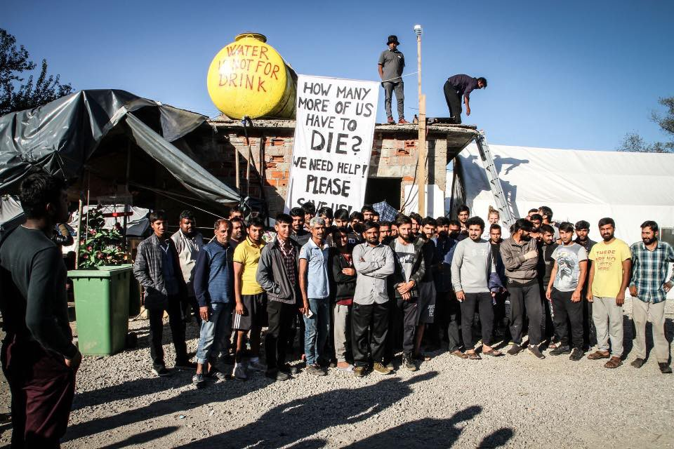

### AYS Daily Digest 27/09/19: Deprived of rights, now also of basic assistance — who has the stamina to invoke the rule of law in Vučjak?
#### Medical team expelled from Vučjak camp // five children and two women drowned in Aegean // Aegean boat report // Voluntary Return Programme is running again // Updates from the situation in Dunkirk

#### FEATURED

As we reported in brief yesterday, Dirk Planert and his team of medical workers are not allowed to continue their work in the Vučjak ‘camp’ which is situated on an old garbage dump near Bihać in the north\-west of Bosnia and Herzegovina\. 
Planert has been working voluntarily and at his own expense for around 100 days now, supported by a team of doctors, paramedics and volunteers who assisted him\. The team provided basic medical support for about 800 people in the camp\. As the hygienic conditions in the camp are severe due to a lack of sanitary infrastructure, scabies is prevalent and even small wounds can easily be infected and can pose serious threats\. Wounds are often inflicted by Croatian border police on people they catch and push back at the Croatian border\. 
According to a statement by Dirk Plantert, representatives of the Bosnian immigration office entered the ambulance in the camp, seized the papers of the volunteers who were there and ordered them to leave the country within seven days\. Additionally they had to pay a fine of 150€ each in order to get their documents back\. Any further activities are prohibited to the team members\.

> “From now on, any help that we will carry out will be considered a criminal offense\. The reason for this they claim is: In order to be able to work legally here, a recognized organization would have to invite us to provide medical help in Vučjak\. As you know, we started to provide medical care to the people in the camp on our own, because **nobody else was doing it** from the start of the camp\. Already in the first days an Austrian doctor and others joined in, so that alternating medical professionals worked throughout till now in the ambulance tent\. All team members were registered as volunteers at the Red Cross Bihac\. An invitation from a responsible organization is impossible because there are none who agreed to take responsibility\. The Vučjak Camp has been illegally built by the leaders of the city of Bihać\. Because it is an illegal camp, all major relief organizations have refused to work here so far\. A work permit for an illegal camp is therefore a contradiction in terms\.”
 

> \(Statement from Dirk Planert\) 

According to the media, the immigration office had received information about unprofessional treatment by Dirk Planert and his team\. From now on, the Bihać Health Centre and the cantonal hospital should provide medical treatment for the people\. 
As we know, hospitals are very unlikely to provide sufficient medical support for refugees as they usually — if at all — only treat emergency cases\. People from the camp state that pharmacies will not give them basic drugs without a prescription; the hospital will most likely turn them away if they show up there and ambulances take about 2–3 hours to arrive\. Everyone is apparently calling for respect of the Bosnian laws, but in order to ask outsiders to respect them, someone from the country needs to start first, not to mention that calling for respect of the laws by ‘western foreigners’, as is very often mentioned, is a contradiction in itself in a country where the rule of law keeps being circumvented at every given opportunity, and if we invite people to show solidarity, we shouldn’t deprive them of the option to do so once they actually arrive to do something concrete\. In this video, the residents from the camp make a strong appeal for the medical team to come back:

Apparently there have been negotiations with MSF to start operations in Vučjak, but they usually only operate in camps for a limited amount of hours per week and will not be able to treat all the wounds and injuries\. The group shared their guesses about the possible version of developments that would include MSF\.

If the MSF team are negotiating their further missions in the Bihać area, that does not necessarily mean they will be the medical team responsible for Vučjak\. We believe that \(proper and professional\) medical treatment is a human right and it should not be the responsibility of voluntary groups to provide refugees with it\. It is the responsibility of a state\. Still, the expulsion of the team is an extremely alarming sign, as it is very unlikely that the State of Bosnia and Herzegovina will actually provide this basic care\. Furthermore, the criminalization of civil solidarity and support in places where the state fails to fulfill its responsibility is a scandal in itself\.
The only ‘solution’ that might await the people there is to be sent back to Bira\. Or?
#### GREECE
### More **deaths in the Aegean Sea**

Off the coast of Oinousses, a small island next to Chios, a boat capsized on Friday morning\. For five children and two women the rescue operation carried out by the Greek Coast Guards, Frontex and a Greek ferry boat came too late\. According to some sources but not yet officially confirmed, the people on the boat were Turkish academics, fleeing repression under the Erdogan regime\. The survivors applied for political asylum in Greece\.

The **Aegean Boat Report** speaks about 12 boats that arrived on Friday, carrying 365 people in total\. Amongst them are the 11 survivors of the shipwreck off Oinousses\. Besides the capsized boat, four of the boats arrived on Lesvos, two on Samos, one on Leros and four on Chios\.

Although the **EU Commission** is aware of the worsening situation on the Greek islands, it strongly emphasises that the numbers of arrivals are still much lower than before the coming into force of the EU\-Turkey deal\. The Commission is currently trying to relieve tension with the Turkish government over the funding for accommodation and assistance for refugees\. By October, the **Greek government is expected to announce a new draft law** that should speed up asylum processes and returns to Turkey\. A previous version of the law that included the abolishment of the right to appeal negative asylum decisions has been dropped\.
For further reading:

In order to relieve the completely overcrowded islands, **plans for the transfer of about 10,000 people to the mainland** are being developed, another media reports\. Apparently also new camps might be installed, as the Defence Minister has handed in a list of former military facilities that could be transformed into camps\.

The so\-called **Voluntary Return Programme of IOM is running again** , after it was suspended for some time in order to be renewed, reports the Mobile Info Team\. Find more information on the Programme on the website of the Mobile Info Team:

> People who are considering taking part in the programme **should under no circumstances cancel their asylum process** before having spoken to IOM and being 100 percent sure that they want to return, as this step cannot be reversed\! 

**DoYourPart Community Center** is in need of financial support in order to provide food for 180 persons in Oinofyta Camp who get no official financial support and therefore have no access to food\.

#### FRANCE
### Dunkirk

The Refugee Women’s Centre has provided an update on the situation on the ground in Dunkirk, where the emergency centre was evicted about ten days ago and people brought to accommodation centres all other the country\. The conditions in the centres are reported to be far from acceptable:

> “We denounce the conditions in which people were expected to stay at these centres; from being a 2 hour walk away from the nearest shop and bus stop, to being kicked out of the centre at 7am and forced to sit on the street until 6pm when they would be let back in again, being served food that didn’t meet dietary requirements, particularly lack of halal options, and not being allowed to cook their own meals\. People were not informed beforehand where they would be taken by the buses, with some families taken as far as Brest, a city 8 hours away\.” 

Many people have returned from the centres to Dunkirk, and found themselves once again in informal camps in inhumane conditions, as none of the poor infrastructures from the former emergency centre are available anymore\. Refugee Women’s Centre reports about one informal camp with about 41 families\.

> “However, the conditions in the informal camps are completely inhumane; with no access to drinking water, sanitation facilities or toilets\. During the last week 4 more evictions have taken place with all forms of shelter being found and destroyed\. In the harsh conditions where people are trying to recreate a little community, people are left to wander not knowing where to go or what to do and feeling unsafe and intimidated by police\.” 

Refugee Women’s Centre tries to support the people with basic items such as tents, sleeping bags and blankets\.

#### MOROCCO — SPAIN

In a recent bilateral meeting between Morocco and Spain, Morocco’s representative stated that its authorities rescued 10,700 people in 2019 by their own means\. Of course, they also discussed “how to improve border surveillance and the fight against illegal human trafficking\.”
Find an article in Spanish here:

**If you wish to contribute, either by writing a report or a story, or by joining the info gathering team, please let us know\.**

**We strive to echo correct news from the ground through collaboration and fairness\. Every effort has been made to credit organisations and individuals with regard to the supply of information, video, and photo material \(in cases where the source wanted to be accredited\) \. Please notify us regarding corrections\.**

**Apart from daily news in English, we also publish weekly summaries in Arabic and Persian\. Find specials in both languages on our [medium site](https://medium.com/are-you-syrious/ays-weekly-in-arabic-and-persian/home?source=post_page---------------------------) \.**

**If there’s anything you want to share or comment, contact us through Facebook, Twitter or write to: areyousyrious@gmail\.com\.**

_Converted [Medium Post](https://medium.com/are-you-syrious/ays-daily-digest-27-09-19-deprived-of-rights-now-also-of-the-basic-assistance-who-has-the-e3bdfebe32a7) by [ZMediumToMarkdown](https://github.com/ZhgChgLi/ZMediumToMarkdown)._
