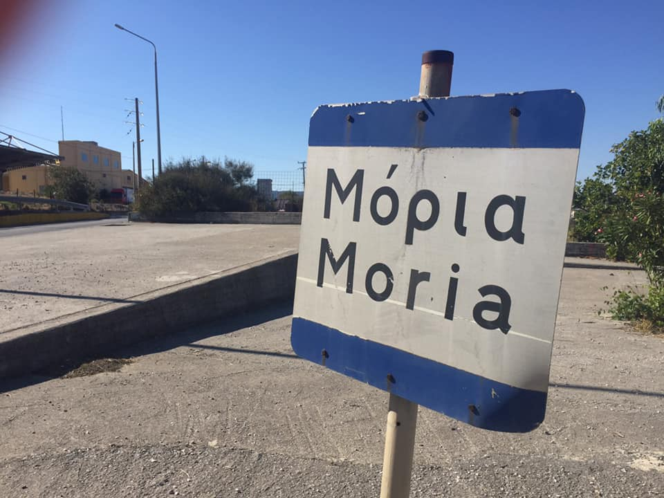
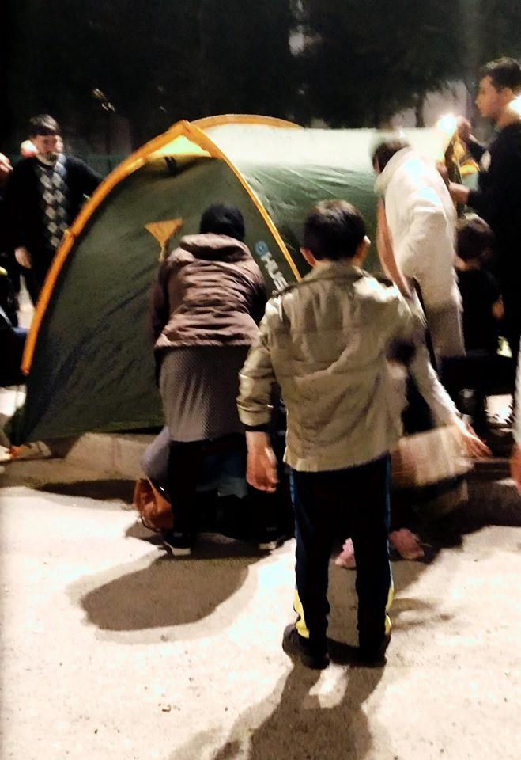

### AYS Weekend Digest 28–29/9/2019, Fire in Moria camp took mother and baby’s life

Families living rough in Paris /// EU coastguard refuse assistance in the central Med /// Tragedy in the western Med /// New plans to decongest the Greek islands /// Updates on Athens evictions /// No medical care in Vucjak /// Swiss court to decided if Croatia is safe for returns /// Suicide of rejected asylum seeker in Sweden /// and more…

#### FEATURE — Fire in Moria camp, Lesvos

As we reported on Sunday as soon as the news reached us, a large fire broke out within Moria camp, burning 7 to 10 houses \(plastic containers\) \. A second fire also broke out, apparently [outside](https://twitter.com/rspaegean/status/1178357291952857089?fbclid=IwAR14LP2uxAuiMW8mOAtxNTj03A8b63ZtlvpHDZ5dqFoeQsxqTvj_Q68nh5U) the camp\.

 \)](assets/e6cb7231c9a9/1*YmSVUE0AMsYQ9u5rIcc2_Q.jpeg)

Moria camp, Lesvos \(Photo by [Maurizio Lebanne](https://twitter.com/MaurizioDebanne/status/1178346607915483137/photo/1) \)

The fire took the lives of a woman and a child\. According to people in the camp and sources on the ground the fire [started](https://twitter.com/TassosMorfis/status/1178384597429735429) from a faulty light bulb\. An unconfirmed number of people are injured, from burns and smoke inhalation\. MSF have [treated](https://twitter.com/MSF_Sea/status/1178388608136417281?fbclid=IwAR3td2_NwqyhHM8ilgdrRYuGGcCbGmOjNItBwQfUB7r8LHdxOMO-fnnC_CE) at least 21 people\.

■■■■■■■■■■■■■■ 
> **[Arash Hampay](https://twitter.com/ahampay) @ Twitter Says:** 

> > Moria camp, Lesvos Greece 
#RefugeesWelcome #refugeesgr https://t.co/H2AL7xJ42q 

> **Tweeted at [2019-09-29 15:46:09](https://twitter.com/ahampay/status/1178335159751458820).** 

■■■■■■■■■■■■■■ 

■■■■■■■■■■■■■■ 
> **[Julian Busch](https://twitter.com/JulianBusch2) @ Twitter Says:** 

> > Two big fires in Moria refugee camp. #lesvos #Moria https://t.co/c5P9uvfaZk 

> **Tweeted at [2019-09-29 14:34:16](https://twitter.com/julianbusch2/status/1178317071094038528).** 

■■■■■■■■■■■■■■ 

The fire extended rapidly from one container to the next, and as the arrival of firefighters was [delayed](https://twitter.com/rspaegean/status/1178412406613123074) , residents tried to [put the fire out themselves](https://twitter.com/Faloulah/status/1178550676655398912?fbclid=IwAR0dKh4loZU72EMThFr74cHtTd_5iiYQ9fXZpbC4uXEF3rjUPZc3egO3gqw) \. The situation caused a confrontation between residents and the police, who in response are reported to have used teargas and to have [shut the gates](https://twitter.com/TassosMorfis/status/1178377817266049024) of the camp while the fire was still roaring\. Police [announced](https://twitter.com/rspaegean/status/1178357291952857089?fbclid=IwAR14LP2uxAuiMW8mOAtxNTj03A8b63ZtlvpHDZ5dqFoeQsxqTvj_Q68nh5U) that after today, more agents will be deployed in Moria\.

■■■■■■■■■■■■■■ 
> **[Tassos Morfis](https://twitter.com/TassosMorfis) @ Twitter Says:** 

> > Please allow me to put this in some perspective. Greek police locked the gates of a burning refugee camp. Of a refugee camp that’s on an ISLAND. 

> **Tweeted at [2019-09-29 18:35:39](https://twitter.com/tassosmorfis/status/1178377817266049024).** 

■■■■■■■■■■■■■■ 

This is yet another tragedy directly caused by the overcrowding and dire living conditions in the camp\.

■■■■■■■■■■■■■■ 
> **[RSA](https://twitter.com/rspaegean) @ Twitter Says:** 

> > "It was terrifying," a mother says. A family father comments: "Its not the first time. This is our daily life in #Moria." #stopthetoxicdeal #refugeesgr #opentheislands 

> **Tweeted at [2019-09-29 20:54:32](https://twitter.com/rspaegean/status/1178412766736130051).** 

■■■■■■■■■■■■■■ 

Several Greek and international media outlets used this news to promote their toxic anti\-migrant rhetoric, accusing the residents of the camp of [starting the fire](https://apnews.com/92a15950e8f948ef99ebdbcb5df2f966?fbclid=IwAR2a2P0-b2RytPuDhmdU-l_tOAK0ApQRmOF8oTJAL_PUXX4JVEN8DFaJ-Xs) , [blocking the emergency response](https://www.keeptalkinggreece.com/2019/09/29/moria-fire-dead-lesvos-videos/) , attacking the police and being ultimately responsible for today’s deaths\.

LIBYA
#### **New video from Zintan detention centre**

Human rights lawyer and advocate [Giulia Tranchina](https://www.facebook.com/rastajuly) has published a video from Zintan detention centre\.

> These are the inhuman and degrading conditions that over 500 refugees are suffering in \#Zintan detention centre from years\. They are survivors of years of torture and starvation\. Over 120 are minors\. Many were trafficked to Libya from Sudan against their will, sold, tortured, enslaved\. They are dying of starvation, TB and horrific sanitary conditions\. They don’t need EU countries to send blankets\. They need immediate evacuation\. Shame on our governments for their reconfirmed complicity with the Libyan authorities and so called “coast\-guard”\. **We are commissioning and funding crimes against humanity\.** \#EvacuateRefugeesFromLibya 

SEA
#### Central Med

Over the weekend Alarm Phone was contacted by three boats in distress\. [One](https://www.facebook.com/watchthemed.alarmphone/photos/a.1526182797655958/2463802057227356/?type=3&theater) was very close to Lampedusa and the Italian coastguard rescued the 40 people on board\. The [second](https://twitter.com/alarm_phone/status/1177711727795933184) was at sea for more than 80 hours before being intercepted by a Libyan coastguard vessel and brought back to the north African country\. Alarm Phone tried to contact Maltese, Italian and French coast guards, as well as EUNAVFOR MED vessels in the area, but they all refused to cooperate\.

■■■■■■■■■■■■■■ 
> **[Alarm Phone](https://twitter.com/alarm_phone) @ Twitter Says:** 

> > Finally, after 80h in distress at sea &amp; shameful European non-assistance, the boat that contacted us seems to have been found by the so-called Libyan CG about 1 hour ago. @refugees &amp; Libyan authorities confirm this. As we lost contact to the boat at 3am we hope it's the same one! 

> **Tweeted at [2019-09-29 08:25:21](https://twitter.com/alarm_phone/status/1178224228702789632).** 

■■■■■■■■■■■■■■ 

[A third boat](https://twitter.com/alarm_phone/status/1178418722219925504) was in distress in the Maltese SAR zone, carrying 32 people of which 7 are children and 2 are pregnant women\. Alarm Phone informed the authorities, who refused to give information about the rescue operations\. At the moment of writing no new information is available\.
#### Tragedy in the Western Med

■■■■■■■■■■■■■■ 
> **[Caminando Fronteras](https://twitter.com/walkingborders) @ Twitter Says:** 

> > #TRAGEDIA | Siete muertas y más de cuarenta desaparecidas en una tragedia frente a las costas de Mohamedia (Marruecos). Los únicos tres supervivientes, encontrados inconscientes, han sido hospitalizados. https://t.co/VhDrv9Sxhn 

> **Tweeted at [2019-09-28 16:10:22](https://twitter.com/walkingborders/status/1177978866150858752).** 

■■■■■■■■■■■■■■ 

> “Seven dead and more than forty missing in a tragedy off the coast of Mohamedia \(Morocco\) \. The only three survivors, found unconscious, have been hospitalized\.” 

Europapress [report](https://twitter.com/EPAndalucia/status/1177953140034940928?fbclid=IwAR06iyF7-xM8-NUQy-hrHTMQOBkh860s8gnJpXImZW9icNY-YO_CwKFgGWM) that nine men and three children were rescued from a small boat in Strait waters\. Last week [405 people](https://twitter.com/DrAZoubeidi/status/1178409276802523136?fbclid=IwAR3L6JspO1kfPuun9fJEKt5t0N9EslJGmEeENMSHBCNTv0lIE_aXgx4_3Xo) arrived from Morocco to Spain\.

GREECE
#### Arrivals

Four boats have arrived on Lesvos since yesterday, carrying 175 people\. \( [From Aegean Boat Report](https://www.facebook.com/AegeanBoatReport/?tn-str=k*F) \)

A boat reached Chios with 43 people: 20 children, 15 men, 8 women\. \(From [Salvamento Maritimo Humanitario](https://twitter.com/smhumanitario/status/1177827830119489536) \)

With Friday’s tragedy — in which 5 children and 2 women drowned trying to reach the Greek islands from Turkey — [61 people](https://twitter.com/RefugeeRescueUK/status/1177886379193360385?fbclid=IwAR0D4xUHpBQ_vAa5aklNBs8OFGNe9cJ5eqT1lWdCX0jY9ffKb_tZEl0V_Ro) are known to have died in the Aegean since the beginning of 2019\. A [service](https://www.facebook.com/peter.bouckaert/posts/10156173061132024?hc_location=ufi) was held on Lesvos for all the people who died at sea killed by European border policies\.
#### **New plans to decongest the islands**

An emergency meeting between the citizen protection minister Michalis Chrysochoidis and 13 regional governors was held on Friday\. According to local media, the minister [stated](http://www.ekathimerini.com/244997/article/ekathimerini/news/bid-to-ease-migrant-pressure-on-islands?fbclid=IwAR3W8ypDufNAlNU-op9lgN23AK2y32pKr0lGRvVkyejcz02l42-UZmGt_ZM) that there are no plans to build new large camps, but that each regional unit will have to accept a number of refugees from the islands, expanding already existing structures\.

Furthermore, it is said that a [new draft bill](http://www.ekathimerini.com/244997/article/ekathimerini/news/bid-to-ease-migrant-pressure-on-islands?fbclid=IwAR3W8ypDufNAlNU-op9lgN23AK2y32pKr0lGRvVkyejcz02l42-UZmGt_ZM) , aimed at tightening up the asylum procedure and limiting refugees’ rights will be discussed at a cabinet meeting on Monday\. It seems that the proposal to cancel the second appeal in case of rejection has been dropped\.
#### **Updates on the evictees from Athens Squats**

Activist Arash Hampay [informs](https://www.facebook.com/groups/446386565554391/permalink/1175782862614754/) us that many ex\-residents of the 2nd School \(Jasmin\) squat, evicted on the 19th of September, are still homeless\. Among them are families with small children\.

Most of the people evicted from 5th School on the 26th of September were [taken](https://twitter.com/VassilisTsarnas/status/1177899849972424710) to the new transit camp in Corinthos, which was \(and still is\) far from ready for hosting anyone\. Due to dire conditions some have left it and are searching for cheap apartments in Athens and landlords that won’t discriminate against them, so children can go back to school\. They need support in finding new homes in Athens, [help them if you can](https://m.facebook.com/story.php?story_fbid=3007628782597064&id=1302897399736886) \.
#### **Updates from Northern Greece**

The coordinator of [Medical Volunteers International](https://www.facebook.com/medicalvolunteersinternational/posts/986372511705537?hc_location=ufi) in Thessaloniki published some information on the situation in the city\.

> I am coordinating the MVI project in Thessaloniki for a year now\. The circumstances for refugees and migrants have become much more difficult\. Without official police paper, there is no access to regular meals, showers or clothing\. \[…\] Since August we have been treating an average of 100 people seeking protection each day\. 60% of the treatments are woundcare: we regularly treat infected mosquito bites, many injuries by NATO wire, blisters in sizes that I could never have imagined, as well as stab and cut injuries\. 

> **For a few weeks we have noticed a massive increase in violent injuries caused by authorities\. I have never seen such bad traces of torture\. It scares me and I’m wondering where this could be leading\.** 

> It also already is getting very cold at night and people on the streets are asking for sleeping bags and long clothing\. We constantly see gastric issues, but as winter approaches we increasingly treat respiratory infections\. All the small things which would heal quickly and well if you could lay down at home and rest but lead to bigger problems if you are forced to live on the streets\. 

MVI need your [support](https://www.facebook.com/donate/512909012794636/) \.

■■■■■■■■■■■■■■ 
> **[RSA](https://twitter.com/rspaegean) @ Twitter Says:** 

> > The region of #Volvi in North Greece hosts 1250-1300 refugees. In the beginning of October 600-700 #refugeesgr from the islands planed to be transferred in the camp of #Vaghiohori. Municipality of Volvi is concerned.  
[makthes.gr/voyliazei-o-di…](https://www.makthes.gr/voyliazei-o-dimos-volvis-apo-prosfyges-kai-metanastes-238621) 

> **Tweeted at [2019-09-28 07:33:10](https://twitter.com/rspaegean/status/1177848710262333440).** 

■■■■■■■■■■■■■■ 

ITALY

**Arrivals to Lampedusa**

205 people are [reported](https://twitter.com/AngiKappa/status/1178302054332293120?fbclid=IwAR1ZjVRvlfkcKmhlS_ChBWqSoSuMTnNn2azzAdTGdBV-ZDa1nxo26ntV0LI) to have arrived in 9 separate landings to Lampedusa over the weekend\.

BOSNIA

**No medical care in Vucjak Camp**

 \)](assets/e6cb7231c9a9/1*RcrbTyCO4wiyMzhPCIqp3Q.jpeg)

\(Photo Credit: [Joma Rameva](https://web.facebook.com/photo.php?fbid=142761576975949&set=a.142761660309274&type=3&theater) \)

[Reports from the ground](https://web.facebook.com/photo.php?fbid=142761576975949&set=a.142761660309274&type=3&hc_location=ufi) state that Vucjak camp has been without a medical presence for 4 days now as authorities have kicked out the medical volunteers\. There are currently 800 people living there in deplorable conditions\.

**Winterisation fundraiser for Vucjak**

Refugee Byriani and Bananas are raising funds for winter needs, starting with blankets, for those trapped in Vucjak Camp\. Find out more [here](https://web.facebook.com/donate/468973413952576/2309833555900671/) \.

CROATIA

**Court questions if Croatia is a safe third country**

[Swiss media report](https://www.srf.ch/news/schweiz/illegale-push-backs-sem-bei-kroatien-rueckfuehrungen-zurueckgepfiffen?fbclid=IwAR27-nzDtb1m4KAygwb0wxMgAnFypUItqJ29BiQfGQ3pTsuVY8qonB4FMPQ) that the Federal Administrative Court in Switzerland is currently considering the case of two individuals facing return under the Dublin agreement to Croatia\. Due to the violent nature of the illegal push backs which happen there and the failings of the Croatian Asylum System they will hopefully have their asylum cases heard in Switzerland instead\. If they succeed this could set an important precedent against returns to Croatia\.

FRANCE

**Updates from Grand\-Synthe**

A [volunteer](http://Annerose Witzler) was in Grand\-Synthe during the weekend\. She talks of a massive police presence, which did not authorise food distribution\. Refugees’ belongings were taken away and destroyed, leaving them without shelter from the rain\.
#### Updates from Paris camps

 \)](assets/e6cb7231c9a9/1*77kdoc0g1ln195u7cEUzrg.jpeg)

Paris \(Photos by [Danika Jurisic](https://www.facebook.com/photo.php?fbid=2427844797542145&set=pcb.2427845184208773&type=3&theater) \)

Many families with small kids, including those with refugee status, are abandoned by the institutions and forced to live in tents in the hidden parks of the city\. Danika Jurisic, a long\-term volunteer [shared](https://www.facebook.com/permalink.php?story_fbid=2427845184208773&id=100009499466124&hc_location=ufi) a testimony of a worker from a French grass\-roots association:

> We have a family of 5 , two parents and 3 children, one of them is 7 weeks old\. They have all refugee status and they are supposed to be housed\. But they are left on the street\. We have been calling the emergency housing center — 115 — for days\. 276 call all together\. None but the last one were answered\. At the last 276th call, after 46 minutes of waiting online, one of the employee answered, and almost in tears, told us that there is no solution, no available housing options, and that there are over 20 families with small babies on the street that night… 

Danika’s group is distributing NFIs and clothing, please find the needs list [HERE](https://www.facebook.com/permalink.php?story_fbid=2427845184208773&id=100009499466124&hc_location=ufi) , and support them [HERE](https://www.gofundme.com/refugees-in-paris-winter-2019?fbclid=IwAR3vE7frT8Q6C1F6_yNML_9a24cIENzWaOFmapDJ0ElWnRg2OyFzsOXvGrU) if you can\.

SWEDEN

**Young man kills himself to avoid deportation**

A young Afghan man has committed suicide this week in Sweden having received a rejection of his asylum claim after 4 years of waiting\. According to a [report by ECRE](https://www.ecre.org/sweden-increase-in-deportations-and-self-harm-widespread/?fbclid=IwAR2xxi50hWJD8_gLE_coh2afPZgRws4XEnGPmUb65obM-Je730jyvdWce1c) self harm and suicide attempts among asylum seekers are on the rise in line with an increase in deportations\.

EU
#### **Renewed support of the Toxic EU\-Turkey deal expressed by the EU Commission**

According to the European Council on Refugees and Exiles \(ECRE\), the EU Commission has \(unsurprisingly\) released a [statement](https://www.ecre.org/commission-express-commitment-to-turkey-agreement-as-situation-continues-to-worsen-in-greece/) expressing awareness on the worsening conditions for refugees in Greece, and especially on the Greek eastern islands, but re\-stating its commitment to the EU\-Turkey deal, praising the containment role played by Turkey\.

**If you wish to contribute, either by writing a report or a story, or by joining the info gathering team, please let us know\.**

**We strive to echo correct news from the ground through collaboration and fairness\. Every effort has been made to credit organisations and individuals with regard to the supply of information, video, and photo material \(in cases where the source wanted to be accredited\) \. Please notify us regarding corrections\.**

**Apart from daily news in English, we also publish weekly summaries in Arabic and Persian\. Find specials in both languages on our [medium site](https://medium.com/are-you-syrious/ays-weekly-in-arabic-and-persian/home?source=post_page---------------------------) \.**

**If there’s anything you want to share or comment, contact us through Facebook, Twitter or write to: areyousyrious@gmail\.com\.**

_Converted [Medium Post](https://medium.com/are-you-syrious/ays-weekend-digest-28-29-9-2019-e6cb7231c9a9) by [ZMediumToMarkdown](https://github.com/ZhgChgLi/ZMediumToMarkdown)._
