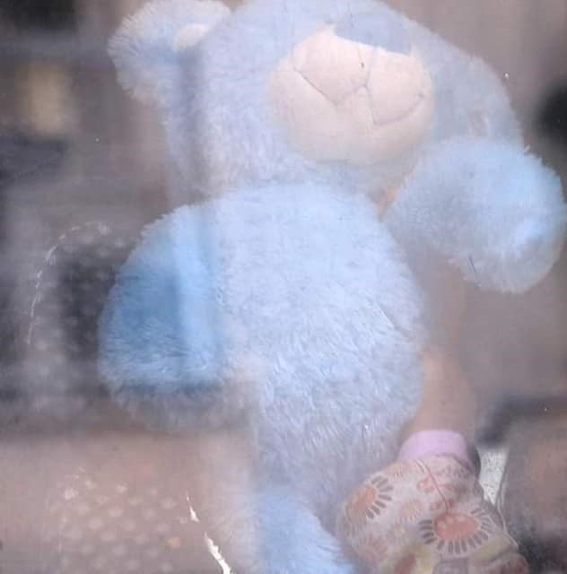

### AYS Special — Athens Evictions: How many homes can one person lose?

Only a few days after the victory in the general elections in July, Greek police enacted the eviction of the “City Plaza”, with embedded journalists, cameras and photographers\. The City Plaza squat was empty, all the residents had already been re\-housed by then and no one was living there\. For the authorities that was not important\. Thanks to crooked media, all they needed was a symbolic operation to show their attitude towards refugees and activists\.

On the 26th of August, this attitude turned tragically real\. Trikoupi 17, Transito, Rosa de Foc e GARE were evicted that morning and 147 people were left without a home\.

On the 19th of September, two more squats were evicted: 2nd School \(Jasmine\) and Acharnon 22\. 225 more people left on the street\.

On the 23rd of September, 143 people have been evicted from 5th School\.

515 people\. They were brought to the Alien Police Department in Athens\. Their IDs and document were checked\. Those without papers have put in detention or deported\. Those with papers have been taken to different camps\. Many in Corinth, others in Nea Kevala and other camps in the north\.

The following article was written by one of our Athens\-based editors on [her blog](http://musty.wordpress.com/2019/09/26/athens-evictions-how-many-homes-can-one-person-lose/?fbclid=IwAR0pJE5nKOW8GqtYdgSvXp8cFwq0VNH72l1KEezGq_JnNW5NHPE22l3I3Nk) , we are pleased to repost it and share it\.

Photo Credit: Marios Lolos, Art Against

I haven’t been able to write about the situation in Athens for a while; I haven’t been able to find the words\. It’s as if they’ve all been used up already, screamed into the void one too many times, what more can I say? And yet there is more that must be said\.

These last weeks we have witnessed the destruction of many community spaces in this city\. The brutal face of the state exposed to the unblinking eye\. We see the ripping apart of communities on many levels, children removed from the city as they are starting the school year in the knowledge they may now not be able to gain access to education for another year, if ever, the disregard of friendships, solidarity networks, access to case workers for asylum claims, ongoing medical treatment, pregnancy\. **The removal of people from the public eye followed by rumors of hunger strikes happening far out in the countryside where no one is present to listen to the hunger strikers statement of demands, slowly starving themselves in silence\.**

Yet the public tire of the pain, and wish it would end, no longer for the sake of the people effected but for their own well being, they turn away\. And this is how the state wins, not only in Greece, not only in Europe, but throughout the world, leaders take for granted that we will look to self interest first, we will seek to preserve what is ‘ours’ for ‘us’ alone\. Everyone states that they wish this situation would end, most of all the people who have left their home countries seeking the sanctuary of another, and yet the dangerous conditions at borders throughout the world are actively protracted by protectionist policies, the number of arrivals is on the rise, and the deaths continue\.

I take hope from the mass movement of young people against climate change, not only because migration and climate change are intrinsically linked and both struggles highlight the inequalities between people in the countries who create the problem and people in the countries where the repercussions are felt, but because it shows that such mass movements are still possible\.

The actions of the new government here in Greece are designed to bind our wrists, to prevent us as a movement from acting in solidarity\. As the number of homeless families rise, as women who have given birth are sent from the hospital onto the street, we no longer have the option of finding them a space in a solidarity occupation, and the state has provided no other option other than a few new windswept camps where tents are the only structures, where the first bite of winter is already felt, and services along with bus routes to urban centers are often non\-existent\.

There have been many tears shed this week, not only by those who have been forced to leave their homes, but by those who had no choice but to wave at their friends as they were taken unwillingly on buses to a transit camp in Corinth from which they will be ‘distributed’ to other camps in parts of Greece where they know no\-one\.

**From somewhere deep within us, we must find a way to continue and to take strength from each other\. We must find a way to maintain our gaze, we must not look away, we must not let these actions and these humans be forgotten\.**

**If you wish to contribute, either by writing a report or a story, or by joining the info gathering team, please let us know\.**

**We strive to echo correct news from the ground through collaboration and fairness\. Every effort has been made to credit organisations and individuals with regard to the supply of information, video, and photo material \(in cases where the source wanted to be accredited\) \. Please notify us regarding corrections\.**

**Apart from daily news in English, we also publish weekly summaries in Arabic and Persian\. Find specials in both languages on our [medium site](https://medium.com/are-you-syrious/ays-weekly-in-arabic-and-persian/home?source=post_page---------------------------) \.**

**If there’s anything you want to share or comment, contact us through Facebook, Twitter or write to: areyousyrious@gmail\.com\.**

_Converted [Medium Post](https://medium.com/are-you-syrious/ays-special-athens-evictions-how-many-homes-can-one-person-lose-2142ff20b0f6) by [ZMediumToMarkdown](https://github.com/ZhgChgLi/ZMediumToMarkdown)._
