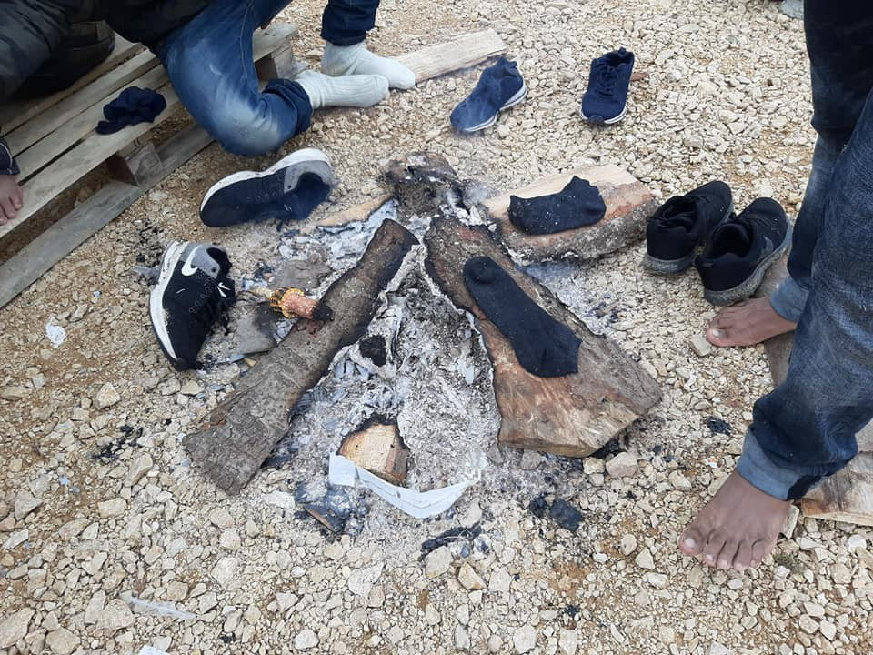

### AYS DAILY DIGEST 04/10/2019: Italy’s new plan to accelerate expulsions and forced returns
### New report on immigration detention in Greece highlights worrying number of children imprisoned//Seehofer willing to strengthen EU\-Turkey deal//700 people currently stranded in Brussels//6\-year\-old child died after being rescued off the Spanish shore…

[Are You Syrious?](@AreYouSyrious?source=post_page-----ac2c059e7bcc----------------------)

[Oct 5](ays-daily-digest-04-10-2019-italys-new-plan-to-accelerate-expulsions-and-forced-returns-ac2c059e7bcc?source=post_page-----ac2c059e7bcc----------------------) · 5 min read

Credit: Sanella Lepirica\. October 2019\.
### FEATURED

Today, Foreign Minister Luigi di Maio and Justice Minister Alfonso Bonafede presented a new plan for “managing” migration flows in Italy, the Piano Rimpatri Sicuri \(Safe Returns Plan\) \. The decree has the final aim of accelerating the expulsions of those “who do not have the right to stay in Italy”, de facto maintaining the very same approach to migration as the last government guided by the far\-right\.

Di Maio stressed that it is fundamental not only to improve re\-distribution policies, but also to stop arrivals\. He also presented a list of 13 countries, considered safe countries, with which Italy could sign accords to push people on the move back to; these countries are Algeria, Morocco, Tunisia, Albania, Bosnia and Herzegovina, Capo Verde, Ghana, Kosovo, Macedonia, Montenegro, Senegal, Serbia and Ukraine\.

Of the 7,872 people who arrived in Italy in 2019 \(source: [UNHCR](https://data2.unhcr.org/en/situations/mediterranean/location/5205) \), one third, according to the Minister, comes from one of these countries\. Apparently, notice of the human rights violations and constant police brutality being reported from at least the Balkan and Northern Africa regions has not reached the Italian government\. As reported by Border Violence Monitoring, in fact, [a person is pushed back every twenty minutes](https://www.borderviolence.eu/a-person-pushed-back-every-twenty-minutes/#more-13531) from Croatia to BiH, while in Morocco the situation is not better, with both [people on the move and activists being specifically targeted by police actions](https://www.meltingpot.org/In-Marocco-la-criminalizzazione-della-solidarieta-colpisce.html?fbclid=IwAR1bSLk1tKYjN6VXh4HGou-YoI9WH3bKNJwOFXV5yapwfgmD8aPuVR4u6PM#.XZhR-S2B00p) \. Here also those in transit are forced to sleep in plastic makeshift tents in the forest outside the city of Nador, threatened with police raids and brutality and, of course, forced expulsions\.

Nevertheless, the Foreign Minister stated proudly that the government has all the tools necessary to process an expulsion order in four months, instead of the current two years, adding that additional money should be spent to expel people on the move\. Specifically, he claimed that at least € 50 million should be invested in creating and maintaining these bilateral accords, not counting the extra actual costs of the expulsion procedure\.

Voluntary returns, expulsion orders with the order to leave the country with one’s own means and forced returns are the methods to be implemented with the aim of removing foreigners\. Until now, [Italy has spent € 11,731,250 to expel people](https://www.tpi.it/politica/rimpatri-migranti-quanto-costano-italia-20191004464030/?fbclid=IwAR0-V299FvmknPXCwmzQzaCzgWpOYyLoJrgDhaMoSqJP-mTt6T4se2OfR88) — € 9,700,000 just for forced returns\.

Original source [here](https://www.tpi.it/politica/piano-rimpatri-sicuri-decreto-di-maio-20191004463752/?fbclid=IwAR2so4H8Xu0fxj3W6zAWXagr1rZ8E8MzNL6Ce-Ud6bHMFCxYwlCpNindrjg) \.
### GREECE

> _“We will not become the friendly host of the oppressed of this world\.”_ 

This is what Kyriakos Mitsotakis, Prime Minister of Greece, said according to [Alfavita](https://www.alfavita.gr/politiki/300241_mitsotakis-gia-prosfygiko-den-tha-ginoyme-o-filikos-ypodoheas-ton-katatregmenon?fbclid=IwAR2TPVPDmjkXAOojOeUMgEm5dCmuJE-OH9jKJljB2gRKm7ZHd-c_rzp244I) \. The rhetoric used in Greek politics shows how the country with its new government is shifting to an even harder form of racism than the government before\. Despite the slow efforts to transfer people from the Aegean Islands to the mainland, it is likely that it will try to challenge the international conventions and agreements on asylum\.

Responding to this, the Legal Centre Lesvos [published](http://legalcentrelesvos.org/2019/10/04/it-is-not-enough-for-your-country-to-be-at-war-you-should-be-more-vulnerable/?fbclid=IwAR22BXdpV6FAiDEpz2AqfV8awjMeGbsfn7ksdusSHS0CLev2EWaG1ugPOAE) the open letter of a camp resident describing the hard tests involved in the the asylum process:

> _Isn’t it enough that I am telling you that I have overcome death many times to get here? Isn’t it enough that I managed to escape war? Isn’t it enough that I lost my loved ones on the way here? Isn’t it enough that in my homeland all human rights were violated? And moreover, I ask if it isn’t enough to have arrived all the way here, fleeing such horrors, under the extreme conditions of the journey\._ 

Meanwhile, the Global Detention Project [highlights](https://greece.greekreporter.com/2019/10/04/greece-tightens-health-care-provisions-for-migrants-asylum-seekers/?fbclid=IwAR2xidBrkiiXx5a-U7tu5tI7hrLMyXo7FYJhBKzFUYvLYgFMppHY2QVjdp0) the systematic detention of children in Greek hotspots in a new analysis\. It criticizes detention orders that “lack individual assessments; inadequate conditions of detention; and the use of police stations for immigration detention purposes”\. A practice which has already been condemned by several NGOs, countries and the UN\.

Seeing this and all the other cases of discrimination, it seems hard to imagine how conditions can be made even worse to make Greece “not the friendly host”\. But it could happen: Greekreporter [writes](https://greece.greekreporter.com/2019/10/04/greece-tightens-health-care-provisions-for-migrants-asylum-seekers/?fbclid=IwAR3Sf9TTeYuwClmdHgTofER02vbupzUZSBYnte6gWB59hBUBJpBvV4MVnKQ) that the government is planning to tighten up procedures for free health care and other social benefits\.
### WESTERN MEDITERRANEAN

After being rescued, a 6\-year\-old child died during the journey to the port in Almería\.

A total number of 65 people \(of whom 22 children\) were taken to safety from the same boat\.
### GERMANY

Germany’s Interior Minister Horst Seehofer visited Ankara recently to strengthen the EU\-Turkey deal, which has never been fully implemented since it came into force in March 2016\. “I have nothing to critcize Turkey’s work for”, Seehofer said according to [Tagesschau](https://www.tagesschau.de/ausland/seehofer-fluechtlingspakt-tuerkei-101.html?fbclid=IwAR2WmozWcaS0KyoH5li3za8Ae7vR4Zuhd5DxM1AtcS-aeuh73nSI-0yEV6E) , adding that Germany wants to support Turkey in coping with the new influx of Syrians\. This year alone, more than 50,000 people crossed the border to Turkey as the fights in the last rebel strongholds intensified\. But instead of supporting Turkey in providing humanitarian assitance, Seehofer wants to help the country by protecting its borders\. It is rumoured that a third package could be in the pipeline for continuing the deal\. Turkey has already recieved some 6bn Euros in two tranches\. However, in the past, the money did not go to the goverment \(with some exceptions\), but only to NGOs offering humanitarian services\.

On Saturday there will be a protest in Munich against deportations from Germany to war zones\.
### [DEMO keine Abschiebungen nach Afghanistan & andere Kriegsgebiete](?source=post_page-----ac2c059e7bcc----------------------)
### [Causes event in Munich, Germany by Gemeinsam für Menschenrechte und Demokratie and 4 others on Saturday, October 5 2019…](?source=post_page-----ac2c059e7bcc----------------------)
#### [www\.facebook\.com](?source=post_page-----ac2c059e7bcc----------------------)
### BELGIUM

Around 700 people are currently living in the Maximilian Park in Brussels, reports Care4Calais, after the team distributed some 350 track suits\.
### [Care4Calais](?type=3&permPage=1&source=post_page-----ac2c059e7bcc----------------------)
### [There’s a big park in Brussels, Maximilian Park, a two hour drive fr… om Calais\. It’s green and has tennis courts…](?type=3&permPage=1&source=post_page-----ac2c059e7bcc----------------------)
#### [www\.facebook\.com](?type=3&permPage=1&source=post_page-----ac2c059e7bcc----------------------)

**If you wish to contribute, either by writing a report or a story, or by joining the info gathering team, please let us know\.**

**We strive to echo correct news from the ground through collaboration and fairness\. Every effort has been made to credit organisations and individuals with regard to the supply of information, video, and photo material \(in cases where the source wanted to be accredited\) \. Please notify us regarding corrections\.**

**Apart from daily news in English, we also publish weekly summaries in Arabic and Persian\. Find specials in both languages on our [medium site](https://medium.com/are-you-syrious/ays-weekly-in-arabic-and-persian/home?source=post_page---------------------------) \.**

**If there’s anything you want to share or comment, contact us through Facebook, Twitter or write to: areyousyrious@gmail\.com\.**
### [Are You Syrious?](/are-you-syrious?source=post_sidebar--------------------------post_sidebar-)
#### Daily news digests from the field, mainly for volunteers and refugees on the route, but also for journalists and other parties\.

Following

_Converted [Medium Post](https://medium.com/are-you-syrious/ays-daily-digest-04-10-2019-italys-new-plan-to-accelerate-expulsions-and-forced-returns-6caa17360e96) by [ZMediumToMarkdown](https://github.com/ZhgChgLi/ZMediumToMarkdown)._
