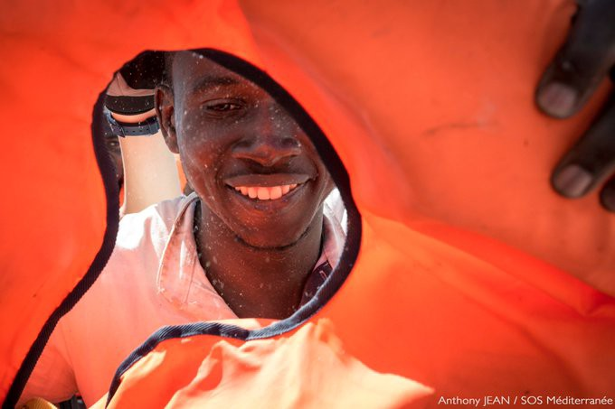
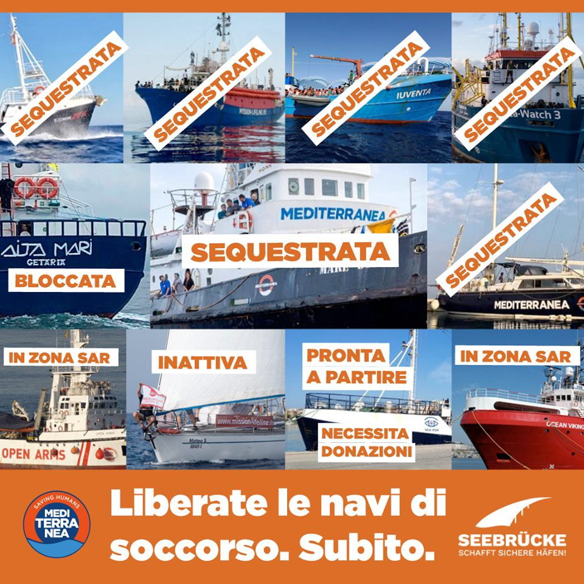
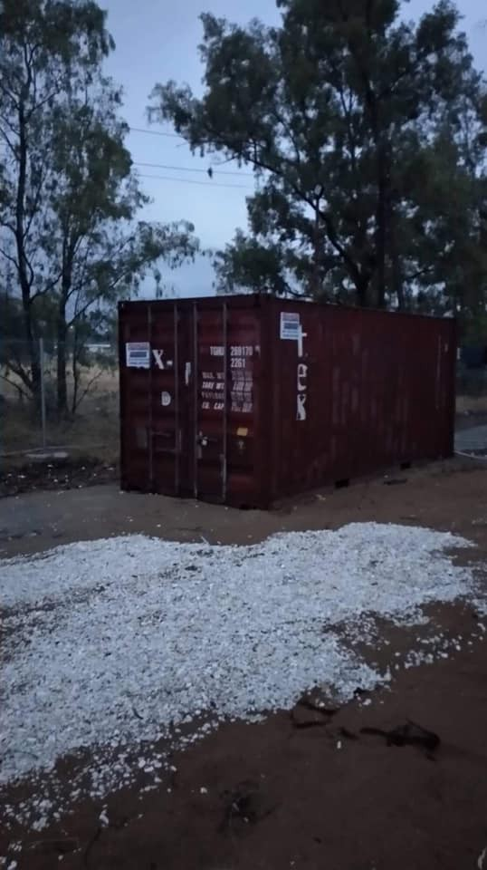
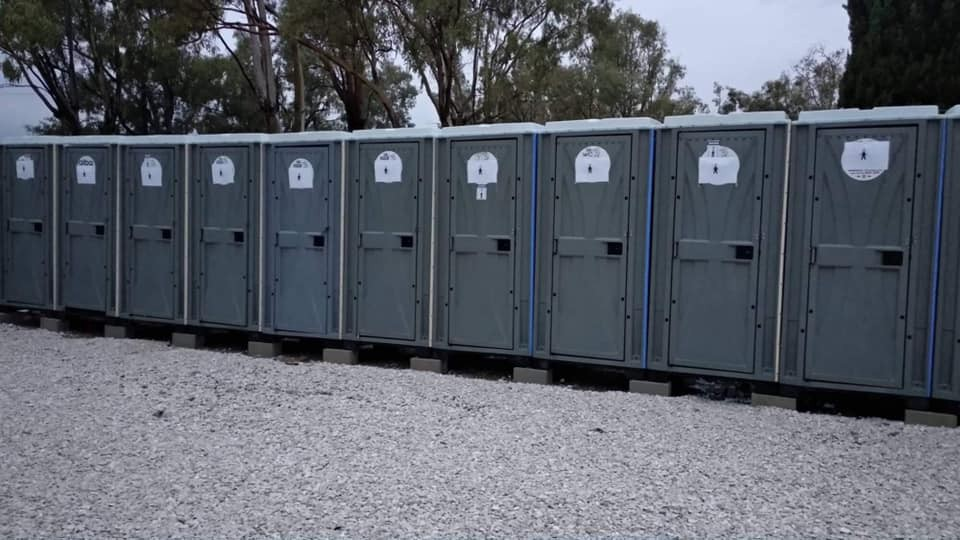
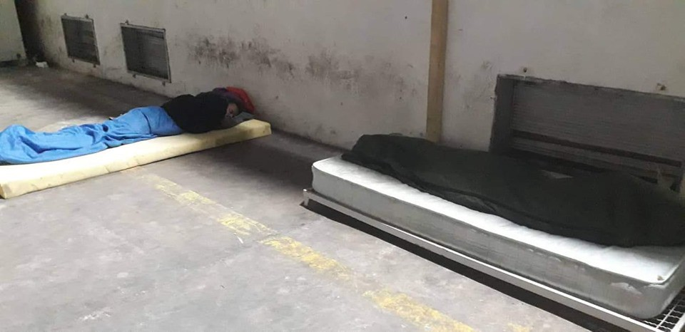
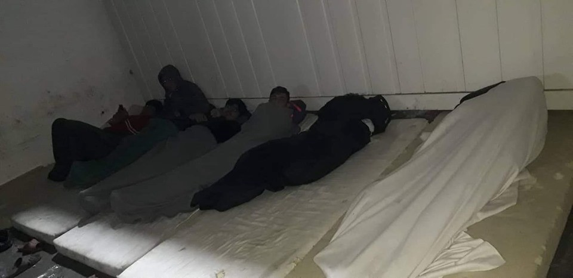
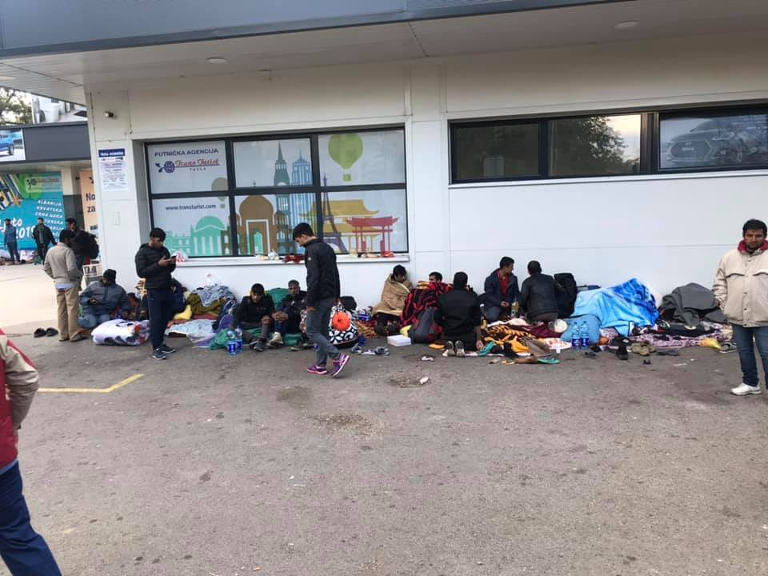
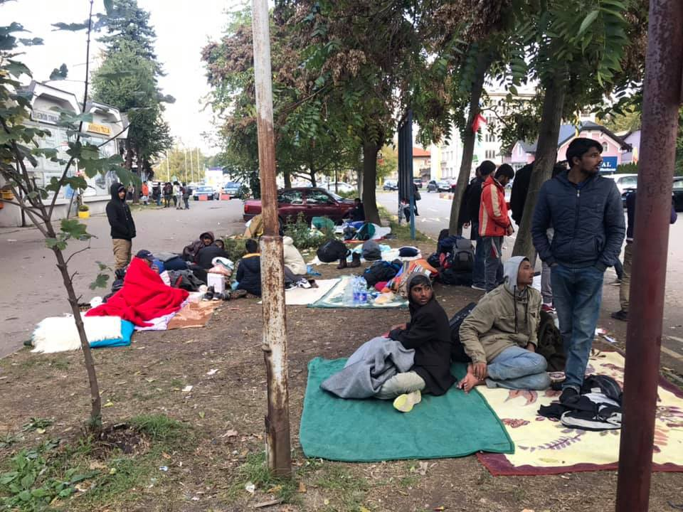

### AYS Daily Digest 7/10/2019: Another tragedy in the Mediterranean as 13 women lose their lives
#### Dire living conditions for people transferred to mainland Greece// Turkey to start attacking Northern Syria any minute now// Donations and volunteers needed in Greece and BiH// 44 people on board of Open Arms to be disembarked in Malta// Church asylum becomes more and more ineffective against deportations from Germany// More news from the Mediterranean, Italy, Sweden…

Credit: Anthony Jean, SOS Méditerranée\.
#### FEATURED STORIES

In the night between Sunday 6th and Monday 7th October, another tragedy happened off the shores of Lampedusa, when [a boat with 50 people on board capsized](https://www.tpi.it/cronaca/naufragio-lampedusa-migranti-morti-20191007465476/?fbclid=IwAR3hkqn4AbzAcvHHT7552SisegCJYxxiLNaN9GZ9iEctF8YKj7orM-k5Ock) \. 13 women are reported to have drowned, including a 12\-year\-old girl and a pregnant woman\. 22 survived, but still many are missing; among those lost at sea, there are at least 8 children and one woman and her 8 month old baby\. People on board were from Tunisia and other subsaharan countries, confirming [the shift that is happening in the depature route](https://www.repubblica.it/cronaca/2019/10/07/news/migranti_naufragio_nella_notte_a_lampedusa_recuperati_due_cadaveri-237874064/?fbclid=IwAR3dFJS5Gku7dNvNjnqCF8MZz4djYfn2AzvDLSIU3CEO2Q-RtOVCgee75rM) \.

The survivors were accompanied by the ICG and Guardia di Finanza to the mainland\. As investigations continue, the public prosecutor of Agrigento stated that all the people on board were travelling without lifejackets, adding that this tragedy could have been avoided and that all of the credit is to be given to the ICG and Guardia di Finanza for their quick intervention, completely overlooking the role of those NGOs doing SAR operations in the Mediterranean and that could have eaily intervened, possibly saving the lives of those on board on time\.

Credit: Mediterranea Saving Humans\.

Adding to this, the weather forecast for the area surrounding Lampedusa and Sicily is getting worse, making it even more difficult to intervene at sea\.

■■■■■■■■■■■■■■ 
> **[MSF Sea](https://twitter.com/MSF_Sea) @ Twitter Says:** 

> > After a day of searching, this evening #OceanViking has received instructions from Italian authorities to continue searching for survivors and bodies from the tragic shipwreck that happened off the coast of #Lampedusa Sunday night. We will continue our search at dawn. https://t.co/Bt0EoW8rQn 

> **Tweeted at [2019-10-07 19:19:04](https://twitter.com/msf_sea/status/1181287847325847552).** 

■■■■■■■■■■■■■■ 

While tragedies are happening in the central Mediterranean, no better news is reaching us from Greece, where [570 people have reportedly been transferred from Lesvos to mainland](http://www.ekathimerini.com/245239/article/ekathimerini/news/570-migrants-transferred-out-of-moria-camp?fbclid=IwAR2hvTX4WD5JoHkMXLGiaSeAD84h1ZtjFNPAVi2r3GCwm-VYPm3xoQxYhvk) on Sunday\. Most of them are considered “vulnerable people”, including single women with children, families and unaccompanied minors\. The plan is to transfer them to a camp near Thessaloniki\.

> Authorities say this is part of the plan to reduce overcrowding at the camp, where about 13,000 people live in a space designed for 3,000\. 

[Transfers to the mainland were expanded](http://www.ekathimerini.com/245249/article/ekathimerini/news/greece-expands-program-to-transfer-refugees?fbclid=IwAR1LZgGQUqHRpwJOs0rMXcdJOrkP_6V-NX8cuhMrij74uIg5A5ngQcPa8L4) to Sunday and Monday from all five Greek islands in the Eastern Aegean Sea hosting refugee camps, including [Symi](https://www.facebook.com/symivolunteers/posts/2444153065640005?hc_location=ufi) \.

However, conditions for those transferred from the islands or from evicted buildings in Athens are not better, as this testimony reaches AYS from Corinth, where residents of evicted 5th School in Athens were taken\.

![These are refrigerators\. I’ve been seeing them since the day we got here \[3 weeks ago\. \] They have been sitting in that same spot since then, unopened, in their new packaging\. Credit: AYS\.](assets/d39eb3fc8d2/1*SGTJWVt4bJNX8YIAaJTTPg.jpeg)

These are refrigerators\. I’ve been seeing them since the day we got here \[3 weeks ago\. \] They have been sitting in that same spot since then, unopened, in their new packaging\. Credit: AYS\.

In this container I saw more than 10 washing machines\. Someone had opened the doors the other day, and I noticed them in there\. But we can’t use them\. Credit: AYS\.

And also there are these machines\. They seem to be heaters, but I don’t know whether they are water heaters or space heaters for the tents\. And these are parts for them\. They are here\. But I cannot understand why they are not being used\. We freeze at night\. At midnight, it’s feels like ice here\. Credit: AYS\.

These are the toilets\. They are placed very far away\. At night we run there, because we are so cold\. Credit: AYS\.

> There is running water, but only cold water, not warm\. Every time, I force myself to wash up\. I’m just so cold\. 
 

> As for blankets, when we first came they gave each one of us one blanket\. The second time they gave us a few more, but there were not enough for everyone\. It’s not enough, unfortunately\. Also they haven’t given us pillows\. There are no pillows\.
 

> And the electricity gets cut off periodically\.
 

> Each week they remove 5 to 10 families from here and send them to other camps\. But unfortunately our turn has not yet come\. Initially they told us a few days, but it’s been three weeks\. We’re waiting\.
 

> Last night, several people got sick from the food they gave us\. It was spaghetti with meat\. And also potatoes\. I got sick\. Since last night I’ve had to go to the toilet maybe 15 times\. My father also ate the meat and he too is sick\. 

#### TURKEY

In an unexpected statement today, [Trump green\-lighted a possible Turkish invasion of Northern\-Eastern Syria](https://www.keeptalkinggreece.com/2019/10/07/us-turkey-syria-greece-kurds) , in a direct offence against Kurdish YPG forces in the area, whom were until now supported by a US coalition\.

He also added that Turkey will become “responsible for the IS prisoners in the area”, indicating a major shift with catastrophic consequences not only for the local Kurdish population, but also for the number of arrivals that will be leaving the country and reach already overcrowded Greek islands\.

Erdogan’s view is to establish a “safe zone” in the Northern part of Syria, de facto clearing it from Kurdish forces, regarded as terrorists by the Turkish president\. The “safe zone” will expand to 30 km inside Syrian territory\.

Allegedly, Turkish attacks have started during the night, as shown by this video\.

■■■■■■■■■■■■■■ 
> **[Amichai Stein](https://twitter.com/AmichaiStein1) @ Twitter Says:** 

> > #BREAKING: Reports: Turkish warplanes have bombed the Semelka Border Crossing at the Syria-Iraq border
 [twitter.com/Bakiyayaa/stat…](https://twitter.com/Bakiyayaa/status/1181282169706016770/video/1) 

> **Tweeted at [2019-10-07 19:01:58](https://twitter.com/amichaistein1/status/1181283542392872961).** 

■■■■■■■■■■■■■■ 

However, no official news has been published so far and more updates will follow during the day, to confirm or not the beginning of the operations\.

For a more comprehensive analysis and recollection of statements, please see [here](https://www.aljazeera.com/news/2019/10/pullback-northern-syria-key-questions-answered-191007141408983.html?fbclid=IwAR2pGgSEhzq1MRoj1uXBPr5E4XYwO2EkAJ3Ls_Q-Dd4-bzC6hf_Hz1qyVzQ) and [here](https://www.truthdig.com/articles/the-domino-effect-of-trumps-syria-withdrawal/) \.
#### EASTERN MEDITERRANEAN AND THE BALKANS

Arrivals are on the rise off the **_Greek shores_** , as ABR posted news regarding [12 boats reaching Greek islands](https://www.facebook.com/AegeanBoatReport/posts/665616550628119?hc_location=ufi) just in the past day, 7 of which arrived to Lesvos, carrying a total of 464 people\.

For additional information and statistics on arrivals related to the past week, please see [here](https://www.facebook.com/AegeanBoatReport/posts/665536470636127?hc_location=ufi) \.

In **_Chios_** , [3 boats landed this morning](https://twitter.com/BrunoTersago/status/1181485234883321858) , carrying a total of 104 people, half of them children\.

**_Donations and volunteers_** are urgently needed in **_Greece_** , especially in Lesvos, where Medical Volunteers International and Lighthouse Relief are looking for [1 medical doctor and 1 nurse or paramedic](https://www.facebook.com/groups/informationpointforlesvosvolunteers/permalink/1221919571348821/) to join their team in order to cope with the lack of medical assistance on the island\.

Bira, **_Bihać_** \. Conditions inside the camp\.

Credit: Nidzara Ahmetasevic\.

New arrivals in **_Tuzla, BiH_** , tonight\.

Credit: Senad Cupo\.

**_MFS Emmaus in Tuzla is in need of volunteers_** who could help renovate a centre where families and people with injuries could find rest for the night\. If you can, get in touch with them via the link below\!

Contact through this [post](https://www.facebook.com/groups/2379336965459224/permalink/2584096641649921/?hc_location=ufi) \.
#### CENTRAL MEDITERRANEAN

The 44 people rescued by Open Arms on Sunday night off Lampedusa will be disembarked in Malta\.

■■■■■■■■■■■■■■ 
> **[Oscar Camps](https://twitter.com/campsoscar) @ Twitter Says:** 

> > Ante la negativa de Italia, Malta se ofrece como lugar seguro donde desembarcar a las personas rescatadas en el día de ayer. Con ese fin, serán transferidas a una de sus embarcaciones mañana a las 06:00 AM https://t.co/DsXdpomazR 

> **Tweeted at [2019-10-07 15:44:43](https://twitter.com/campsoscar/status/1181233901508927488).** 

■■■■■■■■■■■■■■ 

Caritas Intemelia **_Ventimiglia_** has published [October’s schedule for their clinic](https://www.facebook.com/caritasventimiglia/posts/2895244537170353) in town\.

H\., a Georgian citizen detained in the CPR \(Centro Permanente per il Rimpatrio\) of **_Torino_** , has been on hunger strike for the past 21 days and has refused water for the past 4 days\. He is protesting the harsh living conditions inside the centre, worsened by the fact that he is confined to a wheelchair\.

Hot water is not present in the structure, despite the numerous protests made by those detained in the building\.

Please, [follow LasciateCIEntrare for more updates](https://www.facebook.com/LasciateCIEntrare/posts/3350374834987700?hc_location=ufi) and campaigns to close these inhuman detention facilities\.

Alarm Phone has published a very comprehensive analysis regarding the Central Mediterranean region for the past 3 months, reporting a worrying increase of SOS calls in the timeframe: the organisation stated that they received 39 calls for help, involving 2,337 people\.

“It \[first\] highlights the ongoing mass interceptions to Libya that are considerably supported by EU actors, and then turns to the ongoing mass dying at sea, with the official \(but inaccurate\) number of deaths having exceeded the 1,000 mark\. After briefly pointing to the vital rescue operations carried out by NGOs, often after being informed by the Alarm Phone, it discusses the situation for migrants in Malta before highlighting the increase in independent boat arrivals in Europe”\.

See report [here](https://alarmphone.org/en/2019/10/05/cm-regional-analysis-2/?post_type_release_type=post&fbclid=IwAR06_W6R7uG4w-0ku4mZUUFPAdqVr3Pq-RtIj4jHsFoBFzWSjPURXqOPkks) \.
#### WESTERN MEDITERRANEAN

[Fifty\-eight people \(of whom 7 women\) were rescued](https://www.efe.com/efe/andalucia/almeria/rescatan-a-58-personas-entre-ellos-7-mujeres-en-patera-el-mar-de-alboran/50001123-4081447?fbclid=IwAR3Sy8NEH_a8KRP2pX5q2TQgUaq2aOYmw43rWuJlwfj3dqHAHV21NanspGw) in the Alborán sea tonight; all of them had departed from Morocco\.
#### GERMANY

The rate of success of church asylum has plummet in the past years, according to Süddeutsche Zeitung \(SZ\), with less than 2% of deportations of those requesting humanitarian protection stopped by German authorities in 2019\.

> In 2015/2016, about 80% of claims were successful, according to the German Ecumenical Committee on Church Asylum\. By 2018 the success rate had fallen to around 12%, the _SZ_ reports\. In the first eight months of 2019, there were just five successful cases, while 292 claims were rejected\. 

For more information, please read [here](https://www.infomigrants.net/en/post/19994/almost-zero-chance-of-church-asylum-in-germany?fbclid=IwAR2BpDxgjMXFGZzSUWf7qu7cyTyXs_Rekz_s1BIjQOdS4nNs8lpL2TLQuXY) \.
#### SWEDEN

A local politician from the Social Democrats has been involved in human trafficking from Greece to Sweden, according to an investigation by the paper Expressen\. He has “helped” several people leaving Greece for the price of €2,000\-€3,000\. Despite video evidence, the man denied the allegations when confronted by reporters and said he was in Greece for vacation\. Reportedly, he got in touch with people through an add on Facebook, which seems to have been posted two months ago\.

He left his position in the municipality a few days after the first article was published and said that he “deeply regretted” what he had done\. A spokesperson for the social democrats in the relevant municipality, who is not named, said that they were not aware of the trafficking\.

Original source [here](https://www.svt.se/nyheter/inrikes/socialdemokratisk-kommunpolitiker-pekas-ut-som-manniskosmugglare?cmpid=del%3Afb%3A20191003%3Asocialdemokratisk-kommunpolitiker-pekas-ut-som-manniskosmugglare%3Anyh%3Alp&fbclid=IwAR03UW6UE6kQT2EGVXoBCz1SCGITO9mBbnsHN9_vAL8fHPFXOAWLL-tTPmk) \.

**If you wish to contribute, either by writing a report or a story, or by joining the info gathering team, please let us know\.**

**We strive to echo correct news from the ground through collaboration and fairness\. Every effort has been made to credit organisations and individuals with regard to the supply of information, video, and photo material \(in cases where the source wanted to be accredited\) \. Please notify us regarding corrections\.**

**Apart from daily news in English, we also publish weekly summaries in Arabic and Persian\. Find specials in both languages on our [medium site](https://medium.com/are-you-syrious/ays-weekly-in-arabic-and-persian/home?source=post_page---------------------------) \.**

**If there’s anything you want to share or comment, contact us through Facebook, Twitter or write to: areyousyrious@gmail\.com\.**

_Converted [Medium Post](https://medium.com/are-you-syrious/ays-daily-digest-7-10-2019-another-tragedy-in-the-mediterranean-as-13-women-lose-their-lives-d39eb3fc8d2) by [ZMediumToMarkdown](https://github.com/ZhgChgLi/ZMediumToMarkdown)._
