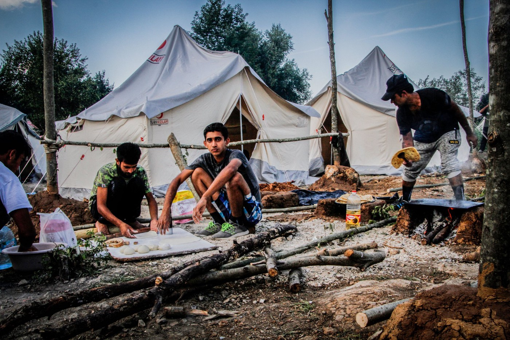
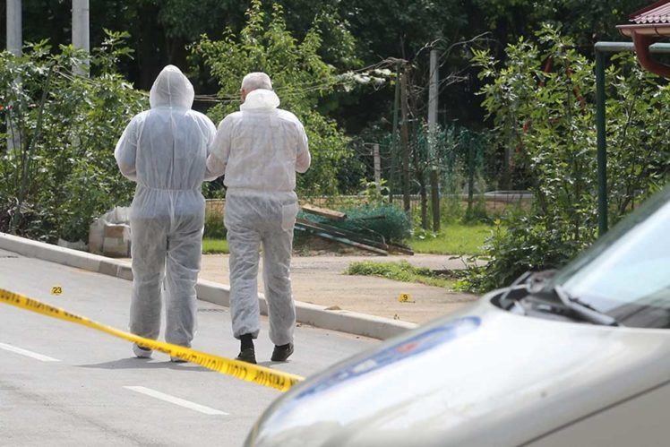
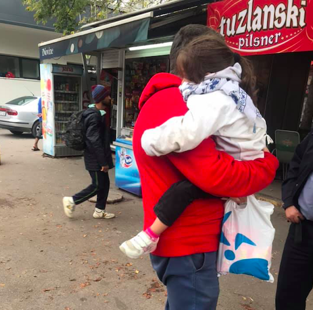
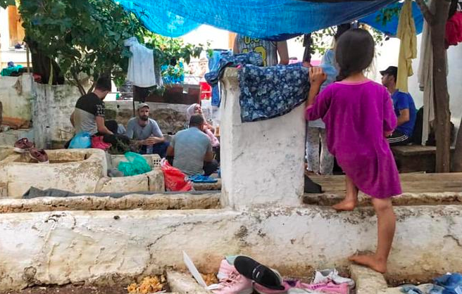
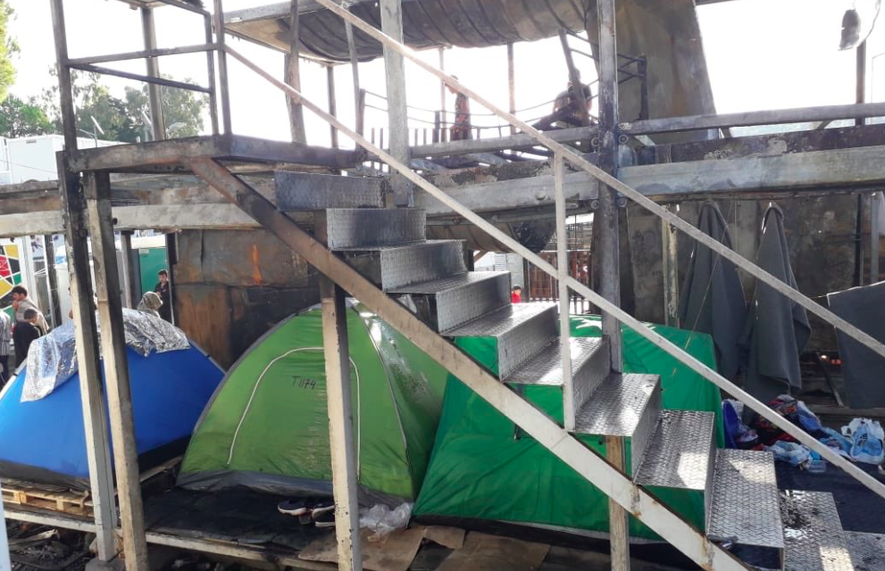
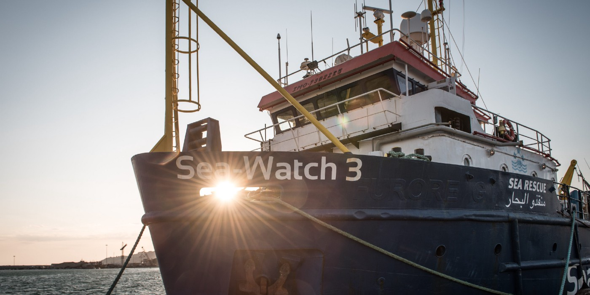
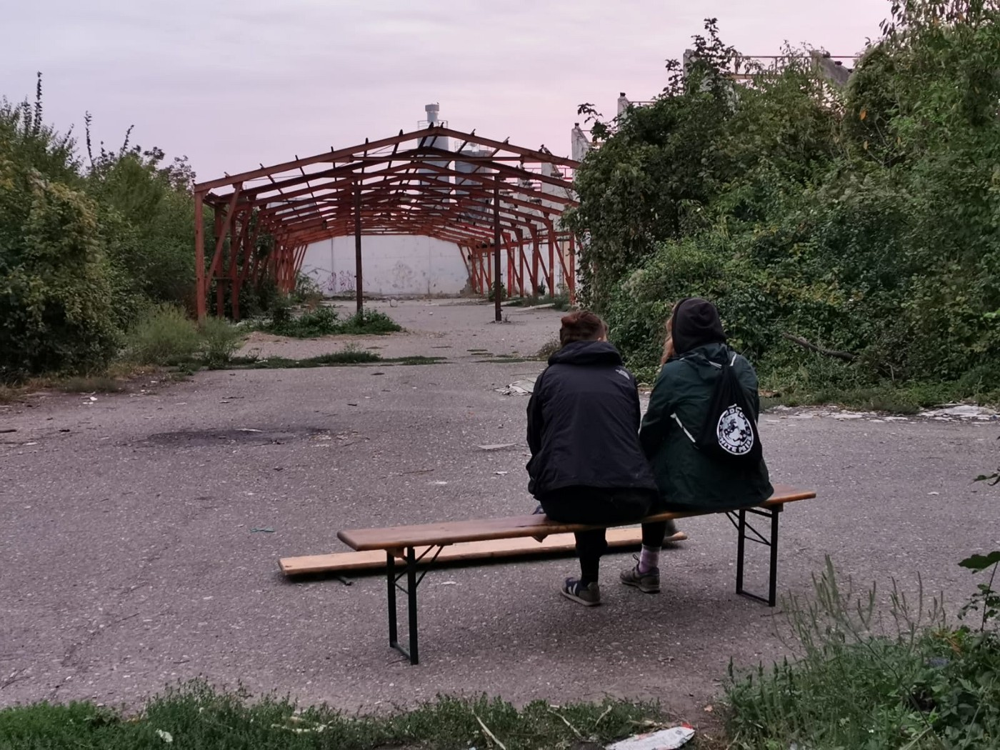

### AYS Daily Digest 9/10/19: Violent refugee deaths on the rise in Bosnia
#### A man was shot by a local villager on Saturday, only a few days after two bodies were discovered in Bosnian rivers // Today, a new body with visible injuries was found in a camp trailer near Cazin // Bosnian police push back a family, two small children left behind // Bulgaria, Greece and Cyprus ask for European support to return people to Turkey: we have the document\! // French speakers, lawyers and psychologists needed on Lesvos /// Montenegro allows Frontex officers to work on its borders // Volunteers and donations are needed in Šid, Serbia //

Refugees in Vučjak camp near Bihać: dehumanised and left with no support\. Photo: Dean Dean
#### Dead man in a trailer: police found injuries on his body

A dead unnamed migrant was found in a camp trailer in the Osmanagići village near Cazin, Northern Bosnia\. His body was transported to the Bihać hospital, where an autopsy will be performed and the cause of death will be determined\. According to the local police, the body had visible physical injuries, but they are not necessarily connected to the cause of death\. Having in mind that many people sustain injuries during violent push\-backs from Croatia, the police claim, it is possible that the man’s injuries are not directly connected to his death\. No further information has been released so far\.
#### Local man claims responsibility for killing a migrant and hiding his body for three days

The case of a dead migrant near Cazin comes only a day after the local villager claimed responsibility for the killing of a migrant near the southern Bosnian border with Montenegro\. Yesterday at 9:30 am, M\.Č\. \(49\) called the police station in Bileća to turn himself in for the murder\. Investigation found that he had killed an undocumented migrant on Saturday evening, and then hid the body in a pit for three days\. According to his description of the crime, a group of migrants found shelter in a house in Vranjska village\. The house belongs to his neighbour, who asked him to take care of it\. After hearing noises and seeing movement in the house, the man grabbed a rifle and walked into the house\. During the frenzy, he pulled the trigger and shot one of the migrants in the face, while the others ran for their lives\. He panicked and hid the body, but later decided to confess the crime\. Ongoing investigation needs to determine if his story accurately describes the crime\.

The investigation aims to confirm details of the murder in Vranjska village near Bileća\.
#### At least two bodies discovered in Bosnian rivers over the past week

Two men, one of them Pakistani and the other allegedly Syrian, have been found dead in the rivers along the Bosnian border with Croatia last week\. One of the bodies may have been in the water for a longer period of time, while the other was in much better condition and could be identified more easily\. A bizarre lack of clothes was visible in both cases: one of the bodies was completely naked, while the other had only his boxer shorts on\. Police removed the bodies, but didn’t disclose any further information about the deaths\. Videos of the bodies have started circulating on social media, and it seems that one of the videos actually describes the third body, but this has so far been unconfirmed\. At this stage, it is impossible to say if the men had any encounters with Croatian police before their deaths, or if they had been engaged in any other form of violence\. However, eyewitnesses claim that visible marks of the violence could be seen on at least one of the bodies\. The rivers are shallow at this time of the year and can be easily crossed, which adds to the concern about possible violent causes of deaths\.
### Bosnian police push back a family, two small children left behind

6\-year old girl reached Tuzla alone, in fever, confused… Photo: Selma Dzafic

An appalling case of neglect happened in Tuzla on Monday: the police pushed back a family, leaving their 6\-year old alone in Bosnia\. The “mistake” was discovered by volunteers, when the girl reached Tuzla with a group of other refugees\. She was feverish, scared and confused\. She was taken to the Duje Reception Center, and IOM got involved to determine where she came from\. Meanwhile, her family desperately tried to return to Bosnia from Serbia, where they were forcibly taken\. Only after her father managed to return to Bosnia was an even worse detail of the case discovered: a three\-year\-old child of the same family ended up alone in Sarajevo, where another group of refugees was caring after her\! The family was reunited today, and no one is being held responsible for endangering the children\.

There are a high number of new arrivals to Tuzla in the last days, up to 200 people are spending the night outside by the bus station\. [The medical team](https://www.facebook.com/medicalvolunteersinternational/posts/995304807478974?hc_location=ufi) is seeing between 40 to 50 patients each day\.
#### Documents revealed
### Bulgaria, Cyprus and Greece ask for European support in clamping down on migration

The non\-paper was presented by the Republic of Bulgaria, the Republic of Cyprus, and the Hellenic Republic ahead of the EU Justice and Home Affairs Ministerial on 7–8 October, with the aim of “sensitizing EU counterparts, as well as the European Commission, to increasing, persisting and clearly disproportionate migratory challenges”\. We have obtained the document that was shared with MEPs and representatives of the European Commission and we’re copying the most interesting parts:
#### “EU\-Turkey deal is essential for managing migration flows”

> “In recent months the attention of EU Member\-States has been mainly focused on the Central Mediterranean, which has been thoroughly discussed at three Ministerial meetings \(Helsinki, Paris and Valetta\) \. **The Eastern Mediterranean route was not properly addressed despite the fact that all relevant reports confirm the increasing, persisting trend of arrivals in this region\.** \(…\) Geopolitical factors, including conflicts in the broader area particularly in Syria, entail that we will most likely see a continuation of this alarming trend in the short to medium term\. The EU and its Member States will have, as a matter of urgency, to be prepared to address this renewed challenge\. \(…\) In this respect, **the EU\-Turkey Joint Statement of March 2016 is essential for managing effectively migratory flows towards the EU and its Member\-States** , and in particular towards Turkey’s immediate neighbors\. Thus, all sides involved need to do their share in order to ensure its successful and full implementation through: \-ensuring effective returns; \-eradicating trafficking networks smuggling migrants to the EU; \-preventing diversion of flows and the establishment of new illegal migrant routes to Europe as a whole\. In this context, **the EU will have to consider positively the allocation of further funds, to those countries of the broader region of the Eastern Mediterranean Route affected by immense migratory flows** \. Further funding should be based on mutually agreed commitments by the EU and the third country concerned\. The principles of solidarity and responsibility, constituting an integral part of our agenda, should be implemented through: **1\) an effective mechanism for relocation of persons arriving to front\-line Member States along all migratory routes, when their capacity is either exhausted or overstretched; 2\) a functioning common European mechanism for returns, which will include effective incentives and leverages for third countries to cooperate on this issue 3\) an adequate support for those countries affected most by this situation** \. In this context, we believe that the situation in the Eastern Mediterranean routeshould be given special attention when negotiating the relevant budget lines in the context of the next Multi\-annual Financial Framework\. We look forward to working closely with the incoming European Commission, which has identified migration as one of its top priorities, as well as with all Member\-States and relevant Agencies involved\. 

Worrying statements presented in the non\-paper are expected to put additional pressure on European policymakers, against the best interest of refugees and migrants arriving in Europe\. We’ll keep on following the diplomatic offensive of Bulgaria, Cyprus and Greece\.
#### Greece
### 389 refugees finally transferred to the mainland from Symi Island

Hundreds were stuck on Symi, with no facilities to accomodate them\. Photo: Rachel Weschen

A navy ship carrying 389 refugees from Symi Island docked at the port of Piraeus today\. The asylum\-seekers, most of them Afghans, were being taken on buses to unspecified facilities on the Greek mainland\. The operation to transfer the migrants to the mainland came in response to an appeal from the mayor of Symi, who said that his island is unequipped to deal with the surge in arrivals from Turkey\. Symi does not have facilities to house refugees, which means that dozens of people were having to sleep in tents or in the open air outside the island’s police station and port authority\. Another group of more than 500 asylum\-seekers were transferred from Symi to Piraeus on Monday\.
### Lawyers and psychologists needed on Lesvos

A total of 15,333 people were counted on Lesvos today\. In Moria alone, a camp designed to host 3,000, there are 13,112 people and new arrivals are counted every day\. Many, including children and people with serious medical conditions, are sleeping on the floor or, if lucky, in summer tents\. Two weeks ago a fire broke out in the camp, killing a woman and her newborn child, and injuring many others\. The camp has not been fixed since then\. Refugees are sleeping in tents under the charred ruins\.

Aftermath of the tragic fire: people live in tents under burnt stairs\. Photo: RSA

On September alone, Fenix Humanitarian Legal Aid supported over 500 people in their office outside Moria and in different community centers on Lesvos, including 40 survivors of torture, 42 cases of sexual violence and over 20 high\-risk medical cases\.

> “There is a sharp increase in the demand for legal aid, and this month only, we had to turn away more than one hundred people\. We are currently recruiting people to join our field team: French speakers, lawyers, psychologists, an administrative assistant and legal assistants\. If you cannot join us in the field, you can apply to join our remote media and fundraising team or make a donation”, Fenix wrote on [their Facebook page](https://www.facebook.com/pg/FenixAid/photos/?ref=page_internal) \. 

### SAR NGOs issue the position paper on the EU Justice and Home Affairs Council

Nine SAR NGOs are advocating for the humane approach in the next phase of European policy\-making, following the mini\-summit in Malta\. Photo: Sea Watch

As opposed to the paranoid narrative of Bulgaria, Malta and Greece, non\-governmental organisations involved in search\-and\-rescue activities in the Mediterranean Sea have jointly shared their considerations and recommendations with the JHA Ministers reuniting in Luxembourg as follow\-up to the mini\-summit of 23 September held in Malta\.

“Establishing a relocation mechanism for people rescued at sea by private ships is secondary to the wider problem of the ongoing severe violations of international human rights law occurring in the Mediterranean area against people who migrate\. These violations are above all put in place through the cooperation of the EU Member States with third countries such as Libya, a country afflicted by a civil war, in which the so\-called authorities are in strict connection with traffickers of human beings, and tortures and inhuman and degrading treatments are usually perpetrated against foreigners, as several Institutional reports denounced in details in last years\. We reaffirm that the opening of legal entry channels from third countries, and humanitarian corridors from countries at war, constitutes the only real way to fight and dismantle smuggler networks in the Central Mediterranean”, they wrote in a statement\. The full document with recommendations can be found [here](https://sea-watch.org/wp-content/uploads/2019/10/PositionPaper_JHA.pdf) \.
#### Serbia
### No Name Kitchen needs volunteers and donations to prepare for the winter

Volunteers take turns to guard the unofficial camp that is often raided by the police\. Photo: NNK

Our partners from the No Name Kitchen are facing difficulties in Šid, a town near the Croatian border, where refugees reside in the unofficial camp\.

> We have nearly run out of winter clothing, sleeping bags, tents and medicines\. In addition, we have been trying to deal for some weeks now with several cases of scabies, which further complicate the situation\. Permethrin — the medicine used to treat scabies — is very expensive and we cannot treat properly all the cases, some of which are really serious due to infections\. On the other hand, the follow\-up of these cases is complicated because people affected by scabies do not come to us to receive treatment every day, given that they usually go out to try their luck in the “game”\. To all this we must add an increasing police presence, implying that volunteers take turns to support these people at all times, NNK wrote\. 

They are asking for donations, both financial and material\. And, equally important, they need volunteers for the coming months, to work in the unofficial camp, cook, distribute clothes and document pushbacks\. And to prepare for the winter which is rapidly approaching\. If you’d like to contribute, you can reach them at info@nonamekitchen\.org
#### Externalisation
### Frontex to be deployed at Montenegrin borders

On Monday, the European Union signed an agreement with Montenegro on border management cooperation between Montenegro and the European Border and Coast Guard Agency \(Frontex\) \. This agreement allows Frontex to assist Montenegro in border management, carry out joint operations and deploy teams in the regions of Montenegro that border the EU, namely at the border with Croatia, south of Dubrovnik\. You can read more about it [here](https://www.consilium.europa.eu/de/press/press-releases/2019/10/07/border-management-eu-signs-agreement-with-montenegro-on-european-border-and-coast-guard-cooperation/?fbclid=IwAR3ZQCKXfXKgydW53XUjBcNVK87aKsoF19-W0D8hNTzLYSy8LF27i0rLifo) \.

**If you wish to contribute, either by writing a report or a story, or by joining the info gathering team, please let us know\.**

**We strive to echo correct news from the ground through collaboration and fairness\. Every effort has been made to credit organisations and individuals with regard to the supply of information, video, and photo material \(in cases where the source wanted to be accredited\) \. Please notify us regarding corrections\.**

**Apart from daily news in English, we also publish weekly summaries in Arabic and Persian\. Find specials in both languages on our [medium site](https://medium.com/are-you-syrious/ays-weekly-in-arabic-and-persian/home?source=post_page---------------------------) \.**

**If there’s anything you want to share or comment, contact us through Facebook, Twitter or write to: areyousyrious@gmail\.com\.**

_Converted [Medium Post](https://medium.com/are-you-syrious/ays-daily-digest-9-10-19-violent-refugee-deaths-on-the-rise-in-bosnia-ca47a1f71a63) by [ZMediumToMarkdown](https://github.com/ZhgChgLi/ZMediumToMarkdown)._
