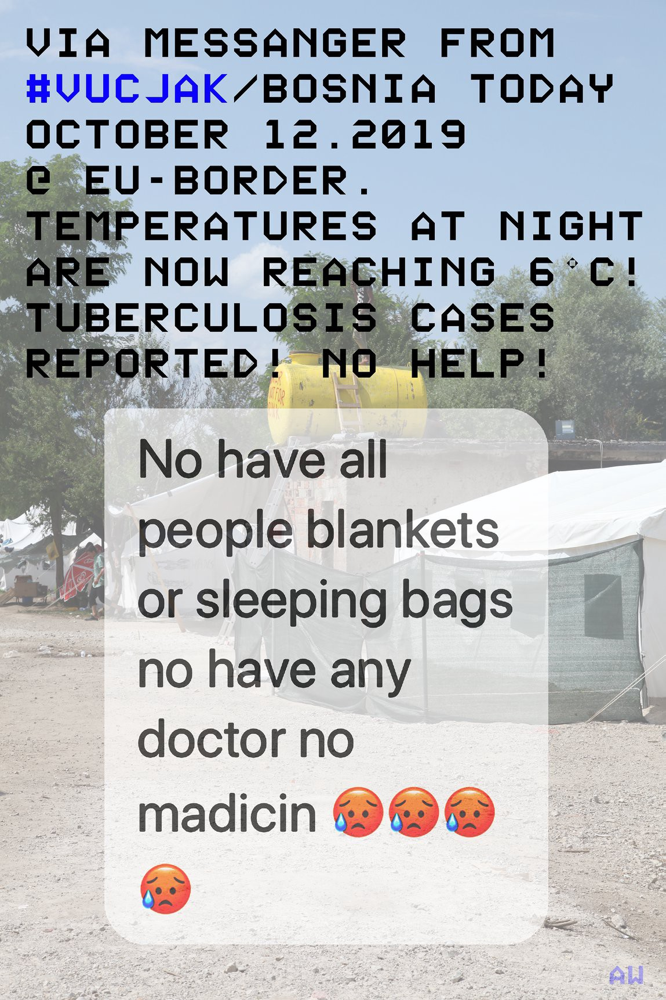

### AYS Daily Digest 11/10/19: Mouldy bread for desperate people stuck in overcrowded camps
#### Sweden re\-evaluating deportation to Syria / poor health assistance to people on the move in BiH / deportations scheduled from Austria / &more news

](assets/8adfeea21532/1*4t4JKpROGwxBYeTOtQDanw.jpeg)

[Elena Depi De Piccoli](https://web.facebook.com/elena.depiccoli?__tn__=%2Cd%2AF%2AF-R&eid=ARDZgDpFm22n2QNbYqcPqEZXpgnP2ivq_7H0LmRh1FJ6okhc0i5XRL2X8hwXL9IQnB-LBSovK4kOipuv&tn-str=%2AF)
### FEATURED

Pictures that were taken by a volunteer in **Vial refugee camp on Chios Island** show completely mouldy bread\. Apparently that bread was distributed to the residents of the camp\. The volunteer also reports about how calmly the residents reacted to it, assuming that they are already used to such inhuman treatment\.

**Aegean Boat Report** speaks of the arrival of at least ten boats, carrying 325 people\. Four boats arrived on Lesvos, one on Samos, three on Chios, one each on Kalymnos and Kos\. Another boat that was heading to Rhodes capsized\. Nine people were rescued by the Turkish Coast Guards and two people managed to save themselves by swimming to the shore\. Three people are still missing and it is feared they were drowned\.

Heavy rain makes living and working harder on the Aegean islands\. Here are the latest calls for aid and action:

> We all need to focus now on getting the camp as ready as possible for the winter months\. 

> The mobilization of these organizations resulted in one of the largest winterization operations so far on the island: 

> ▪️2000 Wooden pallets distributed to raise tents off the ground to protect from rainfall\. 

> ▪️280 Plastic tarpaulins distributed for tents not fit to sustain rainfall\. 

> ▪️Hundreds of meters of rope 

> ▪️Hundreds of hours of volunteer work 

> ▪️12 vehicles 

> ▪️Garbage clean ups 

> ▪️Distribution of solar lights 

> ▪️The purchasing of various tools and equipment in order to safely carry out the work\. 

> ▪️Tens of thousands of Euros have been spent in the last few weeks alone\. 

> Thank you everyone for the collaboration — together we are many\! 

> If you want to support us with a donation, please feel free to do so via PayPal:
 

> [https://www\.paypal\.me/refugee4refugees](https://www.paypal.me/refugee4refugees?fbclid=IwAR0V4cFYG1AlMunzC0PoEUAQSANYnoaBfb4KOrUJyYR1H3ahCTR-vHJ60a0) 

■■■■■■■■■■■■■■ 
> **[NoBorders](https://twitter.com/Refugees_Gr) @ Twitter Says:** 

> > Athens Greece / Prosfygika squat in solidarity with #Rojava #DefendRojava #antireport #Rise4Rojava #Syria #refugeesgr https://t.co/Kgxup4InVh 

> **Tweeted at [2019-10-11 08:42:51](https://twitter.com/refugees_gr/status/1182577290137473025).** 

■■■■■■■■■■■■■■ 

### BOSNIA AND HERZEGOVINA

Apart from the MSF team which has started operations in the northern part of BH, several small self\-organized teams and individuals are working towards providing help to those on the move\.

SOS Team Kladuša is providing basic medical treatment for around 50 people a day, to those who are outside the system, either staying in alternative places around Velika Kladuša or coming back from an attempt to cross into Croatia, with wounds and bruises\. People’s injuries result from police violence, harsh living conditions and long walks\.

In Vučjak, medical assistance is still a big issue\. Recently the volunteer team was kicked out of the ‘camp’\. Officials \(the health minister\) have denied having known the team was providing medical assistance, although they actually visited Vučjak while a doctor from Austria and her team were working on site\. Here is what they posted recently on the current situation there:

> Jasminka Ljubijankic, the Director of the Bihac Health Care Centre said on 18\.06\.2019 that Vučjak “was absolutely unacceptable from the hygienic and epidemiological standpoint… it could host a whole range of health issues which we would not be able to take care of”… But nothing happend except that our team Vučjak which has built up a functioning medical tent and supported the camp for more than 100 days was kicked out without building a sufficient alternative\. — _Arye Wachsmuth_ 

### AUSTRIA

**Refugee Protest Camp Vienna** warns about police controls in search of people from Afghanistan\.

> “Controls \+ arrests at your official home address and school/ German class, Afghan community meeting spots, around Praterstern, Westbahnhof, Meidling, Spittelau and the entire U6\. it even happened in front of Donauinsel mosque on a Friday\.” 

A large\-scale deportation is scheduled for October 15th\. 
The Facebook page gives regular updates on arrests and deportations from Austria\.
### SEA

Today is the 6th Anniversary of one of the Mediterranean’s biggest tragedies\. On October 11th 2013, 268 people drowned after their boat capsized off the coast of Lampedusa\. Many of them could probably have been saved if the Maritime Rescue Coordination Centre had taken their cries for help seriously\. Let us remeber the deceased and continue to fight for the rights of people who are fleeing\.

■■■■■■■■■■■■■■ 
> **[Charlie Yaxley](https://twitter.com/yaxle) @ Twitter Says:** 

> > On this day in 2013, some 200 people lost their lives in a shipwreck off the coast of Lampedusa.

Since then, more than 19,000 desperate men, women+kids have lost their lives trying to reach safety across the Mediterranean.

Our humanity demands we can and must do better https://t.co/jeC0lcXHCm 

> **Tweeted at [2019-10-11 16:47:54](https://twitter.com/yaxle/status/1182699355742101505).** 

■■■■■■■■■■■■■■ 

The **Alan Kurdi** will soon start on its next mission\. This has been made possible by a donation of over 60,000 € from the organization Sea\-Watch to Sea\-Eye, the mother organisation of the Alan Kurdi\. Sea\-Watch’s one ship, the Sea Watch 3, is still blocked from leaving the port of Licata\.

■■■■■■■■■■■■■■ 
> **[Gorden Isler](https://twitter.com/gorden_isler) @ Twitter Says:** 

> > #AlanKurdi kann in die 7. Mission starten. Möglich wurde dies durch eine Spende von @[seawatchcrew](https://twitter.com/seawatchcrew) über 60.000€. Die #SeaWatch3 wird weiter in Licata blockiert. Damit sind wir einsatzfähig und gewinnen Zeit für die Aufgaben der kommenden Wochen.

#SeaEyelovesSeaWatch #Danke https://t.co/5Mc4KMoesz 

> **Tweeted at [2019-10-11 06:58:51](https://twitter.com/gorden_isler/status/1182551115545665537).** 

■■■■■■■■■■■■■■ 

In the morning hours of October 11th one boat arrived on **Lanzarote** \. Nineteen people were arrested\.

■■■■■■■■■■■■■■ 
> **[Txema Santana ✳️](https://twitter.com/txemita) @ Twitter Says:** 

> > Esta mañana llegó una patera a #Lanzarote. Chocó contra las rocas y dos personas resultaron heridas de diversa gravedad. En total, han detenido a 19 personas. Salvo excepciones serán encerrados y aislados en un CIE con el objetivo de expulsarlas. 

#FronteraSur https://t.co/8q4lN8l602 

> **Tweeted at [2019-10-11 16:11:39](https://twitter.com/txemita/status/1182690233017610240).** 

■■■■■■■■■■■■■■ 

### SWEDEN

The Migration Agency announced today that it is likely that they will need to re\-evaluate the safety situation in Syria once again, basically only a week after declaring that they would start looking into the possibility of deporting Syrians as the first EU country to do so\.
As AYS previously reported \(see Daily Digest first of October\) the announcement about deportations came a month after the Migration Agency carried out a new juridical evaluation of Syria, in which they stated that parts of the country are now deemed safe enough to return people there\. One of the agency’s so\-called safe zones was the Hasakah province, which is now under military attack by Turkish forces\.
Find an article in Swedish here:

**If you wish to contribute, either by writing a report or a story, or by joining the info gathering team, please let us know\.**

**We strive to echo correct news from the ground through collaboration and fairness\. Every effort has been made to credit organisations and individuals with regard to the supply of information, video, and photo material \(in cases where the source wanted to be accredited\) \. Please notify us regarding corrections\.**

**Apart from daily news in English, we also publish weekly summaries in Arabic and Persian\. Find specials in both languages on our [medium site](https://medium.com/are-you-syrious/ays-weekly-in-arabic-and-persian/home?source=post_page---------------------------) \.**

**If there’s anything you want to share or comment, contact us through Facebook, Twitter or write to: areyousyrious@gmail\.com\.**

_Converted [Medium Post](https://medium.com/are-you-syrious/ays-daily-digest-11-10-19-mouldy-bread-for-desperate-people-stuck-in-8adfeea21532) by [ZMediumToMarkdown](https://github.com/ZhgChgLi/ZMediumToMarkdown)._
