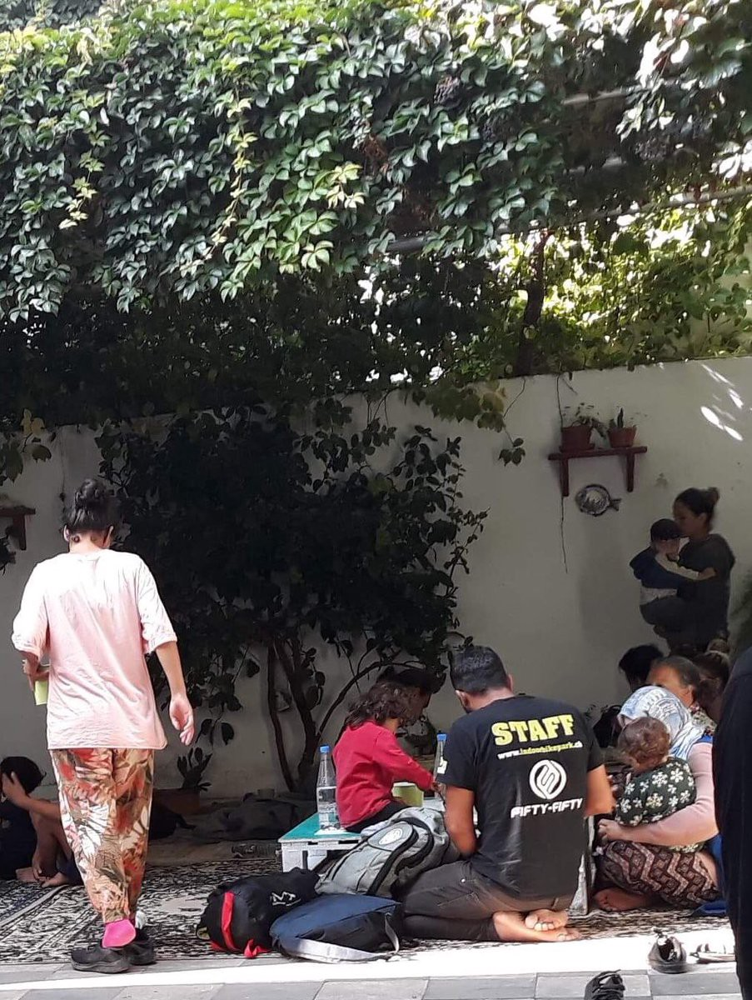

### AYS Daily Digest 15/10/19 The Armed Forces of Malta rescued 75 people

_Update from Samos fire // new arrivals to Aegean islands // 12 bodies found from Lampedusa shipwreck // EU failing to relocated 50,000 by deadline // and more…_
### Sea

A rescue reported by AlarmPhone, who originally were alerted to the possibility that 75 people could drown early in the morning on Tuesday:

■■■■■■■■■■■■■■ 
> **[Alarm Phone](https://twitter.com/alarm_phone) @ Twitter Says:** 

> > We were told by @[Armed_Forces_MT](https://twitter.com/Armed_Forces_MT) that they rescued a boat with 75 people. We assume that it matches to the people who alerted us but we couldn’t yet get a confirmation from the people on the boat as we lost contact to them since 12.21am CEST. 

[maltatoday.com.mt/news/national/…](https://www.maltatoday.com.mt/news/national/98045/malta_requested_to_rescue_75_people_at_sea) 

> **Tweeted at [2019-10-15 14:38:54](https://twitter.com/alarm_phone/status/1184116444080066565).** 

■■■■■■■■■■■■■■ 

■■■■■■■■■■■■■■ 
> **[Alarm Phone](https://twitter.com/alarm_phone) @ Twitter Says:** 

> > @[Armed_Forces_MT](https://twitter.com/Armed_Forces_MT) We can now confirm that the people who called us were rescued &amp; disembarked in #Malta! Still, we condemn the delays in rescue - they could have been lethal. Some of the people are injured &amp; spent several years in detention in #Libya. They now need a free &amp; safe life in #Europe. 

> **Tweeted at [2019-10-15 18:41:49](https://twitter.com/alarm_phone/status/1184177573477134336).** 

■■■■■■■■■■■■■■ 

[One of](https://twitter.com/fladig/status/1184197213452472321?fbclid=IwAR17ri6dwIX_HyOuBOmYqzJ3_UiW1QT0SQzE-P2WDmN6ps-x2OCF52lQEpU) the the small boats that sunk last week \(between October 6th or 7th\) near Lampedusa, was found at the bottom of the sea on Tuesday\. 12 bodies were still on board\. [One mother](https://twitter.com/evaenlaradio/status/1184177160606629888?fbclid=IwAR3_iTqINHzumkfyXBlk6ydofr8sS7qY4F7SBJHMKJbdiupoHt-Qzi-PcuI) was still holding her child\. More bodies could possibly still be around the shipwreck\. Find more reporting [here](https://www.avvenire.it/attualita/pagine/migranti-barchino-affondato-trovati-12-cadaveri) \.

■■■■■■■■■■■■■■ 
> **[MSF Sea](https://twitter.com/MSF_Sea) @ Twitter Says:** 

> > UPDATE: The #medical team onboard #OceanViking did over 60 consultations since Saturday. A number of patients presented with scars which they report to be from physical violence they experienced in #Libya. 4 pregnant women -1 pregnant with twins- are being monitored &amp; are stable https://t.co/Mv2dtqNhJR 

> **Tweeted at [2019-10-15 15:27:39](https://twitter.com/msf_sea/status/1184128713421668353).** 

■■■■■■■■■■■■■■ 

### Greece

**Update on the aftermath of the fire on Samos,** which occurred on Monday, after a fight broke out in the camp\. Thankfully no one was killed, but many people were taken to the hospital for serious burns\. Everyone, [over 6,000 people](https://www.medicisenzafrontiere.it/news-e-storie/news/incendio-nel-campo-di-samos/?fbclid=IwAR0AqYwK5fU4wBIfGc0Zx9FsijGvBN40gwLILDURj1rOxWfA_qOCf5BNlms) , was forced out of the camp to sleep elsewhere and [about 700 tents were destroyed:](https://www.facebook.com/pg/samosvolunteers/posts/?ref=page_internal)

 had to sleep in parks and streets in [\#Vathy](https://twitter.com/hashtag/Vathy?src=hash) after the fire yesterday in [\#Samos](https://twitter.com/hashtag/Samos?src=hash) hotspot\. Dozen of tents have been burned together with blankets, clothes and personal items of the people\. [\#opentheislands](https://twitter.com/hashtag/opentheislands?src=hash) [\#stopthetoxicdeal](https://twitter.com/hashtag/stopthetoxicdeal?src=hash) ” Photos by [RSA](https://twitter.com/rspaegean/status/1184106649641861120?fbclid=IwAR3Mj9oon06Mmt8Hd9lbAauB3jFcMt2WQJx0jRfzmsY-mTBFvIpO-k_biEg)](assets/8008e15df1a6/1*voEleOEr3wnaDJ24249ouQ.jpeg)

As RSA reports: “Many [\#refugeesgr](https://twitter.com/hashtag/refugeesgr?src=hash) had to sleep in parks and streets in [\#Vathy](https://twitter.com/hashtag/Vathy?src=hash) after the fire yesterday in [\#Samos](https://twitter.com/hashtag/Samos?src=hash) hotspot\. Dozen of tents have been burned together with blankets, clothes and personal items of the people\. [\#opentheislands](https://twitter.com/hashtag/opentheislands?src=hash) [\#stopthetoxicdeal](https://twitter.com/hashtag/stopthetoxicdeal?src=hash) ” Photos by [RSA](https://twitter.com/rspaegean/status/1184106649641861120?fbclid=IwAR3Mj9oon06Mmt8Hd9lbAauB3jFcMt2WQJx0jRfzmsY-mTBFvIpO-k_biEg)

[MSF](https://twitter.com/MSF_Sea/status/1184055301839998977?fbclid=IwAR367Ce-smQQhuXr14V1Bf1dAQRhdm862bYHxaKOZpTbtfKBojYvJo1VBN8) “ _is supporting the local hospital by providing interpreters,will provide emergency psychological aid & essential items to people affected by the fire_ \.”

As to the larger picture of what’s needed on [Samos](https://twitter.com/MSF_ITALIA/status/1184110942516371460?fbclid=IwAR08uzETVDQSQyjFoNodq3V4P6VPRCsUG8UQdvjwyh1Z73vJyhXU8StR7Ks) :

> “ On Samos we \(MSF\) have been providing psychological assistance since 2015\. 36% of our patients experience severe symptoms such as depression, post\-traumatic disorders and self\-injurious behavior, aggravated by the inhuman conditions in which they live\.” 

[**Please consider donating what you can to Samos Volunteer’s appeal**](https://donorbox.org/fire-samos-refugee-camp?fbclid=IwAR3wL-a7lcjbJhB4mxnASvpLJrHgWSYEacw5rSyMWxJdwhAst5fWZF_2g9Q) as they support the emergency response on the ground and try to provide back the shelters and tents that were destroyed\. Winter is coming, no one should have to sleep without shelter\.

In a deportations from Greece to Turkey overview, Deportation Monitoring Aegean reports that 7 people were deported; 4 from Lesvos, 1 from Samos, and 2 from Kos\. Learn more [here](https://dm-aegean.bordermonitoring.eu/2019/10/10/deportations-to-turkey-overview-september-2019/?fbclid=IwAR2tlbOTAeGkcG9YM-0cS7wprTPHdDOFJcufQnBM9yLxZJ01pHVDhti7hjM) \.

[According to Aegean Boat Report](https://www.facebook.com/285298881993223/posts/671390800050694/) , 5 boats arrived on the Greek Aegean Islands on Tuesday with 186 people\.

First boat → Lesvos, 48 people \(29 children, 10 women, 9 men\)

Second boat → Lesvos, 39 people \(21 children, 7 women, 11 men\)

Third boat → Lesvos, 44 people \(17 children, 10 women, 17 men\)

Fourth boat → Chios, 24 people \(9 children, 2 women, 13 men\)

Fifth boat → Chios, 31 people \(16 children, 6 women, 9 men\)

■■■■■■■■■■■■■■ 
> **[Lighthouse Relief](https://twitter.com/LighthouseRR) @ Twitter Says:** 

> > Yesterday, we heard tragic news of a boat crossing to the south of #Lesvos capsizing in Turkish waters. One child is confirmed to have drowned and a baby remains missing as search operations are ongoing. More lives needlessly lost due to the EU's failure to implement #safepassage 

> **Tweeted at [2019-10-15 16:31:29](https://twitter.com/lighthouserr/status/1184144774653190147).** 

■■■■■■■■■■■■■■ 

### Italy

[Prisoners](https://hurriya.noblogs.org/post/2019/10/15/caltanissetta-rivolta-e-resistenze-continue-contro-le-deportazioni-nel-cpr-di-pian-del-lago/?fbclid=IwAR0LKS6hE0OwwKNqRbPGfRYy6uT3tzD6GnGJ9YNtcrpGCtmB0dnOwizlldk) at the CPR of Pian del Lago in Caltanissetta, started protesting on Tuesday due to the two deportations to Tunisia scheduled weekly:

> “Approximately 70 inmates around one o’clock in the night began to damage the camp to try to make it useless: demolition separation walls, torn windows, destroyed furniture\. The protest lasted at least two hours and was suppressed by police and carabinieri in riot gear, also resorting to very dangerous tear gas launches in the closed environments of the detention center\.” 

### Bosnia and Herzegovina

[Tuzlansji Volunteers](https://www.facebook.com/permalink.php?story_fbid=109584190457553&id=108916427190996&hc_location=ufi) updated us that 200 people are sleeping without shelter in the streets of Tuzla\. Many refugees all around Europe are homeless, and will struggle this winter without proper shelter\.

 : “Our free shop for migrants is open now\. We are trying to give them clean and new clothes and shoes\.Free shop is open every day 12:00–14:00\.
Unfortunately, we aren’t always able to do that\.
There is always a need of shoes size 39–44 and small trousers like W30/31/32\. Belts would be great because we have none and they alsways ask for that\. And big backpacks \. We also gave a lot of underware size M\. For that we have some more in the big warehouse but i think we run out of that quickly\.
You can donate clothes every day from 15:00 to 17:00 hours to big warehouse\.” Photo by [Tuzlanski volunteri](https://www.facebook.com/permalink.php?story_fbid=109943817088257&id=108916427190996&hc_location=ufi)](assets/8008e15df1a6/1*k6Ox5qvLTdRnNwfKCMEPKQ.jpeg)

In an update from [Tuzlanski volonteri](https://www.facebook.com/Tuzlanski-volonteri-108916427190996/) : “Our free shop for migrants is open now\. We are trying to give them clean and new clothes and shoes\.Free shop is open every day 12:00–14:00\.
Unfortunately, we aren’t always able to do that\.
There is always a need of shoes size 39–44 and small trousers like W30/31/32\. Belts would be great because we have none and they alsways ask for that\. And big backpacks \. We also gave a lot of underware size M\. For that we have some more in the big warehouse but i think we run out of that quickly\.
You can donate clothes every day from 15:00 to 17:00 hours to big warehouse\.” Photo by [Tuzlanski volunteri](https://www.facebook.com/permalink.php?story_fbid=109943817088257&id=108916427190996&hc_location=ufi)
### France

The bodies of 2 young men washed up on the beach of Stella, in the town of Touquet\-Paris\-Plage\. A small boat engine was also found and they are presumed to be from the same boat\. Find out more [here](https://www.ouest-france.fr/monde/migrants/pas-de-calais-un-migrant-de-17-ans-retrouve-mort-sur-une-plage-du-touquet-6564189?fbclid=IwAR0miYFwN094ErsXtudypqWApJC_N6c5d6HkU1gOOXdoS9wbY2ugjHrHGKk) \.

In an update from [First Aid Support Team](https://www.facebook.com/FASTFirstAidSupportTeam/posts/787616218340403?hc_location=ufi) \(FAST\):

> “As winter draws in, the healthcare need in Northern France increases\. The situation in Dunkirk remains grim\. A severe lack of shelter and lack of clean water sources has led to large increase in the number of infections that we see\. FAST is still on the ground, but we urgently need volunteers and donations\. To find out more about how to get involved, and how to donate please see our website [https://www\.f\-a\-s\-t\.eu/](https://www.f-a-s-t.eu/) “ 

### EU

[The EU has failed](https://www.dw.com/en/eu-breaks-promise-of-safe-passage-for-50000-refugees/a-50803664?fbclid=IwAR15bYmkb52mxuBk1jEtxgZ0qwxW599r-vyrmYvOf951sbaQK8XPlscrfQk) to live up to a promise to admit 50,000 refugees by the end of this month\. The EU launched a 2 year resettlement program with a October 31st, 2019 deadline, but only 37,520 people have come to Europe through the program so far\. Many of the people waiting are still in Libya\. Here is a quota of several countries so far:

](assets/8008e15df1a6/1*ZrGDpunrHqptzDRrnDHtvw.png)

Photo by [DW](https://www.dw.com/en/eu-breaks-promise-of-safe-passage-for-50000-refugees/a-50803664?fbclid=IwAR15bYmkb52mxuBk1jEtxgZ0qwxW599r-vyrmYvOf951sbaQK8XPlscrfQk)

**Apart from daily news in English, we also publish weekly summaries in Arabic and Persian\. Find specials in both languages on our [medium site](https://medium.com/are-you-syrious/ays-weekly-in-arabic-and-persian/home?source=post_page---------------------------) \.**

**If you wish to contribute, either by writing a report or a story, or by joining the info gathering team, please let us know\.**

**We strive to echo correct news from the ground through collaboration and fairness\. Every effort has been made to credit organisations and individuals with regard to the supply of information, video, and photo material \(in cases where the source wanted to be accredited\) \. Please notify us regarding corrections\.**

**If there’s anything you want to share or comment, contact us through Facebook, Twitter or write to: areyousyrious@gmail\.com\.**

_Converted [Medium Post](https://medium.com/are-you-syrious/ays-daily-digest-15-10-19-the-armed-forces-of-malta-rescued-75-people-8008e15df1a6) by [ZMediumToMarkdown](https://github.com/ZhgChgLi/ZMediumToMarkdown)._
