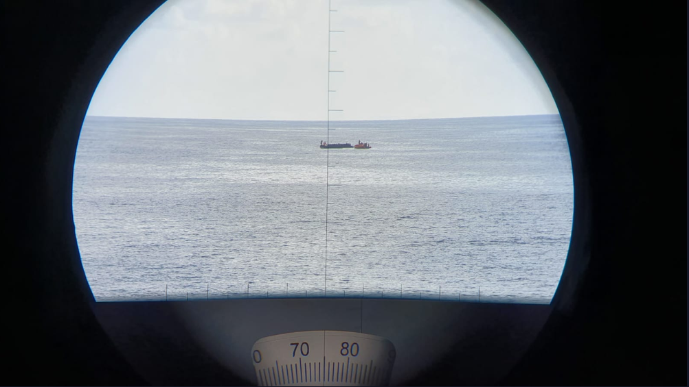

### AYS Daily Digest 18/10/19: Did RCC Malta violate international law by delegating rescue operation in Maltase SAR to Libyan Coast Guards?
#### Alarm Phone reports about presumably illegal operation in Maltese SAR Zone // Alan Kurdi Ship on its seventh mission // Relocation plans for Greek Islands // Demonstrations in Samos and Tripoli, Libya // EU calls for closure of Vučjak camp // Deportations scheduled to Afghanistan and Pakistan from Germany // Update from Dunkirk

Copy rights: MSF Italy

In the night, a dramatic showdown took place in the Maltese SAR zone\. 
Alarm Phone alerted the armed forces of Malta about a boat in distress within the Maltese SAR zone and repeatedly called them in the following hours in order to communicate to them the new position of the boat and ask them to take over responsibility\. Apparently the armed forces were temporarily not reachable\. During the last contact with the boat at 17\.00 CEST, the people on the boat told the Alarm Phone that the boat was leaking\. More than four hours later and still within the Maltese SAR zone, the boat was intercepted by Libyan Coast Guards at 21:32 CEST\.

Post from Alarm Phone:

> “RCC _\[Rescue coordination centre\]_ \#Malta delegated the operation to an EU\-financed militia, which is intercepting people and sending them to a war zone\. Malta is fully responsible for this violation of international conventions — unless the LYCG are going to hand over the people to a vessel going in to a Port of Safety\.” 

■■■■■■■■■■■■■■ 
> **[Alarm Phone](https://twitter.com/alarm_phone) @ Twitter Says:** 

> > BREAKING: so-called Libyan coastguard intercepts boat from Maltese #SAR!
At 21:32 CEST we talked to the coordinating authority, RCC #Malta, who told us that the LYCG had intercepted the boat from Maltese SAR at 34°47’N, 012°37’E - a clear violation of international law! https://t.co/Agh0S6vIOE 

> **Tweeted at [2019-10-18 21:27:18](https://twitter.com/alarm_phone/status/1185306383840878593).** 

■■■■■■■■■■■■■■ 

What has happened has yet to be verified, but if the accusations are true, this is a grave breach of international law by the authorities of a European state\.
### SYRIA

The cease\-fire sponsored by the US presidency has immediately been [infringed](https://twitter.com/benargentieri/status/1185456633784262656) by the Turkish army and the Turkey\-backed FSA\. At least 30 people have been killed in Serekanyie since yesterday\. More [evidence](https://www.amnesty.org/en/latest/news/2019/10/syria-damning-evidence-of-war-crimes-and-other-violations-by-turkish-forces-and-their-allies/?fbclid=IwAR0fd8Sfbe3K2G15mG0iY1JtrKZ7rgUR6Z9QjRuZRwzq114xQ9ucVPD_2ak) has been collected on war crimes against civilians perpetrated by Turkey\. Use of [banned weapons](https://www.thetimes.co.uk/edition/news/turkey-is-suspected-of-using-white-phosphorus-against-kurdish-civilians-in-syria-jp23jmqvv?utm_medium=Social&utm_source=Facebook&fbclid=IwAR2enworJko5KQokMyJsVi0KmehRGBAwutNGyEu_3vY4pGJfvIljvVOUmKA#Echobox=1571354737) \(white phosphorus and napalm\), attacks on civilian convoys, trageting of journalists, [brutalisations](https://southfront.org/turkish-backed-forces-execute-head-of-pro-sdf-syrian-political-party/) , reports of [ethic cleansing actions](https://t.me/rojavaresiste) etc\.

Hundreds of people have been killed and more than 300,000 people have already been displaced so far\.
### LIBYA

A video shows the demonstration held in UNHCR Libya’s Gathering and Departure Facility GDF in Tripoli about which we reported yesterday\. Apparently the demonstrators are the people who fled to the facility after Tajoura detention center, in which they were held, came under fire at the beginning of July and about 53 people died\. Until now the UNHCR has tolerated them, but now they were told that they would not be evacuated and are supposed to leave the facility soon\.

### MORE NEWS from the SEA

The **Ocean Viking** rescued 104 people from a dinghy 50 sea miles off the coast of Libya\. Among them there are 40 minors\.

A boat with nine people on board was intercepted by Moroccan rescue units in the **Strait of Gibraltar\.** Another boat was located in the **Alboran Sea,** carrying 14 people\. 
More about this in Spanish:

The **Alan Kurdi** , the ship of the organisation Sea Eye, has started its seventh operation\. In charge is Captain Bärbel Beuse\.

■■■■■■■■■■■■■■ 
> **[sea-eye](https://twitter.com/seaeyeorg) @ Twitter Says:** 

> > Es ist soweit. Kapitänin Bärbel Beuse legte mit der #AlanKurdi ab. Sie führt das Schiff nun in seinen siebten Einsatz. 

#fairWinds #dontforgetAlanKurdi https://t.co/3wGyLe1TNY 

> **Tweeted at [2019-10-17 22:17:58](https://twitter.com/seaeyeorg/status/1184956744612679680).** 

■■■■■■■■■■■■■■ 

**IOM** has been reporting a worrying increase of the number of girls and women from the Ivory Coast that are landing in Italy\. It is assumed that many of these women are victims of human trafficking for the purpose of labour and sexual exploitation\.

Laurence Hart, Director of the IOM Coordination Office for the Mediterranean:

> “Many are recruited in their country with the promise of being given employment as maids or waitresses and become, instead, victims of domestic servitude upon arriving in Tunisia or Libya, where they are subjected to sexual abuse, mistreatment, violence and deprivation of personal freedom\. This experience is usually followed by a second phase of further exploitation in Europe, organized by traffickers who offer to organize and pay for these women and girls to cross the Mediterranean, with the intent of exploiting them upon their arrival in Italy, or other countries of the European Union\.” 

Find the report here:

### GREECE

The Minister of Citizens’ Protection explained on Thursday that **20,000 people should be relocated from the islands** to the mainland until the end of the year\. This mainly concerns families and apparently they are supposed to be hosted in hotels and accommodation centres\. The initial idea of hosting them on former military facilities has apparently been ruled out\. 
Find an article by keeptalkinggreece:

**Lighthouse Relief’s Child Friendly Space** in Ritsona Camp \(mainland Greece\) is urgently in need of volunteers for the next few months to continue carrying out activities\.

After the fire in **Samos** camp on Monday, people are continuing their protest for better living conditions and free passage\. The camp with a capacity of 680 people is currently holding a total of 5,800\. As we have reported over the past days, many people lost their tents in the fire and are sleeping rough throughout the island\. 

Journalists who were on board report that the **Turkish Coastguard** intercepted 15 boats with 535 asylum seekers on board during the last 24 hours\.
### BiH

The EU, the UN, the Council of Europe and the Commissioner of Human Rights have called for the closure of the Vučjak camp\. The EU condemns the forced transfer of more people to the camp, which is still without any appropriate infrastructure\. Instead, existing facilities should be expanded and new facilities installed in order to host the people from the completely overcrowded camp\. 
Find an article in Bosnian here:

And in German here:

### BALKANS

The Coalition for the Rights and Wellbeing of Forced Migrants along Euro\-Balkan Routes has published a common statement in which the pushbacks along the Balkan route are sharply criticized\. The authors are especially concerned about the fact that these illegal practices are also being carried out against minors\. While they are usually conducted by the border police in night\-time, day\-time actions are increasing\. The Coalition consists of organisations from Serbia, Northern Macedonia, Croatia and Italy\. According to the Asylum Seekers’ Protection and Assistance Centre, a total of 1,256 individual pushbacks to Serbia have taken place in 2019 so far, mainly from Croatia and Hungary\.

> “Due to the scale of inhuman and illicit treatment towards one of the most vulnerable groups of people, such as refugees and migrants, which exceeds experiences from the previous years, it is necessary to make an urgent appeal concerning competent institutions to halt actions in which refugees and migrants are becoming not only victims of smugglers, but also victims of state officials\. \[…\] We appeal to the state institutions to respect their domestic and international laws and to implement them\.
 

> We appeal to the international organizations to strongly condemn same unlawful, violent, inhumane “push\-back” and “denial of access to asylum” practices and to initiate all available mechanisms in order to support the above mentioned governments in taking measures to prevent and stop these practices confronting European civilization values the and values of the time we live in\.” 

Find the full statement in English and Croatian here:

### ITALY

In Agrigento, Sicily, the crew of Sea\-Watch 3 is holding a protest in front of the prefecture to demand the release of their ship\.

■■■■■■■■■■■■■■ 
> **[Sea-Watch International](https://twitter.com/seawatch_intl) @ Twitter Says:** 

> > 📢 Silent against silence: #SeaWatch3 crew is protesting outside the prefecture of #Agrigento for the release of our ship. 3½ months after the impoundment and 1½ weeks after the latest deadly shipwreck, local authorities are still blocking our operation by inaction. #FreeOurShip https://t.co/UtWKEHoSNe 

> **Tweeted at [2019-10-18 12:26:20](https://twitter.com/seawatch_intl/status/1185170243590742017).** 

■■■■■■■■■■■■■■ 

Two boats arrived in the night to Puglia, a city on the Adriatic sea shore\. The boats carried 81 people, most of them of Kurdish\-Iraqi ethnicity\. 
Three autonomous landings took place on Lampedusa\. About 30 people arrived, most of them Tunisians\.
### GERMANY

According to the Bavarian Refugee Council, a deportation flight to Pakistan is presumably scheduled for October 29th and another one to Afghanistan on November 6th\. The council advises all Afghans and Pakistanis without valid residence permits to consult a counselling centre or a lawyer\. They also recommend making sure that the immigration authorities are informed about integration efforts and started apprenticeships\. 
In\-depth information about deportations to Pakistan can be found here in Urdu, English and German:

\(latest update April 2018\)
### FRANCE

Update from the situation in Dunkirk as reported by a volunteer of FAST:
Many people who were evicted and transferred to accommodation centers all over France are returning to the Dunkirk area, as their aim is to cross the Channel\. The police are constantly on the ground, controlling charities’ cars and raiding people who try to find shelter in tents in the forest\. The medical situation is dire as heavy rain causes trench foot\. Respiratory infections like flu and cold are almost impossible to treat as the people have no warm, dry and calm place to go to to recover\. 
The organisations on the ground are happy about any support\.

**Apart from daily news in English, we also publish weekly summaries in Arabic and Persian\. Find specials in both languages on our [medium site](https://medium.com/are-you-syrious/ays-weekly-in-arabic-and-persian/home?source=post_page---------------------------) \.**

**If you wish to contribute, either by writing a report or a story, or by joining the info gathering team, please let us know\.**

**We strive to echo correct news from the ground through collaboration and fairness\. Every effort has been made to credit organizations and individuals with regard to the supply of information, video, and photo material \(in cases where the source wanted to be accredited\) \. Please notify us regarding corrections\.**

**If there’s anything you want to share or comment, contact us through Facebook, Twitter or write to: areyousyrious@gmail\.com\.**

_Converted [Medium Post](https://medium.com/are-you-syrious/ays-daily-digest-18-10-19-did-rcc-malta-violate-international-law-by-delegating-rescue-operation-9b8db1051d0c) by [ZMediumToMarkdown](https://github.com/ZhgChgLi/ZMediumToMarkdown)._
