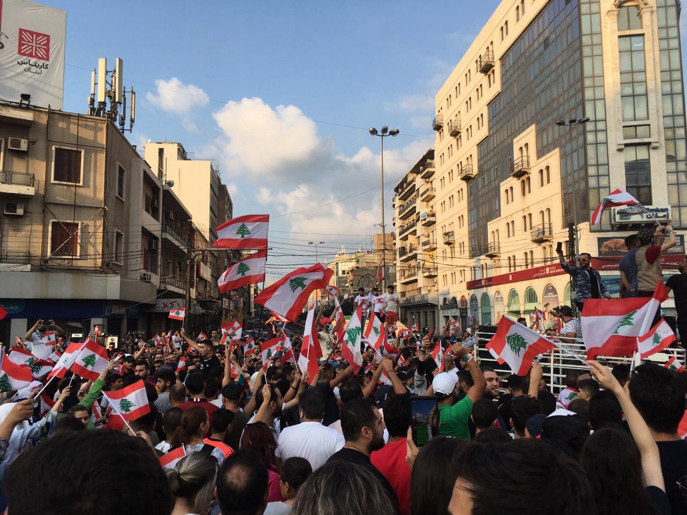
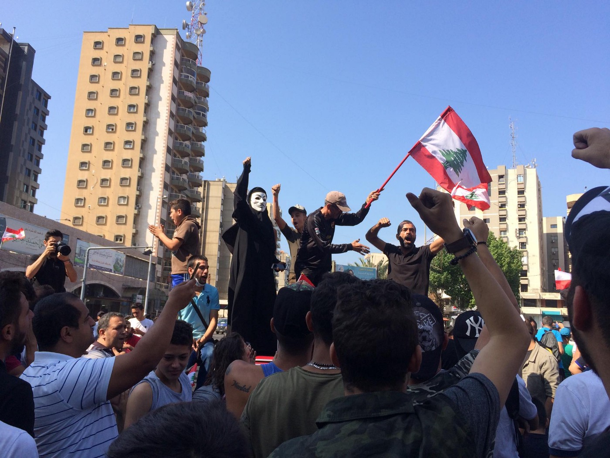
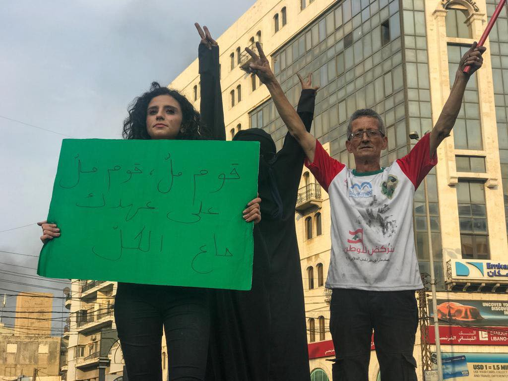
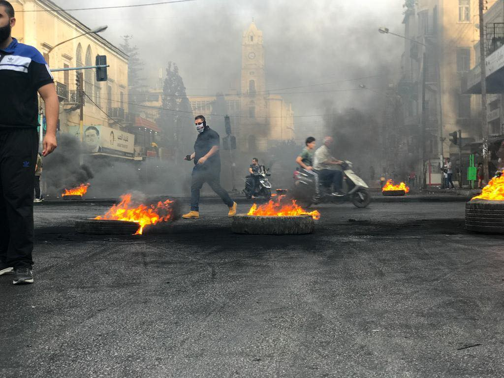
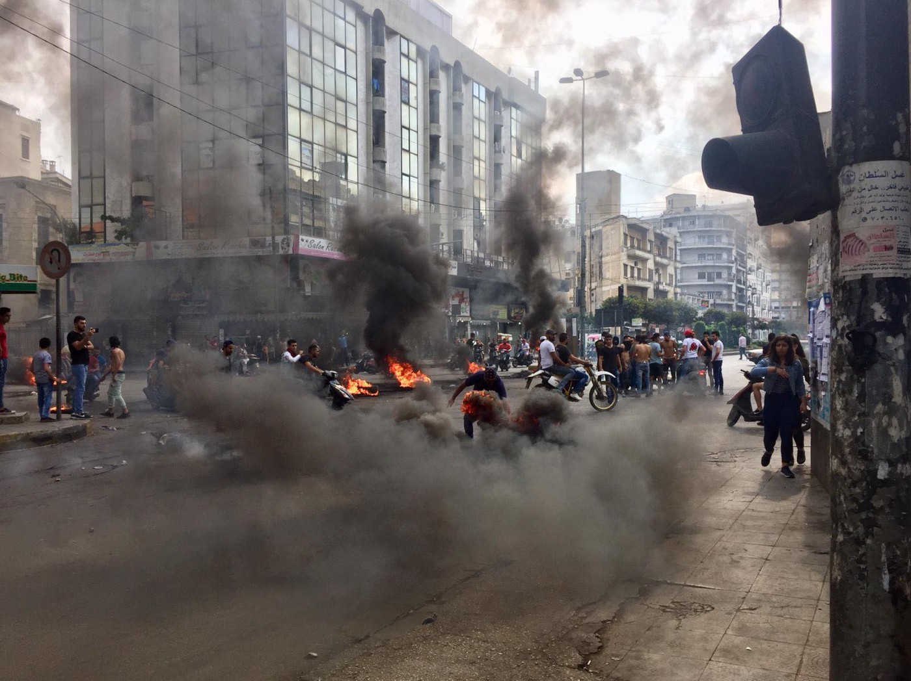
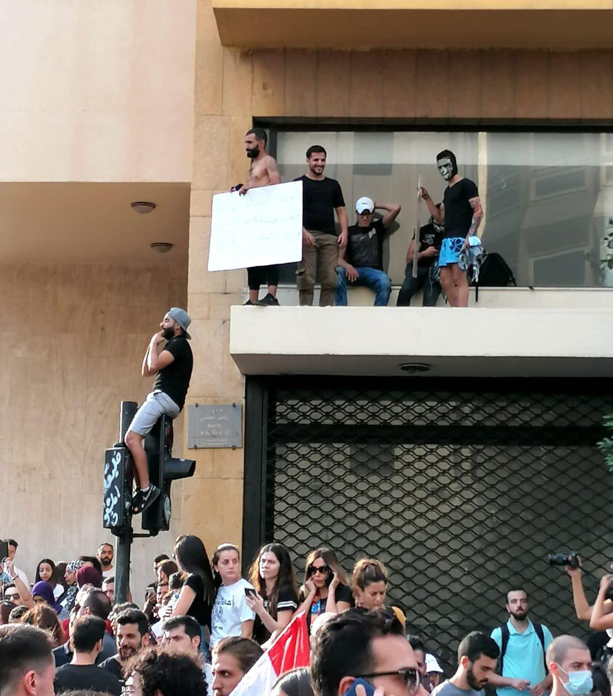

### AYS Special — Revolution in Lebanon

Since Thursday 17th of October [waves of protests have hit the streets of the major cities in Lebanon](https://www.facebook.com/daniele.pagani.35/posts/10157778308567722) \. The response of the police has been to use tear gas and water cannons\. Protests were triggered by a newly proposed tax on Whatsapp calls, usually free, but this was only the latest economic pressure applied to the public: for several months the government had failed to find a way out of the severe economic crisis that hit the country, and proposed instead a series of austerity policies that will only worsen the living conditions of citizens and refugees alike\. Public dept is at a record level and corruption is unrestrained\.

As the army flooded onto the street I was running up, the sound of gun shots filled the smoky sky\. I turned the corner onto yet another backstreet strewn with glass and smouldering tyres\. Ahead of me a young girl, pale and panic stricken, clung to her mother’s arm struggling to breathe\. Groups of young men rode past on motorbikes; faces covered by chequered scarves, chanting Sawra, Sawra, Sawra\. Revolution\.

“She has asthma”, her mother yelled at me\. “Help us”\. We found shelter in a small shop next to a smashed up ATM machine\. Eventually the girl found her breath, clutching her mother’s hand, watching the street burn around her\. They were from Gaza\.

Moments before, bodyguards of a politician opened fire on protesters gathered at Al\- Nour Square in Tripoli, Lebanon\. Protesters dispersed in all directions, taking cover in doorways and behind sandbags that blocked the road\. “Should we run?”, I asked the woman crouched next to me — she was wearing a hijab and also a mask that made the apocalyptic situation even more surreal\. “Stay here”, she replied, “Don’t be afraid”\. We later discovered two people were shot in the unprovoked attack, shot whilst peacefully demanding change from a corrupt and inefficient government\. They are in the hospital fighting for their lives\. The two bodyguards have since been arrested; a small offering of justice\.

The originally peaceful demonstrations erupted on Thursday in the capital Beirut, but turned violent on Friday, when Police clashed with protesters\. Many people were taken to hospital with severe injuries\. Two Syrian workers died when they were trapped in a shop during the riots\. How many more people will lose their lives before politicians open their eyes?

Despite the provoked violence, the protests have united people across the country from all religious groups and nationalities, who have taken to the streets to oppose the ‘regime’\. Living conditions for Lebanese nationals and the many refugees displaced inside Lebanon have been worsening and the economic crisis has reached a peak\. Sparked by the announcement of a proposed tax on Whats App calls, the demonstrators are calling for economic reform\. Lebanon holds the third highest debt level in the world, women die on the doorsteps of hospitals because they cannot afford medical fees, Syrians, Palestinians and Lebanese alike live in makeshift shelters along the highways\. In most garages you will find young children working relentlessly, covered in oil and dust, trying to earn dollars to feed their families\. Rubbish piles up in the alleyways and the toxins from government landfill sites leak into the sea poisoning the coastline and the fishing industry\. Lebanon is in turmoil, and now people are demanding answers from the sectarian government, that has kept them in the shadows for so long\.

We are witnessing the beginning of a revolution that wants to overthrow not only the Prime Minister Saad Hariri but the entire political system that has been dividing Lebanon for so long\. Men and women, Palestinians and Syrians, Sunnis and Shias; all demanding change\.

I left the girl in the shop with her mother and picked up my bike, my head reeling with the images of people scattering like ants as the shots reverberated around the buildings\. Walking away from the square, trying to calm my own breathing now, I spotted a group of young, dishevelled boys running back towards the scene\. In broken Arabic I tried to get them to leave the escalating situation, but they are from Syria and this is what life feels like now\. This is normality\. I recognised one boy, Ahmed, from my street\. He pointed at my bike, and after some negotiation he sat up on the saddle while I pushed the bike back towards our apartment block to safety\. He smiled and laughed, oblivious to the carnage around us\.

Through every window, I saw families huddled around televisions watching live news streams of similar scenes in Beirut and the Bekka Valley where the ‘revolution’ is spreading like the wildfires that savaged Lebanon last week\. I dropped Ahmed off at his house, thinking of the other 1\.6 million Syrians who fled the war to arrive here\. I climbed the eight flights of stairs to my apartment\- of course there was no power to take the lift\. Gunshots rang out over the rooftops for the next half hour and the sky was illuminated\. Taking shelter in my living room away from the window I could still make out the chants from the square in the distance\. Then the city fell silent, just for a moment, until the protests begin again, undefeated until the sun rose\.

Demonstrations continued here across Tripoli on Saturday with a new feeling of celebration and cheer\. Vendors set up their stalls and groups of men and women played drums and sang songs of hope\. Volunteers cleaned the litter from streets and distributed water to protesters setting up tents in the square\. Women brought their children back to the spot where on Friday two people were shot\. In Beirut things turned darker when police used tear gas and weapons to try to control the increasing crowds\. But demonstrators later rejoiced at the news that four ministers from the Lebanese Forces Party had resigned from the cabinet\. Power to the people\! On Sunday morning in Lebanon we wake and count down the hours until Hariri offers his anticipated ‘solution’ by the deadline of Monday, but there is little feeling on the streets that he can be trusted\. People are outraged after Fridays ruthless killings and violence\. But they will not be defeated until their voices are heard\. Until change comes\. Until then Lebanese, Syrians and Palestinians will unite in this moment of history being made\.

_Text and Photos by a volunteer in Tripoli, Northern Lebanon_

**If you wish to contribute, either by writing a report or a story, or by joining the info gathering team, please let us know\.**

**We strive to echo correct news from the ground through collaboration and fairness\. Every effort has been made to credit organisations and individuals with regard to the supply of information, video, and photo material \(in cases where the source wanted to be accredited\) \. Please notify us regarding corrections\.**

**Apart from daily news in English, we also publish weekly summaries in Arabic and Persian\. Find specials in both languages on our [medium site](https://medium.com/are-you-syrious/ays-weekly-in-arabic-and-persian/home?source=post_page---------------------------) \.**

**If there’s anything you want to share or comment, contact us through Facebook, Twitter or write to: areyousyrious@gmail\.com\.**

_Converted [Medium Post](https://medium.com/are-you-syrious/ays-special-revolution-in-lebanon-3c262befb718) by [ZMediumToMarkdown](https://github.com/ZhgChgLi/ZMediumToMarkdown)._
