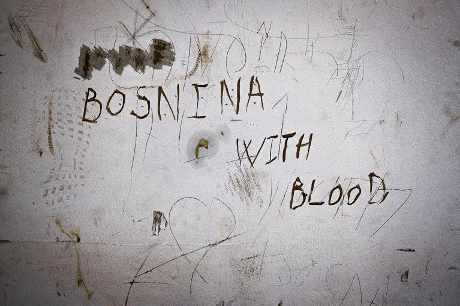

### AYS Daily Digest 21/10/19 NGOs calling joint press conference for disastrous Greek Draft Law on International Protection

_EU susceptible to blackmail with EU\-Turkey Deal and Syrian invasion // lots of news from Samos // 104 people on Ocean Viking // Malta court ruled in favor of migrants for detention length // more human trafficking from Ivory Coast to Europe // evidence showing Croatian police illegally deporting people to BiH // and more…_
### Feature
#### Consider this your open invitation to the joint press conference on the Draft Law on International Protection, happening on Tuesday 29 October \(12:00\) at the Cultural Center of the Municipality of Athens\!

This proposed reform to the Greek asylum system, if passed into law, would have a detrimental impact on human rights of asylum seekers\.

[Amnesty International Greece](https://www.amnesty.gr/news/press/article/22598/prosklisi-se-koini-synenteyxi-typoy-gia-shedio-nomoy-peri-diethnoys?fbclid=IwAR2vNZXgVRoz3snXOswggNMG_zrpI5-m2WoPO_h25eq2Vpq86xumuLI5oTU) , one of the 6 NGOs calling the joint press conference, writes: _“ **The Draft Law was consulted for only 5 days** : this made it impossible to comment on the substance, and unfortunately demonstrated the pre\-emptive nature of the government’s consultation\.”_

[RSA](https://www.facebook.com/refucomm/posts/956650601353409?hc_location=uf) notes that: _“Among other things, the Draft Law restricts many provisions on the rights of applicants and beneficiaries of international protection to the minimum requirements laid down in Union law, despite the explicit possibility of adopting more favorable provisions in the context of the transposition of European Directives\. The organization concludes that the proposed provisions, if voted on, would **lead to the return of asylum seekers without procedural guarantees to unsafe third countries** \.”_

Here is also a [very helpful thread](https://twitter.com/Balkanizator/status/1186401049311141889?fbclid=IwAR0m1Cuo6ymrC566Ks--ZNG6zQWBTWV2O1PJ7m8xMxQMScorlVwDZsCokJs) covering one should check out:

■■■■■■■■■■■■■■ 
> **[Apostolis Fotiadis](https://twitter.com/Balkanizator) @ Twitter Says:** 

> > Thread: (1) New #asylum legislation will be voted tomorrow in the Greek parliament. Here are some points you might find useful to know regarding the process as well the content of the new law. #refugee 

> **Tweeted at [2019-10-21 21:57:07](https://twitter.com/balkanizator/status/1186401049311141889).** 

■■■■■■■■■■■■■■ 

■■■■■■■■■■■■■■ 
> **[Apostolis Fotiadis](https://twitter.com/Balkanizator) @ Twitter Says:** 

> > (4) Including detention of asylum applicants. Appealing the 1st instance decision will require technical legal documentation, effectively meaning being able to afford a lawyer. Up to now a simple request was enough. 

> **Tweeted at [2019-10-21 21:57:08](https://twitter.com/balkanizator/status/1186401053597749249).** 

■■■■■■■■■■■■■■ 

■■■■■■■■■■■■■■ 
> **[Apostolis Fotiadis](https://twitter.com/Balkanizator) @ Twitter Says:** 

> > (5) This way the gov expects to reduce appeals and accentuate deportations. UNHCR is cut out of the second instance (appeal) committees. These will consist only of administrative judges. 

> **Tweeted at [2019-10-21 21:57:08](https://twitter.com/balkanizator/status/1186401054889512962).** 

■■■■■■■■■■■■■■ 

### Syria

In their latest piece entitled, “War, Refoulement and Killing — End the EU\-Turkey Deal\!” Deportation Monitoring Aegean provides this poignant analysis: \( [read the whole piece here\)](https://dm-aegean.bordermonitoring.eu/2019/10/17/war-refoulement-and-killing-end-the-eu-turkey-deal/?fbclid=IwAR29DIX19Lr1FvUMrh6E8sz0gDaSwfna4B8MEijG28W3wI80Z8XC88ZCVPE)

> “Turkey has started a new war, invading North\-East Syria, arguing that they want to set up a “safe\-zone” and to “repatriate” three million Syrians\. Tens of thousands of people started fleeing this “safe zone” area, many died\. Even before this war, Syrians have been sweepingly deported from Turkey into war zones\. 

> This does not stop the EU continuing to deport migrants back to Turkey under the EU\-Turkey Deal, knowingly accepting refoulement and therefore the breach of international law and the death of people in war zones\. 

> While the Turkish state produces refugees, the EU refuses to stop paying the Turkish government to act as the EU’s door\-keeper\. This is not only inhumane but irrational: **the EU has made itself susceptible to blackmail through the EU\-Turkey Deal** \.” 

### Libya

There are some important questions to keep in mind regarding the financing of UNHCR’s endeavorment to evacuate refugees from Libya detention centres, to Rwanda\. Hopefully we can find answers\. [Here is a UNHCR press release](https://www.unhcr.org/en-us/news/briefing/2019/10/5da040054/second-life-saving-evacuation-vulnerable-refugees-libya-lands-rwanda.html) from a recent evacuation from October 11th\.

■■■■■■■■■■■■■■ 
> **[Jeff Crisp](https://twitter.com/JFCrisp) @ Twitter Says:** 

> > Quick questions for UNHCR:
What is the budget for the Libya-Rwanda evacuation programme; what funds have been received so far; and where have they come from?
@[yaxle](https://twitter.com/yaxle) https://t.co/ERGeWBP1vo 

> **Tweeted at [2019-10-21 08:36:42](https://twitter.com/jfcrisp/status/1186199620671721472).** 

■■■■■■■■■■■■■■ 

### Sea
#### A young woman remarked on the Ocean Viking: “It is easier to die at sea than to live in Libya\.”

■■■■■■■■■■■■■■ 
> **[MSF Sea](https://twitter.com/MSF_Sea) @ Twitter Says:** 

> > UPDATE: the #OceanViking has left the Libyan Search and Rescue zone &amp; requested a place of safety for the 104 survivors directly to #Italy and #Malta maritime authorities. https://t.co/fHWvgKEShs 

> **Tweeted at [2019-10-21 14:09:55](https://twitter.com/msf_sea/status/1186283477559382016).** 

■■■■■■■■■■■■■■ 

[SOS MEDITERRANE](https://sosmediterranee.com/press/press-release-it-is-easier-to-drown-at-sea-than-to-live-in-libya-104-rescued-people-onboard-the-ocean-viking-in-need-of-a-place-of-safety-21102019/) reports in their press release the details of the rescue as well as interviews from the survivors on Libya:

> “On 18 October, two days after disembarking 176 rescued people in Taranto, Italy, the Ocean Viking, chartered by SOS MEDITERRANEE in partnership with Médecins Sans Frontières \(MSF\), rescued 104 people from a rubber boat in distress, 50NM off the Libyan coast\. **Amongst the rescued people are 40 minors, of which 30% are unaccompanied, and two pregnant women\.** The boat in distress was spotted by the SOS MEDITERRANNEE’s Search and Rescue team through binoculars\. 

> A 15\-year\-old Ivorian girl first tried crossing the Mediterranean in August with her mother and two younger siblings\. They were at sea for four days and saw two young children and two women die before being intercepted by the Libyan Coast Guard and taken back to Libya, where the whole family was sent to a detention centre\. **‘In there, they do whatever they want to the women,’** the girl told us\.” 

[In some good news,](https://www.abc.es/deportes/vela/otros-derroteros/abci-salvamento-maritimo-recibira-premio-aepn-durante-valencia-boat-show-201910211422_noticia.html) Salvamento Marítimo will receive the Spanish Association of Nautical Journalists annual prize on October 30th\. Always good to hear about sea rescue being recognized for the heroic act it is\!

81 people were rescued on Monday in the Alboran Sea\. There were 44 men, 23 women, 14 minors\. They are being transferred to Malaga\. Learn more [here](https://www.europapress.es/andalucia/malaga-00356/noticia-rescatan-81-personas-patera-mar-alboran-trasladan-puerto-malaga-20191021190834.html) \.

In an [AlarmPhone](https://www.facebook.com/watchthemed.alarmphone/photos/a.1526182797655958/2483194448621450/?type=3&theater) update \( [5 children are on board](https://www.europapress.es/islas-canarias/noticia-localizan-patera-33-personas-bordo-sur-tenerife-20191021094249.html) \):

> “Last Thursday we were alerted to a boat with 32 people in distress in the Atlantic Sea\. They had left on 16 October from Boujdour, Morocco, towards the Canary Islands, Spain…Today, finally, we received news that they were rescued by the Spanish search and rescue organisation Salvamento Maritimo to Spain, after at least 4 days at sea\!” 

[The Libyan Navy](http://en.alwasat.ly/news/libya/261448) is reporting how it rescued 148 people recently\. [Over 7,400](https://twitter.com/MarcoRotunno/status/1186264697403793408?fbclid=IwAR3lIC6uwrqrARHZdqlXcbyTonC5VqWroAbpFKP9MrzIh42OwqIb6lVNNrM) people were intercepted by the Libyan coastguard and returned to Libya so far this year\. There are over 45,000 people registered with UNHCR in Libya\. For more about recent Libyan stats, UNHCR’s info sheet is [here](https://twitter.com/MarcoRotunno/status/1186264697403793408?fbclid=IwAR3lIC6uwrqrARHZdqlXcbyTonC5VqWroAbpFKP9MrzIh42OwqIb6lVNNrM) \.
### Malta
#### A court has ruled that “the detention of migrants for more than 10 weeks on the basis of health laws was unlawful and the migrants should be released\.”

The application was filled by 6 asylum seekers who were detained at the Safi Barracks for 10 weeks longer than the legal limit\.

[Aditus](https://www.facebook.com/aditus.accessingrights/posts/2479762682104480?hc_location=ufi) explains for further developments:

> “Following these judicial pronouncements on Malta’s detention regime, we’ve asked Government to urgently meet us to discuss the future of all other asylum\-seekers illegally detained in Safi Barracks\. We are looking forward to Government’s invitation to meet with us\. The cases were brought by our lawyers and by lawyers from Jesuit Refugee Service Malta\.” 

On Sunday evening, people living in the Hal Far centre started a riot and set fire to five employees cars\. Some are saying that [the riot](https://www.infomigrants.net/en/post/20283/riots-at-migrant-center-in-malta?fbclid=IwAR1bBhM56K38U0dzlWlLPLKzAGTf8UQfzQd96-1iEWQphFYIUnU99bdKhm4) began after a few migrants were banned from entering the centre\. [On Monday](https://timesofmalta.com/articles/view/watch-riot-police-raid-hal-far-migrant-centre-hours-after-major-riot.743712?fbclid=IwAR33MsFd97rH_dlz0fDEhWrYdrEaQMTn5wpOsEowHVv9vX1x9h8TI3RHgkk) , 50 policemen entered with riot gear and over a hundred people were arrested\. [Many factions](https://www.maltatoday.com.mt/news/national/98148/how_did_the_government_Opposition_agencies_and_unions_react_to_Sundays_riot?#.Xa6BWuhKg2x) are disappointed with the response of the police, considering the many people who had no involvment in the riot\.

■■■■■■■■■■■■■■ 
> **[Paolo Biondi](https://twitter.com/PaoloBiondi82) @ Twitter Says:** 

> > @[UNHCRMalta](https://twitter.com/UNHCRMalta) urges @[MaltaGov](https://twitter.com/MaltaGov) to take immediate action in improving the conditions in the centres. While UNHCR understands the frustration and anxiety with the current conditions, resorting to violence can never be a solution. UNHCR encourages dialogue. [maltatoday.com.mt/news/national/…](https://www.maltatoday.com.mt/news/national/98148/how_did_the_government_Opposition_agencies_and_unions_react_to_Sundays_riot?#.Xa3XpZMzYWo) 

> **Tweeted at [2019-10-21 16:09:09](https://twitter.com/paolobiondi82/status/1186313483434024960).** 

■■■■■■■■■■■■■■ 

For more concise representation of recent Malta news and the growing migration crisis surrounding the country, look to [this helpful thread](https://twitter.com/TilleyMarc/status/1186251292223643649) \.
### Greece

New arrivals according to [Aegean Boat Report](https://www.facebook.com/AegeanBoatReport/posts/676542312868876?hc_location=ufi) for Monday: _“At least 10 boats have arrived on the Greek Aegean Islands so far today, 436 people\.”_

First, second and third boats → **Lesvos** \(43 people, 37 people, and 39 people\)

Fourth and fifth boats → **Chios** \(42 people with 20 children, 14 women, 8 men; 30 people with 2 children, 10 women, 18 men\)

Sixth boat → **Kos,** 40 people \(Numbers not confirmed\)

Seventh through tenth boats → **Samos** \(56 people, 45 people, 56 people and 48 people\)

For [ABR’s Weekly Report Oct 14th\-20th, look here](https://www.facebook.com/AegeanBoatReport/photos/a.285312485325196/676502416206199/?type=3&theater) \. Notable stats include: **5,534** were stopped by the Turkish Coast Guard\.
#### More Samos news:

](assets/f3b70e0e1dfe/1*YTvxVVUFm7B6v3m7zVIkOQ.jpeg)

Transfers from Samos\. Photo by [Samos 24](https://www.facebook.com/24samos/photos/a.666172703511307/2405836289544931/?type=3&theater)

**First:** While over 200 people arrived on Monday alone to the island of Samos, [700 people were transferred to the mainland\.](https://twitter.com/PHupfen/status/1186377245214105602?fbclid=IwAR2gIIBCjqQnQfvS5SB5go-6zwhs9PJn3kNI5iVN6_eAuzVkNgIv99RIDx4) Here is a video of over 400 waiting on the platform\. These people leave with uncertain futures awaiting them on the mainland\. Not nearly enough people are being transferred from the the island, where conditions are “life\-threatening”\. What needs to happen should involve:

■■■■■■■■■■■■■■ 
> **[Franziska Grillmeier](https://twitter.com/f_grillmeier) @ Twitter Says:** 

> > #Samos currently hold 6,210 asylum seekers trapped in life-threatening conditions 1. Camps on mainland must be equipped for winter + humane life
2. #refugeesgr must be given opportunity to work + med. care
3. Distribution among other E.U. states 
4. Evacuation of Greek islands 

> **Tweeted at [2019-10-21 10:54:38](https://twitter.com/franzieire/status/1186234331695669249).** 

■■■■■■■■■■■■■■ 

**Second:** There was [a demonstration held by the local citizens](https://twitter.com/ElisaPerrigueur/status/1186273406737637376) of Samos on Monday\. They were trying to emphasize how they realise how unbearable the living in the camp must be and how it’s clearly affecting people outside of the camp\. This comes after the fire in the camp last week, when thousands of people had nowhere to stay besides of the streets of Vathy\. See the demonstration video below:

■■■■■■■■■■■■■■ 
> **[Elisa Perrigueur](https://twitter.com/ElisaPerrigueur) @ Twitter Says:** 

> > Manifestation des riverains de #Samos face à la mairie. “Nous voulons alerter les autorités, Athènes que la situation n’est plus possible, avec le camp. Il faut transférer des migrants”, explique Yanis un employé de l’Opap #Grece #UE #refugies https://t.co/tguRn8igKP 

> **Tweeted at [2019-10-21 13:29:54](https://twitter.com/elisaperrigueur/status/1186273406737637376).** 

■■■■■■■■■■■■■■ 

**Lastly:** A teacher in a local school in Vathy is on trial for telling her students to embrace refugee classmates and ignore any parent’s “xenophobic” attitudes towards refugees coming to their school\. A parent organization is suing her and the court heard the case on Monday\. Learn more [here](https://www.keeptalkinggreece.com/2019/10/21/samos-teacher-refugee-children/) \.
### Italy

64 people on a boat were stuck off the coast of Calabria on Monday and taken to the port of Roccella Ionica\. [Learn more here](https://www.repubblica.it/cronaca/2019/10/21/news/migranti-239097232/) \.
### The Balkans

 aa \(“BOSNIA — THE BORDER ON THE SKIN” PROJECT\) is inaugurated\.
The exhibition is one of the products of the research project “MOBILITY OF MEMORY, MEMORY OF MOBILE\-TY: Western Mediterranean crossings in the XX and XXI Centuries “directed by [Gabriele Proglio](https://www.facebook.com/gabriele.proglio?__tn__=K-R&eid=ARA-2_4n3QBRlBmTgwkD9JrqWaQU77cLGqfsx7SzUrxrQSvOL0-jgWc06n8xWrzyd0BU-EApOZrIMBZP&fref=mentions&__xts__%5B0%5D=68.ARBlDXtzUpb0X0X6JgSeS1_L6GteCXbYYsZlAtFxau_TPOly6stOzd1tyrzPYzELWUlwVBVp-Xae2zLc8bO_u3O1Ya_9dEUbzkHhx1DP4xkY9F96I8ZzZjiktzhGEJ2Ax5nLaM-ugABlSMRAsv9lx2BpgJIvdBq-uIOlsIPX5_FYpawhV9ZBCb7-VZ2ngrO5xfBYk0wY_lWqaJsY3XJoQyEQPXI7qEJOfq0QDUMeYwdS382_1THn9gH-uEiIcUhuHvPx_Rf9KKWBqgN3RGBwja8vsjtN5QMW4EE7NndPXQvA0NETYd3YTrEY7fXnvx3hZ00yK7-8oWzYEXBf76fUy0ESyw) oo\. The aim of the research project is to study human mobility and its memories in the Mediterranean in the twentieth and twenty\-first centuries, analyzing multiple trajectories: those north\-south, colonial and post\-colonial, those between Europe and Africa, transnational and diasporic ones\.” Photos provided by [Altrocioccolato](https://www.facebook.com/altrocioccolatoitalia/posts/3566853053332339?__xts__[0]=68.ARBfQ25R06EjI_YC8bwakkuEzyQlmMFiQ45C_uobi8TDbZjGDCJ7n4cT0_p-2HipcVipBTI09tTiJZRU7Bg68Ju5YkQyy0mMlvv-C5zB4fgJNtGyGZQu39t4jvpFxObCk01NDjsWSL8F4hc2AWLce6yv2ksoDddakt_K39d-Sx-kVXgkeZus13BdRuvM8meXpoWwU1CpMa-t5ufkutpoqtmpg1AJsFGX_w_li9Ftu8pD90CaeQHOo1KULqAYyNDu5429Ng35U-R3KGe061TLco0pnG1nsXtx6iJUtVQgs44cWT9IfZPu3uh1dwKOBdBucZLYJvRIncACBt0ua_oUCazzZw&__tn__=H-R)](assets/f3b70e0e1dfe/1*28B2GGdrwTa8A6HZkASXEw.jpeg)

“ On Friday 25 October at 17\.30 in Piazza Fanti, the exhibition CORPI FUORI POSTO of [Emanuela Zampa](https://www.facebook.com/mrszampina?__tn__=K-R&eid=ARBLqD_NeLCmyFK05QM1AbVBGs8G_sHqgTO-U3eRlphXS5MlBkiVtgsSMPXAbRArTJHkAxjaBnPnF3z6&fref=mentions&__xts__%5B0%5D=68.ARBlDXtzUpb0X0X6JgSeS1_L6GteCXbYYsZlAtFxau_TPOly6stOzd1tyrzPYzELWUlwVBVp-Xae2zLc8bO_u3O1Ya_9dEUbzkHhx1DP4xkY9F96I8ZzZjiktzhGEJ2Ax5nLaM-ugABlSMRAsv9lx2BpgJIvdBq-uIOlsIPX5_FYpawhV9ZBCb7-VZ2ngrO5xfBYk0wY_lWqaJsY3XJoQyEQPXI7qEJOfq0QDUMeYwdS382_1THn9gH-uEiIcUhuHvPx_Rf9KKWBqgN3RGBwja8vsjtN5QMW4EE7NndPXQvA0NETYd3YTrEY7fXnvx3hZ00yK7-8oWzYEXBf76fUy0ESyw) aa \(“BOSNIA — THE BORDER ON THE SKIN” PROJECT\) is inaugurated\.
The exhibition is one of the products of the research project “MOBILITY OF MEMORY, MEMORY OF MOBILE\-TY: Western Mediterranean crossings in the XX and XXI Centuries “directed by [Gabriele Proglio](https://www.facebook.com/gabriele.proglio?__tn__=K-R&eid=ARA-2_4n3QBRlBmTgwkD9JrqWaQU77cLGqfsx7SzUrxrQSvOL0-jgWc06n8xWrzyd0BU-EApOZrIMBZP&fref=mentions&__xts__%5B0%5D=68.ARBlDXtzUpb0X0X6JgSeS1_L6GteCXbYYsZlAtFxau_TPOly6stOzd1tyrzPYzELWUlwVBVp-Xae2zLc8bO_u3O1Ya_9dEUbzkHhx1DP4xkY9F96I8ZzZjiktzhGEJ2Ax5nLaM-ugABlSMRAsv9lx2BpgJIvdBq-uIOlsIPX5_FYpawhV9ZBCb7-VZ2ngrO5xfBYk0wY_lWqaJsY3XJoQyEQPXI7qEJOfq0QDUMeYwdS382_1THn9gH-uEiIcUhuHvPx_Rf9KKWBqgN3RGBwja8vsjtN5QMW4EE7NndPXQvA0NETYd3YTrEY7fXnvx3hZ00yK7-8oWzYEXBf76fUy0ESyw) oo\. The aim of the research project is to study human mobility and its memories in the Mediterranean in the twentieth and twenty\-first centuries, analyzing multiple trajectories: those north\-south, colonial and post\-colonial, those between Europe and Africa, transnational and diasporic ones\.” Photos provided by [Altrocioccolato](https://www.facebook.com/altrocioccolatoitalia/posts/3566853053332339?__xts__[0]=68.ARBfQ25R06EjI_YC8bwakkuEzyQlmMFiQ45C_uobi8TDbZjGDCJ7n4cT0_p-2HipcVipBTI09tTiJZRU7Bg68Ju5YkQyy0mMlvv-C5zB4fgJNtGyGZQu39t4jvpFxObCk01NDjsWSL8F4hc2AWLce6yv2ksoDddakt_K39d-Sx-kVXgkeZus13BdRuvM8meXpoWwU1CpMa-t5ufkutpoqtmpg1AJsFGX_w_li9Ftu8pD90CaeQHOo1KULqAYyNDu5429Ng35U-R3KGe061TLco0pnG1nsXtx6iJUtVQgs44cWT9IfZPu3uh1dwKOBdBucZLYJvRIncACBt0ua_oUCazzZw&__tn__=H-R)

A new report details how Croatian police catch people migrating deep inside the country, then take them illegally to the BiH border\. The anoynomos sources says:

_“When we catch them, we take away their knives, which almost everyone has, cell phones and things like that\. We put that in bags, which they get back when they are released into the woods towards Bosnia and Herzegovina\. We give them everything back — money, cell phones and more, except for knives\. We throw away knives and items that serve injury”_ [Find out more here](https://www.telegram.hr/politika-kriminal/istupio-je-jos-jedan-policajac-koji-tvrdi-da-hrvatska-policija-po-naredbi-sefova-migrante-ilegalno-vraca-u-bih/?fbclid=IwAR1qEv1e0VHK8zrFSxUIgiXE-Qc_dr3pRbgs-QmhoetBRI54FN2DmdiN8no) _\._

](assets/f3b70e0e1dfe/1*MbmrIhZ8MSQJMfxAiP4QIw.jpeg)

“Dear people, We were in front of the house of the European Union today\.
We wrote about the refugee camp camp camp vučjak\. A camp standing in a dump\. Since today people don’t get water nor food… according to the mayor of wrong…This is murder… and we don’t let this stand like that…We hope that camp vućjak will be dissolved… if not we will be committed to these people again…” Photo by [Filis Bilgin](https://www.facebook.com/turkan.bilgin.90/posts/10157747474484287?hc_location=ufi)

Hundreds of Turkish citizens have applied for asylum in Balkan countries after the failed coup of 2016\. This surprising trend comes after increased scrutiny and crack down from Erdogan’s government after the coup\. Follow more [here](https://balkaninsight.com/2019/10/21/unsafe-haven-balkans-sees-rise-in-turkish-asylum-requests/?fbclid=IwAR1KfOhIaWS-3LBTO1W4l3fkafkqoUg-H0Ln0gvp3374QmgZlK43Qo7eR2o) \.
### Europe

[The number of women f](https://www.infomigrants.net/en/post/20273/more-ivorian-women-smuggled-into-slavery-and-sexual-abuse?fbclid=IwAR1tLD4pNS_CBbCqb-0eimu6WSgjqAE7eNdKGwER7tuvniRF8ZxaGuch6MA) rom the Ivory Coast trafficked to Europe is on the rise, IOM warns\. Many suffer from abuse, slavery, prostitution, and often cross the deadly Mediterranean while pregnant from rape\. Laurence Hart, IOM coordinator for the Mediterranean said:

> “Many are recruited in their country with the promise of being given employment as maids or waitresses and become, instead, victims of domestic servitude upon arriving in Tunisia or Libya\.” 

**Apart from daily news in English, we also publish weekly summaries in Arabic and Persian\. Find specials in both languages on our [medium site](https://medium.com/are-you-syrious/ays-weekly-in-arabic-and-persian/home?source=post_page---------------------------) \.**

**If you wish to contribute, either by writing a report or a story, or by joining the info gathering team, please let us know\.**

**We strive to echo correct news from the ground through collaboration and fairness\. Every effort has been made to credit organizations and individuals with regard to the supply of information, video, and photo material \(in cases where the source wanted to be accredited\) \. Please notify us regarding corrections\.**

**If there’s anything you want to share or comment, contact us through Facebook, Twitter or write to: areyousyrious@gmail\.com\.**

_Converted [Medium Post](https://medium.com/are-you-syrious/ays-daily-digest-21-10-19-ngos-calling-joint-press-conference-for-disastrous-greek-draft-law-on-f3b70e0e1dfe) by [ZMediumToMarkdown](https://github.com/ZhgChgLi/ZMediumToMarkdown)._
