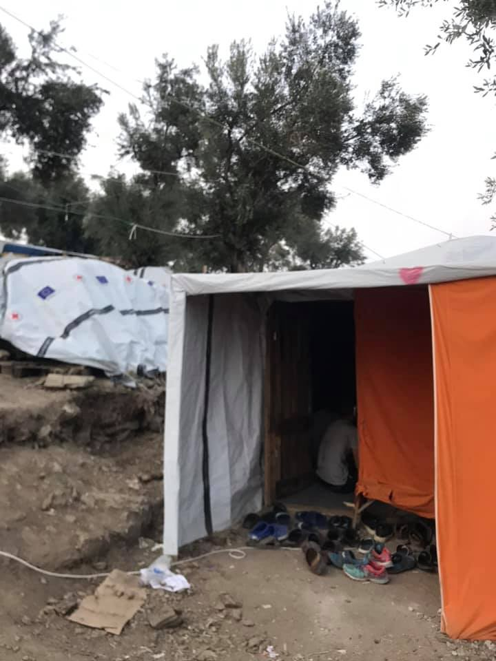

### AYS Daily Digest 22/10/2019 — More than 100 people face charges after riot in Hal Far, Malta\.
#### Nationality\-based limitations lifted for UNHCR in Libya /// Rescue boats back in the Central and Eastern Med /// Critical conditions in reception centre in Bolzano, Italy /// Croatian organisations ask for country’s Schengen membership to be conditioned to human rights respect…

 \)](assets/f7d158cb75ff/1*QsBe28VhI_sakpj6qCaK2w.jpeg)

Already Forgotten\. Yesterday in Porto Empedocle \(Sicily\) 9 more bodies were taken ashore of the 25 victims of the shipwreck occurred on October 7\. “Among them, one baby was found embraced to who could have been his mother\. 3 bodies that cannot be recovered will remain forever at the bottom of the sea\.” \(by [Angela Caponneto](https://twitter.com/AngiKappa/status/1186656177603727360?fbclid=IwAR0iZoQvHW6l59vzjPVFhjAVreel3im54ouggF_X0hB-lEhkWq7zyOqFJ1E) \)
#### Feature story: More than 100 people face charges after riot in Hal Far, Malta\.

As we reported yesterday, on Sunday people living in the receptive structure of Hal\-Far\. The structure encompasses an open centre, with a maximum capacity of 130 people and a tent village, which can host up to 924 people\.

Media report that the riot was triggered when the structure’s personnel refused access to some of the residents because they were drunk\. [Residents of the centre talked instead of abuses and violence\.](https://hurriya.noblogs.org/post/2019/10/21/malta-rivolta-e-incendi-nel-centro-di-detenzione-di-hal-far/?fbclid=IwAR1QQYnfL4co5DMyMAWHBrV7PxFXrvhOzzEKhiRTmauMn0ijsAJgfCgsmDY)

On Tuesday, [80 people were taken to court](https://timesofmalta.com/articles/view/90-migrants-to-be-charged-over-hal-far-riot.743907?fbclid=IwAR3HMSnEX97gY3HKpuhvcfdP9FQVOe4yXAfity2qTcXMem6laOTv354yUJw) and charged with — among other things — assaulting police officers, forming part of a group that staged the riot, setting fire to buildings and vehicles, damaging government property and threatening public order by throwing stones and other objects\. Most of the people denied such accusations, while 16 of them who pleaded guilty, received a six\-week prison sentence\. Among the people taken to court there were minors as young as 14 years old\. 24 more people will be taken to court on Wednesday\.

As Mission Lifeline report, they had to take over food distribution in Hal\-Far, as authorities stopped the service, deciding to starve people as a collective punishment for the riots:

■■■■■■■■■■■■■■ 
> **[MISSION LIFELINE](https://twitter.com/SEENOTRETTUNG) @ Twitter Says:** 

> > Die Essenversorgung für die Flüchtlinge in Ħal-Far haben wir heute übernommen, da #Malta die Menschen hungern lässt als – Kollektivstrafe für ein verbranntes Auto. #Unrechtsstaat https://t.co/Ovk8ptXrQB 

> **Tweeted at [2019-10-22 16:54:00](https://twitter.com/seenotrettung/status/1186687158670761986).** 

■■■■■■■■■■■■■■ 

In the coverage of the riots, very little has been said on the conditions of the centres and the situation for asylum seekers on the islands\. The riot was instead [vehemently criticised](https://www.maltatoday.com.mt/news/national/98148/how_did_the_government_Opposition_agencies_and_unions_react_to_Sundays_riot?#.Xa3XpZMzYWo) by all Maltese political parties\.

Only yesterday, a Maltese judge [ruled](https://twitter.com/TilleyMarc/status/1186251292223643649) on the illegal detention of 6 people in the detention centre of Hal Hafi, where they had been imprisoned for three months since their arrival on the island and despite having applied for asylum, which made their presence on the island “legal”\. They had been detained for “health reasons”, as they were [considered](https://hurriya.noblogs.org/post/2019/10/21/malta-rivolta-e-incendi-nel-centro-di-detenzione-di-hal-far/?fbclid=IwAR1QQYnfL4co5DMyMAWHBrV7PxFXrvhOzzEKhiRTmauMn0ijsAJgfCgsmDY) as potential carriers of dangerous diseases\. Upon their arrival to the island, a medical check\-up was carried out, but the results were not published or communicated to them, leading to the continuation of their detention\.

The faculty of education of the University of Malta [released a press statement](https://www.facebook.com/um.educationfaculty/posts/1291565644349687?__tn__=K-R) , responding to the widespread [anti\-migrant and viciously racist rhetoric](https://timesofmalta.com/articles/view/riot-exposes-maltas-hate-speech-problem.743829?fbclid=IwAR2uPOCq2ppEuWXl77vnHu902QqJ4Go4as62J6VgJHS1Ii6115a7kJvbqBQ) that was triggered by the riot:

> The Hal Far incidents call for people in authority to reflect on the policies the country adopts in relation to migration, including its integration strategies\. Ghettoing people in a particular locality, leaving them in a state of uncertainty, and de facto punishing those who are simply seeking to escape hell or seek a decent life is leading to anger and frustration, which may unfortunately lead to violence\. In this regard we express our sympathy with all victims, whichever side of the barbed wire they find themselves in\. 

> It is high time for all the institutions in Malta to assume responsibility and engage in serious reflection on how to address such situations in the immediate and long term; that confront seriously the concerns of immigrants in Malta, as well as put forward on the international agenda solutions that aim to tackle the problem at source or nearer to its source\. 

> The incidents at Hal Far are an eye\-opener for all, and call for a more thorough, humane and rational response\. As a Faculty of Education, we are appealing to the authorities and others, to engage in constructive and inclusive practices that ultimately benefit both immigrants and locals, and not to allow ourselves to fall into reactionary rhetoric and practices\. As educators, we recognise that Diversity is Strength but at the same time, acknowledge that for diversity to emerge as strength and a resource it needs infrastructures that facilitate integration and inclusivity\. Currently, such infrastructures are for the most part lacking\. 

At the same time, AYS is present on Malta also to take part in meeting representatives of institutions and organisations who are active in implementing integration as one of their focal points in working in the field of culture and cultural heritage\. As a medium to support their efforts, the Erasmus \+ wishes to offer a space to facilitate better and more efficient work in the field of adult education, but also those integration practices that include working with the notion of cultural heritage, that one we encounter when we arrive to a place, our own cultural heritage and the universal heritage we should all carry as humans, individuals and citizens of today’s Europe\. We hope for some fruitful discussions in these 3 days, and a concrete result to follow it\.

We continue following the developments on Malta for those detained and will report more in the next days\.

EASTERN MEDITERRANEAN ROUTE
#### Turkish/Syrian Border

[Turkey and Russia made a deal on Tuesday](https://www.euronews.com/2019/10/22/kurds-will-withdraw-from-turkish-safe-zone-in-syria-after-russia-brokered-deal?utm_medium=Social&utm_source=Facebook&fbclid=IwAR0zbw1wjFh7oYweuQp17Ak4zARbRidE6dlGR-PDP2KecnFylG3ffzkqyEg#Echobox=1571769019) , agreeing on the creation of a “safe zone” along most of the border, from which Kurdish organisations will be removed\. The deal — made over the heads and the lives of those actually living in the area — fosters the cooperation of Assad’s, Erdogan’s and Putin’s governments in creating this “safe zone”\. This comes despite [documented allegations](https://www.nytimes.com/2019/10/22/opinion/erdogan-kurds-syria.html) of demographic engineering \(ethnic cleansing\) in the areas already controlled by the Turkish army\.
#### Mare Liberum back to the Aegean Sea

 \)](assets/f7d158cb75ff/1*YupOfiw8UDkkyrBYxwhZUg.jpeg)

\(Photo Credit: [Mare Liberum](https://www.facebook.com/MareLiberumOfficial/posts/488136968581878?hc_location=ufi) \)

> The aim of our mission is to monitor respect of the human rights in the waters around the island of [\#Lesvos](https://www.facebook.com/hashtag/lesvos?source=feed_text&epa=HASHTAG&__xts__%5B0%5D=68.ARCp6tAe0OJz9Ux2K36px3nx2E_R2skCbTB9cKBB580aoElARyjzyyuSALtGrw3gO_FtKJjq1aOYrfkae7DYtp0jhqPOp0FDDlA1sCZ7DRNdKhkHh5o8gAjODyr-JmER2C1Strk1FfZlQEflDY27iuaiML3crs0IJduGr7te1kn1_moeOXJmZOBhC2oVFU47E2Lg81S4MmbHrc6_TQljlr1KY3CSUsxdYhN7AygT26kBiMscwtvVpzM1G019zuY3ERU7Fh4HkeSxcj1U8Erv3zILKujM-Up4-nCGN_7Q-1LChm4eEEHzq9i7QSFPNYpJolU_0d4u576Ld0ciXPfSkT0&__tn__=%2ANK-R) \.
 

>  We will monitor migrants’ sea crossings from Turkey to Greece — and subsequently, the search and rescue operations conducted by the Greek and Turkish Coast Guards\. 

You can support them [here](https://bit.ly/2qElwxv) \.
#### A Wave of Hope in Moria

 \)](assets/f7d158cb75ff/1*lp3Ws_nkmEs4wrYg3Y9Yow.jpeg)

\(Photo Credit: [Nassim Lomani](https://www.facebook.com/photo.php?fbid=10157593230627497&set=pcb.10157593227917497&type=3&ifg=1&__tn__=HH-R&eid=ARBcNLj7_YETRyUrCzyRar6o5olo8ZoQEvVrQyUMTyKQhTwsffq4Ste4HizhA3-jB1UNmyej3CIIwAJS) \)

[Wave of Hope](https://www.facebook.com/WaveOfHopeForTheFuture/) is a community run project in Moria, created for and by residents of the camp and they have recently opened a new branch in Nea Kavala\. In Moria they run classes for [700 children, women and men](https://www.facebook.com/photo.php?fbid=10157593230627497&set=pcb.10157593227917497&type=3&ifg=1&__tn__=HH-R&eid=ARAWFVTeuIh2yLmF42g8wewEQohX4eWuROUhpRKfje7vFd-GOJZ7g8WkYfMvGcts7DGSTbwIdlVYe1vq) and have a waiting list of 1000 people\! They accept all nationalities and the majority of their teachers are Afghani women\. Despite the terrible situation in the camp and a lack of support from authorities they continue to run two classrooms, one without electricity\.

They are in need of Farsi, Arabic and French books for their library, which can not be easily found on Lesvos, easy readers in Greek and English, and general school supplies\.
#### Volunteer Calls in Greece

Moria, Lesvos

[Drop in the Ocean](https://www.facebook.com/groups/763313107147281/permalink/1923036291174951/?hc_location=ufi) urgently need nurses, doctors and pharmacists from the 30th of October onwards for a minimum of two weeks\.

Vathy, Samos

[Action for Education](https://www.facebook.com/ActionforEdu/) urgently need volunteers from November onwards\. They are looking for experienced teachers, youth workers, and early childhood specialists\.
#### Our House, Athens fear retaliation over exposing racist rhetoric of Neo Democratia politicians

As we previously [reported](https://medium.com/are-you-syrious/ays-daily-digest-4-9-2019-attacked-on-every-front-the-rights-of-refugees-in-greece-6a2e03d3012f) Arash Hampay was racially attacked by Theodoros Giannaros on social media\. As a result the member of Neo Demokratia was forced to step down last month\. However, Our House fears it will not be able to continue it services over the winter as their donations have dropped as a result\. More info [here](https://www.infomigrants.net/en/post/20310/video-iranian-asylum-seeker-faces-racist-threats-for-helping-migrants-in-greece) \.
#### “Croatian Schengen membership should be halted until human rights are respected”

AYS, together with Border Violence Monitoring, Centre for Peace Studies Zagreb, Welcome\! Initiative, Rigardu, Refugee Aid Serbia, Mobile Info Team, Re:ports Sarajevo and Asylum Protection Center APC / CZA, have signed an open letter challenging the decision to admit Croatia into the Schengen Area\.

> Today, Croatia received the green light from the European Commission to enter the border\-free Schengen Area\. While we agree that expanding the Schengen space could be a positive and much\-needed move towards improvement of free movement inside the European Union, Croatia’s Schengen membership should be made conditional on the immediate end to the Croatian Government’s illegal and violent push\-back of migrants\. Such practice at the soon\-to\-become Schengen border not only directly violates provisions of the Schengen Border Code, but represents a violation of international and EU law, including the Geneva Convention on the Status of Refugees\. 

Read the full letter [HERE](croatias-schengen-membership-should-be-halted-until-human-rights-are-respected-6062df8ccb14) \.

CENTRAL MEDITERRANEAN ROUTE
#### Libya: New report on crimes against civilians, UNHCR is now registering all nationalities

Arrivals from Libya have dropped this year, as a consequence of the deals the the EU, and Italy and Malta in particular, have made with the Libyan Coast Guard\. Despite the rhetoric focused exclusively on border protection and migration flows, the situation in Libya has only [worsened](http://IwAR1pA6usbg0wpQ4pz761kQPKT6wc0gPKaAM1rfNrc36yyTURslPazPT9fRQ) \. A new report by Amnesty International “ [reveals](https://twitter.com/matteodebellis/status/1186596564665589760?fbclid=IwAR2uPOCq2ppEuWXl77vnHu902QqJ4Go4as62J6VgJHS1Ii6115a7kJvbqBQ) potential war crimes by both sides, fuelled by supply of weapons in violation of embargo\. Civilians trapped in the cross\-fire, including refugees & migrants ‘contained’ in Libya by EU, pay the price”\.

■■■■■■■■■■■■■■ 
> **[Sally Hayden](https://twitter.com/sallyhayd) @ Twitter Says:** 

> > New Amnesty report on Libya includes this detail about Tajoura dc &amp; the July bombing: that DCIM officials claimed it was necessary to place the detention centre inside a military compound to secure it. 
[amnesty.org/download/Docum…](https://www.amnesty.org/download/Documents/MDE1912012019ENGLISH.PDF) https://t.co/HlhyeqIGw7 

> **Tweeted at [2019-10-22 12:00:22](https://twitter.com/sallyhayd/status/1186613260973465600).** 

■■■■■■■■■■■■■■ 

Read the full report [HERE](https://www.amnesty.org/download/Documents/MDE1912012019ENGLISH.PDF) \.

As [reported](https://twitter.com/cochetel/status/1186692790480187392) by Vincent Cochetel, UNHCR Special Envoy for the Central, people in Libya can now register with UNHCR, without the nationality\-based restrictions so far imposed by authorities\. Previously, they [had limited registration](https://twitter.com/yaxle/status/1186755886347440129?fbclid=IwAR05eSOe4pLgz9RE-uu0A2byz1yfBMdqKHchcJrGBxxTQwNSskz3YPQ2Le8) to a small, select group of nationalities only\.

■■■■■■■■■■■■■■ 
> **[Jeff Crisp](https://twitter.com/JFCrisp) @ Twitter Says:** 

> > And so must the EU's role in putting them there. 

> **Tweeted at [2019-10-22 13:15:17](https://twitter.com/jfcrisp/status/1186632116836208642).** 

■■■■■■■■■■■■■■ 

#### Updates from the central Med

Media [report](https://apnews.com/24b51f7a5aa54441bedb9a04fa9d6b9b) that UNHCR is looking into why the Libyan coast guard entered Malta SAR zone to intercept and return migrants to Libya\. [Not the nearest port, nor a safe port as required by maritime law\.](https://twitter.com/RenataBritoAP/status/1186745265329528833?fbclid=IwAR2t0ZfekstivA3-BK5x05q8oW897CZ0aBRBWmlWPQ9iTQTl-xyX94fJZ4k)

104 people are still onboard [\#OceanViking](https://twitter.com/hashtag/OceanViking?src=hashtag_click) , including 40 minors, of which 30% are unaccompanied\. They were rescued on Thursday October 18\.

■■■■■■■■■■■■■■ 
> **[MSF Sea](https://twitter.com/MSF_Sea) @ Twitter Says:** 

> > 🔴 On board #OceanViking are rescued people who have survived interceptions at sea, forced returns to #detention, and even #shipwrecks. 
Fleur, 22 years old, is one of them. 
We hope she, and all 104 survivors on board, will soon disembark in a place of #safety. https://t.co/Dqe4CdnseY 

> **Tweeted at [2019-10-22 19:30:09](https://twitter.com/msf_sea/status/1186726452730966016).** 

■■■■■■■■■■■■■■ 

In these hours [the Alan Kurdi vessel is in the Libyan SAR zone](https://twitter.com/gorden_isler/status/1186749738818904066) , in a joint mission of SeaEye and Proemaid, and the sailboat Josefa of RESQSHIP is [heading back](https://www.facebook.com/NewsfromtheMed/posts/782494688870796?__tn__=-R) to the Central Med\.

Alarm Phone needs your support to keep up its necessary work\! Running their self\-organised call center, spreading their emergency number in migrant communities and printing their campaign material all comes at a cost\. Please consider donating now [HERE](https://t.co/1lLF5FSlk7?amp=1)

■■■■■■■■■■■■■■ 
> **[Marco Rotunno](https://twitter.com/MarcoRotunno) @ Twitter Says:** 

> > Today @[Refugees](https://twitter.com/Refugees) team welcomed 67 persons rescued by #Asso29 and landed in Pozzallo.

We are hearing of many abuses while detained and extorted by traffickers in #Libya. 

Legal pathways such as evacuations and resettlement would save refugees from harm and long-standing traumas. https://t.co/OteDksyMYk 

> **Tweeted at [2019-10-22 14:20:57](https://twitter.com/marcorotunno/status/1186648639579537410).** 

■■■■■■■■■■■■■■ 

#### Report from Bolzano reception centre

](assets/f7d158cb75ff/1*-DIWUuqWOSURrAWSTZco0Q.jpeg)

CAS ex\-Casa Einaudi \(Bolzano\) — By [Melting Pot Europe](https://www.meltingpot.org/Bolzano-Le-drammatiche-condizioni-dell-accoglienza-al-CAS.html?fbclid=IwAR37b2atFT1nk7XF42VXeTNYgQx1V5seLWf7JT3y0936HSIVm1zqs_e2anU#.Xa9yhr-xWEc)

[Bozen Solidale, SOS Bozen, Antenne Migranti and Melting Pot Europa](https://www.meltingpot.org/Bolzano-Le-drammatiche-condizioni-dell-accoglienza-al-CAS.html?fbclid=IwAR37b2atFT1nk7XF42VXeTNYgQx1V5seLWf7JT3y0936HSIVm1zqs_e2anU#.Xa9yhr-xWEc) received images showing the dramatic conditions of people “hosted” in the reception centre \(CAS\) Casa Ex Einaudi in Bolzano \(north\-eastern Italy\) \. Dozens of people live there\. There are no private spaces for families and the toilets are dirty\. Bed bugs and other insects infest the centre, moving from the un\-repaired broken walls to mattresses and blankets\. Associations asks for an intervention to avoid a further worsening of the situation\.

> How is it possible that a publicly funded centre in one of the richest provinces in Italy is turning into a legalised ghetto that promotes further marginalisation instead of fostering integration? 

WESTERN MEDITERRANEAN
#### Tragedy avoided in the Alboran sea

■■■■■■■■■■■■■■ 
> **[Helena Maleno Garzón](https://twitter.com/HelenaMaleno) @ Twitter Says:** 

> > Tras dos horas de angustia desde que alertaron, bajo una terrible lluvia, y con las fuerzas al mínimo, acaban de ser rescatados por la Marina marroquí. Gracias, handulillah 

> **Tweeted at [2019-10-22 22:13:44](https://twitter.com/helenamaleno/status/1186767620617453570).** 

■■■■■■■■■■■■■■ 

FRANCE
#### Hundreds of refugees are back in Dunkerque

 \)](assets/f7d158cb75ff/1*zFM1uvMujmfhMPgNwuODFA.jpeg)

Dunkerque, northern France \(Photo by [Simon Shaw](https://www.facebook.com/simon.shaw.39982/posts/1308444382696257) \)

As a volunteer [points out](https://www.facebook.com/simon.shaw.39982/posts/1308444382696257) , an “insane pattern persists: young English speakers in northern France desperate to come to the UK to work and contribute — the EU spends millions keeping them out and periodically ‘disperses’ them causing huge distress and weeks later they come back”\.
#### What’s wrong with Europe’s migration policy: a reading suggestion

An interesting thread summarising the reasons behind the inherent unfairness and inefficiency of European asylum system:

Read the whole thread [HERE](https://twitter.com/BaldacciniAnne/status/1186752015193522178) \.

**Apart from daily news in English, we also publish weekly summaries in Arabic and Persian\. Find specials in both languages on our [medium site](https://medium.com/are-you-syrious/ays-weekly-in-arabic-and-persian/home?source=post_page---------------------------) \.**

**If you wish to contribute, either by writing a report or a story, or by joining the info gathering team, please let us know\.**

**We strive to echo correct news from the ground through collaboration and fairness\. Every effort has been made to credit organizations and individuals with regard to the supply of information, video, and photo material \(in cases where the source wanted to be accredited\) \. Please notify us regarding corrections\.**

**If there’s anything you want to share or comment, contact us through Facebook, Twitter or write to: areyousyrious@gmail\.com\.**

_Converted [Medium Post](https://medium.com/are-you-syrious/ays-daily-digest-22-10-2019-more-than-100-people-face-charges-after-riot-in-hal-far-malta-f7d158cb75ff) by [ZMediumToMarkdown](https://github.com/ZhgChgLi/ZMediumToMarkdown)._
