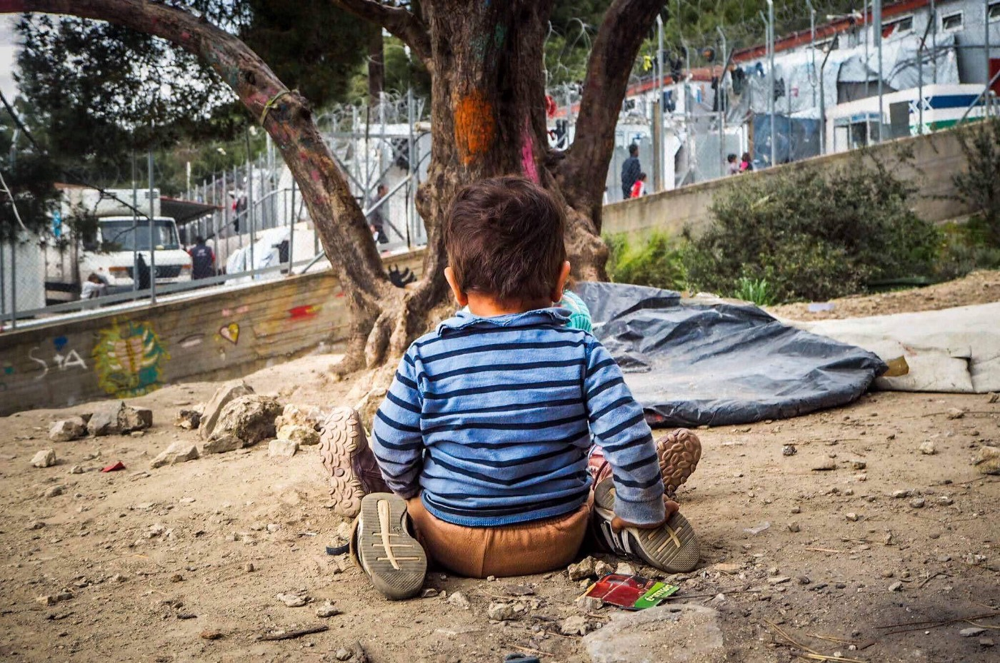

### AYS Daily Digest 23/10/19: Local fascists stop the relocation of 380 people from Samos
#### Fortress Europe causes additional deaths and self\-harm in the UK, Switzerland and Greece//104 people still left ashore//AI expresses concern over extreme charges adopted against three teenagers in Malta//Hotspot in Lampedusa to host up to 439 people//UN condemns Spain for preventing two unaccompanied minors from lodging asylum…

Credit: Samos Volunteers\. May 2019\.
#### FEATURED

Around 380 asylum seekers \(mainly families from Syria, Iraq, Palestine and Afghanistan\) who arrived on the mainland from Samos and expected to be hosted in hotels in the town of Vrasna \(Thessaloniki\), will now be [moved to the island of Evia](https://www.amna.gr/en/article/402378/Change-of-plans-for-asylum-seekers-sent-to-Vrasna--after-local-residents-react?fbclid=IwAR0kVsb5nfVNP7gTNpLIGPqDOXPI67Yzhor-7evlFteyUgdQteaqXEMGkOQ) to find accommodation in bungalows by the sea, as announced by authorities on Wednesday\.
The nine coaches, in which the people were traveling, did not reach Vrasna due to the loud protests of local residents\. Moreover, owners of the different hotels which had originally agreed to host the asylum seekers, refused to open the premises for fear of backlash against their activities\.

As a way to excuse the behaviour of the locals, Ministry sources added that:

> \[…\] the reaction of the residents was understandable, as the municipality of Volvi has already hosts [a number of asylum seekers](http://www.ekathimerini.com/245776/article/ekathimerini/news/villagers-in-northern-greece-block-refugees-from-settling-in-local-hotels?fbclid=IwAR0ebVm0KdMTLEzHrZzYHjewnoPWDf29bHUsahg36DNeDt7anZc5A-ZqyJI) , but clarified that the decision to place them in hotels in the areas was taken after the signing of private contracts with the owners, as it foresees a six\-month stay, which will not have an impact on the tourist season\. 

Though the government’s plan is to re\-distribute people fairly throughout the territory, local representatives have not yet selected the appropriate accommodations for housing people coming from the [overcrowded camps on the islands](https://twitter.com/MarcoRotunno/status/1186921478794760192?fbclid=IwAR3hu1MsDgvMV-My5Xp0fEez6j-wNMmnDOygh6rZNYNc5a-FUTOjUlhzKio) \.

Apart from hotels, the government is also considering “the possibility of turning unused industrial buildings and factories into hosting facilities”\.
#### “Close the borders, they are illegal, send them back”

In the same hours, a new draft bill “on International Protection” was urgently submitted to the Parliament\. The GRC underlines that this new drafted law violates international, EU and national law, specifically concerning the principle of non\-refoulement\.

GRC stated that this new bill will cancel the standard guarantees about the “fairness and effectiveness” of the asylum procedure, “especially given the completely insufficient system of free legal aid and the systemically dysfunctional administration”\. Moreover, appeals against first\-instance decisions will be abolished, increasing the risks of deportations to non\-safe countries, as well as the right to an effective remedy\.

> The imposition of detention is generalized, indiscriminately, even for vulnerable people, victims of torture and violence, the sick, even children, and the automatic judicial review of the decision to impose/prolong detention is hereby abolished, “to relieve the burden of administrative authorities and courts”\. 

Geographic restrictions and the forced application of the principle of the “duties to cooperate” \(with a dysfunctional system\) are among the other problematic and illegal points foreseen by this new bill\.

> Among other things, the following should also be noted: the complete lack of provisions for integration, the attempt to legislate the push of refugees to homelessness, the restriction of the asylum seekers right to labor, the undermining of the right of beneficiaries of subsidiary protection to remain in the country and the violation of the right to family unity for recognized refugees\. 

See original press release [here](https://www.gcr.gr/en/news/press-releases-announcements/item/1285-deltio-typou-gia-to-nomosxedio-peri-diethnoys-prostasias?fbclid=IwAR1GBfGYmI85ji7ME2hSDOEqLDF-KUmCG90R8gf0hiBS5i8spGzmvdHGOj4) \.
#### FORTRESS EUROPE

**_Greece_**
#### Three\-year\-old boy dies after a collision between the boat he was traveling in and a GCG vessel\. Another young man is missing\.

The Mobile Info Team has published information on [the procedure to follow](https://www.facebook.com/mobileinfoteam/posts/2565204090374971) if your residency permit expires before 31 March 2020 and you want to renew it now\.

**_Switzerland_**
#### [A man sets himself on fire in front of the UNHCR premises in Geneva\.](https://www.swissinfo.ch/eng/dramatic-protest_syrian-kurd-sets-himself-on-fire-outside-unhcr-in-geneva/45318408?fbclid=IwAR2AxZoXAHxdZFDvu-3QocFDFaxV9i-nfx__dT4dHPGaMSym5p_Xl7d5PVU)

Even though the reasons for the extreme gesture are still unclear, the man is no longer in critical condition\.

**_UK_**
#### [39 people, including one teenager, found dead inside a truck\.](https://www.dw.com/en/uk-police-discover-39-dead-bodies-in-truck/a-50945513?maca=en-Twitter-sharing&fbclid=IwAR2ATyMy6XfKlwT1kmofVnJeSMiWVpgM4cpQd0qOYoLIk9K68LIwYnwg7kA)

The lorry was stopped in Essex, South\-East of London, after traveling from Belgium, and the driver remains in custody\.

Investigations are ongoing\.
#### CENTRAL MEDITERRANEAN

Italian and European nonsense is going strong, as the Italian government employs the Diciotti vessel \(ICG, at the centre of an [institutional fight](https://www.internazionale.it/bloc-notes/annalisa-camilli/2019/02/18/diciotti-matteo-salvini) between Malta and Italy in August 2018\) to support ENI’s AssoVentinove with 67 people on board and transport them to Sicily, literally bypassing Ocean Viking, [stranded at sea with 104 people for two days](https://twitter.com/sosmeditalia/status/1187041796557344769?s=21&fbclid=IwAR1GBfGYmI85ji7ME2hSDOEqLDF-KUmCG90R8gf0hiBS5i8spGzmvdHGOj4) \.

■■■■■■■■■■■■■■ 
> **[Sergio Scandura](https://twitter.com/scandura) @ Twitter Says:** 

> > Il governo ha mobilitato la Diciotti (urca) per svincolare la nave ENI ⛽ AssoVentinove da 67 naufraghi che aveva al largo di Lampedusa.

21 ottobre, rotta verso Pozzallo, Diciotti passa 'davanti' Ocean Viking bloccata con 104 naufraghi.

Diciotti tornata (ieri) a Catania. Voilà. https://t.co/uKZbn9W2OI 

> **Tweeted at [2019-10-23 16:51:29](https://twitter.com/scandura/status/1187048911493566464).** 

■■■■■■■■■■■■■■ 

Testimonies from the Ocean Viking\.

■■■■■■■■■■■■■■ 
> **[MSF Sea](https://twitter.com/MSF_Sea) @ Twitter Says:** 

> > 🔴 On board #OceanViking survivors have shared direct testimonies of interceptions at sea and forced returns to detention centres in #Libya.
Amadou is one of them. 

We hope #EU governments will act in solidarity and allow him and the 104 survivors to disembark soon to #safety https://t.co/jNjjnozwjN 

> **Tweeted at [2019-10-23 19:07:25](https://twitter.com/msf_sea/status/1187083119993720832).** 

■■■■■■■■■■■■■■ 

**_Malta_**

Three teenagers \(aged 15, 16, 19\) are facing disproportionate charges after being accused by Maltese authorities of hijacking the merchant vessel that rescued them in March 2019\.

The reason of the supposed act was to prevent the boat from bringing them back to Libya, the hell they had just escaped\. Now, the three boys are being judged under counter\-terrorism measures, some of them punishable with life imprisonment\. Mainly, they are charged with acts of terrorism, including seizure of a ship and destruction of properties, illegal arrest, detention or confinement of people\.

> The crimes they are accused of appear to be disproportionate to the acts imputed to them and do not reflect the risks to their lives they would have faced if they’d returned to Libya\. Amnesty International is also concerned about their treatment and access to a fair trial in Malta\. 

For a more detailed account of the case, see [here](https://www.amnesty.org/download/Documents/EUR3312702019ENGLISH.PDF) \.

[A total of 107 people are now being charged with mass riot](https://timesofmalta.com/articles/view/another-27-migrants-charged-with-mass-riot.744162) , after the fights at Hal Far on Sunday\.

**_Italy_**

[Blankets are needed](https://www.facebook.com/SaluzzoMigrante/posts/1154894338051613) in Saluzzo, Piemonte, for field workers forced to sleep rough\.

Interior Minister, Luciana Lamorgese, announced that, by the end of March 2020, [the hotspot in Lampedusa will be able to host up to 439 people](https://www.lasicilia.it/news/agrigento/295737/lampedusa-il-viminale-l-hotspot-sara-ampliato-a-439-posti.amp?__twitter_impression=true&fbclid=IwAR1tgKZWatWRMqhivbdyR4SpuimW1q1mz-FEcfhhIHdel4Kx7Uff-dwgYo0) , including an area designated to accommodate unaccompanied minors and families\.

At the moment, 48 people are staying in the building, including seven women, six of them survivors of the horrible shipwreck that happened at the beginning of October, when [29 people \(so far\) lost their lives](https://caltanissetta.gds.it/articoli/cronaca/2019/10/23/naufragio-di-lampedusa-altri-9-migranti-recuperati-e-tumulati-a-caltanissetta-c1adba5f-def7-4f36-b197-e4560d83c45e/) \.
#### WESTERN MEDITERRANEAN

The UN Committee for the Rights of the Child has [condemned Spain](https://www.eldiario.es/desalambre/ONU-Espana-extranjeros-acompanados-solicitar_0_955754562.html) for not allowing two unaccompanied minors to apply for asylum in the country, as they were wrongly registered as adults by the Prosecutor’s Office, just because they refused to undergo medical tests \(which would have been conducted without a guardian or legal representative\) \. Even though the boys had orderly, original documents, these were not taken into consideration\.

Spain has now to adjust the date of birth of the two boys and grant them the protection recognized to minors, including the right to have a guardian\.

**Apart from daily news in English, we also publish weekly summaries in Arabic and Persian\. Find specials in both languages on our [medium site](https://medium.com/are-you-syrious/ays-weekly-in-arabic-and-persian/home?source=post_page---------------------------) \.**

**If you wish to contribute, either by writing a report or a story, or by joining the info gathering team, please let us know\.**

**We strive to echo correct news from the ground through collaboration and fairness\. Every effort has been made to credit organizations and individuals with regard to the supply of information, video, and photo material \(in cases where the source wanted to be accredited\) \. Please notify us regarding corrections\.**

**If there’s anything you want to share or comment, contact us through Facebook, Twitter or write to: areyousyrious@gmail\.com\.**

_Converted [Medium Post](https://medium.com/are-you-syrious/ays-daily-digest-23-10-19-local-fascists-stop-the-relocation-of-380-people-from-samos-bf399b8a2a7d) by [ZMediumToMarkdown](https://github.com/ZhgChgLi/ZMediumToMarkdown)._
