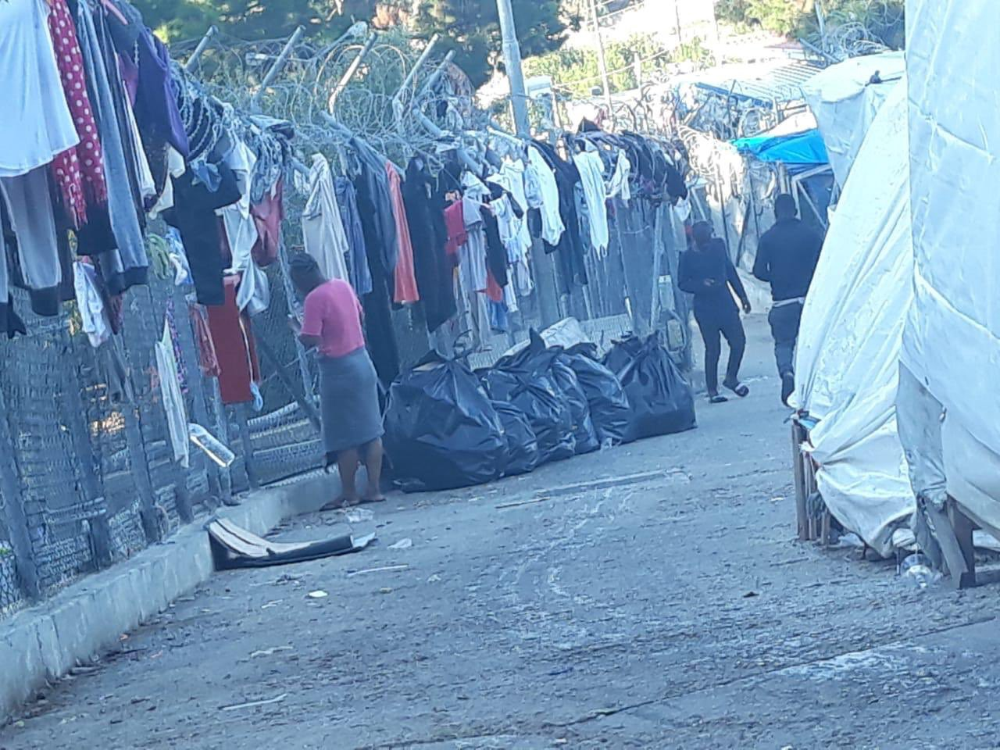

### AYS Special — **Fire on Samos: Engineered Catastrophe**

 \)](assets/a1aa04e93725/1*7_Sf8t8CJHfj3Q9ngXaQ9g.jpeg)

Samos island, December 2018 — The population of the camp was already exceeding 4,000 people \(Photo by [NoBorders](https://twitter.com/Refugees_Gr/status/1072457598702628864) \)

It’s said that the Greek islands are where time stands still\. The waves and the shore, the sun in the sky, old men in the _plateía_ , the stars\. Well, time certainly doesn’t stand still on Samos any longer\.

Over the past two weeks, refugees, activists, volunteers and townsfolk alike have been rocked by a series of convulsions that have created what one long\-term volunteer described to me as, “the toughest conditions I’ve ever seen on Samos”\.

Samos is one of five designated refugee ‘hotspots’ across the East Aegean, the liquid border between Turkey and the European Union\. These hotspots, which also include the islands of Lesvos, Chios, Kos and Leros, were created in 2016 as holding pens for people wishing to claim asylum in Europe\.

The hotspot system means that refugees arriving on Samos are stuck here until their claims have been assessed — a process that often takes a couple of years\. But, with more people arriving on the island than leaving, the system is heading inexorably for failure\.

The official 2011 census put the population of Samos Town at 6,251\. The most recent figures from [Aegean Boat Report](https://datastudio.google.com/reporting/1CiKR1_R7-1UbMHKhzZe_Ji_cvqF7xlfH/page/SfM0) for the town’s refugee population is 6,458 — with 599 arriving in the last week alone\. Meanwhile, the official capacity for the refugee camp is just 648 \(yes, that’s not a typo — six _hundred_ and forty\-eight\) \.

With a camp almost ten times overcapacity and a refugee population to match the town itself, life in Samos is tense\. Everyone is fed up\.

**_The Camp_**

 \)](assets/a1aa04e93725/1*1mo_7XqUyb2oR-6tjABI7A.jpeg)

Vathi Camp, Samos, 6 October 2019 \(Photo by [RSA — Refugee Support Aegean](https://twitter.com/rspaegean/status/1180803294157033472) \)

The official refugee camp and the informal ‘jungle’ shelters that surround it are pitched precariously on the steep slopes above the town\. Conditions are predictably awful; a pattern for refugee accommodation repeated so often across Europe that it’s at risk of sounding ‘normal’\.

There aren’t enough tents to go around, there aren’t sufficient toilets, showers and sanitation, there isn’t electricity or lighting, there are no kitchens or cooking facilities, and nowhere near enough drinking water taps\. Normal\.

Over winter, Samos gets more than twice the rainfall that London does\. The downpour turns the hillside camp into a mudslide\. Worse\. Outside of the official camp, there are few \(if any\) toilets: 6,000 people with little choice but to shit and piss wherever they can\. Every winter, the refugees’ cheap tents are washed away on a tide of mud and piss and shit\.

The recently elected mayor of Eastern Samos, Giorgos Stantzos [well knows these problems](http://www.ekathimerini.com/245189/article/ekathimerini/news/eastern-samos-mayor-warns-of-tinderbox-conditions-as-migrant-inflows-keep-growing) \. But the people I spoke to in the town were far from certain that their leader was helping to solve them\. In fact, some thought he was creating conditions that would lead to catastrophe\.

**_The Attack on NGOs_**

On Samos, there are a dozen or so refugee support organisations who do almost all the work necessary to give refugees some hope of a future on planet earth, let alone in Europe\.

There are organisations that offer legal advice, others that hold language classes in Greek, English, German, French, Farsi and Arabic; some that cook and serve food \(the less said about the food provided by the camp the better\), others that put on fitness classes for kids and adults\.

These solo volunteers, grassroots organisations and larger NGOs exist only so long as the local Greek authorities, led by Mayor Stantzos, turn a blind eye\.

At 9\.30am on Friday 11 October, representatives of every branch of local government — the mayor’s office, the police, the health service, the fire department, building regulators and the tax office — marched en masse into the offices, kitchens, warehouses and schoolrooms of the various refugee support organisations on the island\.

_Do you have this certificate? Do you have that invoice? Where are this man’s papers?_

These organisations, funded by hundreds of small\-time donors like you and me, face the threat of gargantuan fines upwards of €10,000 for the slightest infraction — a missing invoice for tomatoes or a building certificate they didn’t realise was \(or has mysteriously become\) necessary\.

Needless to say, the cost of such fines would be unbearable\. Then who will teach Greek, English or German? Who will show a path through the asylum labyrinth? Who will feed the hungry?

It was an overwhelming display of power\. Not, you’d have thought, the actions of an administration that wants the best possible care for the refugees in their fiefdom\.

**_The Catastrophe_**

■■■■■■■■■■■■■■ 
> **[MSF Sea](https://twitter.com/MSF_Sea) @ Twitter Says:** 

> > Half of the 6,000 people who are stuck in #Vathy camp on #Samos are women and children. This nightmare must end! Children and other vulnerable people must be evacuated from the Greek islands to safe accommodation. https://t.co/uxlL6Fm5As 

> **Tweeted at [2019-10-14 21:33:58](https://twitter.com/msf_sea/status/1183858508464295937).** 

■■■■■■■■■■■■■■ 

Then, last Monday 14 October, a fight broke out in the queue for food at the camp\. The usual story: frustration exploding into violence over long waits and crappy meals\. [Three Syrian men were stabbed in the fight and taken to hospital\.](http://www.ekathimerini.com/245532/article/ekathimerini/news/four-arrested-in-connection-with-violence-at-samos-facility)

That night, Afghan and Arab refugees started throwing improvised ‘gas bombs’ at each other\. The fire department were called, but, according to eyewitnesses, stood idly by as the fire ripped through the camp, turning tents and shelters into ash and [making hundreds homeless](https://www.reuters.com/article/us-europe-migrants-greece-samos/second-greek-migrant-camp-in-flames-as-arrivals-continue-to-rise-idUSKBN1WU1WS) — even more homeless, if it is possible, than they were before\.

The police told refugees to abandon the camp and go down into the town, where they were looked after by — who else? — the NGOs who’d been the subject of such official hostility only days before\.

And the Mayor? His response was to close the schools in the town\. One Samos resident I spoke to was furious at his actions: ‘What message does that send to people? “Be scared\!”’

Mayor Stantzos didn’t start the fight and he didn’t start the fire\. He only inherited this Herculean, Sisyphean and certainly thankless task [in June, just as refugee arrivals were rising again](https://www.yahoo.com/news/greek-road-trip-migrant-issue-looms-large-weary-094935331.html) \.

The Mayor is very careful to point the finger of blame for the disaster at the Greek government and the European Union\. But by shutting down the schools and launching a bureaucratic assault on grassroots refugee support NGOs, he is at least contributing to an atmosphere of catastrophe\.

And perhaps, when neither Athens nor Brussels will listen to anything but the most lurid headlines, a catastrophe was exactly what the island needed\.

Everyone saw how [last month’s deadly fire on Lesvos](https://www.theguardian.com/world/2019/sep/30/riots-at-greek-refugee-camp-on-lesbos-after-fatal-fire) resulted in quick transfers to the mainland\. Is it any surprise that some might see chaos as their only chance for peace?

**_The Hunger Strike — and Open Cards_**

 \)](assets/a1aa04e93725/1*jerLNxv9SAnjlSMBus3I6w.jpeg)

Protest in Vathi, 18 October 2019 \(Photo by [Noborders](https://twitter.com/Refugees_Gr/status/1185122186618703872) \)

In the days after the fire, refugees from Africa started blockading the food distribution in the camp in protest at — well, in protest at just about everything\.

On Saturday, the blockade was broken when the camp authorities started handing out the precious ‘open cards’ that would allow some refugees — mainly single women and families — to leave Samos and travel to Athens and the mainland\.

Grimly, the catastrophe has ‘worked’\.

The distribution of ‘open cards’ — they’re actually just stamps on refugee documents — is a step forward\. [Migration ministry secretary Manos Logothetis has said](https://www.reuters.com/article/us-europe-migrants-greece-samos/greece-moves-more-migrants-to-mainland-as-arrivals-increase-idUSKBN1X10PG) that, by the end of this week, 1,000 people will have been transferred off the island\. [On Monday, 700 refugees did indeed leave Samos](http://www.ansamed.info/ansamed/en/news/sections/generalnews/2019/10/21/migrants-700-transferred-off-samos-to-greek-mainland_01d92105-1836-4036-9d0e-1fc9a6160a04.html) — but on the same day [200 arrived on boats from Turkey](https://www.dailyinterlake.com/article/20191022/AP/310229927) \.

This is what passes for good news on Samos\. The reality is that even the transfer of as many as 1,000 people only rolls conditions back to how they were in March, beyond the point when [aid groups were already warning of a “humanitarian disaster”](https://www.theguardian.com/global-development/2019/feb/22/greece-races-to-move-refugees-from-island-branded-new-lesbos-samos) \.

The reality is that life on the mainland is rarely much of an improvement for most\.

Every time I visit the margins of the union we’ve created, my opinion becomes ever more certain: there can be no resolution to this crisis until Europe implements a sensible policy of open borders and freedom for all to work\.

Text by [_David Charles_](https://davidcharles.info/) _, 23 October 2019 — edited on 25 October 2019_

**Apart from daily news in English, we also publish weekly summaries in Arabic and Persian\. Find specials in both languages on our [medium site](https://medium.com/are-you-syrious/ays-weekly-in-arabic-and-persian/home?source=post_page---------------------------) \.**

**If you wish to contribute, either by writing a report or a story, or by joining the info gathering team, please let us know\.**

**We strive to echo correct news from the ground through collaboration and fairness\. Every effort has been made to credit organizations and individuals with regard to the supply of information, video, and photo material \(in cases where the source wanted to be accredited\) \. Please notify us regarding corrections\.**

**If there’s anything you want to share or comment, contact us through Facebook, Twitter or write to: areyousyrious@gmail\.com\.**

_Converted [Medium Post](https://medium.com/are-you-syrious/ays-special-fire-on-samos-engineered-catastrophe-a1aa04e93725) by [ZMediumToMarkdown](https://github.com/ZhgChgLi/ZMediumToMarkdown)._
