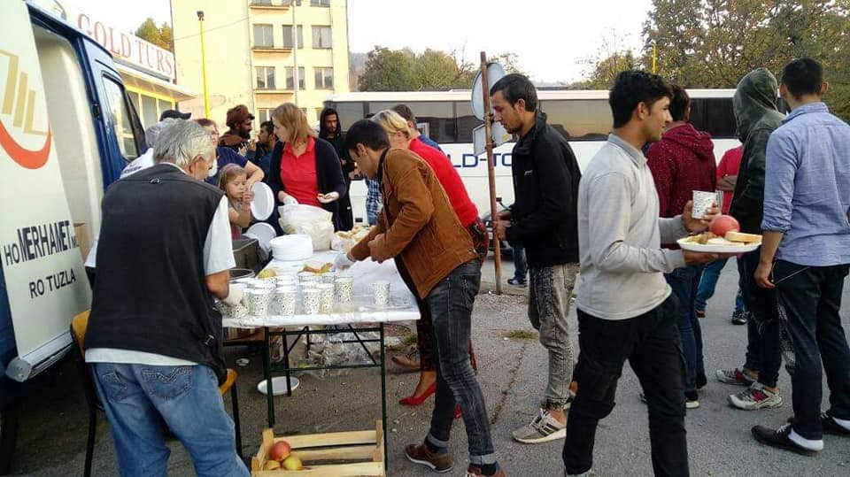

### AYS DAILY DIGEST 24/10/2019: Proposed legislation further endangers people in Greece

_Grassroots support in Tuzla, Bosnia // Increased collaboration between Italy and Libya_
### GREECE

Amnesty International, among others, have condemned proposed legislation in Greece that aims to gut support for asylum seekers in Greece\. The bill was proposed on October 16th and amends the law on international protection there\. In spite of the promise to allow public review of the legislation, the government offered a laughably short timeline \(around five days\) for review and are pushing forward\.

The main concerns highlighted by Amnesty International and others include the following:
- Asylum\-seekers with PTSD will lose classification as “vulnerable\.” Presumably this is due to the fact that individuals who are vulnerable have additional protection mechanisms at their disposal\. By stating that people with PTSD are not entitled to protection as “vulnerable” people, this not only eliminates the need to provide adequate support, but also removes grounds preventing their deportation/return\.
- “Accelerated border procedures and safe ‘third\-country’ lists,” which are also both ways to accelerate the return of people to potentially dangerous situations based on the assumption that a country is “safe enough” in general, often ignoring unique circumstances faced by the asylum seeker\.
- The bill puts the onus of requesting information regarding the reason for a negative response for asylum request upon the asylum seeker\. Furthermore, asylum seekers must “comply” with authorities throughout the whole procedure lest their noncompliance be grounds for considering their application as “unfounded\.”
- Removing immediate access to social benefits and the labor market\. Once an asylum seeker had submitted their request, they had access to these things\. Now, they must wait six months\. How?
- Furthermore, admissibility interviews under the new legislation could now be conducted by members of the Greek army or police\. These entities are not qualified to do asylum seeker screening\.

For the full report, go [here](https://www.amnesty.org/download/Documents/EUR2512782019ENGLISH.pdf) , but this is a deeply dangerous step\. Follow for more information\.

An accessible summary of the critiques can be found in this helpful [thread](https://twitter.com/adrianatdn/status/1187392425360318465?s=21) \.

The Mayors of Crete have agreed to take in 400 refugee children, according to reports\.

All of the children are unaccompanied minors currently in squalid island camps and will be put in groups of thirty\. There is no information on the conditions in which they will be housed\. For more, go [here](http://www.ekathimerini.com/245813/article/ekathimerini/news/crete-mayors-agree-to-take-in-400-refugee-children) \.
### BOSNIA

Tuzla Volunteers in partnership with Merhamet continue to feed the hundreds of people passing through or waiting\. Volunteers stated that authorities showed up for a brief period to “survey” the situation, but did nothing of substance\.

Photo Credit: Tuzlanski Volonteri

Follow their [page](https://www.facebook.com/108916427190996/photos/pcb.119221799493792/119221496160489/?type=3&theater) for more updates\.

Meanwhile, authorities in the canton of Tuzla have stated that they are “aware” of the upcoming situation facing people on the move in Bosnia\. They [“know” that winter is coming](http://www.bhstring.net/tuzlauslikama/tuzlarije/viewnewnews.php?id=90390) \. But little tangible helpful action seems to be coming\.
### ITALY

In a thread, it was noted that there will be new restructuring of Lampedusa, with 439 new spaces\. Additionally, there will be increased “cooperation” with Libyan authorities to “prevent” migration\. This includes not only collaboration, but for Italian authorities to help equip and train Libyan maritime authorities\.

“Today the Minister of the Interior met the Libyan interior minister, Fathi Ali Basha Agha: a focus was made on irregular arrivals, especially the autonomous ones, and on ongoing initiatives aimed at INCREASING law enforcement and repatriation activities\.”

For more information in Italian go [here](https://twitter.com/JigginoRuss/status/1187089108214177795) \.

**We strive to echo correct news from the ground through collaboration and fairness\. Every effort has been made to credit organizations and individuals with regard to the supply of information, video, and photo material \(in cases where the source wanted to be accredited\) \. Please notify us regarding corrections\.**

**If there’s anything you want to share or comment, contact us through Facebook or write to: areyousyrious@gmail\.com**

_Converted [Medium Post](https://medium.com/are-you-syrious/ays-daily-digest-24-10-2019-proposed-legislation-further-endangers-people-in-greece-1f627e60e0c4) by [ZMediumToMarkdown](https://github.com/ZhgChgLi/ZMediumToMarkdown)._
