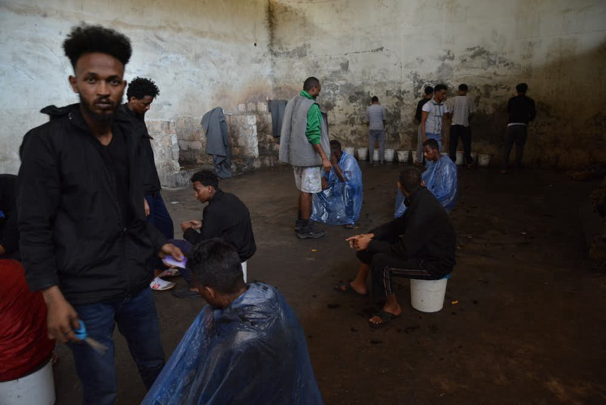
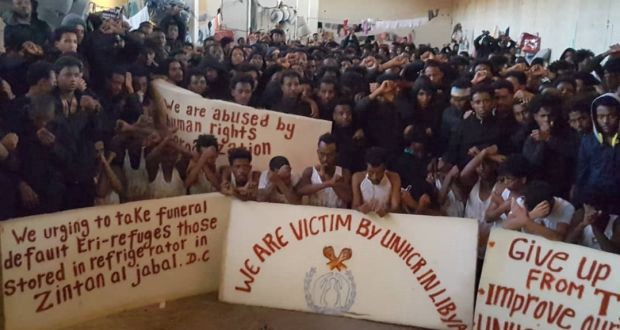
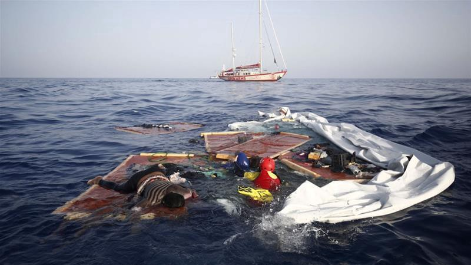
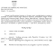
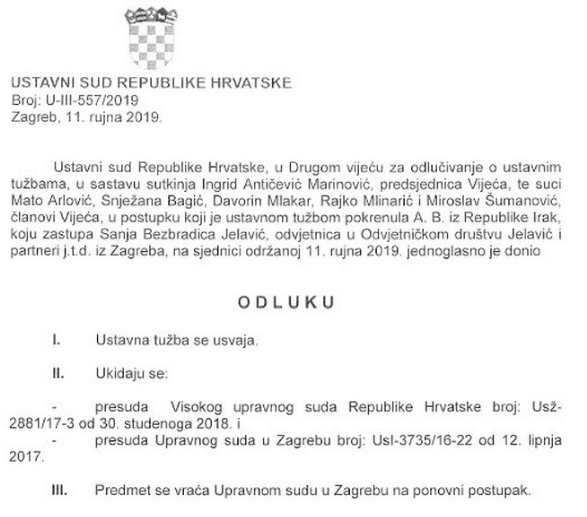
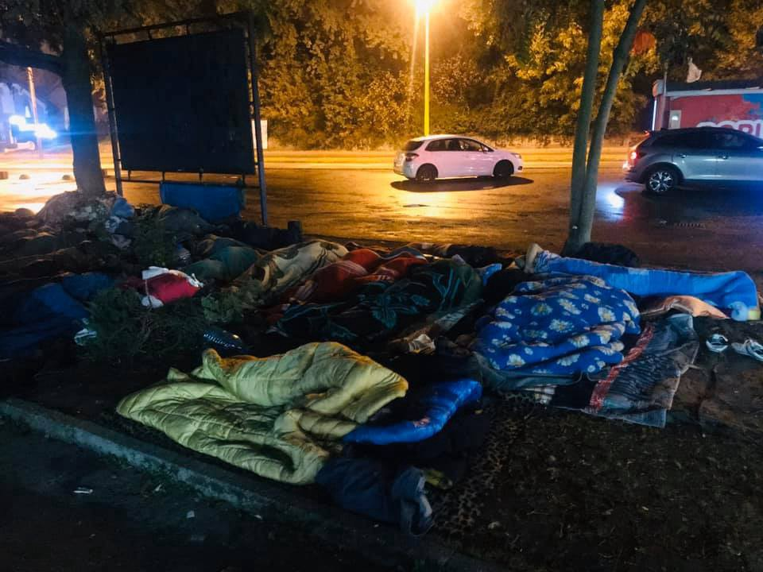

### AYS Digest 25/10/19: Rejected by EU, 23 people die in Libyan detention
### An in\-depth look inside the Zintan camp, where refugees are calling for the UN and EU to wake up and help them survive / Far\-right managed to sabotage EP resolution designed to help save lives / NGOs meet with the Italian Minister of the Interior to negotiate SAR disembarkation / Precedent in Croatia: Constitutional Court says asylum can be granted on the basis of gender\-based violence in the country of origin / In Tuzla, Bosnia, authorities finally recognise their responsibility to house refugees sleeping rough /

[Are You Syrious?](@AreYouSyrious?source=post_page-----2a47398c010c----------------------)

[Oct 26](ays-digest-25-10-19-rejected-by-eu-23-people-die-in-libyan-detention-2a47398c010c?source=post_page-----2a47398c010c----------------------) · 13 min read

In Zintan, people are too hungry to properly digest anti\-TB medication\. Photo: Giulia Tranchina
### Feature story
### Starvation, violence and disease: a look into the Libyan camps

Refugees in Zintan detention camp in Libya have organised a protest to ask UNHCR and European Union leaders to save their lives\. According to human rights lawyer Giulia Tranchina, who helped to share their appeal, asylum seekers in Zintan are being starved, they are sick and cannot sustain the anti\-TB medication because they do not even get enough food and water\. At least 23 people died of starvation and tuberculosis prior to the protest\. According to the [leaked internal report](https://www.irishtimes.com/news/world/africa/deaths-pile-up-in-libyan-detention-centre-leaked-un-report-shows-1.3937256) of the UNHCR, more than 80 percent of refugees and migrants locked up in Zintan may have tuberculosis due to overcrowding and poor conditions\. Those who died were not being buried, partly because the local community insists the cemetery is only for Muslims\.

People detained in Zintan, 180km southwest of Tripoli, are mostly fleeing persecution and violence from Eritrea and Somalia\. Some have been detained since March 2017\. Since then, numerous human rights groups and individuals have warned agains the horrific conditions in the camp\. In April, some 50 of the detainees in the poorest health were transferred from Zintan to Gharyan detention centre, which became a heavily militarised area when the LNA took control of it in the course of its offensive on Tripoli in April\.

Due to the unstable conditions in the region, there are very few alternatives for asylum seekers, apart from evacuation out of Libya which is almost impossible to acheive\. Tensions are running high and outbreaks of violence are common\. Two weeks ago, six medical workers were abducted by armed men in Zintan, only to be released [earlier this week](https://www.hrw.org/news/2019/10/24/libya-abducted-medical-staff-freed-after-12-days) \.

Conditions in Zintan: four overflowing toilets, buckets to urinate, no shower and only sporadic access to water, which was not suitable for drinking\. / Photo: MSF

In June, the UNHCR managed to secure the evacuation of an additional 96 detainees from Zintan detention centre to a UNHCR\-run facility in Tripoli, where they were to wait for evacuation from Libya\. Up to 700 remain in the detention complex, with up to 20 people living in the 15\-square\-metre rooms\.

> _“Living areas are severely overcrowded and lack proper ventilation\. In some parts of the centre, toilets are overflowing and are in urgent need of repair\. As a result, solid waste and garbage has piled up inside the cell for days and presents a serious health threat”, described UNHCR in a [statement](https://www.unhcr.org/news/briefing/2019/6/5cf61e4e4/unhcr-secures-release-96-detainees-libyas-zintan-detention-centre.html) \._ 

Apart from this life\-saving action for the most vulnerable residents of the camp, asylum seekers say they are enraged by the general indifference and inaction by UNHCR and IOM over the past years\. In May, they staged a protest against the UN agencies\. Yesterday‘s protests were also triggered by the UNHCR’s rejections of evacuation appeals\.

Not much has changed since the desparate protest against UNHCR in Zintan camp in May, when people were afraid of more deaths and bodies of the deceased were not even being buried\.
### In their own words:

> _1 we comdemn reject for refugees in libya\._ 
 

> _2 we are calling all camps gathering in one shelter which is controled by UNHCR\._ 
 

> _3 we condemn unfair mechanism of UNHCR\._ 
 

> _4 we need others agency\.B/s UNHCR does’t save our life\._ 

> _1\)poor should never be treated poorly but with deginity and respect\._ 
 

> _2\)we demands justice and fairness\._ 
 

> _3\)we are calling UNHCR prioritize resttlement from libya\._ 
 

> _4\)we are not criminals but immigrants who needs serious attention\._ 
 

> _5\)close centers now and open UN in libya now\._ 
 

> _6\)Due to ditcatership and endless slavery,i can’t go back to myvcountry\._ 
 

> _7\)we calling humaniterial and journalist to stand on our side to let the world,how we are dying here\._ 
 

> _8\)we have lost 23 lives already and UN is still not coming with solutions\._ 
 

> _9\) where is the world and where is humanity\._ 
 

> _10\)This is zintan detention center in libya\._ 

Unfortunately, Zintan is not the only detention camp in Libya which can easily be deadly for its residents\. In July, MSF published [a report](http://Between 5,000 and 6,000 refugees and migrants are being held arbitrarily in Libya’s detention centres, nominally under the authority of the Tripoli-based Ministry of Interior.) describing how **between 5,000 and 6,000 refugees and migrants are being held arbitrarily in Libya’s detention centres** , nominally under the authority of the Tripoli\-based Ministry of the Interior\. In October, UNHCR confirmed that more than 5,000 people are still being held in such detention centres, of which 3,700 are “persons of concern”\. New detainees are being brought to the detention centres every day, after being rescued or intercepted off the coast of Libya, faster than the rate at which people are being evacuated\.
### EU response: refusal to accept declaration that might have helped to save lives

It must be said: the [European Union is funding the Libyan coast guard](http://www.europarl.europa.eu/doceo/document/E-8-2018-004604_EN.html) to keep asylum seekers out of Europe\. On 7 July 2018, Italy and Libya signed an agreement providing for the delivery of 5 million EUR to Libya to curb migration to Europe by stopping boats\. The deal also includes military training\. People who are returned to Libya are put in detention facilities where they are exposed to numerous risks, in direct violation of the [Convention against Torture and Other Cruel, Inhuman or Degrading Treatment or Punishment](https://www.ohchr.org/Documents/ProfessionalInterest/cat.pdf) \.

Smugglers and warlords are ruling the lives of those who are desperately seeking safety\. At the same time, search and rescue operations in the Mediterranean are [being criminalised](https://blamingtherescuers.org) \. Not only were they saving thousands of people from drowning, they were also reporting about the crimes of the Libyan coast guard, which deliberately destroyed refugees’ boats and sometimes even left people to die in destroyed vessels\.

The boat carrying the bodies of a mother and a child was found about 120km off the Libyan coast by Proactiva Open Arms in 2018: They were left there by the Libyan coast guard\. Photo: Proactiva

On Thursday, the European Parliament rejected a resolution on search and rescue operations in the Mediterranean that would have required member states to keep their ports open to NGO ships rescuing migrants at sea\. The resolution did not pass by two votes: 288 in favour, 290 against and 36 that abstained\.
### It was an opportunity to stop funding human rights violations

The important part of the [rejected resolution](http://www.europarl.europa.eu/doceo/document/B-9-2019-0154_EN.html?fbclid=IwAR3bEL22NHFx2Tpy_EGUE9BG8DUxawUlxcoRDbGQwd3hioXW6znIK2kH_LU) , which was sabotaged ba far\-right groups whose MEPs were literally applauding the failed vote, was also designed to officially recognize the crimes of the Libyan state\.

> **_“The route from Libya to Europe is still the migration route with the highest death toll in the world_** _\(646 deaths so far in 2019\) and was five times deadlier in 2018 than in 2015, notably due to a reduction in search and rescue \(SAR\) activities off the Libyan coast \(…\) **the Libyan coast guard continues to intercept or rescue a large number of persons at sea — around 15 000 in 2018** ; whereas on several occasions the Joint Rescue Coordination Centre in Libya has failed to fully meet its obligations under international maritime law to coordinate rescue operations, is often unresponsive to distress calls, has hindered NGO vessels from saving lives and has put lives at risk when rescuing or intercepting persons at sea; **whereas Frontex assets have been transmitting information to the Libyan Maritime Rescue Coordination Centre about people in distress at sea** ; whereas people intercepted by the Libyan coast guard are transferred to detention centres where they are systematically exposed to **arbitrary detention in inhumane conditions, and where torture and other ill\-treatment, including rape, as well as arbitrary killings and exploitation are endemic** ; whereas the UNHCR takes the view that Libya does not meet the criteria for being designated as a place of safety for the purpose of disembarkation following rescue at sea”, stated the draft resolution\._ 

The resolution did not pass by two votes: 288 in favour, 290 against and 36 that abstained\.
### Failed attempt to provide secure corridors from Libya

One of the most important parts of the rejected resolution called on the European Commission to share comprehensive information and data on the level of support provided through funding from the EU and the Member States to border and coast guards in third countries, including Libya, Turkey, Egypt, Tunisia and Morocco, not only through direct transfers but also material, technical and training assistance\. In that regard, it was designed to support the recommendations of the Council of Europe Commissioner for Human Rights to ‘ **urgently review all co\-operation activities and practices with the Libyan Coast Guard, identify which of these impact, directly or indirectly, on the return of persons intercepted at sea to serious human rights violations, and suspend these until clear guarantees of human rights\-compliance are in place** ’\.

> _Among the 290 against the text, most were from the EPP, along with Forza Italia, the right\-wing nationalist parties including the League, and the ECR with Fratelli d’Italia, as well as some MPs from Renew Europe\._ 

The resolution was supposed to call on the Commission, Member States and Frontex to ensure that disembarkation takes place only in a place of safety that is safe under relevant international and Union law and to refrain from issuing instructions to shipmasters that may, directly or indirectly, lead to the disembarkation of rescued persons in an unsafe place\. It called on Member States to evacuate swiftly detention centres in Libya and move migrants, including to the EU, and to recognise that safe and legal pathways are the best way of avoiding loss of life\. **Most importantly, it urged Member States to fully support the UNHCR’s evacuation operations from Libya and to intensify resettlement measures and put in place humanitarian corridors to the European Union\.**

> _“When you see headlines talking about EU politicians’ positions on search & rescue, please remember this is not just about rescuing people in the sea, it is about the EU’s active involvement in returning men, women & children to warzone detention centres run by brutal militias”, said [Sally Hayden](https://twitter.com/sallyhayd) , a journalist following the situation in Libya\._ 

### Mediterranean
### Rescued, but stranded — Ocean Viking still not allowed to disembark

While EU leaders fail to even agree on prioritising saving lives, the Ocean Viking SAR ship remains stranded at sea for a week, with 104 vulnerable men, women and children onboard\. They were rescued after managing to escape the horrors of Libya\. According to the ship crew, they are suffering from rough weather conditions and low temperatures, which have been dropping these past days\. Many of them cannot even eat\. While awaiting permission to disembark, MSF is sharing their painful testimonies on Twitter\.
### Italy
### NGOs meet with the Minister of the Interior to negotiate permanent SAR disembarkation solution

The representatives of MSF, Mediterranea, Open Arms, Pilotes Volontaires, Sea Eye, Sea Watch and SOS Méditerranée have met with the Italian Minister of the Interior Luciana Lamorgese, as reported by [MSF Italy](http://medicisenzafrontiere.it) \.

> _“After years of humanitarian action in the Mediterranean, we are still collecting corpses out of the sea\. We hope that this meeting will mark the beginning of a continuous, concrete and transparent dialogue, based on the reality of the facts and on the urgency of effective responses\. It is time to overcome once and for all the sad period that transformed the Mediterranean into a mass grave”, the NGOs said in a collective statement\._ 

Following the troubled period of rule of the ex\-minister Matteo Salvini, the organizations have initiated a reopening of the dialogue between civil society and Italian officials, in order to restore an efficient SAR system that is in line with international treaties, to put a stop to interceptions by the Libyan coast guard, to define, with EU involvment, a preordained system of disembarkation in the nearest safe port and to proceed to the immediate release of humanitarian ships that were unlawfully put under administrative arrest\.
### Greece

The Greek Newspaper EFSYN reports that the young mother of the child that recently drowned after a boat from the Turkish coast guard rammed their dingy was transferred to Kos hotspot without psychological support\. The 19\-year old woman that lost her child was released from hospital only 12 hours after the catastrophe, as she had no physical injuries like bruises of fractures\. Apparently she was than directly integrated into the official system with its cold bureaucracy and inhuman living conditions\.

According to the **Aegean Boat Report** , eight boats have arrived, carrying a total of 297 people\. 
Two boats arrived on Lesvos, two on Chios, three on Samos and one on Leros\.

The **UNHCR expressed deep concern** about the new directives in asylum law that where briefly debated in the Greek Parliament, as they will “weaken refugee protection in the country, and are being rushed through Parliament\.”

> _“The draft law puts an excessive burden on asylum seekers and focuses on punitive measures\. It introduces tough requirements that an asylum seeker could not reasonably be expected to fulfil\. For instance, if they do not observe certain procedural formalities, their asylum claim will be considered implicitly withdrawn and rejected, without being fully examined\. In some circumstances, it would be so difficult to appeal against a rejection that the right to an effective remedy enshrined in international and EU law, would be seriously compromised\.”_ 

UNHCR further criticizes the new law saying it will limit the right to family unity, add to the burden of authorities and will therefore cause further delays, increase the maximum limit of detention from 3 to 18 months and force refugees to leave official accommodation within two months instead of six months\. 
Find the statement of the UNCHR here:
### [UNHCR urges Greece to strengthen safeguards in draft asylum law — UNHCR Greece](13170-unhcr-urges-greece-to-strengthen-safeguards-in-draft-asylum-law.html?fbclid=IwAR097zwbiyBxdbxRw7-VmS_4twHz1TJs5Mz1gGALK3ApsCzNqIa7n1KO_fI&source=post_page-----2a47398c010c----------------------)
### [UNHCR, the UN Refugee Agency, appreciates efforts by Greece to overhaul its strained asylum system but is deeply…](13170-unhcr-urges-greece-to-strengthen-safeguards-in-draft-asylum-law.html?fbclid=IwAR097zwbiyBxdbxRw7-VmS_4twHz1TJs5Mz1gGALK3ApsCzNqIa7n1KO_fI&source=post_page-----2a47398c010c----------------------)
#### [www\.unhcr\.org](13170-unhcr-urges-greece-to-strengthen-safeguards-in-draft-asylum-law.html?fbclid=IwAR097zwbiyBxdbxRw7-VmS_4twHz1TJs5Mz1gGALK3ApsCzNqIa7n1KO_fI&source=post_page-----2a47398c010c----------------------)

The **Boat Refugee Foundation** will start a new mission in Northern Greece and is therefore **looking for voluntary interpreters** \. The required languages are English plus Kurdish, Sorani, Badini, Arabic, Farsi, Dari, Pashto, Kurmanji and/or Urdu\.
### [Stichting Bootvluchteling](?source=post_page-----2a47398c010c----------------------)
### [VACANCY \| Wanted: voluntary interpreters for Boat Refugee Founadtions new mission on Greek mainland 🌍 We are looking…](?source=post_page-----2a47398c010c----------------------)
#### [web\.facebook\.com](?source=post_page-----2a47398c010c----------------------)
### Croatia
### Important precedent: Constitutional Court rules that gender\-based violence can be seen as grounds for granting asylum

Last month, the Constitutional Court of Croatia reached a historic decision that could have far\-reaching consequences for the fates of many immigrant women — domestic violence in the countries from which the victims fled is a reason for asylum\! In the case of Iraqi national A\.B\., who was initially denied asylum, the constitutional judges unanimously concluded that the Administrative Court and the High Administrative Court had violated her human rights guaranteed by the Constitution and the The European Convention on Human Rights\.

> _A\.B\. testified about the severe violence and abuse inflicted on her by male members of her family in the home country\. In a 26\-page decision, the Constitutional Court explicitly stated that Article 3 of the Convention on Human Rights, which states that “no one shall be subjected to torture or to inhuman or degrading treatment or punishment”, applies “not only to the danger posed by the repressive state apparatus but also to the danger that comes from a person or group who is not a member of that apparatus”, in this case, male members of the family who abused her for years\._ 

The Contstitutional Court returned the case for retrial, thereby partially correcting the injustice done to AB, but also opening the door to a radical change in Croatian case law\.
### Bosnia
### Local government announces the opening of a reception centre on the outskirts of Tuzla

Refugees have been sleeping rough in the increasingly cold weather\. Photo: Tuzlarije

In the Bosnian town of Tuzla, tireless local volunteers and a few international responders have been providing daily support to refugees and migrants for nearly 18 months\. So far, people have been sleeping rough in front of the bus station, which is becoming an even bigger problem as the winter approaches\. Today, local authorities have finally recognised their own role in providing reception facilities\.

> _“The Cantonal Government has found a location for a reception center to house these people\. I cannot reveal the exact location yet\. Something can be done because it is socially\-owned property\. We fully understand the situation and we sympathise with migrants, especially in the context of the approaching winter”, said Denijal Tulumović, the Prime Minister of the Tuzla Canton\._ 

We can only hope that the announced solution will be a truly humanitarian one, as opposed to the horrific conditions in Vučjak camp near Bihać\.
### France

Refugee Rights Europe published a report about the situation of **unaccompanied minors in Northern France** \. The report sheds light on the number of children in the area that want to reunite with family in the UK, the applicable legal rules, the lack of access to official procedures and the high risk of trafficking they face\.
Read the full report here:

In **Rennes** , events are planned for 26/10 and 27/10 to mobilize against the expulsion of people\.

Refugee Community Kitchen is in need of money in order to buy new vans for food distribution\. Share their call for support here:
### [Cecelia Bittner](?source=post_page-----2a47398c010c----------------------)
### [Hi all\! Refugee Community Kitchen is still hard at work serving hot, nourishing food in Calais and Dunkirk\. In rough…](?source=post_page-----2a47398c010c----------------------)
#### [web\.facebook\.com](?source=post_page-----2a47398c010c----------------------)

**Apart from daily news in English, we also publish weekly summaries in Arabic and Persian\. Find specials in both languages on our [medium site](https://medium.com/are-you-syrious/ays-weekly-in-arabic-and-persian/home?source=post_page---------------------------) \.**

**If you wish to contribute, either by writing a report or a story, or by joining the info gathering team, please let us know\.**

**We strive to echo correct news from the ground through collaboration and fairness\. Every effort has been made to credit organizations and individuals with regard to the supply of information, video, and photo material \(in cases where the source wanted to be accredited\) \. Please notify us regarding corrections\.**

**If there’s anything you want to share or comment, contact us through Facebook, Twitter or write to: areyousyrious@gmail\.com\.**

_Converted [Medium Post](https://medium.com/are-you-syrious/ays-digest-25-10-19-rejected-by-eu-23-people-die-in-libyan-detention-4716d047982d) by [ZMediumToMarkdown](https://github.com/ZhgChgLi/ZMediumToMarkdown)._
