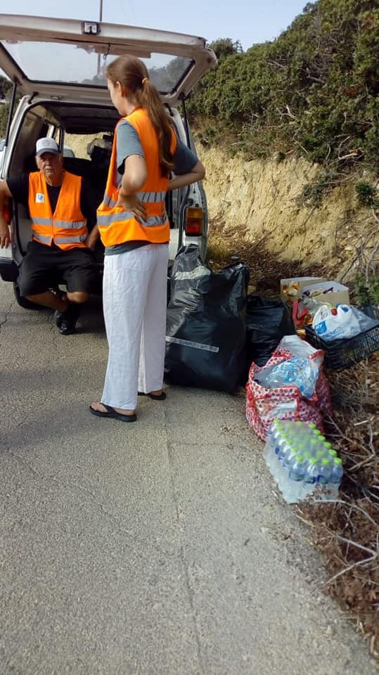
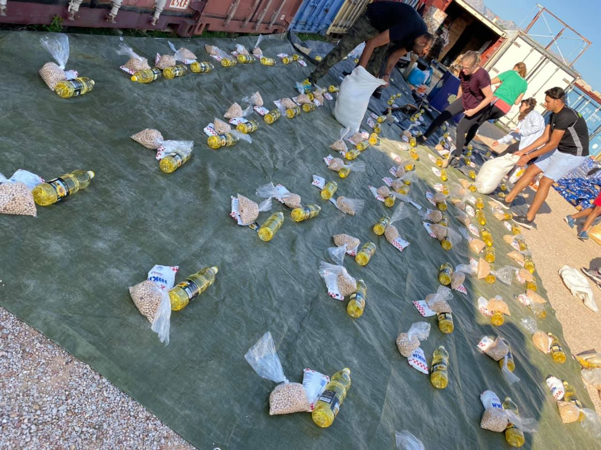

### AYS Daily Digest 29/10/19 Ocean Viking with 104 people disembarks after 11 days at sea

_Translation of Libyan decree limiting rescue missions from NGOs // welcomed update on the boat that the Reconnaissance plane Moonbird spotted // important event against Italy’s extending relations with Libya // ECCHR and Syrian regime // and more…_

](assets/3ab7ffb0b13a/1*5ReUPuCLCBoULHAvo5ub7g.jpeg)

11 days at sea for 104 people, including two pregnant women\. Photo by [SOS MEDITERRANEE](https://twitter.com/SOSMedIntl/status/1189158066283057152)
### Feature: The Ocean Viking enters it’s 11th day at sea with 104 people on board…

…with initially no place to go\.

But it was announced on Tuesday that the [Italy’s Interior Minister agreed](https://www.aljazeera.com/news/2019/10/italy-rescue-ship-104-people-dock-11-days-sea-191029174420287.html) to allow the 104 people to disembark at the Sicilian port of Pozzallo\. Germany and France have also agreed to accept 70 of the people\.

■■■■■■■■■■■■■■ 
> **[SOS MEDITERRANEE](https://twitter.com/SOSMedIntl) @ Twitter Says:** 

> > UPDATE After 11 days stranded at sea, it was just announced that France, Germany &amp; Italy found an agreement for the relocation of 104 people on #OceanViking &amp; 90 people on #AlanKurdi.

Pozzallo, Italy, was just assigned as a Place of Safety to the #OceanViking for disembarkation. https://t.co/2GlSvg05DE 

> **Tweeted at [2019-10-29 12:32:31](https://twitter.com/sosmedintl/status/1189158066283057152).** 

■■■■■■■■■■■■■■ 

Michael Fark, the MSF head of mission for Libya and the Mediterranean, said on Tuesday:

> “We are relieved, and appreciate that France, Germany, and Italy have finally found a solution for relocation of all 104 survivors on board Ocean Viking, and the 90 people on board Alan Kurdi…After days stranded at sea, and enduring horrific conditions in Libya and along their journey, finally they will be taken to safety\. 

> “It is unacceptable to strand people at sea, waiting days and weeks while European states debate whether and how to fulfill their humanitarian and legal obligations\. It’s disappointing that only three states were part of this solution\.” 

Also to point at how ridiculous an 11 stand off is:

■■■■■■■■■■■■■■ 
> **[SOS MEDITERRANEE](https://twitter.com/SOSMedIntl) @ Twitter Says:** 

> > This is what an unnecessary standoff looks like on the map.

The #OceanViking is stranded since October 20, waiting for a Place of Safety for the 104 men, women &amp; children rescued 11 days ago. 

A coalition of European States must allow their disembarkation without further delay. https://t.co/NU0OoLYf03 

> **Tweeted at [2019-10-29 09:08:59](https://twitter.com/sosmedintl/status/1189106845065060352).** 

■■■■■■■■■■■■■■ 

### Libya

[Here are some videos](https://www.facebook.com/rastajuly/posts/10157061534028621) of refugees leaving the Abu Selim “official” detention centre after facing starvation for months, where the last few weeks in situation became “intolerable”:

> “They have all been registered with UNHCRLibya for years and were suffering in \#AbuSelim waiting for evacuation\. Many are sick\. They are at risk of being kidnapped, detained, tortured again\.They need urgent assistance and evacuation to safety now\.” 

An in the latest update: _“they are now outside the GDF, the only “safe” temporary place in Libya, begging UNHCR to help them\.”_

](assets/3ab7ffb0b13a/1*T_hRJC4_kKejG5T3ZVsCuw.jpeg)

Photo provided by [Alterego — Factory of rights](https://www.facebook.com/fabbricadeidiritti/photos/a.933178506826733/1795406360603939/?type=3&theater)

The Presidential Council of the Libyan national agreement issued a decree on September 14th, to limit NGOs working in “the Libyan area of ​​maritime search and rescue\.” Some main points in the decree:

→ The NGOs have to submit request for authorization to the Libyan authorities and have to periodically provide all the information that Libya sees fit as to relating to the NGO’s intervention\.

→ Humanitarian ships have to “work under the principle of collaboration and support, and \(cannot\) block the search and rescue operations carried out by the authorized authorities inside the area” so the Libyan Coast Guard \(LCG\) has the priority intervention\. NGOs have to “inform in advance about any initiative, even if it is considered necessary and urgent”\.

→ Also this decree authorizes the LCB to board the ships\. This “necessary for legal and safety reasons” at any time and can be done “without compromising the human and professional activity for which the ship is responsible flag\.”

Find out more about this excessively controlling measure [here\.](https://www.repubblica.it/cronaca/2019/10/29/news/migranti_il_governo_libico_emette_decreto_per_neutralizzare_le_ong-239783290/?fbclid=IwAR18j32AbO1ra1GaYt4U5ORUEDbUfH3_U37Q5Zq_QZ1-NvOg5HZaDae7fNQ) And you can find the Italian translation of the decree [here](http://www.integrationarci.it/2019/10/29/migranti-il-governo-libico-emette-decreto-per-neutralizzare-le-ong/?fbclid=IwAR10oh4io0QfoaHC-cA1t9oFQrORu791VjOnmR8-mXBRYTmdwzCIT7EP5cI) \(very easy to google translate into English as well\) \.
### Sea

[A great update](https://twitter.com/lorenzodago/status/1189227645646594049) on the boat that the Reconnaissance plane Moonbird spotted with 10–15 people on board, including children, on Monday:

■■■■■■■■■■■■■■ 
> **[Lorenzo D'Agostino](https://twitter.com/lorenzodago) @ Twitter Says:** 

> > After an exhausting search, 15 people (2 toddlers, 5 more children, 2 women) mostly Libyans, have been brought on the Open Arms. They self-organised to escape war, and they made it incredibly close to Lampedusa. But minutes after they were found, their boat started to deflate.1/3 https://t.co/OnwPnI79SO 

> **Tweeted at [2019-10-29 17:09:00](https://twitter.com/lorenzodago/status/1189227645646594049).** 

■■■■■■■■■■■■■■ 

This is a happy ending for now, but here is further evidence why these people needed NGO rescue and not the LCG:

■■■■■■■■■■■■■■ 
> **[Lorenzo D'Agostino](https://twitter.com/lorenzodago) @ Twitter Says:** 

> > According to Proactiva's Riccardo Gatti, the Libyan Coast Guard alleged "bad weather conditions" in order not to go and search for the distress case in their SAR area.

Let's repeat it once more: LIBYA IS NOT A LEGITIMATE OR CAPABLE RESCUE AUTHORITY.

.[twitter.com/RichiGatu/stat…](https://twitter.com/RichiGatu/status/1189069973907488769?s=19) 

> **Tweeted at [2019-10-29 06:55:48](https://twitter.com/lorenzodago/status/1189073330013380608).** 

■■■■■■■■■■■■■■ 

](assets/3ab7ffb0b13a/1*OkLwxyT_aA9mnZAORShppA.jpeg)

“The @ Frontex moves in a French ship 68 people at Port \# Malaga \. Today \+200 
 🗣Among them 16 children travel between 6 and 17 years according to the European authorities\.” Photo by [Sergio Rodrigo](https://twitter.com/SRodrigoruiz/status/1189253286345531398)

**Western Mediterranean Update** : “ _Five people have died in the last 24 hours while trying to migrate to Spain\. One of them in Cartagena and 4 in the Canary Islands\. In the last hours more than 400 people have been rescued_ \.” Learn more [here](https://twitter.com/SRodrigoruiz/status/1189145642007969792) \.

In a [Eurhope](https://twitter.com/WeAreEurhope/status/1189103897320841216?fbclid=IwAR2nbefHMYqokzywK4mr9U8H4FZwNnOn-KzG9EgEupRQw8eVF0NizLCGjbQ) tweet from Tuesday:

“ ⚠️ **82,978 refugees** arrived in Europe across the Mediterranean so far this year\. With 2 months to end 2019, this is the number of people who have reached the coast\. But … How many stayed on the road?”
### Greece

New arrivals reported by [Aegean Boat Report](https://www.facebook.com/AegeanBoatReport/posts/683126542210453?hc_location=ufi) : _“Since yesterday \(Monday\) at least sixteen boats have arrived on the Greek Aegean islands, carrying 551 people\.”_

First — fifth boats to **Lesvos** : 47 people, 10 people \(4 children, 1 woman, 5 men\), 39 people, 46 people \(30 children, 9 women, 7 men\), and 7 people\. _“Also two people was found in Ligonari, Lesvos south west last night before midnight\.”_

Sixth — tenth boats to **Chios** : 32 people \(14 children, 5 women, 13 men\), 45 people \(11 children, 11 women, 23 men\), 41 people \(15 children, 10 women, 16 men\), 13 people \(2 children, 2 women, 9 men\), and 31 people \(5 children, 4 women, 22 men\)

Eleventh and twelfth boats to Samos: 47 people and 52 people

Thirteenth boat to Kos: 27 people

Fourteenth — sixteenth boat to Leros: 35 people, 40 people, and 35 people

 from the new arrivals distributions on Tuesday morning](assets/3ab7ffb0b13a/1*cVZEzJp3QHjophUV6fT1_A.jpeg)

Photos from [Chios Eastern Shore Response Team](https://www.facebook.com/groups/421759534684819/permalink/1226035057590592/?hc_location=ufi) from the new arrivals distributions on Tuesday morning

In an update on the Food Camp Mission from Chios, [Ruhi Loren](https://www.facebook.com/ruhi.akhtar.7/posts/2987941231222765?hc_location=ufi) describes the scene:

> “\(We\) spent the last three days \(making\) food packs, including seven staple food items and distributed it to the people of Vial camp, Chios\. We had planned to provide 650 food packs, to also accommodate all the new arrivals as we usually provide 550\. However we soon found out the camp had grown to extreme proportions and now accommodated 5000 people\. **We were able to provide 943 food packs** after we raided all the available stores to make up packs of 7 items even if it meant substituting some items to alternative suitable items\. 

> Our work is not yet complete as there was not enough supplies in all the supermarkets and we were unable to provide for part of Area B\. So we still need to fundraise for, buy, pack up and distribute another approximate 100 packs as soon as possible\. As our promise is our promise\. We are working on this now and if anyone would like to help us with funds as we are all out please contact me\.” 

](assets/3ab7ffb0b13a/1*oyzEp5oG6wZ05BKQNgbzdg.jpeg)

Photos by [Ruhi Loren](https://www.facebook.com/ruhi.akhtar.7/posts/2987941231222765?hc_location=ufi)

In an update on the “show trial” last week for 13 people accused of occupying public spaces and resisting authority from protesting in 2017, [No Border Kitchen Lesvos](https://www.facebook.com/NBKLesvos/posts/1543287825811001) reported:

> “Twelve have been deservedly acquitted of the charges brought against them by police, and the thirteenth given a three month sentence for resisting authority\. \(But\) this trial, against people who protest against the inhumane living conditions and asylum procedure on the Aegean Islands, is no isolated case\. Just last May there was a trial against 122 people, arrested on Saphus Square in April 2018, after severe attacks by fascists while police watched\. 

> In both cases, after several hours of testifying in court, the court declared them innocent beyond all doubt\. Once again the Greek police \( \) were not only left in question, but dragged completely though the mud\. There are enough occasions already when their actions have been put into doubt by the courts\. **In so many trials, it has been painfully obvious that the prosecutor and the police cannot present any valid evidence, that actually there is no case…** 

> We do not resign ourselves to accept as everyday the habitual criminalization of protests and solidarity, the persecution of migrants who seek refuge and are protesting for their rights in a dehumanizing context, and the persecution of people in solidarity\. We will continue to fight against these actions, and denounce the savage repression\.” 

### Italy

A very important event will happen with Amnesty International Italia on Wednesday:

> “On **November 2** , if the **Italian government** does not intervene to cancel it, the Memorandum with Libya will be automatically **renewed** , that is a series of agreements financed by Italy, which among other things foresee the intervention of **the Libyan coast guard** to **stop and report on land migrants** embarked trying to reach our shores\. 

> On October 30, the Asylum Table , the **network** of the largest **organizations** dealing with migrants’ rights, organized a press conference to present the **text of the open letter** that will be sent to **the Italian government** asking them not to renew the Memorandum\.” 

Please find out more [here](https://www.amnesty.it/rinnovo-memorandum-con-la-libia-il-30-ottobre-la-conferenza-del-tavolo-asilo/) \.

In updated numbers for new arrivals to Italy on the Central Mediterranean Route, 9476 people have arrived since the beginning of 2019 and 1843 of them arrived so far in October\. This is a decrease of 56\.99% compared to 2018 \(22,031\) and 91\.49% to 2017 \(111,306\) \. Learn more [here](https://minoristranierinonaccompagnati.blogspot.com/2019/10/9476-persone-approdate-sulle-coste.html?m=0) \.
### Spain

There have been several new arrivals in the past few days on the Canarian border\. “Between yesterday and today there are four kickboats and a canoe\.” Learn more [here](https://twitter.com/txemita/status/1189074793422839809?fbclid=IwAR02mYiy-F6CU0Qj3mU6Fgw3zRk21InBRUalRvzOHDwi6yhRH3PRIiD0opY) \.
### Bosnia and Herzegovina

Here is a very important fundraiser for winter supplies: Bosnia and Herzegovina: A Winter Prison for People Seeking Safety

_“I will be raising funds to buy winter aid firstly for this camp \(the new one at the Croatian border\) and if we have any other funds left for the other hotspots\. As a priority these people need blankets\! \!”_ Find out more [here](https://www.facebook.com/donate/468973413952576/) \.

The Tuzla Canton government has denied claims that it will be building a new reception centre by the end of November\. They say that the Prime Minister Denial Tulumovic’s statements have been misinterpreted\. They emphasize that _“the desire and will for a reception centre have been expressed”_ but it is not currently within their capacity and it should be up the state to oversee\. Learn more [here](https://bhrt.ba/vlada-tk-prihvatni-centar-nece-biti-formiran-izjave-premijera-pogresno-interpretirane/?fbclid=IwAR2oh_f4MCvQc0ID26y5w2JDZt_1mzwmRLNdEM5BbHqrAtm3dtSIaHLgg3w) \.
### EU

Progress in addressing the Syrian regime with ECCHR \( [the world wide trial](https://www.ecchr.eu/nc/en/press-release/with-the-first-criminal-trial-worldwide-on-torture-in-syria-german-courts-to-set-international-prescedent/?fbclid=IwAR3AeTqajgVdEnGBCt_gimt9qdV5Od7R1Ics5bvKatp4qkYGBwg1eBk7yak) against the Assad regime is supposed to start in Germany in 2020\):

■■■■■■■■■■■■■■ 
> **[ECCHR](https://twitter.com/ECCHRBerlin) @ Twitter Says:** 

> > BREAKING: #German Federal Prosecutor @[GBA_b_BGH](https://twitter.com/GBA_b_BGH) 
charges former high-ranking #Assad government official w/ more than 4,000 cases of #torture. With the 1. criminal trial worldwide ab/ torture in #Syria, Germany to set intl. precedent #UJ #ICL #Justice4Syria
[ecchr.eu/nc/en/press-re…](https://www.ecchr.eu/nc/en/press-release/with-the-first-criminal-trial-worldwide-on-torture-in-syria-german-courts-to-set-international-prescedent/) https://t.co/pfCDtez8Cy 

> **Tweeted at [2019-10-29 10:08:58](https://twitter.com/ecchrberlin/status/1189121940428148737).** 

■■■■■■■■■■■■■■ 

In addition to this case brought by the German Federal Prosecutor, there is a similar case going on in Sweden, in cooperation with and inspired by this case and ECCHR:

Officials in the Syrian regime are named and accused of crimes from European soil, \(as told by the lawyers involved in the Swedish investigation\) \. The Swedish organization Civil Rights Defenders handed in their investigation to the police earlier this year, and now the police is looking into it\. The goal is an international arrest warrant for the perpetrators\. The material handed into the police by CRD is based on the experiences of 9 Syrians who now lives in Sweden but who all were tortured and captured by the regime before leaving\. 25 officials are named, all of them ‘highly regarded’ Syrian officials and ultimately responsible for torture the nine people have suffered from\.

**We strive to echo correct news from the ground through collaboration and fairness\. Every effort has been made to credit organizations and individuals with regard to the supply of information, video, and photo material \(in cases where the source wanted to be accredited\) \. Please notify us regarding corrections\.**

**If there’s anything you want to share or comment, contact us through Facebook or write to: areyousyrious@gmail\.com**

_Converted [Medium Post](https://medium.com/are-you-syrious/ays-daily-digest-29-10-19-ocean-viking-with-104-people-disembarks-after-11-days-at-sea-3ab7ffb0b13a) by [ZMediumToMarkdown](https://github.com/ZhgChgLi/ZMediumToMarkdown)._
