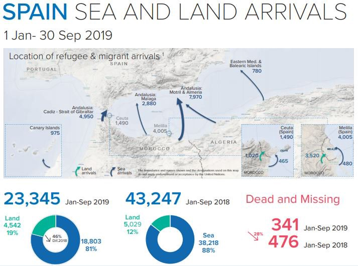

### AYS Daily Digest 30/10/19: ‘Externalisation’ behind the idea for an upgraded asylum system

Germany proposes to replace Dublin in early 2020//Hundreds of people escape Abu Salim centre in Libya//New developments in the Mediterranean//Weather alert in Greece//Risk of additional evictions in Athens//35097 people stuck on Greek islands//More news from Germany, Spain…

 \.](assets/44ae5503df7/1*HKrEQZwFnL91yqD1vKVhvA.jpeg)

Credit: [MSF Sea](https://twitter.com/MSF_Sea/status/1189514474019012609?fbclid=IwAR3okEQqsvFYSnvJxg8hyQaOl0UySErTV_J6YsTxs9Z7-XqdhoG2ndn9YRI) \.
#### FEATURED

German minister Seehofer met with his colleagues from France, Spain, Great Britain, Italy and Poland, and proposed to shift the decisions on asylum applications to the external borders of the EU, so as to reduce the number of incoming refugees, reports [_Die Zeit_](https://www.zeit.de/politik/deutschland/2019-10/horst-seehofer-spd-asyl-pruefung-eu-aussengrenze-moeglich?utm_content=zeitde_redpost+_link_sf&utm_source=twitter_zonaudev_int&utm_medium=sm&wt_zmc=sm.int.zonaudev.twitter.ref.zeitde.redpost.link.sf&utm_campaign=ref) \. He reportedly aims to prepare a draft proposal to replace Dublin when Germany assumes the rotating EU Presidency in the second half of 2020\. He proposes “that asylum seekers rejected in EU countries to be repatriated” to the external borders of EU\.
Interestingly, Greece didn’t take part at the meeting\.

So far, it seems his other counterparts backed the new proposition according to which asylum seekers with the prospect of being recognized as refugees will then be relocated to those EU member states willing to accept them\. There, at a second stage of the procedure, the asylum application will be finally decided\.

In such a version, criticized by ProAsyl, a number of questions remain unanswered — what happens to those who first appear in one of the ‘inner’ countries, regardless of means, but particularly those arriving in EU countries by airplane? Also, what will happen to asylum\-seekers who concluded the first stage of procedures but no EU member state wants them? 
And also, what happens to people’s right to choose?

We will report on this as things develop further\.
#### LIBYA

According to the recent official statements, the EU will continue training Libyan Coast Guard forces to improve their efficiency and ability to manage search and rescue operations in Libyan territorial waters\.

“The EU insists on rejecting violence and respecting international laws and humanitarian standards while rescuing migrants,” said their spokesperson\.

■■■■■■■■■■■■■■ 
> **[Judith Sunderland](https://twitter.com/sunderland_jude) @ Twitter Says:** 

> > It sounds like the Italian government will tweak but not scrap or even fundamentally change its 2017 agreement with Libya's Government of National Accord on migration. Here's a thread (not sure yet how long) on why this matters [internazionale.it/bloc-notes/ann…](https://www.internazionale.it/bloc-notes/annalisa-camilli/2019/10/30/italia-memorandum-libia) 

> **Tweeted at [2019-10-30 10:57:54](https://twitter.com/sunderland_jude/status/1189496644628299776).** 

■■■■■■■■■■■■■■ 

The past months several reports on the abuse of migrants and refugees in Libya have been published\. One more dreadful than the other\. The UN has been accused of being partly guilty of it, as they fail to admit that they cannot handle the situation\. On Tuesday heavy gunfire broke out in the capital, Tripoli, which lead to the release of hundreds of migrants from Abu Salim detention center\. Both UNHCR and other witnesses confirmed the information, Reuters [said](https://www.reuters.com/article/us-europe-migrants-libya/migrants-released-amid-fighting-in-libyan-capital-seek-refuge-with-u-n-idUSKBN1X82MK?fbclid=IwAR0sxXSwvKjZ41x0Kpy0iYCWoe-RpJUi6Nu2l7xDz8AcYbmBtDCXcMnkN6A) \.

It was reported that a few hundred people released from the detention center made their way towards the UNHCR resettlement center in Tripoli, the GDF\. The UN\-center has been heavily overcrowded, and the situation there is not according to the standard it should be\. People have in fact also been trying to [escape the GDF\.](https://twitter.com/sallyhayd/status/1188846230790688771/photo/1) Also, the number of places in the UNHCR’s GDF\-center strangely continues to drop, as noted by journalist Sara Creta:

■■■■■■■■■■■■■■ 
> **[Sara Creta](https://twitter.com/saracreta) @ Twitter Says:** 

> > #Libya In 2018 @[UNHCRLibya](https://twitter.com/UNHCRLibya) mentioned that the GDF Center in Tripoli has a capacity to shelter up to 1,000 vulnerable refugees. [unhcr.org/news/press/201…](https://www.unhcr.org/news/press/2018/12/5c09033a4/first-group-refugees-evacuated-new-departure-facility-libya.html) 

> **Tweeted at [2019-10-30 17:01:49](https://twitter.com/saracreta/status/1189588227763638272).** 

■■■■■■■■■■■■■■ 

Journalist Sally Hayden, who’s in direct contact with several refugees and migrants, published this thread with more information on the conditions in Abu Salim\. She wrote that people had walked out of the detention center after the Libyan guards tried to lock them up by force\. Since the beginning of the year they have been able to move around, a bit, in exchange for being given food:

■■■■■■■■■■■■■■ 
> **[Sally Hayden](https://twitter.com/sallyhayd) @ Twitter Says:** 

> > Hundreds of refugees/migrants have walked out of Abu Salim dc, after they say Libyan guards tried to force them into halls &amp; lock them up. At the beginning of 2019 this group was given a choice: no food &amp; some freedom to walk around, or food but being locked inside. 1/ https://t.co/2LXQgI48Yy 

> **Tweeted at [2019-10-29 13:04:30](https://twitter.com/sallyhayd/status/1189166117413097472).** 

■■■■■■■■■■■■■■ 

Meanwhile, UN’s Charlie Yaxley said on Twitter that:

■■■■■■■■■■■■■■ 
> **[Charlie Yaxley](https://twitter.com/yaxle) @ Twitter Says:** 

> > The system of arbitrary detention for refugees rescued at sea in Libya must end. The detention centres should be closed+the detainees released, but this must be done in a safe and orderly way. More complicated than simply opening the doors to a warzone! [unhcr.org/5db9b4ab4](https://www.unhcr.org/5db9b4ab4) 

> **Tweeted at [2019-10-30 16:38:39](https://twitter.com/yaxle/status/1189582396921913346).** 

■■■■■■■■■■■■■■ 

#### SEARCH AND RESCUE AT SEA

France, Germany, Italy, and Malta reached a deal in Valletta, on Malta on 23 September to try to avoid rescue ships being held up for weeks while countries decided their fate on a case\-by\-case basis\. In line with that decision, the people rescued by the SAR crews of Ocean Viking and Alan Kurdi will be taken in by France, Germany, and Italy, it is [reported](https://www.france24.com/en/20191029-paris-berlin-and-rome-to-take-194-migrants-rescued-from-med?fbclid=IwAR1u3pVpX6EETHiCxc71s16r-wfWW349v0K4Bs6POGqyxSNuiWWRZckV-D4) \.
#### GREECE

Heavy rainfalls and thunderstorms in Greece, starting Wednesday morning\. Winter is definitely coming\. More information from Keep Talking Greece [here\.](https://www.keeptalkinggreece.com/2019/10/30/greece-weather-warning-oct30-nov3/)
### Mainland
#### Coordinators needed

A Drop in the Ocean is looking for volunteer coordinators in both New Kavala and Athens, more information [here\.](https://www.drapenihavet.no/en/assignments/?fbclid=IwAR1fnKQ55dUl1czJwkE8HA-yS-rCDYSO3BJ_1IDn-2kojvlmKqzFdhi7HQQ)
#### Constant threat of eviction

NoBorders posted a video from Exarchia, where the police and military presence is a constant reminder nowadays of potential evictions\.

■■■■■■■■■■■■■■ 
> **[NoBorders](https://twitter.com/Refugees_Gr) @ Twitter Says:** 

> > Greek police screams «RAUS» against refugees at Notara 26 #refugeesgr squat in Exarchia, Athens which is under constant threats of eviction. 
#antireport #Exarcheia_resist 
Ματατζής φωνάζει RAUS σε πρόσφυγες στη Νοταρά στα Εξάρχεια #Greece @Notara26 

[youtu.be/6UVQ4tYDen8](https://youtu.be/6UVQ4tYDen8) 

> **Tweeted at [2019-10-30 19:14:04](https://twitter.com/refugees_gr/status/1189621507426803712).** 

■■■■■■■■■■■■■■ 

Fortunately, there is still resistance\. Photographer Nicolas Koutsokostas is reporting on a pro\-refugee march in central Athens\. The new asylum bill, which will further marginalize people on the move in and through Greece, was the reason for the protest\.

■■■■■■■■■■■■■■ 
> **[Nicolas Koutsokostas](https://twitter.com/nickoutsokostas) @ Twitter Says:** 

> > Pro-refugee protesters march in central Athens against the new asylum bill submitted for discussion in the Greek Parliament.
#Refugees #Refugeesgr #Athens
#Greece https://t.co/5EWbN9tOuL 

> **Tweeted at [2019-10-30 17:49:51](https://twitter.com/nickoutsokostas/status/1189600313189326848).** 

■■■■■■■■■■■■■■ 

### Islands
#### 35,097 people stuck now

The Greek government today released [new numbers](https://infocrisis.gov.gr/6634/national-situational-picture-regarding-the-islands-at-eastern-aegean-sea-29-10-2019/?lang=en&fbclid=IwAR15AdWArt8gS2LHbEK8x-l9TAownIARPl-zG2Zfz3Jcs5n58SmDSm7Icow) for the islands\. They said that 35,097 people now live on the Greek islands, which is far more than there have been since 2015 and 2016\. Even if the authorities move 10,000 people off the islands as they announced they would before, it is very likely that they will fill up again before the winter months\.

Only between Tuesday and Wednesday 596 people arrived, according to Aegean Boat report\. Thirteen boats in total landed on the islands, find more details [here\.](https://www.facebook.com/AegeanBoatReport/posts/683891198800654?hc_location=ufi)

■■■■■■■■■■■■■■ 
> **[RSA](https://twitter.com/rspaegean) @ Twitter Says:** 

> > “Here, we are living like mice. We are looking for cardboard boxes &amp; reeds to make ourselves a place to sleep. At night, there is no electricity. You look for an empty space between others, you lay down and try to sleep” #Refugeesgr #Kos #hotspot  #aegean [rsaegean.org/en/refugees-tr…](https://rsaegean.org/en/refugees-trapped-on-kos/) https://t.co/NlUuUQLWxz 

> **Tweeted at [2019-10-31 10:03:28](https://twitter.com/rspaegean/status/1189845332647133185).** 

■■■■■■■■■■■■■■ 

With 42,010 people having arrived in Greece by 20 October the numbers are 10,000 higher than for all of 2018\. The Norwegian paper, Aftenposten, linked in Aegean Boat Reports tweet below, noted that the asylum system in Greece is near a breaking point\.

■■■■■■■■■■■■■■ 
> **[Aegean Boat Report](https://twitter.com/ABoatReport) @ Twitter Says:** 

> > "According to @[Refugees](https://twitter.com/Refugees), 42,010 people have crossed the Aegean Sea from 1 January to 20 October. That's over 10,000 more than in all of 2018." [aftenposten.no/verden/i/GGXQJ…](https://www.aftenposten.no/verden/i/GGXQJJ/asylkrisen-i-hellas-blir-stadig-verre-kraftig-oekning-i-antall-baater-fra-tyrkia) @[Aftenposten](https://twitter.com/Aftenposten) 

> **Tweeted at [2019-10-30 08:49:46](https://twitter.com/aboatreport/status/1189464398416564224).** 

■■■■■■■■■■■■■■ 

#### GERMANY

■■■■■■■■■■■■■■ 
> **[PRO ASYL](https://twitter.com/ProAsyl) @ Twitter Says:** 

> > Das #Bundesverfassungsgericht hat entschieden: Auch wenn ein Asylsuchender in einem anderen EU-Staat bereits als Flüchtling anerkannt ist, muss Deutschland vor einer Dublin-Abschiebung prüfen, ob ihm dort unmenschliche Behandlung drohen kann: [migazin.de/2019/10/30/ver…](http://www.migazin.de/2019/10/30/verbot-unmenschlicher-behandlung-auch-bei-anerkannten-fluechtlingen/) 

> **Tweeted at [2019-10-30 10:56:30](https://twitter.com/proasyl/status/1189496292197707776).** 

■■■■■■■■■■■■■■ 

#### SPAIN

3794 people arrived in Spain in September, making it the month with the most arrivals since the beginning of the summer\.

**If you wish to contribute, either by writing a report or a story, or by joining the info gathering team, please let us know\.**

**We strive to echo correct news from the ground through collaboration and fairness\. Every effort has been made to credit organizations and individuals with regard to the supply of information, video, and photo material \(in cases where the source wanted to be accredited\) \. Please notify us regarding corrections\.**

**If there’s anything you want to share or comment, contact us through Facebook, Twitter or write to: areyousyrious@gmail\.com\.**

_Converted [Medium Post](https://medium.com/are-you-syrious/ays-daily-digest-30-10-19-externalisation-behind-the-idea-for-an-upgraded-asylum-system-44ae5503df7) by [ZMediumToMarkdown](https://github.com/ZhgChgLi/ZMediumToMarkdown)._
