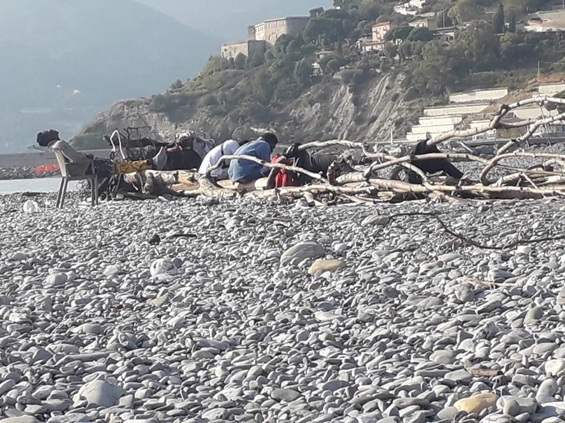
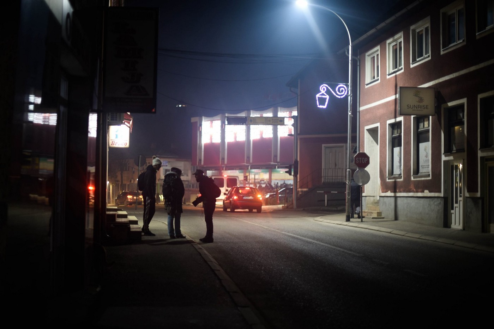

### AYS Daily Digest 31/10/19: Ventimiglia, illegal pushbacks as a daily reality at the French\-Italian border

Body of a dead man recovered in Turkey//Horrible testimonies of abuses from the people on board of the Ocean Viking//Field workers abandoned by authorities in Southern Italy//More arrivals to Eastern Italy from the Balkan route…

Credit: Progetto 20K\.
#### FEATURED

[Illegal pushbacks at the French\-Italian border](https://openmigration.org/analisi/a-ventimiglia-dove-i-respingimenti-di-migranti-sono-allinterno-delleuropa/?fbclid=IwAR3sglhRSiLMqcBndzI6yZ-nNiBpcVmdrZW802ImUvXvKV6n5vwv7EKseT8) are happening on a daily basis since few years, with an alarming increase in the past months, reaching a total number of 1\.855 \(sometimes the same person is counted multiple times\) just in the month of October\. More and more unaccompanied minors are being pushed\-back by French authorities, in addition to adults, who are forced to spend the night imprisoned in containers and held in inhumane conditions\. People are being denied any legal support and advice\.

Most probably, most of the young men come all the way from the Balkan route and, once caught by the French border agents, they are forced into containers for around 12 hours \(sometimes 20\) with no food and very little water\.

Food and general, basic medical care is organised by activists and small local grassroots organisations\.

French authorities denied access to the area of the “containers” in Menton\-Ponte San Luigi even to a member of the European Parliament, Magid Magid\. However, border agents shared their data on pushbacks in the past years: 15\.000 in 2014, 20\.000 in 2015, 36\.000 in 2016, 41\.000 in 2017 and 28\.000 in 2018\.

In the specific case of unaccompanied minors, the two States are accomplices in denying access to services and protection to those who try to cross the border\. Even though legal actions were taken to demand French authorities to grant protection to children on the move, and few legal cases were won \-forcing the competent bodies to take action\- the practice of refoulement is sadly still greatly adopted\.

It is very difficult to clearly define the number of presences in Ventimiglia, but the Roja camp, managed by the Red Cross, is hosting around 300 people at the moment, while Caritas and other networks supported around 250 people in transit\.

As mentioned before, more and more people are reaching Ventimiglia from the Balkan route\. But the numbers include those who were forced out of the reception system by the Salvini decree, those who landed “spontaneously” to Italy with small, not intercepted boats and those who received Dublin by other European states\.

Refugee Rights Europe published a brief, yet comprehensive overview of the situation at the French\-Italian border\.

#### TURKEY

The body of a 25–30 year old man was recovered off the shore of Gümüşlük, Muğla, today\. He is thought to be a refugee but has not yet been identified\. His cell phone is being examined for ID purposes\.

Original source [here](http://www.muglaturk.com/denizde_erkek_cesedi_bulundu_haber17894.html?fbclid=IwAR2Jai77sQQSvHuXWFBRaitWglW3TNeybyHQgz5oAiqEyepseze0o4rx4Ko) \.
#### LIBYA

After several days of waiting outside of GDF in Tripoli waiting for protection from UNHCR, the hundreds of people have now been allowed inside\. They left the Libyan detention centre Abu Salim [on Tuesday](https://twitter.com/sallyhayd/status/1189166117413097472) after living near starvation because Libyan authorities did not provide any food\.

■■■■■■■■■■■■■■ 
> **[Sally Hayden](https://twitter.com/sallyhayd) @ Twitter Says:** 

> > Multiple confirmations that the hundreds who left Abu Salim dc &amp; spent two days outside Tripoli's UNHCR GDF have now been allowed inside. UNHCR said the GDF was already overcapacity before this, so it's unclear what will happen next. [twitter.com/sallyhayd/stat…](https://twitter.com/sallyhayd/status/1189166117413097472?s=20) https://t.co/fHp429pSr5 

> **Tweeted at [2019-10-31 18:58:20](https://twitter.com/sallyhayd/status/1189979937916231681).** 

■■■■■■■■■■■■■■ 

While they are inside GDF, there are [reports that](https://twitter.com/sallyhayd/status/1190045933951696896) many are still sleeping outside within the gates and haven’t been given food or anything to sleep on\.
#### SEA

In [Mediterranean Saving Humans’s](https://mediterranearescue.org/news/memorandum-italia-libia-inaccettabile-rinnovo/?fbclid=IwAR2Iya3DX2Lc8kki_BAp3s5dzyCwH-Q26Hqh1NHl9WsFtDAUy_dnD18nA58) Joint Statement with Sea\-Watch, Proactiva Open Arms, and Sea\-eye, they stress that the deadline to renew the Italy\-Libya Memorandum of Understanding on Saturday “be used to demonstrate a change of pace\.” Their mandatory points:

_→ “ **arrivals in Italy have decreased at the expense** of the protection of people who, captured by the so\-called Libyan coast guard, have been brought back to a country where they suffer repeated violence and torture **aimed at collecting money** ;_ 
_→ as has been amply demonstrated, the Libyan interlocutor of the Italian government is **not able to represent a real state authority** , but since it is a country at war, agreements are made with factions that have control only over certain areas of the territory;_ 
_→ the Libyan government has been internationally recognized but is in fact composed of a series of armed militias that compromise its work;_ 
_→ **the equation less departures equals fewer deaths, abused in recent months is actually misleading** : as shown by the data of UNHCR and IOM, the relationship between departed people and deaths in 2018 was 1 to 29, while in 2019 it has become 1 to 6\.”_
#### GREECE

Kos, a hotspot less frequently discussed, is having a crisis in reception conditions\. In an update from [RSA](https://rsaegean.org/en/refugees-trapped-on-kos/?fbclid=IwAR3JgAojkM7OqNpO82gvebS8ReOnWn87NvH55_UiJXnjW1JIqArV6hnMjOM) :

> “Hundreds of refugees are forced to live in boxes made out of cardboard and reed or makeshift sheds inside and outside of the Kos hotspot, in the utmost precarious and unsuitable conditions, without access to adequate medical and legal assistance\. Since last April, the Kos hotspot, located on a hill at the village of Pyli, 15km outside of the city, is overcrowded, while the number of transfers of vulnerable refugees from the island to the mainland is significantly lower compared to other islands, therefore creating an unbearable sense of entrapment for the refugees\.” 

[Mobile Info Team for Refugees](https://www.facebook.com/mobileinfoteam/photos/a.1800063030222418/2572947419600638/?type=3&theater&ifg=1) in Greece offers some sound advice for asylum seekers trying to understand their possibility for work outside of Greece:

> “ It is possible, but in fact it is often very difficult\. With your Greek asylum status, you are only allowed to work in Greece…To be able to work in another European country, you must obtain a working visa\. Every country has different requirements for it\. So you first need to check if you are able to meet the requirements for a working visa in the country where you want to work in\. For example, some countries require that you already have a signed job contract, proof of an accommodation where you will stay, or proof of skills of the country’s language\. If you have higher qualifications, like a university degree, your chances might increase\. When you are sure you meet the criteria and you have all the required documents, you can apply for an appointment with the embassy or consulate of the country you want to work in\.” 

#### ITALY

Pozzallo, Sicily\. The 104 people rescued by the Ocean Viking landed yesterday at the port\. All of them bring terrible stories of abuses and torture in Libyan centres\.

> “As soon as I entered the Libyan territory, I was forcibly detained for 4 days and a friend of mine had to pay a ransom to be freed\. Everyone had to go through this procedure, so those who paid could go and those who couldn’t had to stay and face additional torture\. In June and July, around Tripoli, I heard bombs and gunshots\. \[…\] I heard the gunshots penetrating my house and hitting the walls, it was horrible…”\. 

> “Before leaving Libya, in August, September, October, I was exploited by the traffickers and I had to work without being paid”\. 

More testimonies of the horrific conditions in the Libyan hell and the journey at sea can be found [here](https://www.facebook.com/MEDUonlus/photos/a.10151424368349817/10157661782329817/?type=3&theater) and [here](https://www.facebook.com/MEDUonlus/photos/a.10151424368349817/10157661819009817/?type=3&theater) \.

San Ferdinando, Calabria\. This morning, [authorities proceeded to register those field workers](https://www.facebook.com/comitatolavoratoridellecampagne/videos/725092491335562/?hc_location=ufi) who demanded to access the “official” camp, which is the only possible housing solution for them\. Around 50 people were registered, but more and more will come for the picking season and, again, they will not be provided with a place to sleep\. As a local network of activists stated, in the past weeks the entrance to the camp had been systematically denied to those workers who were not present in the area for a few months, ironically, as the camp had been left half empty\.

Despite the numerous protests, no real solution was found by the authorities\.

Gorizia\. Yesterday morning, [14 people were stopped by the Italian authorities](https://www.ilfriuli.it/articolo/cronaca/gruppo-di-migranti-fermato-in-stazione-a-gorizia/2/208870?fbclid=IwAR2Qx3fi8UxdW3Wc404C-lBbHtD_wM4km4HupkP3fqdmM3aVqmum50lyG5M) while trying to enter the country via train\. They were all coming from the Balkan region and were immediately submitted to identification procedures\. Nine of them applied for asylum, the other five were taken to the local Questura to be notified with an expulsion order\.

At the beginning of the week, 25 more people were taken to other reception centres in the region\. Among them, 6 minors\.
#### BOSNIA AND HERZEGOVINA

Photo by Angélica Sánchez

In an update from [No Name Kitchen](https://www.facebook.com/pg/NoNameKitchenBelgrade/posts/?ref=page_internal) :

> “In Velika Kladusa we have also witnessed how they force refugee people inside vans to take them to Sturlic, a small village, where they are dropped in the middle of nowhere, forced to walk for hours back to their ‘homes’, without water or food\. Moreover, **controls in buses have increased** \. When the police officers stop a bus, they force all the migrant people to come down and they take them to Vucjak\. Some volunteers have witnessed the “apartheid” that is taking place inside the buses, where migrants or dark\-skinned people are being segregated from the locals or lighter\-skinned ones and forced to seat at the rear of the bus\. They are also being forced to give up their seat to a local if the bus is full — even when they have sat first or got on to the bus in previous stations\. Fortunately, the forcible relocation of people to Vucjak and Sturlic has decreased these past days\.” 

**If you wish to contribute, either by writing a report or a story, or by joining the info gathering team, please let us know\.**

**We strive to echo correct news from the ground through collaboration and fairness\. Every effort has been made to credit organizations and individuals with regard to the supply of information, video, and photo material \(in cases where the source wanted to be accredited\) \. Please notify us regarding corrections\.**

**If there’s anything you want to share or comment, contact us through Facebook, Twitter or write to: areyousyrious@gmail\.com\.**

_Converted [Medium Post](https://medium.com/are-you-syrious/ays-daily-digest-31-10-19-ventimiglia-illegal-pushbacks-as-a-daily-reality-at-the-french-italian-dc56fbbf90e5) by [ZMediumToMarkdown](https://github.com/ZhgChgLi/ZMediumToMarkdown)._
