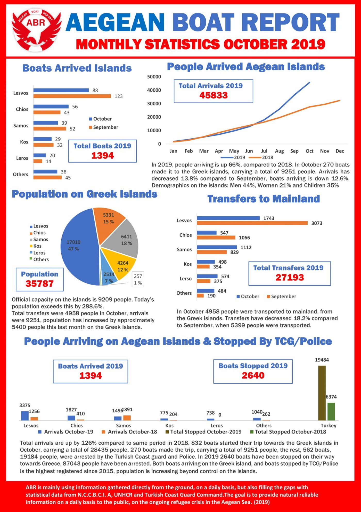
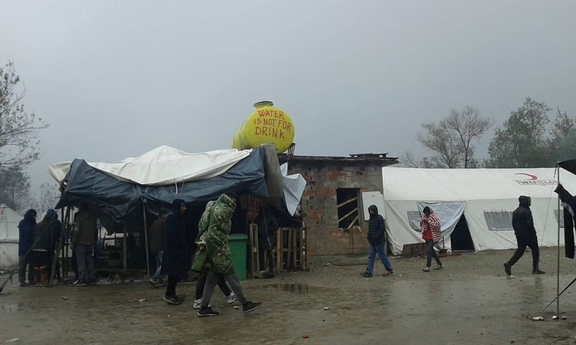

### AYS Daily Digest 1/11/19: More uncertainty for Refugees in Libya

[Are You Syrious?](@AreYouSyrious?source=post_page-----4a5579539934----------------------)

[Nov 2](ays-daily-digest-1-11-19-more-uncertainty-for-refugees-in-libya-4a5579539934?source=post_page-----4a5579539934----------------------) · 7 min read

More about proposed change in Greek asylum law /// 300 people rescued in the Med /// Updates from Vucjak /// Death in Calais /// Revolts in French CRAs

We want to live, Calais \(Photo by [Calais Migrant Solidarity](https://calaismigrantsolidarity.wordpress.com/2019/11/01/death-at-the-border-mort-a-la-frontiere-4/?fbclid=IwAR0S0-5VkXP7d8nHnO4hZN_S6JcNGXWNmtJpSZIqjMh06LvucuXWJTaTpnU) \)
### FEATURE — More uncertainty for refugees in Libya

Last night, refugees who had camped outside UNHCR’s GDF centre in Tripoli for two days after having been forced out of Abu Selim detention centre were allowed into the main gate but not into the building\.

As Andrea Gagne [report](https://twitter.com/AndreaGagne/status/1190296713724071937) , the initial optimism did not last: “refugees were not given a warm bed or food to eat\. Instead they slept outside on the ground once more inside the compound, at the basketball courts\. There is still no protection from the elements, and they have no idea what to expect\.”
### SEARCH AND RESCUE

The 2017 Italy\-Libya agreement will be automatically renewed for 3 years, SOS Mediteranee warns\.

> _In addition to equally worrying support provided by the [E](https://www.facebook.com/hashtag/eu?hc_location=ufi) U, Italy will continue to train, equip & finance Libyan coastguards to intercept boats in distress & bring back to Libya people fleeing from there\._ 
 

> _Tomorrow, the 2017 Italy\-Libya agreement will be automatically renewed for 3 years\._ 
 

> _In addition to equally worrying support provided by the \#EU, Italy will continue to train, equip & finance Libyan coastguards to intercept boats in distress & bring people fleeing back to Libya\._ 

### 240 people rescued between Friday and Saturday morning in the Central med\.

A total of 200 people were rescued by Italian vessel Asso30\.

Another 49 people were [rescued](https://twitter.com/alarm_phone/status/1190383263711420416) by the Maltese coast guard\.
### Rescue in the Western med

A total of 62 people were [rescued](https://twitter.com/EPAndalucia/status/1190198588388859904?fbclid=IwAR2g2F5LpnN4W7tYY_OV7mGQ6cpVGyYjO1VHrkkR295nDNTiMihfjSCvJz8) in the Alboran Sea\.
### Safe harbour for Alan Kurdi

The Alan Kurdi has a safe port\! 
“Even though Sicily is in sight, the ship will have to sail another 36 hours to Taranto\. We are incredibly relieved to bring the remaining 88 exhausted rescued persons to safety soon\.”

GREECE

### Greece’s new asylum law

With a backlog of over 68,000 applications, the Greek asylum system is one of the most clogged systems in Europe, resulting in years of waiting for interviews and final decisions on the status of applications\.

The newly proposed asylum law introduces longer detention as the cornerstone of the official refugee and migration policy, [reportedly](https://balkaninsight.com/2019/11/01/tougher-greek-asylum-laws-criticised-by-rights-groups/?fbclid=IwAR2xG8ut98ZAR44cisza8H5cFYgl2KDSpMNpOR2ieO_JvcGA24GWDzFoZRw) increasing the maximum time limit for the detention of asylum seekers from three to 18 months\. Detention in extreme cases could reach up to 36 months\. The new law defines that even unaccompanied children and other vulnerable asylum seekers could be examined under accelerated procedures\. Also, PTSD is scrapped from the list of conditions that entitle applicants to obtain vulnerable status\. MSF defies the proposed changes affecting the health of the people:

There will no longer be an option of introducing the independent experts usually sitting in second\-instance committees, but the judge will be the only instance, while documentation will be the more enhanced element in the procedure\. Calling for the Greek government to first prioritise resolving the humanitarian crisis that the deeply flawed deal with Turkey has caused for asylum seekers, and ensure a fair and efficient asylum procedure, HRW also [protested](https://www.hrw.org/news/2019/10/29/greece-asylum-overhaul-threatens-rights?fbclid=IwAR20Cg-38LIF6OiXs-Fk-OKsx8bmiXDXOO9TN1HnzPxzEkS3nuv95Vo9uJ0) these actions\.

“The bill is a naked attempt to block access to protection and increase deportations in the face of the recent increase in arrivals,” the Greece researcher at Human Rights Watch said\.
### Institution and INGO backed limbo

**Corinth** , a [transit](https://www.kathimerini.gr/1040855/article/epikairothta/ellada/prosfygiko-sxediasmos-gia-samo-kai-xio) camp run by the IOM, from where asylum\-seekers are distributed to other sites on the mainland or to ESTIA flats, is a disputed insecure place criticised by many\. In mid\-October, RSA [reported](https://rsaegean.org/en/refugees-transferred-to-corinth-transit-camp-are-left-in-precarious-limbo/?fbclid=IwAR2Ae7s17nIZtYo_0ak1SoDEfe4B3MC8cyBiN6dRIjbKOHSyxSXFvBiKqjI) , the camp’s population consisted of over 600 people, mainly including dozens of families with children transferred there in mid\-September following their eviction from four refugee squats in central Athens as well as highly vulnerable asylum\-seekers from the overcrowded Aegean islands\.

> _Many of those transferred by the authorities after a first raid on Schisto camp and after the following raids in Corinth left the camp the same day and tried to find alternative housing solutions\. Those who stayed are waiting to be assigned shelter somewhere else in mainland Greece and hope to be returned to a flat or camp in Athens\. They described how their children have been pulled out from their school and how the medical and mental health care they had been receiving was halted\._ 

According to the report, the camp’s residents including pregnant women, parents of newborns and sick persons describe how they have been forced to seek the necessary medical assistance outside the camp, often without the assistance of an interpreter\. Their mental health has been deteriorating further ever since they reached the camp in Corinth due to the squalid living conditions, the marginality of the camp and the lack of any educational and recreational activities\. Read the entire report [here](https://rsaegean.org/en/refugees-transferred-to-corinth-transit-camp-are-left-in-precarious-limbo/?fbclid=IwAR2Ae7s17nIZtYo_0ak1SoDEfe4B3MC8cyBiN6dRIjbKOHSyxSXFvBiKqjI) \.

**Nea Kavala** , in the north of the country, has seen some people living in the camp for more than two years, local volunteers warn\.
“This situation demands another approach to help the residents\. As they foresee having to build up a life in Greece, they need to become as self\-sufficient as possible\.”

> _Drop Center will still be the space that we can use for seasonal distributions to the residents in the camp\. We are about to finish the building project and one of the first activities inside the Drop Center will be a distribution of winter clothes,_ 

### Athens

Scenes of everyday life in the “civilized” country that gave “birth to democracy”\.

> _Sea, sun and police brutality\. Book your holidays now\!_ 

The following video was documented on Thursday 31 October 2019 in the Athens Metro Station in Syntagma Square:

Also in Skydra, Northern Greece, a racist local priest at a council meeting [urged](https://www.keeptalkinggreece.com/2019/11/01/skydra-priest-racist-rant-refugees/?utm_source=feedburner&utm_medium=twitter&utm_campaign=Feed%3A+KeepTalkingGreece+%28Keep+Talking+Greece%29&utm_content=FaceBook) residents not to hesitate to use weapons against “illegal immigrants”\.
### Volunteers Call

Lifting Hands International is urgently looking for volunteers in Serres, Northern Greece\. They offer psycho\-social support in their community centre which includes a women’s safe space, a child\-friendly space, an arts and recreation space, an educational centre and a warehouse\.

They are looking for English teachers, German teachers, guitar teachers, child\-friendly space volunteers, and female\-friendly space volunteers to join their team in December \(1st to 22nd\) and in January \(from the 2nd onward\) \.

Read more [HERE](https://web.facebook.com/groups/1666846223566047/permalink/2360006834249979/?hc_location=ufi) \.

BOSNIA AND HERZEGOVINA
### Updates from Vucjak

Ipsia BiH, active in the Una\-Sana canton since June, have been going for tea distribution in Vucjak camp\. They [wrote](https://web.facebook.com/IPSIA.BIH/posts/3182906098447867) about the camp:

Vucjak \(Photo by [Ipsia BiH](https://web.facebook.com/IPSIA.BIH/photos/pcb.3182906098447867/3182700775135066/?type=3&theater) \)

> _Conditions in Vucjak, the informal camp on the border between Bosnia and Croatia where hundreds of migrants have been present since June 2019, are constantly getting worse, especially with the arrival of winter\. In the last weeks the number of people forced to live in that camp has increased significantly exceeding a thousand people\._ 
 

> _At the beginning of last month, the municipality of Bihać announced they will no longer pay for the camp’s management costs\. But despite this, deportations by the police are commonplace\._ 
 

> _Every day all people who don’t have access to the formal camps in the Bihać area are brought to Vucjak, and among these people there are also unaccompanied minors\._ 

### Donation call

A fundraiser was launched for the project If You Do Mind, of No Name Kitchen\. Help them [HERE](https://www.gofundme.com/f/raccolta-fondi-per-il-progetto-if-you-do-mind?utm_source=whatsApp&utm_medium=chat&utm_campaign=p_cp+share-sheet&fbclid=IwAR0lyWJghWTJvSWkvirBdMmdaexRN4P-OGa17sDR33RTcYk_CGvolM2TSbc) if you can\.

FRANCE
### Revolts and breakouts in detention Centres in the Ile\-de\-France

A bas le CRA [report](https://abaslescra.noblogs.org/revolte-au-cra2-du-mesnil-amelot-3-batiments-en-feu-hier-soir/) that a revolt started on Monday October 28 in three buildings of the CRA2 in Mensil\-Amenot, near Charles de Gaulle airport, with prisoners setting fire to a number of cells\. According to the report, after the revolt had been suppressed, the administration of the CRA continue to use the same burned cells\. Some of the detainees have been put into solitary confinement\. Another revolt started on Sunday 27 in Plasir\.
### Man found dead in Calais

Calais Migrant Solidarity [report](https://calaismigrantsolidarity.wordpress.com/2019/11/01/death-at-the-border-mort-a-la-frontiere-4/?fbclid=IwAR0S0-5VkXP7d8nHnO4hZN_S6JcNGXWNmtJpSZIqjMh06LvucuXWJTaTpnU) that a 24\-year\-old man was found dead on Friday morning\.

> _Though said to have died accidentally, he was a victim of of the unhealthy and dangerous conditions migrants are made to live in by the municipality to defend the UK’s border\._ 

> _A vigil will be held as usual on November 2nd, at 6\.30pm, next to Parc Richelieu in Calais, on homage to the young man and to denounce once again the murderous borders\._ 

**If you wish to contribute, either by writing a report or a story, or by joining the info gathering team, please let us know\.**

**We strive to echo correct news from the ground through collaboration and fairness\. Every effort has been made to credit organizations and individuals with regard to the supply of information, video, and photo material \(in cases where the source wanted to be accredited\) \. Please notify us regarding corrections\.**

**If there’s anything you want to share or comment, contact us through Facebook, Twitter or write to: areyousyrious@gmail\.com\.**

_Converted [Medium Post](https://medium.com/are-you-syrious/ays-daily-digest-1-11-19-more-uncertainty-for-refugees-in-libya-2c2cf69f067e) by [ZMediumToMarkdown](https://github.com/ZhgChgLi/ZMediumToMarkdown)._
