### AYS Special: Documenting human rights violations in Vučjak camp
#### Our observations begin on the 14th of June with the creation of Vučjak, a camp near Bihać city in Bosnia, which has come to exemplify the lack of dignity and humanity for people\-in\-transit attempting to claim asylum in Europe\.

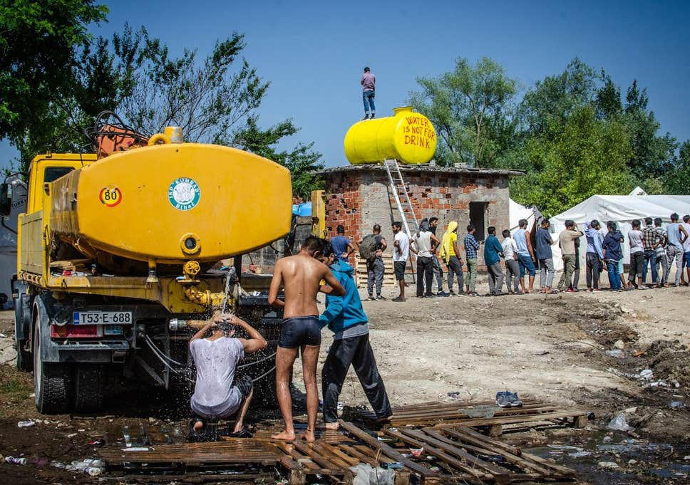

No way out, no protection, no dignity: a snapshot from Vučjak camp\. Photo: Thom Davies

Bihać, Bosnia and Herzegovina, is a city in turmoil: located on the margins of Europe, Bihać is beset with a political and humanitarian crisis created by the EU’s externalization policies\. Originally in Bihać from June to August 2019 to record illegal pushbacks, two independent human rights monitors found that people\-in\-transit had as much to say about the violence of Bosnian police in Bihać as they had to say about Croatian police along the border\. These monitors began compiling the only [comprehensive report](https://www.borderviolence.eu/wp-content/uploads/On-the-Margins-of-Europe-Report-on-Bihac.pdf) on the human rights situation in Bihać\. Utilizing interviews with and evidence from people\-in\-transit, journalists, humanitarian actors and officials and comparing against relevant national and international law, the authors evaluate camp conditions, the behavior of police and private security forces, eviction practices, treatment of minors and access to asylum and registration\. This report reveals a consistently overburdened, inadequate and uncoordinated humanitarian effort in Bihać, one bolstered by state deficiencies, lack of political will and pervasive police violence and hostility, including violence from private security forces at IOM\-managed camps\.

Since the writing of this [report](https://www.borderviolence.eu/wp-content/uploads/On-the-Margins-of-Europe-Report-on-Bihac.pdf) , the situation has become even more precarious: authorities have simultaneously halted funding and humanitarian aid to Vučjak and have re\-strengthened efforts to take people\-in\-transit from public spaces to the now critically over\-populated and under\-serviced Vučjak, which is now deprived of medical aid and water\. As this report shows, the crisis in Bihać extends past merely what is happening within Vučjak and is intimately tied to the EU’s border practices, particularly the illegal pushbacks that Croatia and Slovenia participate in\. There is no political solution in sight other than pushing for two things: providing basic necessities and respect for human rights for people\-in\-transit, and reforming the European Union’s dysfunctional asylum system and the persistent lack of access to this system at the EU’s borderlands\.

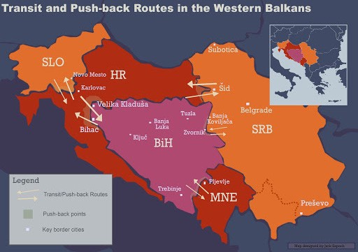

> The authors ask you to keep one thing in mind as you read: At the most fundamental level, this is a document about what it means to be a person\-in\-transit today in a Europe that has failed its commitments to uphold its own institutionalized system of human rights protection\. 

### Summer of 2019: Creation of the disaster

Since Vučjak was created on the 14th of June in Bihać, the situation inside this camp on a former landfill has only deteriorated\. Conditions are more drastic than ever: volunteers providing medical aid have been kicked out, leaving residents without healthcare\. Health services and conditions are so bad that cases of Hepatitis B and C, Tuberculosis and now HIV/AIDS and Malaria have been identified among people\-in\-transit in the Una\-Sana Canton\. In October, Bihać Mayor Suhret Fazlić cut all aid to Vučjak, forcing the local Red Cross to halt their services in the camp\. On October 21st, local authorities ceased providing water to the camp\. At the same time, police have elevated their efforts to transport people to Vučjak, bringing the population to 2,400 in October, vastly exceeding capacity\. Videos of police detaining and marching large groups of people proliferate on social media\.

On November 15, 2019, IOM will be closing both Miral \(in Velika Kladuša\) and Bira camps, kicking out over 2,000 people without having secured alternative accommodation centers, all while the temperatures continue to drop\. Recommendations for locations for new reception centers have been consistently rejected by local authorities\. As occurred last year, the situation will continue to be managed at the last minute in an ad hoc fashion\. The key difference is that IOM, the Bosnian authorities and the EU had the entire year to plan for winter and to create lasting solutions to the migration influx in BiH\. No such solutions are in sight\.

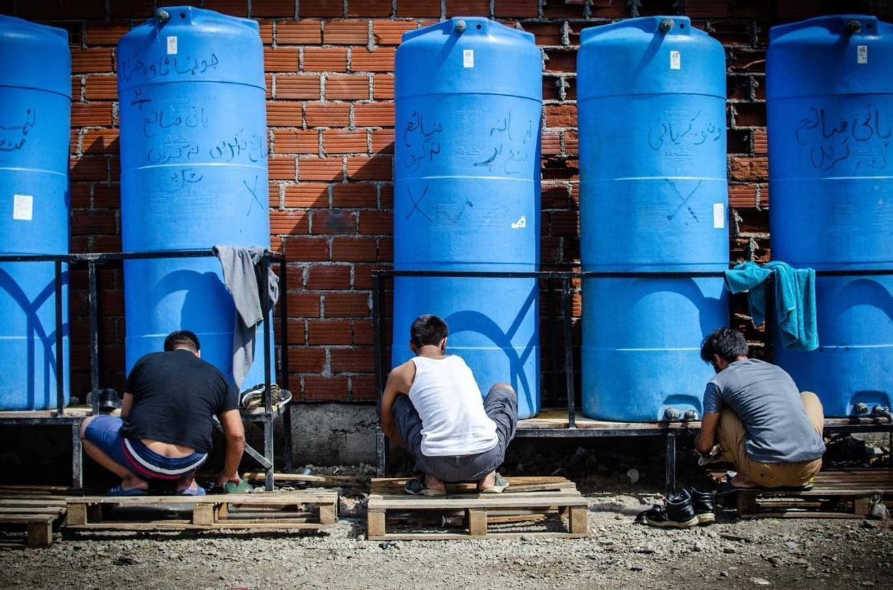

Tanks filled with water daily in Vučjak\. On them is written: “Please save water\.” / Photo: Thom Davies\.

“On the Margins of Europe”, a special report published by AYS, traces the roots of this humanitarian disaster to the key period of summer 2019, when Vučjak was established and began gaining international attention\. Two border violence monitors affiliated with Border Violence Monitoring Network \(BVMN\) have compiled the only comprehensive evaluation of human rights violations of people\-in\-transit in Bihać\. Recording from June to the end of August 2019, this report was created by conducting interviews with people\-in\-transit, journalists, humanitarian actors and compiling data and evidence from official sources and the media\. Beginning with an in\-depth evaluation of camp conditions within Vučjak, this report evaluates all major aspects of life for a person\-in\-transit in Bihać: the behavior of police, private security forces and camp officials, the lack of access to food, healthcare and legal protection and restriction of movement\. The deteriorated situation of people\-in\-transit in BiH is not new and to understand how to solve the current humanitarian and political crisis, we must understand how it has unfolded and the roles of people\-in\-transit, BiH officials and international actors in these crises\.

Below is a summary of their main findings and a link to a downloadable pdf of their report\.
### **Three stages of violence**

An evaluation of the situation in Bihać reveals three overarching patterns of violence: violence during transport and outside Vučjak, violence during evictions and removals, and violence from private security forces\.

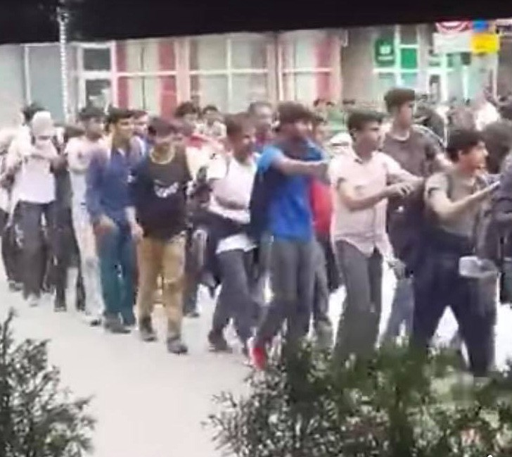

Police marching people\-in\-transit to Vučjak\. Photos posted on Facebook\.

People\-in\-transit are reporting that they are most commonly physically assaulted outside and on the streets\. The current data we’ve collected indicates consistent and apparently systematic attacks by the police while individuals are entering, exiting and being transported to Vučjak camp\.

> “Police in the center tried to catch us and I ran\. But they caught me and slapped me in the face\. They took us to the jungle camp \[Vučjak\] \.” 

> _\-Indian man, 27\.08\.2019_ 

We believe these attacks on people\-in\-transit might be an attempt to instill fear in and intimidate people\-in\-transit into self\-limiting their own freedom of movement, which many people have begun to do\.

> “Near two months, always in Vučjak\. I don’t try to go to Bihać because Bihać police beat \[us\] \. Even here they don’t want \[people\-in\-transit\]…in Bihać\. Not allowed to go to market\. There is not too much difference between Bosnian, Croatian and Slovenian \[police\] \.” 

> _\-HM, 26\.08\.2019_ 

An anonymous observer who visited Vučjak told us this:

> “We saw migrants who…claimed they had been beaten\. One…was on the asphalt of the street, crying in tears\. Two Bosnian policemen reacted very aggressive towards us, telling us that we shouldn’t be here and they have the right to treat the migrants the way they want to\.” 

> _\-Anonymous, 02\.08\.19_ 

Assault is not the only cruel and degrading treatment occurring during transport:

> “People come to market, buy groceries and wait\. Wait \[for\] police to take them \[to\] Vučjak\. Police understand\. They say ‘I am not a taxi\.’ Then they make them walk\.” 

> _\-Indian man, 27\.08\.2019_ 

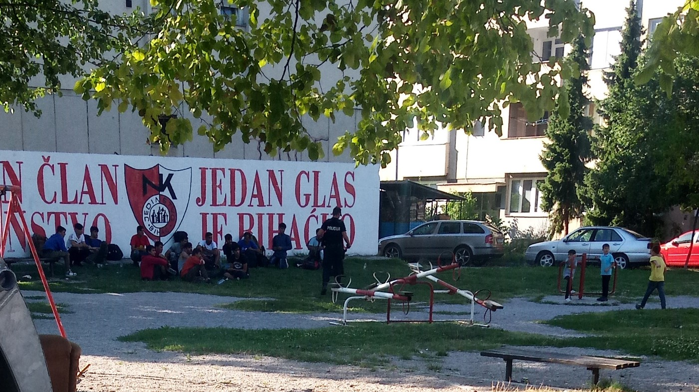

Police detaining people on the move in Bihać\. Photo: Margot Durand and Medina Husaković

Beginning in July, we began to observe a disturbing pattern emerging: local officers, in their near\-daily round\-ups of people\-in\-transit in the city center, would now, instead of driving them to Vučjak, make them march in a line on foot to the camp\. These groups of marchers often number in the hundreds\. Sometimes, the police make them form a line holding each others’ shoulders\. Sometimes, the police make them walk very publicly through the city center while other times they drive them outside of town before forcing them to walk\. The police have done this in the summer heat and heavy downpours\. This practice developed not out of logistical need but rather to punish and to degrade\. Most recently, the police marched more than 1,000 people to Vučjak in October, 2019\.

The second venue for violence is during evictions\. On the 14th of June, the Una\-Sana Canton authorities, specifically the MUP of the Una\-Sana Canton and the Cantonal Inspection Directorate, began to evict hundreds of people\-in\-transit out of abandoned houses, hostels and informal outdoor settlements\. Law enforcement evicted people without ensuring the presence of essential services such as electricity, food, showers and toilets, moving them to Vučjak, which was only four tents set up for 282 evicted and removed people\.

In the weeks following the evictions, we received messages from dozens of people who reported being beaten and injured by the police during evictions and removals\. We observed, both in direct testimony and in photographs, a litany of violences: bruised and battered bodies, black eyes, open wounds, split lips and teeth beaten out of mouths\.

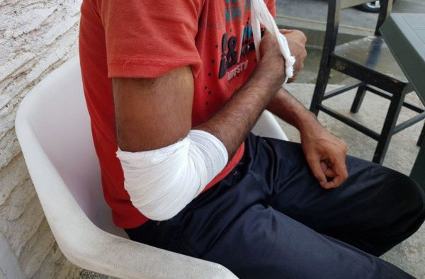

Beaten in Croatia, beaten in Bosnia: Photo: Margot Durand and Medina Husaković

> “In one room there were twenty people sleeping, mostly on their stomachs, and when the police entered they walked on the backs of the sleeping people\. For ten or fifteen minutes the police entered each room in the apartment and the respondent could hear people shouting throughout the three floors of the building\.” 

> _\-Reported by BVMN, 26\.06\.2019_ 

> “I was walking in the street when at least 5 police cars, both civil and official, drove past quickly\. The scene was really quick: a policeman managed the traffic while police cars and policemen surrounded the house where people\-on\-the\-move were paying to stay\. I walked in front of this house and I saw one person sitting on the terrace with his hands behind his head\. From the street, I could hear people screaming, shouting\. I could hear slaps\.” 

> _\-Reported by BVMN, 14\.06\.2019_ 

Several media outlets filmed the arrival of evicted and removed people to Vučjak, where we can see that they are visibly injured\.

> “Even animals here have rights, \[…\] They \[police\] caught us in the street, put us in a corner and they beat us\.” 

> _\-AM, 24\-year\-old, June 2019_ 

> “Me, they beat me in the van, but my friend, they took him outside, I could just hear screams\. He was screaming\. They beat him really strong\. When he came back into the van, he looked like going out of a boxing ring\.” 

> _\-RK, 34\-year\-old Algerian, 24\.06\.2019_ 

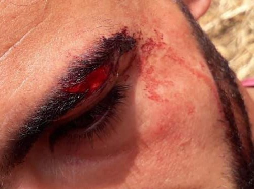

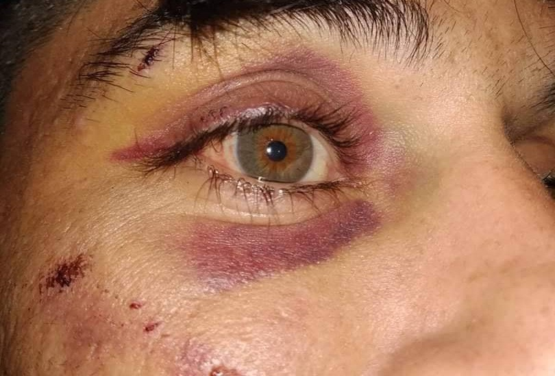

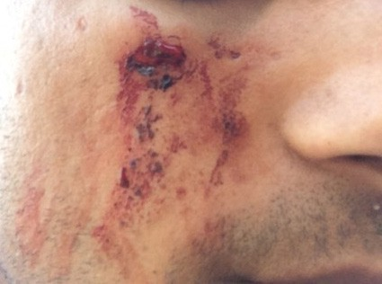

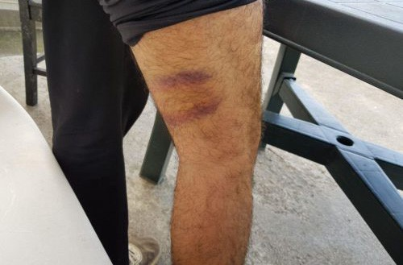

Photos of injuries taken in the Bihać area\. Photos: Margot Durand and Medina Husaković

Violence not only occurs at the hands of law enforcement but from private security forces\. During our time in Bihać, we have heard countless allegations and complaints about the private security forces hired by IOM to safeguard the IOM\-run Bira camp\. These security guards regularly beat and harass camp residents, and this has been occurring the entire length of time we monitored\.

> “The security guard beats people\. But people \[who\] have no card, he fights them\. And \[Bihac\] police, he see this but no talking, \[doesn’t do anything or intervene\] \.” 

> _\-Pakistani man, 21\.08\.2019_ 

> “He \[security guard\] oppress\[es\] people and badly behaves with people…he \[hits us a lot\] \. For no reason, just hit\. Last night a friend of mine \[was\] hit\. He \[security guard\] was not letting him into the camp, so he was sitting in the parking lot…security guard hit him\.” 

> _\-Pakistani man, 28\.08\.2019_ 

Not only this, but private security forces have regularly and arbitrarily required energy drinks, cigarettes and/or money \(usually 10km\) for re\-entry into the camp\.

> “People give money, give food, give cigarette for security guards\. After, security lets him inside the camp\.” 

> _\-23\-year\-old Algerian man, 31\.08\.2019_ 

These patterns not only violate international standards for the safeguarding of people\-in\-transit, but they violate IOM’s own standards which aim to “enhance…respect for the human rights of migrants in accordance with international law” and to “uphold the human dignity and well\-being of migrants\.”

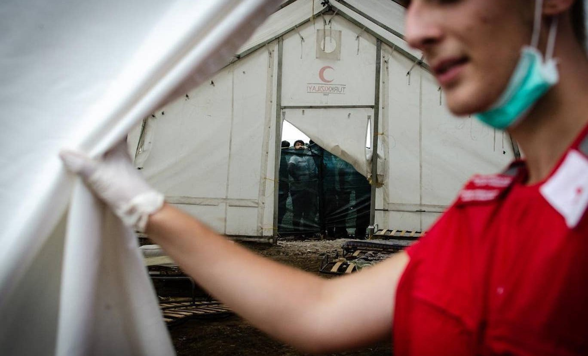

Medical tent in Vučjak camp near Bihać: Photo: Margot Durand and Medina Husaković
### **Increasing restriction of movement**

Within Bihać, since the 14th of June, there has been an increase in the forced displacement and removal of people\-in\-transit and asylum\-seekers from town centers and the forced marching of people\-in\-transit to Vučjak\. Individuals are often arrested and/or detained due to lack of official documentation or have their documentation seized by local law enforcement\. Individuals that are detained are not told why they are detained but have come to expect detention or harassment of some sort\. Often, such interactions are a precursor to abuse and violence\. Before the removal of people sleeping in the meadow outside of IOM\-run Bira camp, efforts to restrict freedom of movement were rudimentary: access to the adjacent supermarket was controlled by the police and private security linked by a walky\-talky\. General hostility from the local population served to informally limit movement\. However, the local authorities could enact greater restriction on movement once Vučjak was created\. With Vučjak, if people\-in\-transit ventured further than the limits set in the proceeding months, they could be punished by transportation to Vučjak and subsequent restriction of movement to Bihać\. Speaking to people\-in\-transit, this tactic has appeared to work as Vučjak camp has become a sort of bogeyman among people\-in\-transit who live in fear of being arbitrarily removed to a camp without proper facilities and consequently becoming stuck there\.

> “I also keep \[inside\] Bira\. If I go out, then I will not \[be\] let in\.” 

> _\-Pakistani man, 21\.08\.2019_ 

> “Me they \[police\] take two times\. I show them my stay papers\. They don’t care, they take me to jungle camp anyway\.” 

> _\-Indian man, 21\.08\.2019_ 

> “I am in center and police push me, tell me go\. Why go? Treat me with respect\. I do nothing\.” 

> _\-Anonymous, unknown date_ 

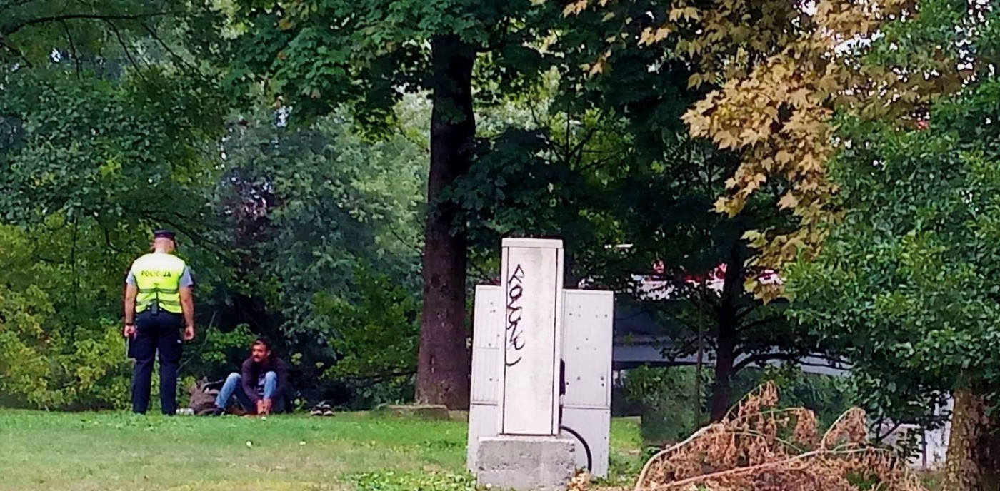

People are taken off the streets and taken to Vučjak\. Photo: Margot Durand and Medina Husaković
### **Minors stripped of protection**

Current observations indicate that Bosnia and Herzegovina appears not to be meeting all international guidelines and best practices relating to the treatment of minors both unaccompanied and separated\. Firstly, it is not clear how consistent the government of BiH is in providing unaccompanied or separated minors with legal guardians\. The EU identified 324 unaccompanied minors in 2018 overall; however, only 29 were appointed a legal guardian, provided for by law\. In the first quarter of 2019, UNICEF counts about 1,225 unaccompanied minors in BiH\.

Secondly, reflective of the treatment of adult refugees and migrants, minors in northwestern BiH, regardless of their accompaniment status, have had their registration cards confiscated by security guards when exiting the IOM\-run Bira camp in Bihać\.

> “I was going on game when I came at gate \[of IOM\-run Bira camp\] \. They took my ID card and asked me to go\.” 

> _\-MB, 17\-year\-old Pakistani, 19\.06\.2019_ 

Stripped of identification, minors are then stripped of protection against police brutality and greater access to asylum procedures\. After seizing documentation, we’ve heard cases of police taking minors to Vučjak to be among adult men\. Within Vučjak, the youngest accompanied child was 7; the youngest unaccompanied child we’ve heard reports of was 11\. One end of this problem is due to local law enforcement: police officers ignore signs that someone is a minor, whether physical or otherwise, and take them to places unsafe for minors\. The other end of the problem occurs within the camp\. Officially, Vučjak settlement is a camp for adult men and the Red Cross is mandated to alert Save the Children when they become aware of any minor within Vučjak settlement\. Save the Children then takes the minors to the IOM\-run Bira camp\. However, sources show that young children removed to Vučjak often stay there, with one anonymous source confirming that a 12\-year old child had been removed by Save the Children only to return to Vučjak\. At the time of contacting this source, the child had resided in Vučjak for two days and Red Cross had not contacted Save the Children a second time\.

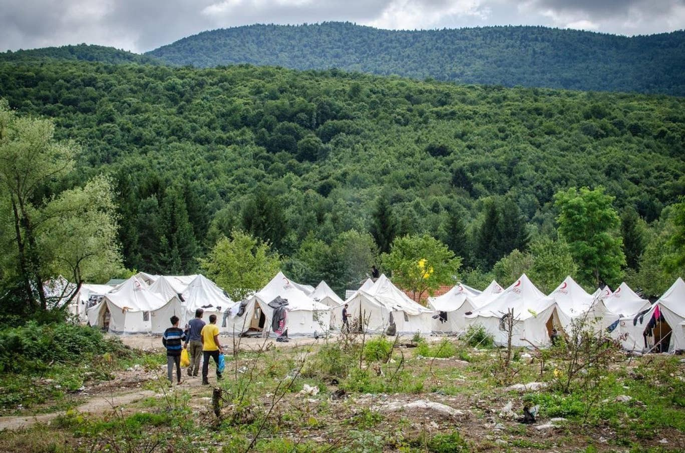

The “jungle camp” Vučjak at the site of the old landfill\. Photo: Thom Davies

As this example illustrates, other than informing Save the Children, there are currently no other coordinated, effective mechanisms to ensure the security of any children residing among adults in Vučjak\. When asking camp residents about minors in the camp, a 23\-year\-old Pakistani responded that these minors “don’t have other place” and that they are there for a long time, some with family, including a young boy who lives with his uncle\. Relevant authorities should act to propose or move family members to the IOM\-run family camp, Borići, in accordance with the principles of family unity and protection of minors\. However, despite the fact that every actor at Vučjak is aware of this problem, minors continue to reside among single men in an environment where they are significantly at risk of witnessing and/or experiencing violence, such as physical or sexual violence\.

Due to a confluence of factors, Vučjak is a place where human trafficking networks and smugglers operate\. The vulnerability of minors often puts them at risk of being recruited by smugglers and these networks, deepening the illegality of their existences\. Unfortunately, we met many minors involved in smuggling activities in Bihać\.

More generally, we observe that there is little or no difference between the behavior shown to adults and the behavior shown to minors, particularly male minors, by local authorities and private security forces\. Minors, particularly male minors, are often victims of violence from police\.
### **Registration and Asylum Seeking**

The registration of refugees, asylum\-seekers and migrants is a “key protection tool” and the first step in the legal and physical protection of people\-in\-transit\.

One of the most concerning aspects of life for a person\-in\-transit in BiH is that the asylum process simply doesn’t work\. According to the European Commission, “persons looking for international protection cannot effectively access asylum procedures” in BiH\. Despite being a “transit country”, BiH still has a sizable portion of asylum seekers\. UNDP reports that, as of the end of August 2019, out of 39,507 formally\-expressed intentions to seek asylum since January 1st, 2018, only 2,002 people \(5\.06 percent\) had formally lodged their asylum claim with the Sector of Asylum\. Furthermore, BiH grants asylum to so few individuals: from January to August 2019, BiH granted no asylum\-seekers refugee status\. This is often because it is difficult for asylum\-seekers to get access to the Sector of Asylum on time before their temporary document expires\. The Sector of Asylum only conducts an average of three interviews of asylum\-seekers per month\. One person\-in\-transit we spoke to was told he had to pay a fee to apply for asylum\. Another man was discouraged from applying for asylum because he was told the process would be needlessly long and, while waiting, he would not be able to work:

> “I will apply for asylum here\. But they tell me…you will stay five years here \[Bosnia\] but five years you will wait for papers\. No work, \[you cannot work\] \.” 

> _\-Pakistani man, 28\.08\.19_ 

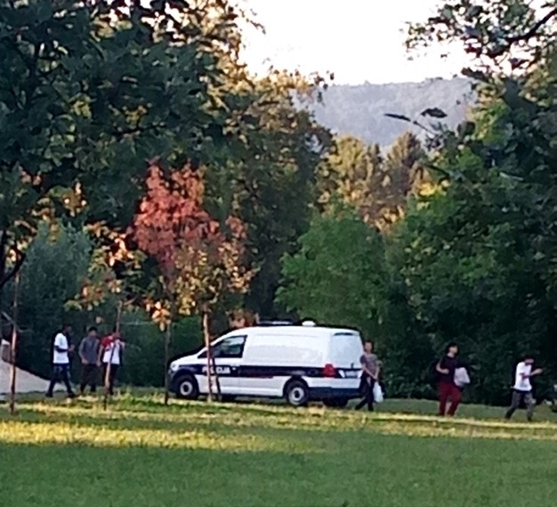

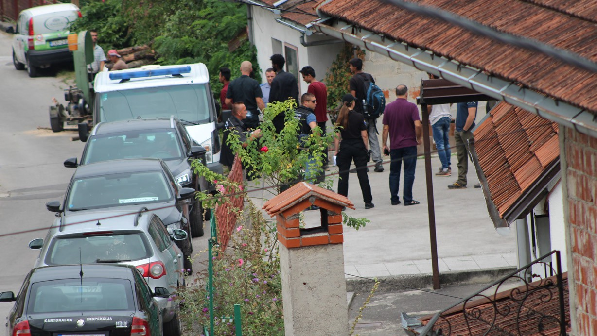

Evictions and removals in Bihać area\. Photo: Margot Durand and Medina Husaković

People staying in informal housing and within Vučjak technically don’t have an official address, which bars them from applying for asylum\. Seen in this light, efforts by law enforcement to empty IOM\-run Bira camp, take people to Vučjak and seize documentation appear as systematic, purposeful actions meant to bar people\-in\-transit from accessing basic protection\.

Additionally, since the removal of people to Vučjak began, IOM\-run Bira camp has been effectively closed, with authorities ceasing registration and stripping existing residents of registration\. Once stripped of documentation and registration, people\-in\-transit can be removed to Vučjak, which makes de\-registration an effective scare tactic and tool for encouraging self\-limitation of movement\.

> “Security take my ID card…now I’m outside\. Security don’t let me go inside camp\. I don’t have some place for sleep\. I have money but don’t have passport to go some hostel\.” 

> _\-Afghan man, 31\.07\.2019_ 

Minors willing to exit Bira lose their registration card and, if security guards do not let them re\-enter, they lose their proof of vulnerability and a place to sleep\. Without those documents, we noticed that some minors began staying in Vučjak among hundreds of male adults\. Alongside private security forces, law enforcement also strip both adults and minors of their registration\.

> “The police stop me\. I show them IOM card\. Card say I am minor\. Police say come here and \[police\] take my card\. They try to take me to jungle camp\. I fight police\. I say ‘your President cannot take me to camp\.’ And I run\!” 

> _\-Algerian man, mid\-August_ 

Stripping of documentation is paired with the actionable threat of transporting people to the “jungle camp”:

> “Police vans waited outside Bira to take people to the jungle camp\.” 

> _\-Indian man, 25\.08\.2019_ 

Some people have reported that their asylum seeker’s card has been seized by local law enforcement\. In this case, these people lose their rights as asylum seekers on BiH territory\.

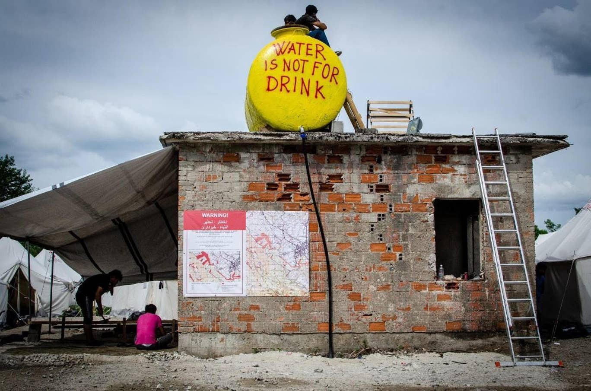

People in Vučjak don’t have means to ask for asylum\. Photo: Thom Davies
### **Conclusion**

When evaluating what is happening in Bihać and the Una\-Sana Canton more broadly, we must not forget to situate Bihać in its broader context\. As this report argues, Bihać is a city on the margins of Europe beset with a political and humanitarian crisis created by the EU’s externalization policies\. The majority of the people\-in\-transit who experienced violence in Bihać experienced violence on the borders with Croatia and Slovenia and the majority of people interviewed in this report had also been the victims of illegal pushbacks from these two countries\. While this report condemns violations within BiH, it also argues that the crisis we see in Bihać is inextricably linked to the EU’s migration policies and Croatia and Slovenia’s illegal border practices:

> “Both Slovenia and Croatia, as EU states, have an obligation to respect one of the most important principles in international law: non\-refoulement\. If Bosnia and Herzegovina is a country in which people\-in\-transit will be subject to beatings from law enforcement and private security forces, where people\-in\-transit will be kept in a camp on a former landfill surrounded by landmines, where people\-in\-transit will be at the mercy of a dysfunctional asylum system, then Croatia and Slovenia have an obligation as EU member states and as parties to the 1951 Convention and 1967 Protocol on Refugees to not return asylum\-seekers to BiH territory\.” 

Bihać represents the outcomes of an ad\-hoc policy of illegal pushbacks on the Schengen border — its harm, its ineffectiveness and its absurdity\. We must provide the basic necessities and services to people\-in\-transit in Bihać, but we also must end illegal pushbacks and revise the EU’s asylum and migration system to make good on Europe’s promise to protect human rights\.

> **For a more in\-depth evaluation of these violations and others, including an evaluation of Vučjak’s internal conditions, please download and read the [report](https://www.borderviolence.eu/wp-content/uploads/On-the-Margins-of-Europe-Report-on-Bihac.pdf) and share\.** 

**_Report written and researched by Margot Durand and Medina Husaković, edited by Margot Durand, Medina Husaković, Jack Sapoch and Milena Zajović\. Special thanks to Joseph Cripps for his contributions\._**

_Converted [Medium Post](https://medium.com/are-you-syrious/ays-special-documenting-human-rights-violations-in-vu%C4%8Djak-camp-923607ace85d) by [ZMediumToMarkdown](https://github.com/ZhgChgLi/ZMediumToMarkdown)._
