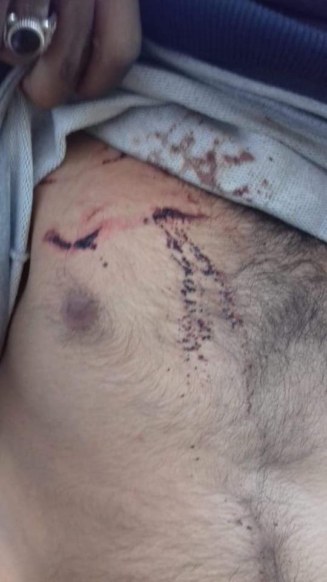

### AYS Weekend Digest 02–03/11/2019: Italy\-Libya deal renewed without changes

Greece: Racist and anti\-migrant protests spread; Hunger Strike in Petrou Ralli detention centre, Athens; Police abuses and solidarity demonstration in Exarchia /// Italy: Salvini’s security decrees, one year on; Donations needed in Trieste /// Balkan route: How much police brutality is too much police brutality? /// France: updates from Calais; Protests in Paris

 \)](assets/16040e08dab/1*PcStEujGlXPiu36SchbWHQ.jpeg)

EU truth \(by [Mikail Çiftçi](https://www.facebook.com/mikailciftci63) \)
#### Feature Story: Italy\-Libya deal renewed without changes

On Saturday 2nd of November the agreement between Italy and Libya which regulates the “ [cooperation in the fields of development, the fight against illegal immigration, human trafficking and fuel smuggling and on reinforcing the security of borders](http://eumigrationlawblog.eu/wp-content/uploads/2017/10/MEMORANDUM_translation_finalversion.doc.pdf) ”, will be automatically renewed\. Saturday was the deadline for proposing an annulment or any changes to the deal, but despite a lot of talk in the media, no official proposal was advanced\. The deal is now valid for three more years\.

In Italy the 2nd of November is also All Souls day, a celebration of the deceased:

 \)](assets/16040e08dab/1*9QlQn8eyq2QZ6WDdPpvhTw.jpeg)

Unnamed graves of people who died crossing the Mediterranean, Cemetery of Palermo, Sicily \(Photo by [Filippo Miraglia](https://twitter.com/FilippoMiraglia/status/1190595139456122880) \)

The agreement was initially signed in February 2017, between the then Italian PM Paolo Gentiloni and Fayez Al\-Serraj, PM of the government of national reconciliation in Libya\. It was one of the touchstones of the ‘hard\-line’ policies on migration of the then “left\-wing” government, ushered in by Interior Minister Marco Minniti, also author of the first code of conduct for NGOs in the Mediterranean, aimed to reduce their capability to rescue lives at sea\.

The basis of the agreement was the creation of a Libyan search and rescue \(SAR\) zone, which was and remains a unique anomaly\. The SAR zone was registered with the International Maritime Organisation in 2018, and remains the only SAR zone of a country which officially has no safe ports and is plagued by a civil war\. The Libyan Maritime rescue centre is managed by Italy and funded by the EU and the IMO has no authority to revoke the SAR zone, which could only be revoked on the request of other countries in the area\. Italy and Malta are not going to file any such request\.

If the situation for refugees in Libya was not clear \(by the way, it was\) three years ago, since then official reports and journalistic investigations have opened a pandora’s box of torture, slavery, inhumane conditions, sexual abuses, attacks from armed forces, and a total lack of medical support for the approximately 5,000 people detained within the Libyan detention centres\.

Groups and associations gathered around the campaign \#IoAccolgo launched a [mail\-bomb](https://twitter.com/ioaccolgo/status/1189879431298535428) to repeal the agreement\. Instead of actual changes, the Italian government promised future modifications to the agreement, asking for better conditions in Libyan detention centres and the respect of human rights by the Libyan coast guard\. At the same time, the renewal of the agreement means that 150 million Euros will be [given](https://ilmanifesto.it/italia-libia-avanti-cosi/) by Italy to Libya to be used with total autonomy\.

If this was not enough, Italian media [report](https://www.facebook.com/Mediterranearescue/photos/a.275129016441663/461810461106850/?type=3&theater) that the court case against the Mar Jonio vessel of the NGO Mediterranea — Saving Humans may widen its scope, investigating the role of Italian authorities in setting up and supporting the activity of the Libyan coast guard\. Italy is present in Libya with at least one vessel under operation Nauras \- officially this is for training, sanitary support, a consulting role for Libyan authorities, and logistical and humanitarian support\. According to these reports, the activity of Italian military personnel on the Libyan coast is more similar to a supportive role for the Libyan coast guard\. The Italian government could be reportedly investigated for the 40,000 pushbacks of the last few years\.

In the words of [Alessandra Sciurba](https://www.facebook.com/Mediterranearescue/photos/a.275129016441663/460940787860484/?type=3&theater) , spokesperson of Mediterranea — Saving Humans:

> The 5,000 people detained in Libyan centres could easily be evacuated by Italy alone\. We’d just need to ask Mediterranean hope and the Comunità di Sant’Egidio how they put into action their humanitarian corridors: they proved that, with 2\.5 million euro, 1,000 people can be safely brought to Italy by plane, and receive a year of dignified support\. It costs a lot less than funding the so\-called Libyan coast guard\. 

LIBYA
#### Updates from UNHCR’s GDF centre in Tripoli

Following on from what was reported on Friday, the group that arrived from Abu Selim detention centre are [now inside](https://twitter.com/AndreaGagne/status/1190989450890883072) , and beds were brought in to accommodate them\. IOM provided some basic provisions including soap, medicine and food bars, but no actual meals\.

■■■■■■■■■■■■■■ 
> **[Sally Hayden](https://twitter.com/sallyhayd) @ Twitter Says:** 

> > Some of the former Abu Salim detainees now in the UNHCR GDF are saying they’ve received no food since Tuesday, except a few biscuits from IOM today. https://t.co/IkERMdb0tN 

> **Tweeted at [2019-11-02 15:01:27](https://twitter.com/sallyhayd/status/1190645098658324481).** 

■■■■■■■■■■■■■■ 

GREECE
#### Arrivals

[Aegean Boat Report](https://www.facebook.com/AegeanBoatReport/photos/a.285312485325196/686951665161274/?type=3&theater) state that from Saturday to Sunday 8 boats arrived on the Greek Aegean islands, carrying 263 people\. 7 of the boats arrived on Lesvos and the remaining one to Chios\. However, in the last 3 days, a total of 97 boats carrying 3,519 people began the journey towards the islands from Turkey, but only 28% arrived — 27 boats carrying 1,098 people\. 72% were stopped\.
For a full breakdown of arrivals and more detailed statistics, go to [aegeanboatreport\.com](https://l.facebook.com/l.php?u=http%3A%2F%2Faegeanboatreport.com%2F%3Ffbclid%3DIwAR1TQMJJD1gvJWyLNlMnB8R6Ch6BLl-tcwpTaJxzeLTA-NB98Vcuu7G27_k&h=AT0ogGWmgvMAP1KTHj0kAaWKjZgWZn7q3RF2MdsVhdJAYScjjFTkfaZwCElrmTBliZkGrtSFTC4pF2lRBsRBOe0c3v9-7fxkPhbP9FomRdQsq5AFri1fbV8aNlw5_jgIBDFbFwI) \.
#### Transfers

On Saturday [800 people were transferred](https://twitter.com/UNHCRGreece/status/1190672025859309568?fbclid=IwAR2WtSaOr4wWqGwr88R9WRvHXtFvL6BKeSwl_2-kM0FNvY4_EvOue3hbxNQ) from Lesvos\. However there are currently over 35,000 people trapped on the islands and the combined capacity of the hotspots is 5,400\.
#### Weather Warning

Bad weather has been predicted in Greece until Friday with high winds, rainfall and hail which could lead to flooding\. This will effect both the mainland and the islands\. Residents have been asked to take care in the coming days\. This is only the very start of the Greek winter and already it’s impact will be felt by residents in all camps in Greece, especially those in summer tents which are not raised above the ground\. More details [here](https://www.keeptalkinggreece.com/2019/11/03/greece-weather-forecast-nov3-5/) \.
#### Multiple Protests against Refugees this Weekend

Racist protests against refugees where seen in Giannitsa, Serres, Kos, Chios, and Leros this weekend according to local media \( [1](https://www.keeptalkinggreece.com/2019/11/03/greece-migration-protests-resettlement/) , [2](http://www.ekathimerini.com/246074/article/ekathimerini/news/kos-inhabitants-prevent-75-migrants-from-disembarking?fbclid=IwAR0Zs-CRLB0eQAtgO5bL4sURuBNHfV0MpbGk_lU3eUYiYQyN1Rz3jMB8fSc) \), [NoBorders](https://twitter.com/Refugees_Gr/status/1191249717558161409) and [RSA](https://twitter.com/rspaegean/status/1190660365538992128?fbclid=IwAR3cZHdgu10NSt1SBqe_6lFmZUoQsS-wMTUoEGnXz8xAMnwVD5V8iB_Jl38) \.

■■■■■■■■■■■■■■ 
> **[NoBorders](https://twitter.com/Refugees_Gr) @ Twitter Says:** 

> > Να θυμίσουμε πώς είχαν καταλήξει άλλες διαμαρτυρίες «κατοίκων» κατά των προσφύγων στη Χίο #refugeesgr (Μολότοφ, τραυματισμοί, μια έγκυος απέβαλε) https://t.co/pG1yVsekAn 

> **Tweeted at [2019-11-04 07:21:22](https://twitter.com/refugees_gr/status/1191254093299408896).** 

■■■■■■■■■■■■■■ 

In the north of Greece local residents blocked the roads to prevent refugees being taken to local hotels\. In Kos the mayor encouraged locals to block the disembarkation of people being transferred from Kastellorizo and even employed municipality vehicles for use in the blockade\. In Leros locals protested against the arrival of refugees from Symi, and they were later transferred to Kos where it seems they also faced protests\. In Serres, another group of locals blocked a bus transporting refugees to Sidirokastro\.

In Thessaloniki there have also been far right protests against the transfer of people from the islands\.

This increasing move to the far right, encouraged by the new government, must stop\. As we have seen time and time again, both recently and during some of humanity’s most disturbing historical episodes, if people in power condone the abuse of certain sectors of society it will lead us down a very dark path and the victims will be the most vulnerable\.
#### Threats to squats in Athens continue

During the weekend an anarchist squat in Exarchia, called [Vancouver Apartment](https://vancouverapartman.espivblogs.net/2016/05/) , was evicted after 14 years\. Also Notara26 squat was once more the target of intimidatory action by riot police:

> This morning we were under another unprovoked attack when, in an attempt to intimidate, two riot squads ran into the building and tried to get inside\. Thanks to the immediate mobilisation of the people inside, they didn’t make it\. That’s why they started kicking the door screaming\. **It was not an attempt to evict us, but “simply a game” of pure bullying for them\.** 

The situation continued for some time, with the police squads surrounding Notara26 and pointing their beam lights into the ground floor of the building\.

Hunger Strike Continues in Petrou Ralli

The Thessaloniki based [Bulletin](https://www.facebook.com/pg/Bulletinmag/posts/?ref=page_internal) reports that the hunger strikes continues in the female section of the detention center of Petrou Ralli in Athens\.

> 16 prisoners, Syrian and two Palestinian, started a hunger strike, yesterday Saturday, November 2, 2019, in protest, because although they are a long\-time prisoners, eg\. two months, some others even more, they have no idea when they are to be transferred to the islands where they got their fingerprints, to finish the process of asylum\. There have been court decisions for their return to the islands and they are captivated in dirty cells as criminals, indefinitely\. Some have health problems such as heart, respiratory, etc\. and others acquire serious health problems because of the inhuman conditions that have to tolerate\. They aim to continue the hunger strike until they are given explicit promise that they will be transferred directly where it should\. One is minor and juvenile detention is illegal\. When do the violations of laws, by the rulers, stop? Women do not withstand another assault, screaming with their attitude ENOUGH, and call for solidarity and support of all in their just struggle\. They, also call organizations defending the human rights of vulnerable groups to take a stand\. 

> In streets, squares and prison cells, migrant women you are not alone\! 

> The passion for freedom is stronger than all kinds of cells\! 

> Solidarity and self\-organization are our weapons 

> Together we will change the world 

> Initiative: The House of Women for the Empowerment & Emancipation 

#### Solidarity demonstrations

On Saturday a demonstration was held in Athens in solidarity with refugees and migrants recently evicted\.

#### Volunteer Call, Lesvos

[The Lava Project](https://www.facebook.com/thelavaprojectlesvos/?__tn__=%2CdK-R-R&eid=ARB9DivqDN3ZcAH7CbDq4bZDUiKnRW9zg41n-A72SdB441cW2Xzw3FNTFIxPpb_MogT9Z9FYYNyVO86_&fref=gs&dti=459777764229676&hc_location=group) need a project co\-coordinator in Mytillini, Lesvos\. They run a laundry to serve Moria Camp and currently wash and dry around 1,200 bags of laundry a month\.

> We need someone to join our existing small team for at least 6/8 weeks \(or longer\) as we take the project forward towards our planned capacity of between 3–4 thousand bags a month\. This is not 9 to 5 and not a 5 day week, the hours can be long\! You must be over 25 with a full driving license and willing to drive our Renault Traffic van\. 

For more info email them at contact@thelavaproject\.org\.

CENTRAL MEDITERRANEAN
#### People rescued by Asso30 brought to Italy

As [reported](https://twitter.com/alarm_phone) on our last digest, 151 people were rescued by the Italian commercial vessel Asso30\. They were brought to Italy on Sunday\.

■■■■■■■■■■■■■■ 
> **[Sea-Watch International](https://twitter.com/seawatch_intl) @ Twitter Says:** 

> > This sounds like good news, as unfortunately it has become the exception to the rule. But in fact, it’s the minimum legal requirement. Still, we are thankful for the safe arrival of 151 rescued persons to Pozzallo and for the intervention by #Asso30 and other vessels this week. 

> **Tweeted at [2019-11-03 12:55:36](https://twitter.com/seawatch_intl/status/1190975815925800960).** 

■■■■■■■■■■■■■■ 

ITALY
#### Salvini’s Security decree: one year later

One year after the first security decree proposed by ex\- interior minister Salvini was approved, Openpolis has [published](https://www.openpolis.it/esercizi/la-stretta-del-decreto-sicurezza-al-sistema-di-accoglienza/) a report about the consequences of the decree\.

Two major effects have been taken into account\. The first is the increase of undocumented people in the country, which is directly connected to the abolition of humanitarian protection\. In 2019 the percentage of rejections of asylum and protection requests reached 80% of the total\. Rejections have been increasing since 2013, but the abolition of humanitarian protection meant that the number of those facing a rejection grew much more quickly\. According to Openpolis estimates, the number of undocumented people will reach 680,000 in 2020 and 750,000 in 2021\.

The second effect regards the reorganisation of the reception system in the country\. The decree drastically reduced and transformed the SPRAR system \(secondary reception, mainly composed by small centres and communities managed by local institutions\), instituting instead the SIPROIMI\. Where the SPRAR was open to both asylum seekers and beneficiaries of protection, the SIPROIMI offers support only to beneficiaries\. Asylum seekers have then been forced back into the CAS \(extra\-ordinary reception system, instituted as short\-term emergency response\), of which we have often reported bad conditions and other issues\. Connected to this reorganisation are the modified regulations for the opening of new CAS, which focus exclusively on the reduction of costs, favouring the construction of large centres over small ones, despite the proven benefits of a small\-size\-based reception system\.

Read the full report \(in Italian\) [HERE](https://www.openpolis.it/esercizi/la-stretta-del-decreto-sicurezza-al-sistema-di-accoglienza/) \.
#### Donations needed in Trieste

Lorena Fornasir is collecting clothing donations in north\-east Italy\. They need: Winter sleeping bags —Winter coats — Shoes\. Contact them [HERE](https://www.facebook.com/lorena.fornasir/posts/2479845002132582) \.

SPAIN

[19 people arrived](https://twitter.com/Cahora/status/1190687020978462720?fbclid=IwAR24V4HQsm0N4LNwoJQIXtLPw5W8S_J2KQ9jBE9tDSbXwGJPSZa-hQXCM7I) to Gran Canaria over the weekend\.

BALKAN ROUTE

Injuries sustained by an individual during a pushback in Croatia this weekend\.

 \)](assets/16040e08dab/1*JxBJ7x5Ib051BfjS0rYzVA.jpeg)

\(Photo Credit: [Lorena Fornasir](https://www.facebook.com/lorena.fornasir?__tn__=%2CdK-R-R&eid=ARAyWa3LYyCaYqB_kosnhPLENPjRYMj5Ha2EYn1ma7id36JgTH7ABNxz3B6AMuwjfxEPXqkFpSBk1Uqj&fref=mentions) \)

In a further show of complete sadism, it is [reported](https://www.facebook.com/Nawal-Soufi-1209495785901695/?__tn__=%2CdkCH-R-R&eid=ARBHFFAkcym7vs0J6Oph8AKWBrzm8yQmmazys_M8mbsTBNlehY2_-A5e4c62Kp5aNo1bDZchuQbRTbJd&hc_ref=ARRLur4FhiIOlXYjIVrp6o_QEANgeuIu0F6HKZT2zCSxb2RsC4c_YtglK7krPbbh5lI&fref=nf&hc_location=group) that another group of people who were stopped this weekend where beaten and stolen from, which is standard procedure along the Balkan route, but then the police decided to go one step further and fake a mass execution\. They forced people to line up and shot at them with what is thought to be rubber bullets\.

 \)](assets/16040e08dab/1*lwuRoUh8HX52hLT-iOYzuw.jpeg)

\(Photo Credit: [Nawal Soufi](https://www.facebook.com/1209495785901695/photos/a.1209640705887203/1302287076622565/?type=3&theater) \)

How much state brutality is too much state brutality? Any\.

FRANCE
#### Updates from Calais

 /North Shore Photo\)](assets/16040e08dab/1*WziieAmOORZNa4Jaclzw0w.jpeg)

\(Photo Credit: [L’Auberge des Migrants](https://www.facebook.com/AubergeMigrants/photos/a.10152514841565339/10157308249850339/?type=3&theater) /North Shore Photo\)

We reported on Friday about the death of a young person in Calais\. [L’Auberge des Migrants report](https://www.facebook.com/AubergeMigrants/photos/a.10152514841565339/10157308249850339/?type=3&theater) that he died of carbon dioxide poisoning on the night of the 31st of October\.

> We, working with the people in Calais, denounce the state’s serious failures in the face of its responsibilities in the field of the rights of the exile\. Among other things, in the face of the fall of temperatures, no permanent shelter exists, which puts people in exile to potentially fatal risks\.
 

>  
 

>  The Franco\-British border has killed 42 people in less than two weeks\! 

We stand in solidarity with the young person who lost their life as a direct result of EU border policies\. We stand in solidarity with this young person’s family who have lost someone they love\. And we stand in solidarity with all those on the move who’s lives are at risk every single day\.
#### Winter Donations for Calais

Various groups are calling for donations for Calais\. For another year it will be down to activists and grass roots groups to prevent as many deaths as possible in the informal settlements around Northern France\. Blankets, tents and warm clothes can make this difference\. It’s a ridiculous thing to have to say in modern day France, but that’s where we are, still\. More info [here](https://www.facebook.com/groups/CalaisMigrantSolidarityActionFromUK/permalink/3139189429489116/?hc_location=ufi) \.
#### Protest in Paris

A [protest has been called](https://www.facebook.com/events/404921670452453/) in solidarity with a comrade who has been detained for almost 40 days and is at risk of deportation\. It will start this Thursday at 1pm at 80 rue de tolbiac\.

NORWAY
#### Activists in Norway commemorate those who died on their way to Europe

 \)](assets/16040e08dab/1*zZjYayoSIW4ZfYVMHym9iw.jpeg)

\(Photo Credit: [Nihad Suljić](https://www.facebook.com/profile.php?id=100011312972993&__tn__=%2Cd%2AF%2AF-R&eid=ARD8RGVe2LGqi0GAPJL7t28ojomLohIn8srofcEM735EYuewYBXk1j7ma7dcHwKnfNNdx_iGelXYkqn0&tn-str=%2AF) \)

Activists in Norway have been engraving the names of refugees who lost their lives on the way to European countries on stones which they will present to the Norwegian Government\.

**If you wish to contribute, either by writing a report or a story, or by joining the info gathering team, please let us know\.**

**We strive to echo correct news from the ground through collaboration and fairness\. Every effort has been made to credit organizations and individuals with regard to the supply of information, video, and photo material \(in cases where the source wanted to be accredited\) \. Please notify us regarding corrections\.**

**If there’s anything you want to share or comment, contact us through Facebook, Twitter or write to: areyousyrious@gmail\.com\.**

_Converted [Medium Post](https://medium.com/are-you-syrious/ays-weekend-digest-02-03-11-2019-italy-libya-deal-renewed-without-changes-16040e08dab) by [ZMediumToMarkdown](https://github.com/ZhgChgLi/ZMediumToMarkdown)._
