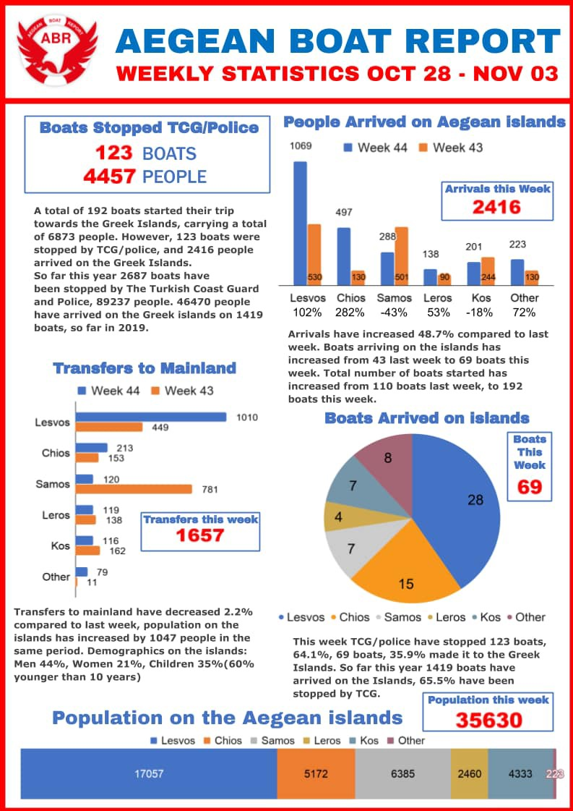
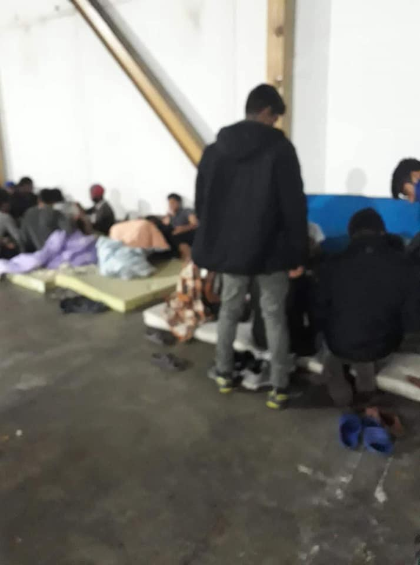
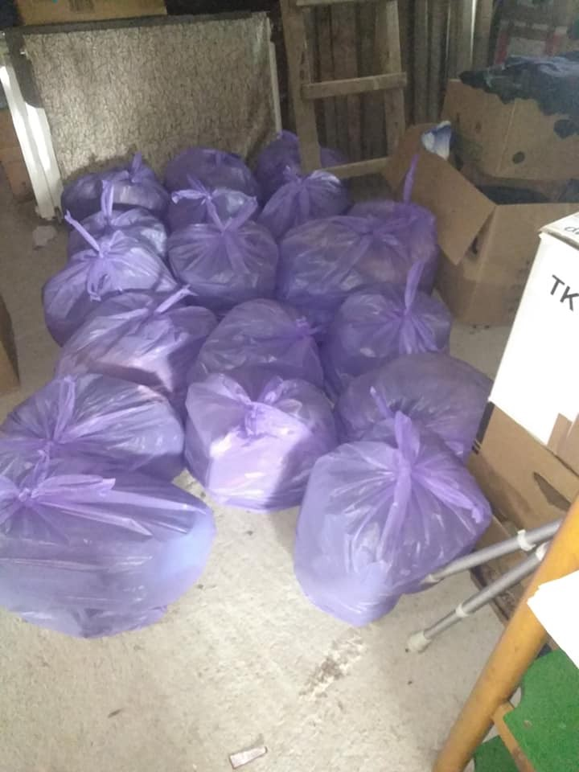

### AYS Daily News Digest 4/11/19: Child death, evictions, ignorance and systematic abuse — today, around us\.
#### A UK report criticizing the European response to the “migration crisis”, and sends strong and clear messages / Out of 4,800, 1,178 unaccompanied minors have gone missing in Greece / How to help and support in Bosnia and Herzegovina or in France

 \)](assets/53a5806758b7/1*Wiq4aHrUxrZ5RQghw37vAg.jpeg)

Tuzla, Bosnia and Herzegovina — Due to an overcrowded bus station, people are currently staying in secluded areas, but also in plain sight of those whose one decision could change everything for their physical and mental health\. \(Photo: [Portal Tuzlarije\.net](https://www.facebook.com/Tuzlarije/?__xts__%5B0%5D=68.ARCeZC5PJ0iOkrldp3kNgPVQ8Cs0ox1vYhxAFSU7oKl6CszupU66BMORgeAb4fJe2BbeVyqavvT7T8GbHJ_CisDpVaJi3u36od4Ee9IyVLD6Knmp8AKxN9skxwWMJYCZvplc2jEwLB5AdGqPE4CETwhJzGj6UaKOQVSoJTtKiKUS6_5XqwXqIkykRxmTg8_iR142iYLt3GBftmuzIjb4TrE3v_4bOyx1aPy--u9O8VxVmDBjbqp5Mfri39_fzOCYQKgtXGoAg2iLRcegxsKeEuqqFmaqdilX9Po-p2sJXZrmnc945J2p20vZP_COCiggtyZE8Z2Vm_qaeD7QJ3oEmGUk8w&__tn__=k%2AF&tn-str=k%2AF) \)
#### FEATURED

**Greece** — Social Youth Support Organization reported on the tragic car accident that took place in Agia Ermioni, Chios, resulting in **the death of a 1 year old girl\.**

The child’s family boarded the organization’s mini bus and was returning from a visit to Chios hospital, at the time of the incident\. At the time of their disembarkation, the child escaped the control of her mother, leaving her in front of the vehicle at the time it was being started\. The child was rushed to the hospital by the driver of the vehicle and an employee of ARSIS immediately, but unfortunately she passed on route\. It is a tragic accident that has saddened the child’s parents, in addition to the refugee trauma they are already experiencing, as well as the driver — an employee of ARSIS, who is in a very bad psychological state, they report\.

**The UK** — The Government should urgently resume attendance at EU meetings where irregular migration is discussed and seek to maintain a cooperative voice with EU partners after Brexit, a report of the [Foreign Affairs Committee](https://twitter.com/CommonsForeign) reads\. It is criticizing the European response to the “migration crisis”, and sends strong and clear messages\.

“We are particularly concerned by the **serious and systemic abuses perpetrated against migrants in Libya\.** EU deals with this country have achieved the short\-term political “win” of cutting migrant numbers, but at the cost of fuelling human rights abuses, **strengthening armed groups, and undermining stability in the longer term** \.

The dominance of the Home Office in this area risks focusing policy on the **domestic goal of limiting migration** to the exclusion of broader UK foreign policy goals\. The **UK should address the wider, interlinked factors driving irregular migration** — including climate change, conflict, repressive governance and corruption — rather than focusing narrowly on reducing the numbers reaching Europe’s borders in the short term\. “

> A policy that focuses exclusively on closing borders will drive migrants to take more dangerous routes, and push them into the hands of criminal groups\. 

“The case of 39 people found dead in a lorry container in October — though detailed information is still lacking — is a horrific illustration of these dangers\. It should serve as a wake\-up call for the FCO, and Government more broadly, to reassess its approach to irregular migration\.”

Read the entire report [here\.](https://publications.parliament.uk/pa/cm201920/cmselect/cmfaff/107/107.pdf)
#### LIBYA

Former Abu Salim detainees, now in the UNHCR GDF centre, say they haven’t received any food in six days\. They’re weak & starving\.

■■■■■■■■■■■■■■ 
> **[Sara Creta](https://twitter.com/saracreta) @ Twitter Says:** 

> > @[UNHCRLibya](https://twitter.com/UNHCRLibya) @[[EU_Commission](https://twitter.com/EU_Commission)](https://twitter.com/[EU_Commission](https://twitter.com/EU_Commission)) @[[OCHA_Libya](https://twitter.com/OCHA_Libya)](https://twitter.com/[OCHA_Libya](https://twitter.com/OCHA_Libya)) @[BBoell](https://twitter.com/BBoell) @[UNFPALibya](https://twitter.com/UNFPALibya) @[ARAGhandour](https://twitter.com/ARAGhandour) @[UnicefLibya](https://twitter.com/UnicefLibya) @[SamerWFP](https://twitter.com/SamerWFP) @[IOM_Libya](https://twitter.com/IOM_Libya) @UNcoordLibya How the recent 2 million € in humanitarian assistance given by @[[EU_Commission](https://twitter.com/EU_Commission)](https://twitter.com/[EU_Commission](https://twitter.com/EU_Commission)) to #Libya will be used? Who will be in charge of providing an independent monitoring? 

Is @[[OCHA_Libya](https://twitter.com/OCHA_Libya)](https://twitter.com/[OCHA_Libya](https://twitter.com/OCHA_Libya)) able to effectively coordinate the humanitarian response? https://t.co/KEvLaB3m8y 

> **Tweeted at [2019-11-04 19:53:29](https://twitter.com/saracreta/status/1191443368791990273).** 

■■■■■■■■■■■■■■ 

■■■■■■■■■■■■■■ 
> **[Gerry Simpson](https://twitter.com/GerrySimpsonHRW) @ Twitter Says:** 

> > In past 2 years, EU spent almost €100 million on "successful model" for stopping refugees &amp; migrants its shores, by supporting Libyan coastguard to intercept &amp; return them to a country so dangerous that EU can't even send monitors there to document abuses [bit.ly/34q4Zjdsupport…](https://bit.ly/34q4Zjdsupporting) https://t.co/NFhyzY8qXP 

> **Tweeted at [2019-11-04 12:44:09](https://twitter.com/gerrysimpsonhrw/status/1191335324611465216).** 

■■■■■■■■■■■■■■ 

Italy appears to have just transferred to Libya 10 more speedboats, as agreed last year\. With these, the Libyan Coast Guard will further enhance its capacity to intercept people at sea and return them to detention and ill\-treatment, in a country at war\. Read the entire opinion thread on Twitter [here](https://twitter.com/matteodebellis/status/1191461384544018432?fbclid=IwAR0EaMAP5jqb5NpLSJ24SXLl-YOq245785bJTfQraw7QDJeV2J9fCDKBaHE) \.
#### GREECE

> According to statistics provided by the Greek Ministry of Labor 1,178 unaccompanied minors have gone missing, out of approximately 4,800 registered at reception points in Greece\. 

■■■■■■■■■■■■■■ 
> **[RSA](https://twitter.com/rspaegean) @ Twitter Says:** 

> > #European Court of #HumanRights orders #Greece to transfer #unaccompanied #minors held for more than 10 days in athens police station under so called ‘protective custody’  following @[rspaegean](https://twitter.com/rspaegean) request for interim measures.
#Refugeesgr 

> **Tweeted at [2019-11-04 18:35:53](https://twitter.com/rspaegean/status/1191423840083156992).** 

■■■■■■■■■■■■■■ 

Each of the 41 people who were found yesterday in a refrigerator truck in Xanthi paid 2,500 euros to the smugglers\. This was reported to the police officers who examined them immediately after their arrest\. The police arrested the driver and took him and the passengers to a nearby police station for identification\. They said that they had begun their journey from Turkey and were heading for Thessaloniki\. 39 people come from Afghanistan, one was Syrian and one Iranian\. Eight of them were taken to Xanthi Hospital for first aid, as they said they were having breathing problems due to a lack of oxygen\. The rest are held in the hotspot of Xanthi\.
### Islands

The Aita Mari has arrived in lesbos and is now waiting for the trucks to unload the 8 tons of aids for the Greek Islands\.
#### Chios

“Refugees who rented apartments \(in poor condition / without a rental contract\) in a building in Chios port were evicted by the owner, without any reason”, local activists report\.
Info says this was done in favor of bar owners and touristic area\. The people were given 5 days to leave, but of course they couldn’t get a house so soon, so the owner reportedly cut off the electricity\. It concerns 25 people, with young children, now on the street\.

■■■■■■■■■■■■■■ 
> **[Bruno Tersago](https://twitter.com/BrunoTersago) @ Twitter Says:** 

> > #Greece - inhabitants of #Chios island demand that hotspot #Vial will be closed. More and more people are protesting the growing number of refugees and migrants in #Greece. 

> **Tweeted at [2019-11-04 09:38:42](https://twitter.com/brunotersago/status/1191288654376919050).** 

■■■■■■■■■■■■■■ 

#### BOSNIA AND HERZEGOVINA

The association Solidarnost from Bihać, along with a number of individual activists and groups in Bihać, consistently cares for those outside the “system”, as well as those people “lucky” enough to be staying in the camp Bira, which resembles anything but a safe place to stay and lodge individuals who suffered every possible form of abuse along their route towards the EU countries\. 
Jackets, shoes \(hiking and sport shoes\), socks, hats, scarfs, pullovers, jumpers, fleeces and trousers are part of the packages that local organisation ‘Solidarnost’ provides for the residents of the camp, since they don’t have much better living conditions than those staying outside the reception system, in spite of all of the funding and the supposed standards of the UN organisations running the place, failing to propulsively work for the benefit of those they exist for\. 
If you wish to support them, the best way is to send funds to the local activists who can best decide what is most needed and buy it for an incomparably lower price in BiH than anywhere else across the EU\. If, however, you already have some help\-in\-kind, make sure not to send XL and L sized clothes as most of the people need smaller sized clothes and shoes\. Always try to contact people on the ground before starting an action, so you can support the situation in the best possible way\. If you need direct contacts in different areas, write to us and we will connect you to the right people\.

Photos from Bira camp in Bihać and of the packages prepared for the people there: Udruženje Solidarnost — Bosnia
#### FRANCE
### Volunteering

The Refugee Women’s Centre \(RWC\) team are on the ground on a daily basis including throughout the holidays\. They are currently looking for volunteers who can commit to two months or more from the following dates:

\-1 volunteer from 8th December 2019 onwards
\-1 volunteer from 15th December 2019 onwards

> We are also now recruiting for 2020\! 

> We need practical and compassionate people who are over the age of 21\. Having a full driving license and the ability to drive a manual vehicle is helpful, as well as having experience or background in social work, psychology, supporting survivors of sexual and gender\-based violence and/or working with vulnerable people\. Our working languages are English and French\. Knowledge of Arabic, Kurdish \(sorani\), Farsi, Tigrinya or Amharic are a great advantage\.
 

> If you are interested in joining our team, you can find more information and our application form in the following link:
 

> [https://www\.dunkirkrefugeewomenscentre\.com/volunteer](https://l.facebook.com/l.php?u=https%3A%2F%2Fwww.dunkirkrefugeewomenscentre.com%2Fvolunteer%3Ffbclid%3DIwAR3yHSmQXmB2Ya0s8kWJod8vB5GIOacX7ai7z50wBZf0h_j1NXetiXMSxTM&h=AT1oevl73R7-V-fPMwdxqye5ErhuiIdrEWfP_iEngmVN5L6FAoWSGgwiSVbdW92RKcdY6GRUwA8hw7fSFg6MNxoMTVa5tRzQuCQMsbL2ToJ8AK6zjkqU82KlwkRgGmCrZf3RG2loMp3-RJWIlxo293TsIg1n4SFI) 

> Equally if you want to support us but can’t spare the time, you can donate money to go towards buying items such as tents and sleeping bags, help us to raise awareness or SHARE this post\! 

Please send any questions to supportus@refugeewomenscentre\.com

**If you wish to contribute, either by writing a report or a story, or by joining the info gathering team, please let us know\.**

**We strive to echo correct news from the ground through collaboration and fairness\. Every effort has been made to credit organizations and individuals with regard to the supply of information, video, and photo material \(in cases where the source wanted to be accredited\) \. Please notify us regarding corrections\.**

**If there’s anything you want to share or comment, contact us through Facebook, Twitter or write to: areyousyrious@gmail\.com\.**

_Converted [Medium Post](https://medium.com/are-you-syrious/ays-daily-news-digest-4-11-19-child-death-evictions-ignorance-and-systematic-abuse-today-53a5806758b7) by [ZMediumToMarkdown](https://github.com/ZhgChgLi/ZMediumToMarkdown)._
