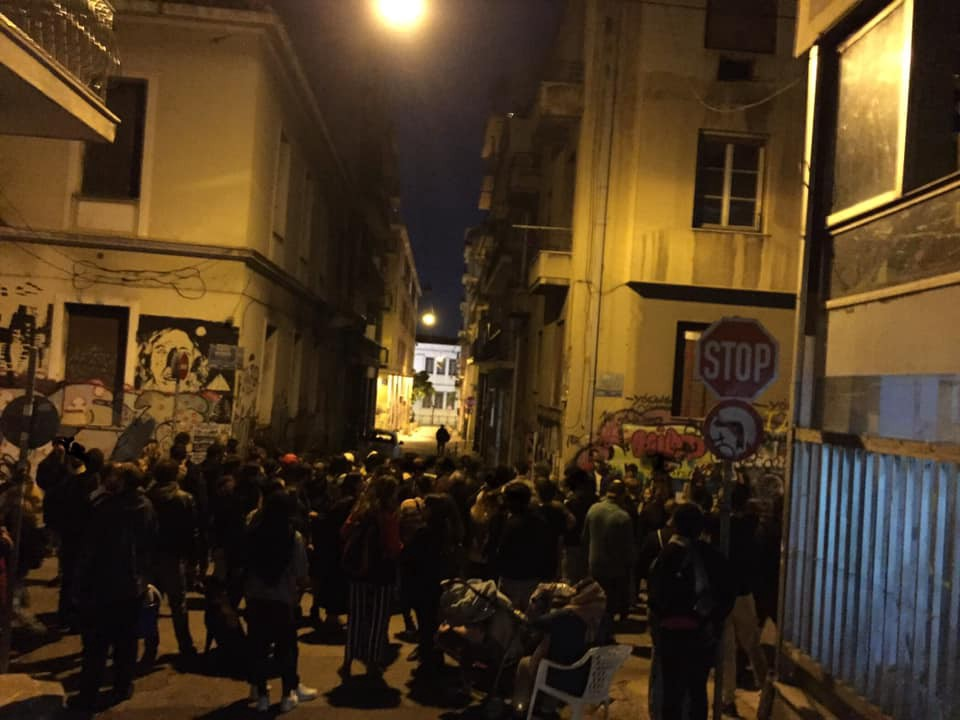
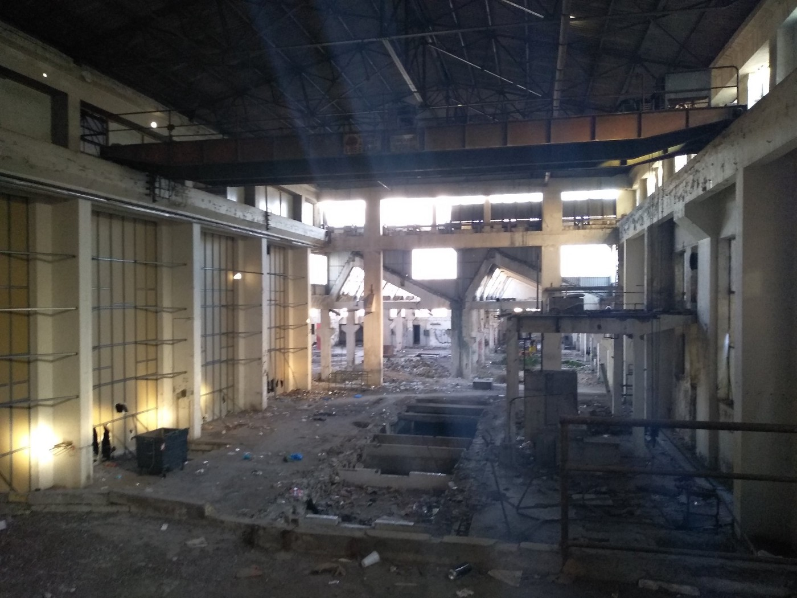
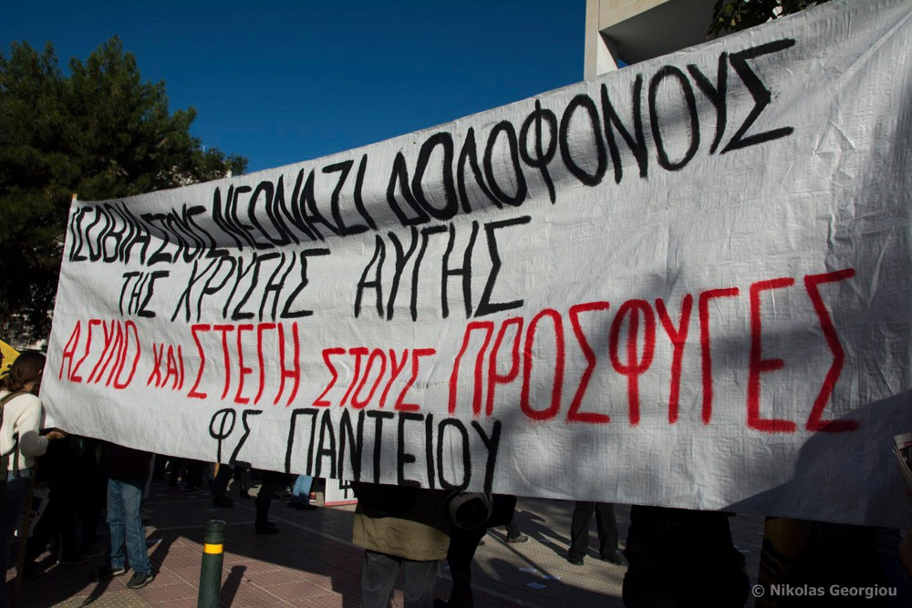

### AYS Daily Digest 6/11/19 5 people drowned off the coast of the Canary islands on Wednesday

_Egyptian or Emirati fighter jets might have bombed Tajoura migrant center in Libya on 2 July // Sea rescue mission Iuventa needs your help // Eviction in Notara 26 in Athens // New migration plan in France // and more…_

](assets/d0d4165aa161/1*IKNfBn-1egCEWwOsqeTu0g.jpeg)

“Spanish Civil Guard rescue divers search for two missing migrants at Arguineguin in the Canary Islands, 17 May 2019 / Photo: Imago” Info from [Info Migrants](https://www.infomigrants.net/en/post/17342/spain-s-canary-islands-still-a-magnet-for-migrants)
### Feature

Five [people drowned](https://rp-online.de/politik/ausland/mindestens-fuenf-fluechtlinge-vor-kanaren-insel-lanzarote-ertrunken_aid-46993205?fbclid=IwAR17mCK_CIwcb635x9DQ_XiDJtxNGKW1bHZyKJ34l0K21EQGUX-bjmhXNas) off the coast of the Canary islands on Wednesday\. Fifteen people were on board when their ship capsized; four were saved and six were missing at first\. The Canary islands are about 100 kilometers off Morocco’s Atlantic coast\. [As one journalist notes](https://twitter.com/lorenzodago/status/1192196677173743617?fbclid=IwAR0dDIZZ-IvDKCFy4pzQUhiijBEGC9TFcHzKmcbYQvaxIRvIuxVn29LODUM) :

> “One route is closed and another, often deadlier one opens\. The route from West Africa to the Canary Islands seems to be active again, and making its victims\. You simply cannot take the freedom to move away from people\.” 

### Libya

[The UN](https://www.bbc.com/news/world-africa-50302602) now has reason to believe that Egyptian or Emirati fighter jets bombed Tajoura migrant center in Libya on 2 July\. 53 people were killed and 130 were injured\. This could amount to a war crime\. Reports add:

■■■■■■■■■■■■■■ 
> **[Malachy Browne](https://twitter.com/malachybrowne) @ Twitter Says:** 

> > 2/2 Our investigation into the attack with @[sallyhayd](https://twitter.com/sallyhayd) and @[saracreta](https://twitter.com/saracreta) showed the migrants were being housed beside a weapons depot, and that the E.U. ignored calls to relocate them. Close to 200 migrants have since been relocated to Rwanda
[youtube.com/watch?v=dpPTlm…](https://www.youtube.com/watch?v=dpPTlm_OJjI) 

> **Tweeted at [2019-11-06 15:03:34](https://twitter.com/malachybrowne/status/1192095185355857920).** 

■■■■■■■■■■■■■■ 

■■■■■■■■■■■■■■ 
> **[Flavio Di Giacomo](https://twitter.com/fladig) @ Twitter Says:** 

> > Abt 8200 migrants returned to #Libya in 2019
"Hundreds of people are confined to often overcrowded hangars with barely any access to water,food&amp;sanitation.They remain caged;life is reduced to merely existing"
Read the article⬇️
[shar.es/a3XimJ](https://shar.es/a3XimJ) 
via [weblog.iom.int](http://weblog.iom.int) https://t.co/sg5wPI1J2b 

> **Tweeted at [2019-11-06 13:52:47](https://twitter.com/fladig/status/1192077369802182661).** 

■■■■■■■■■■■■■■ 

In her Statement to the United Nations Security Council on the Situation in Libya, pursuant to UNSCR 1970 \(2011\), the Prosecutor of the International Criminal Court observed:

> “At the outset, I must observe with serious concern that there has been an escalation of violence in Libya over the reporting period\. Reports indicate that there have been a high number of civilian deaths, thousands of persons internally displaced, and a sharp increase in abductions, disappearances and arbitrary arrests across Libya\.” 

Read the whole statement [here](https://www.icc-cpi.int/Pages/item.aspx?name=191106-stat-icc-otp-UNSC-libya&fbclid=IwAR3ni5uA-RrnT2L8MtqmBsXvlpuMCmBtknXkrUmnvTdODdDLkjWxMmeTDhs) \.

[Hayden](https://twitter.com/sallyhayd/status/1192044864663367680?fbclid=IwAR3ni5uA-RrnT2L8MtqmBsXvlpuMCmBtknXkrUmnvTdODdDLkjWxMmeTDhs) continues to cover the situation for the Abu Salim detainees:

■■■■■■■■■■■■■■ 
> **[Sally Hayden](https://twitter.com/sallyhayd) @ Twitter Says:** 

> > Finally some food today for the former Abu Salim detainees in the GDF. BP-5 is a high-calorie, vitamin-full dry food normally given in disaster relief/crisis areas. [twitter.com/sallyhayd/stat…](https://twitter.com/sallyhayd/status/1191469164059385857?s=21) https://t.co/Ua2GVdXaXt 

> **Tweeted at [2019-11-06 11:43:37](https://twitter.com/sallyhayd/status/1192044864663367680).** 

■■■■■■■■■■■■■■ 

### Sea

■■■■■■■■■■■■■■ 
> **[iuventa-crew](https://twitter.com/IuventaCrew) @ Twitter Says:** 

> > You have been rescued by our ship #iuventa? We need your help! Please get in touch if you are willing to testify in court and tell your story #DefendSolidarity https://t.co/elGbaDCBCi 

> **Tweeted at [2019-11-06 15:58:07](https://twitter.com/iuventa10/status/1192108912671105024).** 

■■■■■■■■■■■■■■ 

### Greece
#### Islands

According to [Aegean Boat Report](https://www.facebook.com/AegeanBoatReport/photos/a.285312485325196/689344328255341/?type=3&theater) , while there is no word on new arrivals for Wednesday, for Tuesday: “Three boats arrived on the Greek Aegean islands, 125 people\.”

First boat → Lesvos, 48 people \(26 children, 12 women, 10 men\)

Second boat → Lesvos, 42 people \(20 children, 9 women, 13 men\)

Third boat → Simi, 33 people \(No further information available\)

Two people arrived on Kos \(No further information available\)

If you, like us at AYS, also depend upon and/or appreciate the great work ABR puts in to accurately report on the number of new arrivals day in and day out, ABR’s fundraiser is still going on, and you should check it out [here](https://www.facebook.com/donate/1349559608553250/) \.

The Hope Project on Lesvos has been able to do some pretty cool expansions in their centre recently\! These include a barber studio, reading space, ad exercise room\! Find out more [here](https://www.facebook.com/HopeProjectKempsons/videos/2468844263439754/?__xts__[0]=68.ARDnMJfWm44htmE6IcVUCvl4lznO7vySnYPHTFHuaAjQbfvbf19kED5qDqT0ecp4MUCC22Da0azbhpojVRoSND4u7xD5R69Xm5BA4X0IxjttJPJAEqFvbjveszR4e07bPrV-cvkTPHHUYViyCTAOIbYSCU9o2ikclmuqdPQZ5WI4DDHV1RBNtDwkbH2iRhevK07Qu_11-2rkClIsrrLeSxME_B5pmURUVo8kHw-0J7cNH1j23lX_xEwkkA0YRprehIyGtVYCwsR1pfJJ5yZQE76oM5ZTM-rmnIY8RQZdU1Hs83g6G5KgPa0-KjfiNhKr1jpDs3DroIlB8hIOfVoz9lhH8v6QoDW7QGL5P2Gr&__tn__=-R) how you can continue to help these amazing social support programs\.

■■■■■■■■■■■■■■ 
> **[MSF Sea](https://twitter.com/MSF_Sea) @ Twitter Says:** 

> > Jawad* arrived in #Mytilini few weeks ago. “I have 3 young children &amp; we all sleep in this small tent. Last night it was raining all night and we all got wet”. He tried to protect the tent from the rain with plastic sheeting. When it rains, the camp turns into a muddy swamp. https://t.co/o70Nxl0NwC 

> **Tweeted at [2019-11-06 11:13:00](https://twitter.com/msf_sea/status/1192037158619697152).** 

■■■■■■■■■■■■■■ 

→ “You want to start 2020 the right way, want to have an impact, change something?
 → You are responsible, creative and a multitasker who believes in equal chances and that education is a human right?
 → You want to work alongside a dedicated team on allowing refugee kids, youths and women some normalcy, teaching English, planning children activities and sports events, creating a safe space for those who have been on the run for months?

**Then what you’re really looking for is a voluntary service with Action for Education on Samos or Chios\!” Find out more [here](https://www.facebook.com/groups/greecevolinfopoint/permalink/1029834324014299/?hc_location=ufi) \.**
#### Mainland

](assets/d0d4165aa161/1*ekL5o-dUD_qhEO7QpNjDPw.jpeg)

“‪Demo in the neighborhood of Notara Κατάληψη Στέγης Προσφύγων/Μεταναστών Νοταρά 26 at Exarchia Athens\. Children living in the refugee squat leaded the demo singing ¡No pasarán\! Solidarity is our weapon\. \#antireport \#refugeesgr \#Exarcheia\_Resist ‬” Photos by [NoBorders](https://www.facebook.com/nobordersnetwork/posts/2580105775390632?hc_location=ufi)

On Wednesday [NoBorders](https://www.facebook.com/645186555621294/videos/vb.645186555621294/1146842482181403/?type=2&theater) reported:

> “Notara 26 is under threat of immediate evacuation\. The situation is more critical than ever\. We call on the solidarity movement, comrades / comrades, the neighborhood, to defend the occupation with their presence every night until the early morning hours\. **Solidarity is our weapon** \!” 

■■■■■■■■■■■■■■ 
> **[Daphne Tolis](https://twitter.com/daphnetoli) @ Twitter Says:** 

> > #Greece’s government plans to create new closed pre-departure centers on the mainland &amp; islands for rejected asylum seekers. The gov’t spokesman said that those not entitled to asylum will be transfered to these pre-departure centers until their return to #Turkey. 

> **Tweeted at [2019-11-06 15:38:29](https://twitter.com/daphnetoli/status/1192103971764285440).** 

■■■■■■■■■■■■■■ 

In fact, they will try to return 10,000 people to Turkey by the end of 2020\.

> “Those \(who\) have entered illegally and are not entitled to asylum cannot move around the country uncontrollably and have no other choice but to return \(to Turkey\),” government spokesman Stelios Petsas said on Tuesday\. 

Reports indicate there will be centers on the islands and the mainland and are likely to be former military camps, capable of facilitating many thousand people\. Learn more [here](http://www.ekathimerini.com/246168/article/ekathimerini/news/greek-government-plans-closed-departure-centers-for-failed-asylum-seekers?fbclid=IwAR1PMMTQ-qEF04-cGJ8SsoaXhObderz6BcGka36OK6sZzp57_cJYQSvTIRw) \.

](assets/d0d4165aa161/1*MKfP4dOK1ww3tMPooTIPtQ.jpeg)

“Health report from Patras:
During the past weeks we have been disinfecting wounds, treating colds and providing other basic health care\. Unfortunately, we have had to go to hospital to accompany several young boys\.” Photos by [No Name Kitchen](https://www.facebook.com/NoNameKitchenBelgrade/posts/833230923741860)

[On Wednesday](https://www.keeptalkinggreece.com/2019/11/06/greece-migration-explosive-ep-committee/) the Greek Minister for Citizen Protection, Michalis Chrysochoidis, told the Committee for Civil Liberties, Justice and Home Affairs of the European Parliament that the situation on the islands is

> “explosive and beyond any manageable capacity” 

He added further _: “Even if the entire EU mechanism is mobilized \(it couldn’t manage this\) tsunami of people…doctors or asylum officers are faced with hundreds of arrivals every day and of course not being able to respond\.”_ But still urged the EU member states to take action, particularly to help unaccompanied minors\. Find out more here\.

](assets/d0d4165aa161/1*xKpuR5V83PMbq3rNuUobWw.jpeg)

“\#antifa demonstration outside the court where Neo\-Nazi Golden Dawn leader would testify\.” Photo by [Nikolas Georgiou](https://www.facebook.com/ngeorgiouphoto/posts/994980957516836?hc_location=ufi)

[New reporting](https://twitter.com/stenikito/status/1192026221695176704?fbclid=IwAR3dxrxT6YfD80YoFYPE7HNLuCZmwuQYryTfJwUnYvGH_40la8hXT1iajAo) : “Fascist\-racist attack in the morning on a high school refugee\-student in Neapoli, Thessaloniki\. Hooded fascists outside the school attacked the child with a knife \(from Iran, staying home in Naples\) and warned the child not to go back to school\. The child is in shock\.”
### Italy

[According to a new study](https://www.infomigrants.net/en/post/20642/680-000-irregular-migrants-in-italy-after-security-decree-study-finds) , 680,000 people are living as undocumented immigrants in Italy, an increase from “Salvini’s decree\.” Less than 500,000 people were living undocumented in 2017:

■■■■■■■■■■■■■■ 
> **[InfoMigrants](https://twitter.com/InfoMigrants) @ Twitter Says:** 

> > The number of undocumented migrants in Italy has risen significantly because of the "Salvini decree", according to a study by @[openpolis](https://twitter.com/openpolis) &amp; @[ActionAid](https://twitter.com/ActionAid). 

Why?
▶ Harder for asylum seekers to get stay permit
▶ Many people still stay w/o stay permit

[infomigrants.net/en/post/20642/…](https://www.infomigrants.net/en/post/20642/680-000-irregular-migrants-in-italy-after-security-decree-study-finds) 

> **Tweeted at [2019-11-06 15:32:03](https://twitter.com/infomigrants/status/1192102351768899587).** 

■■■■■■■■■■■■■■ 

### Spain

](assets/d0d4165aa161/1*lLS-dZFCg4xmaNtTmHDQiA.jpeg)

“Last week 1,073 people arrived in Spain: 960 by sea and 113 by land\. So far this year, 27,488 people have arrived in Spain, 50% less than in the same period of 2018\.” Photo by [UNHCR Spain](https://twitter.com/ACNURspain/status/1192026255329255424?fbclid=IwAR0dp9ejyJe3xJojjKP2rokGLy3Y5GjbUAgO0qlGyjGX6tSmMvW31yVg9yc)
### France

On Wednesday Prime Minster Philippe, revealed new migration measures as President Macron’s administration is trying to tighten migration policy, feeling pressure from the political right\. Philippe said:

> “It’s about sovereignty\. We have to take back control of our migration policy…\(it will be a\) fair balance between rights and obligations\.” 

They are planning to add fixed migration quotas, but didn’t elaborate\. Read more [here](https://www.france24.com/en/20191106-live-french-pm-unveils-immigration-plan-as-government-moves-to-implement-quotas?fbclid=IwAR2LPBMJhmWAJL9bSooqrIB1fVFBIYIcCZPn0kbfJDrMLW7yt3i5bKOzq5A) \.

](assets/d0d4165aa161/1*o6P89bd81KVqw1DhXzihgQ.jpeg)

Disturbing photo from an evacuation that happened in Grand Synth on Monday\. A 14\-year\-old boy was left with a third\-degree burn and waited for a very long time for medical attention\. [Photo and in depth reporting of the scene by Fleur Ali](https://www.facebook.com/photo.php?fbid=2508477352708756&set=a.1379504665606036&type=3&theater)
### EU

In a co signed document by UNHCR, IOM, Red Cross EU, ECRE, and many more organizations, they acknowledge that the Multi\-Annual Financial Framework \(MFF 2021–2027\) negotiations are happening under strenuous conditions\. They are worried that ongoing negotiations might delay or create gaps in funding for asylum seekers and refugees, which is why member states need to still invest in their own national budgets\. T [hese organizations reiterate the following concerns:](https://www.ecre.org/wp-content/uploads/2019/11/EPAM-Statement-AMF.pdf?fbclid=IwAR02KxTUBfwyHGojzgidi4qd1W8Z6VCcftM58e0Y23hLi1_aBKrKHgJtGqc)

**I\.** Addressing vulnerability and ensuring protection
**II\.** Safeguarding policy coherence in non\-EU countries 
**III\.** Implementing partnerships with CSOs in practice 
**IV\.** Ensuring coordinated and significant resources to integration

**If you wish to contribute, either by writing a report or a story, or by joining the info gathering team, please let us know\.** 
**We strive to echo correct news from the ground through collaboration and fairness\. Every effort has been made to credit organizations and individuals with regard to the supply of information, video, and photo material \(in cases where the source wanted to be accredited\) \. Please notify us regarding corrections\.** 
**If there’s anything you want to share or comment, contact us through Facebook, Twitter or write to: [areyousyrious@gmail\.com](mailto:areyousyrious@gmail.com) \.**

_Converted [Medium Post](https://medium.com/are-you-syrious/ays-daily-digest-6-11-19-5-people-drowned-off-the-coast-of-the-canary-islands-on-wednesday-d0d4165aa161) by [ZMediumToMarkdown](https://github.com/ZhgChgLi/ZMediumToMarkdown)._
