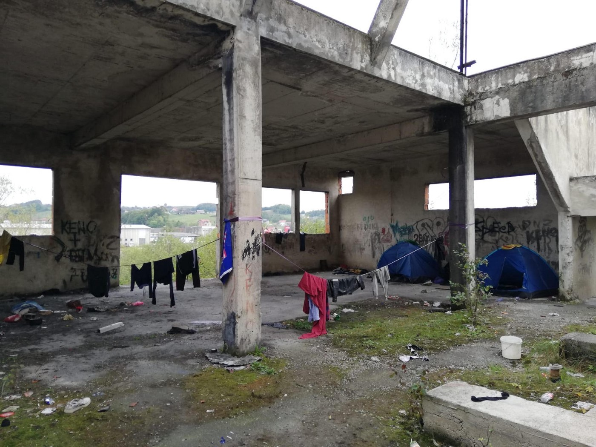
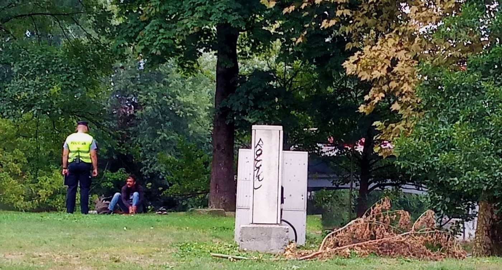
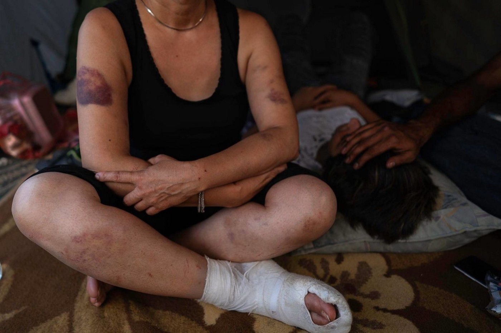
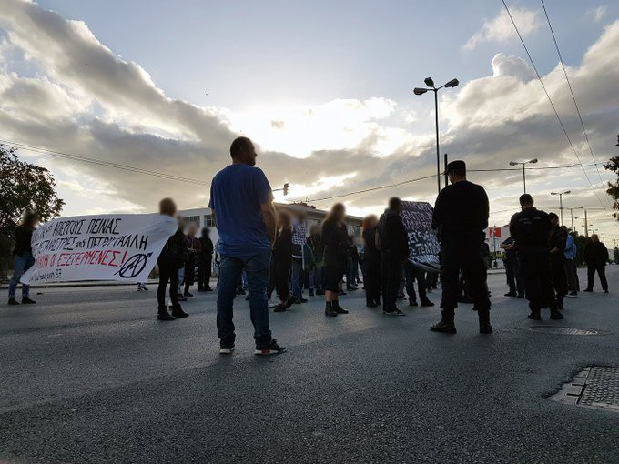
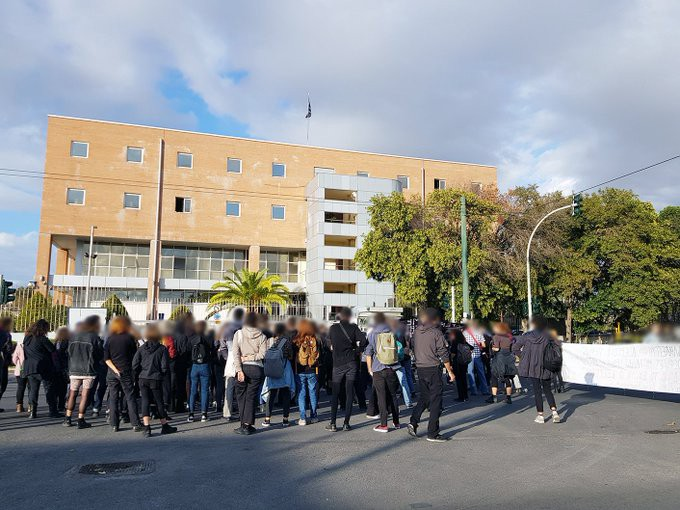
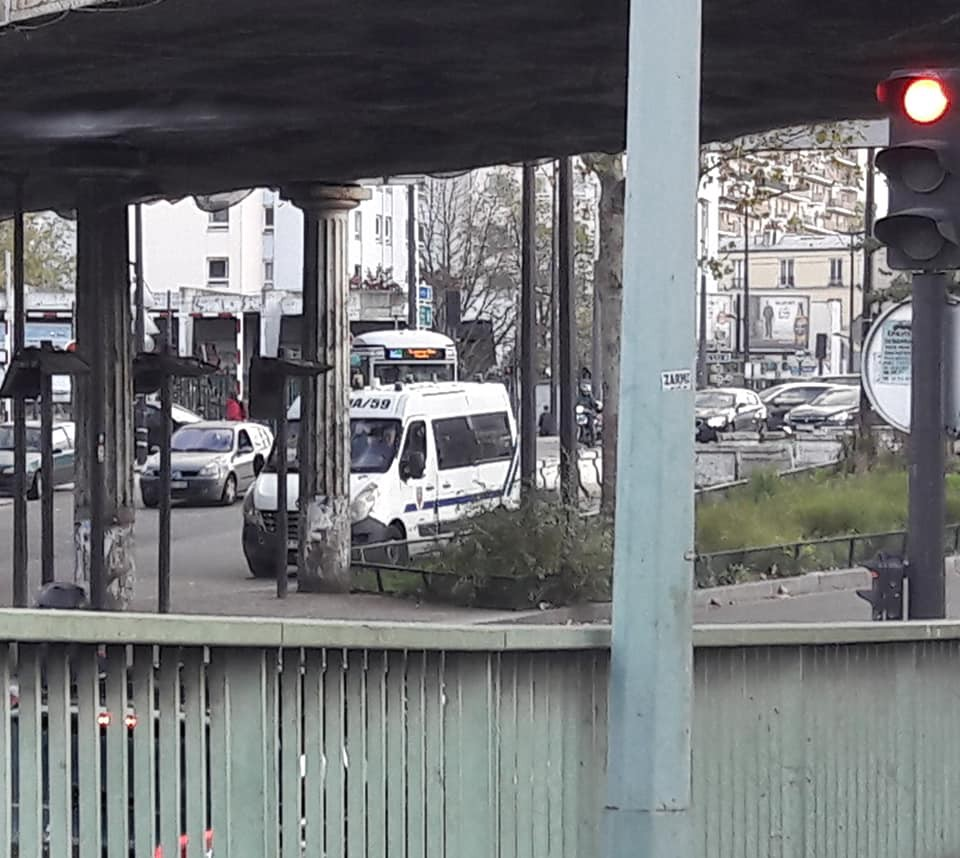
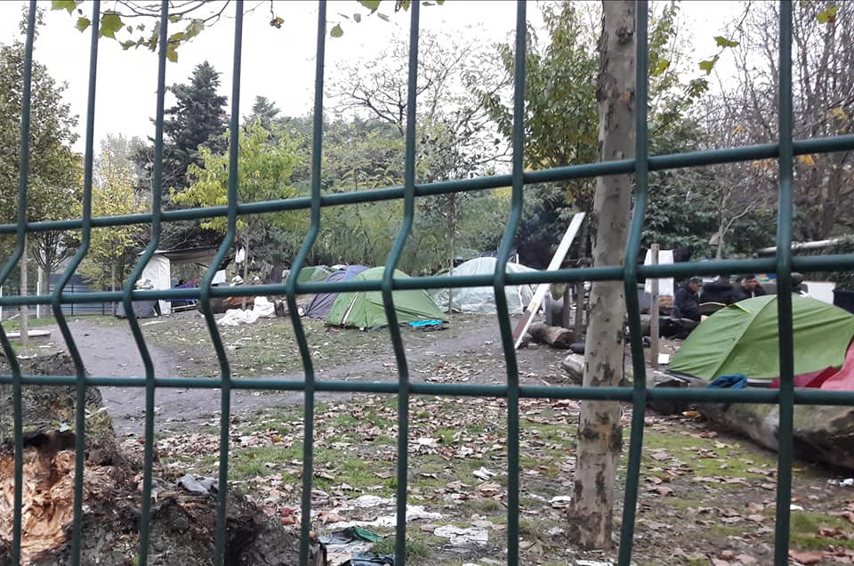

### AYS Digest 9–10/11/19: Bosnian police now beats and robs people, too
#### New accounts of police violence in Velika Kladuša confirmed by doctors // Maltese authorities coordinate interceptions at sea in collaboration with Libya // La Lega closes a pro bono clinic in Italy // Mass\-deportation from Sweden scheduled for the 12th of November // Volunteer calls and other news

Beaten by Croats, beaten by Bosnians: it’s becoming hard to tell a difference\. Photo: M\. Husaković / AYS
#### FEATURED

▪ 10 000 border guards
▪ Meter\-high fences
▪ Border fortifications, 1000 kilometres long
▪ The deadly moat of the Mediterranean Sea
▪ Thousands dead

30 years ago, the fall of the Berlin Wall raised hopes for an open Europe; today we are surrounded by more walls than ever before\.

■■■■■■■■■■■■■■ 
> **[Sea-Watch International](https://twitter.com/seawatch_intl) @ Twitter Says:** 

> > ▪10 000 Border guards
▪Meter-high fences
▪Border fortifications, 1000 kilometres long
▪The deadly moat of the Mediterranean Sea
▪Thousands dead

30 years ago, the fall of the Berlin Wall raised hopes of an open Europe; today we are surrounded by more walls than ever before. https://t.co/dLPUWI2zkq 

> **Tweeted at [2019-11-09 13:42:38](https://twitter.com/seawatch_intl/status/1193161978241527808).** 

■■■■■■■■■■■■■■ 

### Abused in a Bosnian police station: “they even took my asthma inhaler”

Friday morning, a walk to MSF’s clinic to meet a few people and check about the situation, as usual\. A young man approaches\. Here, in the Bosnian border town of Velika Kladuša, we are used to seeing sadness in the eyes, despair and disbelief regarding the situation of people on\-the\-move\. But one could immediately feel the man had been suffering something “unusual\.”

His empty look, as if he were dead inside and had lost all kind of hope and faith, spoke volumes about his physical and mental state\. He started to tell us what had happened to him the day before, on Thursday, November 1st, 2019, in Velika Kladuša\.

An open\-air camp in Velika Kladuša, where people stripped of all dignity hope to enter the EU\. \(Photo: NNK\)

As he was walking in the street, a young man from North Africa had his bag stolen by “a girl”, who immediately ran away\. Firmly trusting the Bosnian authorities, Amir\* headed wards the police station to report what had just happened\. Instead of enforcing the law, as is their duty, after receiving his complaint the respondent explained how the 4 officers put him in the corner of a room, and beat him\.

> “They kicked me with their feet on the chest, I could not breathe\. They also beat me on the ear\. I cannot hear anything on this side now\.” 

The doctors who checked him the day after confirmed that he should only recover after a few days, due to the physical shock he had received to his ear\.

> “They took the document I had from the camp, my money and my phone\. I had just bought a phone the days before\. I have asthma and they also kept my asthma inhaler\.” 

Then they drove him around 10–15 km away, the young man having to walk back in the cold, bruised and scared and confused about who to trust\. This did not happen in Syria or in Afghanistan\. Nor was it done by the border police in Croatia\. This occurred in Velika Kladuša, in Bosnia and Herzegovina, and clearly shows a worsening situation in the country, accompanying the start of the winter\.

Bosnian police officers apprehending people in the center of Bihać\. \(Photo: Margot Durand / AYS\)

Violence from authorities is done with clear impunity, people being beaten in front of everyone’s eyes\. In Bihać, another border town 60 km from Velika Kladuša, the police violence is systematic, especially in front of Bira camp, even against minors without any official report being published\.

AYS has published an [extensive report](ays-special-documenting-human-rights-violations-in-vučjak-camp-923607ace85d) describing the beatings and forcible relocations to the notorious Vučjak camp, which is [soon to be evacuated](ays-daily-digest-8-11-2019-around-800-people-to-be-moved-from-vučjak-to-other-camps-in-bih-b4a57dc6076f) \. Reporting from Vučjak, Arye Wachsmuth writes: “one warm meal in some time was given out two days ago\. MSF was not in the camp for some time either I am told\. All who are sick are not being treated at all\. People are not even capable of telling about was is happening to them anymore in whole sentences, they repeat it’s bad and seem very hopeless\. Many are obviously already very weak\. There is no other word then apocalyptic to describe how a place with semi\-active people could look like\. I did see some camps since 2015 and I can only emphasize how desolate it is and how everything is in decay\.”

While refugees are being robbed and beaten every day, nobody is being held accountable for those unlawful acts, whether in Croatia, Bosnia or anywhere\. We are talking about countries which have the pretension to enter in the European Union \(EU\) or the Schengen area\. NGOs working in the field have published [an open letter](croatias-schengen-membership-should-be-halted-until-human-rights-are-respected-6062df8ccb14) , warning that abuses and violations of human rights should rule out EU and Schengen accession, a statement that was later shared with the representatives of the European Parliament and [expanded by the Human Rights Watch](https://www.hrw.org/news/2019/11/08/eu-address-croatia-border-pushbacks) \. The European Comission, however, is turning a blind eye at illegal practices in its [official communication](https://www.europarl.europa.eu/meetdocs/2014_2019/plmrep/AUTRES_INSTITUTIONS/COMM/COM/2019/11-06/COM_COM20190497_EN.pdf) to the European Parliament\. Instead of effective investigation, European money is still being invested in police forces and in the means to chase people and terrify them, ensuring that that they have broken bones, run out of money and energy to fulfill their dreams: a simple life, a job, a way to sustain their family and give a good education to their children\.

Violence is systematic and left unpunished for too long: a woman beaten up by the Croatian police officers in August 2018 — since then, there has hardly been a day without such border violence\. Photo: BVMN
- _This feature was written by AYS, NNK and BVMN volunteers in Velika Kladuša and Zagreb\. Names are changed to preserve anonymity\._

#### LIBYA

Multiple sources in the UNHCR GDF say the former Abu Salim detainees still aren’t being fed\. This — from UNICEF — & some protein bars/biscuits from IOM is the only food they’ve been given since arriving inside on October 31, journalist Sally Hayden reported\.

Refugees in [Zawiyah](https://www.facebook.com/hashtag/zawiyah?source=feed_text&epa=HASHTAG) are desperate and worried after other 7 of them, including women and a disabled person, were told by [UN Refugee Agency](https://medium.com/u/75f2bdd89854) that their asylum claims have been refused and they will not be evacuated to safety, so they should just leave, Giulia Tranchina writes\.

> This policy of rejections is highly problematic in Libya, where there is an ongoing civil war, systematic detention, abduction, torture, and slavery of Africans and no safety anywhere\. 

**Questions are also being raised about the UNHCR’s Libyan staff making these “rejection” decisions when many of them never speak to refugees, only giggle with the police, don't seem to care about refugees’ torture or lack of food or water, and are often hit by scandals of corruption, racism, ignorance, collusion with detention centres bosses and traffickers\.**

](assets/c6f9f98322c9/1*prSqht_ESqbWVZ52BeJwaw.jpeg)

Photo: [Giulia Tranchina](https://www.facebook.com/rastajuly?__tn__=%2Cd%2AF%2AF-R&eid=ARCcC5Z3tbu2e_U-338985kSqWVF9O8MpDuLQuVBm44DG3oOkvJ6-tr1Ovm3g0ioIFFzuS5v4xw2QNuj&tn-str=%2AF)

Also, there is lack of interpreters, no information about the asylum process, no written reasons for rejection and no opportunity to seek a review of such decisions\. All asylum seekers in Libya should be given emergency evacuation to safety, then their asylum claims should be considered by trained impartial professionals in a situation of safety\. In all this, refugees in Zawiyah continue to suffer from hunger, lack of sufficient clean water and sanitation, tuberculosis and other diseases and lack of proper medical care, abuse and violence by the police traffickers running the centre, Tranchina writes\.

#### GREECE
### Islands

During the weekend, at least eight boats arrived on the Greek Aegean islands, carrying 329 people\.

■■■■■■■■■■■■■■ 
> **[Nikolas Georgiou](https://twitter.com/mpodil) @ Twitter Says:** 

> > #Refugees stranded in Samos island disembark at Pireaus, to be transferred to mainland camps.
#Greece #refugeesgr https://t.co/6USCUS0ecw 

> **Tweeted at [2019-11-11 00:34:16](https://twitter.com/mpodil/status/1193688355931865088).** 

■■■■■■■■■■■■■■ 

The situation has never been worse in the ‘camps’ on the Aegean islands, long\-term volunteering groups and individuals confirm\.

](assets/c6f9f98322c9/1*v4keCEwr_ZSjfc2Gkof2NQ.jpeg)

Photo: [Ihab Abassi](https://www.facebook.com/ysalaam?__tn__=%2Cd%2AF%2AF-R&eid=ARC85LdiUdkpMuqnLYxQKnIKsOf99BmONw2y0cKMQOsC5IVKjkVKWZO-HyG7L9ZSHf6RIu4usPOug0bf&tn-str=%2AF)
### Volunteering

[Lighthouse team](https://www.lighthouserelief.org/volunteer) is looking for volunteers for the coming months in Greece\. However, they remind that the selection process for Lighthouse volunteers takes into account each applicant’s skillset and specific programme needs\. “Applying to a posted position does not guarantee that there will be an available opportunity in your preferred location\. Please note that all applicants must be 23 years of age at the time of their application\. We reserve the right to re\-direct your application when our staffing needs have already been met in a specific geographical location or programme\.”

Thessaloniki — A volunteer teacher/ teaching assistant is still wanted to work on Tuesdays, from 2–5 in the afternoons\. If you’d be interested in helping teach beginner \(A1/ A2\) English, please feel free to reach out to: [https://www\.skyschool\.world/thessaloniki](https://l.facebook.com/l.php?u=https%3A%2F%2Fwww.skyschool.world%2Fthessaloniki%3Ffbclid%3DIwAR1I31zSvANnvDKEPDv-rcK00hfW4hQ_Dw9UKGJP2Ls-_EN-J7rBOTBfvzk&h=AT0pfToGvNpOl5HsamecBWZL_QnHhpQjRKZbrQMQktdl1V2lHiNvYoa6v8TR_zhhqRMBwNcIE2anXKCHrX1kErxgd3rPsrOOIhyPV-tytbunhibY2DXhH_EzNjZ0RwY4WIpyKc3H-Tk_Adqr6_c)

■■■■■■■■■■■■■■ 
> **[NoBorders](https://twitter.com/Refugees_Gr) @ Twitter Says:** 

> > Το νέο που μας αφορά πραγματικά για τα #Διαβατά είναι ότι λόγω των εμπλοκών που προέκυψαν μεταξύ των εγκλωβισμένων στο στρατόπεδο #refugeesgr, έγινε μέσα σκούπα και 71 άνθρωποι πάνε για απέλαση, γιατί έτσι 

> **Tweeted at [2019-11-10 21:05:14](https://twitter.com/refugees_gr/status/1193635750371348480).** 

■■■■■■■■■■■■■■ 

Support rally on Sunday on Day 7 Hunger Strike of 8 Women at Petrou Ralli Detention Center in Athens\.

Demo in solidarity with women detainees on hunger strike since November 2 in the cells of Petrou Ralli immigrants\` administrative detention centre in Athens\. Greek Gov new law expands adm\. detention up to 36 months\. — NoBorders
#### MALTA

Although this comes as no surprise, it is now confirmed that Maltese authorities coordinate interceptions at sea in collaboration with Libya\. This prevents people escaping from a warzone to reach a place of safety in Europe and violates international human rights conventions, AlarmPhone confirms\.
The person at the centre of Malta’s scandals is Neville Gafa, about whom AYS wrote a few weeks ago\. Reacting to what’s been happening, both Neville and the government denied any knowledge of the meeting and the Prime Minister claimed he wasn’t even an employee\. Here is what happened:

■■■■■■■■■■■■■■ 
> **[Marc Tilley](https://twitter.com/TilleyMarc) @ Twitter Says:** 

> > Introducing Neville Gafa, a short thread detailing his recurring face in Malta's increasingly controversial relationship with Libya. 👇🏾👇🏾 👇🏾

Perhaps we now have the answer to this: https://t.co/lJJqdpxDJ3 

> **Tweeted at [2019-11-10 10:11:05](https://twitter.com/tilleymarc/status/1193471130729930752).** 

■■■■■■■■■■■■■■ 

■■■■■■■■■■■■■■ 
> **[MISSION LIFELINE](https://twitter.com/SEENOTRETTUNG) @ Twitter Says:** 

> > Remember when our Libyan "friends" came to pay us a visit during a rescue? Well here is a picture from 2017 of how the same crew and ship treat the people they've returned to a war zone. I'm sure you can decide for yourself who values your human rights more in this situation. https://t.co/4GtUaQdKE9 

> **Tweeted at [2019-11-09 16:35:06](https://twitter.com/seenotrettung/status/1193205382002462720).** 

■■■■■■■■■■■■■■ 

#### ITALY
### Rome

On the streets of Rome, along with hundreds of civil society realities, teams from Sea Watch and Mediterranea demanded the abolition of the Security Laws\.

> Those that keep our ships locked in the port while many and many risk their lives in the central Mediterranean\. 

■■■■■■■■■■■■■■ 
> **[Sea-Watch Italy](https://twitter.com/SeaWatchItaly) @ Twitter Says:** 

> > 👫Oggi abbiamo percorso le strade di Roma per chiedere l’abolizione delle #leggisicurezza.

Con #SeaWatch, tante organizzazioni, realtà della società civile, cittadine e cittadini che come noi, rivendicano la libertà di movimento e chiedono politiche di accoglienza e inclusione. https://t.co/aseIayEwI5 

> **Tweeted at [2019-11-09 18:35:51](https://twitter.com/seawatchitaly/status/1193235771471335424).** 

■■■■■■■■■■■■■■ 

The Italian Globalist reports that the Jimuel medical clinic in Riace, which was made up of volunteer doctors who treated migrants and citizens free of charge, was closed by the Northern League administration on Friday morning\. Doctors have been invited to move to another, yet unavailable, space\.

> “We have never asked anyone for the tax return, we were open to everyone\. The operation carried out by the administration damages the weakest sections of the population”\. — _head of the Clinic said_ 

#### FRANCE

Many CRS vans, and a chase after people is what [Solidarité migrants Wilson](https://www.facebook.com/Solidarit%C3%A9-migrants-Wilson-598228360377940/?__tn__=kC-R&eid=ARDXiSCOVOXGhg8KcRYxZ6_m3HLStQIcCYzNurahJ0XTuzBO-ewJXKBJONqOMDm32eHCfHn5RLRtXYv7&hc_ref=ARQLQ180T0zq4YJZLXhLJ-DxlEvaVDMInnPwbiRg6gZGZQ7Xrf5uubFbUbrnt9nOQQg&fref=nf&__xts__%5B0%5D=68.ARDbaxtEeZggbsXY9wrNpFpJMp0IOck5qUSuPVxaQuSNtJIKnNOr5bQL9kI3bKZVnaF-2ks7Q2R-mQZx_htEMQ_FDheXppHyshWb9xDvv2FzWKn8d4Kc9Ry-3Ff1Q2TkT9IHybDo91k0Meef7zmqzDhggzhdEGJ7izs4Tu_GRmvq0w_q9qIwSDe5FAf_BHtXfOYKE6ACzZvxmYrsTmertchkWdCCbP_EmYlCcBUy63HT9w18w6eCPLGjHmMm27BkNIfVgs5Gv-GX9f7YZw3zz0K2x3F86rG7TVWLa63NKjCt5YDZmoOBntgykzQZyGHB--0puuLqqmHIZL4acis3Y4rQNQ) witnessed in Saint\-Denis\. The city barred the place so that people couldn’t put their tents back in place, and a CRS van is watching over the situation\.

In Porte d’Aubervilliers, around 200 people were taken away after they were not taken on the buses\. They are still there, those arriving and those who have been staying for a while now\. 3 camps on each other sides of the periphery\. It is windy and very cold\. The people arriving have no blankets or tents and those already there were taken by the police by force on Thursday\.

They encountered a young boy who tells them he had been walking all through the night, and his mobile phone along with the money he had was taken away\. He tells how, after arriving from Guinea, he spent 5 years in Italy, he had his residency permit, but no perspective, so he came to France\.
He says he embarked on his journey at the age of 15, and that he hopes he has the right to rest somewhere as he is unimaginably tired\.

](assets/c6f9f98322c9/1*p2Uu52c9f1VD4miTePe2oA.jpeg)

Photos: [Solidarité migrants Wilson](https://www.facebook.com/Solidarit%C3%A9-migrants-Wilson-598228360377940/?tn-str=k%2AF)
#### SWEDEN

A mass\-deportation is scheduled for the 12th of November\. According to the information available, around 60 young Afghans will be sent back\. The deportation is assisted by Frontex\.

There will be protests outside the parliament, outside the detention center in Märsta north of Stockholm and in several locations around in Sweden\. The protest outside of the parliament, “Circle of Silence”, will take place tomorrow \(Monday\) at 4 pm\.

The deportation flight is planned to leave from Arlanda airport, also north of Stockholm and close to the detention facility in Märsta\.

**If you wish to contribute, either by writing a report or a story, or by joining the info gathering team, please let us know\.**

**We strive to echo correct news from the ground through collaboration and fairness\. Every effort has been made to credit organizations and individuals with regard to the supply of information, video, and photo material \(in cases where the source wanted to be accredited\) \. Please notify us regarding corrections\.**

**If there’s anything you want to share or comment, contact us through Facebook, Twitter or write to: areyousyrious@gmail\.com**

_Converted [Medium Post](https://medium.com/are-you-syrious/ays-digest-9-10-11-19-bosnian-police-now-beats-and-robs-people-too-c6f9f98322c9) by [ZMediumToMarkdown](https://github.com/ZhgChgLi/ZMediumToMarkdown)._
