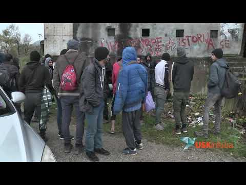

### AYS Daily Digest 11/11/19: Frontex is set to be “strengthened”
#### _Hunger in Libya // Fascist protests on Poland’s Independence Day // Petition against militarization against refugees in BiH // Co\-founder of White Helmets found dead in Istanbul // and more…_

](assets/4f763b498a56/1*S-OTzf8CrR9MozOGiTYRlA.jpeg)

Photo by EU/N Doychinov, provided by [DW](https://www.dw.com/en/eu-border-force-frontex-implicated-in-migrant-abuse/a-49892097)
#### Just another mechanism for:

](assets/4f763b498a56/1*MdJFgOCTzrG_wmsvWWg7vQ.jpeg)

Picture by [Yannis Antonopoulos](https://www.cartoonmovement.com/p/5918/cartoons?p=2)
#### FEATURED
### In a [Council of the European Union](http://dsms.consilium.europa.eu/952/Actions/Newsletter.aspx?messageid=37643&customerid=15165&password=enc_4142373241443941_enc&fbclid=IwAR0nOckO0aCJu8U49DenX_mwTou-z3fTysxoUAvtqUOtqULKhpbIDrCpAQ8) press release:

> “The Council adopted today a new regulation on the European Border and Coast Guard, an important element of the EU’s comprehensive approach to migration and border management\. **The European Border and Coast Guard Agency \(Frontex\) is being strengthened…** The new regulation will incorporate the European Border Surveillance System \(EUROSUR\) into the European Border and Coast Guard framework, to improve its functioning\.” 

Key points include:

→ **Frontex will now have standing corps** of border and coast guards, and return experts \(they will have 10,000 operational staff by 2027\)

→ “Proposed rules will allow Frontex to provide technical and operational support to member states in **return operations** ”

→ “Proposed rules will contribute to **strengthening cooperation with third countries** , by giving the agency wider scope for action and not limiting the possibilities for joint operations to neighbouring countries\.
### Turkey

The co\-founder of the White Helmets in Syria, [James Le Mesurier](https://www.aljazeera.com/news/2019/11/british-founder-syria-white-helmets-dead-turkey-191111133910573.html) , was found dead outside of his apartment in Istanbul\. This tragedy happened only days after the Russian Foreign Ministry accused him of being a spy\. [Suicide](https://www.aljazeera.com/news/2019/11/british-founder-syria-white-helmets-dead-turkey-191111133910573.html) is not as of yet ruled out\. The White Helmets expressed their sorrow on Twitter:

■■■■■■■■■■■■■■ 
> **[The White Helmets](https://twitter.com/SyriaCivilDef) @ Twitter Says:** 

> > The Syrian Civil Defense family extends its deepest condolences to the James family, and we express our deepest sorrow and solidarity with his family. As we also must commend his humanitarian efforts which Syrians will always remember. https://t.co/t8IvpIhyFV 

> **Tweeted at [2019-11-11 12:37:27](https://twitter.com/syriacivildef/status/1193870352360886277).** 

■■■■■■■■■■■■■■ 

### Libya

For two weeks now \(UNHCR has yet to answer\):

■■■■■■■■■■■■■■ 
> **[Sally Hayden](https://twitter.com/sallyhayd) @ Twitter Says:** 

> > Former Abu Salim detainees in the UNHCR GDF centre in Tripoli continue to be deprived of food. https://t.co/SwSclodHAG 

> **Tweeted at [2019-11-11 21:44:14](https://twitter.com/sallyhayd/status/1194007955626242048).** 

■■■■■■■■■■■■■■ 

■■■■■■■■■■■■■■ 
> **[Sally Hayden](https://twitter.com/sallyhayd) @ Twitter Says:** 

> > Meanwhile, the former Triq al Sikka detainees, who were released onto the streets, say they have accepted money from UNHCR &amp; found some shelter but still want protection. The group includes many women &amp; children, as well as torture survivors. They say they are still in danger. https://t.co/bvwxpBnefj 

> **Tweeted at [2019-11-11 23:03:51](https://twitter.com/sallyhayd/status/1194027991539556356).** 

■■■■■■■■■■■■■■ 

The Libyan Embassy in Malta denies their being a secret deal between Libya and Malta for the Libyan Coast Guard to intercept boats and take them back to Libya\. The deal was uncovered by the Sunday Times of Malta\. The Embassy insists that their joint efforts are transparent\. [Find out more here\.](https://timesofmalta.com/articles/view/libyan-embassy-insists-there-is-no-secret-migration-deal-with-malta.749055.amp?__twitter_impression=true&fbclid=IwAR2U2RkMPWtAg0UFVj3V2HHm2xEA1wToXqHBuYi6xl2Y0bylUH0S27kMSN0)
### Greece

In a new arrivals update from Saturday to Monday from [Aegean Boat Report](https://www.facebook.com/AegeanBoatReport/photos/a.285312485325196/693468804509560/?type=3&theater) : 19 boats, 671 people in total

**Saturday:** Lesvos \(5 boats 143 people\), Samos \(1 boat, 48 people\), Chios \(1 boat, 35 people\) Kos \(1 boat, 21 people\), and Farmakonisi \(1 boat, 42 people\) \.

**Sunday** : Lesvos \(2 boats, 86 people\), Samos \(1 boat, 35 people\), Chios \(1 boat, 12 people\), Kos \(1 boat, 68 people\), and Simi \(2 boats, 79 people\) \.

**Monday** : Lesvos \(2 boats, 87 people\) and Kos \(1 boat, 15 people\) \.

](assets/4f763b498a56/1*eAhgNFwlyWk4qD84SdEAhg.jpeg)

“Demonstration after the police attacked to the students of Economical University of Athens\.” Photo by [Nasim Lomani](https://www.facebook.com/photo.php?fbid=10157653129837497&set=a.10151529381012497&type=3&theater)
### Italy

■■■■■■■■■■■■■■ 
> **[InfoMigrants](https://twitter.com/InfoMigrants) @ Twitter Says:** 

> > New migrant arrival data for Italy: 

▶ Phantom landings up 
(Jan 1-Nov 4, 2019: 7,510
Jan 1-Dec 31, 2018: 6,000)

▶ Sea arrivals down 55%
(Jan 1-Nov 4, 2019: 9,944 migrants) 

▶ Boats mainly came from  Tunisia, Libya, Turkey, Greece, Algeria

[infomigrants.net/en/post/20732/…](https://www.infomigrants.net/en/post/20732/italy-phantom-landings-of-migrant-boats-up-7-500-in-2019) 

> **Tweeted at [2019-11-11 13:00:18](https://twitter.com/infomigrants/status/1193876101690527745).** 

■■■■■■■■■■■■■■ 

### Serbia

A boat capsized in the Danube on Sunday night with 10 people who were trying to reach Croatia\. 4 people are missing, while 6 people were able to get to shore\. Authorities are continuing to search for any bodies\. More [here](https://portalanalitika.me/clanak/350805/srbija-prevrnuo-se-camac-s-migrantima-traga-se-za-nestalima?fbclid=IwAR3vXNOq-QtoiCW54Z6fkItRQq7XudAzIoXMsebWUHPM5Dk05vept_UPwHE) \.
### Bosnia and Herzegovina

[German media T](https://www.dw.com/bs/migrantima-na-balkanskoj-ruti-prijeti-bijela-smrt/a-51200150?fbclid=IwAR2r7Rl9eidQMjSY_FDJieQpB2uYPNSkXjuprLrGMkRbt5fC8_J0kykpgrI) ageszeitung writes about the fate of many people trapped in Bosnia and Herzegovina this winter:

> “The 7,000 migrants in Bihac, Bosnia, want to \(cross the Croatian\-Slovenian border\), especially those in the notorious Vucjak camp\. 800 people have not been provided with food for two weeks, and there has been a collapse in the provision of emergency medical aid after the local authorities, under threat of punishment, banned foreign aid workers\. The tents are not heated, there are no more sanitary facilities, and municipal authorities have stopped the supply of water and electricity\. In doing so, refugees do not stop coming\. While women and children move to other places of residence in the city, the men are escorted by police to the Vučjak location\.” 

The EU Delegation to BiH Johann Sattler asked for the camp to be closed due to hygiene reasons and it’s growing list of issues, but did not give an answer to what should happen for people next\.

[Sign this petition to say](https://www.change.org/p/head-of-eu-delegation-to-bih-and-eu-special-representative-in-bih-zaustavite-dalju-militarizaciju-sigurnosnih-agencija-u-bih?recruiter=49271537&utm_source=share_petition&utm_medium=facebook&utm_campaign=psf_combo_share_initial&utm_term=psf_combo_share_abi&recruited_by_id=d01110e0-6811-0130-e4a7-00221964dac8&share_bandit_exp=initial-18932085-en-US&share_bandit_var=v0&utm_content=fht-18932085-en-us%3Av12) “No to further militarization of security forces — use the EU money to improve humanitarian conditions of the people on the move\!” In this **Open letter to Ambassador Sattler, Head of EU Delegation to BiH and EU Special Representative in BiH:**

> “ Appreciating the fact that you are newly arrived, we wish to draw your attention to the fact that significant portions of the money provided by the EU for so\-called “migration management” is directed towards purchasing equipment for security forces in Bosnia and Herzegovina\. Rather than for the provision of humane and decent conditions for people on the move EU money is being used for the fortification of borders and militarization of police\.
 

>  Also, since you represent the EU in BiH, we also feel a duty to voice our objections to the EU’s politics of closed borders\. The people on the move who are stuck in BiH could not arrive to BiH without already having been in the EU\. Preventing them from re\-entering the EU through violence perpetrated by Croatian and Slovenian border police is both a crime against humanity and is contributing to rising tensions within BiH\. We also find it the matter of deep concern that the EU has donated cages in which people crossing from Montenegro to BiH are being kept, and that this inhumane practice is being implemented within BiH\.” 

[**Here is a fundraiser**](https://www.facebook.com/donate/3054070934619329/) to check out in order to help people in Bosnia in the upcoming cold winter months ahead\.

[**If you are looking to volunteer**](https://www.facebook.com/groups/144469886266984/permalink/446879699359333/?hc_location=ufi) in Bosnia and Herzegovina, Medina Imsirovic writes:

> “We are always looking for volunteers to work with refugees around Sarajevo and Ilidza\. So if you are interested in our safe house, please let me know\! We are always looking for teachers \(languages, maths, music, art, dancing, etc\. \), people who could help us around the house \(plumbing, painting, etc\. \), and so much more\.” 

### Slovenia

[Here is an excerpt Infokolpa’s statement](https://www.facebook.com/notes/second-home-in-exile/izjava-infokolpe-ob-novih-smrtih-na-meji/1008235832849775/) on the new deaths at the border:

> “The civic initiative of Infokolp, together with other organizations and the media, has long warned that the Balkan route is not a security threat, but a humanitarian and political catastrophe, triggering tragic fates as a result of police misconduct\. From the point of view of international law, the Slovenian police conducts an unlawful practice of disregarding applications for international protection and participates in the chain\-based collective return of migrants across the green border to Bosnia and Herzegovina\. 

> In the wider Kolpa area to the south lies an invisible cemetery, the Schengen “defense moat”, operating outside legal and humanitarian norms\. Ten days ago, two people were drowned in Kolpa, and recently a 20\-year\-old Syrian citizen died from cold and exhaustion at Ilirska Bistrica\. These deaths are not accidental, but a direct consequence of the repressive border regime of the Republic of Slovenia and the European Union\. Death is merely the final scene of the systematic violence summarized in the concept of the “Fortress of Europe” that migrants encounter daily in the Balkans\.” 

### Poland

](assets/4f763b498a56/1*Gug-sxXfk3yEWfG0iNaYdg.jpeg)

47,000 people demonstrated in Warsaw’s Independence Day march on Monday Photo by [Reuters](https://www.voanews.com/europe/tens-thousands-join-polands-nationalist-independence-day-march)

In [Warsaw’s Independence](https://www.repubblica.it/esteri/2019/11/11/news/polonia_festa_nazionale_ultradestra-240878017/?ref=fbpr&fbclid=IwAR3NFaR7sZIZAEwFpYvmSyxOlr9J6LtCpVJ8pwHkihYsgIsy-2zhmLUcBwc) Day march on Monday, the far right revved up with tens of thousands of protesters\. Many racists slogans and chants were used, including those that incited violence against “‘the Jews who want to rob the homeland,’ the homosexuals, and the European Union\.”

[The fascist protest](https://www.nytimes.com/aponline/2019/11/11/world/europe/ap-eu-poland-independence-day.html) was accompanied by a counter protest, were people chanted “bella ciao” and “Warsaw free from Fascism\.” Reports indicate that many people, however, see the march as a sign of patriotism and are unaware that it is organized by far right groups\. Yet the far right is continuing to grow in Poland, with fascism on the rise\.
### France

](assets/4f763b498a56/1*cna8XmI3OrBN9qiClVON2A.jpeg)

Photo provided by [Phil Kerton](https://www.facebook.com/photo.php?fbid=10157965320712806&set=gm.10156743704314562&type=3&theater&ifg=1)

Ways to help Solidarité migrants Wilson on Tuesday:

](assets/4f763b498a56/1*Nb46wrgOiqIWY--YRCiHKg.jpeg)

“From 15:00 Collective Kitchen to prepare meals \(in Saint\-Denis, not far from the front\-popular metro; address given in pm\) \. At 20:00 we will all meet on Wilson Avenue in Saint\-Denis \(at church level, at 131 → where we usually make meals\) \. Team building to go distribute meals\.” Photo by [Solidarité migrants Wilson](https://www.facebook.com/permalink.php?story_fbid=1274310092769760&id=598228360377940)
### EU

[In a UNHCR update](https://data2.unhcr.org/en/documents/download/72161?fbclid=IwAR2Oa1BUnN6z1vUpyRgIwZAeeKTnGQQSNhSntzEeZGE9x_cpGVEMio97BFk) on Mediterranean arrivals to Europe January through September 2019, **81,300 people arrived via the three Mediterranean routes\.** The most common route was the Eastern Mediterranean route from Turkey to Greece \(63%\), the Western Meiterranean route from primarily Morocco to Spain \(30%\), and last the Central Mediterranean route, from primarily Libya to Italy \(6%\) \.

Of the people arriving, 46% were men, 21% women and 33% children\. The Eastern Mediterranean route had the highest percentage of children and women arriving at 36% and 24% respectively\. The Central and Western Mediterranean routes had a much higher percentage of men \(>73%\) \.

Also up to September, it is estimated that 1,042 people died in route\. This is a decrease from the same reporting months in 2018, where estimates are 1,853 people dead\. The deadliest route is still the Central Mediterranean route\.
#### **Find daily updates and special reports on our [Medium page](https://medium.com/are-you-syrious) \.**
#### **If you wish to contribute, either by writing a report or a story, or by joining the info gathering team, please let us know\.**
#### **We strive to echo correct news from the ground through collaboration and fairness\. Every effort has been made to credit organizations and individuals with regard to the supply of information, video, and photo material \(in cases where the source wanted to be accredited\) \. Please notify us regarding corrections\.**
#### **If there’s anything you want to share or comment, contact us through Facebook, Twitter or write to: areyousyrious@gmail\.com\.**

_Converted [Medium Post](https://medium.com/are-you-syrious/ays-daily-digest-11-11-19-in-a-new-eu-council-press-release-frontex-is-set-to-be-strengthened-4f763b498a56) by [ZMediumToMarkdown](https://github.com/ZhgChgLi/ZMediumToMarkdown)._
