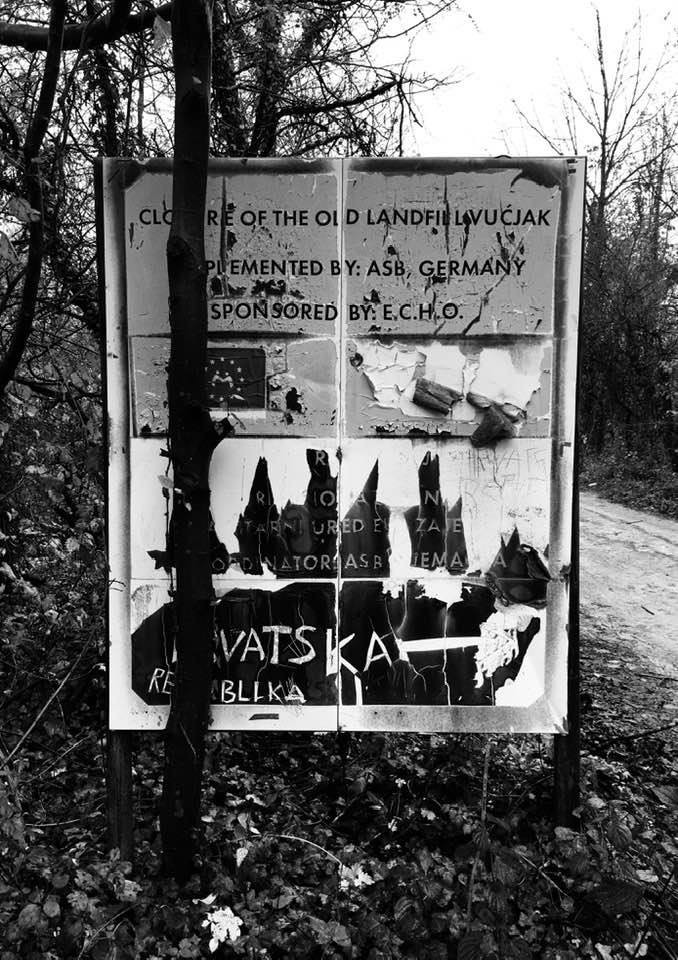

### AYS Daily Digest 13/11/19 — Sweden: Deportations to Afghanistan continue as 9 adults and 3 children die in Kabul

Situation worsen on Leros Island /// Daily discrimination in Lesvos /// Paris in crisis, again /// 24\-hour curfew to be implemented in Miral and Bira /// Vucjak, Bosnian government favourite camp …

 \)](assets/50082109f4e8/1*GsfmOeirKBhi5YkVBWi_4Q.jpeg)

\(Photo Credit: [Solidarité migrants Wilson](https://www.facebook.com/Solidarité-migrants-Wilson-598228360377940/?__xts__%5B0%5D=68.ARCcBv6xJ2P0sj4uTySzgdYUqvLKDJgdrqvuqyFDB8wAI8m58gPXicCyCe4plt2FQybcBVV79iJp7-oAfw26NjOR0bV957CrKXUz317MsREOoltqoHm3NclDn2OrcqPcIPb42LQ0A3W7Ratl2pAVklxseAhDq0Zz4bVzewyh38lcuhaU2GkAEQg6OMgJzpk9Uocx6Lv_A_E_EAiIY4bfm7IIgJbRf7phvN-uKMGX2JSJeFc82NYSVBCFw32q6Q9_hBE_luMw9XSWOk6Xt91Nem09Z-JlH3qwEqZXIWnKRPFyOAAzJD4lhsE9LOU6OgwLLJkHVgKxEGWpq-dQvyIbVLGN5w&__tn__=k%2AF&tn-str=k%2AF) \)
#### FEATURE — Sweden: Deportations to Afghanistan continue as nine adults and three children die in Kabul

Frontex, the EU’s border agency, and the Swedish authorities [deported 30 young Afghans on Tuesday evening](https://tidningensyre.se/2019/12-november/massdeportation-till-kabul-fran-arlanda-ikvall/) \. The Frontex\-chartered plane left from Arlanda Airport north of Stockholm, with Kabul as the final destination\. In Austria another 15 individuals boarded the plane\.

 BlackTuesday marked the deportation of 50 people from Sweden to Afghanistan\. Photo Credit: [Yahya Aliyar](https://www.facebook.com/yahya.aliyar/posts/679322539141336) \)](assets/50082109f4e8/1*wGPOOyaN7eWcod8G4PFpmA.jpeg)

\( [\#](https://www.facebook.com/hashtag/svarttisdag?source=feed_text&epa=HASHTAG) BlackTuesday marked the deportation of 50 people from Sweden to Afghanistan\. Photo Credit: [Yahya Aliyar](https://www.facebook.com/yahya.aliyar/posts/679322539141336) \)

This is the largest group to be deported from Sweden since September, when 50 people were deported from Arlanda Airport to Kabul\. At the time it was the largest ever deportation back to Afghanistan from Sweden\. [The country’s border police had a list of 55 names](https://www.etc.se/inrikes/ny-deportation-planerad?fbclid=IwAR1bHH0ACnw3sr5zt47va9YHnxOdNuJiuFQ7zgSW_6_9mW83z6XftGfIzXI) , but only 50 people can legally be deported at once\. 25 of the people who were notified about the deportation remain in detention facilities in Sweden, such as in Märsta and Gävle\.

One of them is A\*, a 17\-year old boy\. However, according to the medical ‘age exams’ of his knee joint he has been said to be over 18, while an examination of his teeth put him at under 18\. These exams have been widely criticized by doctors and experts\. The Migration Agency, unsurprisingly, has decided that A\* is 18, as his knee joint suggests\. But he was born in 2002\.

One of the most prominent critics of the age exams is [pathologist Fredrik Tamsen\.](https://www.lakartidningen.se/Aktuellt/Nyheter/2019/10/Hippokratespriset-gar-till-rattslakaren-Fredrik-Thamsen/?fbclid=IwAR0GT54B3bds49FbovOFEge0T9kLDHSR7ufDUBVgYZ6VOn4rMg-NSNqPfwY) This autumn, he was awarded the Swedish Society of Medicine Ethical Prize \(in Swedish: Svenska läkaresällskapet\) for criticizing, evaluating and questioning the medical\-age exams\. In practice this means that he questioned his own employer, Rättsmedicinalverket, who is responsible for conducting the medical\-age exams on behalf of the Migration Agency\. The government promised an independent investigation of the age exams earlier this year, but this has yet to begin\. In other words: A\*, and many others, remain above 18 in the eyes of the Swedish authorities and the Migration Agency\.

There are currently 7000 rejected asylum seekers from Afghanistan in Sweden\. They are all waiting to be deported\. One thousand of them are below 18, so authorities are waiting for their 18th birthdays to deport them\.

Most of the people on the border police’s deportation list were being held yesterday in the detention facility at Märsta, close to Arlanda Airport\. Two, including A\*, were in the detention facility in Gävle, which is located further north\. A\* was not given any information at all about the deportation\. All he knew was that his name was on the list\. Later, the plane left without him\. Information about a new deportation by the end of November has still not been confirmed\. But it will most likely take place\.

There were protests in several towns across Sweden on Monday and Tuesday\. Activists gathered outside of the parliament, and in other locations, on Monday in the so\-called [\#CircleofSilence Sweden](https://www.facebook.com/hashtag/circleofsilence_sweden?hc_location=ufi) protests\.

[Activists also gathered](https://www.facebook.com/photo.php?fbid=10211505360069728&set=a.1246832671027&type=3&theater) outside the detention facility in Märsta on Tuesday\. They saw the bus arrive to pick people up and then the bus left for Arlanda Airport, conveniently located not far from the pre\-deportation accommodation\. Among the protesters were Christina Höj Larsen, politician from the Left party \(Vänsterpartiet\) \.

In total, 45 people were deported from the European Union to Afghanistan last night\. On the morning of Wednesday the 13th at least [12 people](https://www.pajhwok.com/en/subscription-required?redirect_from=558636) , [including three children](https://www.facebook.com/100011907876724/posts/679787899094800?d=n&sfns=mo) , were killed when a car bomb detonated in Kabul, the city where they all arrived\. At least 20 people were injured\.

Amnesty in Sweden condemned the deportation last night\. The Swedish Red Cross has actively been lobbying for deportations to stop since 2017\. The list of humanitarian organizations wanting to stop deportations is almost as long as the list of deadly incidents in the country\.

**Afghanistan is NOT safe\.**

SEA

■■■■■■■■■■■■■■ 
> **[Frontex](https://twitter.com/Frontex) @ Twitter Says:** 

> > In October, the number of illegal border crossings on Europe’s main migratory routes fell 17% from the previous month to 16 800 due to a drop in arrivals on the Greek islands. The total for the first 10 months was 16% lower at 107 900 [bit.ly/FX-o19](http://bit.ly/FX-o19) https://t.co/aukyMsN3Ct 

> **Tweeted at [2019-11-12 14:51:37](https://twitter.com/frontex/status/1194266503719333889).** 

■■■■■■■■■■■■■■ 

GREECE
#### Arrivals

In the last two days \(Tuesday and Wednesday\) 20 boats arrived on the Greek eastern islands, carrying 644 people\. There were 915 people \(23 boats\) stopped instead by the Turkish Coast Guard\. \(See [HERE](https://www.facebook.com/AegeanBoatReport/photos/a.285312485325196/694984717691302/?type=3&theater) for a breakdown of the arrivals, and [HERE](https://aegeanboatreport.com/) for more info and data\) \.

As usual, we rely on the precious work and the data of Aegean Boat Report\.
#### Transfers

On Tuesday, 119 people were transferred to the mainland\. Despite this, conditions are not improving\.

■■■■■■■■■■■■■■ 
> **[Samos Volunteers](https://twitter.com/samosvolunteers) @ Twitter Says:** 

> > 261 new arrivals on Samos in the last 48 hours. The camp is now nearly 10 times over capacity #samosnewarrivals 

> **Tweeted at [2019-11-13 08:50:31](https://twitter.com/samosvolunteers/status/1194538019296104448).** 

■■■■■■■■■■■■■■ 

#### Situation in Leros

RSA is reporting on the conditions of the makeshift shelter outside the hotspot at the former psychiatric hospital on Leros Island:

> Hundreds of refugees currently live in structures outside the Leros hotspot, in exceptionally risky conditions; they are staying in tents by the sea, in makeshift shelters and in abandoned buildings of the former psychiatric hospital, without electricity, water and sanitary facilities\. 

> At the same time, medical assistance for those living inside the hotspot as well as those living outside it is nearly non\-existent\. Meanwhile due to significant gaps in medical staff, vulnerability assessment procedures have been stalled and consequently the speed of transfers of refugees to the mainland\. This critical situation was identified during a visit by a member of Refugee Support Aegean \(RSA\) between 20 and 24 October, also through testimonies provided by refugees\. 

■■■■■■■■■■■■■■ 
> **[RSA](https://twitter.com/rspaegean) @ Twitter Says:** 

> > Z*, a 63-year-old woman from Iraq who suffers from diabetes, musculoskeletal problems and is unable to walk, told us: 
#Refugeesgr #Leros #hotspot #Aegean @[ProAsyl](https://twitter.com/ProAsyl) 
[rsaegean.org/en/refugees-tr…](https://rsaegean.org/en/refugees-trapped-on-leros/) https://t.co/erub7ienhN 

> **Tweeted at [2019-11-13 10:51:21](https://twitter.com/rspaegean/status/1194568427463163904).** 

■■■■■■■■■■■■■■ 

Read the report [HERE](https://rsaegean.org/en/refugees-trapped-on-leros/) and read the whole thread on [twitter](https://twitter.com/rspaegean/status/1194568427463163904) \.
#### Daily discrimination in Lesvos

■■■■■■■■■■■■■■ 
> **[Hamed Haqyar](https://twitter.com/haqyarhamed53) @ Twitter Says:** 

> > #lesvos #police can not manage to ofer a schedule services to #Refugeesgr those who are applying for ID and Travel document waiting more then 2 weeks, they don’t care if some one is losing job or what happening is my shit. I am gathering information to case file against them. 

> **Tweeted at [2019-11-13 20:23:34](https://twitter.com/hamedhaqyar53/status/1194712429223202821).** 

■■■■■■■■■■■■■■ 

#### Anti\-refugee sabotage in Northern Greece

Local media [report](https://www.facebook.com/photo.php?fbid=10157659918117497&set=a.10151529381012497&type=3&theater) that one of the electricity supply poles that provides power to the refugee centre in Veria, northern Greece was sabotaged by local racists\.
#### Refugee reception centre set to open in the Peloponnese

A disused monastery near Agrampela \(in Achaea, Western Greece — 100 km south of Patras, the closest city\) is set to become a refugee reception centre and to host 50 to 60 Syrian asylum seekers, [according](https://greece.greekreporter.com/2019/11/13/greek-monastery-set-to-become-refugee-camp/?fbclid=IwAR3f82na7SnhA4hfZY0VFAndghXU-sQWuNQBr274WJjCIS4TvF94j7hhFfk) to local media\. It is reported that local authorities are hiring chefs and Greek language teachers\.
#### Anti\-migrant event unwittingly helped to raise money for refugees

A “pork\-and\-booze” barbecue event, organised by the right\-wing group, United Macedonians, outside Diavata refugee camp, which was any way thought to attract people more for free souvlaki than for right wing politics, has now been [cleverly used](https://bbqsponsortour.eu/2019/11/11/nationalist-barbecue-unintentionally-raises-e3500-for-refugees/) by a Dutch group to fundraise money for refugees, raising €5,500\.
#### Phone credit for refugees and displaced people

As reported in the [Athens Volunteers Information and Co\-ordination Group](https://www.facebook.com/groups/AthensVolunteersInformation/?ref=group_header) , [PC4R](https://www.pc4r.org/) are finally able to offer phone credit for refugees in Greece\.

To be eligible for their service, refugees need to be one of the following:
- Living without secure shelter \(tents, shacks, squats, night shelters all acceptable, we do not accept requests from people in long\-term safe accommodation such as government housing or living with family and friends\);
- In transit \(or at risk of attempting transit in a manner that could potentially place them in danger\);
- Detained against their will \(in police custody, facing deportation, held in detention\);
- Under the age of 18 and unaccompanied by an adult \(the service is available also for those unaccompanied minors living in safe accommodation\) \.

People are allowed to apply for credit as many times as they want, but they must wait 30 days after receiving credit before they can apply again\. PC4R will collect certain information such as phone number, Facebook URL and the IMEI code/s in order to enforce our 30\-day rule\.

Refugees can register online [HERE](http://www.pc4r.org/robot) and join their [fb group](https://www.facebook.com/groups/Credit4Refugees/) \.

PC4R also have an automated service for trusted volunteers and organisations to use if they wish to submit an application on behalf of refugees\. Read more [HERE](https://www.facebook.com/groups/AthensVolunteersInformation/?ref=group_header) \.
#### Volunteers needed in Athens and Lesvos

Drapen i Havet — A Drop in the Ocean is in need of qualified English teachers in Athens and on Lesvos, who can start in December and stay for six weeks or more\. To apply, you must be over 25 years old and provide a clean criminal background check\.

If you’re interested, read more and sign up [HERE](https://www.drapenihavet.no/en/volunteer-in-field/?fbclid=IwAR0naIUpCaS0gz2lmsk36H1qW5CM8BpteC9JfY9-bRghetMGNhsJDIAdJxY) \.

BOSNIA AND HERZEGOVINA
#### Vučjak camp will not close — 24\-hour curfew for migrants to be implemented

 \. Water also runs out frequently\. Photo Credit: [Arye Wachsmuth](https://www.facebook.com/arye.wachsmuth/posts/2793742900676079?hc_location=ufi) \)](assets/50082109f4e8/1*KYR6ld5oQifcoDkpKcK3QA.jpeg)

\(At least 100 of the almost 200 who were in line did NOT get food after waiting for an hour or more in the rain\. Let alone the other 800\+ in the camp [\#vucjak](https://www.facebook.com/hashtag/vucjak?hc_location=ufi) \. Water also runs out frequently\. Photo Credit: [Arye Wachsmuth](https://www.facebook.com/arye.wachsmuth/posts/2793742900676079?hc_location=ufi) \)

Contrary to what we recently reported, local media [state](https://www.slobodnaevropa.org/a/migranti-vucjak/30269671.html?fbclid=IwAR3IoyljH0PK86YAAiyBS2AyecwNFYKhF7S3IqMPiwlmShQlSnHLkBYyN1A) that Vučjak camp will not close, and neither will the Miral and Bira reception centres\. The situation for refugees in the Una Sana canton seems to become bleaker by the day\.

In fact, according to a recent announcement by the Cantonal Minister of the Interior, Nermin Kljajic, and the Health Minister, Nermina Cemalovic, after a meeting of the Task Force on Migrant Housing of the Una\-Sana Canton, **it will be the last to close** \.

> The attitude of the task force is that we are going to block completely the facilities of ‘Miral’ and ‘Bira’, and that ‘Vučjak’ remains the centre for all migrants who come to the Una\-Sana Canton\. The blockade means that there will be no possibility of new migrants entering ‘ Bira’ or ‘Miral’, nor will they have the opportunity to go out into the city, to walk, etc\. Only those who are interested in leaving the facilities and the country will be allowed to do so\. 

In other words, a 24\-hour curfew will be imposed from 15 November for residents of Bira and Miral, who will be allowed to exit the buildings but not its premises\. People will only be allowed to leave if they are trying to cross the border to Croatia\.

This is quite clearly illegal, impossible to regulate and against people’s basic human rights\. In the usual blame\-game between authorities in Bosnia, the cantonal government seems to be willing to fuel of a humanitarian disaster to force the other responsible parties in the state to step in\. Again, the most vulnerable people with no rights or options will pay for this typical dispersion of responsibility and fight for funding\.
#### **Vučjak — the Bosnian Government’s favourite camp**

 \)](assets/50082109f4e8/1*XyqoPYTcWJBhfbUsuVXK9g.jpeg)

\(Photo Credit: [Arye Wachsmuth](https://www.facebook.com/arye.wachsmuth/posts/2793725897344446?hc_location=ufi) \)
#### Young man forcibly ejected from train

A young man from Egypt was forcibly removed from a train to Sarajevo after he was accused of lighting a cigarette in the toilet, which he denied\. Even though his ticket was valid he was told he must get the next train\. The event was recorded by other passengers, watch it [HERE](https://www.facebook.com/watch/?v=1644691642333155) \.

Many people have [reported racist policies](https://www.etrafika.net/drustvo/71093/zeljeznice-fbih-imamo-pravo-izbacivati-ljude-iz-voza/?fbclid=IwAR3VgLkRa7w3r6yfru6hsGSI1zUKdzHtU3GseyvMyYfIbjHjAuQGAdJyUp4) of segregation on trains in Bosnia, which the train company obviously denies\.

SERBIA
#### Living conditions at the Serbian Border

[No Name Kitchen](https://www.facebook.com/NoNameKitchenBelgrade/?__tn__=kC-R&eid=ARCQaHCKh37lKg8mKUYKY-V2s6pVF2jFWZgt9BS2SCRGtsyT9fOrqEYtJter3IWnKoK5SQXFhIDqE8C8&hc_ref=ARTYN-7mSWDXSTAfTBrxISyJLAzveRP9BpQ5152avhAAE9FcOuNJyFhoEDlFxwJ-5GM&fref=nf&__xts__%5B0%5D=68.ARB01sKB7u9wOkWCV-eSbGN-RHYc15RAk0k4SFohOOy4NPbPHlDtq-Er5YnH6Xem5Prs2LHHdyd7F97yFEQF7Mx1tMs70dcUp1e8eGyoCfZ6fHUVzHalim8QGAkfVd32TRcalEGI7g20N7hALqcsPis9TSD0aNrEg0rwsHCh7s9VNrefKU1A9JqBEHYaeTOCqsZi2a7-8v_bDmL77miTCKQ-8RXmfnb0ajCKjooQv_OdHm4idUTkhNps9uEQHEN8pPDKKTmvCjqLdbMFrnbE9cufTCieJaNcn9Rnhn06tU7ktqZHE6WQdMSou_wazGD4NLxxQOZH0x-5j-QqLi_0ELQ) report on the precarious living situation for people at the Serbian/Croatian border desperately trying to move forward on their journeys while facing continuous state violence and brutality\.

 \)](assets/50082109f4e8/1*Y5XKRZyJn8RM-D52x-O2Ag.jpeg)

\(Photo Credit: [No Name Kitchen](https://www.facebook.com/NoNameKitchenBelgrade/posts/838732836525002) \)
#### New Arrivals in Belgrade

The [Info Park Team report](https://www.facebook.com/groups/144469886266984/permalink/448091912571445/?hc_location=ufi) s that 36 new arrivals were identified on Tuesday, the majority of them claiming to have entered Serbia via North Macedonia\.

> Police patrols were present in the parks and nearby streets in the area of Savamala, at several points during the day, warning refugees and other migrants not to stay in the parks and directing them to the reception centers\. In the evening hours, some 217 persons were present at seven locations covered by Info Park’s regular evening headcount\. 

FRANCE
#### Paris in Crisis, again…

[Solidarité migrants Wilson](https://www.facebook.com/Solidarité-migrants-Wilson-598228360377940/?__xts__%5B0%5D=68.ARCcBv6xJ2P0sj4uTySzgdYUqvLKDJgdrqvuqyFDB8wAI8m58gPXicCyCe4plt2FQybcBVV79iJp7-oAfw26NjOR0bV957CrKXUz317MsREOoltqoHm3NclDn2OrcqPcIPb42LQ0A3W7Ratl2pAVklxseAhDq0Zz4bVzewyh38lcuhaU2GkAEQg6OMgJzpk9Uocx6Lv_A_E_EAiIY4bfm7IIgJbRf7phvN-uKMGX2JSJeFc82NYSVBCFw32q6Q9_hBE_luMw9XSWOk6Xt91Nem09Z-JlH3qwEqZXIWnKRPFyOAAzJD4lhsE9LOU6OgwLLJkHVgKxEGWpq-dQvyIbVLGN5w&__tn__=k%2AF&tn-str=k%2AF) report from Paris on results of the **59th and “final evacuation”** during which 985 tents and five blankets were stolen by police\. Some people got to spend the weekend in a gym but most are now homeless once again, though now without tents\.

> For the past three years, we have seen several hundred people sink into madness\. One because he was refused asylum, another because he had found it impossible to get an appointment, a third because this meant that he and his pregnant wife had \(for incomprehensible legal reasons\) more right to “material conditions of reception”, others because they had been made to repeat ten times the story of the torments they suffered and then they were treated as liars\. Others because they were told they were adults, even when they had papers that proved otherwise, and we sent them back into the dark night\. 

They continue to provide 600 hot meals to those affected\. To support them though another winter of crisis in Paris look [HERE](https://l.facebook.com/l.php?u=https%3A%2F%2Fwww.lepotsolidaire.fr%2Fpot%2Ftusyjrwc%3Ffbclid%3DIwAR0OfZlvedZuBDr1mgiC6ga6XHEUz4PO1Hhfp2U0PC0LItR-3tQC6dFtNtk&h=AT3ztBzg5K-iiIyVLhAPhvhjUT8TZaYC0rxolJGg7gr1QlHT0mXgR8mDPDMTNWZo7xxy8XeuxW-eHpMRGHVdlCO51XfnVjiOHDybGjNqHh1npeDSCr-0PkSCOzb0rL6ySwgSmPt7lWVlDoFHFD-Wsc2CymwdVpirKGK5RnWRo9iYYrs91tRGA98apjmMe4HRHU-iDVeIcI2HGINrM9jjeoBl3pKoJBR9l46YRBVscpWrMKHPYwnwRwFdYLKqObKI3JL6-tgjr1kizaluxTA_elftVVdBrjDjTfeR0pSuzrm9b3SKiaIFxqBcUf-LWonhjOx4smrovmv02_OUKtuKKknlK1BFXxirKDM_DSVgW27MVuAcGSrYN9e8xb7Mmz9zKNe-kSbUVNjDpPjyiJbXVaDgR8I0CuSJYCJeb0NdkUB-49WRPmjjTcJPLtiyEHqwGK-_u6uAfj44Lezy6gGL024N7elV8HtCTHCu9VSX1XymfYcgi7YYziBHkyRs9mQDgrAYEBdo6SzuuBD1u6SLMuU5wRWXdq0UH_pwX8WzVKET13vMub1lYuohPAQlc6iI7Wa5KaGMTzQRoIwsPrtLozGsvyQAcQ-gT6SJzVag8SiRczb30jYgkZ4z) \.

SWEDEN

[750 unaccompanied young people](https://www.msn.com/sv-se/nyheter/inrikes/hundratals-ensamkommande-kan-bli-bostadslösa/ar-BBWBilK?fbclid=IwAR2InRE9Nlapkzk_S-CT46Fk3QBGABo843gv5rd0axyTmyMZ5ItPfMExLA0) will be told to leave the Migration Board’s housing on 31 January with no guarantee of alternative support from the municipality in which they live\. These school\-aged children \( [15 to 18 years old](https://sweden.se/society/education-in-sweden/) \) are covered under the ‘upper secondary school law’ and have the right to stay in Sweden to complete upper secondary school, but the Migration Board has decided that this does not mean they are the responsibility of the state because they do not have a residence permit and are thus not covered by the Housing Act\. However, they may also not fall under the Social Services Act and thus may not be eligible for municipal support either\.

**Find daily updates and special reports on our [Medium page](https://medium.com/are-you-syrious) \.**

**If you wish to contribute, either by writing a report or a story, or by joining the info gathering team, please let us know\.**

**We strive to echo correct news from the ground through collaboration and fairness\. Every effort has been made to credit organizations and individuals with regard to the supply of information, video, and photo material \(in cases where the source wanted to be accredited\) \. Please notify us regarding corrections\.**

**If there’s anything you want to share or comment, contact us through Facebook, Twitter or write to: areyousyrious@gmail\.com\.**

_Converted [Medium Post](https://medium.com/are-you-syrious/ays-daily-digest-13-11-19-deportations-to-afghanistan-continue-as-12-people-die-in-kabul-50082109f4e8) by [ZMediumToMarkdown](https://github.com/ZhgChgLi/ZMediumToMarkdown)._
