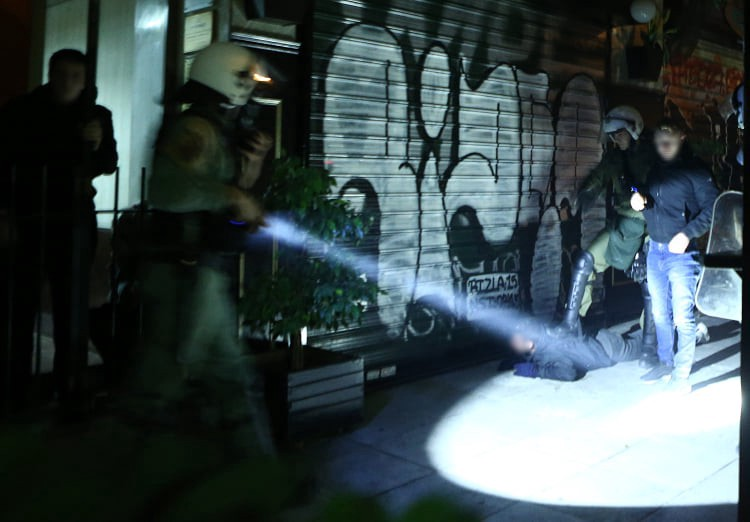
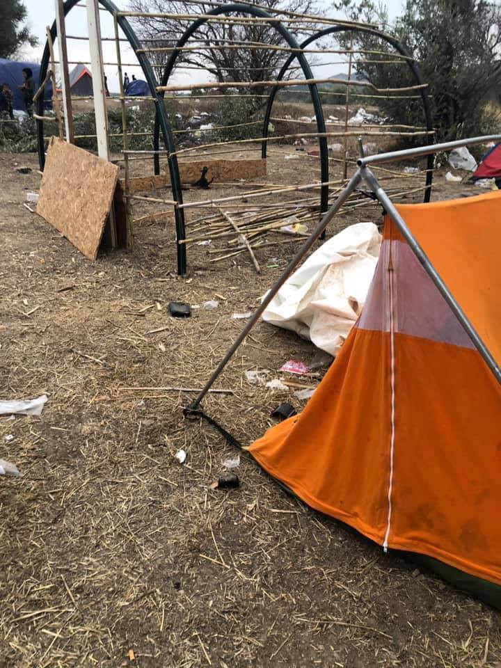
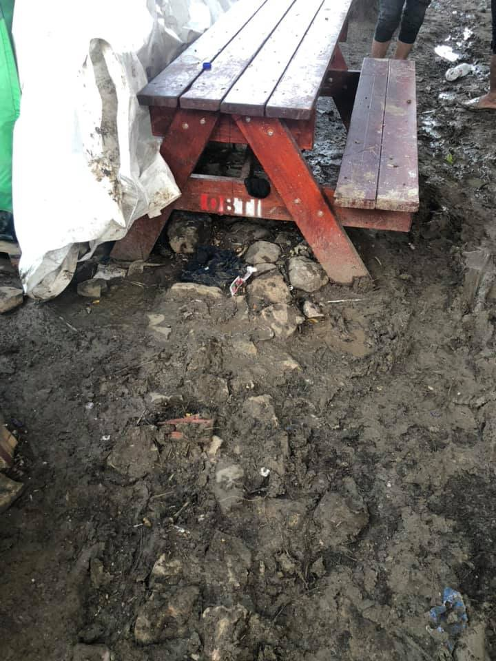
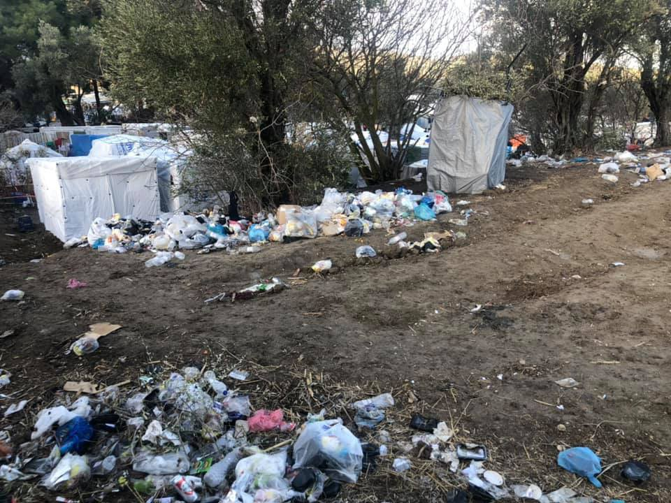
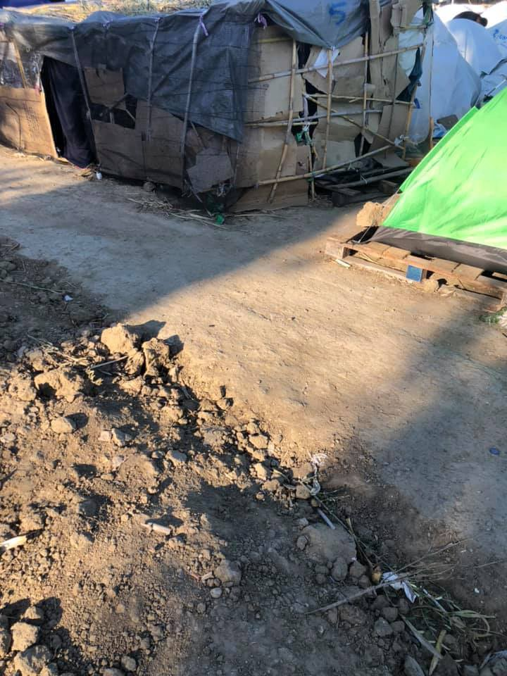
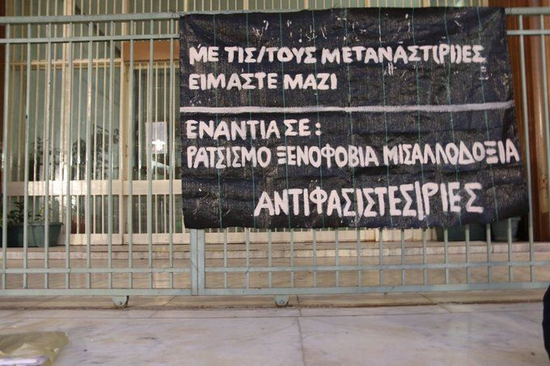

### AYS News Digest 16–17/11/19: A man shot by a police officer is fighting for his life at a hospital in Croatia
#### Possibly shot in the back by a police officer, a man undergoes a long surgery with yet unknown results in Rijeka, Croatia / Another child’s life lost in Moria / Institutions taking the Balkans as a place they no longer need to publish the same data / A report from the CPR in Torino, Italy — Horrible realities of detainees & more

Athens, police raid against the gathered young people protesting and remembering\. Photo of November 17th\. Thousands of Greeks took to the streets peacefully on Sunday to commemorate the brutal suppression of a student uprising 46 years ago\. They marched in groups from the grounds of the Athens Polytechnic and some were again violently greeted by the police\. \(Photo: [Marios Lolos](https://www.facebook.com/marios.lolos.1?__tn__=%2CdC-R-R&eid=ARDPVtXm23PI5ey8rR-X17c-iS6kxdZptoesSqlE1Iyc3HjWGXXiFFWNSnCwPEpQ_ArqOOACx0j36ixA&hc_ref=ARSr_VZlYoR7njHVn_TzupLlqiC9dNNfiOLlepkZ1IfmEoL3oF8H7bevzIX4jf8_-HE&fref=nf) \)
### FEATURED

As we reported earlier on our social media, a man was shot by Croatian police officers deep in the Croatian territory in the region of Gorski kotar, near the village of Tuhobić\. The man has received multiple wounds in chest and stomach area\.
The first reaction by the Minister of Interior was a statement that “he got injured” while “the police was protecting the border”\. The location of this possibly fatal aggressive move by the officers to an unarmed man was inside the Primorsko\-goranska county, nowhere near the entrance areas to Croatia, but rather in the direction towards Slovenia\.
According to an unofficial statement, the police officer encountered a group of people and allegedly “fired a shot in the air to call his colleagues to help, during which he tripped, and the bullet — under so far unknown circumstances — hit one of the people, possibly after previously having hit the hard surface”\. Surely this story will get updated as time passes\.
The story shaped around the so far unknown situation is going in the direction to sound as if the officers in fact saved the man’s life by “carrying him 3 kilometres towards the more accessible area where the ER team could reach with their mobile unit\.” The same “saviour rhetoric” was used several times before, for example, during the shooting at the children in the van, justifying it as protection against the reckless driver etc\.
Before the official investigation was concluded, the minister stated for the media that the one thing he can say is that “it is not established that the fire arms would have been used to shoot towards a concrete person, with the intention of acting on the person”\. It is important to note that the man was walking with a group of another 15 people, so the only ‘fortunate’ circumstance is that more people were not shot or killed, and it will be interesting to follow developments on what happens to the rest of the group and if their testimonies will be taken into account and if they will be allowed to express the intention to seek international protection in the country if they wish to do so\.
The injured man has undergone an operation to save his life and is still in danger because of the severity of the wounds of the shots that, according to confidential information, seem to have been fired from behind, severely damaging his spine in a way that can possibly leave a person paralyzed\. However, we are still waiting for the official information from the hospital and, of course, the results of the official investigation\.

Perhaps it is good to remind that this is not the first time Croatian “border protection” had fatal or near\-fatal consequences\.

November 21, 2017\.
6\-year old Afghan girl died minutes after being illegally pushed back from Croatia to Serbia\. No one is held responsible\.

May 30, 2018\.
Two 12\-year old refugees, a boy and a girl, shot in the face by Croatian border police\. No one is held responsible\.

November 17, 2019\.
A refugee man is undergoing a surgery after being shot by Croatian border police\.
### GREECE
### A 9\-month old baby died in Moria camp on Lesvos

An infant lost its life in one of the ugliest places, the only place the little one knew, during a battle with dehydration, and unfortunately losing\.
The child of Congolese parents who are asylum seekers and among those stuck in the horrid conditions of Moria was reportedly taken to the health center of the camp on November 10, where a doctor diagnosed severe dehydration\. The infant was transferred to the hospital of Mytilene, however, the child passed away on the way, media report\. MSF gave a statement that they had checked the baby in September and in October and given advice to the family\.

So far this year, [more than 47,000](https://www.thenewhumanitarian.org/news/2019/10/30/refugee-surge-Greek-islands?utm_source=twitter&utm_medium=social&utm_campaign=social) people have landed on the Greek islands compared to around 32,500 all of last year, it is reported\.
70 percent of the estimated 5,000 children in Moria are under the age of 12\.
Deaths are inevitable in the current state of things\.

Read more on the situation in Moria [here\.](https://www.thenewhumanitarian.org/news-feature/2019/11/14/Greece-Moria-winter-refugees?utm_source=twitter&utm_medium=social&utm_campaign=social)

On **Chios,** an emergency state in the camp **Vial** is also being described by the activist groups working there\.
There are 6,000 people in squalid conditions, with hundreds of babies and thousands of children among them\. The [Chios Eastern Shore Response Team](https://www.facebook.com/chiosesrt/?__xts__%5B0%5D=68.ARDbRzdKVQxdmq_mjS39T3MjtpGq3ICdEsUd_dy_yPzM7xy2Pak9fw0QANIy-_y0ASRg8z5uPCN00cBWjIGm-VI5Li59lXFRfjhvqqDRY4a-939s8glPYQbxpnQuJIlBYS51KtqzyZLnuSTVZcyqsxQjYqPv3-YdiF0pLlvUJ2GveXjM2CfVYQeXyDtN2BHOulhjUE4UpLZJmvPK5CUCwu4KWuqlxEambiBydtV-LQAn6APapovya-qECWpcF6CKK9wt_9DpWiUn8c5gTpESAMcntWcREiU5nDlW14tMFB7rIQjYnvR66XrSwUH9cr4tfwZHsfdKCuEcmzs8dM6i1DfM0lDxCEOPUP0ZFLk7e_aoQHHtcrZz060peIx358ZeWpR8HDIR6P4qhef-HhDcZ2I8mK0KbuBsv6vbTk9uww6AJ_LtNo6wlY_tujHJwyno_rc0jmiNmEkdnDB-zswJH8rFu1lqNr1dxo_9ZgFp2t179WCBHfOr44w&__tn__=k%2AF&tn-str=k%2AF) has posted some images of the poorly managed camp, stating there is:
NO SAFETY
NO TOILETS
NO RUNNING WATER
NO FACILITIES
NO CLEANING
NO ACCOMMODATION
NO HUMANITY
NO HOPE

In November so far, more than 8,000 people have arrived in the Aegean Islands, usually under adverse conditions\. The Turkish port and police, as well as Greece, did not allow the arrival of more than 6,000 who were returned to Turkey\.

They are investigating several cases of possible pushbacks by the Greek and Turkish coastguards as well as possible human rights violations at the Greek\-Turkish land border [in Evros](https://www.facebook.com/hashtag/evros?hc_location=ufi) as well as at sea\.
### Volunteering

> _If you are fit, strong, resilient, self sufficient, willing to show up every day with a smile; If you can communicate in English, enjoy hard work and are happy to muck into any situation; If you have a minimum of two weeks to give, a good play list, a sense of humour, people skills; WE NEED YOU NOW\._ 

Volunteers are urgently needed in the months of November, December and January to work at the warehouse and distribution of the [Attika Human Support](https://www.facebook.com/AttikaHumanSupport/?__xts__%5B0%5D=68.ARDQJjfwrzkIrRNFSKtifQmZc78haSeA6Q6AeQic9ape_UHIwCuDZFky1tM2lcMzI4VndjMFDozSFv5KnEEx8BinM7vbSH5AggFiWqDtsXxGFLJ-76Zl01t_xSTS0ptaqlAcgh4cPltsVsxnkkYQ-Qnj3VBWRzqpSzqETIjCXC80H_nfXebNdMAQWql3wDPgeevT5PTyPB_cCw0aFgTRURbvl9VhyQbJ6lIJIWmI-wpFiJI6SiPuoEFnYTz85ZZL_QhSkZBPccJYokW42nr4RZKpNMYws_-yrd-LrYeQTQ1CDkgUVFCRuyvrLlzWrwFLse6zAYqFiHz85btnEWazASEUZA&__tn__=k%2AF&tn-str=k%2AF) team\. To register your interest to volunteer PM the group or write to their email: hello@attikahumansupport\.org
### Larissa

Antifacist movement stopped for the 3rd time far right groups from gathering against settlement of refugees in the town of Larissa\.

Banner says “we are with refugees, against rascism, xenophobia and hate”
### THE WESTERN BALKAN ROUTE

The [Border Violence Monitoring Network](https://www.facebook.com/borderviolencemonitoring/?__tn__=%2CdKH-R-R&eid=ARAH8YvnM9XnfIsx7WX8wunc0b7R3QQqMwADi41q5Tkq9fdRLo9UOyoyC5qJil76SznsNuRFBvFVjMTI&fref=mentions&hc_location=group) just published it’s October report, covering pushbacks and police violence from Croatia \(and Slovenia\), into Bosnia\-Herzegovina and Serbia\. Highlighted by the trend analysis of this report, pushbacks by Croatian authorities in particular included the use of stripping, fires, water immersion, theft and beatings\. The tactics, shared by multiple respondents and quoting direct statements from the police, show an armoury of formal and informal weaponry which also include: tasers, pepper spray and gatekeeping of asylum\. Each facet of these pushbacks shows a clear intentionality: to compound further the experience of people subject to illegal collective expulsions\. Read in full here: [https://www\.borderviolence\.eu/balkan\-region\-report\-october…/](https://www.borderviolence.eu/balkan-region-report-october-2019/?fbclid=IwAR09tZqgdviaXM4CVBDD3tGXJjHgoVKP94cXa948EypXcLO67vPcvlTdXLg)

The report analyses, among other things:
- Basement in Bajakovo road border crossing used to abuse transit groups
- Croatian police use undressing as a winter border tool
- Use of pepper spray during transportation
- Accompanying Violence: Analysis of practices in Croatia

### Balkan discrepancies in reporting

A Bosnian activist and legal professional has noticed the discrepancy between the two parallel reports of the international organisations involved in the situation, the recently called out EU Special Representative in Bosnia and Herzegovina Johann Sattler \(named in August this year\), and the IOM\.
The EUSR reportedly said that “out of €36 million of the EU assistance provided since early 2018, almost 94% has been spent on caring for the migrants, including setting up and managing five temporary reception centres \(Usivak, Borici, Bira, Miral and Sedra\) \. The remaining 6% has been used to help BiH strengthen its migration management capacities\.” The IOM representative said that 75% was spent on humanitarian assistance in a wider sense: access to health and shelter, and all expenses that are understood under those categories, including food and protection, very likely the private security that is hired at the centres\. The other 25% was invested in the institutions that take part in managing the migrations, meaning the border police and the Foreigners’ Office\.
### ITALY
### The truth of the CPR affair

With the arrival of the winter months, the living situation worsens for many people within and outside of the centres\. The CPR of Corso Brunelleschi seems to have broken heating and “the people are freezing”, [No Cie / No Cpr Torino](https://www.facebook.com/NoCieTorino/?__tn__=%2CdkCH-R-R&eid=ARAEp6_8UesUIOMVEs6sAacWrLIUV8OzyBIzcJgZWbtOLDXdaOEXIi3VB25sgv7HXu5OszRu-QyURHTa&hc_ref=ARQzZt8Oj3TdwnkUxQViFV8wzf0QmHEkwCD7ZJwtvPHVMeLqdQkRH8bEDSpgny5_kGQ&fref=nf&hc_location=group) reports\.
The furniture is missing, as a result of the many days of protest in which the people set fire to the furniture and whatever they found in their cells\.
The situation inside the CPR in Turin is developing along the course of such policies that drastically cut funds and services for the various detention and management centres in the country\.
They report that the showers are cold, there are no mattresses and many are forced to sleep on the ground\. The everyday life of those in the detention centers underlines what uncomfortable and narrow places are part of the CPR system\. The daily routine and sharing of the little that there is reminds the detainees how they have been ripped of their lives to a reality that includes raids, being stopped in the street or a correctional detention\. Economic and bureaucratic complications are reflected in small problems on the agenda: Soap is distributed every fifteen days in packages, the barber passes less and less often and medical visits are something you get with the complicity and insistence of others people detained\.
From what the same inmates tell the group, inside the CPR of Corso Brunelleschi, a boy is in isolation because of scabies, while for six days another boy continues a hunger strike, requesting to be visited and treated as soon as possible\.
Another boy managed to escape 3 days ago and now he’s finally free\.
### AUSTRIA

A deportation protest is scheduled for this coming Saturday:
### [Flughafen\-Demo: Abschiebungen stoppen — Bewegungsfreiheit für alle](?source=post_page-----241e9f919074----------------------)
### [Causes event by Wiener Vernetzung gegen Abschiebungen and 4 others on Saturday, November 23 2019 with 369 people…](?source=post_page-----241e9f919074----------------------)
#### [www\.facebook\.co](?source=post_page-----241e9f919074----------------------)

**Find daily updates and special reports on our [Medium page](https://medium.com/are-you-syrious) \.**

**If you wish to contribute, either by writing a report or a story, or by joining the info gathering team, please let us know\.**

**We strive to echo correct news from the ground through collaboration and fairness\. Every effort has been made to credit organizations and individuals with regard to the supply of information, video, and photo material \(in cases where the source wanted to be accredited\) \. Please notify us regarding corrections\.**

**If there’s anything you want to share or comment, contact us through Facebook, Twitter or write to: areyousyrious@gmail\.com\.**
- [Refugees](https://medium.com/tag/refugees)
- [Digest](https://medium.com/tag/digest)
- [Police](https://medium.com/tag/police)
- [European Union](https://medium.com/tag/european-union)
- [Migration](https://medium.com/tag/migration)

_Converted [Medium Post](https://medium.com/are-you-syrious/ays-news-digest-16-17-11-19-a-man-shot-by-a-police-officer-is-fighting-for-his-life-at-a-hospital-6032689d956f) by [ZMediumToMarkdown](https://github.com/ZhgChgLi/ZMediumToMarkdown)._
