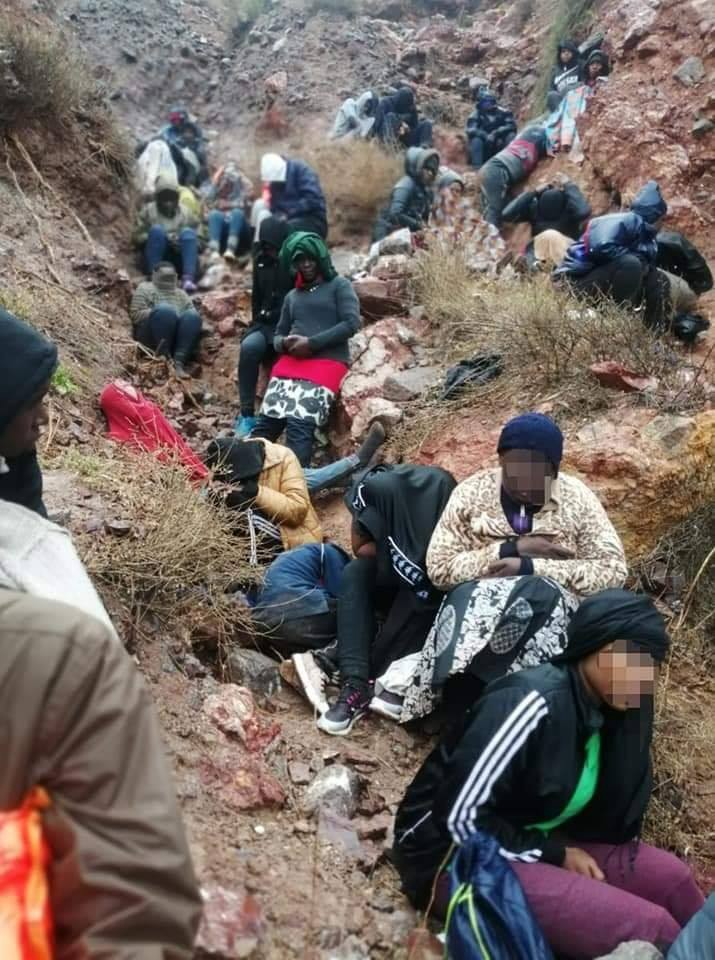
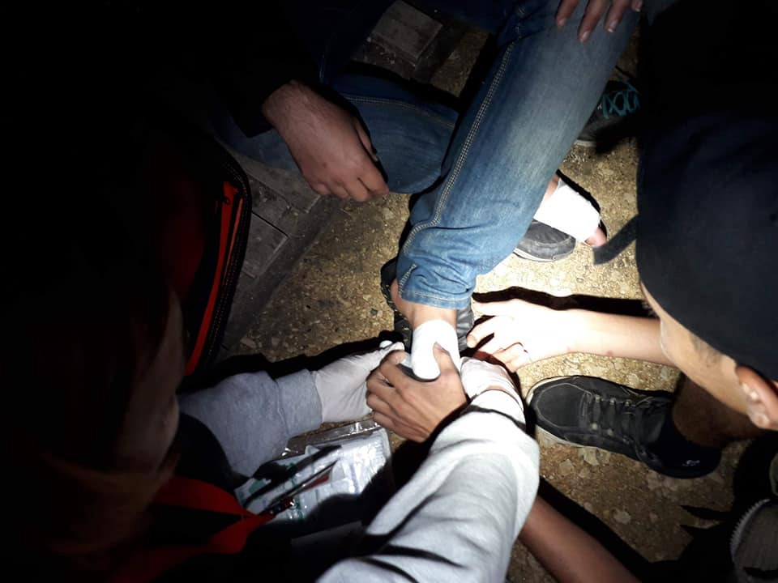
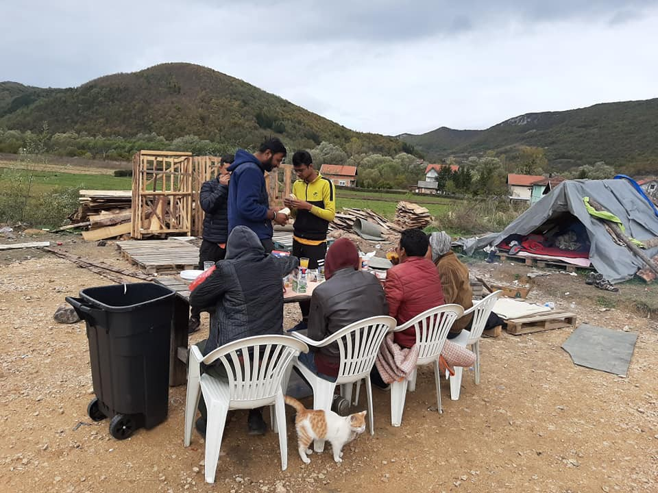
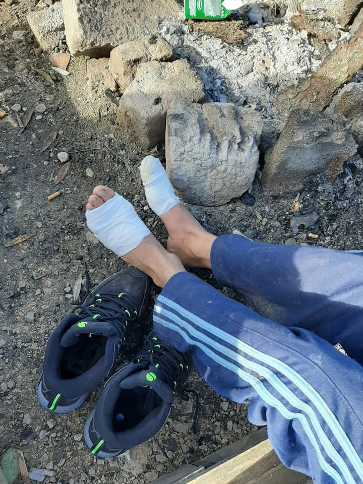
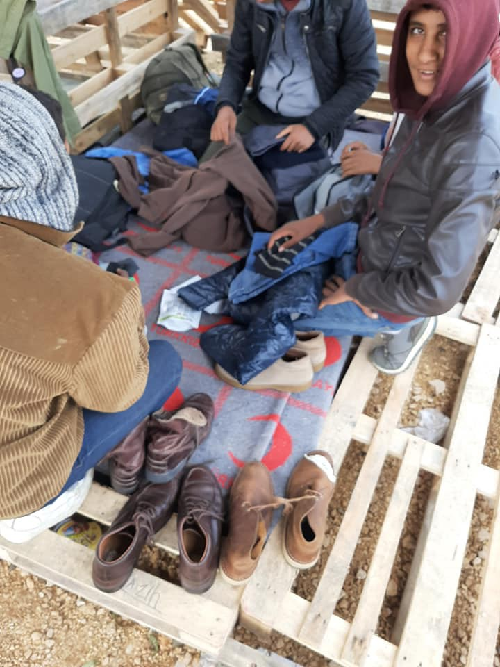
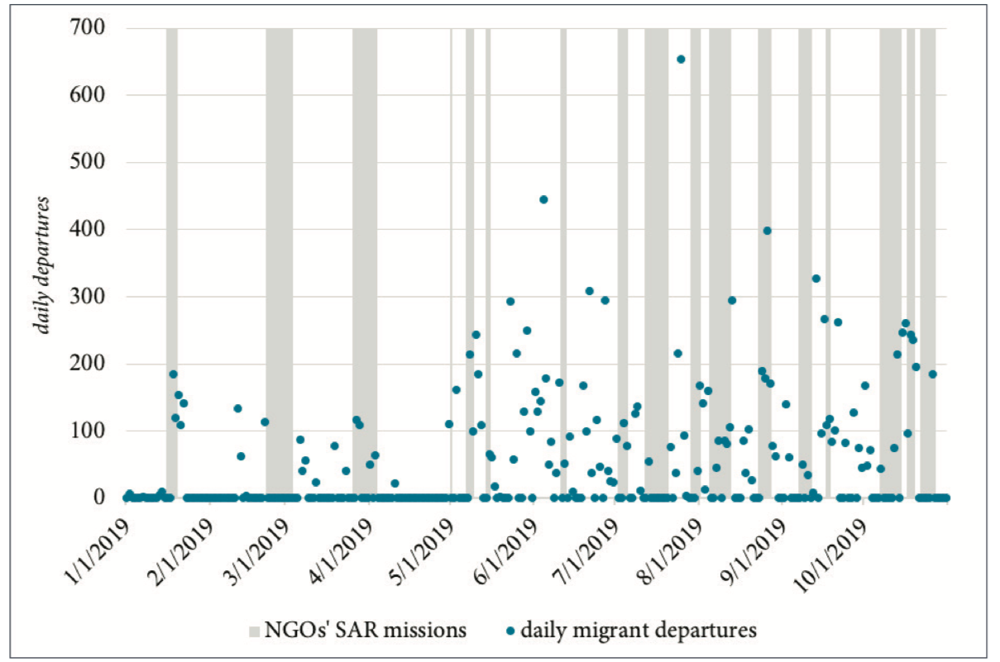

### AYS Daily Digest 18/11/19: New fence to be built between Spain and Morocco, while arrivals via land and sea do not stop
#### Horrible accounts from Libya// 506 people have been pushed back to Ventimiglia in the last week// Useful information for new asylum seekers in Ireland// Arrivals via inflatable boats to the UK// New deportations from the UK// Donations needed in Paris// NGOs at sea are no pull factor for departures…

Credit: NADOR NEW\.
#### **FEATURED**

The Spanish authorities are planning to build an additional barrier that will separate Melilla from Beni Ansar, Nador, starting at the end of November\. The construction will last for approximately 10 months and, according to the Spanish Ministry of the Interior, Fernando Grande\-Marlaska, this time framework will be really hard, given that [“attempts to cross the border will take place even during construction works”](https://www.facebook.com/AmdhNador/posts/2467066566838937?hc_location=ufi) \. For this reason, the Spanish authorities asked Moroccan government bodies for extra help during this specific period of time\.

Only few weeks ago, **[Morocco announced the end of the construction of an 8\-kilometer long barbed\-wire fence](https://hurriya.noblogs.org/post/2019/11/18/tra-marocco-e-spagna-nuove-recinzioni-e-provvedimenti-repressivi-contro-chi-migra/?fbclid=IwAR0727Wp9jtwk_OP5mUHEu4wSkoTRJtswSaTKDPuE2uLqZLyCmSKwAOZ-Ts)** , stretching inside Moroccan territory on the border with Ceuta, that will allow Spain to get rid of its concertina wire barrier, illegal in European territory due to the painful wounds it inflicts on people coming into contact with it\. The barbed wire fence will be replaced by a smaller metal gate both in Ceuta and Melilla\.

The EU is financially sustaining Moroccan authorities with €140 million in order to manage migration flows within the state: €32 million in August to “protect the border from illegal crossings” and €26 million for vehicles and other equipment\. Here, as in Libya, European authorities are guiltily silent on the methods used to contain the number of people attempting to cross: police and auxiliary forces destroying belongings, raiding informal camps, beating and deporting men, women and children, pushing them further away from the border\. Some people are also deported via plane to their countries of origin with the complicity of the respective embassies\.

Discrimination, racial profiling and acts of racism can only accompany such policies\.

[**Arrivals in Spain**](https://data2.unhcr.org/en/country/esp?fbclid=IwAR0727Wp9jtwk_OP5mUHEu4wSkoTRJtswSaTKDPuE2uLqZLyCmSKwAOZ-Ts) **by land have reached the number of 5211, out of the total 27611, from January until early November this year** , in line with the average trend that characterised 2016, 2017 and 2018\. Around 30% of the people who manage to cross the borders and reach European soil is from Morocco, followed by Guinea, Algeria and Mali\.

Meanwhile, just this morning, **80 people, including women and children, reached the Chafarinas islands** , east of Nador, administered by Spanish authorities, who could not support those in need due to bad weather conditions…

…another [**52 people \(16 women and 2 children\) entered Spain via Ceuta**](https://www.ceutaactualidad.com/articulo/frontera/un-conductor-kamikaze/20191118080356093693.html?fbclid=IwAR2TgSdfV-VLGm220ZxNb-D_R9HaCvp3Sc7gBHutLMobp4nzp-pqipqUiFQ) , when the van they were travelling in crossed the border at a very high speed, crashing against the barriers on its way\. All of them are in good conditions and suffered only minor injuries\.
#### LIBYA

■■■■■■■■■■■■■■ 
> **[Sally Hayden](https://twitter.com/sallyhayd) @ Twitter Says:** 

> > A source among the Tajoura bombing survivors in the UNHCR GDF centre is saying the TB patients among them haven’t been given medication in weeks. I believe several people from the Abu Salim group there were referred for TB treatment last week, but they’re being kept separately. https://t.co/IpvjyDXt0m 

> **Tweeted at [2019-11-18 22:17:01](https://twitter.com/sallyhayd/status/1196552917303615488).** 

■■■■■■■■■■■■■■ 

Allegedly, 62 people have been deported via land back to Chad and Sudan from Libya\.

GREECE
#### **A total of 7 boats arrived on Greek coasts since last night, carrying 304 people\.** Please, see [this link](https://www.facebook.com/AegeanBoatReport/posts/699023497287424?hc_location=ufi) for additional details\.

[Here](https://www.facebook.com/AegeanBoatReport/posts/699016800621427) you can find an exhaustive breakdown on the number of arrivals in Greece during the past week\.

CESRT compiled a comprehensive [summary of the situation in Chios](https://www.facebook.com/chiosesrt/posts/2491737867562049?hc_location=ufi) during the past week\.

■■■■■■■■■■■■■■ 
> **[DimitrisLampropoulos](https://twitter.com/LampDim) @ Twitter Says:** 

> > Eighteen (18) families are living in summer tents, totally unsuitable for the bad weather of the last few days, remain outside the Eleonas camp in #Athens, #Greece 
#refugeesgr https://t.co/HvywsZyIhD 

> **Tweeted at [2019-11-18 17:58:26](https://twitter.com/lampdim/status/1196487844342239233).** 

■■■■■■■■■■■■■■ 

BOSNIA i HERZEGOVINA
#### Postcards from Ključ, Una Sana canton…

Credit: Sanella Lepirica\.

ITALY
#### At least **506 people have been pushed back** from France to Italy, only during the past week, as [reported by Kesha Niya](https://www.facebook.com/KeshaNiyaProject/posts/1052015758476624) \. The number includes at least 21 minors and at least 12 women and 3 infants, who report about violence, thefts, extra long detention without water nor food and, for minors, approximate registration procedures\.

> Once again we have been told of several cases of police violence\. One person told us that the French police stole the copy of his récépissé \(French asylum request\) and that he was kicked in the back by a French policeman\. Another man told us that he saw a Sudanese being beaten up by the French police\. 

> A woman who is an asylum seeker in France said she was also slapped by French police and that the copy of her récépissé, which runs until December, was stolen by French police\. She is on the trip with her boyfriend, who is also an asylum seeker in France\. He was banned from Italy for 5 years, was checked by the police in Ventimiglia and brought to France by car\. She tried to meet him and was arrested during the attempt\. French police also stole her boyfriend’s wallet, which was in her pocket\. Both are not allowed to enter the country where the other is right now\. 

> A man told us that he had been beaten by the French police\. 

> Another person told us that he was arrested on a 6:15 a\.m\. train, tied up with cable ties, and was able to free himself a short time later\. He explained he tried to run away from the police but was apprehended and punched several times in the face\. In this confusion he lost his backpack and wallet containing money and documents\. He was then slapped again\. The man appeared very confused at the time of our meeting, but this incident was confirmed by other people who were arrested at the same time\. 

> Several people were peppersprayed in the face by French police when they were released from the PAF\. They reached us crying and having difficulties to breathe\. 

Donations of winter clothes and backpacks are needed for Rifugio di Oulx, Piemonte\. Please, [get in touch](https://www.facebook.com/valsusaoltreconfine/posts/418031798865769?hc_location=ufi) if you can help\!

FRANCE
#### After the evictions in Saint Denis, Paris, [people are starting to gather again around Porte de la Villette](https://www.facebook.com/anne.paq.7/posts/2418079495124654?hc_location=ufi) \. They are in need of food, blankets, tents and sleeping bags\.

UK
#### [39 people reached British territory](https://www.theguardian.com/uk-news/2019/nov/17/39-migrants-detained-after-four-boats-stopped-near-dover?CMP=Share_iOSApp_Other&fbclid=IwAR3YDgJ4mwFQdryCv0JtHfooIX5j4Panmt76xXWstjBr2z1H1BTlUuhYllk) during the weekend, after crossing the Channel with inflatable boats\. All of them are Iranian citizens\.

■■■■■■■■■■■■■■ 
> **[North Atlantic Oscillation](https://twitter.com/northatlanticos) @ Twitter Says:** 

> > #saveshahid @[BBCNews](https://twitter.com/BBCNews) @[HeathrowAirport](https://twitter.com/HeathrowAirport) @patel4witham @[qatarairways](https://twitter.com/qatarairways) @[UNHumanRights](https://twitter.com/UNHumanRights) @[amnesty](https://twitter.com/amnesty) @[Refugees](https://twitter.com/Refugees) @[guardian](https://twitter.com/guardian) @[thetimes](https://twitter.com/thetimes) @[Channel4News](https://twitter.com/Channel4News) @[AmnestyUK](https://twitter.com/AmnestyUK) @[yourHeathrow](https://twitter.com/yourHeathrow) @[MPSHeathrow](https://twitter.com/MPSHeathrow) @[foreignoffice](https://twitter.com/foreignoffice) @[UnityCentreGlas](https://twitter.com/UnityCentreGlas) @[SDVisitors](https://twitter.com/SDVisitors) @[itn](https://twitter.com/itn) @[Reuters](https://twitter.com/Reuters) @[AP](https://twitter.com/AP) https://t.co/uOgzdVi9JZ 

> **Tweeted at [2019-11-18 20:35:15](https://twitter.com/northatlanticos/status/1196527308301053952).** 

■■■■■■■■■■■■■■ 

#### IRELAND

> The information session for newly arrived asylum seekers will take place in @Comhlamh on the 23rd Nov\. We often meet asylum seekers who are placed in hotels and have no idea what’s going to happen next or what they should be doing\. People travelling to Dublin for the session should keep their receipts for travel expenses to be reimbursed\. 

Register through [this form](https://docs.google.com/forms/d/e/1FAIpQLScDfXwktSRkNqnZ5UmhPPVv-3_RCRkNU7DH_mWPOPBEJ3j2wg/viewform) or get in touch with [MASI](https://www.facebook.com/MASI-Movement-of-Asylum-Seekers-in-Ireland-321969801334321/) \.
#### FOLLOW\-UP MATERIAL

A newly published study has found **no evidence of the relation between the number of people trying to cross the Mediterranean and the presence of NGOs at sea** \. More likely, the research suggests that the major factors influencing the departures are related to weather conditions, the instability of the political situation in Libya and the containment policies adopted by Italy and other European countries\.

Daily Irregular Migrants Departures from Libya and NGOs’ SAR Operations \(1 January — 27 October 2019\) \. Credit: E\. Cusumano, M\. Villa\.

You can find the complete study at [this link](https://cadmus.eui.eu/bitstream/handle/1814/65024/PB_2019_22_MPC.pdf?sequence=3&isAllowed=y) \.

**Find daily updates and special reports on our [Medium page](https://medium.com/are-you-syrious) \.**

**If you wish to contribute, either by writing a report or a story, or by joining the info gathering team, please let us know\.**

**We strive to echo correct news from the ground through collaboration and fairness\. Every effort has been made to credit organizations and individuals with regard to the supply of information, video, and photo material \(in cases where the source wanted to be accredited\) \. Please notify us regarding corrections\.**

**If there’s anything you want to share or comment, contact us through Facebook, Twitter or write to: areyousyrious@gmail\.com\.**

_Converted [Medium Post](https://medium.com/are-you-syrious/ays-daily-digest-18-11-19-new-fence-to-be-built-between-spain-and-morocco-while-arrivals-via-be824f93e249) by [ZMediumToMarkdown](https://github.com/ZhgChgLi/ZMediumToMarkdown)._
