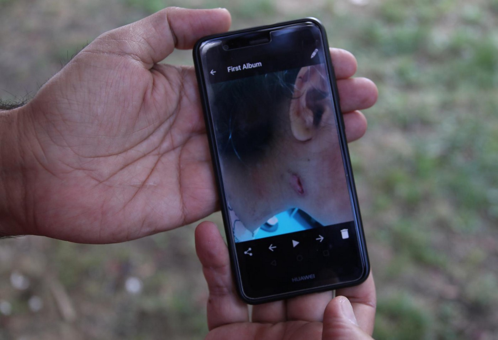
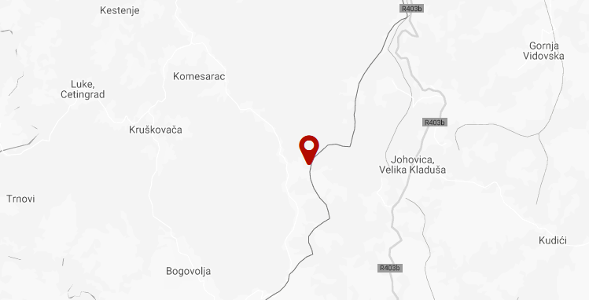
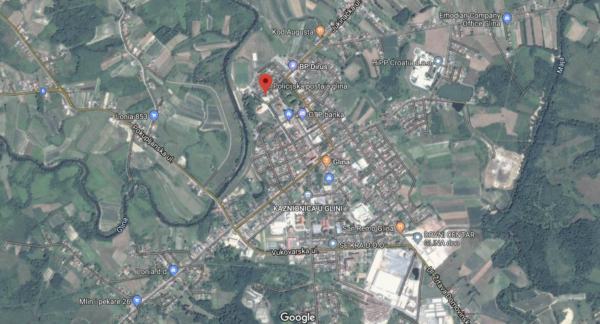
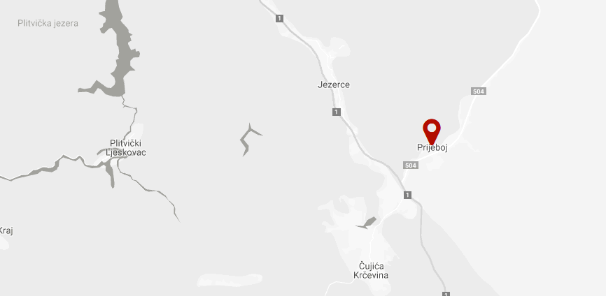
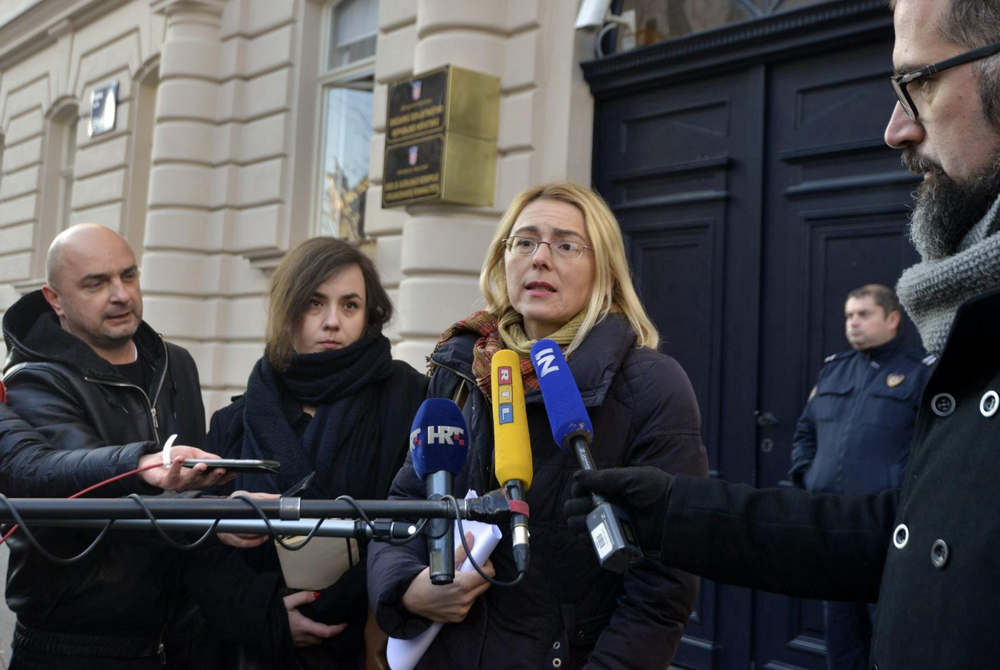

### AYS Special: It is proven, Croatian police regularly shoots at people
#### Border Violence Monitoring Network shared a huge database of incidents involving 1279 refugees who were shot at or threatened with guns by Croatian police officers, in addition to evidence previously gathered by AYS and other groups

Father showing us a photo of the bullet hole on his daughter’s face in Zagreb, Croatia\. Photo: AYS

On Saturday 16th November 2019, a group of people\-in\-transit were [fired upon by Croatian police with live rounds](https://medium.com/are-you-syrious/ays-news-digest-16-17-11-19-a-man-shot-by-a-police-officer-is-fighting-for-his-life-at-a-hospital-241e9f919074?source=collection_home---7------0-----------------------) \. The shooting occurred on Tuhobić mountain, Gorski Kotar, an area close to the Slovenian border\. One man was shot multiple times in the stomach, spine and chest area and remains in a critical condition after four surgeries in a hospital in Rijeka\. The Croatian Ministry of Interior have stated this potentially fatal shooting to be “an single accidental outcome of regular border protection work”\.

However, AYS has been reporting about similar incidents since 2017\. In June 2018, we’ve opened a case at the State Attorney’s office regarding the near\-fatal shooting at a van full of migrants in which [two 12\-year old children were shot in their faces](ays-daily-digest-31-05-2018-two-refugee-children-shot-by-croatian-police-5c3c811e0f07) , the girl also sustaining a bullet wound in her fist\.

> **The parents will later tell us how they begged for the ambulance to arrive, holding two bleeding children in their arms, while police officers pointed guns at them and yelled: Back\! Get back\!** 

Despite having witnesses and material proof of the crime, authorities found “no grounds for further investigation” and quickly dismissed the case\.
### 19% of all pushbacks from Croatia include firearms

Today, The Border Violence Monitoring Network have shared their dataset of firearms incidents, proving the regular and systematic use of guns by the Croatian police during pushback operations\. The statistics, drawn from the [common database](https://www.borderviolence.eu/statistics/gun-violence/) , show:

> **19% of all recorded pushback cases from Croatia involved gun use, affecting 1279 people\.** 

> **In 2019, the pushbacks of 770 people from Croatia involved gun use\. Of the 54 group cases: 31 cases gunshots were fired by police officers; in 33 cases guns were used to threaten respondents** 

> **In October 2019 alone, 17% of recorded pushback cases from Croatia involved the threatening with, or shooting of firearms by police\. This firearms use targeted a total of 285 people\.** 

> Across the Balkan Region, BVMN has recorded 107 incidents of gun use by police, including: 63 cases where gunshots were fired by police officers; 63 cases where guns were used to threaten respondents\. 

### **Incident 1: “They started beating men with sticks, they beat me on my shoulder and back”**
- **Date and time:** October 14, 2019 03:00
- **Location:** South east of Komesarac, Croatia
- **Coordinates:** 45\.09186791983132, 15\.769071046238082
- **Demographics:** 35 person\(s\), age: 2–45 \(including minors aged 2, 5, 6, 7 and 8\) , from: Palestine, Syria, Iraq

Location of the first incident, as recorded by the BVMN

The group fell asleep only to be woken up at 03:00 in the morning of 14th October 2019 by rapid gun fire and shouts of, _“Freeze\!”\._ The family noticed ten men in the blue uniforms of Croatian police surrounding them, firing shots in the air:

> **_“like in a movie, they forced all men to lie down on their stomachs with our hands behind our heads, women no, they were just standing aside”\._** 

Not long after, the police ordered them to make a line and start walking, while the police was escorting the line on both sides, pointing their guns at them\.

You can read the full report on this incident [here](https://www.borderviolence.eu/violence-reports/october-14-2019-0300-south-east-of-komesarac-croatia/) \.
### **Incident 2: Family with a sick pregnant woman and children held at gunpoint**
- Date and time: July 11, 2019 00:00
- Location: Glina, Croatia
- Coordinates: 45\.34023774728486, 16\.088041557009774
- Demographics: 6 person\(s\), age: 5–35 years old , from: Algeria

Location of the police station where they were held\. Photo: BVMN

The pregnant mother of the family was hospitalized, and yet had her medication taken from her by police officers\. The family begged for a chance to ask for asylum, but they were pushed back instead\. The respondent, who had his child with him at the time, described a moment in which the officers began to use the guns to usher and point in the direction in which the group should continue while being pushed back from Croatia to Bosnia\-Herzegovina\.

> **_“My child was crying: ‘Papa\! Pistol\!”_** 

You can read the full report on this incident [here](https://www.borderviolence.eu/violence-reports/july-11-2019-0000-glina-croatia/) \.
### **Incident 3: Shooting guns to the left and right of a child’s head**
- Date and time: July 17, 2019 12:00
- Location: Prijeboj, Croatia
- Coordinates: 44\.84371659999999, 15\.676182899999958
- Demographics: 10 person\(s\), age: 6–30 years old, from: Pakistan, Syria, Palestine

Location of the third incident, as recorded by the BVMN

A group of ten people, including a six year old boy, were apprehended by the Croatian police near the village of Prijeboj\. The officers ordered them to sit, only to fire guns, barely missing their bodies\. The shots frightened the young child to tears\. The respondent recalled how:

> **_“They fired at us\! Not in the air, but to the left and right of our bodies\. The small boy was afraid and crying\.”_** 

After being shot at, the group were taken to the infamous garage in Korenica police station, with no food, no water and no toilet\. After the detention they were pushed back into Bosnia\-Herzegovina\.

You can read the full report on this incident [here](https://www.borderviolence.eu/violence-reports/july-17-2019-1200-prijeboj-croatia/)
### Total number of incidents is higher than reported

These three cases stand out within a wider catalogue of violations which involve guns to threaten, intimidate, and almost wound\. It is important to note that these cases are only those recorded by BVMN\. The number of undocumented incidents, as well as those recorded by other agencies is thought to be far higher\. All evidence of violent gun usage collected by BVMN can be found [here](https://www.borderviolence.eu/wp-content/uploads/Border-Violence-Monitoring-Network_Pushbacks_gun-violence_Croatia.pdf) in a combined document, listing every testimony that included firearms during pushbacks from Croatia\. Along with the striking statistics, the weight of evidence presents the use of guns as more than an isolated aspect of the Croatian pushback regime\. Instead, firearms are an embedded tool of violence, featuring in almost a fifth of all cases\.
### Died after she was pushed back: Second anniversary of little Madina’s death approaching

Representatives of CPS, AYS and their lawyer in front of the State’s Attorney Office of the Republic of Croatia after opening a criminal case for the manslaughter of little Madina\. Photo: AYS archive

Direct gunfire is not the only way to inflict injuries or march the people to death\. Almost two years ago, a 6\-year old Afghan girl Madina Hussiny died minutes after she was pushed back from Croatia to Serbia, together with hter family\. AYS and Center for Peace Studies have opened the investigation at the State Attorney’s office, only to have it [denied due to the lack of evidence](ays-daily-digest-1-6-2018-who-is-responsible-for-the-horrow-we-are-living-in-85ee87c1c3a7) \. Crucial evidence, a therman camera footage of the incident, was lost due to “technical malfunction”, the Ministry of Interior stated\.

As the recent shooting in Gorski Kotar confirms, a meaningful and independent inquiry needs to be carried out into the severe violations of Croatian police forces\. Until such time, no one will be held responsible for the death of little Madina\. No one will be held responsible for bullet holes in the faces of two 12\-year old kids\. No one will be held responsible for near\-fatal injuries of the young man who is still fighting for his life in Rijeka\. This can’t be accepted as the new normal of the European Union\.

_Converted [Medium Post](https://medium.com/are-you-syrious/ays-special-it-is-proven-croatian-police-regularly-shoots-at-people-45f2308ce0a1) by [ZMediumToMarkdown](https://github.com/ZhgChgLi/ZMediumToMarkdown)._
