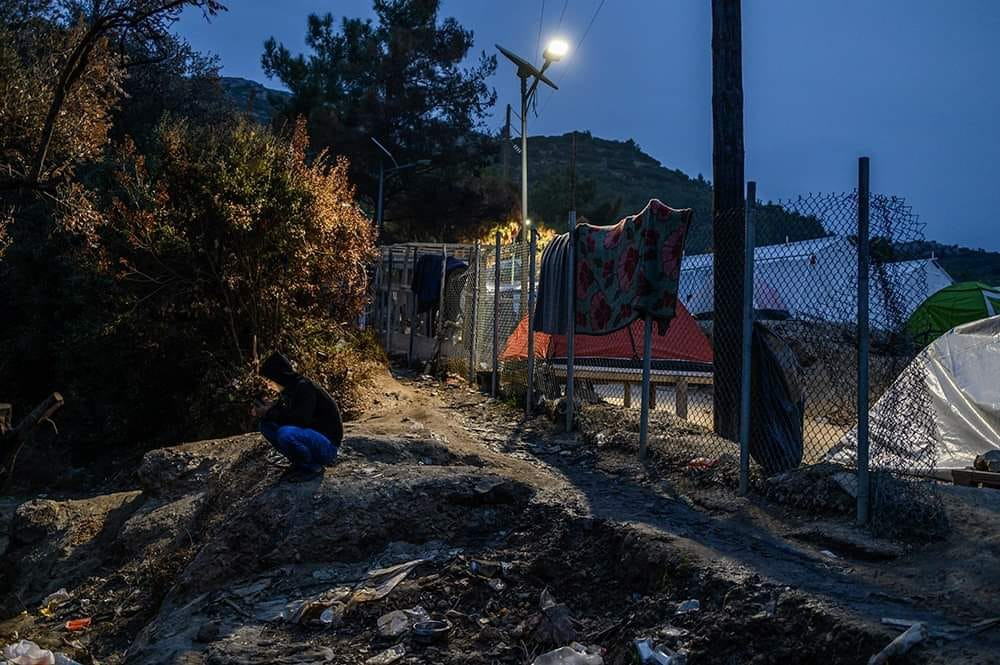

### AYS DAILY DIGEST 19/11/2019: Leaked video shows horrific fate of man who avoided conscription

_A man who returned to Syria and was conscripted was horrifically murdered by Russian paramilitaries // 6,000 Syrians pushed out from Istanbul // Statement on squat “evacuation” in Greece // More detailed report on shootings of people in Croatia // And more…_

Photo Credit: Angelos Tzortzinis via Art Against
### **FEATURE**

Leaked video footage shows Russian mercenaries brutally executing a Syrian [man accused of deserting the Syrian army\.](https://www.telegraph.co.uk/news/2019/11/18/russian-mercenaries-beat-beheaded-syrian-man-leaked-video/?fbclid=IwAR1OKVWf99A5fBjoG43WhXA5YHSWCaZXuAYYnYQMWsMExc5z1QqyGVPWoK4) The man had previously fled to Lebanon and was forcibly conscripted after arrest when he returned to Syria in 2017\. He later left the army, but was captured by the mercenary gang\.

Although the video was shot in 2017, it was only released recently on the Russian social media site VK and shows the man being tortured and his body desecrated\. Russia’s military support of the Syrian president Assad has long been an open secret and this is one of the few concrete pieces of proof that has escaped the strict secrecy that surrounds its mercenaries\.

The brutal execution of Muhammad “Hamadi” Abdullah al\-Ismail is just one story in a larger pattern of the violence of the Syrian state against its citizens\. Many Syrians are tortured or disappeared into the state prison system for reasons as arbitrary as denunciations by a jealous neighbor or having distant ties to a dissident\. Syrian men in particular are in danger of forced conscriptions into Assad’s army\. Even as political commentators agree that the civil war is “winding down,” refugees are still in danger of imprisonment or death on the battlefield if they return, [especially if the reason they initially fled was to avoid arrest or being disappeared](https://www.ft.com/content/630b11f8-9d9a-11e9-b8ce-8b459ed04726?fbclid=IwAR39fpYraNHfpchdJ-9NfMPCZxHSxBF8pVB2AaS472pgIWqMfx2RTJPEO1A) \.

Officially, the EU states that sufficient criteria for return of refugees to Syria has not been met\. “As long as the fear and suffering continue, we have the duty to protect and support the Syrian people\. The EU has been helping Syrians since the beginning of the conflict and will continue to do so until peace, security and the rule of law are guaranteed,” [says EU High Representative Federica Mogherini](https://eeas.europa.eu/headquarters/headquarters-Homepage/59417/eu-and-crisis-syria_en?fbclid=IwAR2Q7VSFxnqHR8BBabZj-GsgBO-S_1qORKhCsPlDAitD-xrwBy6c-PffzCA) \. However, EU countries’ extreme xenophobia, lengthy asylum process and clampdown on family reunification have created conditions that are unbearable for refugees, [pushing them to return to their home countries](https://www.hrw.org/news/2019/05/21/syria-detention-harassment-retaken-areas?fbclid=IwAR20vOfl-BM5eFP4NTc1qkEkg9qTueXTYzd9h246R33pAcd8WeRvNl1eIQg) \. Some countries offer grants for refugees to return, creating the false impression that their home countries are safe [even when they are not](https://foreignpolicy.com/2019/02/06/a-deadly-welcome-awaits-syrias-returning-refugees/?fbclid=IwAR3DWSsiL54Hn2oMHDcua4MDF8MtV28XCMk3eybeQCqYzY5UpdRFdnQFySI) \. This kind of “incentivized voluntary return” is a deeply problematic framework of refugee return, especially when coupled with a different form of “voluntary return” which is sometimes presented to the asylum requester after their asylum claim has been denied\. In this case, the person is faced with the choice to “voluntarily return” and receive some financial assistance \(provided they absolve officials of responsibility after they return\) or…be deported\. This “choice” is increasingly being put upon people of all nationalities as the “patience” of the EU wears thin\.

As we can see, return can have deeply deadly consequences\.
### WESTERN BALKANS
### TURKEY

6,000 Syrians are included in the group of 50,000 migrants expelled from Istanbul by the Turkish government, which claims they were there illegally\. They are now in [“temporary refugee centers\.”](https://www.infomigrants.net/en/post/20903/thousands-of-illegal-syrians-and-other-migrants-ejected-from-istanbul?fbclid=IwAR0Jq13jT19rjBYZXuFcoKEVbPsMd5hlvXKrLsFlBl51Q6QQP-wjKLgg3U0)

Syrians in Turkey are not able to receive refugee status and only have “temporary protection\.” They face a convoluted and restrictive immigration process, lacking even internal freedom of movement within Turkey, growing xenophobia, and increasing state repression\.
### GREECE

Footage has been published of the aftermath of the Greek government’s “ [evacuation](https://www.youtube.com/watch?v=6KwD899aBPU) ” of the Bouboulinas 42 squat in Athens\. The evacuations happened last Tuesday, 12/11, at 4 in the morning\. The residents were taken to the Amygdaleza camp and a couple of observers were arrested\.

A summary statement from those involved can be found below:

> “On May 2019 Bouboulinas 42 squat began as an answer to the operation of the state \(governed by SYRIZA\) to evaquate a series of squats, mostly migrant housing ones and throw hundreds of migrants to the streets or transfer them to concentration camps\. It was an answer that came from Gini squat **\(1\)** , which said “we, locals, migrants, solidarians, squatters, realize that our answer must be given in common\. That is why we decided to occupy the building of Gini in Polytechnio, as an immediate response to the evacuations and to organize the resistance against the repression, the defence of the squats, the neighborhood and our lives\.” 

> From then until it’s evacuation, Bouboulinas squat became the house for hundreds of people that are constantly prosecuted, incarcerated and tortured by the Greek state\. The same people who are stripped off of any right to exist, are stigmatized as criminals and scum by the media and a national body hungry for human meat and a cheap labor force\. Bouboulinas 42 squat was and is the realization of the desire for a better life and the struggle for freedom and equality beyond nations, religions and gender differences\. 

> Throughout this whole period, the community of the squat managed, despite all its very real difficulties, not only to organize, but also to participate in actions and demos, being part of a more genral struggle\. The school structure \(Greek, Farsi and English lessons\), the communal kitchens, activities with children, association with other squats was part of sharing our knowledge and building our relationships as equally as we could\. More than a few times we had to deal with behaviours and practices that threatened the community itself\. We did so in many different ways\.” 

[For more go here\.](https://athens.indymedia.org/post/1601162/)

In the theme of Greek state repression, Mobile Info Team published a report on [illegal pushbacks at the Greek border](https://www.mobileinfoteam.org/pushbacks?fbclid=IwAR29voRCQQD_DP1W9su4A65sDAKMU_ZSO7RcBF0BDgDZsQB2kW3a0M9h26Y.) \. Migrants are being pushed back into Turkey by Greek police without receiving the chance to apply for asylum, which is a violation of international law; this is deeply disturbing in the context that new proposals to the greek asylum system would further empower soldiers and police as being the assessors of an asylum claim\. Police deprive migrants of food and water when they are detained and often beat them violently\.

■■■■■■■■■■■■■■ 
> **[Aegean Boat Report](https://twitter.com/ABoatReport) @ Twitter Says:** 

> > #GREECE: Since last night, at least eleven boats have arrived on the #Greek #Aegean islands, carrying 414 people.

#Lesvos: 8 boats, 283 people
#Chios: 3 boats, 131 people

For full details &amp; statistics, visit [aegeanboatreport.com](http://www.aegeanboatreport.com) #refugees 

> **Tweeted at [2019-11-19 19:30:17](https://twitter.com/aboatreport/status/1196873349147717633).** 

■■■■■■■■■■■■■■ 

In a follow up on the recent shooting of a person in **Croatia** , who remains fighting for his life, AYS and Border Violence Monitoring Network published reports on the shootings that have occurred\. Read it [here](ays-special-it-is-proven-croatian-police-regularly-shoots-at-people-45f2308ce0a1) \.

This special report by AYS, using data gathered by the Border Violence Monitoring Network, documents the continual use of gun violence by Croatian police against refugees\. 19% of all reported pushback cases involve gun violence, although the actual number is thought to be far higher\. Just this weekend, Croatian police shot at a group of people at Tuhobić mountain in Gorski Kotar, and one man remains in critical condition\. This report comes almost two years after the death of little Madina, a 6\-year\-old Afghanistani girl who died minutes after being pushed back from Croatia under circumstances the state still refuses to investigate\.

The director of a Bihać in **Bosnia** hospital claims that dead migrants are [taking up too much space in his hospital’s morgue](https://www.krajina.ba/direktor-havic-tvrdi-da-mu-mrtvi-migranti-zauzimaju-frizidere-foto/?fbclid=IwAR0mgnROHzRPR4ZRR6LYcB9aRgNsVtjHZdmnFJR9Jx4mw2wo0g7i7Ku97Hs) \.

The director, Hajrudin Havić, goes on to complain that migrants are taking up too much space and resources in his hospital, even though they are only able to access healthcare if they are severely ill\. He finishes by saying, “I would rather never accept migrants into the hospital so I could accept more local people\. We exist to serve them\.” This is just one example of the growing tensions and xenophobia towards migrants in Bosnia\.

■■■■■■■■■■■■■■ 
> **[Dimitris Avramopoulos](https://twitter.com/Avramopoulos) @ Twitter Says:** 

> > Today we signed the counter-terrorism arrangements with Bosnia and Herzegovina, Montenegro and Serbia, having now concluded signatures with all 6 #WesternBalkans partners. Looking forward to continue fruitful cooperation, and to make progress on the ground in fighting terrorism. https://t.co/iOYHXkejZl 

> **Tweeted at [2019-11-19 11:41:23](https://twitter.com/avramopoulos/status/1196755345827418112).** 

■■■■■■■■■■■■■■ 

With this tweet, we again see what the EU’s priorities are in regards to human lives\. In spite of flooding and permanent misery in camps and severe mental health crises across the route, the priority and what can always be expedited — more border guards\. Watch a chilling video detailing the main numbers of the agreement\.

■■■■■■■■■■■■■■ 
> **[European Commission 🇪🇺](https://twitter.com/EU_Commission) @ Twitter Says:** 

> > Today, the European Union signed an agreement with Serbia on border management cooperation between Serbia and the European Border and Coast Guard Agency. 
Cooperation with our partners in the Western Balkans is essential → [europa.eu/!KT63QJ](https://europa.eu/!KT63QJ) #EUBorderGuard #EUprotects https://t.co/xvDCTH6kjl 

> **Tweeted at [2019-11-19 14:59:46](https://twitter.com/eu_commission/status/1196805268698488837).** 

■■■■■■■■■■■■■■ 

The latest step in this agreement was concluded with Serbia\. It is interesting to note that according to the report in the European Commission the earliest of these agreements under this initiative was signed with Albania, having been signed in 2018 and with the first patrols happening in May of this year [\(being the first of FRONTEX patrol of a non EU country\)](https://ec.europa.eu/commission/presscorner/detail/en/IP_19_6303) \. Let us remind you that there remains a black hole of information about how people on the move are treated in Albania, with reports of abusive detention centres being leaked from time to time\.

An Exhaustive report by STEPS organization details the plight of unaccompanied minors in Europe\. The two countries of focus were, Spain Greece and Italy\. In Italy, there were over 13,000 UAMs identified by the end of June 2018\. The overwhelming majority were between 15–17\. In Greece, these numbers were harder to ascertain due to the extent to which people are apprehensive about approaching the system due to pushbacks; however the number was approximately nearly 4000\. In Spain, the number was around 6,000\. A commonality across all of the countries is the lack of sufficient support and responsible placement of these unacommpanied minors either into an adequate social care system or with a host family\. For the full report go [here](https://steps.org.gr/wp-content/uploads/2019/11/comparative_final1311_web_en.pdf) \.
### CENTRAL MED
### ITALY

Italian authorities captured eight suspects involved in a [sex trafficking ring that exploited Nigerian girls](https://www.infomigrants.net/en/post/20896/italy-11-people-accused-of-trafficking-coercing-nigerian-girls-into-prostitution?fbclid=IwAR1WJOdqor5b9-nFqLpD7VHBvC20W7i5MBAfiaxf6vG3EJFwq8NPZA3T-VI) \. Three more people are still at large\. They are accused of promising Nigerian girls and women employment in Europe, then coercing them into prostitution once they reached Italy to pay back their crossing expenses\. This story is just one example of the extra dangers female migrants face on the route\. However, Italian officials wasted no time using the exploitation these woman faced for their own political purposes\. Carlo Sibilla, the undersecretary to the Italian minister, said this just shows why “we must stop every single illegal arrival in this country\.” Instead of focusing on helping victims of human trafficking, it is clear that the Italian state intends to focus its efforts on prosecuting migrants\.

The Italian government’s hostile attitude towards refugees is not without its consequences\. [Amnesty International are taking Italy to court for its cooperation with Libya’s hostile regime\.](https://twitter.com/AILitigation/status/1196849235645403136?fbclid=IwAR0ihzOr9u08zwM-bLXq-wnpfQ5bENjTSgbCILSEmeYgvVz9Z1VntwUCi4o)

The case revolves around an incident that occurred in November 2017 when the Libyan coastguard, which receives support from Italy in this case, obstructed a SeaWatch rescue mission\.

At home, former interior minister Matteo Salvini is being investigated by the attorney of Agrigento for his refusal to allow 151 migrants to disembark in [Italy for more than two weeks this August](https://www.ilpost.it/2019/11/19/procura-agrigento-salvini-registro-indagati-open-arms/?fbclid=IwAR2fR8r9cyhsO10jXTNHuRA6LVmCu9pDdfMq7-DWDh-GDVZZqAgOmU7gPLo) \.
### SEA

Mare Liberum heard multiple communications of Greek coastguard vessels [communicating with the Turkish coastguard to stop migrants’ boats](https://www.facebook.com/MareLiberumOfficial/posts/508743479854560?hc_location=ufi) before they reached Greek waters so they could be returned to Turkey\.

These communications were illegal on multiple fronts: not only were the migrants still in Turkish waters when the Greeks offered to intervene, Turkey is not considered a safe country of return\.

The Ocean Viking, one of SOS Mediterranee’s ships, rescued [94 people today from a rubber dinghy](https://www.facebook.com/SOSMEDITERRANEE/posts/2567197800054179) \.

Additionally Salvimento Maritimo rescued around 15 people today from two dingies and took them to Cadiz\. For more, in Spanish, go [here](https://www.lavozdigital.es/cadiz/campo-gibraltar/lvdi-rescatados-quince-inmigrantes-pateras-estrecho-gibraltar-201911191509_noticia.html?ns_campaign=rrss&ns_mchannel=lavozdecadiz&ns_source=tw&ns_linkname=seccion&ns_fee=0#C%C3%A1dizhoy) \.
### NORTHERN EUROPE

DEVELOPING NEWS from the channel from a ferry leaving **The Netherlands** and heading to the UK where 25 people have been found in a shipping container after punching an airhole in it\. At this time, the status of each person is unknown, although two have been taken to the hospital with 23 remaining in police custody\. We will give more information as we have it\. For more information, go [here](https://www.independent.co.uk/news/world/europe/ferry-migrants-netherlands-uk-boat-refrigerated-container-latest-update-a9209756.html) \.

**Find daily updates and special reports on our [Medium page](https://medium.com/are-you-syrious) \.**

**If you wish to contribute, either by writing a report or a story, or by joining the info gathering team, please let us know\.**

**We strive to echo correct news from the ground through collaboration and fairness\. Every effort has been made to credit organizations and individuals with regard to the supply of information, video, and photo material \(in cases where the source wanted to be accredited\) \. Please notify us regarding corrections\.**

**If there’s anything you want to share or comment, contact us through Facebook, Twitter or write to: areyousyrious@gmail\.com\.**

_Converted [Medium Post](https://medium.com/are-you-syrious/ays-daily-digest-19-11-2019-leaked-video-shows-horrific-fate-of-man-who-avoided-conscription-83d33a245b6d) by [ZMediumToMarkdown](https://github.com/ZhgChgLi/ZMediumToMarkdown)._
