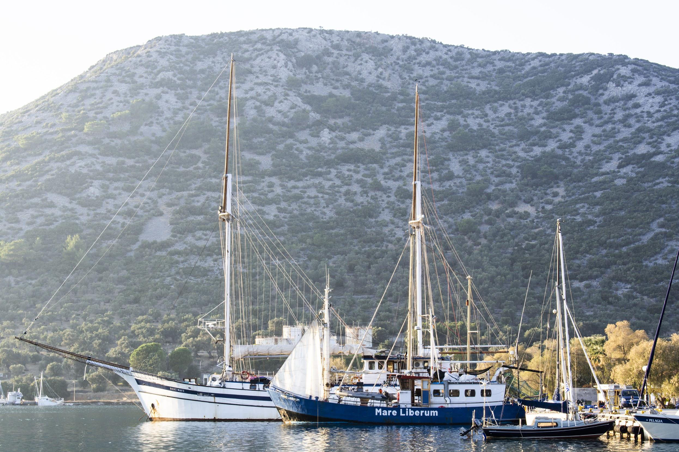
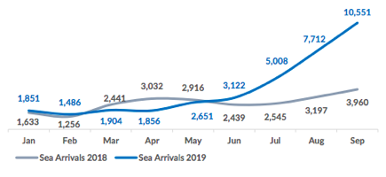
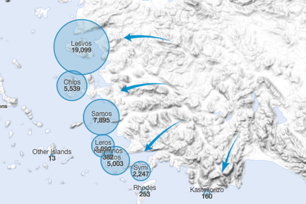
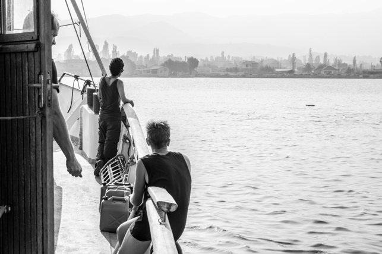

### AYS Special — **Sentinels of the Sea: why NGOs like Mare Liberum are important now more than ever**
#### A legal comment following a mission with Mare Liberum in the Aegean Sea

Credit: Andrea Panico\.

At dawn, when the first rays of light begin to reflect on the Aegean waters, **Mare Liberum** ’s onboard radio continues to crackle, belching out numbers, coordinates and requests for Turkish Coast Guard \(TCG\) intervention from the European Coast Guards \(ECGs\) \. Only last night, these radiowave communications resulted in the arrest of over 297 people by the Turkish authorities\. \[1\]

Meanwhile, watching from the bow, the crew can see another military ship gliding across the sea as they prepare for a new monitoring shift\. After setting sail again a few days ago for a new mission, the Mare Liberum ship is anchored in Greek waters, merely a few hundred meters away from the maritime border with Turkey\. The main objective is to monitor the northern waters off of Lesvos’ shores to ensure that illegal push and pull backs are not being carried out by the various authorities involved in the monitoring missions and that the different European Coast Guards — engaged in FRONTEX operations to control Greek waters — are following the agreed upon procedures for properly carrying out their search and rescue activities \(SAR\) at sea\.

**The EU — Turkey deal \(2016\) \.** Four years ago, the governments of the European Union signed an agreement with Turkey, officially delegating the management of the eastern migratory flow of asylum seekers to Turkish President Recep Tayyip Erdoğan\. This deal established that all those entering Greece from Turkey without having asked for international protection \(the so\-called _economic migrants_ \) and _“those \[migrants\] whose application has been found unfounded or inadmissible \[…\] will be returned to Turkey_ \[2\] _”_ \. In particular, pursuant to the agreement, the National Law n\. 4375/2016 has provided that any application from an asylum seeker who transited through Turkey to arrive to the EU is presumed inadmissible, by virtue of the fact that Turkey, since 2016, is considered to be a _“safe third country”_ and the applicant should therefore have requested international protection in Turkey\. \[3\] Nevertheless, as argued by a multitude of legal experts and human rights advocates, including research stemming from the IOM, Turkey does not meet the criteria of a “safe third country,” but it is being used as a border management tool regardless of that fact\. \[4\]

In the EU\-Turkey deal’s execution, and to establish if a person’s asylum application is admissible or not, Greece has adopted a special _“fast\-track border procedure”_ \[5\] which greatly reduces the guarantees for an asylum seeker\.

Depending on the nationality of the asylum seeker, this accelerated border procedure is implemented differently\. \[6\] Applications submitted by Syrian asylum seekers are only examined in terms of admissibility, so once they are satisfied that he has transited from Turkey, which is considered a safe third country, his application is deemed inadmissible\. For the Syrian asylum seeker, the only hope for not being sent back to Turkey is to establish at this stage — in which authorities have to decide if his application is admissible or not — that Turkey is not a safe country in their specific circumstance\.

Applications by non\-Syrian asylum seekers from countries with a recognition rate of asylum status of over 25% are examined on both admissibility and merits, the so called “merged procedure”\. Only applications from non\-Syrian asylum seekers from countries with an asylum recognition rate of less than 25% are examined instead on the merits\.

The accelerated border procedure does not apply to vulnerable groups nor people who are under the family provisions of the Dublin III rules\. \[7\]

**Surveillance of the EU’s external maritime borders: a dirty game\.** After accepting a total compensation of €6 billion in addition to assuming the burden of accepting returns, Turkey has also officially committed to preventing, in all possible ways, _“irregular migrants”_ from reaching Europe\.

To date, the maritime control of the narrow corridor most commonly used to reach the Greek islands from Turkey is a joint activity that involves the Turkish Coast Guard on one side, and the Hellenic Coast Guard and Frontex vessels \(eg ships from Croatia, Italy etc\. \) on the other, all with the additional support of three NATO warships and helicopters\.

During their patrolling activities of territorial waters, the European Coast Guard aims to use their radars to detect migrants boats that are still in Turkish waters, before they manage to cross the border\. After spotting the inflatables, they communicate the coordinates to the corresponding Turkish authorities, asking them to immediately take action and block them\. This operation prevents the European CGs from needing to become involved in rescue operations in Greek waters, which would mean the automatic obligation to safely transfer migrants to the mainland, adding an extra burden for the Greek Government to accept more asylum applications and manage the reception of more people\.

However, there have been multiple reports of such military operations leading to violations by the Turkish Coast Guard; for instance, when the Turkish Coast Guard crossed the marine border, entering Greek territorial waters to “ _capture_ ” migrants, who had, by then, officially entered European territory but brings them back to Turkey\. \[8\]

In other cases, the Hellenic Coast Guard has been documented as coercively blockading new migrant arrivals\. There are accounts of them creating strong waves that put the small boats in danger, pushing them back into Turkish waters\. \[9\] Moreover, always in Greek waters, incidents involving unspecified individuals with masked faces continue to be recorded\. These individuals, aboard light motorboats, have threatened migrants who had already arrived in Greek waters, forcing them to retreat again to Turkish waters and to be arrested by the Turkish authorities\. \[10\] In both cases, these examples of _refoulement_ of asylum seekers who had already entered European waters, represent overbearing episodes of arbitrary and illegal pushbacks, which profoundly harm the individuals’ rights to request international protection\.

According to official data,\[11\] since the first of January 2017 to today 4,028 boats were stopped by the TCG and the Turkish Police capturing a total of 142,438 people\. Of these, thus far in 2019 the TCG intercepted 2,560 boats at sea, for a total of 84,166 people\.

Migrant Arrivals In Greece in 2019\. Source: UNHCR\.

**The direct and indirect consequences of the European policies concerning “the externalization of borders”\.** What is certain so far, is that the questionable choice to externalize European borders, by delocalizing the _“immigration problem”_ , is not stopping arrivals nor migratory flows\. The European repressive policies are only creating new routes — demonstrated by the fact that among the top first 10 nationalities of asylum seekers present in Greece, there are people hailing from Congo, Palestine and Algeria, people who until a few years ago traveled almost exclusively along the route of the central and western Mediterranean\[12\] — as well as contributing to the growing number of deaths throughout the Mediterranean\. \[13\] In 2018, 56 people were registered as either dead or missing in the Aegean Sea\. Thus far in 2019, 71 people have lost their lives attempting to reach the Greek islands of Lesbos, Chios, Samos, Leros, Kos and Symi\. \[14\] These men, women and children died trying to reach safety, fleeing the madness of war, persecution and misery\.

In practicality, the EU\-Turkey agreement strongly limits the right for forced migrants to request international protection and to live in a safe country where they can enjoy their fundamental human rights\.

From the legal point of view, the lack of legitimacy of the deals made with third countries is obvious\. This is true not only in the case of destabilized countries which currently do not even have a real government, like Libya \(for which even the United Nations have declared that the situation is terrible\[15\] \), but also in the case of countries considered more reliable in terms of international relations like Turkey\. In particular, the absurdity of considering Turkey a _“safe third country”_ \(and therefore resulting in the inadmissibility of applications for international protection of those who have arrived to Greece from Turkey where, according to the European governments, they should have to apply for asylum\) is exemplified by the fact that the country did not sign the Additional Protocol of the Geneva Convention, which guarantees, to every person, the right to ask for international protection, without any geographical restrictions\. \[16\] It is important to remember that in Turkey the right to asylum continues to be guaranteed only to Europeans, while Syrians can only ask for so called _“temporary protection”_ \. All other applicants can only receive a _“conditional refugee”_ permit \(which does not allow them to receive many of the essential services guaranteed to those who have asylum\[17\] \) while waiting to be transferred to a third country\.

Additional concerns have been raised by international human rights observers regarding the mass deportations of Syrians from Turkey to the territories recently conquered by the Turkish government in Northern Syria,\[18\] as ordered by President Erdogan’s government\.

Therefore, how is it possible to assume that all migrants can feel safe in Turkey? How can we say that an asylum seeker in Turkey can enjoy the same rights that he or she would enjoy in Europe?

**The importance of the NGO missions in the Mediterranean Sea\.** We are living in a historical moment characterised by misleading interpretations of international law\. Today, many governments are easily succumbing to the logic of nationalist and sovereign policies, signing agreements with third countries to keep asylum seekers confined outside of Fortress Europe\. Never before has the role of NGOs been so complex and of such vital importance\.

For this reason, Mare Liberum continues its monitoring mission, keeping a watchful eye on governments’ and European Coast Guards’ actions in order to guarantee the respect for the rights of migrants trying to find safety through Greece\. The ship’s presence acts also as a preventative measure to ensure that the European CGs correctly carry out the rescue operations to which they are obliged\. Arbitrary episodes of violent push backs are most likely to occur in the absence of human rights organizations’ ability to document them\.

Mare Liberum, as well as other organizations involved in SAR and monitoring operations, are the eyes and ears of civil society, they are the sentinels that are safeguarding the respect for human rights at sea\.

Raise the anchor again\. Hold the ship’s wheel firmly\. Take to the sea\. Whether in the Central Mediteranian or in the Aegean Sea, saving a single life is equivalent to saving the whole world\.

Credit: Andrea Panico\.

**_Text and translation by Andrea Panico, Meredith Veit_**

Find the original version, in Italian, published by Progetto Melting Pot Europa at [this link](https://www.meltingpot.org/Mare-Liberum-le-sentinelle-che-nel-Mare-Egeo-monitorano-il.html?var_mode=recalcul#.XdZ1-C2ZM0o) \.

\[1\] Data 2019\.11\.18 from [https://www\.sg\.gov\.tr/](https://www.sg.gov.tr/)

\[2\] [https://www\.consilium\.europa\.eu/en/press/press\-releases/2016/03/18/eu\-turkey\-statement/](https://www.consilium.europa.eu/en/press/press-releases/2016/03/18/eu-turkey-statement/)

\[3\] In application of the art\. 33 of Directive 2013/32 /EC

[https://eur\-lex\.europa\.eu/legal\-content/it/ALL/?uri=celex%3A32013L0032](https://eur-lex.europa.eu/legal-content/it/ALL/?uri=celex%3A32013L0032)

\[4\] [https://gmdac\.iom\.int/research\-database/why\-turkey\-not\-safe\-country](https://gmdac.iom.int/research-database/why-turkey-not-safe-country)

\[5\] Cfr: [https://ec\.europa\.eu/home\-affairs/what\-we\-do/networks/european\_migration\_network/glossary\_search/accelerated\-international\-protection\_en](https://ec.europa.eu/home-affairs/what-we-do/networks/european_migration_network/glossary_search/accelerated-international-protection_en)

\[6\] Art\. 60, § 4, L 4375/2016

Cfr: [https://www\.asylumineurope\.org/reports/country/greece/asylum\-procedure/procedures/fast\-track\-border\-procedure\-eastern\-aegean\#footnoteref23\_654masz](https://www.asylumineurope.org/reports/country/greece/asylum-procedure/procedures/fast-track-border-procedure-eastern-aegean#footnoteref23_654masz)

\[7\] Regulation \(EU\) No 604/2013 of the _“European Parliament and of the Council of 26 June 2013 establishing the criteria and mechanisms for determining the Member State responsible for examining an application for international protection lodged in one of the Member States by a third\-country national or a stateless person”_ \.

\[8\] Cfr: [https://medium\.com/@AreYouSyrious/ays\-news\-digest\-9\-7\-19\-frontex\-watches\-illegal\-pushback\-report\-says\-305ee7995e11](ays-news-digest-9-7-19-frontex-watches-illegal-pushback-report-says-305ee7995e11)

[https://sea\-watch\.org/wp\-content/uploads/2017/11/STATEMENT\-OF\-CONCERN\_UNHCR\.pdf](https://sea-watch.org/wp-content/uploads/2017/11/STATEMENT-OF-CONCERN_UNHCR.pdf)

[https://alarmphone\.org/en/2019/06/28/alarm\-phone\-aegean\-report/](https://alarmphone.org/en/2019/06/28/alarm-phone-aegean-report/)

\[9\] [https://www\.youtube\.com/watch?v=1k2THtF9h6M](https://www.youtube.com/watch?v=1k2THtF9h6M)

[https://alarmphone\.org/en/2019/05/21/the\-mediterranean\-border\-mass\-abductions\-push\-backs\-people\-left\-to\-die/](https://alarmphone.org/en/2019/05/21/the-mediterranean-border-mass-abductions-push-backs-people-left-to-die/)

\[10\] [https://alarmphone\.org/en/2019/06/28/alarm\-phone\-aegean\-report/](https://alarmphone.org/en/2019/06/28/alarm-phone-aegean-report/)

[https://alarmphone\.org/en/2019/05/04/people\-refugees\-push\-back\-samos\-turkey\-greece\-coast\-guard\-refoul\-alarm\-phone\-border\-control/](https://alarmphone.org/en/2019/05/04/people-refugees-push-back-samos-turkey-greece-coast-guard-refoul-alarm-phone-border-control/)

\[11\] [https://datastudio\.google\.com/u/0/reporting/1CiKR1\_R7\-1UbMHKhzZe\_Ji\_cvqF7xlfH/page/A5Q0](https://datastudio.google.com/u/0/reporting/1CiKR1_R7-1UbMHKhzZe_Ji_cvqF7xlfH/page/A5Q0)

\[12\] Cfr: [https://data2\.unhcr\.org/en/situations/mediterranean/location/5179](https://data2.unhcr.org/en/situations/mediterranean/location/5179) and [https://data2\.unhcr\.org/en/documents/download/71691](https://data2.unhcr.org/en/documents/download/71691) for the most common nationalities of sea arrivals \(since 1 January 2019\) \.

Cfr: [https://data2\.unhcr\.org/en/documents/download/71692](https://data2.unhcr.org/en/documents/download/71692) for the last Aegean Islands Monthly report

\[13\] Cfr: [https://missingmigrants\.iom\.int/region/mediterranean?migrant\_route%5B%5D=1376&migrant\_route%5B%5D=1377&migrant\_route%5B%5D=1378](https://missingmigrants.iom.int/region/mediterranean?migrant_route%5B%5D=1376&migrant_route%5B%5D=1377&migrant_route%5B%5D=1378)

\[14\] IOM Data available at: [https://missingmigrants\.iom\.int/region/mediterranean?migrant\_route%5B%5D=1377](https://missingmigrants.iom.int/region/mediterranean?migrant_route%5B%5D=1377)

Data is underestimated\.

\[15\] Cit\. United Nations High Commissioner for Refugees, Michelle Bachelet\.

Cfr: [https://www\.ohchr\.org/Documents/Countries/LY/LibyaMigrationReport\.pdf](https://www.ohchr.org/Documents/Countries/LY/LibyaMigrationReport.pdf)

[https://www\.unhcr\.it/wp\-content/uploads/2019/03/UNHCR\-Posizione\-Libia\-aggiornamenti\-II\-clean\.pdf](https://www.unhcr.it/wp-content/uploads/2019/03/UNHCR-Posizione-Libia-aggiornamenti-II-clean.pdf)

\[16\] Turkey has in fact only ratified the 1951 Refugee Convention — which is applicable only to events that occurred before 1951 and with the so\-called “geographical reserve” which granted asylum only to Europeans citizens — but never adhered to the next “Protocol relating to the status of refugee” of 1967, which removed these limitations\. This makes Turkey de facto exempt from any obligation to non\-European citizens who arrive in the country to seek asylum\.

\[17\] These limitations \(for example, they need a specific permit to work\) are justified by the fact that their permanence in Turkey is temporary and is allowed until, after having applied to a UNHCR office, they arerelocated to another country\.

\[18\] Cfr: [https://www\.amnesty\.org/en/latest/news/2019/10/turkey\-syrians\-illegally\-deported\-into\-war\-ahead\-of\-anticipated\-safe\-zone/](https://www.amnesty.org/en/latest/news/2019/10/turkey-syrians-illegally-deported-into-war-ahead-of-anticipated-safe-zone/)

**Find daily updates and special reports on our [Medium page](https://medium.com/are-you-syrious) \.**

**If you wish to contribute, either by writing a report or a story, or by joining the info gathering team, please let us know\.**

**We strive to echo correct news from the ground through collaboration and fairness\. Every effort has been made to credit organizations and individuals with regard to the supply of information, video, and photo material \(in cases where the source wanted to be accredited\) \. Please notify us regarding corrections\.**

**If there’s anything you want to share or comment, contact us through Facebook, Twitter or write to: areyousyrious@gmail\.com\.**

_Converted [Medium Post](https://medium.com/are-you-syrious/ays-special-sentinels-of-the-sea-why-ngos-like-mare-liberum-are-important-now-more-than-ever-5bb592656c0a) by [ZMediumToMarkdown](https://github.com/ZhgChgLi/ZMediumToMarkdown)._
