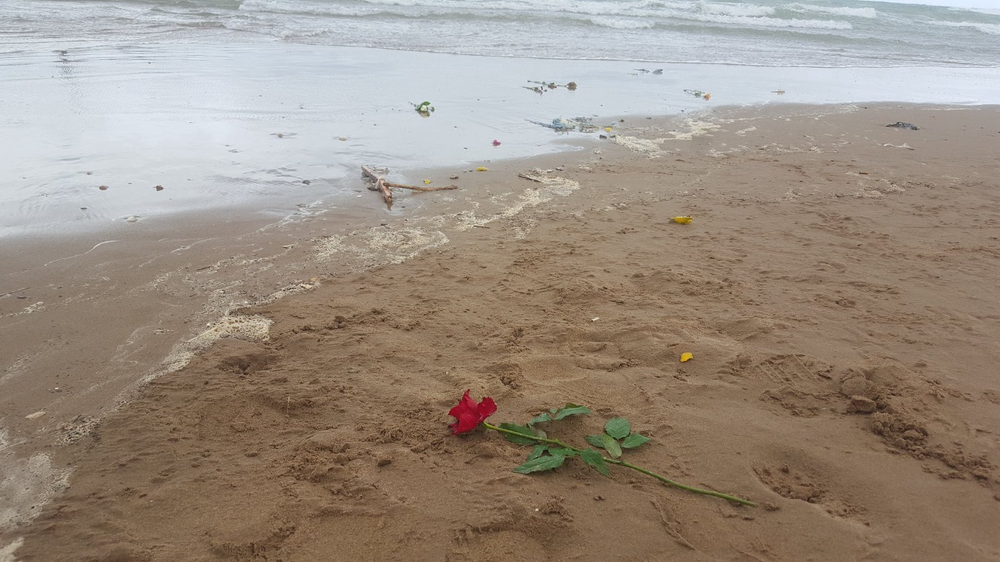

### AYS Daily Digest 22/11/19: European Court of Human Rights rules against Hungary

[Are You Syrious?](@AreYouSyrious?source=post_page-----96677fa6f9fe----------------------)

[Nov 23](ays-daily-digest-22-11-19-european-court-of-human-rights-rules-against-hungary-96677fa6f9fe?source=post_page-----96677fa6f9fe----------------------) · 7 min read

Bodies washed to the shore of Libya proof of another tragedy in the Mediterranean/// Belgium is failing in providing accommodation for asylum seekers/// Hunger strike in CRA Mesnil Amelot

Copy Right: Alarm Phone
### Feature Story — European Court of Human Rights \(ECtHR\): Hungary acted against Art\. 3 ECHR by failing to assess risk of return

The Eurpean Court of Human Rights \(ECtHR\) ruled against Hungary for violation of the European Convention on Human Rights\.

The Case:

The applicants in this case were two Bangladeshi nationals, Ilias Ilias and Ali Ahmad\. They both arrived in Hungary in 2015 after having arrived in Greece and travelled through the countries on the route, including Serbia\. After their arrival in Hungary they immediately applied for asylum\. For the next 23 days they stayed in the fenced and guarded transit zone of Röszke on Hungarian territory\. In October 2015 their asylum application was rejected, based on a previous government decree that declared Serbia — the country from which they entered Hungary — a safe third country\. They were then escorted to the Serbian border and left Hungary\.

> _”The applicants complain in particular that, contrary to Article 3 \(prohibition of inhuman or degrading treatment\) of the European Convention on Human Rights, the Hungarian authorities failed to adequately examine their claim that they faced a real risk of ill\-treatment by being expelled to Serbia\. Under the same provision they complain about the conditions of detention in the transit zone\. In the same context, the applicants also rely on Article 13 \(right to an effective remedy\) in conjunction with Article 3\. The applicants allege that they were confined to the transit zone in violation of Article 5 § 1 \(right to liberty and security\) and Article 5 § 4 \(right to have lawfulness of detention decided speedily by a court\)”_ 

\(quoted from the “forthcoming Grand Chamber judgement”, released by the ECtHR, to be found [here](https://hudoc.echr.coe.int/eng#{%22itemid%22:[%22001-172091%22]}) \)

After a first judgement in 2017, the Hungarian Government requested that the case should be referred to the Grand Chamber of the ECtHR\. According to ECRE \(European Council on Refugees and Exiles\) the judgement from November 21th states the following:

> **_“The Grand Chamber concurred that the Hungarian authorities did not act in compliance with their duty to safely assess the applicants’ risk of inhuman and degrading treatment in the event of return to Serbia\. The Court added that it is the duty of the removing State to assess the real risk the applicant would face in the receiving third country_** _\. Indeed, the Hungarian authorities did not take into account available and reliable information regarding the risk of refoulement from Serbia, administrative deficiencies to assess asylum claims, or denials of the right to apply for asylum for readmitted persons\. Although the applicants were able to make detailed submissions in the domestic proceedings and were legally represented, the Court was not convinced that this meant that the national authorities had given sufficient attention to the risks of denial of access to an effective asylum procedure in Serbia\. The Court therefore found that Hungary had acted contrary to Article 3 of ECHR\._ 

> _Notwithstanding this, the court found that **the material detention conditions in the transit zone as well as the length of detention did not reach the threshold to find a violation under Article 3\.**_ 

> _On the question of the lawfulness of detention, the Court noted that **while the applicants’ freedom of movement had been significantly restricted, it was deemed to be necessary in relation to their asylum procedures** \. It added, inter alia, that the applicants were not prevented from leaving of their own free will to another country other than Serbia without them facing a direct threat to their life\. The Court therefore concluded that the applicants had not been deprived of their liberty within the meaning of the European Convention on Human Rights\.”_ 

Find the full press release from ECRE here:
### [ECtHR: Failure to Assess Risk of Return Violated Article 3 ECHR](?fbclid=IwAR3y1O3BD_K2i9boj0uubkeHtq8EJG7lbDxSGkGQWokkB5F1HnUFPjT32dk&source=post_page-----96677fa6f9fe----------------------)
### [On 21 November 2019, the European Court of Human Rights \(the Court\) delivered its judgment on the detention of two…](?fbclid=IwAR3y1O3BD_K2i9boj0uubkeHtq8EJG7lbDxSGkGQWokkB5F1HnUFPjT32dk&source=post_page-----96677fa6f9fe----------------------)
#### [www\.ecre\.org](?fbclid=IwAR3y1O3BD_K2i9boj0uubkeHtq8EJG7lbDxSGkGQWokkB5F1HnUFPjT32dk&source=post_page-----96677fa6f9fe----------------------)

NORTH MACEDONIA
### Group of 33 people detained

In the south of North Macedonia, a group of 33 people with Afghan, Pakistani, Iraqi and Iranian nationals was detained by a police patrol and is now scheduled for deportation to Greece, as they allegedly crossed the border illegally\.

Although the route through North Macedonia is far from being traversed as much as in 2015, people are still trying to cross the country\. Often they take great risks and pay high sums to smugglers\.

BOSNIA
### At least 800 people still living in Vucjak

SEA
### Follow up on shipwreck as reported in the AYS Digest of November 21st

On Wednesday, Alarm Phone reported that they had been contacted by a representative of a group of fishermen who said they had found a deflating rubber boat off the coast of Tripoli in the early morning hours\. They managed to rescue about 30 people and say that about 67 people drowned\.

IOM has now reported that six bodies have been washed to the shores of Khums, Libya, giving tragic confirmation to the fishermen’s testimony\.

Alarm Phone is sadly correct by stating on Twitter:

> _“Who will investigate this loss? Certainly both [\# **Europe**](https://twitter.com/hashtag/Europe?src=hash) & its Libyan allies have no desire to do so\.”_ 

BELGIUM
### Insufficient Accommodation for Asylum Seekers

ECRE \(European Council on Refugees and Exiles\) and AIDA \(Asylum Information Database\) have reported about the lack of sufficient accommodation for people seeking refuge in Belgium\. According to them, 60 people were denied access to the asylum system as there was no housing to be provided for them on November 18th\. They were asked to come again the next day in order to conduct their registration\. This is not the first time that the facilities have not been calculated correctly\. The local authorities have previously opened and closed the facilities on the demand of the federal government at a high cost

In a paper on the housing situation in Belgium, AIDA stated the conditions of accommodation to which applicants for asylum are entitled:

> _“Applicants for international protection are entitled to “material reception conditions” which include housing, food and clothing\. The right to material reception conditions starts from the moment the asylum claim is made, and entails conditions that “provide an adequate standard of living for applicants, which guarantees their subsistence and protects their physical and mental health”\. Under the recast Qualification Directive, beneficiaries of international protection are entitled to accommodation under equivalent conditions as other legally residing third country nationals\. The 1951 Refugee Convention also requires states to “accord to refugees lawfully staying in their territory treatment as favourable as possible and, in any event, not less favourable than that accorded to aliens generally in the same circumstances\.” The right to housing is also enshrined in different instruments of human rights law\.”_ 

Find the full report on Belgium from May 2019 [here](http://www.asylumineurope.org/sites/default/files/shadow-reports/aida_housing_out_of_reach.pdf) \.

Find more information on the current situation [here](http://www.asylumineurope.org/news/20-11-2019/belgium-new-reception-shortages-prevent-people-seeking-asylum?fbclid=IwAR0FRNLLXquQqt8dknR1XFXgm2TjdpfTnJr7D684VATo7Kyci9vx1qmDM2c) \.

FRANCE
### Hunger Strike in CRA Mesnil Amelot

In the CRA \(Centre de Rétention Administrative\) Mesnil Amelot close to Paris, about 50 detainees started a hunger strike on November 18th\. The detainees are Sans Papiers and people with rejected asylum claims who are scheduled for deportation\.

In their statement they speak about being treated like dogs, of different treatment in different buildings and of bad living conditions\.

> _« Salut, on est au Cra\. Tout le monde est en grève de la faim\. **On est ici comme des chiens, peut\-etre les animaux sont mieux que nous** \. Et on voit que ici les droits ne sont pas pareils entre les batiments : il y a qui mange et il y a qui mange pas, il y a aussi qui peut faire rentrer des courses et il y en a qui ne peut pas\. Pourquoi on peut pas, on ne le sait pas\. **On demande pour nous ici à nos droits la liberté** \. »_ 

> _« Les flics ont démandé pourquoi on fait ça \(la grève de la faim\), moi j’ai rigolé, vraiment vous le savez pas? **Pour les conditions de vie, pour la bouffe, parce qu’ils veulent sortir d’ici** \. »_ 

They further say that the food they are served is not edible; sometimes one can only eat bread with mayonnaise\. They also report about not having halal food and about their fear of being deported to their home countries, as they fear they would face prison there\.

They call for vegetarian food, the right to receive food from relatives or friends who come to visit and freedom for everybody\.

> **_De la nourriture végétarienne_** 

> **_Que les proches puissent donner de la nourriture pendant les visites_** 

> **_Libertés pour tous le monde_** 

On November 8th, a 19\-year\-old man died in CAR Vincennes\. The detainees held a ceremony in which Muslim, Christian and Non\-Believers were involved\. A solidarity movement from outside that tried to approach the CRA and make their solidarity slogans heared by the detainees was blocked by police forces\.

Find more information on this website:
### [A BAS LES CRA \! A BAS L’ENFERMEMENT \!](?source=post_page-----96677fa6f9fe----------------------)
### [Témoignage sonore d’un copain emprisonné dans le CRA de Mesnil\-Amelot, pendant l’émission Actualité des luttes de…](?source=post_page-----96677fa6f9fe----------------------)
#### [abaslescra\.noblogs\.org](?source=post_page-----96677fa6f9fe----------------------)

The group holds an assembly every Wednesday at 6 p\.m\. at Rue Voltaire, Nr\. 21, metro Rue des Boulets L9\.

**Find daily updates and special reports on our [Medium page](https://medium.com/are-you-syrious) \.**

**If you wish to contribute, either by writing a report or a story, or by joining the info gathering team, please let us know\.**

**We strive to echo correct news from the ground through collaboration and fairness\. Every effort has been made to credit organizations and individuals with regard to the supply of information, video, and photo material \(in cases where the source wanted to be accredited\) \. Please notify us regarding corrections\.**

**If there’s anything you want to share or comment, contact us through Facebook, Twitter or write to: areyousyrious@gmail\.com\.**

_Converted [Medium Post](https://medium.com/are-you-syrious/ays-daily-digest-22-11-19-european-court-of-human-rights-rules-against-hungary-28754c333d13) by [ZMediumToMarkdown](https://github.com/ZhgChgLi/ZMediumToMarkdown)._
