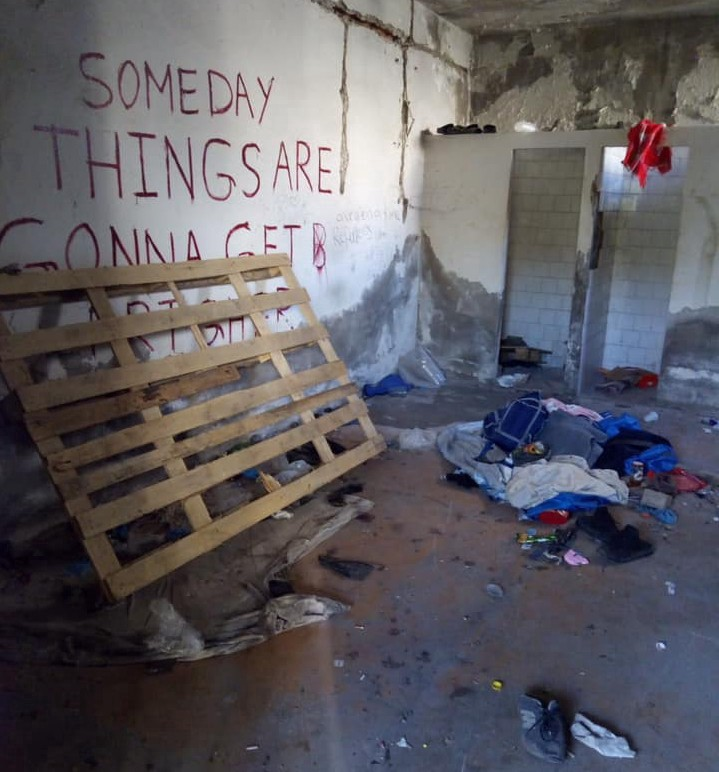
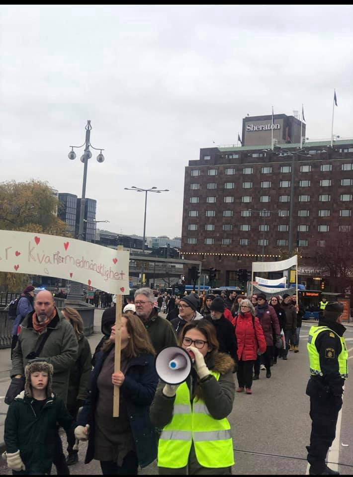
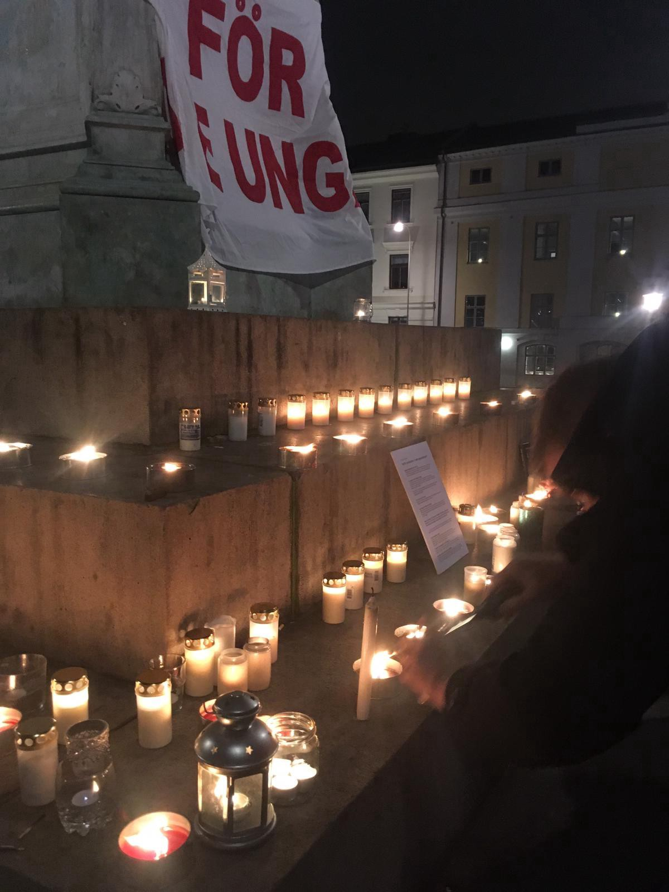
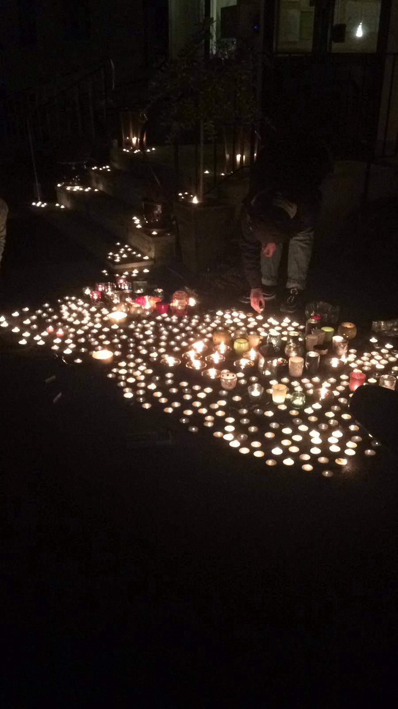
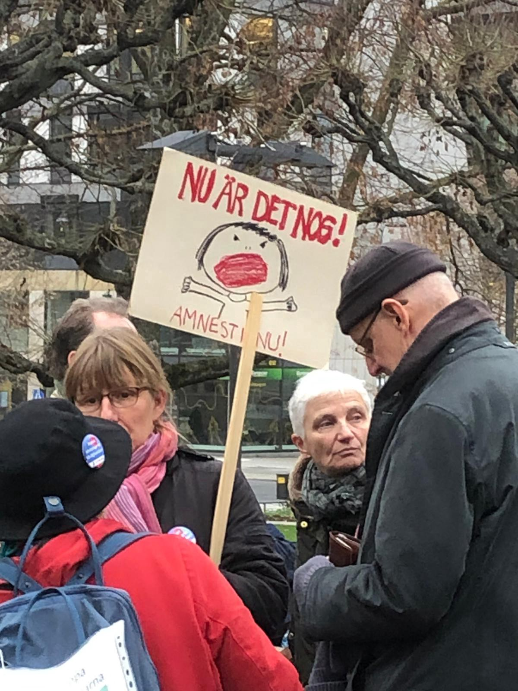

### AYS Weekend Digest 23–24/11/19: In Serbia, removing witnesses from the border area
#### Official violent pressure and confiscation at the Serbian\-Croatian border / Regional Asylum Office of Lesvos decides against Greek, European and International law — legal aid organisations stand against it / Hunger strike in Corso Brunelleschi / Swedish protest in 77 cities against deportations to Afghanistan / US Government unsuccessful in criminalizing solidarity / & more news

Remains of the squat in the abandoned Grafosrem building\. Photo: Davy Jones
### FEATURED

A large\-scale police eviction took place in Šid, Serbia on November 22nd, aiming to remove all undocumented people in transit from the streets of the city\. The action targeted approximately 150 people in and around Šid\. The largest eviction of people was carried out at the settlement in the former Grafosrem industrial facility, but was accompanied by the clearance of multiple other smaller squats throughout the city\.

Outwardly justified as a measure to meet the security concerns of the local population, the operation is clearly part of a larger scheme of internal displacement being realized throughout Serbia during the past week\. Volunteers of No Name Kitchen present on site strongly condemn the forced removal of systemically marginalised communities, and the ruthlessness used during these operations\.
In the days after the operation, volunteers in Šid have been under constant scrutiny\. People have been observed monitoring the volunteer’s house and filming the use of the organisations vehicle\.
In the meantime, while removing those who have witnessed and reported about the violence, irregularities and human rights breach on the borders, the country has recently agreed on the Frontex collaboration\. The European Commission approved a cooperation agreement between Serbia and the EU border agency “to manage immigration and tackle crime at the EU’s external borders\.”

Read the full volunteer story in our new [AYS Special: A large\-scale police operation sweeps refugee squats in Northern Serbia](ays-special-a-large-scale-police-operation-sweeps-refugee-squats-in-northern-serbia-ea664effe8cd) and support the local teams in any way you can\!
### SEARCH AND RESCUE AT SEA

Waves more than 4 meters high were in the area of the Mediterranean, the Open Arms reported\. “We still do not have a safe harbor where the 73 people on board disembark, not even permission to protect ourselves from the storm\. This is today’s Europe\.” Further development led them to sail towards eastern Sicily, while they were waiting to receive information about which port to disembark at\.

“The humanitarian disaster ongoing in [Libya](https://twitter.com/hashtag/Libya?src=hashtag_click&fbclid=IwAR2JEmeLZ86d-hRiKL9L6aMMfs4HAaqUiCR1Hk97k-VDO0HwAlluWa572ko) and the Mediterranean represents a failure of [E](https://twitter.com/hashtag/EU?src=hashtag_click&fbclid=IwAR10fxJwhwrWi0PIVTkZAoC355P65R4gYAcU3G1B87Bunq1RA-UA-HXI4yI) U states to act in accordance with humanitarian principles and their obligations under international law\. 
Over the last few days alone, at least 440 people were intercepted by the EU\-funded Libyan Coast Guard and forcibly returned to the conditions of violence and exploitation that the [E](https://www.facebook.com/hashtag/eu?hc_location=ufi) U itself has acknowledged prevails in Libya\. 
Meanwhile, the bodies of those who could not be rescued were washing up on the shore\. Even as the Ocean Viking was awaiting instructions for disembarkation, we heard reports of another tragic shipwreck off [L](https://www.facebook.com/hashtag/lampedusa?hc_location=ufi) ampedusa\.
These are the devastating consequences of EU policies that European leaders can no longer ignore” Michael Fark, head of MSF SAR mission said\.
### GREECE
### Rejection of 28 asylum seekers from African countries due to a lack of interpreters

Legal aid organizations express concern regarding the unprecedented administrative practice of the Regional Asylum Office of Lesvos, which goes against Greek, European and International law\.

The legal aid organizations operating on the island of Lesvos have been surprised to learn that, from 15 to 20 November, the Regional Asylum Office \(‘RAO’\) of Lesvos has, without any prior notice, served negative asylum decisions on 28 asylum seekers from Sub\-Saharan African countries without conducting the legally mandatory asylum interview\. The Administration justified its decision on the basis of its ‘inability’ to secure interpretation for languages spoken by the asylum seekers, they write in the common press release\.

The signing organisations \( [HIAS Greece](https://www.facebook.com/HIASGreece/?__tn__=%2CdKH-R-R&eid=ARACQwpOhHhr2sPILNVy4NtzZy06kKmYvgLERoykJFf94GwwaWKfEFZFppNWvkyKgGbfOOuqYowiRmoZ&fref=mentions&hc_location=group) Refugee Support Aegean \(RSA\) [Ελληνικό Συμβούλιο για τους Πρόσφυγες — Greek Council for Refugees](https://www.facebook.com/gcr.gr/?__tn__=%2CdKH-R-R&eid=ARCh-4Qau0tC91n6CdSiud1U8-kgdMEcEUFlwty1uU7J6Ks-g38wuv8nGzJqG2Rv8tfLBZj0sbvHRrDw&fref=mentions&hc_location=group) \(GCR\) [Equal Rights Beyond Borders](https://www.facebook.com/EqualRightsBB/?__tn__=%2CdKH-R-R&eid=ARAi3rxpH-JlAZjTSrdt8FMS18VBXDcehA_RpOAh9UE4ZKliq-JsF3a8JqJ8mh2vrNpY-l6G6l43zcGd&fref=mentions&hc_location=group) , [Legal Centre Lesvos](https://www.facebook.com/LesvosLegal/?__tn__=%2CdKH-R-R&eid=ARDa0ejD8liV4nArDEkrJgjU0-xUeV8Jr_u6bQj--aVUZdUNaIGpYW4tYdwxc9rWze1FlfrH9GMphWP8&fref=mentions&hc_location=group) , [Danish Refugee Council](https://www.facebook.com/danishrefugeecouncil/?__tn__=%2CdKH-R-R&eid=ARAOMPR9l1T2gMgp_N32s47tpmaHgwlR61OMsZ6NRUfEKG-0_PRy-qRIFDuaLSl2aY8CnCTLra10Af8I&fref=mentions&hc_location=group) , FENIX Humanitarian Legal Aid\) reminded the authorities that the omission of the personal asylum interview due to the inability to provide interpretation constitutes **a violation of EU law** \. 
_In addition_ , they write, _the fact that the majority of the applicants were rejected only a few days after they lodged their asylum applications is in direct contradiction to the statement of RAO Lesvos about “repeated and unsuccessful attempts to find suitable interpretation”_ \.

> _The Administration has rejected asylum applications, despite having assessed as credible the evidence in the administrative file of applicants for refugee status\. For example, the Administration rejected an applicant even though it had accepted that he had been subjected to torture by his country’s authorities\._ 

Please, take time to read the entire press release:
### [PRESS RELEASE:](?source=post_page-----d2a60f4a6cd1----------------------)
### [22\.11\.19 \[Greek text below\] The undersigned legal aid organizations operating on the island of Lesvos have been…](?source=post_page-----d2a60f4a6cd1----------------------)
#### [legalcentrelesvos\.org](?source=post_page-----d2a60f4a6cd1----------------------)

Some of the reactions from the activists:
### Athens

Khora Community Kitchen invites anyone interested in getting involved to their open assembly:

> _Join our Open Kitchen Assembly, on Monday 25th November, 8\.30pm at Kastalias 13, Kypseli\._ 
 

> _We are very happy to announce that the new social kitchen of Khora is opening very soon, ready to welcome you with fresh and healthy food cooked every day, free for everyone\!_ 
 

> _The Khora kitchen wants to be a collectively run space open to any grassroots groups and individuals from the community who want to be involved\._ 
 

> _If you would like to volunteer in a space where everyone has an equal say and shares the responsibility to serve hundreds of meals every day, we would love to meet you\._ 
 

> _Tasks will include creating a weekly menu, organising the kitchen, cooking and food preparation, ordering supplies, serving food, washing up and cleaning the space\._ 

### No solutions for the unaccompanied children on the islands

“There are currently 4,500 unaccompanied children in Greece\. We proposed to Europe that we keep the 1,500 and the other 3,000 be distributed across the 27 countries\. Unfortunately the response for the accompanying children was not positive and this does not honor Europe,” the Greek prime minister said on Friday\. His government plans to speed up the deportations of rejected asylum seekers\.
### SLOVENIA

Since the beginning of the year, of a total of 14,000 illegal crossings were identified by the Slovenian authorities, more than 9,000 people have been expelled to Croatia, while 4,000 others have lodged asylum applications\.
### [Vič, the asylum seeker center in Slovenia where \(almost\) no one is left \(2/3\)](vic-the-asylum-seeker-center-in-slovenia-where-almost-no-one-is-left-2-3?fbclid=IwAR04JLYH7tEZP6ZAEiSycK9rr3qNR1Utuzv1r92Xh_bvxxeiBRmzvPO7XbI&source=post_page-----d2a60f4a6cd1----------------------)
### [A small country of just two million inhabitants, Slovenia has only one center for asylum seekers\. The center in…](vic-the-asylum-seeker-center-in-slovenia-where-almost-no-one-is-left-2-3?fbclid=IwAR04JLYH7tEZP6ZAEiSycK9rr3qNR1Utuzv1r92Xh_bvxxeiBRmzvPO7XbI&source=post_page-----d2a60f4a6cd1----------------------)
#### [www\.infomigrants\.net](vic-the-asylum-seeker-center-in-slovenia-where-almost-no-one-is-left-2-3?fbclid=IwAR04JLYH7tEZP6ZAEiSycK9rr3qNR1Utuzv1r92Xh_bvxxeiBRmzvPO7XbI&source=post_page-----d2a60f4a6cd1----------------------)

The Vič reception centre is the only and central centre for asylum seekers in the country\. It has two annexes: one in the Kotnikova neighborhood of the capital, which can accommodate 90 people \(mainly single men\) and one in Logatec, 30 minutes from Ljubljana, which can accommodate 100 people \(mainly families and single women\) \.
The issue of collective expulsion at the border with Croatia remain an issue\.
### ITALY

Continuing our recent reporting on the CPR in Corso Brunelleschi, here are some of the recent demands by those staying in the centre\. 
They announced a hunger strike starting from the 22nd, on the grounds of:

> _\- Identification times too long \(6 months\)_ 
 

> _\- The inhuman conditions in which we are forced to live_ 
 

> _\- The unhealthy places in which we are confined: rooms or cells without windows and without breathable air passage that causes the lack of oxygen_ 
 

> _\- The showers and bathrooms that we are forced to use that suck_ 
 

> _\- The delay in the administration of the food that arrives at 14\.30 pm or even later_ 
 

> _\- The food that sucks_ 
 

> _\- The almost lack of hygiene products_ 
 

> _\- Health care that does not work_ 
 

> _\- The beatings by the security personnel_ 
 

> _\- I 2,50eu for maintenance that are not enough_ 
 

> _\- Blankets that are not washed_ 
 

> _\- Rooms that are 4,20x9, 60sqm including bathroom and toilet with 7 people inside_ 

### FRANCE

First Aid Support Team \(FAST\) needs an experienced, qualified healthcare professional or first aider to coordinate our first aid service for refugees and migrants in Calais, Dunkirk and Brussels for a minimum of 3 months\. This is a voluntary position\. The role includes: working first aid shifts, acting as a contact point for volunteers focusing on coordination, managing schedules and managing first aid supplies, liaising with other NGOs, and maintaining regular contact with the other FAST coordinators\.

Check out their website for more information: [https://www\.f\-a\-s\-t\.eu/vacancy\-field\-coordinator/](https://www.f-a-s-t.eu/vacancy-field-coordinator/?fbclid=IwAR1nfLTB8ytxrXK8JLHw2t9_bbHfyydgNmAHLfYy9fvFQzg-bextADH8K3E) or write to: nynke@f\-a\-s\-t\.eu
### SWEDEN
### Protests against deportations to Afghanistan

A new deportation is scheduled for Tuesday, 26th of November\. According to the available information, there are 45 names on the border police list\. 
Last time more people were added to the ones deported from Sweden, taken on board in Austria, since the deportation flight is financed and chartered by Frontex\. 
There are planned protests outside of the detention facility in Märsta\.

Protest in Sweden \(Photo: [Zahra Hosseyni](https://www.facebook.com/zahra.hosseyni.121?__tn__=%2Cd%2AF%2AF-R&eid=ARBp_9occpZviDg_JS0wZueofyiHJ5JsITBXxnSG72j5T_tgCKllSa0q3m5zNwjUsto_BtOPkyHeb6w1&tn-str=%2AF) \)

Following the big influx of refugees during the fall of 2015, the government decided to put an end to the more generous asylum policies\. During the summer of 2016 the temporary asylum law was implemented\. It says that those arriving after the 24th November 2015 would be tried in accordance with the temporary asylum law \(extended for another two years in June 2019\) \. In other words, those who have arrived in Sweden after the 24th of November 2015 have fewer chances of being granted protection, and also fewer rights\. The demonstrations also highlighted the ongoing deportations to Afghanistan, which the protesters demand an end to\.

Many people across the country expressed their solidarity in gatherings organised to oppose the ongoing practice of deportations\.

[Press release](https://l.facebook.com/l.php?u=https%3A%2F%2Fwww.mynewsdesk.com%2Fse%2Fpressreleases%2Felisabet-politikerna-kaenner-till-raettsosaekerheten-och-inhumaniteten-2945444%3Ffbclid%3DIwAR2kw0lZQo-oOe-sJCi1MxOB_fEbqq6qBJB7_6BmNLE7eIpWrc8AuYYXkUk&h=AT36gTXF22WzymOo4HpPom2hCtW6jg5Q_4lQRHlDCgikRUScdo_Qp3mWVfW9y-U-RfYR3th0OyjOoKyAWJT7uxD4KUiseBs2BPUAQNPaMzlK4MsTYnmCUMUg7Fqtx6sVKNdNv9VgSYZg4g)

“Today Sweden showed in 77 cities that the way of treating refugees isn’t acceptable anymore\. Every day is a day of pain and lost\. Deportations to Afghanistan must come to an end and humanity must be the foundation of the asylum policy\. My youngest daughter and her friend organized the most beautiful light\- manifestation in Hemse at Gotland, the other one was in Gothenburg and many of my friends were walking the March of Humanity in Stockholm\. Thank you all for being there\. Next time I am with you again\!” — says [Marit Törnqvist](https://www.facebook.com/profile.php?id=100014165134189&__tn__=%2Cd%2AF%2AF-R&eid=ARAutq3bUDC0BuUxSJFk1hIfyD9Gu4QmHCMBgxFvIJ3sgBcmD55wqS6nEwHVvy0sl3ieK6n3Jw9TH0yC&tn-str=%2AF) , one of the many protesting against this practice

_The conflict in Afghanistan has not reached the level that, according to law and practice, must apply in order for everyone from a certain country to be granted protection in Sweden\. —_ The Migration Board said\. 
[Here you can read a longer answer from the Swedish Migration Board\.](https://www.svt.se/nyheter/lokalt/blekinge/migrationsverket-alla-kan-inte-beviljas-skydd-i-sverige)
### US
### The government failed in its attempt to criminalize basic human kindness

A federal jury in Tucson, Arizona, has acquitted a humanitarian aid worker who was charged with harboring a pair of migrants from Central America after Border Patrol agents reported seeing him provide food and shelter in the Arizona desert, NPR [reports](https://www.npr.org/2019/11/21/781658800/jury-acquits-aid-worker-accused-of-helping-border-crossing-migrants-in-arizona?utm_source=facebook.com&utm_medium=social&utm_campaign=npr&utm_term=nprnews&fbclid=IwAR1ej3KK45Z3QXZrXRSQSaIL8Bjf-cx7oWiqFH52-PkPGoy9AoPdhGmxQ1E&t=1574683535177) \.

It was the second time federal prosecutors had put Scott Warren of the faith\-based border aid group No More Deaths on trial\.
The jury unanimously agreed that he should be found not guilty of ‘harboring undocumented immigrants’\.

**Find daily updates and special reports on our [Medium page](https://medium.com/are-you-syrious) \.**

**If you wish to contribute, either by writing a report or a story, or by joining the info gathering team, please let us know\.**

**We strive to echo correct news from the ground through collaboration and fairness\. Every effort has been made to credit organizations and individuals with regard to the supply of information, video, and photo material \(in cases where the source wanted to be accredited\) \. Please notify us regarding corrections\.**

**If there’s anything you want to share or comment, contact us through Facebook, Twitter or write to: areyousyrious@gmail\.com\.**
### [Are You Syrious?](/are-you-syrious?source=post_sidebar--------------------------post_sidebar-)
#### Daily news digests from the field, mainly for volunteers and refugees on the route, but also for journalists and other parties\.

Following
- [Refugees](/tag/refugees)
- [Digest](/tag/digest)
- [Borders](/tag/borders)
- [Sweden](/tag/sweden)
- [Migration](/tag/migration)

_Converted [Medium Post](https://medium.com/are-you-syrious/ays-weekend-digest-23-24-11-19-in-serbia-removing-witnesses-from-the-border-area-2c7e11a25f7f) by [ZMediumToMarkdown](https://github.com/ZhgChgLi/ZMediumToMarkdown)._
